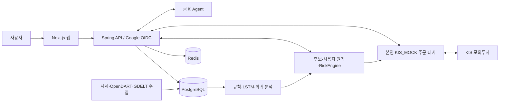

# MARS — 투자 원칙 검증형 AI 모의 자동매매

부산대학교 정보컴퓨터공학부 3인 졸업과제입니다. 국내 주식·금 ETF의 가격, 공시, 뉴스, 모델 신호를 검토하고 **사용자 본인의 KIS 모의투자 계좌**에서 원칙과 위험 검사를 통과한 주문만 실행하도록 설계했습니다. 후보, 판단, 주문, 체결·잔고 대사는 각각 다른 결과로 보여 줍니다.

> **검증 경계**: 이미지 발행과 컨테이너 기동은 실제 Google 로그인, KIS 계좌 인증, 주문 체결이나 수익성의 입증과 다릅니다. 릴리스의 `serviceReady=false`는 이를 명시합니다. KIS 실전투자와 NAS 자동 배포는 범위 밖입니다.

| 제품 | 접근 방식 | 제공 범위 |
|---|---|---|
| [DEMO](https://hub.docker.com/r/pjjpjj111/mars-demo) | 로그인 없음 | 출처를 붙이는 제한된 금융 Agent. 계좌·주문·자동운용 없음 |
| [FULL](https://hub.docker.com/r/pjjpjj111/mars-full) | Google OIDC | USER 자동 생성, 사용자별 암호화 KIS_MOCK 자격증명, 원칙·자동운용·대사 |

[GitHub 최신 Release](https://github.com/robinhood0107/Capstone-AI-Trading-Coach/releases/latest)의 `mars-images.json`과 `mars-public-*.compose.yml`이 이미지 세트의 기준입니다. Compose는 이동하는 태그 대신 **SHA-256 digest**로 이미지를 고정합니다. 2026-09-24 [`v0.1.0-d3248c1e7c9a`](https://github.com/robinhood0107/Capstone-AI-Trading-Coach/releases/tag/v0.1.0-d3248c1e7c9a)의 공개 이미지 8개 digest를 Release manifest와 대조했습니다. 이후 Release는 각 버전의 manifest로 검증해야 합니다.

## 1. 프로젝트 배경

### 1.1. 국내외 시장 현황 및 문제점

[KIS Developers](https://apiportal.koreainvestment.com/apiservice-summary), [OpenDART](https://opendart.fss.or.kr/), [GDELT](https://gdeltproject.org/data.html)처럼 시세·공시·세계 사건의 원천은 여럿입니다. 이들을 결합할 때 수집 시각, 결측과 미발행, 종목 연결, 주문 전 계좌 상태가 일치해야 합니다. 과거 수익률만 제시하면 거래비용, 생존편향, 실제 주문·체결 여부를 놓치기 쉽습니다.

### 1.2. 필요성과 기대효과

초보 사용자가 **왜 후보가 생겼는지 → 어떤 원칙이 통과했는지 → 실제 모의주문과 대사가 어떻게 끝났는지** 확인하도록 돕습니다. 근거가 없으면 값을 꾸미지 않고 `HOLD`·`ABSTAIN`·차단 사유를 남깁니다. 기대효과는 투자 판단 과정을 학습하는 것이며 수익 개선은 검증 결과로 주장하지 않습니다.

## 2. 개발 목표

### 2.1. 목표 및 세부 내용

1. 시세·공시·뉴스의 출처, 기준 시각, 품질을 기록한다.
2. 규칙, LSTM, 회귀 연구 결과를 같은 계약으로 비교한다. 모델에는 주문 권한을 주지 않는다.
3. 사용자 원칙과 결정적 RiskEngine을 거쳐 주문 후보·수량·허용을 분리한다.
4. Google 계정마다 본인 KIS_MOCK 키와 계좌를 암호화·격리한다.
5. 제한 Agent DEMO와 계좌 기능 FULL을 별도 제품·볼륨으로 제공한다.

현재 계약은 [최종 프로젝트 명세](docs/최종_프로젝트_명세서.md)와 [API 명세](docs/API_명세서.md)를 따릅니다. 계획과 아래에서 **실제로 관찰한 검증 범위**를 구분합니다.

### 2.2. 기존 서비스 대비 차별성

MARS는 모델의 BUY를 주문 성공으로 표현하지 않습니다. 후보 생성, RiskEngine 판정, KIS 주문 접수, 체결, 계좌 대사의 증거를 나눠 기록합니다. Agent는 설명을 제공하지만 주문을 결정하지 않습니다. 다른 서비스와의 성능 우위는 같은 조건에서 측정하지 않았으므로 주장하지 않습니다.

### 2.3. 사회적 가치 도입 계획

실제 자금을 사용하지 않는 모의투자와 출처·위험 근거를 통해 금융 학습을 돕습니다. 장기 검증에서 기준 미달 모델을 `BELOW_BASELINE`로 공개하는 것도 학습상의 안전 장치입니다. 환경·경제적 효과는 정량 측정하지 않았습니다.

## 3. 시스템 설계

### 3.1. 시스템 구성도



Decision Platform은 최종 판단과 주문을 맡고, Return Engine은 LSTM·규칙 baseline·백테스트 원천 산출물을 생산하며, Experience Dashboard는 이 결과를 보여 줍니다. 세 영역의 입출력은 [계약](contracts/)으로 연결합니다.

### 3.2. 사용 기술

| 계층 | 기술·역할 |
|---|---|
| 웹 | TypeScript, React, Next.js |
| API·판단 | Java 25, Kotlin, Spring Boot, Flyway, RiskEngine |
| 수집·분석 | Python 3.12, uv, pandas/NumPy, PyTorch LSTM, 회귀 연구, LangGraph |
| 저장·조정 | PostgreSQL·pgvector, Redis |
| 발행 | Docker Compose, GitHub Actions, Docker Hub, digest 고정 Release |

## 4. 개발 결과

### 4.1. 전체 시스템 흐름도

```text
수집·품질검사 → 기준 시각 feature → 규칙/모델 신호 → 후보
→ 사용자 원칙·위험 검사 → 본인 모의주문/차단 → 체결·잔고 대사 → 화면·기록
```

세계 뉴스는 사용자에게 보여 주는 **참고 자료**이며 종목 판단·주문의 직접 입력이 아닙니다. GDELT 파일 미발행과 OpenDART 일일 호출 예산 초과는 실패를 숨기거나 우회하지 않고 별도로 기록합니다.

### 4.2. 기능 설명 및 주요 기능 명세서

| 기능 | 입력 | 출력·권한 |
|---|---|---|
| DEMO Agent | 금융 질문 | 제한된 설명과 출처. 로그인·계좌·주문 없음 |
| FULL 인증 | Google OIDC 응답 | 검증된 Google subject에 결속된 USER. 외부 password 로그인 차단 |
| KIS_MOCK 연결 | 본인 App Key·Secret·계좌번호 | 암호화 저장·연결 확인. 사용자 간 계좌 재사용 금지 |
| 수집기 | 일봉·공시·GDELT 파일 | 시각·품질·미발행을 구분한 데이터 |
| 예측·후보 | 완료된 feature, 규칙/LSTM/회귀 신호 | 비교 가능한 예측·후보. 모델의 주문 권한 없음 |
| 자동운용 | 본인 정책·계좌·후보·시세 | 위험 검사 결과, 허용 주문 또는 차단 사유, 사용자별 대사 |
| 금융 Agent | 질문·허용된 근거 | 출처를 단 설명 또는 근거 부족 응답 |

**면접·보고서 수치의 정확한 뜻**

| 수치 | 원본 조건과 판정 |
|---|---|
| `55.8% → 1.4%` | [규칙 평가](workspaces/decision-platform/research/p1-return-profit-verification/rule_baseline_eval.py)의 골든크로스 `event` → 장기 추세 `trend_only` 변경 시 **매수 후보가 없는 날**의 비율. 다른 보존 입력으로 재실행하면 `55.7% → 1.4%`였고 원래 `55.8%` 입력은 확인 전입니다. 수익률이 아닙니다. |
| `51.8% → 1.4%` | [결합 평가](workspaces/decision-platform/research/p1-return-profit-verification/consensus_eval.py)의 `RULE BUY ∧ LSTM BUY` → `RULE BUY ∧ LSTM != SELL` 변경 시 31종목·5,362세션에서 **후보가 없는 세션**의 비율입니다. [구현 커밋](https://github.com/robinhood0107/Capstone-AI-Trading-Coach/commit/cc91b82a3f7c1dfb54150124aa69349fefb4b120)은 확인했으나 옛 입력 스키마가 보존되지 않아 동일 재실행은 아직 못 했습니다. 수익률·정확도가 아닙니다. |
| `BELOW_BASELINE` | [22-fold 검증](workspaces/decision-platform/research/p1-return-profit-verification/reports/profit-verification.md)의 모델 채택 판정입니다. 21년 균등가중 benchmark의 수익·Sharpe를 LSTM이나 실서비스 수익으로 쓰지 않습니다. |

별도 보고서·영상의 13거래일 손익표, RAG `25.6초→416ms`, 예시 차트의 CAGR은 원본 측정 조건과 실행 자료가 충분히 대조되지 않아 이 README의 성능 근거에서 제외합니다. 후보, 주문 접수, 체결, 잔고 증감, 수익성은 각각 별도로 입증해야 합니다.

**2026-09-24 발행 이미지에서 관찰한 범위**: 빌드·발행 gate는 [승격 PR #125](https://github.com/robinhood0107/Capstone-AI-Trading-Coach/pull/125)의 검사 결과로, 이미지 신원은 [Release manifest](https://github.com/robinhood0107/Capstone-AI-Trading-Coach/releases/tag/v0.1.0-d3248c1e7c9a)로 확인할 수 있습니다. 컨테이너·공급자 관찰은 해당 이미지에서 수행한 단회 실행이며 장기 안정성 측정이 아닙니다.

| 항목 | 확인한 결과 | 아직 입증하지 못한 결과 |
|---|---|---|
| 발행 | develop→main PR의 8개 gate 통과, 공개 이미지 8개 digest 대조 | NAS 운영 준비 |
| DEMO | digest 고정 컨테이너 healthy, 제한 Agent 답변 HTTP 200·출처 1개, 계좌/주문 비인증 401 | 모든 질문의 품질 |
| FULL | 보존한 PostgreSQL 볼륨 V184→V210 이행, API·웹·gRPC healthy, OIDC 시작 302 | 실제 Google callback 완료 |
| Return 추론 | 이미지의 Team B 모델에 31개 합성 feature 요청 → 예측 31개, `orderAuthority=NONE` | 실거래 성과 |
| GDELT | 한 bounded 실행에서 파일 40개 시도·물리 호출 40회·문서 350건 저장, 미발행 36건 | 전체 파일 수집 완료 |
| OpenDART | 별도 깨끗한 DB에서 3회 호출해 법인 매핑 29행 저장 | 공시 이벤트 완주 |
| 일일 시세 | 기존 볼륨에서 `UP_TO_DATE`, 신규 세션·호출 0 | 새 거래일의 시세 갱신 |
| focused 테스트 | Spring 인증·계좌 격리 18개, Python 수집·자동운용 62개 통과 | 서로 다른 실제 사용자 두 명의 주문 격리 |

실제 Google 로그인, UI에서 입력한 KIS_MOCK 계좌 인증, 주문·체결·잔고 대사, N=10/50/100 동시 09:30 부하는 아직 완료 증거가 없습니다. 시험 NAS의 사양을 최종 사용자 수의 상한으로 쓰거나 측정 전 서버 사양을 단정하지 않습니다.

### 4.3. 디렉터리 구조

```text
contracts/                         팀 간 입출력 계약
workspaces/decision-platform/      API·수집·원칙·위험 검사·자동운용
workspaces/return-engine/          검토 후 수신한 Return 코드·산출물
workspaces/experience-dashboard/   사용자 웹 화면
deploy/p1/                         Compose·이미지·발행 검증
docs/                              공개 명세와 검증 문서
```

`private-reference/`는 비공개 연구·면접 자료이며 Git과 공개 이미지에 포함하지 않습니다.

### 4.4. 산업체 멘토링 의견 및 반영 사항

멘토링 원본은 아직 받지 못했습니다. 자료를 받은 뒤 날짜·의견·관련 변경 이력과 함께 작성합니다.

## 5. 설치 및 실행 방법

### 5.1. 설치 절차 및 실행 방법

Docker Engine·Compose v2와 제품별 별도의 비밀 파일 디렉터리가 필요합니다. 공개 이미지는 `linux/amd64`입니다. 비밀값 파일은 Compose가 자동 생성하지 않습니다.

1. [최신 Release](https://github.com/robinhood0107/Capstone-AI-Trading-Coach/releases/latest)의 `mars-images.json`과 실행할 제품의 `mars-public-*.compose.yml`을 **같은 Release**에서 받습니다.
2. manifest의 `sourceSha`·이미지 8개 `digest`와 Compose의 `@sha256:`를 대조합니다. 태그는 탐색용이며 실행 기준은 digest입니다.
3. [DEMO Compose](deploy/p1/compose.public-demo.yml) 또는 [FULL Compose](deploy/p1/compose.public-full.yml)의 `secrets`·`environment`에 명시된 파일·설정을 운영자만 준비합니다. 비밀값·계좌번호·OAuth secret을 Git·채팅·로그에 남기지 않습니다.
4. 비밀이 아닌 `.env`에 DEMO는 `MARS_DEMO_SECRET_GID`, `MARS_DEMO_SECRETS_DIR`, `MARS_VERTEX_MODEL_ID`; FULL은 `MARS_FULL_SECRET_GID`, `MARS_FULL_SECRETS_DIR`, `MARS_FULL_BROKERAGE_KEK_DIR`, `MARS_BROKERAGE_DB_CAPABILITY_TOKEN_SHA256`, `MARS_VERTEX_MODEL_ID`, `MARS_VERTEX_PROJECT_ID`를 설정합니다. 파일 소유자·그룹은 Compose의 읽기 권한과 일치해야 합니다.
5. 선택 제품을 실행합니다.

```bash
docker compose --env-file .env -f mars-public-demo.compose.yml config --quiet
docker compose --env-file .env -f mars-public-demo.compose.yml up -d --wait
# FULL 사용 시 파일명을 mars-public-full.compose.yml로 바꿉니다.
```

기본 웹 포트는 DEMO `127.0.0.1:3001`, FULL `127.0.0.1:3002`입니다. 외부 접속에는 별도 TLS reverse proxy가 필요합니다. 제품별 Compose 프로젝트·secret·볼륨은 분리합니다. 볼륨을 유지하려면 `docker compose down`만 사용하고 `-v`는 사용하지 않습니다. FULL의 `disclosure-collector`는 `collectors` profile을 명시할 때만 실행됩니다.

**Google 로그인**: Google Cloud의 Web OAuth client에 origin `https://mars.royaljellynas.org`, redirect URI `https://mars.royaljellynas.org/api/v1/auth/oidc/callback/google`를 정확히 등록합니다. Client ID·Secret은 서버의 `mars-public-full.env`에 `GOOGLE_OIDC_CLIENT_ID`·`GOOGLE_OIDC_CLIENT_SECRET`으로 보관합니다. 첫 로그인 때 일반 USER가 생성됩니다. [Google OAuth 안내](https://developers.google.com/identity/protocols/oauth2/web-server)에 따라 테스트 사용자와 공개 범위를 확인합니다.

**ADMIN 지정**: 이메일 문자열을 직접 ADMIN으로 등록하지 않습니다. 본인 Google 계정으로 먼저 로그인하고 서버 `google_oidc_identities`에서 검증된 Google subject의 SHA-256을 조회해 `GOOGLE_OIDC_ADMIN_SUBJECT_SHA256`에 설정합니다. API 재시작 후 다시 로그인합니다. subject와 해시는 채팅·PR에 붙이지 않습니다.

**KIS 연결**: FULL 웹의 **설정**에서 본인이 준비한 KIS_MOCK App Key·Secret·계좌번호를 입력하고 연결 확인을 합니다. 브로커리지 전용 키로 암호화되며 본인 actor에 결속됩니다. 두 사용자 격리는 서로 다른 Google USER와 서로 다른 모의계좌에서 각각 연결·운용·대사를 확인해야 최종 인증됩니다. 외부 password 로그인은 제공하지 않습니다.

AI provider 사용량과 추정 비용은 계측하지만 MARS 자체의 일일 비용 hard cap으로 차단하지 않습니다. 실제 무료 사용량·과금·쿼터는 Vertex/Voyage 계정 설정에 따릅니다.

### 5.2. 오류 발생 시 해결 방법

| 증상 | 확인할 항목 |
|---|---|
| Compose 설정 오류 | 필수 환경변수, secret 파일 경로·권한 |
| API unhealthy | PostgreSQL·Redis·actor-authority 상태, migration 결과 |
| Google callback 실패 | HTTPS origin·redirect URI의 정확한 문자열, OAuth 테스트 사용자 |
| KIS 연결 실패 | 본인 모의투자 자격증명·계좌, KIS 상태·호출 제한 |
| 수집 0건 | 신규 거래 세션, GDELT 파일 발행, OpenDART 일일 예산 |
| 주문 0건 | 후보·시세·계좌·원칙·RiskEngine의 단계별 사유. 0건 자체는 장애가 아님 |

복구를 위해 DB 볼륨을 지우지 마세요. 기존 데이터 이행 전에는 백업과 migration 결과를 확인합니다.

**소스 체크아웃에서 개발할 때**: 공개 이미지 실행과 달리 기존 개발 DB를 직접 이행한다면 인증용 DB role을 Flyway보다 먼저 준비합니다. 저장소 루트에서 `docker compose --env-file .env -f infra/docker-compose.infra.yml run --rm role-bootstrap`를 실행한 다음 Spring API 디렉터리에서 `./gradlew bootRun`을 실행합니다. 이 순서가 빠지면 이미 존재하는 DB의 migration이 인증 role을 찾지 못할 수 있습니다.

`S3.3` 체결 대사에서 KIS_MOCK fill observation은 `decision_fill_writer` DB role이 추가합니다. 관련 migration 경계는 `V6/V9/V14`이며, 조회·대사 API 계약은 [API 명세](docs/API_명세서.md)에 있습니다. 이 개발 role을 공개 FULL의 사용자 계좌 권한으로 해석하지 않습니다.

## 6. 소개 자료 및 시연 영상

### 6.1. 프로젝트 소개 자료

발표 PPT 원본을 아직 받지 못했습니다. 제공받으면 공개 가능 여부와 수치의 원본 실험을 대조해 연결합니다.

### 6.2. 시연 영상

[팀 MARS 시연 영상](https://www.youtube.com/watch?v=CU7284u1rk0)은 당시 기능을 소개합니다. 영상은 최신 이미지의 Google/KIS 인증이나 수익성 검증 자료가 아닙니다. 화면 속 단기 손익표와 예시 차트는 서로 다른 조건이므로 합쳐 해석하지 않습니다.

## 7. 팀 구성

### 7.1. 팀원별 소개 및 역할 분담

| 팀원 | 역할 |
|---|---|
| 박종진 | PM·Decision Platform 백엔드, 투자 원칙·RiskEngine·KIS 연동, 규칙/모델 결합 평가, LightGBM 연구 |
| 조민수 | Return Engine, LSTM·규칙 baseline·백테스트 원천 산출물 |
| 박재영 | Experience Dashboard, 모델 비교·주문 검토·자동운용 화면 |

팀 결과와 개인 기여를 구분합니다. LSTM 학습은 박종진 개인 성과로 표시하지 않습니다.

### 7.2. 팀원별 참여 후기

각 팀원이 직접 작성한 후기 원본을 아직 받지 못했습니다. 받은 뒤 당사자 확인을 거쳐 기재합니다.

## 8. 참고 문헌 및 출처

- [부산대학교 캡스톤 README 기준](https://github.com/pnucse-capstone2026/capstone-2026-team-33)
- [KIS Developers API](https://apiportal.koreainvestment.com/apiservice-summary), [OpenDART](https://opendart.fss.or.kr/), [GDELT 데이터](https://gdeltproject.org/data.html)
- [프로젝트 명세](docs/최종_프로젝트_명세서.md), [API 명세](docs/API_명세서.md), [규칙 평가](workspaces/decision-platform/research/p1-return-profit-verification/rule_baseline_eval.py), [결합 평가](workspaces/decision-platform/research/p1-return-profit-verification/consensus_eval.py), [Return 판정](workspaces/decision-platform/research/p1-return-profit-verification/reports/profit-verification.md)
- [모의 자동운용 PR](https://github.com/robinhood0107/Capstone-AI-Trading-Coach-archive/pull/175), [LSTM 런타임 PR](https://github.com/robinhood0107/Capstone-AI-Trading-Coach-archive/pull/194), [Ridge·운용 PR](https://github.com/robinhood0107/Capstone-AI-Trading-Coach-archive/pull/211), [공개 이미지 승격 PR](https://github.com/robinhood0107/Capstone-AI-Trading-Coach/pull/125)

PR은 구현 이력이고 수익률 측정 원본은 아닙니다. 비공개 연구와 자소서 원본은 공개 저장소에 올리지 않습니다.
