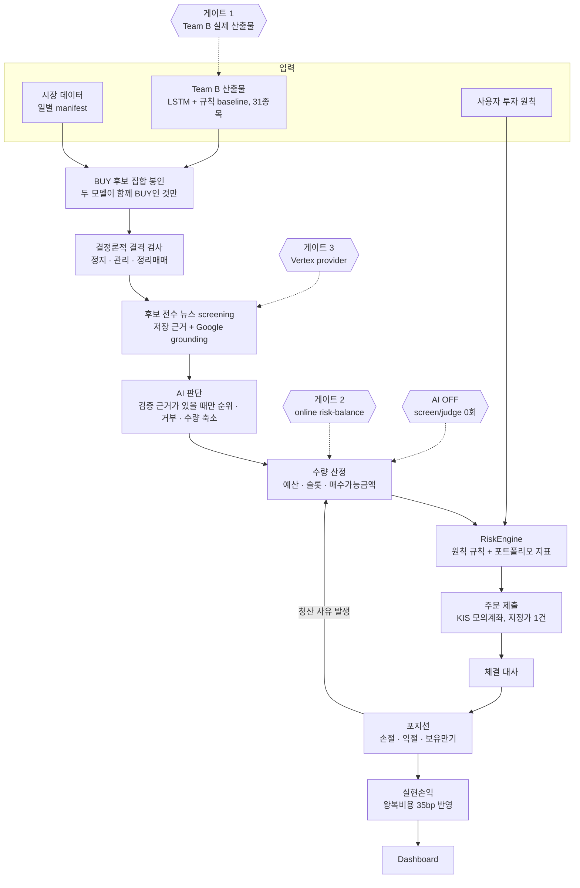

# Capstone AI Trading Coach

<!-- P1_FULL_APP_V3_AUTHORITY_BEGIN -->
> **현재 상태 (2026-08-31):** Automation V3 구현 기준 root OpenAPI는 exact-75,
> Team A handoff는 exact-45, migration은 V115입니다. 사용자 보유 만기·Wilder ATR trailing
> stop·MODEL_SELL 설정과, 전체 후보를 먼저 검증하는 evidence-first AI 원장, 격리 장외 전수
> replay가 추가됐습니다. 이 구현 자체는 live grounding, KIS read-only bootstrap, 장중 KIS Mock,
> 실제 3-session soak를 PASS로 만들지 않습니다. 기존 8월 31일 관측 영수증은 legacy 기능의
> 역사적 증거로 보존하며 V3 현재 실행 증거로 재사용하지 않습니다. 실계좌 주문 권한은 0이고
> `P1_FINAL=NOT_READY`입니다.
<!-- P1_FULL_APP_V3_AUTHORITY_END -->

투자 원칙, 모델 예측, 백테스트, 위험 판정과 근거 자료를 한 화면에서 보고 한국투자증권 **모의투자**
계좌로 주문 흐름을 검증하는 교육용 트레이딩 코치입니다. 실계좌 주문·정정·취소 경로는 코드에
존재하지 않습니다.

## 전체 흐름



세션 하루는 09:30에 평가하고 09:40까지만 새 주문을 내며 15:20에 미체결을 취소합니다. 한 세션에
논리 주문 1건, 동시 보유 5종목이 상한입니다. 모든 tick은 DB checkpoint에 CAS로 기록되므로 중간에
꺼졌다 켜져도 같은 자리에서 이어집니다.

## 지금 켜져 있는 것과 꺼져 있는 것

| 기능 | 상태 | 비고 |
|---|---|---|
| Dashboard, 원칙, 위험 판정, 저널 | 동작 | 외부 호출 없음 |
| RAG 검색·근거 표시 | 동작 | 로컬 BGE-M3 임베딩 |
| RAG 생성형 답변(Vertex·Voyage) | 서비스계정이 있으면 동작 | 없으면 검색만 켜고 뜬다 |
| AI 판단(근거 screening·순위·거부·수량 축소) | 구현, 기본 OFF | AI OFF는 provider 0회 규칙 경로. AI ON은 provider/credential/budget이 없으면 arm 또는 신규매수를 차단 |
| Strong LLM 설정 화면 | 동작 | provider·모델·언어·하루 횟수. 키는 마지막 네 글자만 보인다 |
| Team B 신호 | 미리보기 | 실제 산출물 수신 전 |
| KIS 모의계좌 시세·잔고·주문 | 동작 | `mock` 명령으로만 |
| 자동운용 실행 | 차단 | 위 게이트 3개 |

AI가 할 수 있는 것은 후보의 **순위를 바꾸고, 매수를 막고, 수량을 줄이는** 셋뿐입니다. 후보 집합
밖의 종목을 넣거나, 수량을 늘리거나, 정책 상한을 넘거나, 주문을 직접 만들 수는 없습니다. 배분은
언제나 코드가 정수 산술로 계산하므로 같은 입력에는 같은 수량이 나옵니다.

**프로그램을 켜 둔다고 주문하지 않습니다.** 예약 작업은 내부 큐 처리, 상태 집계, 오래된 RAG 이력
정리뿐입니다. 실제 주문을 내는 명령은 `./capstone mock certify` 하나입니다.

## 5분 실행

### 준비물

| 무엇 | 왜 | 확인 |
|---|---|---|
| Git | 저장소 | `git --version` |
| Docker Engine 또는 Docker Desktop | 전체 스택 | `docker version` |
| Docker Compose v2 | `deploy/p1/compose.yml` | `docker compose version` |
| Python 3 (WSL/Linux) | `./capstone` 내부 스크립트 | `python3 -V` |
| OpenSSL | 첫 실행의 비밀값 생성 | `openssl version` |
| WSL (Windows만) | Linux 경로에서 Docker를 부른다 | `wsl -l -v` |

기본 앱을 켜는 데 **API 키는 하나도 필요 없습니다.** `.env`도 만들지 않아도 됩니다. 첫 실행이
`deploy/p1/.state-app/` 아래에 필요한 비밀값을 직접 만듭니다.

아래는 기본 앱을 넘어설 때만 필요합니다. 없으면 그 기능만 꺼진 채로 뜹니다.

| 무엇 | 어디에 넣나 | 없으면 |
|---|---|---|
| KIS 모의투자 App Key · Secret · 계좌번호 | `./capstone mock configure`가 물어본다 | `mock` 명령 전체가 닫힌다 |
| Vertex 서비스계정 JSON | `deploy/p1/.state-app/secrets/pre-s5-vertex-service-account.json` (0600) | RAG 생성형 답변과 AI 판단이 "미참여"로 간다 |
| `STRONG_LLM_GRPC_SHARED_SECRET` | `deploy/p1/.state-app/secrets/rag-v2.env` | Strong LLM 판단 경로가 붙지 않는다 |
| `VOYAGE_API_KEY` | 같은 파일 | RAG v2 검색이 로컬 임베딩만 쓴다 |

값의 전체 목록과 형식은 [환경 변수 참고 문서](docs/decision-platform/P1_ENV_REFERENCE.md)와
저장소 루트의 `.env.example`에 있습니다. `.env.example`을 복사해 `.env`를 만드는 것은 S1.6
OpenDART·ECOS 같은 **수집기**를 직접 돌릴 때만 필요하고, 기본 앱과 대시보드에는 쓰이지 않습니다.

### 실행

```bash
git switch main
git pull --ff-only origin main
./capstone doctor
./capstone up
```

Windows PowerShell에서는 `.\capstone.ps1 doctor`, `.\capstone.ps1 up`으로 실행합니다.

`CAPSTONE_UP=PASS`가 보이면 완료입니다. 첫 실행은 이미지를 만들고 공개 Seed DB를 준비하므로
시간이 걸립니다.

```text
Dashboard        http://127.0.0.1:3000
Dashboard Health http://127.0.0.1:3000/healthz
API Health       http://127.0.0.1:18080/actuator/health
Swagger UI       http://127.0.0.1:18080/swagger-ui.html
```

로그인 아이디는 `demo-user`이고 임시 비밀번호는 첫 실행 때 로컬에 생기는 아래 파일에서만 봅니다.
이 파일은 Git에 올라가지 않습니다.

```text
deploy/p1/.state-app/secrets/demo-user.password
```

## 자주 쓰는 명령

```bash
./capstone up             # 기본 5개 컨테이너
./capstone up --models    # 모델 포함 7개 컨테이너
./capstone status         # 현재 모드와 상태 확인
./capstone logs           # 민감값을 가린 로그 확인
./capstone smoke          # 로그인과 내부 작업 흐름 확인, 외부 호출 없음
./capstone down           # 종료하되 DB·Redis·모델 데이터는 보존
```

기본 5개는 PostgreSQL, Redis, 권한 서비스, 통합 백엔드, Dashboard입니다. 모델 모드는 공식 BAAI
BGE-M3 컨테이너와 공식 llama.cpp 기반 PaddleOCR-VL 컨테이너를 더합니다. 준비 작업은
`docker compose run --rm`으로 실행하므로 끝난 컨테이너를 남기지 않습니다. 모든 서비스 정의는
`deploy/p1/compose.yml` 하나가 기준입니다.

## Owner만 하는 KIS 모의투자 검증

여기서 계좌와 주문은 모두 **KIS 모의투자 계좌**를 뜻합니다. 처음 한 번은 반드시 기본 앱을 먼저
실행합니다.

```bash
./capstone up
./capstone mock configure
./capstone mock doctor

# XKRX 거래일 09:10~15:00 KST에만 실행
./capstone mock certify --symbol 005930 --quantity 1

# 모델이 필요 없으면 5개, 필요하면 7개
./capstone up --mock
./capstone up --models --mock
```

`mock doctor`는 자격증명 파일의 형식과 권한만 확인합니다. `mock certify`는 XKRX 거래시간 창과
`--symbol 005930 --quantity 1` 범위, 물리 호출 상한을 확인한 뒤 현재가 1회와 모의계좌 작업
7회를 수행합니다. 주문·취소는 재시도하지 않습니다. 취소 실패나 부분체결이 나오면 자동으로
매도하거나 다시 주문하지 말고 KIS 모의투자 화면에서 직접 확인해야 합니다.

**인증 영수증이 말하는 것과 말하지 않는 것.** 영수증(`deploy/p1/.state-app/mock/certification.json`)은
"그 시각 거래시간에 KIS 모의 원장에서 왕복이 실제로 일어났다"를 말합니다. 물리 호출 수와 세션
날짜, 그때의 `commitSha`가 남습니다. 반면 "그 코드가 CI를 통과했다"는 말하지 않습니다. 예전에는
PR 초록과 clean worktree를 함께 확인했지만, e2e를 한 번 돌리면 git이 추적하는 판정표 JSON이
갱신되어 방금 받은 인증이 그 자리에서 무효가 됐기 때문에 그 조건들을 뺐습니다. 자동운용 arm의
열쇠 역할은 그대로여서, 영수증이 없으면 `CERTIFICATION_INVALID`로 닫힙니다.

이 인증을 통과해도 자동 주문 스케줄러가 생기지는 않습니다.

## Team B 결과가 미리보기인 이유

현재 화면의 Team B 결과는 받은 CSV와 PTH를 외부 네트워크 없이 실행한 미리보기입니다. 화면의
`TEAM_B_REAL_ARTIFACT_MISSING`은 오류가 아니라 "Team B가 고정된 결과 파일 10개를 아직 전달하지
않았다"는 뜻입니다.

## 팀원에게 보낼 문서

팀마다 아래 문서 하나만 전달합니다. 이전 요청서와 V3 추가계약은 역사적·기술 참고자료로 남기며
팀원에게 따로 보낼 필요가 없습니다.

- **[Team A 최종 통합 요청서](docs/handoff/P1_TEAM_A_최종_통합_요청서.md)** — 기존 Dashboard를
  유지하면서 빠진 주문·자동운용 V3·근거·학습일지 흐름만 연결합니다.
- **[Team B 최종 통합 요청서](docs/handoff/P1_TEAM_B_최종_통합_요청서.md)** — 기존 LSTM·rule·백테스트를
  유지하면서 exact-10과 daily inference만 완성합니다.

Owner는 결과를 받은 뒤
[Team A/B 수신 후 통합 체크리스트](docs/decision-platform/P1_TEAM_A_B_수신_후_통합_체크리스트.md)를
사용합니다.

Team A와 Team B는 `mock configure`나 `mock certify`를 실행하지 않습니다.

## 문제가 생기면

| 증상 | 확인할 것 |
|---|---|
| 코드를 고쳤는데 반영이 안 됨 | `./capstone up`을 다시 실행해 이미지를 재빌드 |
| `./capstone` 파일이 없음 | 통합 PR의 main 병합 안내를 받았는지 확인 |
| Docker 연결 오류 | Docker를 켠 뒤 `./capstone doctor` |
| 포트 3000 또는 18080 충돌 | 해당 포트를 쓰는 기존 프로그램 종료 |
| Dashboard가 준비되지 않음 | `./capstone status`, `./capstone logs` |
| 모델 첫 실행이 오래 걸림 | 고정된 모델을 처음 내려받고 검사하는 중 |
| Team B 실제 결과 경고 | 미리보기는 정상이며 결과 수신 전까지 경고 유지 |
| KIS 모의투자 명령 거부 | 기본 앱 실행, 자격증명, 거래일·시간(09:10~15:00 KST), `--symbol 005930 --quantity 1` 확인 |
| Kotlin 통합 테스트 6건이 죽음 | `PATH`에 `uv`가 있는지. 없으면 `S7 DB E2E requires the frozen uv Python runtime` |
| OpenAPI 게이트가 포트 충돌 | 스택이 18080을 쓴다. `--server-port 18099 --fixture-port 55499` |
| `docs/` 문서를 고쳤더니 CI가 깨짐 | pre-S5 freeze는 `docs/` 하위 기존 md의 수정을 막는다. 새 파일을 만든다 |
| AI 판단이 계속 "미참여" | Vertex 서비스계정(0600)과 `STRONG_LLM_GRPC_SHARED_SECRET`이 있는지 |

자세한 복구 절차는 [동일 환경 재현 가이드](docs/decision-platform/P1_GIT_PULL_동일환경_재현_가이드.md),
환경값 목록은 [환경 변수 참고 문서](docs/decision-platform/P1_ENV_REFERENCE.md)에 있습니다.

## 최종 배포 전에 남은 일

1. Team A가 exact-45 화면 계약을 실제 Spring과 연결하고 근거 상세 UI를 증명합니다.
2. Team B가 기존 exact-10 계약의 실제 모델·백테스트 산출물을 전달합니다.
3. 별도 승인을 받아 exact-31 KIS Live read-only bootstrap과 historical replay를 수행합니다.
4. 별도 승인을 받아 Google grounding probe와 실제 장중 KIS Mock 주문·대사를 수행합니다.
5. 실제 날짜가 지난 뒤 연속 3 XKRX session soak를 별도 PASS로 닫습니다.
6. 전체 CI, fresh clone, restore, 공급망 검증과 post-merge main CI 뒤에만 최종 배포를 승인합니다.

장외 replay 명령과 게이트 구분은
[P1 장외 전수 replay](docs/decision-platform/P1_AFTER_HOURS_FULL_REPLAY.md), V3 판단/청산 규칙은
[Automation V3 설계](docs/decision-platform/P1_AUTOMATION_V3_AI_EVIDENCE_EXIT_POLICY.md)를 따릅니다.

```text
CODEX_SECURITY_DEEP_SCAN=NOT_RUN_USER_SCOPED_OUT
KIS_LIVE_BROKERAGE_CALLS=0
```

<!-- 보존된 Pre-S5 공개 계약 marker. 현재 주문 권한을 만들지 않는다.
PRE_S5_DOC_TRUTH_FREEZE_ADDENDUM_VERIFIED
PRE_S5_EXECUTION_OWNER=DECISION_PLATFORM
PLAN_FEASIBILITY=GO_WITH_EXTERNAL_HARD_GATES
S4_8A=CONTRACT_LOCKED
S4_8B_C=IMPLEMENTED_MERGE_CANDIDATE
-->

<!-- 역사적 source-development 회귀 marker. 일반 사용자는 위 ./capstone 명령만 사용한다.
docker compose --env-file .env -f infra/docker-compose.infra.yml run --rm role-bootstrap
./gradlew bootRun
market_quote_observations
instrument_catalog_observations
portfolio_balance_observations
portfolio_position_observations
provider를 직접 호출하지 않는다
production 운영 seed는 가짜 값으로 대체하지 않으며 증거가 없으면 HOLD
decision_fill_writer
V6/V9/V14
-->
