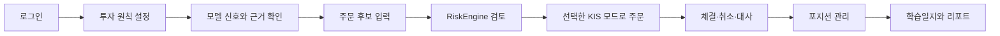
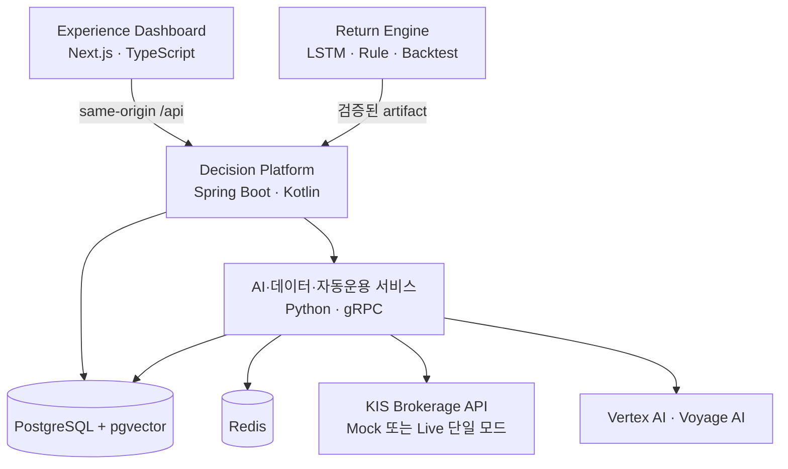

# 투자 원칙 기반 AI 자동매매 봇·트레이딩 코치

한국투자증권 **투자계좌를 직접 등록**해 모델 신호와 뉴스 근거를 검토하고, 사용자 원칙을
통과한 종목의 매수부터 청산·취소·체결 대사까지 수행하는 AI 자동매매 봇입니다. 내부 숫자만 바꾸는
화면 데모가 아니라 KIS 모의투자 API로 주문 가능 금액과 계좌를 조회하고 실제 모의주문을 전송합니다.

계좌 연동은 시작할 때 `KIS_BROKERAGE_MODE=mock|live` 중 하나만 선택합니다. 두 모드는 같은 주문,
RiskEngine, 취소, 체결과 대사 로직을 사용하며 동시에 실행하거나 실패 시 서로 전환하지 않습니다.

> 이 프로젝트는 자동매매로 수익을 약속하는 프로그램이 아닙니다. 모의투자 과정을 통해 투자 판단의
> 근거, 위험과 결과를 직접 확인하고 학습할 수 있도록 돕는 트레이딩 코치입니다.

## 처음 실행하기

외부 API key나 `.env` 없이도 Dashboard와 실제 PostgreSQL 기반 데모 데이터를 먼저 확인할 수 있습니다.

```bash
git clone https://github.com/robinhood0107/Capstone-AI-Trading-Coach.git
cd Capstone-AI-Trading-Coach
./capstone doctor
./capstone up
```

`CAPSTONE_UP=PASS`가 출력되면 <http://127.0.0.1:3000>에 접속합니다.

- 아이디: `demo-user`
- 비밀번호: 최초 실행 때 생성되는 `deploy/p1/.state-app/secrets/demo-user.password` 파일의 값

이 상태에서 홈, 금융 Agent, 투자 원칙, 전략 검증, 자동운용 현황, 주문 검토, 학습일지와 보고서를
탐색할 수 있습니다. 화면은 synthetic 응답을 만들지 않고 DB에 적재된 최신 결과를 사용하며, 계산할
근거가 없는 값은 `0`으로 꾸미지 않고 미제공 상태로 표시합니다.

자신의 KIS 모의투자 계좌로 자동운용까지 실행하려면 KIS Developers에서 App Key, App Secret과
하이픈을 제외한 계좌번호를 준비한 뒤 아래 순서로 진행합니다.

```bash
./capstone mock configure
./capstone mock doctor
./capstone up --mock
./capstone mock gate-author
./capstone mock readiness
./capstone mock start
```

`MOCK_READINESS=PASS`와 `MOCK_START=PASS`가 출력되어야 다음 XKRX 세션이 예약됩니다. 처음 계좌를
연결한 환경은 거래시간에 `mock certify`가 한 번 필요할 수 있으며, 이 명령은 실제 KIS 모의주문과
취소를 수행합니다. 자세한 조건은 아래 **KIS 투자계좌 연결과 자동매매 시작**을 따릅니다. KIS Live는
별도 명시적 설정 없이는 실행되지 않습니다.

## 프로젝트 목표

금융 정보와 모델 결과는 초보 투자자가 이해하기 어렵고, 결과만 제시하는 자동매매 서비스는 왜 그런
판단을 했는지 알기 어렵습니다. 이 프로젝트는 이러한 정보 격차를 줄이고 보다 안전하게 투자 판단을
학습할 수 있도록 다음 두 목표를 함께 추구합니다.

### 1. 실제 흐름을 경험하는 AI 자동매매 봇

사용자가 등록한 KIS 투자계좌에서 후보 선정, 위험 검토, 주문, 취소, 체결 대사와 청산까지 하나의
폐루프로 실행합니다. 단순한 수익률 계산을 넘어 실제 거래 시스템이 어떤 안전장치를 거치는지 직접
확인할 수 있습니다.

### 2. 근거와 위험을 설명하는 교육용 투자 의사결정

- 금융 개념과 위험 지표를 쉬운 설명과 출처로 제공합니다.
- 모델이 BUY·HOLD·SELL을 낸 이유와 서로 다른 모델의 결과를 비교합니다.
- 주문이 허용되거나 차단된 원칙과 RiskEngine 판단을 숨기지 않습니다.
- 손절, 변동성, MDD, ATR과 포트폴리오 한도가 결과에 미치는 영향을 보여 줍니다.
- 모든 판단과 주문 결과를 학습일지에 남겨 자신의 의사결정을 되돌아볼 수 있게 합니다.

이를 통해 사용자가 AI 추천을 그대로 따르기보다 **근거를 확인하고, 위험을 이해하고, 자신의 투자
원칙으로 최종 판단하는 습관**을 기르는 것이 이 프로젝트의 공익적·교육적 목표입니다. 실제 자금의
손실 위험이 없는 Mock 모드를 기본 학습 경로로 제공하는 것도 같은 이유입니다.

## 무엇을 할 수 있나요?

| 기능 | 설명 |
|---|---|
| 교육용 투자 의사결정 | 금융 개념, 모델 판단, 위험 지표와 주문 차단 이유를 근거와 함께 설명합니다. |
| 투자 원칙 관리 | 프리셋으로 원칙을 만들고 자금 한도, 손절·익절과 보유 기간을 조정합니다. |
| 모델 신호 비교 | LSTM과 규칙 기반 모델의 BUY·HOLD·SELL 신호를 같은 기준으로 비교합니다. |
| 위험 검토 | 주문 전 RiskEngine이 원칙 위반, 포트폴리오 한도와 Kill Switch를 확인합니다. |
| 근거 있는 AI 설명 | 저장된 자료와 검증된 공개 근거를 바탕으로 설명과 출처를 함께 보여 줍니다. |
| KIS 투자계좌 연결 | 사용자의 App Key·Secret·계좌번호로 주문 가능 금액, 잔고와 체결 내역을 조회합니다. |
| AI 자동매매 봇 | 검증된 후보만 자동 매수하고 손절, 익절, ATR trailing stop과 보유 만기를 관리합니다. |
| 백테스트 | 거래비용을 포함한 전략 결과와 MDD, Sharpe, 손익 곡선을 확인합니다. |
| 학습일지 | 판단, 주문, AI 답변과 자동운용 실행 기록을 하나의 일지로 연결합니다. |

## KIS 투자계좌로 실제 자동매매하기

KIS Developers에서 투자계좌를 만든 뒤 다음 세 값을 프로그램에 직접 입력할 수 있습니다.

```text
KIS 모의투자 App Key
KIS 모의투자 App Secret
KIS 투자계좌번호 10자리
```

입력값은 로컬 private runtime volume의 env 파일에만 보관되며 Git이나 Dashboard 응답에 포함되지
않습니다. 계좌를 연결하면 자동매매 봇은 다음 작업을 수행합니다.

1. 거래일의 LSTM·규칙 신호에서 BUY 후보를 찾습니다.
2. 거래정지·관리종목 같은 결격 조건과 검증된 뉴스 근거를 확인합니다.
3. 사용자 투자 원칙과 RiskEngine을 통과한 경우에만 주문 수량을 계산합니다.
4. KIS 모의투자 API로 지정가 주문을 한 번 제출합니다.
5. 체결, 부분체결과 미체결을 조회하고 필요한 경우 주문을 취소합니다.
6. 손절·ATR trailing stop·모델 SELL·익절·보유 만기 조건으로 포지션을 청산합니다.
7. 주문 전후 계좌 상태를 대사하고 불일치가 있으면 자동으로 중지합니다.

계좌 등록부터 자동매매 시작까지의 전체 명령은 아래 **KIS 투자계좌 연결과 자동매매 시작** 절에서
순서대로 설명합니다.

### KIS Mock/Live 단일 어댑터

`mock`은 `KIS_MOCK_*`와 `VTTC/VTSC`, `live`는 `KIS_LIVE_*`와 `TTTC/CTSC` profile을 같은 client에
주입합니다. Dashboard는 두 profile의 설정 상태만 관리하며, 모드 변경은 DISARM·미체결·대사 확인 후
env 변경과 재시작으로만 수행합니다. Live 주문은 명시적 enable, 최신 COMPLETE 잔고, 기존 안전 gate,
자금 상한과 `X-KIS-Live-Consent: CASH_LIVE`를 모두 통과할 때만 허용합니다. 비밀값은 응답·DB·Git·로그에
남기지 않으며 저장한 설정은 프로세스를 재시작한 뒤에만 적용합니다.

## 프로그램 사용 흐름



자동운용에서도 순서는 같습니다. AI는 후보의 순위를 조정하거나 근거가 있는 매수를 막을 수 있지만,
새 종목을 추가하거나 주문 수량을 늘리거나 RiskEngine을 우회할 수 없습니다. 주문 수량과 청산 조건은
항상 서버의 결정적 규칙이 계산합니다.

## 시스템 구성



기본 실행은 다음 다섯 개 컨테이너로 구성됩니다. `--mock`은 일일 시장데이터 수집기
(`market-data-daily`)를 더해 여섯 개가 되고, `--models`는 모델 런타임 두 개를 더합니다.

1. PostgreSQL
2. Redis
3. 권한 발급 서비스
4. Decision Platform
5. Experience Dashboard

임베딩과 OCR 모델이 필요하면 BGE-M3와 PaddleOCR-VL 컨테이너를 추가할 수 있습니다. 데이터베이스
마이그레이션, Seed 적재와 초기 계정 생성은 `docker compose run --rm` 형식의 일회성 작업으로 실행됩니다.

## 저장소 구조

```text
Capstone-AI-Trading-Coach/
├── capstone                         # Linux·WSL 통합 실행 명령
├── capstone.ps1                     # Windows PowerShell 실행 명령
├── deploy/p1/                       # Docker Compose와 배포 스크립트
├── workspaces/
│   ├── decision-platform/           # Spring API, Python AI·데이터·자동운용
│   ├── return-engine/               # LSTM, 규칙 모델, 백테스트
│   └── experience-dashboard/        # Next.js Dashboard
├── contracts/                       # OpenAPI, JSON Schema, protobuf 계약
├── capstone-rag/                    # 공개 RAG 자료와 source card
├── docs/                            # 설계, API와 운영 문서
└── artifacts/                       # 검증 가능한 소형 결과와 예시
```

처음 프로젝트를 살펴본다면 `workspaces/`보다 아래의 **빠른 실행**부터 따라 하는 것이 가장 쉽습니다.

## 빠른 실행

### 1. 준비물

- Git
- Docker Engine 또는 Docker Desktop
- Docker Compose v2
- Python 3
- OpenSSL
- Windows에서는 WSL2 권장

설치 여부는 다음 명령으로 확인합니다.

```bash
git --version
docker version
docker compose version
python3 -V
openssl version
```

### 2. 저장소 받기

```bash
git clone https://github.com/robinhood0107/Capstone-AI-Trading-Coach.git
cd Capstone-AI-Trading-Coach
git switch main
```

이미 저장소가 있다면 다음처럼 최신 main을 받습니다.

```bash
git pull --ff-only origin main
```

### 3. 실행 환경 확인

```bash
./capstone doctor
```

`CAPSTONE_DOCTOR=PASS`가 출력되면 실행할 준비가 된 것입니다.

### 4. 기본 프로그램 실행

```bash
./capstone up
```

첫 실행에서는 Docker 이미지를 만들고 데이터베이스와 공개 RAG Seed를 준비하므로 몇 분 정도 걸릴 수
있습니다. 이후 실행부터는 Docker cache와 기존 volume을 재사용합니다.

`CAPSTONE_UP=PASS`가 출력되면 브라우저에서 다음 주소를 엽니다.

| 화면 | 주소 |
|---|---|
| Dashboard | <http://127.0.0.1:3000> |
| Dashboard 상태 | <http://127.0.0.1:3000/healthz> |
| API 상태 | <http://127.0.0.1:18080/actuator/health> |
| Swagger UI | <http://127.0.0.1:18080/swagger-ui.html> |

기본 로그인 아이디는 `demo-user`입니다. 비밀번호는 최초 실행 시 아래 로컬 파일에 생성됩니다.

```text
deploy/p1/.state-app/secrets/demo-user.password
```

이 파일은 Git에 포함되지 않습니다.

### Windows PowerShell에서 실행

```powershell
.\capstone.ps1 doctor
.\capstone.ps1 up
```

Docker Desktop의 WSL integration이 켜져 있어야 합니다.

## 환경 변수 설정

환경 변수는 **최소 설정**과 **전체 설정** 두 단계로 나뉩니다.

이 프로그램의 비밀값은 대부분 `./capstone up`이 스스로 만듭니다. 사람이 반드시 넣어야 하는 값은
다섯 개뿐이고, 그 다섯 개가 곧 최소 설정입니다. 모두 외부 서비스에서 발급받는 값이라 프로그램이
대신 만들 수 없습니다.

### 최소 설정 — AI 자동매매와 RAG 답변 생성까지 동작하는 최소 입력

| # | 입력 | 발급처 | 넣는 방법 |
|---|---|---|---|
| 1 | `KIS_MOCK_APP_KEY` | KIS Developers 모의투자 | `./capstone mock configure` |
| 2 | `KIS_MOCK_APP_SECRET` | KIS Developers 모의투자 | `./capstone mock configure` |
| 3 | `KIS_MOCK_ACCOUNT_NO` | KIS 모의투자 계좌(하이픈 제외 10자리) | `./capstone mock configure` |
| 4 | `VOYAGE_API_KEY` | Voyage AI | `secrets/rag-v2.env`에 한 줄 추가 |
| 5 | Google 서비스계정 JSON | Google Cloud(Vertex AI) | `secrets/pre-s5-vertex-service-account.json`으로 저장 |

이 다섯 개가 E2E 자동매매와 RAG 답변 생성에 필요한 API 입력 전부입니다. 다른 provider key는
없어도 됩니다.

`secrets`는 `deploy/p1/.state-app/secrets/`입니다. 세 KIS 값은 명령이 물어보므로 파일을 직접
편집하지 않습니다. 나머지 두 개만 파일로 둡니다.

```bash
# 1) 먼저 한 번 띄워 자동 생성 비밀값과 secrets 폴더를 만든다
./capstone doctor
./capstone up

# 2) KIS 모의투자 계좌 세 값 입력
./capstone mock configure
./capstone mock doctor

# 3) Voyage key 추가
printf 'VOYAGE_API_KEY=%s\n' "<발급받은 key>" >> deploy/p1/.state-app/secrets/rag-v2.env
chmod 640 deploy/p1/.state-app/secrets/rag-v2.env

# 4) Google 서비스계정 JSON 배치
install -m 640 <다운로드한 파일>.json \
  deploy/p1/.state-app/secrets/pre-s5-vertex-service-account.json

# 5) 모의주문 왕복 인증 후 자동매매 모드로 재기동
#    XKRX 거래일 09:10~15:00 KST에만 실행됩니다
./capstone mock certify --symbol 005930 --quantity 1
./capstone up --mock
./capstone mock readiness
./capstone mock start
```

다섯 값이 모두 들어가면 다음이 켜집니다. 상태는 `./capstone up` 출력으로 확인합니다.

| 확인 줄 | 의미 |
|---|---|
| `CAPSTONE_RAG_DEFAULT=ON_WITH_GENERATION` | RAG 검색과 답변 생성, Strong LLM 판단 활성 |
| `KIS_BROKERAGE_MODE=KIS_MOCK` | KIS 모의투자 어댑터 활성 |
| `KIS_MOCK_RUNTIME=ENABLED` | 자동매매 봇 실행 |
| `CAPSTONE_TRADING_CALENDAR=SEEDED` 또는 `PRESENT` | 거래일 달력이 채워짐 / 이미 전부 있음 |
| `CAPSTONE_MARKET_DATA_DAILY=FRESH` | 빠진 거래일의 일봉이 채워짐 (또는 이미 최신) |
| `CAPSTONE_AUTOMATION_RECONCILED=ARMED` | 저장된 자동매매 의도가 실제 상태로 복원됨 |

### 시장데이터 일일 갱신

`./capstone up` 이 빠진 거래일의 일봉을 스스로 채웁니다. 종목은 커밋된 exact-31 이고, 출처는
공개 지연 피드입니다 — **KIS 계좌·주문 호출은 0건**이고 bar 는 `COLLECTION_ONLY` 로 기록되어
공식 시세 vintage 라고 주장하지 않습니다.

언제든 따로 부를 수 있습니다. 멱등이라 여러 번 불러도 안전합니다.

```bash
./capstone market-data refresh
```

`--mock`으로 올리면 **수집기가 상주해 한 시간마다 스스로 따라잡습니다.** 사람이 하루 한 번
부를 필요가 없습니다. 최신이면 provider 호출이 0건이라 비용은 DB 질의 하나뿐이고, 완료된
거래일만 대상이라 장중에 미확정 일봉이 들어갈 수 없습니다.

수집기는 `--mock`에서만 뜹니다. 기본 실행은 그대로 다섯 개입니다.

| 실행 | 상주 컨테이너 |
|---|---|
| `./capstone up` | 5개 |
| `./capstone up --mock` | 6개 (+ 일일 시장데이터 수집기) |
| `./capstone up --models` | 7개 (+ BGE-M3, PaddleOCR-VL) |
| `./capstone up --mock --models` | 8개 |

값이 빠지면 그 기능만 꺼진 채 뜨고, 무엇이 없어서 꺼졌는지 다음처럼 표시됩니다.

```text
CAPSTONE_RAG_DEFAULT=OFF_MISSING_voyage-key
CAPSTONE_RAG_DEFAULT=ON_RETRIEVAL_ONLY     # Voyage는 있고 Vertex 서비스계정이 없을 때
```

RAG 답변 생성에는 `P1_RAG_RUNTIME_DIR` 아래에 Voyage query runtime과 tokenizer artifact도 있어야
합니다. 기본 경로는 `deploy/p1/.state-app/rag-v2-root`이고, 준비 절차는
[`P1_GIT_PULL_동일환경_재현_가이드.md`](docs/decision-platform/P1_GIT_PULL_동일환경_재현_가이드.md)를
따릅니다.

다음 값은 **직접 넣지 않습니다.** 데이터베이스 역할별 비밀번호, JWT secret, 각종 HMAC key, Redis
비밀번호, `STRONG_LLM_GRPC_SHARED_SECRET`, 데모 계정 자격증명은 `./capstone up`이 처음 한 번
생성해 owner-only 권한으로 저장합니다. 전체 목록은
[`P1_ENV_REFERENCE.md`](docs/decision-platform/P1_ENV_REFERENCE.md)에 있습니다.

실계좌 App Key와 실주문 TR은 어느 목록에도 없습니다.

### 전체 설정 — 선택값까지 모두 지정할 때

최소 설정 다섯 개 외에는 전부 선택입니다. 지정하지 않으면 기본값을 사용합니다.

#### 실행 위치와 포트

| 변수 | 용도 | 기본값 |
|---|---|---|
| `P1_API_PORT` | API 호스트 포트 | `18080` |
| `P1_DASHBOARD_PORT` | Dashboard 호스트 포트 | `3000` |
| `P1_PROJECT_NAME` | Docker Compose 프로젝트 이름 | `capstone-p1` |
| `P1_STATE_DIR` | 비밀값과 실행 상태 경로 | `deploy/p1/.state-app` |
| `P1_SECRETS_DIR` | secret 파일 경로 | `<state>/secrets` |
| `P1_RAG_RUNTIME_DIR` | RAG 로컬 artifact 루트 | `<state>/rag-v2-root` |
| `P1_KIS_MOCK_RUNTIME_DIR` | 모의투자 인증 영수증 경로 | `<state>/mock` |

```bash
P1_API_PORT=18081 P1_DASHBOARD_PORT=3001 ./capstone up
```

#### 기능 스위치

기본값은 재료가 있으면 켜고 없으면 끄는 자동 판단입니다. 아래 값을 직접 지정하면 자동 판단을
끄고 강제합니다. `true`로 강제했는데 재료가 없으면 기동이 닫힙니다.

| 변수 | 값 | 설명 |
|---|---|---|
| `P1_RAG_V2_ENABLED` | `true`/`false` | RAG v2 검색 |
| `P1_RAG_V2_VERTEX_ENABLED` | `true`/`false` | RAG 답변 생성 |
| `P1_RAG_V2_VERTEX_AUTO_ACTIVATION_ENABLED` | `true`/`false` | Vertex 자동 활성화 정책 |
| `P1_STRONG_LLM_ENABLED` | `true`/`false` | Strong LLM 판단 |
| `P1_AUTOMATION_RUNTIME_ENABLED` | `true`/`false` | 자동운용 runtime 프로세스 |
| `P1_KIS_MOCK_ONLINE_ENABLED` | `true`/`false` | KIS 모의투자 어댑터 |

`--mock` 옵션이 뒤의 세 값을 함께 맞추므로 보통은 직접 지정하지 않습니다.

#### 이미지 태그

| 변수 | 기본값 |
|---|---|
| `P1_SPRING_IMAGE` | `capstone-decision-platform:p1-local` |
| `P1_PYTHON_IMAGE` | `capstone-decision-platform:p1-local` |
| `P1_POSTGRES_IMAGE` | `capstone-postgres-pgvector:p1-local` |
| `P1_KAFKA_IMAGE` | Kafka를 쓸 때만 지정 |

#### 실행 옵션

값이 아니라 명령 옵션으로 켭니다.

```bash
./capstone up --models        # BGE-M3, PaddleOCR-VL 두 컨테이너 추가
./capstone up --mock          # KIS 모의투자 포함
./capstone up --models --mock # 둘 다
```

#### 선택 provider key

다음 값은 저장소 루트의 `.env`에 있으면 `./capstone up`이 읽어 시장데이터 collector에만 전달합니다.
없어도 exact-31 자동매매 E2E는 그대로 동작합니다.

| 변수 | 용도 |
|---|---|
| `KRX_OPENAPI_AUTH_KEY` | KRX OpenAPI 기반 universe 갱신 |
| `KIS_LIVE_APP_KEY` | 실계좌 읽기전용 시장데이터 |
| `KIS_LIVE_APP_SECRET` | 실계좌 읽기전용 시장데이터 |

실계좌 주문 경로는 어떤 설정으로도 열리지 않습니다.

#### 개발용 인프라만 따로 띄울 때

`./capstone`을 쓰지 않고 `infra/docker-compose.infra.yml`로 PostgreSQL과 Redis만 직접 띄우는 개발
경로에서만 저장소 루트의 `.env`가 필요합니다.

```bash
cp .env.example .env
```

`CHANGE_ME_`로 시작하는 값을 실행 전에 모두 교체합니다. 전체 프로그램 사용자는 이 절이
필요하지 않습니다.

## 실행 모드

### 기본 모드

```bash
./capstone up
```

Dashboard, API, 데이터베이스, RAG와 내부 작업 처리를 실행합니다. KIS 계좌 호출은 하지 않습니다.

### 로컬 모델 포함

```bash
./capstone up --models
```

기본 프로그램에 BGE-M3와 PaddleOCR-VL을 추가합니다. 모델을 처음 받을 때는 시간이 더 걸립니다.

### KIS 투자계좌 연결과 자동매매 시작

KIS Developers에서 발급받은 모의투자 App Key, App Secret과 하이픈을 제외한 10자리 계좌번호를
준비합니다. 기본 프로그램을 실행한 뒤 `mock configure`를 실행하면 세 값을 차례로 묻습니다.

```bash
./capstone up
./capstone mock configure
./capstone mock doctor
```

입력 화면은 다음과 같이 나타납니다. 실제 값은 터미널에 다시 표시되지 않습니다.

```text
KIS 모의투자 App Key:
KIS 모의투자 App Secret:
KIS 투자계좌번호(하이픈 제외):
```

`mock doctor`는 로컬 credential 파일의 형식과 권한을 검사하며 계좌나 주문 API는 호출하지 않습니다.

처음 연결할 때는 XKRX 거래일 `09:10~15:00 KST`에 모의주문 왕복 인증을 실행합니다. 이 명령은
삼성전자 1주 지정가 모의주문, 취소와 체결·계좌 대사를 정해진 호출 상한 안에서 확인합니다.

```bash
./capstone mock certify --symbol 005930 --quantity 1
./capstone up --mock
```

모델까지 함께 실행하려면 다음 명령을 사용합니다.

```bash
./capstone up --models --mock
```

### 검증된 모델 artifact 연결

Return Engine이 만든 artifact 묶음을 사용할 때는 절대경로와 manifest SHA-256을 지정합니다.

```bash
./capstone artifact validate /absolute/path/to/bundle --manifest-sha256 <sha256>
./capstone artifact import /absolute/path/to/bundle --manifest-sha256 <sha256>
```

적재 후 자동매매 봇의 준비 상태를 확인하고 시작합니다.

```bash
./capstone mock gate-author
./capstone mock readiness
./capstone mock start
```

`MOCK_START=PASS`가 출력되면 control이 `ARMED`로 전환되고 다음 XKRX 세션부터 자동 평가를 시작합니다.
평가는 09:30 KST, 신규 매수 마감은 09:40 KST, 미체결 취소·대사는 15:20 KST가 기본입니다.
Dashboard의 **자동운용** 화면에서도 봇의 control 상태, blocker, 실행 기록과 보유 포지션을 확인할 수 있습니다.

자동운용을 중지할 때는 다음 명령을 사용합니다. 진행 중인 체결 대사와 기록은 보존됩니다.

```bash
./capstone mock stop
```

## Dashboard 사용 방법

1. **내 원칙**에서 프리셋을 선택하거나 직접 투자 한도를 설정합니다.
2. **금융 가이드**에서 금융 개념을 질문하고 답변의 인용 출처를 확인합니다.
3. **모델 비교**에서 LSTM과 규칙 기반 신호를 비교합니다.
4. **주문 검토**에서 종목, 방향, 수량과 가격을 입력해 RiskEngine 판단을 받습니다.
5. 허용된 주문만 KIS 투자계좌로 제출하고 주문 상태, 취소와 체결 내역을 확인합니다.
6. **자동운용**에서 자금 한도, 손절·익절, ATR과 최대 보유 세션을 설정합니다.
7. 판단과 실행 결과를 **학습일지**에 연결해 나중에 다시 검토합니다.

`HOLD`, `BLOCK`, `ABSTAIN`, `HALTED` 상태에서는 주문을 제출하지 않습니다. `WARN`은 사용자가 경고를
확인한 뒤 한 번만 제출할 수 있습니다.

## 자동운용 안전 원칙

- 기본 상태는 `DISARMED`입니다.
- 한 거래 세션의 신규 주문은 최대 한 건입니다.
- 동시에 보유할 수 있는 포지션은 최대 다섯 개입니다.
- 고정 손절, ATR trailing stop, 모델 SELL, 익절과 최대 보유 세션을 순서대로 평가합니다.
- 부분체결과 미확정 주문은 새 주문보다 먼저 대사합니다.
- 계좌 상태가 예상과 다르거나 취소가 불확실하면 `HALTED`로 전환합니다.
- KIS 장애를 내부 가상계좌로 자동 전환하지 않습니다.
- Mock과 Live를 동시에 사용하거나 한쪽 실패를 다른 쪽으로 자동 전환하지 않습니다.
- Live는 이전 모드의 OPEN 주문·포지션·미해결 대사가 하나라도 있으면 provider 호출 전에 차단합니다.
- AI는 주문을 직접 생성하거나 수량을 늘릴 권한이 없습니다.

## 자주 사용하는 명령

```bash
./capstone status         # 컨테이너와 실행 모드 확인
./capstone logs           # 민감값을 가린 최근 로그
./capstone smoke          # 로그인·DB·내부 작업 흐름 확인
./capstone up             # 기본 프로그램 실행 또는 재빌드
./capstone up --models    # 로컬 모델 포함
./capstone up --mock      # KIS 모의투자 포함
./capstone mock readiness # 자동매매 시작 조건 확인
./capstone mock start     # AI 자동매매 봇 시작
./capstone mock stop      # 신규 자동주문 중지
./capstone down           # 종료, volume은 보존
```

## 주요 API

전체 계약은 Swagger UI와 [`docs/API_명세서.md`](docs/API_명세서.md)에서 확인할 수 있습니다.

| 영역 | 대표 API |
|---|---|
| 인증 | `POST /api/v1/auth/login` |
| 투자 원칙 | `GET /api/v1/principles`, `POST /api/v1/principles` |
| 위험 판단 | `POST /api/v1/decisions/evaluate-order` |
| RAG | `POST /api/v2/rag/ask`, `GET /api/v2/rag/history` |
| 투자계좌 | `GET /api/v1/brokerage/mock/accounts/{accountId}/balances` |
| 주문 대사 | `POST /api/v1/brokerage/orders/{orderId}/reconcile` |
| 체결 조회 | `GET /api/v1/brokerage/mock/accounts/{accountId}/fills` |
| 내부 가상원장 체결 | `GET /api/v1/brokerage/paper/accounts/{accountId}/fills` |
| 자동운용 | `GET /api/v3/automation/status`, `POST /api/v3/automation/arm` |
| 학습일지 | `POST /api/v1/journals`, `GET /api/v1/journals` |

## 개발 환경에서 실행

전체 프로그램 사용자는 이 절을 건너뛰어도 됩니다.

### Python 서비스

```bash
cd workspaces/decision-platform/python-services
uv sync --frozen
uv run pytest -q
```

### Spring API

```bash
cd workspaces/decision-platform/spring-api
./gradlew test
```

### Dashboard

```bash
cd workspaces/experience-dashboard
npm ci
npm run typecheck
npm run lint
npm test
npm run build
```

### Return Engine

```bash
cd workspaces/return-engine
uv sync --frozen
uv run pytest -q
PYTHONPATH=src uv run python -m return_engine --help
```

## 데이터와 비밀값

- `.env`, 비밀번호, API key, 계좌번호와 token은 Git에 올리지 않습니다.
- KIS와 AI provider의 원본 응답은 artifact나 로그에 저장하지 않습니다.
- 외부 기능이 필요하지 않으면 API key 없이 기본 프로그램을 실행할 수 있습니다.
- 로컬 실행 상태는 `deploy/p1/.state-app/`에 저장됩니다.
- 상세 환경 변수는 [`P1_ENV_REFERENCE.md`](docs/decision-platform/P1_ENV_REFERENCE.md)를 참고합니다.

## 문제 해결

| 증상 | 해결 방법 |
|---|---|
| Docker에 연결할 수 없음 | Docker Desktop 또는 Docker Engine을 실행한 뒤 `./capstone doctor`를 다시 실행합니다. |
| 3000 또는 18080 포트 충돌 | 해당 포트를 사용 중인 프로그램을 종료한 뒤 `./capstone up`을 다시 실행합니다. |
| 코드 변경이 화면에 보이지 않음 | `./capstone up`으로 이미지를 다시 빌드합니다. |
| 로그인할 수 없음 | `demo-user.password` 파일과 컨테이너 상태를 확인합니다. |
| Dashboard가 준비되지 않음 | `./capstone status`와 `./capstone logs`를 차례로 확인합니다. |
| RAG 답변을 생성하지 못함 | 공개 근거가 부족한지, Vertex·Voyage 설정이 준비됐는지 확인합니다. |
| 자동운용 시작이 거부됨 | `/api/v3/automation/status`의 blocker를 확인하고 누락된 입력이나 인증을 준비합니다. |
| KIS 모의주문 인증이 거부됨 | 거래일·시간, 투자계좌 설정과 `mock doctor` 결과를 확인합니다. |

## 더 자세한 문서

- [최종 프로젝트 명세](docs/최종_프로젝트_명세서.md)
- [API 명세](docs/API_명세서.md)
- [동일 환경 재현 가이드](docs/decision-platform/P1_GIT_PULL_동일환경_재현_가이드.md)
- [Automation V3 설계](docs/decision-platform/P1_AUTOMATION_V3_AI_EVIDENCE_EXIT_POLICY.md)
- [장외 전수 replay](docs/decision-platform/P1_AFTER_HOURS_FULL_REPLAY.md)

## README를 수정할 때

이 문서는 제품 소개와 실행 방법만 다룹니다. 추후 기능을 수정할 때는 다음 원칙을 지키면 README를
쉽게 유지할 수 있습니다.

1. 실행 명령이 바뀌면 **빠른 실행**과 **자주 사용하는 명령**만 함께 수정합니다.
2. 포트가 바뀌면 주소 표만 수정합니다.
3. 새 기능은 **무엇을 할 수 있나요?** 표에 한 줄로 추가하고 상세 내용은 `docs/`에 작성합니다.
4. 개발 진행 상황, 임시 blocker와 테스트 영수증은 README 대신 별도 검증 문서에 기록합니다.
5. 비밀값 예시나 개인 로컬 경로는 README에 추가하지 않습니다.

<!-- P1_FULL_APP_V3_AUTHORITY_BEGIN -->
<!-- P1_FULL_APP_V3_AUTHORITY_END -->

<!-- 공개 계약 검사용 비표시 marker. 사용자 안내 내용은 위 본문이 단독 소유한다.
PRE_S5_DOC_TRUTH_FREEZE_ADDENDUM_VERIFIED
PRE_S5_EXECUTION_OWNER=DECISION_PLATFORM
PLAN_FEASIBILITY=GO_WITH_EXTERNAL_HARD_GATES
S4_8A=CONTRACT_LOCKED
S4_8B_C=IMPLEMENTED_MERGE_CANDIDATE

docker compose --env-file .env -f infra/docker-compose.infra.yml run --rm role-bootstrap
./gradlew bootRun
decision_fill_writer
V6/V9/V14
-->
