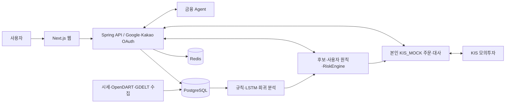

# MARS — 투자 원칙 검증형 AI 모의 자동매매

부산대학교 정보컴퓨터공학부 3인 졸업과제입니다. 국내 주식·금 ETF의 가격, 공시, 뉴스, 모델 신호를 검토하고 **사용자 본인의 KIS 모의투자 계좌**에서 투자 원칙과 위험 검사를 통과한 주문만 실행하도록 설계했습니다. 후보, 판단, 주문 접수, 체결·잔고 대사는 서로 다른 결과로 기록합니다.

| 제품 | 로그인 | 제공 범위 |
|---|---|---|
| [DEMO](https://hub.docker.com/r/pjjpjj111/mars-demo) | 없음 | 출처를 표시하는 제한된 금융 Agent. 계좌·주문·자동운용은 제공하지 않음 |
| [FULL](https://hub.docker.com/r/pjjpjj111/mars-full) | Google 또는 Kakao | 첫 인증에서 USER 자동 생성. 본인이 준비한 KIS_MOCK 키를 암호화 보관하고 본인 계좌에만 사용 |

[최신 GitHub Release](https://github.com/robinhood0107/Capstone-AI-Trading-Coach/releases/latest)의 `mars-images.json`과 digest 고정 Compose 두 파일이 배포 이미지 세트의 기준입니다. manifest는 main 원본 commit과 8개 Docker Hub 이미지 참조·digest를 기록합니다. 이동하는 `latest` 태그 대신 SHA-256 digest가 고정된 Compose를 사용하세요.

> **검증 경계**: 최신 Release의 8개 필수 CI gate와 이미지 발행은 성공했습니다. DEMO Agent와 FULL의 health·로그인 시작·미인증 차단도 확인했습니다. Google/Kakao 동의 후 callback, 실제 KIS_MOCK 자격증명 연결·주문·체결·대사, 서로 다른 두 사용자의 격리, N=10/50/100 부하는 아직 완료하지 않았습니다. 수익성, 최종 서버 사양, KIS_LIVE, NAS 실제 배포를 주장하지 않습니다.

## 1. 프로젝트 배경

### 1.1. 국내외 시장 현황 및 문제점

[KIS Developers](https://apiportal.koreainvestment.com/apiservice-summary), [OpenDART](https://opendart.fss.or.kr/), [GDELT](https://gdeltproject.org/data.html)처럼 시세·공시·세계 사건의 원천은 여럿입니다. 이들을 결합할 때 수집 시각, 결측과 미발행, 종목 연결, 주문 전 계좌 상태가 일치해야 합니다. 과거 수익률만 제시하면 거래비용, 생존편향, 실제 주문·체결 여부를 놓치기 쉽습니다.

### 1.2. 필요성과 기대효과

초보 사용자가 **왜 후보가 생겼는지 → 어떤 원칙이 통과했는지 → 실제 모의주문과 대사가 어떻게 끝났는지** 확인하도록 돕습니다. 근거가 없으면 값을 꾸미지 않고 `HOLD`·`ABSTAIN`·차단 사유를 남깁니다. 기대효과는 투자 판단 과정을 학습하는 것이며 수익 개선은 검증 결과로 주장하지 않습니다.

## 2. 개발 목표

### 2.1. 목표 및 세부 내용

1. 시세·공시·뉴스의 출처, 기준 시각, 품질을 기록한다.
2. 규칙, LSTM, 회귀 연구 결과를 같은 계약으로 비교한다. 모델에는 주문 권한을 주지 않는다.
3. 사용자 원칙과 결정적 RiskEngine을 거쳐 주문 후보·수량·허용을 분리한다.
4. Google 또는 Kakao로 첫 로그인과 가입을 함께 처리하고, 사용자별 KIS_MOCK 키와 계좌를 암호화·격리한다.
5. 제한 Agent DEMO와 계좌 기능 FULL을 별도 제품·볼륨으로 제공한다.

현재 계약은 [최종 프로젝트 명세](docs/최종_프로젝트_명세서.md)와 [API 명세](docs/API_명세서.md)를 따릅니다. 계획과 아래에서 **실제로 관찰한 검증 범위**를 구분합니다.

### 2.2. 기존 서비스 대비 차별성

MARS는 모델의 BUY를 주문 성공으로 표현하지 않습니다. 후보 생성, RiskEngine 판정, KIS 주문 접수, 체결, 계좌 대사의 증거를 나눠 기록합니다. Agent는 설명을 제공하지만 주문을 결정하지 않습니다. 다른 서비스와의 성능 우위는 같은 조건에서 측정하지 않았으므로 주장하지 않습니다.

### 2.3. 사회적 가치 도입 계획

실제 자금을 사용하지 않는 모의투자와 출처·위험 근거를 통해 금융 학습을 돕습니다. 장기 검증에서 기준 미달 모델을 `BELOW_BASELINE`로 공개하는 것도 학습상의 안전 장치입니다. 환경·경제적 효과는 정량 측정하지 않았습니다.

## 3. 시스템 설계

### 3.1. 시스템 구성도



Decision Platform은 최종 판단과 주문을 맡고, Return Engine은 LSTM·규칙 baseline·백테스트 원천 산출물을 생산하며, Experience Dashboard는 이 결과를 보여 줍니다. 세 영역의 입출력은 [계약](contracts/)으로 연결합니다.

### 3.2. 사용 기술

| 계층 | 기술·역할 |
|---|---|
| 웹 | TypeScript, React, Next.js |
| API·판단 | Java 25, Kotlin, Spring Boot, Flyway, RiskEngine |
| 수집·분석 | Python 3.12, uv, pandas/NumPy, PyTorch LSTM, 회귀 연구, LangGraph |
| 저장·조정 | PostgreSQL·pgvector, Redis |
| 발행 | Docker Compose, GitHub Actions, Docker Hub, digest 고정 Release |

## 4. 개발 결과

### 4.1. 전체 시스템 흐름도

```text
수집·품질검사 → 기준 시각 feature → 규칙/모델 신호 → 후보
→ 사용자 원칙·위험 검사 → 본인 모의주문/차단 → 체결·잔고 대사 → 화면·기록
```

세계 뉴스는 사용자에게 보여 주는 **참고 자료**이며 종목 판단·주문의 직접 입력이 아닙니다. GDELT 파일 미발행과 OpenDART 일일 호출 예산 초과는 실패를 숨기거나 우회하지 않고 별도로 기록합니다.

### 4.2. 기능 설명 및 주요 기능 명세서

| 기능 | 입력 | 출력·권한 |
|---|---|---|
| DEMO Agent | 금융 질문 | 제한된 설명과 출처. 로그인·계좌·주문 없음 |
| FULL 인증 | Google OIDC 또는 Kakao OAuth 응답 | 검증된 issuer+subject로 식별. 첫 로그인에 USER 생성, 외부 password 로그인 차단 |
| KIS_MOCK 연결 | 본인 App Key·Secret·계좌번호 | 암호화 저장·연결 확인. 사용자 간 계좌 재사용 금지 |
| 수집기 | 일봉·공시·GDELT 파일 | 시각·품질·미발행을 구분한 데이터 |
| 예측·후보 | 완료된 feature, 규칙/LSTM/회귀 신호 | 비교 가능한 예측·후보. 모델의 주문 권한 없음 |
| 자동운용 | 본인 정책·계좌·후보·시세 | 위험 검사 결과, 허용 주문 또는 차단 사유, 사용자별 대사 |
| 금융 Agent | 질문·허용된 근거 | 출처를 단 설명 또는 근거 부족 응답 |

**실험 수치와 검증 범위**

| 수치 | 조건·정의 | 해석 한계 |
|---|---|---|
| `55.8% → 1.4%` | [규칙 평가](workspaces/decision-platform/research/p1-return-profit-verification/rule_baseline_eval.py)의 기록값. 31종목, 158,336 관측, 6,646 세션(2000-02~2026-09)에서 골든크로스 `event`와 장기 추세 `trend_only`의 **매수 후보가 없던 날 비율**을 비교했습니다. 별도 수익 통계는 일 초과수익 `−0.0751%p → −0.0010%p`, Newey–West t `−2.02 → −0.08`입니다. | 수익률 개선이 아닙니다. 원본의 정확한 `55.8%` 입력은 재현되지 않았고 보존된 재실행은 `55.7% → 1.4%`였습니다. 통계적으로 유의한 초과수익을 뜻하지 않습니다. |
| `51.8% → 1.4%` | [결합 평가](workspaces/decision-platform/research/p1-return-profit-verification/consensus_eval.py)의 31종목·5,362 세션(2005-01~2026-09) 보고값. `RULE BUY ∧ LSTM BUY`와 `RULE BUY ∧ LSTM != SELL` 사이의 **후보가 없던 세션 비율**입니다. | 원래 입력 스키마가 남아 있지 않아 같은 실험을 재실행하지 못했습니다. 수익률·정확도·수익성 개선으로 사용하지 않습니다. |
| LSTM `BELOW_BASELINE` | [22-fold walk-forward 보고서](workspaces/decision-platform/research/p1-return-profit-verification/reports/profit-verification.md): 31종목, 130,722 예측, test 2005~2026, 왕복 거래비용 35bps. 방향 정확도 `0.4777`(동전던지기 95% 구간 `0.4973~0.5027`), RMSE `0.027337`(0 예측 기준선 `0.026238`). | 사전 기준을 통과하지 못했습니다. 21년 균등가중 benchmark의 CAGR·Sharpe는 LSTM 수익이 아니며 실서비스 성과로 주장하지 않습니다. |

면접 자료의 `51.8% → 1.4%`는 후보 생성 빈도이며 수익률이 아닙니다. 보고서의 LSTM `20.7% CAGR` 표기는 현재 연구 원본에서 같은 모델 결과로 확인되지 않아 README에서 제외했습니다. 13거래일 replay 결과도 실행 원본과 DB snapshot hash가 일치하지 않아 성과 수치로 옮기지 않았습니다. `RAG 25.6초 → 416ms`, 영상 속 차트 수익률 등도 측정 원본과 조건이 확인되지 않아 제외했습니다.

**최신 공개 이미지에서 직접 확인한 항목**: main 승격 workflow의 8개 필수 gate와 Release 발행이 성공했고, Release manifest·digest Compose·Docker Hub의 이미지 참조를 대조했습니다. 런타임 점검은 DEMO와 FULL을 동시에 실행하지 않고 순서대로 진행했으며 named volume은 지우지 않았습니다.

| 영역 | 관찰 결과 | 아직 확인하지 않은 것 |
|---|---|---|
| Docker Hub Release | DEMO/FULL 각 API·웹·PostgreSQL·Redis, 8개 이미지 참조의 OCI digest가 manifest와 일치 | NAS 설치·운영 |
| DEMO | API·웹 healthy. `/api/v1/demo/agent/ask`는 HTTP 200과 유효 citation 반환 | 모든 질문에 대한 품질 평가 |
| FULL | API·웹·actor-authority·PostgreSQL·Redis healthy, migration V211 적용. Google·Kakao 로그인 시작은 각각 HTTP 302. 비인증 password/KIS/자동운용 요청은 각각 404/401/401 | Google/Kakao consent callback과 실제 USER 생성 |
| 접근 경계 | 공개 password 로그인은 404, 비인증 KIS 자격증명·자동운용 요청은 401 | 서로 다른 두 사용자의 실제 계좌 권한 격리 |
| 수집·분석·매매 | Python·Kotlin·contract CI 통과 | 이번 릴리스 smoke에서는 GDELT/OpenDART online 호출, 새 거래일 수집, 실사용자 주문·체결·대사를 실행하지 않음 |
| 용량 | N=10/50/100 동시 09:30 부하를 측정하지 않음 | CPU-seconds/USER, 피크 RAM, KIS/DB 대기, p95/p99와 최종 서버 사양 |

GDELT는 이벤트 참고 자료이며 종목 판단·주문의 직접 입력이 아닙니다. Collector의 health는 외부 원천에서 새 자료가 완전히 수집됐음을 보장하지 않습니다. OpenDART 호출은 일일 quota를 사용하므로 해당 quota를 확인한 뒤 별도 실행해야 합니다.

### 4.3. 디렉터리 구조

```text
contracts/                         팀 간 입출력 계약
workspaces/decision-platform/      API·수집·원칙·위험 검사·자동운용
workspaces/return-engine/          검토 후 수신한 Return 코드·산출물
workspaces/experience-dashboard/   사용자 웹 화면
deploy/p1/                         Compose·이미지·발행 검증
docs/                              공개 명세와 검증 문서
```

`private-reference/`는 비공개 연구·면접 자료이며 Git과 공개 이미지에 포함하지 않습니다.

### 4.4. 산업체 멘토링 의견 및 반영 사항

멘토링 원본은 아직 받지 못했습니다. 자료를 받은 뒤 날짜·의견·관련 변경 이력과 함께 작성합니다.

## 5. 설치 및 실행 방법

### 5.1. 설치 절차 및 실행 방법

이 절은 Linux `amd64` 호스트에서 **DEMO 또는 FULL 하나만** 시작하는 절차입니다. Linux Docker Engine 또는 WSL2와 통합이 켜진 Docker Desktop, Docker Compose v2, Git, GitHub CLI(`gh`), `jq`, Python 3, OpenSSL이 필요합니다. WSL에서는 저장소·secret·named volume을 `/mnt/c`가 아닌 Linux 홈 아래에 둡니다. compose bind mount가 실패하면 Docker Desktop의 해당 Ubuntu 배포판 WSL integration을 먼저 확인하세요.

#### 5.1.1. 프로젝트와 최신 Release 준비

저장소를 clone하고 최신 Release의 manifest와 Compose를 같은 폴더에 받습니다. 원본 코드는 manifest의 `sourceSha`와 맞춥니다.

```bash
git clone https://github.com/robinhood0107/Capstone-AI-Trading-Coach.git "$HOME/mars-project"
cd "$HOME/mars-project"
PROJECT_ROOT="$PWD"
RELEASE_DIR="$HOME/.local/share/mars-release"
install -d -m 700 "$RELEASE_DIR"
TAG="$(gh release view --repo robinhood0107/Capstone-AI-Trading-Coach --json tagName --jq .tagName)"
gh release download "$TAG" --repo robinhood0107/Capstone-AI-Trading-Coach \
  --dir "$RELEASE_DIR" \
  --pattern mars-images.json \
  --pattern mars-public-demo.compose.yml \
  --pattern mars-public-full.compose.yml
SOURCE_SHA="$(jq -r '.sourceSha' "$RELEASE_DIR/mars-images.json")"
git fetch origin "$SOURCE_SHA"
git checkout --detach "$SOURCE_SHA"
```

manifest와 Compose 파일을 다른 Release에서 섞지 마세요. latest manifest가 원본 commit, 이미지 tag·digest, 플랫폼 정보를 기록합니다.

새 터미널을 열었다면 아래 경로 변수를 다시 설정하세요.

```bash
export PROJECT_ROOT="$HOME/mars-project"
export RELEASE_DIR="$HOME/.local/share/mars-release"
```

#### 5.1.2. 유일한 수동 설정 파일: 프로젝트 루트 `.env`

`.env.example`을 복사해 프로젝트 루트의 `.env` 하나만 직접 편집합니다. 권한은 `0600`으로 유지하고 값 뒤에 주석이나 공백을 붙이지 않습니다.

```bash
install -m 600 .env.example .env
${EDITOR:-vi} .env
```

| `.env` 설정 | 용도 |
|---|---|
| `MARS_VERTEX_MODEL_ID`, `MARS_VERTEX_PROJECT_ID`, `MARS_VERTEX_SERVICE_ACCOUNT_JSON_B64` | DEMO/FULL Agent·RAG의 Vertex 설정 |
| `GOOGLE_OIDC_CLIENT_ID`, `GOOGLE_OIDC_CLIENT_SECRET` | FULL Google 로그인 |
| `KAKAO_OAUTH_CLIENT_ID`, `KAKAO_OAUTH_CLIENT_SECRET` | FULL Kakao 로그인 |
| `VOYAGE_API_KEY` | FULL Voyage 검색 경로 |
| `GOOGLE_OIDC_ADMIN_SUBJECT_SHA256` | 첫 Google 로그인을 마친 뒤 관리자 지정 시 입력. 처음에는 주석 처리 |
| `OPENDART_API_KEY`와 `OPENDART_*` | 선택적인 one-shot 공시 수집기. 비어 있으면 Compose 기본 한도를 쓰고 collector는 시작되지 않음 |
| `MARS_DEMO_PORT`, `MARS_FULL_PORT` | 선택 호스트 포트. 비어 있으면 loopback `3001`, `3002` 사용 |

기존 Vertex 서비스 계정 JSON은 **한 번만 가져오기 위한 입력 파일**입니다. mode `0600`으로 보호하고 아래 importer를 실행하면 JSON 전체가 Base64 한 줄로 프로젝트 루트 `.env`에 저장됩니다. 런타임 JSON mount는 사용하지 않습니다. importer는 credential의 `project_id`도 `.env`에 반영합니다. `MARS_VERTEX_MODEL_ID`는 직접 선택합니다.

```bash
chmod 600 /secure/path/vertex-service-account.json
python3 deploy/p1/import_vertex_service_account_to_env.py /secure/path/vertex-service-account.json
chmod 600 .env
```

Google Cloud Web OAuth client에 origin `https://mars.royaljellynas.org`와 redirect URI `https://mars.royaljellynas.org/api/v1/auth/oidc/callback/google`를 등록합니다. Kakao Developers에도 `https://mars.royaljellynas.org/api/v1/auth/oidc/callback/kakao`를 등록합니다. 도메인의 HTTPS reverse proxy가 FULL 웹으로 연결되어야 callback을 시험할 수 있습니다. `.env`, OAuth secret, Vertex JSON을 채팅·Git·PR·로그에 붙이지 마세요.

#### 5.1.3. 제품별 로컬 secret 만들기

제품 하나를 선택해 예를 들어 `PRODUCT=full` 또는 `PRODUCT=demo`로 지정합니다. secret 초기화는 서비스를 띄우거나 Docker volume을 만들지 않습니다. 각 제품은 서로 다른 base secret을 생성해야 합니다.

```bash
PRODUCT=full  # demo 또는 full 중 하나
API_IMAGE="$(jq -r --arg product "$PRODUCT" '.images[$product + "-api"].reference' "$RELEASE_DIR/mars-images.json")"
BASE_DIR="$HOME/.local/share/mars-$PRODUCT-base"
docker pull "$API_IMAGE"
P1_STATE_DIR="$BASE_DIR" P1_SPRING_IMAGE="$API_IMAGE" \
  "$PROJECT_ROOT/deploy/p1/p1ctl" init
python3 "$PROJECT_ROOT/deploy/p1/assemble_mars_public_secrets.py" \
  --product "$PRODUCT" \
  --base-secrets "$BASE_DIR/secrets" \
  --release-dir "$RELEASE_DIR" \
  --operator-env "$PROJECT_ROOT/.env"
```

직접 편집하는 provider 설정 파일은 `.env` 하나입니다. 생성되는 `demo.env`·`full.env`는 Compose 경로·GID와 파생 fingerprint만 담는 mode-`0600` 파일이고, `demo-secrets/`·`full-secrets/`는 컨테이너별 secret 파일입니다. 이 출력물은 수동 설정 소스가 아니며 Git에 커밋하지 않습니다. `p1ctl init`이 과거 bootstrap 형식의 password bundle 파일도 생성하지만 공개 DEMO/FULL은 이를 mount하거나 password 로그인을 제공하지 않습니다.

| 출력 파일 | 포함 내용과 사용처 |
|---|---|
| `demo-secrets/postgres.env`, `redis.env` | DEMO DB·Redis 인증 |
| `demo-secrets/role-bootstrap.env`, `migration.env` | 최초 DB role 준비·Flyway |
| `demo-secrets/actor-capability-authority.env`, `actor-server.p12`, `actor-client.p12`, `actor-tls-ca.crt` | 내부 서비스 간 actor capability와 TLS |
| `demo-secrets/mars-public-demo.env`, `rag-history-kek-v1.key` | DEMO API·Vertex 및 저장 기록 암호화 |
| `full-secrets/` 위 공통 파일과 `seed-import.env`, `market-data.env`, `disclosure-collector.env` | FULL DB·인증·시세 writer·선택 OpenDART collector |
| `full-secrets/mars-public-full.env` | FULL API secret: Google·Kakao OAuth, Vertex, Voyage와 내부 credential |
| `full-kek/brokerage-kek-v1.key` | 사용자가 웹에 입력한 KIS_MOCK credential 전용 암호화 |
| `demo.env`, `full.env` | Compose 경로·GID·포트·파생 fingerprint. FULL에는 DB capability digest도 포함하므로 mode `0600` 유지 |

`$HOME/.local/share/mars-demo-base`와 `mars-full-base`에도 초기 생성 secret이 있습니다. 이 base 디렉터리, Release 폴더의 제품 secret 출력, brokerage KEK, named volume을 모두 백업하고 보존하세요. API key를 동기화할 때 이 파일들을 다시 생성할 필요는 없습니다.

FULL을 선택했다면 컨테이너 UID가 brokerage encryption key를 읽도록 소유권을 설정합니다.

```bash
sudo chown -R 65532:65532 "$RELEASE_DIR/full-kek"
sudo chmod 700 "$RELEASE_DIR/full-kek"
sudo chmod 600 "$RELEASE_DIR/full-kek/brokerage-kek-v1.key"
```

#### 5.1.4. 한 번에 한 제품 실행

기본 named volume과 내용은 다음과 같습니다. 프로젝트 이름이나 volume을 임의 변경하면 기존 데이터에 연결되지 않을 수 있습니다.

| 제품 | Named volume | 저장 내용 |
|---|---|---|
| DEMO | `mars-public-demo_demo-postgres` | 제한 Agent 기록과 DEMO 데이터 |
| DEMO | `mars-public-demo_demo-redis` | 임시 상태와 제한 요청 데이터 |
| FULL | `mars-public-full_full-postgres` | USER·암호화된 KIS_MOCK 정보·운용·대사 데이터 |
| FULL | `mars-public-full_full-redis` | 세션·rate limit·작업 상태 |
| FULL | `mars-public-full_full-rag-runtime` | RAG 검색 runtime seed |

다음 중 선택한 제품 명령 하나만 실행합니다. 다른 제품으로 전환하기 전에 현재 제품을 `down`으로 내립니다. `down`은 named volume을 보존합니다. `down -v`, `docker volume rm`, `docker volume prune`은 사용하지 마세요.

```bash
# DEMO를 선택한 경우
cd "$RELEASE_DIR"
docker compose --env-file demo.env -f mars-public-demo.compose.yml config --quiet
docker compose --env-file demo.env -f mars-public-demo.compose.yml up -d --wait
docker compose --env-file demo.env -f mars-public-demo.compose.yml ps
curl -fsS http://127.0.0.1:3001/healthz
# 종료: docker compose --env-file demo.env -f mars-public-demo.compose.yml down
```

```bash
# FULL을 선택한 경우
cd "$RELEASE_DIR"
docker compose --env-file full.env -f mars-public-full.compose.yml config --quiet
docker compose --env-file full.env -f mars-public-full.compose.yml up -d --wait
docker compose --env-file full.env -f mars-public-full.compose.yml ps
curl -fsS http://127.0.0.1:3002/healthz
# 종료: docker compose --env-file full.env -f mars-public-full.compose.yml down
```

기본 웹 포트는 DEMO `127.0.0.1:3001`, FULL `127.0.0.1:3002`입니다. 포트 충돌 시 `.env`에서 해당 `MARS_*_PORT`를 바꾸고 제품 secret 동기화 명령을 다시 실행한 뒤 web 서비스만 재생성하세요. Compose는 TLS·DNS를 만들지 않습니다. external reverse proxy를 쓸 때만 도메인 callback을 등록하세요.

#### 5.1.5. 로그인·관리자·계좌 설정

Google 또는 Kakao 버튼 하나로 로그인과 첫 가입을 함께 합니다. 별도 가입 폼·password 로그인은 없습니다. 같은 이메일 주소라도 Google과 Kakao 계정은 서로 연결되지 않습니다. Kakao 계정은 ADMIN으로 승격되지 않습니다.

**본인 Google 계정을 ADMIN으로 지정**하려면 FULL에서 먼저 Google 로그인과 callback을 완료합니다. 앱은 이메일 대신 검증된 Google `subject`에 결속하므로, 데이터베이스에서 subject를 화면이나 로그에 출력하지 않고 SHA-256만 계산합니다. 개인용 인스턴스에 Google 계정이 하나일 때:

```bash
mapfile -t GOOGLE_SUBJECTS < <(
  docker compose --env-file "$RELEASE_DIR/full.env" \
    -f "$RELEASE_DIR/mars-public-full.compose.yml" exec -T postgres \
    psql -U postgres -d capstone_p1 -Atc \
    "SELECT subject FROM social_login_identities WHERE issuer = 'https://accounts.google.com'"
)
if [ "${#GOOGLE_SUBJECTS[@]}" -ne 1 ]; then
  echo 'Google identity가 하나인지 로컬에서 확인한 뒤 진행하세요.' >&2
  exit 1
fi
GOOGLE_SUBJECT_HASH="$(printf '%s' "${GOOGLE_SUBJECTS[0]}" | sha256sum | awk '{print $1}')"
unset GOOGLE_SUBJECTS
printf '%s\n' "$GOOGLE_SUBJECT_HASH"
```

출력된 hash를 프로젝트 루트 `.env`의 `GOOGLE_OIDC_ADMIN_SUBJECT_SHA256`에 넣고, 아래 명령으로 생성된 FULL runtime secret에 반영합니다. API를 재생성한 뒤 Google로 다시 로그인하면 역할이 재평가됩니다. Hash도 채팅·PR에 붙이지 마세요. DB에 Google identity가 여러 개라면 자동 선택하지 말고 어느 계정을 허용할지 먼저 식별하세요.

```bash
python3 "$PROJECT_ROOT/deploy/p1/sync_mars_public_operator_env.py" \
  --product full --secrets-dir "$RELEASE_DIR/full-secrets"
docker compose --env-file "$RELEASE_DIR/full.env" \
  -f "$RELEASE_DIR/mars-public-full.compose.yml" \
  up -d --no-deps --force-recreate api
```

**KIS_MOCK 연결**: FULL 웹에서 본인이 준비한 App Key·Secret·계좌번호를 직접 입력하고 연결 확인을 합니다. 값은 브로커리지 전용 키로 암호화해 본인 actor에 묶습니다. 별도 사용자 계정 간 권한 격리는 운영 검증이 필요합니다. `KIS_LIVE`는 제공하지 않습니다.

`.env`의 provider, 포트 또는 OpenDART 설정을 변경한 뒤에는 `sync_mars_public_operator_env.py`로 기존 DB secret을 다시 만들지 않고 해당 제품의 파생 secret만 갱신합니다. DEMO와 FULL은 각 제품의 경로를 사용하고, provider 변경이면 API, 포트 변경이면 web 서비스만 재생성하세요. OpenDART는 기본으로 시작하지 않으며 DB의 일일 quota를 확인한 뒤 one-shot으로 실행합니다.

```bash
# DEMO Vertex 설정 변경 시
python3 "$PROJECT_ROOT/deploy/p1/sync_mars_public_operator_env.py" \
  --product demo --secrets-dir "$RELEASE_DIR/demo-secrets"+# FULL provider secret 갱신 후 API 재생성
python3 "$PROJECT_ROOT/deploy/p1/sync_mars_public_operator_env.py" \
  --product full --secrets-dir "$RELEASE_DIR/full-secrets"
# OpenDART를 명시적으로 실행하는 경우만:
docker compose --env-file "$RELEASE_DIR/full.env" \
  -f "$RELEASE_DIR/mars-public-full.compose.yml" --profile collectors \
  run --rm disclosure-collector
```

Vertex/Voyage 사용량은 provider 계정의 무료량·쿼터·과금 조건을 따릅니다. MARS는 호출량을 계측하지만 별도 일일 비용 hard cap으로 호출을 차단하지 않습니다.

### 5.2. 오류 발생 시 해결 방법

| 증상 | 확인할 항목 |
|---|---|
| Compose 설정 오류 | `.env` mode `0600`, 제품별 generated env·secret 경로, Docker Compose bind mount 지원 |
| API unhealthy | PostgreSQL·Redis·actor-authority 상태와 migration 결과. volume은 삭제하지 않음 |
| Google/Kakao callback 실패 | public HTTPS origin과 provider에 등록한 callback URI가 완전히 같은지 확인 |
| KIS 연결 실패 | 본인이 입력한 MOCK 키·계좌, 모의투자 API 상태·호출 제한 확인 |
| 수집 0건 | 거래 세션 여부, GDELT 발행, OpenDART profile과 quota 확인 |
| 주문 0건 | 후보·시세·계좌·원칙·RiskEngine의 단계별 차단 사유 확인. 0건 자체는 장애가 아님 |
| `secrets_bind_unavailable` | Docker Desktop WSL integration 또는 Linux 경로의 bind mount를 확인. 기존 volume은 건드리지 않음 |

복구를 위해 DB volume을 지우지 마세요. migration 전에 백업을 확인하고, 서비스 종료는 `docker compose down`만 사용합니다.

**소스 체크아웃에서 개발할 때**: 공개 이미지 실행과 달리 개발용 DB를 직접 이행한다면 인증용 DB role을 Flyway보다 먼저 준비합니다. 저장소 루트에서 `docker compose --env-file .env -f infra/docker-compose.infra.yml run --rm role-bootstrap`을 실행한 뒤 Spring API 디렉터리에서 `./gradlew bootRun`을 실행합니다. `S3.3` KIS_MOCK fill observation은 `decision_fill_writer` DB role로 적재하며, migration 경계는 `V6/V9/V14`입니다. 조회 계약의 세부사항은 [API 명세](docs/API_명세서.md)에 있습니다.

## 6. 소개 자료 및 시연 영상

### 6.1. 프로젝트 소개 자료

발표 PPT 원본을 아직 받지 못했습니다. 제공받으면 공개 가능 여부와 수치의 원본 실험을 대조해 연결합니다.

### 6.2. 시연 영상

[팀 MARS 시연 영상](https://www.youtube.com/watch?v=CU7284u1rk0)은 당시 기능을 소개합니다. 영상은 최신 이미지의 Google/KIS 인증이나 수익성 검증 자료가 아닙니다. 화면 속 단기 손익표와 예시 차트는 서로 다른 조건이므로 합쳐 해석하지 않습니다.

[](https://www.youtube.com/watch?v=CU7284u1rk0)

## 7. 팀 구성

### 7.1. 팀원별 소개 및 역할 분담

| 팀원 | 역할 |
|---|---|
| 박종진 | PM·Decision Platform 백엔드, 투자 원칙·RiskEngine·KIS 연동, 규칙/모델 결합 평가, LightGBM 연구 |
| 조민수 | Return Engine, LSTM·규칙 baseline·백테스트 원천 산출물 |
| 박재영 | Experience Dashboard, 모델 비교·주문 검토·자동운용 화면 |

팀 결과와 개인 기여를 구분합니다. LSTM 학습은 박종진 개인 성과로 표시하지 않습니다.

### 7.2. 팀원별 참여 후기

각 팀원이 직접 작성한 후기 원본을 아직 받지 못했습니다. 받은 뒤 당사자 확인을 거쳐 기재합니다.

## 8. 참고 문헌 및 출처

- [부산대학교 캡스톤 README 기준](https://github.com/pnucse-capstone2026/capstone-2026-team-33)
- [KIS Developers API](https://apiportal.koreainvestment.com/apiservice-summary), [OpenDART](https://opendart.fss.or.kr/), [GDELT 데이터](https://gdeltproject.org/data.html)
- [프로젝트 명세](docs/최종_프로젝트_명세서.md), [API 명세](docs/API_명세서.md), [규칙 평가](workspaces/decision-platform/research/p1-return-profit-verification/rule_baseline_eval.py), [결합 평가](workspaces/decision-platform/research/p1-return-profit-verification/consensus_eval.py), [Return 판정](workspaces/decision-platform/research/p1-return-profit-verification/reports/profit-verification.md)
- [Google Identity 브랜딩 가이드](https://developers.google.com/identity/branding-guidelines), [Kakao 로그인 버튼 디자인 가이드](https://developers.kakao.com/docs/ko/kakaologin/design-guide), [Google OAuth 문서](https://developers.google.com/identity/protocols/oauth2/web-server), [Kakao OAuth REST API](https://developers.kakao.com/docs/ko/kakaologin/rest-api)

PR은 구현 이력이지 실험 측정 원본은 아닙니다. 공개하지 않은 내부 연구 자료와 개인 지원서 원본은 저장소에 포함하지 않습니다.
