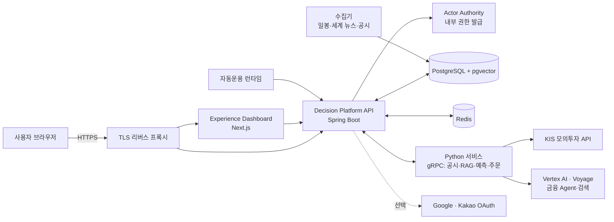
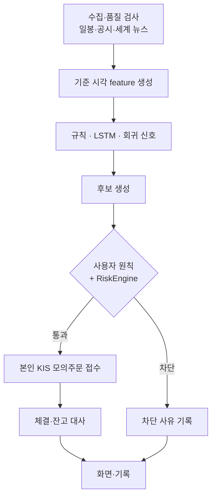
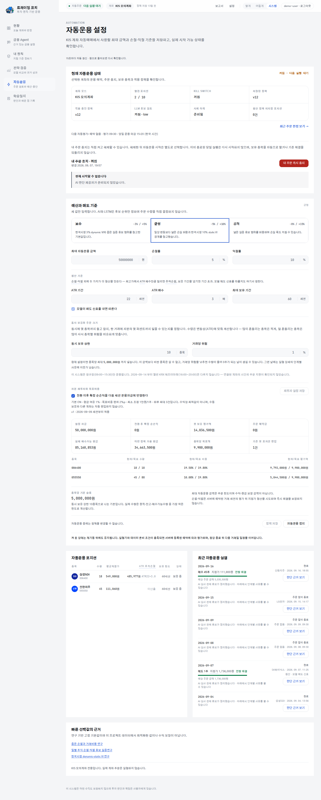
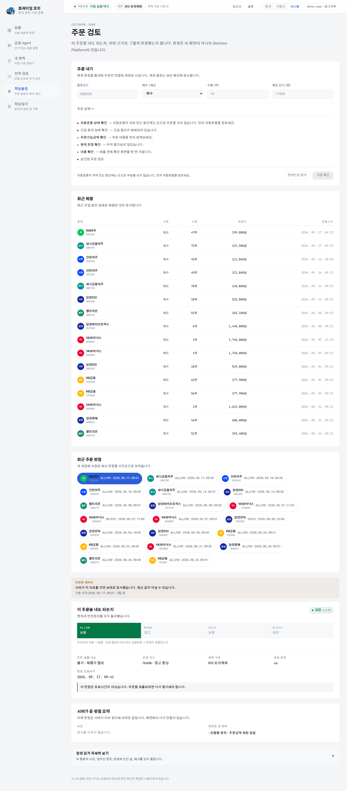
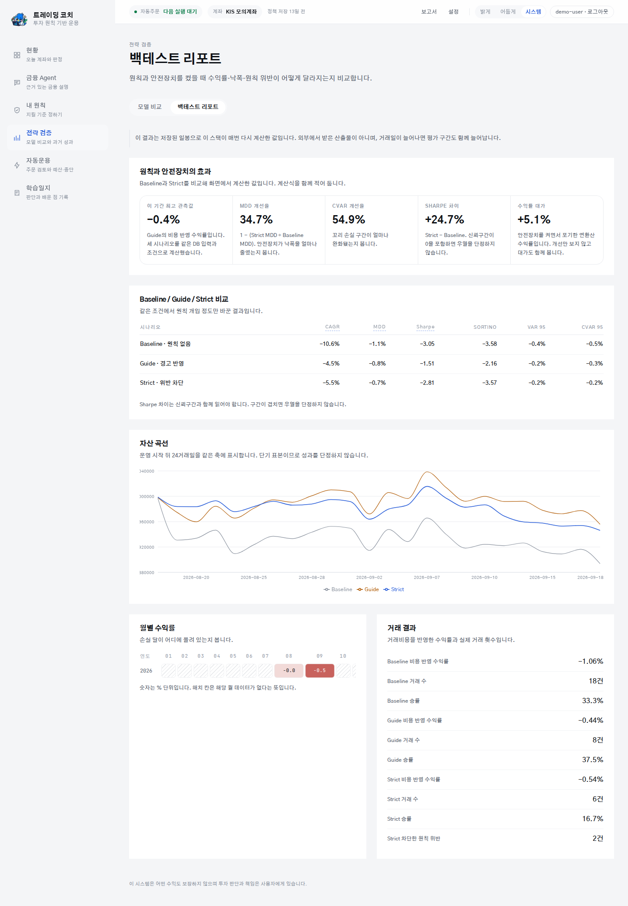
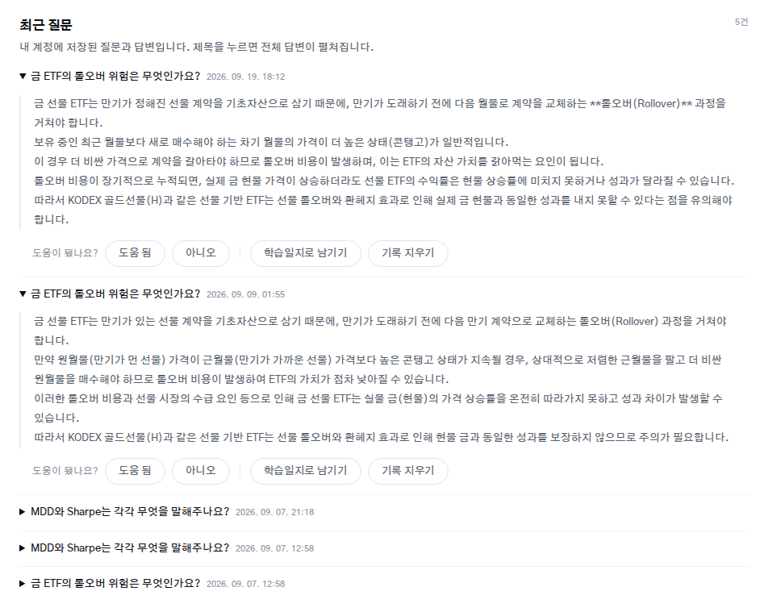

# MARS — 투자 원칙 검증형 AI 모의 자동매매

국내 주식·금 ETF의 시세, 공시, 뉴스, 모델 신호를 근거로 후보를 만들고, 사용자가 정한 투자 원칙과 위험 검사를 통과한 주문만 **본인의 한국투자증권(KIS) 모의투자 계좌**에서 실행하는 서비스입니다. 후보 생성, 판단, 주문 접수, 체결·잔고 대사를 서로 다른 기록으로 남겨, 왜 그 주문이 나갔는지(또는 막혔는지)를 끝까지 추적할 수 있습니다.

## 목차

1. [프로젝트 배경](#1-프로젝트-배경)
2. [개발 목표](#2-개발-목표)
3. [시스템 설계](#3-시스템-설계)
4. [개발 결과](#4-개발-결과)
5. [설치 및 실행 방법](#5-설치-및-실행-방법)
6. [소개 자료 및 시연 영상](#6-소개-자료-및-시연-영상)
7. [팀 구성](#7-팀-구성)
8. [참고 문헌 및 출처](#8-참고-문헌-및-출처)

## 1. 프로젝트 배경

### 1.1. 국내외 시장 현황 및 문제점

- 개인 투자자가 쓸 수 있는 데이터 원천은 [KIS Developers](https://apiportal.koreainvestment.com/apiservice-summary)의 시세·주문 API, [OpenDART](https://opendart.fss.or.kr/)의 공시, [GDELT](https://gdeltproject.org/data.html)의 세계 사건 데이터처럼 이미 다양합니다.
- 그러나 원천을 결합할 때 **수집 시각, 결측·미발행, 종목 연결, 주문 직전 계좌 상태**가 맞지 않으면 신호가 틀어집니다. 대부분의 자동매매 도구는 이 불일치를 드러내지 않습니다.
- 과거 수익률 그래프만 보여 주는 서비스는 거래비용, 생존편향, 실제 주문·체결 여부를 빠뜨리기 쉽습니다. 모델이 "매수"라고 말한 것과 실제로 주문이 접수·체결된 것은 다른 사건인데, 이를 한 화면에서 섞어 보여 주는 경우가 많습니다.

### 1.2. 필요성과 기대효과

- 초보 투자자가 **왜 후보가 생겼는지 → 어떤 원칙을 통과했는지 → 모의주문과 대사가 어떻게 끝났는지**를 단계별로 확인하며 판단 과정을 학습할 수 있습니다.
- 근거가 부족하면 값을 꾸미지 않고 `HOLD`·`ABSTAIN`·차단 사유를 남기므로, 사용자가 시스템의 한계를 그대로 볼 수 있습니다.
- 실제 자금이 아닌 모의투자 계좌만 사용하므로 금전 손실 없이 자동운용 전 과정을 경험할 수 있습니다.

## 2. 개발 목표

### 2.1. 목표 및 세부 내용

| 목표 | 세부 내용 |
|---|---|
| 근거 있는 데이터 | 시세·공시·뉴스마다 출처, 기준 시각, 품질 상태를 함께 저장 |
| 비교 가능한 신호 | 규칙, LSTM, 회귀 모델을 같은 계약으로 비교. 모델에는 주문 권한을 주지 않음 |
| 결정적 위험 통제 | 사용자 원칙과 RiskEngine을 거쳐 후보·수량·허용 여부를 분리 |
| 본인 계좌 자동운용 | 사용자별 KIS 모의투자 키를 암호화 보관하고 본인 계좌에만 주문 |
| 추적 가능한 기록 | 후보 → 판단 → 주문 접수 → 체결 → 잔고 대사를 별도 기록으로 연결 |
| 계정 | 아이디·이메일 비밀번호 로그인, 최소 회원가입, 로그인 후 Google·Kakao 직접 연결 |

### 2.2. 기존 서비스 대비 차별성

| 구분 | 일반 자동매매·추천 서비스 | MARS |
|---|---|---|
| 모델 신호 | BUY 신호를 곧 주문으로 표현 | 신호·원칙 판정·주문 접수·체결을 분리해 기록 |
| 근거 부족 시 | 추정값으로 채움 | `HOLD`·`ABSTAIN`과 차단 사유를 그대로 표시 |
| 위험 통제 | 모델 출력에 의존 | 결정적 RiskEngine이 최종 수량과 허용을 결정 |
| 성과 표기 | 백테스트 수익률 중심 | 기준선 대비 판정(`BELOW_BASELINE` 등)을 함께 공개 |
| AI 설명 | 주문을 결정하기도 함 | 출처를 단 설명만 제공하고 주문 권한은 없음 |

### 2.3. 사회적 가치 도입 계획

- **금융 교육**: 모의투자와 출처·위험 근거를 통해 투자 판단 과정을 안전하게 학습합니다.
- **투명성**: 기준에 못 미친 모델도 `BELOW_BASELINE`으로 공개해 과장된 성과 표현을 막습니다.
- **개인정보 보호**: 비밀번호는 해시로만, 증권사 키는 전용 키로 암호화해 저장하고 운영 데이터는 사용자 본인 서버에만 둡니다.

## 3. 시스템 설계

### 3.1. 시스템 구성도



| 구성 요소 | 소스 경로 | 포트 | 주요 역할 |
|---|---|---|---|
| Experience Dashboard | `workspaces/experience-dashboard` | 127.0.0.1:3000 | 로그인, 원칙, 자동운용, 주문 검토, 금융 Agent 화면 |
| Decision Platform API | `workspaces/decision-platform/spring-api` | 127.0.0.1:18080 | 인증, 원칙·위험 판정, 자동운용, 주문·대사 API |
| Python 서비스 | `workspaces/decision-platform/python-services` | 내부 gRPC | 수집기, 공시, RAG, 예측 추론, KIS 주문 어댑터 |
| Return Engine | `workspaces/return-engine` | 내부 | LSTM·규칙 기준선·백테스트 산출물 |
| TLS 프록시 | `deploy/p1/docker/tls-proxy.nginx.conf` | 443 / 80 (서버) | 외부 HTTPS 단일 입구 |
| PostgreSQL · Redis | `deploy/p1/docker` | 내부 | 운영 데이터, 세션·호출 제한·작업 상태 |

### 3.2. 사용 기술

| 구분 | 기술 |
|---|---|
| 프론트엔드 | TypeScript, React, Next.js, Tailwind CSS |
| 백엔드 | Java 25, Kotlin, Spring Boot, Spring Security(OAuth2 Client), Flyway, gRPC |
| 데이터·분석 | Python 3.12, uv, pandas, NumPy, PyTorch(LSTM), LangGraph |
| 저장소 | PostgreSQL 16 + pgvector, Redis |
| 외부 API | KIS Developers(모의투자), OpenDART, GDELT, Google Vertex AI, Voyage AI, Google·Kakao 로그인 |
| 배포·운영 | Docker Compose, nginx(TLS), GitHub Actions, Docker Hub |

## 4. 개발 결과

### 4.1. 전체 시스템 흐름도



- 세계 뉴스는 화면에 보여 주는 **참고 자료**이며 종목 판단·주문의 직접 입력으로 쓰지 않습니다.
- GDELT 파일 미발행, OpenDART 일일 호출 한도 초과는 우회하지 않고 별도 상태로 기록합니다.
- 자동운용은 장 시작 전 예약된 일정에 따라 돌며, 무장(ARM)·해제(DISARM)·Kill Switch로 사용자가 언제든 멈출 수 있습니다.

### 4.2. 기능 설명 및 주요 기능 명세서

| 기능 | 입력 | 출력 | 설명 |
|---|---|---|---|
| 로그인 | 아이디(`demo-user`) 또는 이메일, 비밀번호 | Bearer 세션 | 실패 사유를 구분하지 않는 동일한 401, 시도 횟수 제한 |
| 회원가입 | 이메일, 비밀번호(15~64자) | 새 USER 계정 | 정규화한 이메일과 BCrypt 해시만 저장 |
| 로그인 방법 연결 | 로그인 상태에서 Google·Kakao 인증 | 같은 계정에 제공자 연결 | 이메일이 같아도 자동 병합하지 않음. 마지막 로그인 수단은 해제 불가 |
| 투자 원칙 | 프리셋, 매수·매도 조건, 위험 한도 | 버전이 있는 원칙 | 자동운용과 주문 검토가 이 원칙으로 판정 |
| 자동운용 | 원칙, 자본 정책, 후보, 시세 | 실행 기록, 허용 주문 또는 차단 사유 | 예약 일정·무장 상태·대사 결과를 함께 표시 |
| KIS 모의 주문·대사 | 허용된 주문 의도 | 주문 접수, 체결, 잔고 대사 | 사용자별 계좌에만 주문. 호출 유량(모의 1건/초) 준수 |
| 수집기 | 일봉, 공시, GDELT 파일 | 품질 상태가 붙은 데이터 | 시각·결측·미발행을 구분해 저장 |
| 예측·모델 비교 | 완료된 feature | 규칙·LSTM·회귀 신호 비교 | 모델은 주문 권한 없음 |
| 금융 Agent | 질문 | 출처를 단 답변 또는 근거 부족 응답 | 공시·뉴스·시세 근거 검색(RAG) |
| 주문 검토 | 후보, 원칙 | 통과·차단 판정과 이유 | 사람이 주문 전에 판정 근거 확인 |

| 자동운용 | 주문 검토 |
|---|---|
|  |  |
| **백테스트** | **금융 Agent** |
|  |  |

**계정 보안 규칙**

1. 비밀번호는 15~64자, 최대 72 UTF-8 바이트이며 BCrypt(강도 12)로만 저장합니다.
2. 비밀번호·제공자 식별자·토큰은 응답, 로그, 감사 기록, URL에 남기지 않습니다.
3. 없는 계정과 틀린 비밀번호는 같은 401을 돌려주고, 로그인·가입은 공유 저장소 기반 시도 제한을 거칩니다.
4. 비밀번호 표는 행 수준 보안(RLS)을 강제하고 인증 전용 DB 역할의 보안 함수로만 읽고 씁니다.
5. 제공자 연결은 로그인한 본인만, 같은 출처(Origin)에서, 5분짜리 HttpOnly·Secure 세션으로만 시작할 수 있습니다.
6. 모든 요청은 DB의 활성 상태·역할·보안 버전을 다시 확인합니다. 관리자 계정에는 일반 제공자를 연결할 수 없습니다.
7. JWT는 브라우저 메모리(탭 세션)에만 두고, OAuth 콜백은 토큰을 URL에 싣지 않고 1회용 교환으로 넘깁니다.

### 4.3. 디렉토리 구조

```text
Capstone-AI-Trading-Coach/
├── capstone                          # 로컬·서버 실행 진입점 (./capstone up --mock)
├── contracts/                        # 영역 간 API·데이터 계약과 변경 기록
│   ├── openapi/                      # OpenAPI 명세
│   └── changes/                      # 계약 변경 사유와 영향 범위
├── deploy/p1/                        # Compose, 이미지, 배포 스크립트
│   ├── compose.yml                   # 전체 스택
│   ├── compose.server.yml            # 개인 서버용 오버레이 (TLS, 재시작 정책)
│   ├── compose.release.yml           # 소스 없이 이미지로 실행하는 생성본
│   └── full-appctl, p1ctl            # 초기화·기동·점검
├── docs/                             # 프로젝트·API 명세, 화면 캡처
├── workspaces/
│   ├── decision-platform/
│   │   ├── spring-api/               # 인증, 원칙, RiskEngine, 자동운용, 주문 API
│   │   ├── python-services/          # 수집기, 공시, RAG, 예측, KIS 어댑터
│   │   └── research/                 # 규칙·결합 평가, 수익성 검증
│   ├── return-engine/                # LSTM·규칙 기준선·백테스트
│   └── experience-dashboard/         # Next.js 사용자 화면
└── infra/                            # 개발용 인프라 Compose, systemd 단위
```

### 4.4. 산업체 멘토링 의견 및 반영 사항

| 멘토 의견 | 반영 사항 |
|---|---|
| (멘토링 후 작성) | |

### 4.5. 실험 결과

| 실험 | 조건 | 결과 | 해석 |
|---|---|---|---|
| 규칙 후보 공백 비율 | 31종목, 158,336 관측, 6,646 세션(2000-02~2026-09). 골든크로스 `event` vs 장기 추세 `trend_only` | 매수 후보가 없던 날 `55.8% → 1.4%` (재실행 `55.7% → 1.4%`) | 후보 생성 빈도 개선이며 수익률 개선이 아님. 일 초과수익 `−0.0751%p → −0.0010%p`, Newey–West t `−2.02 → −0.08` |
| 규칙·LSTM 결합 | 31종목, 5,362 세션(2005-01~2026-09). `RULE BUY ∧ LSTM BUY` vs `RULE BUY ∧ LSTM ≠ SELL` | 후보가 없던 세션 `51.8% → 1.4%` | 후보 빈도 지표. 정확도·수익성 개선으로 해석하지 않음 |
| LSTM walk-forward | 22-fold, 31종목, 130,722 예측(2005~2026), 왕복 비용 35bps | 방향 정확도 `0.4777`, RMSE `0.027337`(0 예측 기준 `0.026238`) | 사전 기준 미달 → `BELOW_BASELINE`. 실서비스 판단은 규칙과 RiskEngine이 담당 |

평가 코드: [규칙 평가](workspaces/decision-platform/research/p1-return-profit-verification/rule_baseline_eval.py), [결합 평가](workspaces/decision-platform/research/p1-return-profit-verification/consensus_eval.py), [수익성 검증 보고서](workspaces/decision-platform/research/p1-return-profit-verification/reports/profit-verification.md)

### 4.6. 한계 및 향후 과제

| 항목 | 현재 상태 | 향후 과제 |
|---|---|---|
| 개인 서버 운영 | 서버용 오버레이와 데이터 이전 절차 준비 | 도메인·TLS 인증서를 갖춘 서버로 이전하고 상시 운영 |
| Google·Kakao 로그인 | 연결·해제 기능과 보안 규칙 구현 | 공개 HTTPS 주소에서 제공자 콘솔 등록 후 실제 동의·콜백 검증 |
| 계정 복구 | 이메일 인증·비밀번호 재설정 메일 미제공 | 메일 발송 경로를 갖춘 뒤 인증·재설정 추가 |
| 수용 인원 | 다중 사용자 격리 구조 구현 | 동시 사용자 10·50·100명 부하 측정과 서버 사양 산정 |
| 수익성 | LSTM은 기준선 미달, 규칙·RiskEngine 중심 운용 | 장기 모의운용 기록으로 전략별 성과 재평가 |

## 5. 설치 및 실행 방법

### 5.1. 설치절차 및 실행 방법

#### 준비 사항

| 항목 | 내용 |
|---|---|
| OS | Linux `amd64` 또는 Windows WSL2(Ubuntu). 레포와 데이터는 Linux 홈 아래에 둠 |
| 필수 도구 | Docker Engine(또는 WSL 통합이 켜진 Docker Desktop), Docker Compose v2, Git, Python 3, OpenSSL |
| 외부 키 | KIS 모의투자 App Key·Secret·계좌번호, (선택) OpenDART, Vertex AI, Voyage, Google·Kakao OAuth |

#### 환경 변수 설정

```bash
git clone https://github.com/robinhood0107/Capstone-AI-Trading-Coach.git
cd Capstone-AI-Trading-Coach
install -m 600 .env.example .env   # 값 입력 후에도 권한 0600 유지
```

| `.env` 키 | 용도 |
|---|---|
| `KIS_MOCK_APP_KEY`, `KIS_MOCK_APP_SECRET`, `KIS_MOCK_ACCOUNT_NO` | KIS 모의투자 계좌 |
| `OPENDART_API_KEY` | 공시 수집(선택) |
| `MARS_VERTEX_PROJECT_ID`, `MARS_VERTEX_MODEL_ID`, `MARS_VERTEX_SERVICE_ACCOUNT_JSON_B64` | 금융 Agent(선택). JSON은 `python3 deploy/p1/import_vertex_service_account_to_env.py <json>`으로 가져옴 |
| `VOYAGE_API_KEY` | 검색 임베딩(선택) |
| `MARS_PUBLIC_ORIGIN`, `GOOGLE_OIDC_CLIENT_ID`, `GOOGLE_OIDC_CLIENT_SECRET`, `KAKAO_OAUTH_CLIENT_ID`, `KAKAO_OAUTH_CLIENT_SECRET` | Google·Kakao 로그인(선택). 공개 HTTPS 주소와 두 제공자가 모두 있을 때만 켜짐 |

Google·Kakao 콘솔에는 `<MARS_PUBLIC_ORIGIN>/api/v1/auth/oidc/callback/google`, `<MARS_PUBLIC_ORIGIN>/api/v1/auth/oidc/callback/kakao`를 리디렉션 URI로 등록합니다.

#### 실행

```bash
./capstone up --mock
```

- 첫 실행 때 비밀값을 생성하고 이미지를 빌드한 뒤 DB 마이그레이션까지 적용합니다. `--mock`을 빼면 자동매매가 꺼진 채로 뜹니다.
- 출력에 `CAPSTONE_UP=PASS`와 `CAPSTONE_AUTOMATION_RECONCILED=ARMED`가 모두 보이면 기동이 끝난 것입니다.
- 첫 로그인 비밀번호는 `deploy/p1/.state-app/secrets/demo-user.password`에 있습니다. 바꾸려면 `./capstone credential rotate user /절대경로/새비밀번호파일`을 실행합니다.

| 주소 | 설명 |
|---|---|
| http://127.0.0.1:3000 | 웹 화면 |
| http://127.0.0.1:18080/swagger-ui.html | API 문서 |

```bash
./capstone status    # 컨테이너 상태
./capstone logs      # 로그
./capstone down      # 종료 (데이터 볼륨은 유지)
```

#### 개인 서버로 옮기기

데이터와 비밀값은 레지스트리를 거치지 않고 서버로 직접 복사합니다.

```bash
# 1) 현재 PC: 스택을 내리고 DB 볼륨과 state를 묶는다
./capstone down
docker run --rm -v capstone-p1_p1-postgres-current:/from:ro -v "$PWD":/to alpine \
  tar czf /to/p1-postgres.tgz -C /from .
tar czf p1-state.tgz -C deploy/p1 .state-app
chmod 600 p1-postgres.tgz p1-state.tgz
scp p1-postgres.tgz p1-state.tgz .env <user>@<server>:~/

# 2) 서버: 같은 커밋을 받고 데이터를 복원한다
git clone https://github.com/robinhood0107/Capstone-AI-Trading-Coach.git && cd Capstone-AI-Trading-Coach
install -m 600 ~/.env .env
tar xzf ~/p1-state.tgz -C deploy/p1
docker volume create capstone-p1_p1-postgres-current
docker run --rm -v capstone-p1_p1-postgres-current:/to -v ~:/from:ro alpine \
  tar xzf /from/p1-postgres.tgz -C /to

# 3) 서버: 인증서를 두고 서버용 오버레이로 기동한다
install -m 640 fullchain.pem deploy/p1/.state-app/secrets/proxy-tls.crt
install -m 640 privkey.pem  deploy/p1/.state-app/secrets/proxy-tls.key
P1_COMPOSE_OVERLAY=deploy/p1/compose.server.yml ./capstone up --mock
```

서버에서는 `compose.server.yml`이 TLS 프록시를 443/80으로 공개하고, 앱 포트는 서버 안(127.0.0.1)에만 둡니다.

#### 개발 환경에서 API 직접 실행

인증용 DB 역할을 Flyway보다 먼저 준비한 뒤 Spring API를 실행합니다. KIS 모의 체결 관측은 `decision_fill_writer` 역할로 적재하며 관련 마이그레이션 경계는 `V6/V9/V14`입니다.

```bash
docker compose --env-file .env -f infra/docker-compose.infra.yml run --rm role-bootstrap
cd workspaces/decision-platform/spring-api && ./gradlew bootRun
```

#### 공개 체험판 이미지 (선택)

로그인 없는 금융 Agent 체험판 DEMO와 계좌 기능 FULL은 [Docker Hub](https://hub.docker.com/r/pjjpjj111/mars-full)와 [GitHub Release](https://github.com/robinhood0107/Capstone-AI-Trading-Coach/releases/latest)의 digest 고정 Compose로도 실행할 수 있습니다. 이미지에는 코드만 들어 있고 사용자 데이터는 포함되지 않습니다.

### 5.2. 오류 발생 시 해결 방법

| 증상 | 해결 |
|---|---|
| `up`이 `CAPSTONE_UP=PASS` 없이 끝남 | 마지막 `P1_ERROR=` 값을 확인. 종료코드 0이어도 중간 실패일 수 있음 |
| `P1_ERROR=root_env_boundary` | `.env` 권한을 `chmod 600 .env`로 맞춤 |
| `P1_ERROR=secret_inventory` | `deploy/p1/.state-app/secrets`에 예상 밖 파일이 있음. 해당 파일을 secrets 밖으로 옮김 |
| `bind source path does not exist` (WSL) | Docker Desktop의 Ubuntu WSL integration 확인, 레포를 `/mnt/c`가 아닌 Linux 홈에 둠 |
| 로그인 화면에 Google·Kakao 버튼이 없음 | `.env`의 `MARS_PUBLIC_ORIGIN`(https)과 두 제공자 값을 모두 넣고 다시 `up` |
| 로그인 401 반복 | 아이디·비밀번호 확인. 반복 실패 시 잠시 후 재시도(시도 제한) |
| 주문 0건 | 후보·시세·계좌·원칙·RiskEngine 단계별 차단 사유 확인. 0건 자체는 장애가 아님 |
| 수집 0건 | 거래일 여부, GDELT 발행 여부, OpenDART 일일 한도 확인 |

DB 볼륨은 지우지 마세요. 종료는 `./capstone down`만 사용하고 `docker volume rm`, `down -v`는 쓰지 않습니다.

## 6. 소개 자료 및 시연 영상

### 6.1. 프로젝트 소개 자료

| 자료 | 위치 |
|---|---|
| 프로젝트 명세서 | [docs/최종_프로젝트_명세서.md](docs/최종_프로젝트_명세서.md) |
| API 명세서 | [docs/API_명세서.md](docs/API_명세서.md) |
| 금융공학·자동매매 로직 설명서 | [docs/금융공학_공식_및_자동매매_로직_설명서.md](docs/금융공학_공식_및_자동매매_로직_설명서.md) |

### 6.2. 시연 영상

[](https://www.youtube.com/watch?v=CU7284u1rk0)

## 7. 팀 구성

### 7.1. 팀원별 소개 및 역할 분담

| 팀원 | 역할 | 담당 내용 |
|---|---|---|
| 박종진 | PM · 백엔드 | Decision Platform, 투자 원칙·RiskEngine·KIS 연동, 자동운용, 인증, 배포, 규칙/모델 결합 평가 |
| 조민수 | 모델링 | Return Engine, LSTM·규칙 기준선·백테스트 산출물 |
| 박재영 | 프론트엔드 | Experience Dashboard, 모델 비교·주문 검토·자동운용 화면 |

### 7.2. 팀원 별 참여 후기

| 팀원 | 후기 |
|---|---|
| 박종진 | (작성 예정) |
| 조민수 | (작성 예정) |
| 박재영 | (작성 예정) |

## 8. 참고 문헌 및 출처

1. 한국투자증권, [KIS Developers API](https://apiportal.koreainvestment.com/apiservice-summary)
2. 금융감독원, [OpenDART](https://opendart.fss.or.kr/)
3. The GDELT Project, [GDELT Data](https://gdeltproject.org/data.html)
4. Google, [OAuth 2.0 for Web Server Applications](https://developers.google.com/identity/protocols/oauth2/web-server), [Sign in with Google 브랜딩 가이드](https://developers.google.com/identity/branding-guidelines)
5. Kakao, [카카오 로그인 REST API](https://developers.kakao.com/docs/ko/kakaologin/rest-api), [디자인 가이드](https://developers.kakao.com/docs/ko/kakaologin/design-guide)
6. Newey, W. K., & West, K. D. (1987). A Simple, Positive Semi-Definite, Heteroskedasticity and Autocorrelation Consistent Covariance Matrix. *Econometrica*, 55(3), 703–708.
7. OWASP, [Password Storage Cheat Sheet](https://cheatsheetseries.owasp.org/cheatsheets/Password_Storage_Cheat_Sheet.html)
