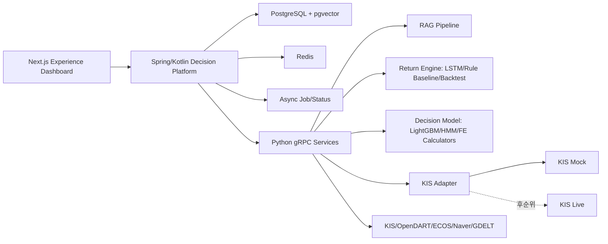

# API 명세서

작성일: 2026-06-23  
프로젝트명: 뉴스감성·LSTM 기반 투자 원칙 검증형 AI 자동매매 봇  
서비스명: 투자 원칙 기반 AI 트레이딩 코치  
대상 문서: `최종_프로젝트_명세서.md`

---

## 0. 문서 목적

이 문서는 프론트엔드, Spring/Kotlin Decision Platform, Python AI/Data 서비스, KIS Mock/Live-ready 어댑터 사이의 API 계약을 정의한다.

핵심 원칙은 다음과 같다.

1. 프론트엔드는 Spring/Kotlin API만 호출한다.
2. Python FastAPI/gRPC 서비스는 내부 서비스로 두고 프론트에 직접 노출하지 않는다.
3. 주문 승인/경고/차단의 최종 권한은 Spring RiskEngine에 둔다.
4. Python 서비스는 RAG, 모델 신호, 백테스트, 금융공학 계산, KIS Adapter를 담당한다.
5. Python/RAG/Signal/MarketData 장애가 발생하면 주문은 기본적으로 보류한다.
6. 모든 주문 관련 API는 audit log와 decision trace를 남긴다.

---

## 1. 전체 API 경계



| 계층 | 외부 노출 | 핵심 책임 |
|---|---:|---|
| Next.js Dashboard | 사용자 브라우저 | 화면, 차트, 원칙 설정, 주문 검토, 학습일지 |
| Spring/Kotlin API | 노출 | BFF, 인증, 원칙, RiskEngine, 주문 상태, 감사로그 |
| Python gRPC/FastAPI | 내부 | RAG, 모델 신호, 백테스트, 금융공학 계산, KIS Adapter |
| PostgreSQL/pgvector | 내부 | 사용자/원칙/주문/일지/RAG metadata/vector |
| Redis | 내부 | cache, lock, 임시 상태, idempotency key, rate limit |
| Async Job/Status | 내부 | 비동기 작업 상태, 감사 상태, 화면용 metric |

---

## 2. 공통 규칙

### 2.1 공통 헤더

| 헤더 | 필수 | 설명 |
|---|---:|---|
| `Authorization: Bearer <token>` | 예 | 사용자 인증 토큰 |
| `X-Request-Id` | 예 | 요청 추적 ID |
| `X-Idempotency-Key` | 주문/변경 요청 필수 | 중복 주문/중복 변경 방지 |
| `X-Client-Timezone` | 아니오 | 기본 `Asia/Seoul` |

### 2.2 공통 응답 envelope

```json
{
  "success": true,
  "requestId": "req_20260623_000001",
  "data": {},
  "warnings": [],
  "error": null
}
```

오류 응답:

```json
{
  "success": false,
  "requestId": "req_20260623_000001",
  "data": null,
  "warnings": [],
  "error": {
    "code": "RISK_BLOCKED",
    "message": "일일 손실 한도 초과로 주문이 차단되었습니다.",
    "details": {
      "ruleId": "daily_loss_guard",
      "currentLossRate": -0.042,
      "limit": -0.03
    }
  }
}
```

### 2.3 주요 오류 코드

| 코드 | HTTP | 의미 | 기본 처리 |
|---|---:|---|---|
| `VALIDATION_ERROR` | 400 | 요청 스키마 오류 | 화면에 입력 오류 표시 |
| `UNAUTHORIZED` | 401 | 인증 실패 | 로그인 유도 |
| `FORBIDDEN` | 403 | 권한 없음 | 접근 차단 |
| `NOT_FOUND` | 404 | 리소스 없음 | 빈 상태 표시 |
| `CONFLICT` | 409 | 버전 충돌 | 재조회 후 재시도 |
| `IDEMPOTENCY_CONFLICT` | 409 | 동일 idempotency key에 다른 payload | 요청 내용 확인 |
| `DECISION_EXPIRED` | 409 | decision 유효시간(`validUntil`) 초과 | 주문 재평가 유도 |
| `RISK_BLOCKED` | 422 | 원칙/안전장치 위반으로 주문 차단 | 주문 불가 |
| `DATA_STALE` | 409 | 가격/신호/뉴스 데이터 지연 | 주문 보류 |
| `RATE_LIMITED` | 429 | 호출 한도 초과(KIS rate limit, LLM 비용 가드) | `Retry-After` 헤더 기준 재시도 |
| `PYTHON_SERVICE_UNAVAILABLE` | 503 | 내부 gRPC 서비스 장애 | fail-closed |
| `BROKERAGE_UNAVAILABLE` | 503 | KIS 어댑터 장애 | 주문 보류 |

오류 처리 공통 규칙:

1. 클라이언트는 HTTP 상태 코드가 아니라 `error.code`로 분기한다. HTTP 상태는 로깅/모니터링 참고값이다.
2. Guide 모드 경고는 오류가 아니다. 경고는 항상 정상 응답의 `data.decision = WARN`과 `violations`로 표현한다. (기존 `RISK_WARNED` 오류 코드는 삭제됨.)
3. `RISK_BLOCKED`는 423(WebDAV Locked)이 아니라 422(Unprocessable Entity)를 사용한다. 요청 형식은 유효하나 비즈니스 규칙상 처리 불가라는 의미와 정확히 일치하기 때문이다.

### 2.4 인증/권한

`POST /api/v1/auth/login`으로 데모 계정을 인증하고 access token을 발급받는다. 토큰은 짧은 만료(기본 12시간)를 사용하고, payload에는 userId와 role만 담는다(민감정보 금지).

| 역할 | 접근 범위 |
|---|---|
| `USER` | 원칙, 결정, 주문, 잔고, RAG, 학습일지, 백테스트, Kill Switch 활성화 |
| `ADMIN` | USER 전체 + Kill Switch 해제, Async Job/Stream Metric/Artifact Ingest 상태, replay 관련 운영 기능 |

Kill Switch는 비대칭 권한을 적용한다. 활성화(정지)는 USER도 가능하지만 해제(재가동)는 ADMIN만 가능하다 — 안전한 방향은 넓게, 위험한 방향은 좁게 연다.

### 2.5 Idempotency 시맨틱

| 상황 | 동작 |
|---|---|
| 동일 key + 동일 payload 재요청 | 저장된 원 응답을 그대로 반환하고 부작용을 만들지 않는다 |
| 동일 key + 다른 payload | `IDEMPOTENCY_CONFLICT`(409) |
| key 보존 기간 | 24시간(Redis TTL) |
| 적용 대상 | 주문 제출/취소, 원칙 생성/수정, 백테스트 실행 |

### 2.6 목록 API 공통 pagination

목록 조회는 cursor 기반 pagination을 기본으로 한다.

- 요청: `?cursor=<opaque>&size=50` (기본 50, 최대 200)
- 응답: `data.items[]`와 `data.nextCursor` (마지막 페이지면 `null`)
- 적용 대상: journals, decisions, rag/sources, async-jobs, order events

### 2.7 시스템 상태 조회

`GET /api/v1/system/health`

```json
{
  "success": true,
  "data": {
    "asOf": "2026-06-23T15:31:00+09:00",
    "pythonService": "UP",
    "brokerage": "UP",
    "killSwitchActive": false,
    "dataFreshness": {
      "priceFresh": true,
      "signalFresh": true,
      "ragFresh": true
    },
    "degradedFeatures": []
  }
}
```

Risk API의 `dataFreshness`는 리스크 수치 관점, 이 API는 가용성 관점으로 역할을 분리한다. 프론트 상단 상태 배지와 fail-closed 시연의 근거 API다.

---

## 2A. Async Status API

Decision Platform의 비동기 처리는 외부 공개 API가 아니다. 공용 API 명세에는 작업 상태, stream metric, artifact ingest 상태 조회 계약만 둔다. 내부 이벤트 포맷, 처리 방식, 재시도, 장애 격리 세부 구현은 팀원 1 상세 구현명세서에서 관리한다.

### 2A.1 Async Job 상태 조회

`GET /api/v1/async-jobs/{jobId}`

응답:

```json
{
  "success": true,
  "data": {
    "jobId": "job_rag_index_20260623_001",
    "type": "RAG_INDEX",
    "status": "COMPLETED",
    "requestedAt": "2026-06-23T10:00:00+09:00",
    "startedAt": "2026-06-23T10:00:03+09:00",
    "completedAt": "2026-06-23T10:00:18+09:00",
    "sourceId": "src_kis_fee_001",
    "artifactId": null,
    "resultRef": "rag_index_result_20260623_001",
    "error": null
  }
}
```

`GET /api/v1/async-jobs?status=RUNNING&type=MODEL_EVAL`

상태값:

| 상태 | 의미 |
|---|---|
| `REQUESTED` | 요청 저장 완료 |
| `RUNNING` | worker 처리 중 |
| `COMPLETED` | 완료 결과 반영 |
| `FAILED` | 재시도 가능 실패 |
| `NEEDS_REVIEW` | 자동 처리 실패 후 수동 점검 필요 |

### 2A.2 Stream Metric 조회

`GET /api/v1/stream-metrics`

응답:

```json
{
  "success": true,
  "data": {
    "lastUpdatedAt": "2026-06-23T15:31:00+09:00",
    "pipelineHealth": "OK",
    "signalStaleRatio": 0.03,
    "decisionDistribution": {
      "ALLOW": 18,
      "WARN": 7,
      "HOLD": 4,
      "BLOCK": 2
    },
    "failedJobCount": 0
  }
}
```

### 2A.3 Artifact Ingest 상태 조회

`GET /api/v1/artifacts/ingest-status`

응답:

```json
{
  "success": true,
  "data": {
    "items": [
      {
        "artifactId": "artifact_lstm_20260623_001",
        "fileName": "lstm_signals.parquet",
        "producer": "return-engine",
        "runId": "run_20260623_001",
        "fileHash": "sha256:...",
        "schemaVersion": 1,
        "status": "INGESTED",
        "lastIngestedAt": "2026-06-23T10:00:00+09:00",
        "duplicate": false
      }
    ]
  }
}
```

### 2A.4 이벤트 push 채널 (고도화)

폴링 대체용 push 채널. 채택 시 SSE(Server-Sent Events)로 구현한다.

`GET /api/v1/events/stream` (SSE, Bearer 인증 필수)

| event type | payload |
|---|---|
| `order.updated` | orderId, status, filledQuantity |
| `async-job.updated` | jobId, status |
| `kill-switch.changed` | active, changedBy |

WebSocket 대비 구현 부담이 작고 시연 반응성을 높인다. v1 필수는 아니며 폴링 계약이 기본이다.

---

## 3. 공통 도메인 스키마

### 3.0 표기 규약

| 항목 | 규약 |
|---|---|
| 금액 | KRW 정수 (소수점 없음) |
| 수량 | 정수 |
| 수익률/비율 | 소수 표기 (3% = 0.03) |
| 시각 | ISO-8601 + KST offset (`2026-06-23T15:30:00+09:00`) |
| Money 객체 | 다중 통화가 필요해지기 전까지 사용 보류. v1 응답은 bare KRW 정수를 사용 |

### 3.1 Money

```json
{
  "amount": 1000000,
  "currency": "KRW"
}
```

### 3.2 Asset

```json
{
  "market": "KRX",
  "symbol": "005930",
  "name": "삼성전자",
  "assetType": "DOMESTIC_STOCK",
  "allowlisted": true,
  "liquidityTier": "HIGH"
}
```

`assetType` 값:

| 값 | 설명 |
|---|---|
| `DOMESTIC_STOCK` | 국내주식 |
| `GOLD_ETF` | 금 ETF |
| `GOLD_ETN` | 금 ETN |
| `OTHER_ETF` | 기타 ETF |
| `EXCLUDED` | v1 거래 제외 대상 |

### 3.3 TimeFrame

```json
{
  "primary": "1d",
  "secondary": "60m",
  "timezone": "Asia/Seoul"
}
```

---

## 4. Principle API

투자 원칙 CRUD, preset, 버전 관리를 담당한다.

Principle API의 입력 원칙은 다음과 같다.

1. 프론트는 자연어 원칙을 그대로 저장하지 않고, UI에서 받은 값을 구조화된 rule 배열로 전송한다.
2. preset은 공용 템플릿이며, `POST /api/v1/principles` 호출 시 사용자별 principle로 복사된다.
3. 사용자가 수정한 원칙은 `expectedVersion` 기반으로 새 version을 생성한다.
4. 주문 판단과 백테스트 Guide/Strict 시나리오는 같은 principle version을 참조한다.
5. ruleId, metric, operator, threshold, severity, enabled 값은 `contracts/schemas/principle.schema.json`을 따른다.

| UI 항목 | 입력 방식 | ruleId | metric | 기본 operator |
|---|---|---|---|---|
| 단일 종목 최대 비중 | % 입력 또는 slider | `max_position_per_asset` | `asset_weight` | `<=` |
| 금 ETF/ETN 최대 비중 | % 입력 또는 slider | `max_gold_etf_etn_weight` | `gold_etf_etn_weight` | `<=` |
| 1회 주문 최대 금액 | 원화 입력 | `max_single_order_amount` | `order_amount_krw` | `<=` |
| 일일 손실 한도 | % 입력 | `daily_loss_guard` | `daily_loss_rate` | `>=` |
| MDD 한도 | % 입력 | `mdd_guard` | `mdd` | `>=` |
| 하루 최대 주문 횟수 | 숫자 stepper | `max_daily_orders` | `daily_order_count` | `<=` |
| 부정 뉴스 대응 | 허용/경고/차단 선택 | `negative_news_guard` | `negative_news_score` | `<=` |
| 공시 위험 대응 | 경고/차단 선택 | `disclosure_risk_guard` | `disclosure_risk_score` | `<=` |

### 4.1 원칙 preset 조회

`GET /api/v1/principle-presets`

응답:

```json
{
  "success": true,
  "data": [
    {
      "presetId": "conservative",
      "name": "보수형",
      "description": "손실 제한과 분산투자를 우선하는 원칙",
      "defaultRules": [
        {
          "ruleId": "max_position_per_asset",
          "ruleType": "POSITION_LIMIT",
          "threshold": 0.15,
          "severity": "BLOCK"
        }
      ]
    }
  ]
}
```

### 4.2 사용자 원칙 생성

`POST /api/v1/principles`

요청:

```json
{
  "presetId": "balanced",
  "title": "균형형 국내주식+금 ETF 원칙",
  "mode": "GUIDE",
  "rules": [
    {
      "ruleId": "daily_loss_guard",
      "ruleType": "LOSS_LIMIT",
      "metric": "daily_loss_rate",
      "operator": ">=",
      "threshold": -0.03,
      "severity": "BLOCK",
      "enabled": true
    },
    {
      "ruleId": "max_single_order_amount",
      "ruleType": "ORDER_SIZE",
      "metric": "order_amount_krw",
      "operator": "<=",
      "threshold": 500000,
      "severity": "BLOCK",
      "enabled": true
    }
  ]
}
```

응답:

```json
{
  "success": true,
  "data": {
    "principleId": "prc_001",
    "version": 1,
    "status": "ACTIVE",
    "createdAt": "2026-06-23T10:00:00+09:00"
  }
}
```

### 4.3 원칙 조회

`GET /api/v1/principles/{principleId}`

### 4.4 원칙 수정

`PUT /api/v1/principles/{principleId}`

수정 시 `expectedVersion`을 포함한다.

```json
{
  "expectedVersion": 1,
  "mode": "STRICT",
  "rules": []
}
```

버전이 다르면 `409 CONFLICT`를 반환한다.

### 4.5 원칙 변경 이력 조회

`GET /api/v1/principles/{principleId}/versions`

---

## 5. Decision API

주문 의도와 투자 원칙, 모델 신호, 리스크 지표를 결합해 허용/경고/차단을 판단한다.

### 5.1 주문 의도 평가

`POST /api/v1/decisions/evaluate-order`

요청:

```json
{
  "principleId": "prc_001",
  "mode": "GUIDE",
  "orderIntent": {
    "symbol": "005930",
    "side": "BUY",
    "orderType": "MARKET",
    "quantity": 10,
    "estimatedPrice": 72000,
    "estimatedAmount": 720000,
    "timeframe": "1d",
    "strategyId": "strategy_lstm_lgbm_001"
  },
  "contextOptions": {
    "includeRagExplanation": true,
    "includeBacktestSummary": true,
    "includeFinancialEngineeringMetrics": true
  }
}
```

응답:

```json
{
  "success": true,
  "data": {
    "decisionId": "dec_001",
    "decision": "WARN",
    "mode": "GUIDE",
    "canSubmitOrder": true,
    "validUntil": "2026-06-23T10:10:00+09:00",
    "violations": [
      {
        "ruleId": "high_volatility_guard",
        "severity": "WARN",
        "message": "최근 20일 연환산 변동성이 원칙 기준보다 높습니다.",
        "metricValue": 0.42,
        "threshold": 0.35
      }
    ],
    "riskSummary": {
      "mdd": -0.081,
      "var95": -0.024,
      "cvar95": -0.037,
      "hmmRegime": "HIGH_VOLATILITY",
      "regimeProbability": 0.71
    },
    "signalSummary": {
      "finalSignal": "BUY_WEAK",
      "confidence": 0.58,
      "lstmSignal": "BUY",
      "lightgbmSignal": "HOLD",
      "newsSentiment": 0.12
    },
    "explanation": {
      "shortText": "매수는 가능하지만 변동성 기준이 높아 Guide 경고가 발생했습니다.",
      "citationIds": ["cit_001", "cit_002"]
    }
  }
}
```

`decision` 값:

| 값 | 의미 |
|---|---|
| `ALLOW` | 주문 가능 |
| `WARN` | Guide 경고. 사용자가 확인하면 주문 가능 |
| `BLOCK` | Strict 차단. 주문 불가 |
| `HOLD` | 데이터 지연 또는 내부 서비스 장애로 보류 |

decision 유효시간 규칙:

1. 모든 decision은 `validUntil`(기본 발급 후 10분)을 갖는다.
2. 만료된 `decisionId`로 주문을 제출하면 `DECISION_EXPIRED`(409)를 반환하고 재평가를 요구한다.
3. Kill Switch 활성화, 해당 사용자의 principle 새 버전 저장, data freshness BLOCK 진입 시 미사용 decision은 즉시 무효화된다.
4. decision 1건은 주문 1건에만 사용할 수 있다.

이 규칙은 "과거 가격/신호로 받은 승인으로 현재 주문을 내는" 시간차 race를 차단한다.

### 5.2 결정 상세 조회

`GET /api/v1/decisions/{decisionId}`

### 5.3 결정 감사로그 조회

`GET /api/v1/decisions/{decisionId}/audit`

---

## 6. Risk API

RiskEngine은 Spring에 있으며, 금융공학 계산값은 Python에서 받아오되 최종 판단은 Spring에서 수행한다.

### 6.1 현재 리스크 상태 조회

`GET /api/v1/risk/portfolio`

응답:

```json
{
  "success": true,
  "data": {
    "asOf": "2026-06-23T15:30:00+09:00",
    "portfolioValue": 10000000,
    "dailyPnlRate": -0.012,
    "mdd": -0.064,
    "var95": -0.021,
    "cvar95": -0.034,
    "realizedVolatility20d": 0.24,
    "annualizedVolatility20d": 0.38,
    "hmmRegime": "RISK_OFF",
    "hmmRegimeProbability": 0.67,
    "killSwitchActive": false,
    "dataFreshness": {
      "priceFresh": true,
      "signalFresh": true,
      "ragFresh": true
    }
  }
}
```

### 6.2 종목별 리스크 조회

`GET /api/v1/risk/assets/{symbol}`

### 6.3 Kill Switch 변경

`POST /api/v1/risk/kill-switch`

요청:

```json
{
  "active": true,
  "reason": "중간 시연 중 수동 중지",
  "requestedBy": "team1"
}
```

Kill Switch 활성화 상태에서는 모든 신규 주문을 `RISK_BLOCKED`로 처리한다.

`GET /api/v1/risk/kill-switch`로 현재 상태(활성 여부, 마지막 변경 행위자/사유/시각)를 조회한다. 활성화는 USER 권한으로 가능하지만 해제는 ADMIN 전용이며(2.4 권한 표), 모든 변경은 행위자와 사유를 감사로그에 남긴다.

---

## 7. RAG API

RAG는 v1 핵심 구현이다. 단, RAG 답변은 매수/매도 지시가 아니라 근거 기반 설명으로 제한한다. 런타임 RAG corpus는 공식자료, 공시/API 문서, 프로젝트 산출물, 금융공학 source card로 제한한다. 뉴스 원문 전체는 RAG corpus에 포함하지 않고, Return Engine이 만든 `news_sentiment_summary` artifact만 설명 근거로 연결한다.

### 7.1 RAG 질문

`POST /api/v1/rag/ask`

요청:

```json
{
  "question": "금 ETF와 금 ETN의 차이가 뭐야?",
  "intent": "LEARNING",
  "answerMode": "CONCISE",
  "relatedSymbols": ["132030"],
  "principleId": "prc_001",
  "relatedArtifacts": [
    {
      "artifactType": "NEWS_SENTIMENT_SUMMARY",
      "artifactId": "news_sum_005930_20260623"
    }
  ],
  "retrievalOptions": {
    "sourceTiers": ["RUNTIME_PUBLIC", "PROJECT_ARTIFACT", "INTERNAL_STUDY_CARD"],
    "topK": 8,
    "requireCitation": true
  }
}
```

응답:

```json
{
  "success": true,
  "data": {
    "answerId": "rag_ans_001",
    "answer": "금 ETF는 금 가격을 추종하는 상장지수펀드이고, 금 ETN은 증권사가 발행한 상장지수증권입니다. 둘 다 금 가격에 연동될 수 있지만 발행 구조와 신용위험이 다릅니다.",
    "confidence": 0.82,
    "citationCoverage": 0.91,
    "retrievalFailure": false,
    "sources": [
      {
        "citationId": "cit_001",
        "sourceId": "src_fss_etf_risk_001",
        "title": "ETF 투자위험 체크포인트",
        "sourceType": "OFFICIAL",
        "url": "https://www.fss.or.kr/",
        "snippet": "ETF 투자 시 추적오차, 괴리율, 기초자산 위험을 확인해야 한다.",
        "usedInAnswer": true
      }
    ],
    "guardrails": {
      "investmentAdviceBlocked": true,
      "missingCitationWarning": false,
      "directAdviceBlocked": true
    }
  }
}
```

`answerMode`는 `CONCISE`(기본)/`DETAILED`를 지원한다. 답변 토큰 스트리밍(SSE)은 고도화 항목이며, 채택 시 `POST /api/v1/rag/ask/stream`으로 별도 계약을 추가한다.

### 7.2 RAG source 검색

`GET /api/v1/rag/sources?query=ETF&sourceTier=RUNTIME_PUBLIC`

### 7.3 RAG 답변 평가 저장

`POST /api/v1/rag/answers/{answerId}/feedback`

요청:

```json
{
  "helpful": true,
  "citationHelpful": true,
  "comment": "ETF와 ETN 차이를 이해하는 데 도움이 됨"
}
```

### 7.4 공개 모델 후보 및 평가 리포트 조회

`GET /api/v1/rag/model-candidates`

용도:

1. Hugging Face 등 공개 모델 후보를 시스템에 기록한다.
2. RAG embedding, reranker, 감성분석 모델의 채택/보류/제외 판단을 조회한다.
3. 중간보고서와 최종보고서에서 모델 선택 근거를 재사용한다.

응답:

```json
{
  "success": true,
  "data": {
    "checkedAt": "2026-06-23",
    "embeddingCandidates": [
      {
        "modelId": "BAAI/bge-m3",
        "provider": "HUGGING_FACE",
        "license": "mit",
        "role": "RUNTIME_DEFAULT",
        "status": "ADOPTED",
        "reason": "한국어/영어 혼합 RAG 기본 embedding"
      },
      {
        "modelId": "dragonkue/BGE-m3-ko",
        "provider": "HUGGING_FACE",
        "license": "apache-2.0",
        "role": "COMPARISON_CANDIDATE",
        "status": "EVALUATING",
        "reason": "한국어 공식자료 검색 비교 후보"
      }
    ],
    "sentimentCandidates": [
      {
        "modelId": "ProsusAI/finbert",
        "role": "ENGLISH_NEWS_BASELINE",
        "status": "COMPARISON_ONLY"
      },
      {
        "modelId": "snunlp/KR-FinBert-SC",
        "role": "KOREAN_FINANCE_CANDIDATE_WITH_RULE_FALLBACK",
        "status": "COMPARISON_ONLY"
      }
    ],
    "excludedCandidates": [
      {
        "query": "trading bot",
        "reason": "개인 실험/데모 중심이며 KIS/RiskEngine/투자 원칙 요구사항을 충족하지 않음"
      }
    ]
  }
}
```

`GET /api/v1/rag/model-evaluations/{evaluationId}`

응답:

```json
{
  "success": true,
  "data": {
    "evaluationId": "rag_eval_20260623_001",
    "task": "RAG_EMBEDDING_RETRIEVAL",
    "dataset": "internal_finance_rag_eval_50",
    "metrics": {
      "recallAt5": 0.86,
      "mrr": 0.72,
      "citationCoverage": 0.91,
      "retrievalFailureRate": 0.08
    },
    "winner": "BAAI/bge-m3",
    "notes": "한국어 공식자료와 영어 논문 source card 혼합 질의에서 가장 안정적이었다."
  }
}
```

상태값:

| 상태 | 의미 |
|---|---|
| `EVALUATING` | 후보 평가 중 |
| `ADOPTED` | v1 기본 모델로 채택 |
| `COMPARISON_ONLY` | 비교/보고서용으로만 사용 |
| `RESEARCH_ONLY` | 후순위 연구 |
| `EXCLUDED` | 채택 제외 |

---

## 8. Signal API

Return Engine과 Decision Platform이 생성한 모델 신호를 Spring에서 조회한다. 팀원 B는 LSTM/규칙 baseline artifact를, 팀원 1은 LightGBM artifact를 계약에 맞춰 export한다.

### 8.1 종목 신호 조회

`GET /api/v1/signals/{symbol}?timeframe=1d`

응답:

```json
{
  "success": true,
  "data": {
    "symbol": "005930",
    "asOf": "2026-06-23T15:30:00+09:00",
    "timeframe": "1d",
    "finalSignal": "HOLD",
    "confidence": 0.62,
    "modelReportId": "model_report_return_engine_20260623",
    "components": {
      "ruleBaseline": {
        "producer": "RULE_BASELINE",
        "sourceWorkspace": "return-engine",
        "asOf": "2026-06-23T15:30:00+09:00",
        "signal": "HOLD",
        "confidence": 0.51,
        "predictedReturn": 0.001,
        "featureSummary": ["ma20_above_ma60", "rsi_neutral"],
        "rulesTriggered": ["ma20_above_ma60", "rsi_neutral"]
      },
      "lstm": {
        "producer": "LSTM",
        "sourceWorkspace": "return-engine",
        "asOf": "2026-06-23T15:30:00+09:00",
        "signal": "BUY",
        "confidence": 0.57,
        "predictedReturn": 0.008,
        "featureSummary": ["close_sequence_60", "volume_sequence_60"]
      },
      "lightgbm": {
        "producer": "LIGHTGBM",
        "sourceWorkspace": "decision-platform",
        "asOf": "2026-06-23T15:30:00+09:00",
        "signal": "HOLD",
        "confidence": 0.66,
        "predictedReturn": 0.003,
        "featureSummary": ["momentum_20d", "volatility_20d", "news_sentiment_3d"],
        "featureImportanceTop": ["momentum_20d", "volatility_20d", "news_sentiment_3d"]
      },
      "newsSentiment": {
        "score": 0.14,
        "articleCount": 18,
        "summaryArtifactId": "news_sum_005930_20260623",
        "conflictFlag": false
      },
      "hmmRegime": {
        "state": "SIDEWAYS",
        "probability": 0.52
      }
    }
  }
}
```

### 8.2 뉴스감성 요약 artifact 조회

`GET /api/v1/signals/{symbol}/news-sentiment-summary?asOf=2026-06-23`

이 API는 RAG가 뉴스 원문 전체를 직접 ingest하지 않도록 Return Engine이 만든 요약 artifact를 제공한다. RAG는 이 artifact를 출처와 함께 설명하지만, 뉴스만으로 매수/매도 결정을 수행하지 않는다.

응답:

```json
{
  "success": true,
  "data": {
    "artifactId": "news_sum_005930_20260623",
    "symbol": "005930",
    "asOf": "2026-06-23T15:30:00+09:00",
    "sentimentScore": 0.14,
    "articleCount": 18,
    "conflictFlag": false,
    "summary": "최근 3일간 반도체 업황 회복 기대 기사와 단기 차익실현 우려 기사가 함께 관측되었으며, 종합 감성은 약한 긍정으로 분류되었다.",
    "representativeSources": [
      {
        "title": "반도체 업황 회복 기대",
        "url": "https://example.com/news/1",
        "publishedAt": "2026-06-23T09:10:00+09:00",
        "sentimentLabel": "POSITIVE"
      },
      {
        "title": "단기 차익실현 우려",
        "url": "https://example.com/news/2",
        "publishedAt": "2026-06-22T14:20:00+09:00",
        "sentimentLabel": "NEGATIVE"
      }
    ],
    "ragUsage": {
      "ingestMode": "ARTIFACT_ONLY",
      "rawNewsCorpusStored": false,
      "allowedUse": "EXPLANATION_ONLY"
    }
  }
}
```

필드 규칙:

| 필드 | 규칙 |
|---|---|
| `sentimentScore` | -1에서 1 사이 값 |
| `articleCount` | 집계 기사 수. 0이면 `DATA_INSUFFICIENT` 경고 |
| `conflictFlag` | 긍정/부정 대표 출처가 동시에 강할 때 true |
| `representativeSources` | 원문 전체 저장이 아니라 URL/제목/시각/라벨 metadata |
| `ragUsage.rawNewsCorpusStored` | v1에서는 항상 false |

### 8.3 Signal API 해석 규칙

Signal API는 모델 결과를 노출하지만 주문 권한을 갖지 않는다. 프론트는 `finalSignal`을 참고 정보로 보여주고, 실제 주문 가능 여부는 Decision API와 RiskEngine 응답을 따라야 한다.

| 규칙 | 설명 |
|---|---|
| 규칙 baseline/LSTM/LightGBM 비교 | 세 모델은 같은 universe, 같은 기간, 같은 비용 조건에서 비교된 결과여야 한다 |
| `producer` | `RULE_BASELINE`, `LSTM`, `LIGHTGBM` 중 하나로 모델 출처를 구분한다 |
| `sourceWorkspace` | 규칙 baseline/LSTM은 `return-engine`, LightGBM은 `decision-platform`으로 기록한다 |
| HMM 처리 | HMM은 가격 예측 모델이 아니라 시장국면/고변동 리스크 필터로 해석한다 |
| 뉴스감성 제한 | 뉴스감성은 보조 feature이며 뉴스만으로 매수/매도를 결정하지 않는다 |
| stale signal | `asOf`가 허용 지연시간을 넘으면 Decision API는 HOLD 또는 BLOCK을 반환한다 |
| 상충 신호 | LSTM이 BUY여도 LightGBM이 HOLD이고 HMM이 고변동이면 Decision API는 WARN/HOLD를 반환할 수 있다 |
| 모델 리포트 | `modelReportId`를 통해 데이터 기간, feature, 학습/검증 분리, 한계가 기록된 `model_report.md`를 참조한다 |

### 8.4 Dashboard API 소비 기준

Experience Dashboard는 Spring API와 계약된 artifact를 기반으로 모델 평가 결과와 리스크 판단을 사용자가 이해하기 쉬운 ViewModel과 화면으로 구성한다. 공식 수익률, 리스크 지표, 주문 판단은 Decision Platform과 Return Engine의 산출물을 기준으로 하며, Dashboard는 이를 일관된 화면 경험으로 전달한다.

| 항목 | API 권한 |
|---|---|
| Model Evaluation ViewModel | Signal API와 Backtest API의 `modelComparison`, confidence, predictedReturn, model disagreement를 화면용 구조로 구성 |
| Backtest Visualization ViewModel | Backtest API의 수익률, MDD, Sharpe, Sortino, 거래비용 반영 값을 chart/table/card 데이터로 구성 |
| RAG Source Display | RAG API의 `sources`, `citationCoverage`, `retrievalFailure`를 핵심 출처와 근거 상태로 표시 |
| Risk Result Display | Decision API/Risk API의 `ALLOW/WARN/HOLD/BLOCK` 결과와 주요 사유를 사용자가 이해하기 쉬운 badge/list로 표시 |
| Report Capture | 중간보고서와 발표자료에 활용할 수 있는 일관된 캡처 화면 구성 |

---

## 9. Backtest API

### 9.1 백테스트 실행 요청

`POST /api/v1/backtests`

요청:

```json
{
  "strategyId": "strategy_lstm_lgbm_001",
  "symbols": ["005930", "000660", "132030"],
  "period": {
    "from": "2023-01-01",
    "to": "2026-05-31"
  },
  "initialCapitalKrw": 10000000,
  "scenarioSet": ["BASELINE", "GUIDE", "STRICT"],
  "costModel": {
    "source": "KIS_FEE_PAGE_CONFIG",
    "commissionRate": 0.00015,
    "taxRate": 0.0018,
    "slippageBps": 5
  },
  "riskOptions": {
    "includeVarCvar": true,
    "includeHmmRegime": true,
    "includeMeanReversionDiagnostics": true,
    "includeOptionAnalytics": false
  }
}
```

응답:

```json
{
  "success": true,
  "data": {
    "backtestId": "bt_001",
    "status": "REQUESTED",
    "estimatedSeconds": 90
  }
}
```

백테스트 상태값은 Async Job 상태 체계(`REQUESTED/RUNNING/COMPLETED/FAILED/NEEDS_REVIEW`)를 그대로 따른다(별도 어휘 사용 금지). 실행 취소는 `POST /api/v1/backtests/{backtestId}/cancel`로 요청한다.

### 9.2 백테스트 결과 조회

`GET /api/v1/backtests/{backtestId}`

응답:

```json
{
  "success": true,
  "data": {
    "backtestId": "bt_001",
    "status": "COMPLETED",
    "modelComparison": [
      {
        "model": "RULE_BASELINE",
        "cagr": 0.041,
        "mdd": -0.133,
        "sharpe": 0.42,
        "tradeCount": 38
      },
      {
        "model": "LSTM",
        "cagr": 0.067,
        "mdd": -0.151,
        "sharpe": 0.58,
        "tradeCount": 44
      },
      {
        "model": "LIGHTGBM",
        "cagr": 0.084,
        "mdd": -0.172,
        "sharpe": 0.71,
        "tradeCount": 49
      }
    ],
    "summary": [
      {
        "scenario": "BASELINE",
        "cagr": 0.084,
        "mdd": -0.172,
        "sharpe": 0.71,
        "sortino": 0.92,
        "var95": -0.026,
        "cvar95": -0.041,
        "turnover": 2.8,
        "principleViolations": 41
      },
      {
        "scenario": "STRICT",
        "cagr": 0.073,
        "mdd": -0.109,
        "sharpe": 0.83,
        "sortino": 1.08,
        "var95": -0.018,
        "cvar95": -0.030,
        "turnover": 1.9,
        "principleViolations": 0
      }
    ],
    "artifactUrls": {
      "lstmSignalsParquet": "/api/v1/backtests/bt_001/artifacts/lstm_signals.parquet",
      "ruleBaselineSignalsParquet": "/api/v1/backtests/bt_001/artifacts/rule_baseline_signals.parquet",
      "lightgbmSignalJson": "/api/v1/backtests/bt_001/artifacts/lightgbm_signal.json",
      "backtestResultJson": "/api/v1/backtests/bt_001/artifacts/backtest_result.json",
      "equityCurveCsv": "/api/v1/backtests/bt_001/artifacts/equity_curve.csv",
      "tradeLogCsv": "/api/v1/backtests/bt_001/artifacts/trades.csv",
      "modelReportMarkdown": "/api/v1/backtests/bt_001/artifacts/model_report.md",
      "reportMarkdown": "/api/v1/backtests/bt_001/artifacts/report.md"
    }
  }
}
```

artifact 다운로드 URL은 공개 링크가 아니며 다른 API와 동일한 Bearer 인증을 요구한다.

결과 해석 규칙:

| 항목 | 규칙 |
|---|---|
| `modelComparison` | 규칙 baseline, LSTM, LightGBM의 동일 조건 비교 결과 |
| `summary` | 모델 신호만 쓰는 Baseline과 원칙/RiskEngine이 개입한 Guide/Strict 비교 결과 |
| Return Engine artifact | `lstm_signals.parquet`, `rule_baseline_signals.parquet`, `backtest_result.json`, `trade_log.parquet`, `model_report.md` |
| Decision Platform artifact | `lightgbm_signal.json`, `risk_decision.json`, `financial_engineering_report.md`, `rag_answer_with_sources.json` |
| 거래비용 | 수수료, 세금, slippage를 반영하지 않은 결과는 공식 성과로 쓰지 않음 |
| HMM/Risk | HMM 국면, VaR/CVaR, MDD는 Decision Platform에서 재검증 가능해야 함 |

---

## 10. Brokerage API

KIS Mock 중심으로 구현하고, KIS Live는 고급해제/3단계 동의/재동의 조건을 충족할 때만 확장한다. S1.1의 KIS 작업은 Brokerage API가 아니라 MarketDataService 내부 구현이며, 주문·정정·취소·잔고 변경을 만들지 않는다.

Live 경계는 다음과 같이 분리한다.

| 구분 | 의미 | 기본 상태 |
|---|---|---|
| Live read-only market data | 실전 Domain에서 현재가/기간별시세 같은 조회 API를 읽는 것 | S1.1에서 설정 가능하되 `KIS_OFFLINE=1` fixture smoke를 우선 |
| Live account read-only | 실계좌 잔고/주문가능/체결조회 같은 민감 조회 | S3 catalog/Mock 검증 이후 별도 gate로 검토 |
| Live trading | 실계좌 주문·정정·취소 | 기본 OFF. live-order gate, 3단계 동의, kill switch, audit/reconciliation 전까지 비활성 |

### 10.1 Mock 주문 제출

`POST /api/v1/brokerage/mock/orders`

요청:

```json
{
  "decisionId": "dec_001",
  "orderIntent": {
    "symbol": "005930",
    "side": "BUY",
    "orderType": "MARKET",
    "quantity": 10,
    "estimatedPrice": 72000
  },
  "userAcknowledgement": {
    "warningsAccepted": true,
    "acceptedAt": "2026-06-23T10:10:00+09:00"
  }
}
```

응답:

```json
{
  "success": true,
  "data": {
    "orderId": "ord_mock_001",
    "brokerageMode": "KIS_MOCK",
    "status": "SUBMITTED",
    "submittedAt": "2026-06-23T10:10:01+09:00"
  }
}
```

주문 제출 검증 규칙:

1. `decisionId`가 만료(`validUntil` 초과)되었으면 `DECISION_EXPIRED`(409)로 거부한다.
2. 이미 주문에 사용된 `decisionId`는 재사용할 수 없다(1 decision = 1 order).
3. `X-Idempotency-Key`가 동일한 재요청은 저장된 원 응답을 반환한다(2.5 시맨틱).

### 10.2 주문 상태 조회

`GET /api/v1/brokerage/orders/{orderId}`

주문 상태 머신:

| 상태 | 전이 가능 상태 | 비고 |
|---|---|---|
| `SUBMITTED` | `ACCEPTED`, `REJECTED` | KIS 접수 응답 기준 |
| `ACCEPTED` | `PARTIALLY_FILLED`, `FILLED`, `CANCEL_REQUESTED` | |
| `PARTIALLY_FILLED` | `FILLED`, `CANCEL_REQUESTED` | 부분 체결 수량 기록 |
| `CANCEL_REQUESTED` | `CANCELLED`, `FILLED` | 취소 접수 후에도 체결이 먼저 도착할 수 있음(race 허용) |
| `FILLED` / `CANCELLED` / `REJECTED` | 종료 상태 | 종료 상태 이후 전이는 오류로 기록 |

### 10.3 주문 취소

`POST /api/v1/brokerage/orders/{orderId}/cancel`

### 10.4 잔고 조회

`GET /api/v1/brokerage/mock/accounts/{accountId}/balances`

### 10.5 Live 활성화 상태 조회

`GET /api/v1/brokerage/live-readiness`

응답:

```json
{
  "success": true,
  "data": {
    "liveEnabled": false,
    "reason": "발표/검증 단계에서는 KIS Mock만 사용",
    "requiredSteps": [
      "advanced_unlock",
      "minimum_safety_controls_verified",
      "three_step_consent",
      "reconsent_after_rule_change"
    ]
  }
}
```

### 10.6 Live 동의 이력 (설계 계약)

최종 명세서 8.5의 3단계 동의 흐름에 대응하는 계약이다. v1에서는 비활성 게이트와 함께 계약만 두고, 실제 Live 활성화에는 사용하지 않는다.

`POST /api/v1/consents`

```json
{
  "consentType": "LIVE_STEP1_STRATEGY_SUMMARY",
  "principleId": "prc_001",
  "principleVersion": 3,
  "acknowledgedAt": "2026-06-23T10:00:00+09:00"
}
```

`GET /api/v1/consents?type=LIVE`

동의 이력은 append-only로 저장하고, 원칙/주문 상한/universe/RiskEngine 기준이 변경되면 기존 동의는 무효 처리되어 재동의가 필요하다.

---

## 11. Journal API

### 11.1 학습일지 생성

`POST /api/v1/journals`

요청:

```json
{
  "title": "삼성전자 매수 후보 검토",
  "relatedDecisionId": "dec_001",
  "relatedBacktestId": "bt_001",
  "content": {
    "whatHappened": "LSTM은 매수였지만 LightGBM은 보류였고, HMM은 고변동 국면을 표시했다.",
    "whatLearned": "단일 모델 신호보다 리스크 지표를 함께 봐야 한다.",
    "nextAction": "Strict 모드에서는 신규 매수를 보류한다."
  },
  "tags": ["HMM", "RiskEngine", "KIS Mock"]
}
```

### 11.2 학습일지 목록

`GET /api/v1/journals?from=2026-06-01&to=2026-06-30`

### 11.3 학습일지 수정/삭제

`PATCH /api/v1/journals/{journalId}` — title, content, tags 부분 수정. `expectedVersion` 없이 최종 수정 우선.

`DELETE /api/v1/journals/{journalId}` — soft delete(`deletedAt` 기록). 사용자 테스트 중 회고 수정이 빈번하므로 v1에 포함한다.

---

## 12. Financial Engineering API

금융공학 계산 기능은 투자 권유나 주문 실행을 위한 기능이 아니다. 이 API는 RAG 금융수학 카드, 주문검토 리스크 설명, 백테스트 리포트, 학습 화면에 필요한 계산 결과만 제공한다.

### 12.1 Black-Scholes 가격 계산

`POST /api/v1/financial-engineering/options/black-scholes`

요청:

```json
{
  "optionType": "CALL",
  "underlyingPrice": 72000,
  "strikePrice": 75000,
  "timeToMaturityYears": 0.25,
  "riskFreeRate": 0.032,
  "dividendYield": 0.01,
  "volatility": 0.28
}
```

응답:

```json
{
  "success": true,
  "data": {
    "model": "BLACK_SCHOLES_MERTON",
    "optionType": "CALL",
    "theoreticalPrice": 2315.42,
    "d1": -0.0941,
    "d2": -0.2341,
    "assumptions": [
      "European exercise",
      "constant volatility",
      "constant risk-free rate",
      "continuous dividend yield"
    ],
    "usageLimit": "교육/리스크 설명용 계산이며 매매 신호가 아닙니다."
  }
}
```

### 12.2 Greeks 계산

`POST /api/v1/financial-engineering/options/greeks`

요청:

```json
{
  "optionType": "PUT",
  "underlyingPrice": 72000,
  "strikePrice": 75000,
  "timeToMaturityYears": 0.25,
  "riskFreeRate": 0.032,
  "dividendYield": 0.01,
  "volatility": 0.28
}
```

응답:

```json
{
  "success": true,
  "data": {
    "delta": -0.5204,
    "gamma": 0.000039,
    "vega": 141.23,
    "thetaPerYear": -5380.44,
    "thetaPerDay": -14.74,
    "rho": -92.18,
    "interpretation": {
      "delta": "기초자산 가격 변화에 대한 옵션가격 민감도",
      "gamma": "Delta 변화율",
      "vega": "변동성 변화에 대한 민감도",
      "theta": "시간 경과에 따른 가치 감소",
      "rho": "금리 변화에 대한 민감도"
    }
  }
}
```

### 12.3 Implied Volatility 역산

`POST /api/v1/financial-engineering/options/implied-volatility`

요청:

```json
{
  "optionType": "CALL",
  "marketPrice": 2315.42,
  "underlyingPrice": 72000,
  "strikePrice": 75000,
  "timeToMaturityYears": 0.25,
  "riskFreeRate": 0.032,
  "dividendYield": 0.01,
  "solver": "BISECTION",
  "lowerVolatility": 0.0001,
  "upperVolatility": 5.0,
  "tolerance": 0.000001,
  "maxIterations": 100
}
```

응답:

```json
{
  "success": true,
  "data": {
    "impliedVolatility": 0.280001,
    "solver": "BISECTION",
    "iterations": 37,
    "pricingError": 0.0031,
    "status": "CONVERGED",
    "warning": "시장가격 품질과 만기/배당/금리 입력에 따라 역산 변동성은 달라질 수 있습니다."
  }
}
```

실패 응답:

```json
{
  "success": false,
  "error": {
    "code": "IV_NOT_BRACKETED",
    "message": "입력한 시장가격이 지정한 변동성 범위 안에서 BSM 가격으로 재현되지 않습니다."
  }
}
```

입력 검증 규약:

| 입력 | 도메인 |
|---|---|
| `underlyingPrice`, `strikePrice`, `marketPrice` | > 0 |
| `timeToMaturityYears` | > 0 |
| `volatility` | > 0 (IV 역산 탐색 범위는 [0.0001, 5.0]) |
| `riskFreeRate`, `dividendYield` | 연속복리 소수 표기 (3.2% = 0.032) |

도메인 위반은 `VALIDATION_ERROR`(400)로, 계산 자체의 실패(브래킷 실패, 미수렴)는 `IV_NOT_BRACKETED`/`IV_NOT_CONVERGED`로 구분해 반환한다.

계산 결과는 설명과 리스크 이해를 돕는 보조 정보다. `Decision API`는 이 값을 직접 주문 신호로 해석하지 않는다.

---

## 13. Python gRPC 계약

proto 파일은 `contracts/proto/`에 둔다.

### 13.0 공통 운영 계약

| RPC | deadline | 재시도 | 실패 시 REST 매핑 |
|---|---|---|---|
| `SignalService.GetSignal`/`BatchGetSignals` | 2s | 멱등 조회 1회 재시도 | `PYTHON_SERVICE_UNAVAILABLE` → HOLD |
| `FinancialEngineeringService.*` | 3s (`RunMonteCarloStress`는 10s) | 1회 재시도 | `PYTHON_SERVICE_UNAVAILABLE` → HOLD |
| `RagService.GenerateAnswer` | 15s | 재시도 없음 | 답변 실패 안내 |
| `RagService.SearchSources` | 3s | 1회 재시도 | 검색 실패 표시 |
| `BrokerageService.SubmitMockOrder`/`CancelOrder` | 5s | 재시도 금지(멱등 키 재요청만 허용) | `BROKERAGE_UNAVAILABLE` → 주문 보류 |
| `MarketDataService.GetPriceSnapshot` | 2s | GET 조회 1회 재시도 | `DATA_STALE` 또는 `PYTHON_SERVICE_UNAVAILABLE` → HOLD |
| `BacktestService.RunBacktest` | 동기 대기 금지, async job 전환 | - | async job 상태로 추적 |

gRPC status 매핑: `UNAVAILABLE`/`DEADLINE_EXCEEDED` → `PYTHON_SERVICE_UNAVAILABLE`(503), `INVALID_ARGUMENT` → `VALIDATION_ERROR`(400), `NOT_FOUND` → `NOT_FOUND`(404). 주문 관련 실패는 항상 fail-closed로 수렴한다.

### 13.1 RagService

```proto
service RagService {
  rpc SearchSources(SearchSourcesRequest) returns (SearchSourcesResponse);
  rpc GenerateAnswer(GenerateAnswerRequest) returns (GenerateAnswerResponse);
  rpc EvaluateAnswer(EvaluateAnswerRequest) returns (EvaluateAnswerResponse);
}
```

필수 반환:

| 필드 | 설명 |
|---|---|
| `answer` | 답변 본문 |
| `citations` | 출처 목록 |
| `citationCoverage` | 답변 내 출처 커버리지 |
| `retrievalFailure` | 검색 실패 여부 |
| `guardrailFlags` | 투자권유/출처부족/환각 의심 flag |

### 13.2 SignalService

```proto
service SignalService {
  rpc GetSignal(GetSignalRequest) returns (GetSignalResponse);
  rpc BatchGetSignals(BatchGetSignalsRequest) returns (BatchGetSignalsResponse);
}
```

### 13.3 BacktestService

```proto
service BacktestService {
  rpc RunBacktest(RunBacktestRequest) returns (RunBacktestResponse);
  rpc GetBacktestResult(GetBacktestResultRequest) returns (GetBacktestResultResponse);
}
```

### 13.4 BrokerageService

```proto
service BrokerageService {
  rpc SubmitMockOrder(SubmitMockOrderRequest) returns (SubmitOrderResponse);
  rpc CancelOrder(CancelOrderRequest) returns (CancelOrderResponse);
  rpc GetBalances(GetBalancesRequest) returns (GetBalancesResponse);
  rpc StreamOrderEvents(StreamOrderEventsRequest) returns (stream OrderEvent);
}
```

Python KIS Adapter는 주문 실행 어댑터일 뿐이다. 최종 주문 승인권은 Spring Decision Platform에 있다.

### 13.5 MarketDataService

```proto
service MarketDataService {
  rpc GetPriceSnapshot(GetPriceSnapshotRequest) returns (GetPriceSnapshotResponse);
  rpc GetDisclosureEvents(GetDisclosureEventsRequest) returns (GetDisclosureEventsResponse);
  rpc GetNewsSummary(GetNewsSummaryRequest) returns (GetNewsSummaryResponse);
  rpc GetMacroSnapshot(GetMacroSnapshotRequest) returns (GetMacroSnapshotResponse);
}
```

S1.1의 KIS MarketDataService 구현 경계는 다음과 같다.

| 항목 | 계약 |
|---|---|
| mode | `KIS_MODE=mock\|live`는 시장데이터 조회 Domain 선택이다. Live 주문 활성화와 무관하다 |
| offline | `KIS_OFFLINE=1`이면 KIS 네트워크 호출 없이 sanitized fixture로 current/daily parser와 parquet upsert를 검증한다 |
| token | `/oauth2/tokenP` token은 Redis `kis:token`에 저장하고 만료 5분 전부터 갱신한다. 유효기간은 1일이고 발급 후 6시간 이내 재요청 시 기존 토큰이 반환된다. 토큰 원문은 로그와 fixture에 남기지 않는다 |
| current price | `/uapi/domestic-stock/v1/quotations/inquire-price`, TR `FHKST01010100`(모의 동일 TR 지원)만 S1.1 필수 |
| daily bars | `/uapi/domestic-stock/v1/quotations/inquire-daily-itemchartprice`, TR `FHKST03010100`(모의 동일 TR 지원), 1회 최대 100건 단위 반복 백필 |
| market calendar | `/uapi/domestic-stock/v1/quotations/chk-holiday`, TR `CTCA0903R`는 모의투자 미지원(실전 Domain 전용) supporting read다. mock/offline에서는 fixture 또는 skip으로 처리하고 호출 시 1일 1회 이하로 보수 운영 |
| storage | raw 응답과 parquet/csv/jsonl 산출물은 ignored local data 경로에만 저장한다. 커밋 가능한 테스트 데이터는 마스킹된 fixture만 허용한다 |
| retry | GET market-data 조회는 rate limit과 timeout을 지켜 제한적으로 재시도한다. POST 주문성 호출은 S1.1에서 구현하지 않는다 |

### 13.6 FinancialEngineeringService

```proto
service FinancialEngineeringService {
  rpc CalculateRiskMetrics(CalculateRiskMetricsRequest) returns (CalculateRiskMetricsResponse);
  rpc EstimateHmmRegime(EstimateHmmRegimeRequest) returns (EstimateHmmRegimeResponse);
  rpc RunMonteCarloStress(RunMonteCarloStressRequest) returns (RunMonteCarloStressResponse);
  rpc AnalyzeMeanReversion(AnalyzeMeanReversionRequest) returns (AnalyzeMeanReversionResponse);
  rpc CalculateBlackScholes(CalculateBlackScholesRequest) returns (CalculateBlackScholesResponse);
  rpc CalculateOptionGreeks(CalculateOptionGreeksRequest) returns (CalculateOptionGreeksResponse);
  rpc EstimateImpliedVolatility(EstimateImpliedVolatilityRequest) returns (EstimateImpliedVolatilityResponse);
}
```

반환 지표:

| 지표 | 설명 |
|---|---|
| `logReturns` | 로그수익률 |
| `realizedVolatility` | 실현변동성 |
| `annualizedVolatility` | 연환산 변동성 |
| `mdd` | 최대낙폭 |
| `var95`, `cvar95` | 95% VaR/CVaR |
| `hmmRegime` | 시장국면 |
| `meanReversionHalfLife` | 평균회귀 half-life 추정값 |
| `zScore` | 현재 이탈 정도 |
| `stressLossProbability` | 스트레스 손실확률 |
| `blackScholesPrice` | BSM 이론가 |
| `delta`, `gamma`, `vega`, `theta`, `rho` | 옵션 민감도 |
| `impliedVolatility` | 시장가격 기반 역산 변동성 |

### 13.7 SourceRegistryService

```proto
service SourceRegistryService {
  rpc RegisterSource(RegisterSourceRequest) returns (RegisterSourceResponse);
  rpc CreateSourceCard(CreateSourceCardRequest) returns (CreateSourceCardResponse);
  rpc GetSourceCoverage(GetSourceCoverageRequest) returns (GetSourceCoverageResponse);
}
```

---

## 14. Fail-Closed 정책

주문 관련 API는 다음 조건에서 주문을 보류하거나 차단한다.

| 조건 | 처리 |
|---|---|
| Python gRPC 응답 없음 | `HOLD`, 주문 보류 |
| 가격 데이터 stale | `DATA_STALE`, 주문 보류 |
| 모델 신호 stale | `DATA_STALE`, 주문 보류 |
| RiskEngine rule 평가 실패 | `RISK_BLOCKED`, 주문 차단 |
| KIS Adapter 장애 | `BROKERAGE_UNAVAILABLE`, 주문 보류 |
| Live order gate 미충족 | `RISK_BLOCKED`, 주문 차단 |
| 원칙 버전 충돌 | `CONFLICT`, 재조회 요구 |
| Kill Switch 활성 | `RISK_BLOCKED`, 주문 차단 |

---

## 15. API 테스트 기준

| 테스트 | 확인 |
|---|---|
| Principle CRUD | 생성/수정/버전 충돌/비활성화 |
| Decision Evaluate | ALLOW/WARN/BLOCK/HOLD 각각 재현 |
| RiskEngine | 손실한도, 포지션한도, 가격지연, Kill Switch |
| RAG | 출처 있는 답변, 출처 부족 답변 제한, 피드백 저장 |
| Signal | 규칙 baseline/LSTM/LightGBM/HMM 결합 신호와 producer/sourceWorkspace 조회 |
| Backtest | Baseline/Guide/Strict 결과 비교 |
| Brokerage Mock | 주문/취소/잔고/체결 이벤트 |
| Journal | decision/backtest/RAG 근거 연결 |
| Option Analytics | BSM 가격, Greeks, implied volatility 수치 검증 |
| Async Status | async job 상태, stream metric, artifact ingest 상태 |
| gRPC 장애 | fail-closed 동작 |

---

## 16. 구현 우선순위

| 구분 | API |
|---|---|
| 필수 | Principle, Decision, Risk, Brokerage Mock |
| 필수 | RAG ask/source/citation |
| 필수 | Backtest run/result |
| 필수 | MarketDataService current price/daily bars(S1.1 내부 구현) |
| 필수 | Signal 상세 조회, Journal |
| 필수 | FinancialEngineeringService |
| 필수 | Black-Scholes 계산기, Greeks 계산, implied volatility 역산 |
| 필수 | Auth(login/role), System Health, Kill Switch 상태 조회 |
| 고도화 | Async Job 상태 조회, Stream Metric, Artifact Ingest 상태 조회 |
| 고도화 | SourceRegistryService 고도화 |
| 고도화 | 이벤트 push 채널(SSE), RAG 답변 스트리밍, Journal 수정/삭제 |
| 고도화 | Live 동의 API(설계 계약, 비활성 게이트) |
| 후순위 | KIS Live-ready 활성화 |

---

## 17. 재검토 결과와 보강 사항

### 17.1 API 구현 가능성 점검

| 점검 항목 | 결과 |
|---|---|
| 프론트 호출 경계 | 프론트는 Spring REST API만 호출하도록 명확함 |
| Python 내부 서비스 경계 | gRPC service 단위로 RAG, Signal, Backtest, Brokerage, MarketData, FinancialEngineering, SourceRegistry가 분리됨 |
| 주문 최종 판단 | Spring RiskEngine이 최종 권한을 갖고 Python/KIS Adapter는 실행/계산 보조로 제한됨 |
| fail-closed | Python/RAG/Signal/KIS 장애 시 주문 보류 또는 차단 규칙이 있음 |
| RAG | 질문, source 검색, 피드백, citationCoverage, retrievalFailure가 정의됨 |
| 금융공학 | BSM, Greeks, IV, HMM, 평균회귀, Monte Carlo, VaR/CVaR API가 정의됨 |
| 학습일지 | decision/backtest/RAG 근거를 Journal에 연결 가능 |
| 백테스트 | Baseline/Guide/Strict와 거래비용, 리스크 옵션을 요청에 포함함 |

### 17.2 구현 전 반드시 계약으로 확정할 세부 스키마

아래 항목은 실제 코드 작성 전 `contracts/`에 JSON Schema 또는 proto로 고정한다.

| 계약 | 필요 필드 |
|---|---|
| `contracts/schemas/principle.schema.json` | ruleId, metric, operator, threshold, severity, enabled |
| `contracts/schemas/order_intent.schema.json` | symbol, side, orderType, quantity, price, strategyId |
| `contracts/schemas/risk_decision.schema.json` | decision, violations, riskSummary, signalSummary, explanation |
| `contracts/schemas/signal.schema.json` | producer, sourceWorkspace, asOf, timeframe, confidence, predictedReturn, featureSummary, lstm, ruleBaseline, lightgbm, newsSentiment, hmmRegime |
| `contracts/schemas/backtest_result.schema.json` | scenario, cagr, mdd, sharpe, sortino, var95, cvar95, turnover, violations |
| `contracts/schemas/artifact_manifest.schema.json` | runId, producerWorkspace, schemaVersion, createdAt, universeId, period, timeframe, files, status |
| `contracts/schemas/model_evaluation_view.schema.json` | rows, signalTimeline, disagreement, confidenceLegend, sourceRunIds |
| `contracts/schemas/backtest_visualization_view.schema.json` | equityCurve, drawdownCurve, monthlyReturnHeatmap, scenarioComparison, metricCards |
| `contracts/schemas/risk_result_view.schema.json` | decision, badgeTone, reasons, violatedPrinciples, riskItems, linkedSources |
| `contracts/schemas/rag_source_view.schema.json` | citationCoverage, topSources, retrievalFailure, expandableSourceItems |
| `contracts/schemas/option_analytics.schema.json` | optionType, S, K, T, r, q, sigma, price, Greeks, IV status |
| `contracts/schemas/rag_source.schema.json` | sourceId, tier, sourceType, title, url, doi, accessLevel, lastCheckedAt |
| `contracts/schemas/rag_answer.schema.json` | answer, citations, citationCoverage, retrievalFailure, guardrailFlags |

### 17.2.1 Artifact Manifest 예시

```json
{
  "runId": "2026-06-23-run-001",
  "producerWorkspace": "return-engine",
  "schemaVersion": "1.0.0",
  "createdAt": "2026-06-23T10:00:00+09:00",
  "universeId": "kr-largecap-gold-v1",
  "period": {
    "trainStart": "2022-01-01",
    "trainEnd": "2025-12-31",
    "testStart": "2026-01-01",
    "testEnd": "2026-06-20"
  },
  "timeframe": ["1d", "60m"],
  "files": [
    {
      "name": "lstm_signals.parquet",
      "schema": "contracts/schemas/signal.schema.json",
      "rowCount": 1200,
      "sha256": "CHANGE_ME",
      "description": "LSTM signal by symbol/date/timeframe"
    }
  ],
  "status": "VALIDATED"
}
```

### 17.2.2 Dashboard ViewModel 계약

Dashboard는 원천 계산을 다시 정의하는 계층이 아니라, API와 artifact summary를 사용자가 이해할 수 있는 화면 구조로 정리하는 계층이다. 따라서 Spring API는 다음 ViewModel 형태를 제공한다.

| ViewModel | 생성 주체 | 소비 화면 | 필수 데이터 |
|---|---|---|---|
| `model_evaluation_view` | Spring API가 Signal/Backtest artifact를 조합 | Model Evaluation | 모델별 predictedReturn, confidence, disagreement, featureSummary |
| `backtest_visualization_view` | Spring API가 Backtest artifact를 요약 | Backtest Report | equityCurve, drawdownCurve, monthlyReturnHeatmap, scenarioComparison |
| `risk_result_view` | Decision/Risk API | Order Review | ALLOW/WARN/HOLD/BLOCK, 주요 사유, 원칙 위반, 리스크 항목 |
| `rag_source_view` | RAG API | RAG Source Display | citationCoverage, 상위 출처, 출처 부족 상태, expandable source |

이 계약을 두면 팀원 A는 `experience-dashboard/` 내부에서 화면 구조와 상호작용에 집중하고, 팀원 1과 팀원 B는 계산/판단/백테스트 산출물을 안정적으로 제공할 수 있다.

### 17.3 구현 시 빠지면 안 되는 테스트

| 테스트 | 목적 |
|---|---|
| Spring API schema validation | 잘못된 요청을 400으로 차단 |
| idempotency key test | 중복 주문/중복 변경 방지 |
| version conflict test | 원칙 동시 수정 방지 |
| gRPC timeout test | fail-closed 확인 |
| RAG no-citation test | 출처 부족 답변 제한 |
| option IV round-trip test | BSM price -> IV 역산 정확도 확인 |
| async job state transition test | REQUESTED/RUNNING/COMPLETED/FAILED/NEEDS_REVIEW 상태 전이 확인 |
| stream metric API test | pipelineHealth, stale ratio, decision distribution, failed job count 응답 확인 |
| artifact ingest status test | runId/fileHash/schemaVersion 기반 중복 처리 상태 확인 |
| audit log test | decisionId, orderId, sourceId 추적 가능성 확인 |
| decision 만료 test | `validUntil` 초과 주문이 `DECISION_EXPIRED`로 거부되는지 확인 |
| 권한 test | ADMIN 전용 API가 USER 토큰으로 403이 되는지 확인 |

### 17.4 문서-구현 동기화 규칙

1. `contracts/openapi/api.openapi.yaml`을 단일 진실원천으로 둔다.
2. Spring 구현에서 springdoc으로 OpenAPI를 자동 생성하고, CI에서 계약 파일과의 diff를 검사한다. diff가 있으면 빌드를 실패시킨다.
3. 이 문서의 예시 payload는 `contracts/examples/`의 파일을 기준으로 하며, 예시 변경은 schema validation 테스트를 통과해야 한다.
4. 계약 변경은 `contracts/changes/`에 기록 후 반영한다. 이 규칙은 문서-코드 불일치(예시 mode 모순 등)의 재발을 구조적으로 방지한다.
