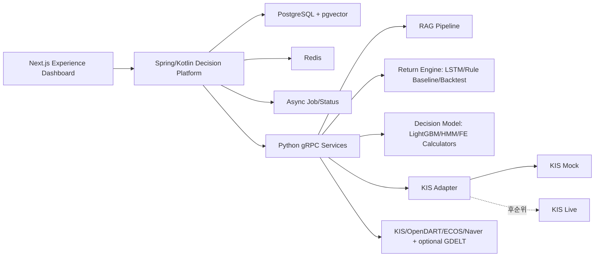

# API 명세서

작성일: 2026-06-23  
프로젝트명: 뉴스감성·LSTM 기반 투자 원칙 검증형 AI 자동매매 봇  
서비스명: 투자 원칙 기반 AI 트레이딩 코치  
대상 문서: `최종_프로젝트_명세서.md`

---

## 0. 문서 목적

이 문서는 프론트엔드, Spring/Kotlin Decision Platform, Python AI/Data 서비스, KIS Mock/Live-ready 어댑터 사이의 API 계약을 정의한다.

핵심 원칙은 다음과 같다.

1. 프론트엔드는 Spring/Kotlin API만 호출한다.
2. Python FastAPI/gRPC 서비스는 내부 서비스로 두고 프론트에 직접 노출하지 않는다.
3. 주문 승인/경고/차단의 최종 권한은 Spring RiskEngine에 둔다.
4. Python 서비스는 RAG, 모델 신호, 백테스트, 금융공학 계산, KIS Adapter를 담당한다.
5. ready threshold의 `BLOCK` 위반은 `BLOCK`, hard 또는 `REQUIRED` evidence 장애는 `HOLD`로 fail-closed 한다. `OPTIONAL` 뉴스·공시·모델 evidence는 warning+abstention으로 degrade할 수 있지만 이전 값을 최신으로 가장하지 않는다.
6. 모든 주문 관련 API는 audit log와 decision trace를 남긴다.

### 0.1 구현 상태 표기 규칙

이 문서는 구현 계약과 후속 계획을 함께 담으므로 endpoint가 문서에 존재한다는 사실만으로 구현 완료를 뜻하지 않는다.

| 표기 | 의미 |
|---|---|
| `구현 완료` | 코드·계약·자동 테스트 또는 승인된 재현 검증이 함께 완료된 상태 |
| `계획 계약` | 향후 구현을 위한 문서 계약. 호출 가능한 endpoint/RPC가 아님 |
| `비활성 설계 계약` | 코드 경로가 생겨도 운영 gate가 기본 OFF이며 명시적 승인 전에는 사용할 수 없음 |
| `고도화` / `후순위` | v1 필수 구현 완료와 별개인 선택 범위 |

각 절에 `구현 완료`와 검증 근거가 명시되지 않았다면 기본적으로 `계획 계약`으로 해석한다. 세션 번호는 작업 배정을 뜻할 뿐 API 가용성을 뜻하지 않으며, schema/proto/OpenAPI 변경이 필요한 기능은 별도의 contract-change 절차가 완료되어야 한다. 구현 상태의 상위 기준은 `최종_프로젝트_명세서.md`의 세션·보안 gate 표를 따른다.

> 완료 기준점(2026-07-16): S1.3 내부 ECOS/Naver producer는 PR #16 merge commit
> `6f439155d9f5ec626fc185f29f2e0bd64ca54780`, S1.3K KRX 내부 collector는 PR #17 merge
> commit `814aab377251d76672566d39c3edb379d132248e`으로 `main`에 병합됐다. 두 트랙은 public
> REST/gRPC가 아니라 아래에 명시한 내부 artifact/CLI 경계만 구현 완료 상태다.

---

## 1. 전체 API 경계



| 계층 | 외부 노출 | 핵심 책임 |
|---|---:|---|
| Next.js Dashboard | 사용자 브라우저 | 화면, 차트, 원칙 설정, 주문 검토, 학습일지 |
| Spring/Kotlin API | 노출 | BFF, 인증, 원칙, RiskEngine, 주문 상태, 감사로그 |
| Python gRPC/FastAPI | 내부 | RAG, 모델 신호, 백테스트, 금융공학 계산, KIS Adapter |
| PostgreSQL/pgvector | 내부 | 사용자/원칙/주문/일지/RAG metadata/vector |
| Redis | 내부 | cache, lock, 임시 상태, idempotency key, rate limit |
| Async Job/Status | 내부 | 비동기 작업 상태, 감사 상태, 화면용 metric |

---

## 2. 공통 규칙

### 2.1 공통 헤더

| 헤더 | 필수 | 설명 |
|---|---:|---|
| `Authorization: Bearer <token>` | 예 | 사용자 인증 토큰 |
| `X-Request-Id` | 예 | 요청 추적 ID. bounded 형식으로 검증하고 로그 제어문자를 거부 |
| `X-Idempotency-Key` | 금융 부작용/안전 gate 변경 필수 | 중복 주문·취소·정정·gate 변경 방지. 적용 matrix는 2.5 |
| `X-Client-Timezone` | 아니오 | 기본 `Asia/Seoul` |

### 2.2 공통 응답 envelope

```json
{
  "success": true,
  "requestId": "req_20260623_000001",
  "data": {},
  "warnings": [],
  "error": null
}
```

오류 응답:

```json
{
  "success": false,
  "requestId": "req_20260623_000001",
  "data": null,
  "warnings": [],
  "error": {
    "code": "RISK_BLOCKED",
    "message": "일일 손실 한도 초과로 주문이 차단되었습니다.",
    "details": {
      "ruleId": "daily_loss_guard",
      "currentLossRate": -0.042,
      "limit": -0.03
    }
  }
}
```

### 2.3 주요 오류 코드

| 코드 | HTTP | 의미 | 기본 처리 |
|---|---:|---|---|
| `VALIDATION_ERROR` | 400 | 요청 스키마 오류 | 화면에 입력 오류 표시 |
| `UNAUTHORIZED` | 401 | 인증 실패 | 로그인 유도 |
| `FORBIDDEN` | 403 | 권한 없음 | 접근 차단 |
| `NOT_FOUND` | 404 | 리소스 없음 | 빈 상태 표시 |
| `CONFLICT` | 409 | 버전 충돌 | 재조회 후 재시도 |
| `IDEMPOTENCY_CONFLICT` | 409 | 동일 idempotency key에 다른 payload | 요청 내용 확인 |
| `IDEMPOTENCY_IN_PROGRESS` | 409 | 동일 idempotency key 요청이 처리 중 | 현재 요청 완료 후 동일 payload로 재조회 |
| `PAYLOAD_TOO_LARGE` | 413 | 전역 또는 idempotency request body 상한 초과 | 요청 크기 축소 |
| `DECISION_EXPIRED` | 409 | decision 유효시간(`validUntil`) 초과 | 주문 재평가 유도 |
| `RISK_BLOCKED` | 422 | 원칙/안전장치 위반으로 주문 차단 | 주문 불가 |
| `DATA_STALE` | 409 | 가격/신호/뉴스 데이터 지연 | 주문 보류 |
| `RATE_LIMITED` | 429 | 호출 한도 초과(KIS rate limit, LLM 비용 가드) | KIS `EGW00201`/HTTP 429는 adapter가 자동 재시도하지 않고 공유 limiter scope·외부 caller 유무를 점검한다. 일반 API의 안전한 멱등 조회만 명시적 `Retry-After`에 따라 제한 재시도하며 write와 provider quota 소진은 자동 재시도 금지 |
| `PYTHON_SERVICE_UNAVAILABLE` | 503 | 내부 gRPC 서비스 장애 | fail-closed |
| `BROKERAGE_UNAVAILABLE` | 503 | KIS 어댑터 장애 | 주문 보류 |

오류 처리 공통 규칙:

1. 클라이언트는 HTTP 상태 코드가 아니라 `error.code`로 분기한다. HTTP 상태는 로깅/모니터링 참고값이다.
2. Guide 모드 경고는 오류가 아니다. 경고는 항상 정상 응답의 `data.decision = WARN`과 `violations`로 표현한다. (기존 `RISK_WARNED` 오류 코드는 삭제됨.)
3. `RISK_BLOCKED`는 423(WebDAV Locked)이 아니라 422(Unprocessable Entity)를 사용한다. 요청 형식은 유효하나 비즈니스 규칙상 처리 불가라는 의미와 정확히 일치하기 때문이다.

### 2.4 인증/권한

`POST /api/v1/auth/login`으로 데모 계정을 인증하고 access token을 발급받는다. 로그인만 `Authorization` 헤더의 예외이며, client interceptor가 cutover 전 stale Bearer를 첨부해도 해당 header는 무시하고 새 credential을 검증한다. 그 밖의 API는 명시된 역할과 Bearer 인증을 요구한다. 토큰은 데모 기준 만료 12시간을 사용하고 payload에는 opaque `sub`, `role`, `securityVersion`처럼 검증에 필요한 최소 claim만 담는다(민감정보 금지). JWT는 허용 algorithm을 고정하고 issuer/audience/subject/issued-at/expiry/securityVersion을 검증한다. Kill Switch 해제, ADMIN replay, Live 관련 고위험 행위는 token의 role만 믿지 않고 현재 DB의 account 활성 상태·role·securityVersion을 다시 확인하며, 권한 회수 뒤 발급된 이전 token은 거부한다.

로그인 attempt는 client address+username 기준 15분 5회, address 기준 15분 50회로 원자 예약하며, JSON binding 전 전역 request body 상한을 적용한다. limiter key는 private factory가 정규화한 address/username scope를 purpose/version HMAC으로 만든 digest만 사용하고 raw address·username을 저장·로그·metric label에 넣지 않는다. 주소는 socket remote address를 기준으로 하고, 배포 시 명시적으로 allowlist한 reverse proxy에서 온 경우에만 표준 forwarded header를 해석한다. 임의 `X-Forwarded-For`를 신뢰하지 않는다. demo account verifier는 평문 password가 아니라 attested bundle에서 검증된 adaptive salted password hash를 DB에 저장하고 검증 라이브러리로 비교한다. 인증 가능한 password 범위는 `1..72 UTF-8 bytes`이며 DTO의 1,024-character 상한은 JSON 입력 방어일 뿐 credential 경계가 아니다. 72 bytes를 넘는 입력은 per-process dummy로 치환해 선택 row와 peer row에 BCrypt strength-12 검증을 각각 한 번 수행한 뒤 동일한 401로 거부한다. 정상 범위의 모든 login도 두 row를 각각 한 번 검증하며, 하나의 평문이 두 row에 모두 일치하면 두 역할을 모두 fail-closed한다. 존재하지 않는 사용자와 잘못된 비밀번호도 정확히 두 번의 dummy/peer BCrypt 경로와 동일한 stable 오류를 사용한다. 현재 단일 JVM limiter는 replica 1에서만 보안 경계가 성립하며, 다중 replica 배포 전에는 공유 원자 저장소로 이전해야 한다.

#### 2.4.1 S2.1 actor trust-root 선행 계약

DB `users`가 demo identity의 단일 진실 소스다. checksum이 있는 V7 Java migration은 `security_version bigint NOT NULL DEFAULT 1 CHECK (security_version > 0)`과 credential evidence 열(`credential_reuse_tag`, `credential_bundle_mac`, `credential_policy_version`)을 추가하고 migration role로 아래 두 row만 seed한다. 두 고정 demo row는 32-byte tag/MAC와 policy version 1을 모두 가져야 하고, 다른 user row는 evidence가 없어도 호환된다. BCrypt hash·tag·MAC는 추적 파일이나 Flyway SQL text에 넣지 않고 검증된 배포 bundle에서 prepared statement bind parameter로만 전달한다. 기존 `user_id`/username/role/status/version/hash/evidence가 exact shape과 다르면 overwrite하지 않고 migration transaction 전체를 중단한다.

| user_id | username | role | status | securityVersion | credential source |
|---|---|---|---|---:|---|
| `usr_demo_user` | `demo-user` | `USER` | `ACTIVE` | 1 | `DEMO_USER_CREDENTIAL_BUNDLE` |
| `usr_demo_admin` | `demo-admin` | `ADMIN` | `ACTIVE` | 1 | `DEMO_ADMIN_CREDENTIAL_BUNDLE` |

JWT header/claim은 `alg=HS256`, exact configured `iss`, exact single `aud`, nonblank internal `user_id` `sub`, `iat`, `exp`, `role`, `securityVersion`을 필수로 한다. future `iat` 허용 오차는 최대 60초다. 매 authenticated request마다 `sub`로 DB row를 재조회하고 `ACTIVE`, role, `securityVersion`이 token과 같을 때만 DB 값으로 principal을 만든다. row missing, `LOCKED`, `DISABLED`, role/version mismatch는 모두 동일한 401이다. `JWT_SECRET`, `LOGIN_SCOPE_HMAC_KEY`, `DEMO_CREDENTIAL_SEPARATION_KEY`, 후속 cursor HMAC key는 목적별로 서로 다른 secret을 사용한다.

로그인 성공 시 `data.user.userId`는 상위 표의 internal ID이며 JWT `sub`와 같다. Dashboard/consumer는 username이나 request body의 user ID를 owner key로 사용하지 않는다.

| Field | KR | EN |
|---|---|---|
| `data.accessToken` | Bearer JWT 원문; URL/로그에 넣지 않음 | Raw Bearer JWT; never place it in URLs or logs |
| `data.expiresAt` | 서버가 발급한 만료 시각 | Server-issued expiration timestamp |
| `data.user.userId` | DB와 JWT `sub`가 공유하는 opaque owner ID | Opaque owner ID shared by the DB and JWT `sub` |
| `data.user.username` | 화면 표시/로그인 이름; owner key 아님 | Display/login name; not an owner key |
| `data.user.role` | DB 재검증된 `USER` 또는 `ADMIN` | DB-revalidated `USER` or `ADMIN` role |

#### 2.4.2 credential rotation·cutover 운영 계약

배포 전 secret store에 `DEMO_USER_CREDENTIAL_BUNDLE`, `DEMO_ADMIN_CREDENTIAL_BUNDLE`, `DEMO_CREDENTIAL_SEPARATION_KEY`, `JWT_SECRET`, `JWT_ISSUER`, `JWT_AUDIENCE`, `LOGIN_SCOPE_HMAC_KEY`를 준비한다. separation key는 정확히 32 random bytes를 unpadded Base64url로 인코딩하고 JWT/login-scope/cursor key와 재사용하지 않는다. 두 role bundle은 한 approved preparation workflow가 서로 다른 12..72 UTF-8-byte 평문에서 생성해 원자 게시한다. application·DB·argv·로그·audit·추적 파일에는 평문을 전달하지 않으며 actual `.env`는 자동 변경하지 않는다.

bundle wire format은 `s21-v1:<user_id>:<reuse_tag_b64url>:<bcrypt12_hash>:<bundle_mac_b64url>`이다. `reuse_tag`는 같은 전용 key와 `capstone:s21:demo-credential-reuse:v1` domain으로 평문 UTF-8 bytes를 HMAC-SHA-256한 32-byte 값이다. `bundle_mac`은 `capstone:s21:demo-credential-bundle:v1` domain으로 version, exact user ID, username, role, raw reuse tag, BCrypt hash를 HMAC-SHA-256해 독립 필드 편집을 막는다. HMAC input은 domain부터 각 field를 `4-byte big-endian length || bytes`로 framing한다. tag/MAC/key의 wire encoding은 padding 없는 canonical Base64url이다. 저장된 hash만 비교해서는 salt 때문에 평문 재사용을 판별할 수 없으므로 hash 문자열 불일치는 보조 방어일 뿐 분리 증거가 아니다.

V7은 초기 bootstrap이지 rotation 경로가 아니다. 회전은 `flyway` DB role을 사용하는 `rotateDemoCredential` one-shot task로만 수행한다. task는 loopback PostgreSQL만 허용하고 두 demo row를 `FOR UPDATE NOWAIT`로 잠근다. 두 저장 bundle의 MAC을 다시 검증하고 새 reuse tag가 현재/peer tag와 모두 다른지 constant-time으로 확인한 뒤, 현재 hash/tag/MAC/policy version/`security_version` 전체를 CAS predicate로 삼아 대상 하나의 bundle 교체, `security_version + 1`, sanitized audit INSERT를 bounded transaction으로 commit한다. hash/tag/MAC/key/credential은 argv·stdout·log·audit에 남기지 않는다. 아래 변수는 secret manager가 주입한 one-shot process에서만 사용한다. `POSTGRES_HOST`/`POSTGRES_PORT`를 생략하면 loopback `127.0.0.1:5432`를 사용하며 non-loopback host는 거부한다.

PostgreSQL role bootstrap은 `flyway`에 `log_parameter_max_length=0`과 `log_parameter_max_length_on_error=0`을 고정한다. V7 bootstrap과 rotation은 하나의 공통 verifier로 현재 세션의 두 effective setting을 직접 읽는다. V7은 DDL·credential bind 전에, rotation은 row lock·credential bind 전에 둘 중 하나라도 `0`이 아니면 mutation과 audit 없이 fail-closed한다. 따라서 운영상 SQL 문장 로깅(`log_statement`)은 유지할 수 있지만 BCrypt hash·reuse tag·bundle MAC bind 값은 일반 로그와 오류 로그 모두에서 생략되어야 한다. 배포 검증은 migration/rotation과 같은 role의 새 세션에서 두 setting이 정확히 `0`인지 확인해야 하며, 기존 volume에는 init script가 자동 재실행되지 않으므로 role 설정을 명시적으로 재적용한 뒤 V7을 실행한다. 확장 로거·managed-service 수집기·로그 reader ACL·retention은 이 애플리케이션 경계 밖의 별도 운영 보안 gate로 관리한다.

운영자는 새 role-bound bundle을 해당 `DEMO_USER_CREDENTIAL_BUNDLE` 또는 `DEMO_ADMIN_CREDENTIAL_BUNDLE`의 pending secret version과 one-shot `DEMO_CREDENTIAL_BUNDLE`에 동일 bytes로 준비하고, bootstrap과 one-shot에는 같은 `DEMO_CREDENTIAL_SEPARATION_KEY` version을 주입한다. DB rotation과 old password/token 거부·new password login 검증이 모두 성공한 뒤에만 pending bundle을 persistent bootstrap secret으로 승격한다. 승격 실패 시 clean rebuild를 진행하지 않고 불일치 상태를 운영 장애로 처리한다. 이전 app binary rollback window 동안에는 이전 plaintext와 검증된 이전 bundle도 secret store에만 보존하며 Git/`.env`에는 두지 않는다. rollback은 검증된 이전 bundle과 호환 app version을 함께 복원하며 bare hash acceptance로 후퇴하지 않는다.

```bash
(
  set -euo pipefail
  trap 'S21_ROTATE_EXIT=$?; unset DEMO_CREDENTIAL_USER_ID DEMO_CREDENTIAL_BUNDLE DEMO_CREDENTIAL_SEPARATION_KEY DEMO_CREDENTIAL_ROTATION_ACTOR POSTGRES_MIGRATION_PASSWORD; exit "$S21_ROTATE_EXIT"' EXIT
  test -n "${POSTGRES_MIGRATION_PASSWORD:-}"
  test -n "${DEMO_CREDENTIAL_USER_ID:-}"
  test -n "${DEMO_CREDENTIAL_BUNDLE:-}"
  test -n "${DEMO_CREDENTIAL_SEPARATION_KEY:-}"
  test -n "${DEMO_CREDENTIAL_ROTATION_ACTOR:-}"
  test -n "${POSTGRES_DB:-}"
  workspaces/decision-platform/spring-api/gradlew \
    -p workspaces/decision-platform/spring-api --no-daemon rotateDemoCredential
)
```

배포 직전에는 아래 task가 기존 token의 authenticated health 200을 확인하고 raw token 대신 digest/exp/시간/base URL만 ignored build evidence에 atomic create-if-absent로 저장한다. 배포 후에는 **같은 기존 token** 401, 새 USER/ADMIN login의 exact internal ID/role과 JWT `sub`/role/securityVersion 결속, 서로 다른 두 token, 두 token의 health 200, USER의 ADMIN metrics 403과 ADMIN의 200을 확인하고 성공할 때만 evidence를 삭제한다. preflight 남은 token 수명은 7,200초 이상, postflight는 capture 후 1,800초 이내이면서 남은 token 수명 3,600초 이상이어야 한다.

```bash
(
  set -euo pipefail
  trap 'S21_AUTH_PRE_EXIT=$?; unset AUTH_SMOKE_BASE_URL AUTH_SMOKE_PRE_CUTOVER_TOKEN; exit "$S21_AUTH_PRE_EXIT"' EXIT
  test -n "${AUTH_SMOKE_BASE_URL:-}"
  test -n "${AUTH_SMOKE_PRE_CUTOVER_TOKEN:-}"
  workspaces/decision-platform/spring-api/gradlew \
    -p workspaces/decision-platform/spring-api --no-daemon \
    cleanAuthCutoverEvidence authPreCutoverCapture
  test -s workspaces/decision-platform/spring-api/build/auth-cutover/pre-cutover.json
)

(
  set -euo pipefail
  trap 'S21_AUTH_POST_EXIT=$?; unset AUTH_SMOKE_BASE_URL AUTH_SMOKE_USER_PASSWORD AUTH_SMOKE_ADMIN_PASSWORD AUTH_SMOKE_PRE_CUTOVER_TOKEN; exit "$S21_AUTH_POST_EXIT"' EXIT
  test -n "${AUTH_SMOKE_BASE_URL:-}"
  test -n "${AUTH_SMOKE_USER_PASSWORD:-}"
  test -n "${AUTH_SMOKE_ADMIN_PASSWORD:-}"
  test -n "${AUTH_SMOKE_PRE_CUTOVER_TOKEN:-}"
  test -s workspaces/decision-platform/spring-api/build/auth-cutover/pre-cutover.json
  workspaces/decision-platform/spring-api/gradlew \
    -p workspaces/decision-platform/spring-api --no-daemon authCutoverSmoke
  test ! -e workspaces/decision-platform/spring-api/build/auth-cutover/pre-cutover.json
)
```

배포 rollback은 V7 column/row를 남긴 채 rollback window에 보존한 이전 app binary/config와 이전 plaintext demo secret으로 되돌린다. down migration·demo row 삭제·dual-token acceptance는 하지 않고, rollback 후에도 사용자가 다시 로그인하게 한다. 이 선행 계약은 Principle endpoint, Principle idempotency 경계, S2.2/S2.3 runtime을 추가하지 않는다.

| 역할 | 접근 범위 |
|---|---|
| `USER` | 원칙, 결정, 주문, 잔고, RAG, 학습일지, 백테스트, Kill Switch 활성화 |
| `ADMIN` | USER 전체 + Kill Switch 해제, Async Job/Stream Metric/Artifact Ingest 상태, replay 관련 운영 기능 |

Kill Switch는 비대칭 권한을 적용한다. 활성화(정지)는 USER도 가능하지만 해제(재가동)는 ADMIN만 가능하다 — 안전한 방향은 넓게, 위험한 방향은 좁게 연다.

모든 사용자 리소스는 JWT `sub`에 해당하는 내부 userId를 소유권 기준으로 사용한다. `principleId`, `decisionId`, `answerId`, `backtestId`, `artifactId`, `journalId`, `orderId`, `accountId`, consent/async job id는 요청 경로나 body에 들어 있어도 신뢰하지 않고 DB 조회 단계에서 `owner_user_id = subject` 조건으로 제한한다. 다른 사용자의 식별자를 넣은 요청은 존재 여부를 노출하지 않도록 기본 `NOT_FOUND`로 거부한다. `accountId`는 provider 계좌번호가 아닌 opaque 내부 ID만 허용한다.

ADMIN의 운영 조회·재시도·replay는 업무상 필요한 최소 범위에서만 owner scope를 넘을 수 있고, 대상 owner, 행위자, 사유, 시각을 append-only audit에 남긴다. audit의 `actorUserId`와 `occurredAt`은 요청 body의 `requestedBy`, `acceptedAt`, `acknowledgedAt` 같은 값을 신뢰하지 않고 인증 principal과 서버 clock으로 생성한다. 클라이언트가 이러한 권한성/감사성 필드를 보내면 무시하지 말고 validation 오류로 거부한다.

### 2.5 Idempotency 시맨틱

| 상황 | 동작 |
|---|---|
| 동일 key + 동일 payload 재요청 | 저장된 원 응답을 그대로 반환하고 부작용을 만들지 않는다 |
| 동일 key + 다른 payload | `IDEMPOTENCY_CONFLICT`(409) |
| 동일 key 처리 중 | `IDEMPOTENCY_IN_PROGRESS`(409), controller 재실행 금지 |
| key 보존 기간 | 24시간(Redis TTL) |
| 저장 namespace | `(subject, HTTP method, route template, idempotency key)` |
| payload fingerprint | bounded request body를 canonical form으로 만든 뒤 method/route/subject와 함께 hash |
| key 형식 | 16~128자, `[A-Za-z0-9._:-]`만 허용. 원문은 로그·metric label에 남기지 않음 |

Redis claim은 고유 owner token으로 선점하고, owner 확인·응답 저장·TTL 설정·claim 삭제를 단일 Lua script로 처리한다. Redis는 인증+AOF+`noeviction`으로 운영하지만 금융 부작용의 최종 방어는 DB unique/state transition이다.

Idempotency HMAC key rotation 중에는 active와 previous version의 scope digest를 모두 조회해 기존 replay/DB unique를 확인하고 새 기록만 active version으로 쓴다. previous version은 24시간 replay TTL과 미완료 reconciliation이 모두 끝나기 전에 폐기하지 않는다. 이 dual-read가 불가능하면 rotation 중 금융 write를 fail-closed로 막는다.

멱등 선점은 설정 wildcard에 단순 일치하는 URL이 아니라 실제 MVC write handler가 매핑된 요청에만 적용한다. 인가와 owner 검증이 끝난 뒤 claim하며, 사용자별 TTL 구간의 신규 key는 기본 1,000개로 제한하고 초과 시 `RATE_LIMITED`(429)를 반환한다. 인가·라우팅·검증성 4xx는 owner claim을 원자 반납해 장기 replay state로 남기지 않고, controller 응답 버퍼는 설정 byte 상한 이상을 메모리에 보관하지 않는다. 동일 key replay도 원래 subject에게만 반환한다.

금융 부작용 또는 안전 gate를 변경하는 다음 write에 위 시맨틱을 의무 적용한다.

| Endpoint 계열 | 멱등성 적용 |
|---|---|
| Mock/파생 주문 제출 | 필수 |
| 주문 취소·정정 | 필수 |
| Kill Switch 상태 변경 | 필수 |
| Live consent·live safety gate 상태 변경 | 필수 |

원칙 CRUD, Journal, feedback, 백테스트 실행 같은 비금융 write는 optimistic version, job deduplication 등 각 도메인 계약을 사용하며 위 금융 replay 계약을 자동 상속하지 않는다. 적용 범위를 넓히려면 endpoint별 부작용과 replay 응답 상한을 검토한 contract change가 필요하다.

### 2.6 목록 API 공통 pagination

목록 조회는 cursor 기반 pagination을 기본으로 한다.

- 요청: `?cursor=<opaque>&size=50` (기본 50, 최대 200)
- 응답: `data.items[]`와 `data.nextCursor` (마지막 페이지면 `null`)
- 적용 대상: journals, decisions, rag/sources, async-jobs, order events
- cursor는 서버 HMAC으로 인증하고 subject, route, allowlisted filter/sort, 마지막 key, page size, schema version, 짧은 expiry에 묶는다. cursor payload에는 opaque ID와 비민감 pagination state만 두며 PII·계좌·provider 식별자·credential/configuration을 넣지 않는다. 민감 state가 필요하면 authenticated-encryption 또는 server-side random cursor를 사용한다. 다른 사용자/endpoint/query의 cursor 재사용과 변조는 `VALIDATION_ERROR`로 거부하며, cursor 내용을 SQL identifier/fragment로 직접 사용하지 않는다.

### 2.7 시스템 상태 조회

`GET /api/v1/system/health`

```json
{
  "success": true,
  "data": {
    "asOf": "2026-06-23T15:31:00+09:00",
    "pythonService": "UP",
    "brokerage": "UP",
    "killSwitchActive": false,
    "dataFreshness": {
      "priceFresh": true,
      "signalFresh": true,
      "ragFresh": true
    },
    "degradedFeatures": []
  }
}
```

Risk API의 `dataFreshness`는 리스크 수치 관점, 이 API는 가용성 관점으로 역할을 분리한다. 프론트 상단 상태 배지와 fail-closed 시연의 근거 API다.

USER health 응답은 `UP`/`DEGRADED`, stale 여부, 기능별 사용 가능 여부처럼 행동에 필요한 coarse 상태만 제공한다. provider별 인증 방식, 환경변수 이름, credential configured 여부, 계정·quota 수치, 내부 host/port, exception은 반환하지 않는다. 상세 운영 상태는 ADMIN 권한과 내부 관측 채널로 제한하더라도 secret 존재 여부나 값을 노출하지 않는다.

---

## 2A. Async Status API

Decision Platform의 비동기 처리는 외부 공개 API가 아니다. 공용 API 명세에는 작업 상태, stream metric, artifact ingest 상태 조회 계약만 둔다. 내부 이벤트 포맷, 처리 방식, 재시도, 장애 격리 세부 구현은 공개 API 계약 밖의 Decision Platform 내부 구현 기록에서 관리한다.

### 2A.1 Async Job 상태 조회

`GET /api/v1/async-jobs/{jobId}`

응답:

```json
{
  "success": true,
  "data": {
    "jobId": "job_rag_index_20260623_001",
    "type": "RAG_INDEX",
    "status": "COMPLETED",
    "requestedAt": "2026-06-23T10:00:00+09:00",
    "startedAt": "2026-06-23T10:00:03+09:00",
    "completedAt": "2026-06-23T10:00:18+09:00",
    "sourceId": "src_kis_fee_001",
    "artifactId": null,
    "resultRef": "rag_index_result_20260623_001",
    "error": null
  }
}
```

`GET /api/v1/async-jobs?status=RUNNING&type=MODEL_EVAL`

상태값:

| 상태 | 의미 |
|---|---|
| `REQUESTED` | 요청 저장 완료 |
| `RUNNING` | worker 처리 중 |
| `COMPLETED` | 완료 결과 반영 |
| `FAILED` | 재시도 가능 실패 |
| `NEEDS_REVIEW` | 자동 처리 실패 후 수동 점검 필요 |

### 2A.2 Stream Metric 조회

`GET /api/v1/stream-metrics`

응답:

```json
{
  "success": true,
  "data": {
    "lastUpdatedAt": "2026-06-23T15:31:00+09:00",
    "pipelineHealth": "OK",
    "signalStaleRatio": 0.03,
    "decisionDistribution": {
      "ALLOW": 18,
      "WARN": 7,
      "HOLD": 4,
      "BLOCK": 2
    },
    "failedJobCount": 0
  }
}
```

### 2A.3 Artifact Ingest 상태 조회

`GET /api/v1/artifacts/ingest-status`

응답:

```json
{
  "success": true,
  "data": {
    "items": [
      {
        "artifactId": "artifact_lstm_20260623_001",
        "fileName": "lstm_signals.parquet",
        "producer": "return-engine",
        "runId": "run_20260623_001",
        "fileHash": "sha256:2f4b6c8d0e1a3b5c7d9e0f1a2b3c4d5e6f708192a3b4c5d6e7f8091a2b3c4d5e",
        "schemaVersion": "1.0.0",
        "status": "INGESTED",
        "lastIngestedAt": "2026-06-23T10:00:00+09:00",
        "duplicate": false
      }
    ]
  }
}
```

### 2A.4 이벤트 push 채널 (고도화)

폴링 대체용 push 채널. 채택 시 SSE(Server-Sent Events)로 구현한다.

`GET /api/v1/events/stream` (SSE, Bearer 인증 필수)

| event type | payload |
|---|---|
| `order.updated` | orderId, status, filledQuantity |
| `async-job.updated` | jobId, status |
| `kill-switch.changed` | active, changedAt |

WebSocket 대비 구현 부담이 작고 시연 반응성을 높인다. v1 필수는 아니며 폴링 계약이 기본이다. 채택 시 각 event는 JWT subject owner scope로 필터링하고, token 만료 즉시 연결을 닫으며 사용자별 연결 수·event byte·queue·heartbeat/idle timeout을 제한한다. 응답은 `no-store`로 전송하고 USER stream에는 actor userId, provider/account 식별자, raw payload를 싣지 않는다.

---

## 3. 공통 도메인 스키마

### 3.0 표기 규약

| 항목 | 규약 |
|---|---|
| 금액 | KRW 정수 (소수점 없음) |
| 수량 | 정수 |
| 수익률/비율 | 소수 표기 (3% = 0.03) |
| 시각 | ISO-8601 + KST offset (`2026-06-23T15:30:00+09:00`) |
| Money 객체 | 다중 통화가 필요해지기 전까지 사용 보류. v1 응답은 bare KRW 정수를 사용 |

### 3.1 Money

```json
{
  "amount": 1000000,
  "currency": "KRW"
}
```

### 3.2 Asset

```json
{
  "market": "KRX",
  "symbol": "005930",
  "name": "삼성전자",
  "assetType": "DOMESTIC_STOCK",
  "allowlisted": true,
  "liquidityTier": "HIGH"
}
```

`assetType` 값:

| 값 | 설명 |
|---|---|
| `DOMESTIC_STOCK` | 국내주식 |
| `GOLD_ETF` | 금 ETF |
| `GOLD_ETN` | 금 ETN |
| `OTHER_ETF` | 기타 ETF |
| `EXCLUDED` | v1 거래 제외 대상 |

### 3.3 TimeFrame

```json
{
  "primary": "1d",
  "secondary": "60m",
  "timezone": "Asia/Seoul"
}
```

---

## 4. Principle API

S2.1은 공용 preset, 사용자별 원칙 생성·복구·수정·보관, immutable version history를
담당한다. 이 절의 machine-readable source of truth는
`contracts/catalogs/s2-1-principle-contract.v1.json`이고 contract ID는
`s2-1-principle-contract/v1`이다. standalone schema와 fixture는 catalog에서 기계 생성하며
사람이 독립적으로 수정하지 않는다.

> Implementation 상태(2026-07-24): 아래 6개 runtime endpoint와 실제 springdoc path,
> owner-scoped SQL CAS, immutable snapshot/audit, HMAC cursor를 구현했다. S2.2 계약
> amendment로 `PrincipleRule.evidenceRequirement`를 명시하고 legacy immutable snapshot의
> 결정적 read-time inference도 추가했다. `STRICT` 저장과 rule 필드 노출은 구현 완료지만
> RiskEngine의 runtime enforcement와 Decision endpoint 가용성을 뜻하지 않는다.

모든 endpoint는 Bearer 인증을 요구한다. actor/owner는 PR #37이 고정한 DB 검증 후
`AppPrincipal.userId`(JWT `sub`)에서만 가져오며 request의 user ID를 신뢰하지 않는다.
`USER`와 `ADMIN` 모두 자기 소유 원칙만 다루고 S2.1 ADMIN 우회는 없다.

| operationId | method/path | 성공 | request data | response `data` |
|---|---|---:|---|---|
| `listPrinciplePresets` | `GET /api/v1/principle-presets` | 200 | 없음 | `PrinciplePresetListData` |
| `createPrinciple` | `POST /api/v1/principles` | 201 | `PrincipleCreateRequest` | `PrincipleCurrent` |
| `listPrinciples` | `GET /api/v1/principles` | 200 | query `cursor,size,sort`만 | `PrincipleOwnerListData` |
| `getPrinciple` | `GET /api/v1/principles/{principleId}` | 200 | 없음 | `PrincipleCurrent` |
| `updatePrinciple` | `PUT /api/v1/principles/{principleId}` | 200 | `PrincipleUpdateRequest` | `PrincipleCurrent` |
| `listPrincipleVersions` | `GET /api/v1/principles/{principleId}/versions` | 200 | query `cursor,size,sort`만 | `PrincipleHistoryData` |

성공·오류 응답은 모두 `success`, `requestId`, `data`, `warnings`, `error` 다섯 top-level
field를 보낸다. 성공은 `success=true`, `warnings=[]`, `error=null`이고, 오류는
`success=false`, `data=null`, `warnings=[]`다. 이 장의 예시 시각은 ISO-8601 KST
offset(`+09:00`)을 사용한다.

### 4.1 Rule 계약

자연어 원칙을 직접 저장하지 않고 구조화된 rule만 받는다. 배열은 1~8개이고 `ruleId`는 중복될
수 없으며 catalog의 canonical 순서로 저장·응답한다. object는
`ruleId,ruleType,metric,operator,threshold,severity,enabled,evidenceRequirement` 여덟 field만
허용한다.

| 순서 | ruleId | 고정 tuple `ruleType / metric / operator` | threshold | enabled severity | `evidenceRequirement` |
|---:|---|---|---|---|---|
| 1 | `max_position_per_asset` | `POSITION_LIMIT / asset_weight / <=` | number, `0..1`, scale≤4 | `BLOCK` | `REQUIRED` |
| 2 | `max_gold_etf_etn_weight` | `POSITION_LIMIT / gold_etf_etn_weight / <=` | number, `0..1`, scale≤4 | `BLOCK` | `REQUIRED` |
| 3 | `max_single_order_amount` | `ORDER_SIZE / order_amount_krw / <=` | integer, `0..10000000000` | `BLOCK` | `REQUIRED` |
| 4 | `daily_loss_guard` | `LOSS_LIMIT / daily_loss_rate / >=` | number, `-1..0`, scale≤4 | `BLOCK` | `REQUIRED` |
| 5 | `mdd_guard` | `DRAWDOWN_LIMIT / mdd / >=` | number, `-1..0`, scale≤4 | `BLOCK` | `REQUIRED` |
| 6 | `max_daily_orders` | `TRADING_FREQUENCY / daily_order_count / <=` | integer, `0..1000` | `WARN` 또는 `BLOCK` | `REQUIRED` |
| 7 | `negative_news_guard` | `NEWS_GUARD / negative_news_score / <=` | number, `0..1`, scale≤4 | `WARN` 또는 `BLOCK` | `OPTIONAL` 또는 `REQUIRED` |
| 8 | `disclosure_risk_guard` | `DISCLOSURE_GUARD / disclosure_risk_score / <=` | number, `0..1`, scale≤4 | `WARN` 또는 `BLOCK` | `OPTIONAL` 또는 `REQUIRED` |

범위 양끝은 포함한다. `enabled=false`이면 severity는 반드시 `ALLOW`, `enabled=true`이면
해당 행의 non-ALLOW 값이어야 한다. JSON string/null, NaN/Infinity, exponent로 scale 제한을
우회하는 값, unknown field, tuple 조합 변경을 거부한다. ratio는 fraction, loss/MDD는 signed
ratio, 금액·횟수는 JSON integer다.

`evidenceRequirement`는 threshold 위반의 강도를 바꾸는 필드가 아니라 metric evidence가
missing/stale/error/incomplete일 때의 처리 계약이다. hard rule 1~6은 항상 `REQUIRED`이고,
뉴스·공시 rule 7~8만 `OPTIONAL|REQUIRED`를 선택할 수 있다. 새 create/update, preset, current와
history 응답은 이 필드를 항상 명시한다.

필드가 존재하지 않는 기존 immutable version row는 수정하지 않는다. read 경계에서만 exact
catalog tuple을 확인한 뒤, 활성 rule은 `REQUIRED`, 비활성 rule은 catalog 기본값(hard rule은
`REQUIRED`, 뉴스·공시는 `OPTIONAL`)으로 결정적으로 보충한다. 명시됐지만 잘못된 값이나 unknown
tuple은 추론하지 않고 거부하며, 현재 mutable preset/default를 과거 version에 소급 적용하지 않는다.

### 4.2 원칙 preset 조회

`GET /api/v1/principle-presets`

query parameter는 받지 않는다. `data.disclaimer`와 `data.items`를 반환하며 items는 아래 순서의
정확히 세 개다. 세 preset의 mode는 모두 `GUIDE`다.

| order/presetId | KR / EN | rule 1~8 threshold | severity/enabled |
|---|---|---|---|
| 1 `conservative` | 보수형 / Conservative | `0.15, 0.20, 300000, -0.02, -0.10, 2, 0.50, 0.50` | 1~6 `BLOCK/true`, 7~8 `ALLOW/false` |
| 2 `balanced` | 균형형 / Balanced | `0.20, 0.30, 500000, -0.03, -0.15, 3, 0.70, 0.70` | 1~5 `BLOCK/true`, 6 `WARN/true`, 7~8 `ALLOW/false` |
| 3 `aggressive` | 공격형 / Aggressive | `0.30, 0.40, 1000000, -0.05, -0.25, 5, 0.85, 0.85` | 1~5 `BLOCK/true`, 6 `WARN/true`, 7~8 `ALLOW/false` |

세 preset 모두 rule 1~6의 `evidenceRequirement`는 `REQUIRED`, 비활성 rule 7~8은
`OPTIONAL`이다.

Dashboard는 preset 선택 전에 locale에 맞는 disclaimer를 그대로 표시한다.
응답 `data`의 완전한 3×8 예시는 `contracts/examples/principle-presets.valid.json`이며 공통
성공 envelope의 `data`에 그대로 들어간다.

### 4.3 사용자 원칙 생성

`POST /api/v1/principles`

`presetId`, `title`은 필수이고 `mode`, `rules`는 선택이다. mode를 생략하면 preset mode,
rules를 생략하면 active preset의 canonical 8 rules를 transaction 안에서 deep copy한다.
rules를 보내면 preset과 merge하지 않고 1~8개 전체 replacement로 사용하며 빈 배열은 400이다.
초기 status/version은 `ACTIVE`/`1`이다. presetId는 이후 immutable provenance다.

title은 outer Unicode whitespace trim과 NFC 정규화 후 1~120 Unicode code point이며
CR/LF/NUL과 Unicode control/format category를 거부한다. ID는 서버가
`^prc_[0-9a-f]{32}$` 형식으로 만든다. create 성공은 `201 Created`,
`Location: /api/v1/principles/{principleId}`와 전체 current representation을 반환한다.

```json
{
  "presetId": "balanced",
  "title": "단일 규칙 원칙",
  "mode": "GUIDE",
  "rules": [
    {
      "ruleId": "max_position_per_asset",
      "ruleType": "POSITION_LIMIT",
      "metric": "asset_weight",
      "operator": "<=",
      "threshold": 0.2,
      "severity": "BLOCK",
      "enabled": true,
      "evidenceRequirement": "REQUIRED"
    }
  ]
}
```

`PrincipleCurrent`는 아래 field를 모두 요구한다.

```json
{
  "success": true,
  "requestId": "req_20260723_000002",
  "data": {
    "principleId": "prc_0123456789abcdef0123456789abcdef",
    "presetId": "balanced",
    "title": "단일 규칙 원칙",
    "mode": "GUIDE",
    "status": "ACTIVE",
    "version": 1,
    "rules": [
      {
        "ruleId": "max_position_per_asset",
        "ruleType": "POSITION_LIMIT",
        "metric": "asset_weight",
        "operator": "<=",
        "threshold": 0.2,
        "severity": "BLOCK",
        "enabled": true,
        "evidenceRequirement": "REQUIRED"
      }
    ],
    "createdAt": "2026-07-23T14:00:00+09:00",
    "updatedAt": "2026-07-23T14:00:00+09:00"
  },
  "warnings": [],
  "error": null
}
```

create는 principle row, version-1 full snapshot, sanitized audit를 한 transaction에 저장한다. 금융
idempotency replay 계약은 Principle에 적용하지 않는다. 응답을 못 받은 POST를 blind retry하면
중복 원칙이 생길 수 있으므로 client는 owner list의 최근 후보를 사용자에게 보여 준 뒤 재시도
여부를 명시적으로 받는다. 목록은 기존 POST 성공을 증명하는 correlation key가 아니다.

### 4.4 owner 목록과 상세 조회

`GET /api/v1/principles`

자기 소유 `ACTIVE`와 `ARCHIVED`를 모두 반환한다. 첫 page는 `cursor` 없이 `size`(기본 50,
1~200), `sort`(기본 `UPDATED_AT_DESC`, 또는 `UPDATED_AT_ASC`)만 허용한다. next page는 cursor의
size/sort를 그대로 쓰며 query로 다시 보내면 exact 일치해야 한다. typed filter와 unknown query는
400이다. `data.items`는 rules를 제외한 current summary이고 필수 nullable `data.nextCursor`를
항상 보낸다. 안정된 keyset은 `(updatedAt, principleId)`이며 두 column의 정렬 방향을 맞춘다.
여러 page의 snapshot isolation을 약속하지 않으므로 paging 중 변경이 있으면 첫 page부터
refresh한다.

`GET /api/v1/principles/{principleId}`는 create/update와 같은 전체 `PrincipleCurrent`를
반환한다. malformed ID는 DB 조회 전에 400이고, 형식이 맞는 missing/cross-owner는 동일한 404다.
unscoped 존재 여부 probe를 추가하지 않는다.

### 4.5 원칙 수정

`PUT /api/v1/principles/{principleId}`

`expectedVersion`, `title`, `mode`, `status`, `rules`를 모두 보내는 full replacement다.
rules 누락은 preset refill이 아니라 400이고 빈 배열도 400이다. `presetId`, actor, timestamps,
`version`, `changeSummary`와 unknown property는 받지 않는다.

```json
{
  "expectedVersion": 1,
  "title": "수정된 원칙",
  "mode": "STRICT",
  "status": "ACTIVE",
  "rules": [
    {
      "ruleId": "max_position_per_asset",
      "ruleType": "POSITION_LIMIT",
      "metric": "asset_weight",
      "operator": "<=",
      "threshold": 0.15,
      "severity": "BLOCK",
      "enabled": true,
      "evidenceRequirement": "REQUIRED"
    }
  ]
}
```

status는 `ACTIVE|ARCHIVED`만 허용하고 DELETE endpoint는 없다. 두 상태 사이 전환도 동일한 PUT과
expectedVersion을 사용한다. 사용자당 여러 ACTIVE 원칙과 같은 title을 허용하며 default/selected
원칙은 S2.1에서 정하지 않는다.

owner와 expectedVersion을 먼저 검증한다. canonicalized title/mode/status/rules가 동일한
matching-version no-op은 200을 반환하되 version, `updatedAt`, version row, audit row를 바꾸지
않는다. 실제 변경은 아래 owner+CAS predicate 한 SQL에서 version을 정확히 1 올린 뒤 immutable
snapshot과 audit를 같은 transaction에 INSERT한다. JPA `@Version`, ETag/If-Match를 병행하지 않는다.

```sql
UPDATE principles
SET title = :title,
    mode = :mode,
    status = :status,
    current_version = current_version + 1,
    updated_at = :updatedAt
WHERE principle_id = :principleId
  AND user_id = :actorUserId
  AND current_version = :expectedVersion
  AND current_version < 2147483647
RETURNING current_version
```

동일 expectedVersion race는 정확히 1건만 성공한다. owned stale request는
`409 CONFLICT`와 `{"expectedVersion":n,"currentVersion":m}`, terminal version은
`409 VERSION_EXHAUSTED`와 `{"currentVersion":2147483647}`다. missing/cross-owner는
currentVersion을 공개하지 않고 동일 404다.

### 4.6 원칙 변경 이력 조회

`GET /api/v1/principles/{principleId}/versions`

`size`는 기본 50/최대 200, sort는 기본 `VERSION_DESC` 또는 `VERSION_ASC`다. keyset은 version
하나이며 next page의 size/sort 규칙과 unknown query 거부는 owner list와 같다. response data는
`items`와 필수 nullable `nextCursor`다. item은
`principleId,version,presetId,title,mode,status,rules,changedFields,createdAt`의 full snapshot이고
DB의 `created_by`는 응답하지 않는다. version 1 `changedFields`는
`presetId,title,mode,status,rules`; 이후에는 `title,mode,status,rules` 중 실제 변경 field만 이
순서로 담는다. 과거 version/audit row UPDATE·DELETE는 runtime 권한으로 금지한다.

owner list cursor는 15분 TTL의
`base64url(canonicalPayload).base64url(HMAC-SHA-256(payloadPart))`이고 최대 2,048자다. raw user ID
대신 purpose-separated subject binding을 넣고 exact env `PRINCIPLE_CURSOR_HMAC_KEY`를
JWT/login key와 분리한다. signature 확인 전 payload를 SQL 결정에 쓰지 않는다. 변조·만료·route,
subject, resource, sort, size mismatch는 모두 `/query/cursor` +
`INVALID_CURSOR` 하나의 400으로 수렴한다.

### 4.7 오류·artifact·OpenAPI 계약

| HTTP/code | 의미 | exact details |
|---:|---|---|
| 400 `VALIDATION_ERROR` | body/path/query/rule/cursor 오류 | `{"violations":[{"field":"<JSON Pointer>","reason":"<enum>"}]}` |
| 401 `UNAUTHORIZED` | bearer/JWT/DB actor 재검증 실패 | `{}` |
| 403 `FORBIDDEN` | endpoint capability 없음 | `{}` |
| 404 `NOT_FOUND` | missing 또는 cross-owner | `{}` |
| 409 `CONFLICT` | owned stale version | `{"expectedVersion":n,"currentVersion":m}` |
| 409 `VERSION_EXHAUSTED` | integer terminal version | `{"currentVersion":2147483647}` |
| 413 `PAYLOAD_TOO_LARGE` | 1,048,576-byte 상한 초과 | `{"maxBytes":1048576}` |

violation reason은
`REQUIRED,UNKNOWN_FIELD,INVALID_FORMAT,INVALID_ENUM,UNAVAILABLE,OUT_OF_RANGE,INVALID_SCALE,TOO_FEW_ITEMS,TOO_MANY_ITEMS,DUPLICATE,INVALID_COMBINATION,INVALID_CURSOR`
중 하나다. 목록은 field path 사전순이고 rejected raw value를 반사하지 않는다. 404에는 target/owner,
로그·metric label에는 raw userId/username/token/title/cursor/rejected payload를 넣지 않는다.

schema와 positive/negative/page/error 예시는 각각 `contracts/schemas/`와
`contracts/examples/`의 `principle-*` 파일에 있다. `contracts/README.md`의 S2.1 artifact map이
각 operation을 exact schema/fixture에 연결한다.

tracked OpenAPI는 `contracts/openapi/openapi.json`이며 root는 `openapi=3.1.1`,
`jsonSchemaDialect=https://spec.openapis.org/oas/3.1/dialect/base`다. standalone schemas는 JSON
Schema Draft 2020-12다. canonical catalog bytes의 lowercase SHA-256을 generated OpenAPI의
`x-s2-1-contract-sha256`에 넣고 `x-s2-1-contract-id=s2-1-principle-contract/v1`과 함께 CI에서
검증한다. Spring generator가 내는 root `3.1.0`에서 tracked `3.1.1`로의 patch 한 field와
deterministic formatting만 normalizer가 바꿀 수 있으며 paths/components/dialect drift는 실패한다.

---

## 5. Decision API (S2.3 계약 잠금 — runtime 구현 중)

주문 의도와 immutable Principle version, portfolio context, 모델·리스크 evidence를 결합하는
최종 HTTP API다. 다만 현재 호출 가능한 endpoint가 아니다.

> 상태 경계(2026-07-24): S2.2는
> `contracts/catalogs/s2-2-system-rule-catalog.v1.json`,
> `contracts/schemas/risk_decision.schema.json`과 순수 evaluator/snapshot policy를 offline
> fixture와 fake port로 검증하는 범위다. provider 호출, Decision controller, HTTP route,
> decision persistence는 없다. owner + ACTIVE + current immutable version을 한 SQL로 읽는
> 내부 `JdbcPrincipleSnapshotAdapter`만 S2.2의 유일한 production adapter 예외다. S2.3이
> 이 read port와 나머지 source port의 owner-scoped runtime orchestration, persistence와
> 이 장의 endpoint/OpenAPI를 연결한다. S1.1/S3는 provider/ledger producer를 소유하고 S2.3은
> 저장된 sanitized observation과 INTERNAL_PAPER ledger를 읽는 adapter만 소유한다.
> tracked `contracts/openapi/openapi.json`에는 현재 `/api/v1/decisions/**` path가 하나도 없다.

### 5.1 S2.2 offline rule evaluation 계약

S2.2 v1은 S2.1의 public Principle rule 8개와 user가 수정할 수 없는 system-managed rule 6개를
정확히 한 catalog에서 평가한다.

| 구분 | 수 | rule |
|---|---:|---|
| public threshold | 8 | Principle 4.1의 rule 1~8 |
| system threshold | 4 | `high_volatility_guard`, `hmm_risk_off_guard`, `mean_reversion_warning`, `etf_etn_risk_check` |
| system readiness | 1 | `data_freshness_guard` |
| system v1 N/A | 1 | `ad_leading_room_guard` |
| 합계 | 14 | threshold 12 + readiness 1 + not-applicable 1 |

readiness와 N/A rule은 threshold 비교값이 아니므로 `violations`에 들어갈 수 없다. N/A는
`abstentions[].disposition=NOT_APPLICABLE`로만 남고 단독으로 WARN/HOLD/BLOCK을 만들지 않는다.
threshold rule은 metric이 ready일 때만 비교한다.

| 결과 필드 | 의미 |
|---|---|
| `violations[]` | ready threshold rule이 실제 기준을 넘은 결과만 저장한다. `ruleId`, `severity`, `metricValue`, `threshold`는 모두 non-null이다 |
| `issues[]` | hard 또는 `REQUIRED` evidence가 missing/stale/error/incomplete인 fail-closed 사유다. 하나 이상이면 BLOCK 우선조건이 없는 한 `HOLD`다 |
| `warnings[]` | optional evidence를 사용하지 못했거나 모델이 abstain한 degraded 안내다 |
| `abstentions[]` | 어떤 optional component/rule 비교를 수행하지 않았는지와 `ABSTAIN|NOT_APPLICABLE` disposition을 기계 판독 가능하게 남긴다 |
| `riskItems[]` | 실제 사용한 부가 위험 지표의 값, mapping version, sanitized source reference를 남기는 근거 배열이며 위 네 disposition을 대신하지 않는다 |

hard/public safety rule의 evidence는 `REQUIRED`다. 뉴스·공시처럼
`evidenceRequirement=OPTIONAL`인 rule의 evidence가 unavailable이면 같은 원인의
`warnings`와 `abstentions(ABSTAIN)`을 함께 남겨 `WARN`으로 수렴하며, 그 누락만으로
HOLD/BLOCK을 만들 수 없다. 같은 rule이 `REQUIRED`로 저장된 경우에는 `issues`와 `HOLD`로
수렴한다. 결과 우선순위는 `BLOCK > HOLD > WARN > ALLOW`이고, BLOCK은 최소 한
`severity=BLOCK` violation, HOLD는 최소 한 issue를 요구한다. `ALLOW|WARN`만
`canSubmitOrder=true`다.

`riskItems`의 OpenDART 공시 위험은 `metric=disclosure_risk_score`, structured
`eventCodes`, `mappingVersion`, opaque `sourceRefs`로 표현한다. `report_nm` 문자열을 event
identity로 사용하지 않는다. unavailable evidence를 `riskItems.value=null`만으로 표현해
`issues|warnings|abstentions`를 우회해서는 안 된다.

### 5.2 S2.3 주문 의도 평가 경계 (계획)

계획 endpoint는 `POST /api/v1/decisions/evaluate-order`다. S2.3 request는 최소
`principleId`, explicit `portfolioSource`, `orderIntent`를 받는다. `mode`, user/owner ID,
provider 계좌번호는 받지 않는다. mode는 한 번의 owner-scoped ACTIVE Principle 조회에서 고정한
immutable version의 값이 권위이며 request가 덮어쓸 수 없다.

현물 v1 `orderIntent`의 exact field는
`symbol,side,orderType,quantity,estimatedPrice,estimatedAmount,timeframe,strategyId`다.
MARKET과 LIMIT 모두 `estimatedPrice`를 사용하며 `price`/`limitPrice` alias는 거부한다.
`estimatedPrice`와 `estimatedAmount`는 양의 원화 정수이고
`estimatedAmount == quantity * estimatedPrice`를 overflow 없는 exact 연산으로 검증한다.
P2 `derivativeOrderIntent.limitPrice`와 S3 provider `UNIT_PRICE` mapping은 별도 계약이다.

같은 조회는 `principleVersionId`, `version`, mode, canonical rules를 한 snapshot으로 pin한다.
형식이 유효한 principle이 missing, cross-owner 또는 inactive이면 존재 여부를 숨기고 모두 같은
`404 NOT_FOUND`를 반환한다. 성공한 평가 결과는 `principleVersionId`와 `principleVersion`을
반드시 함께 반환한다.

S2.2의 내부 `JdbcPrincipleSnapshotAdapter`는 이 owner + ACTIVE + current immutable version
조회를 한 SQL로 구현하지만 controller/bean/runtime route를 열지 않는다. Brokerage, risk,
disclosure, signal production adapter는 S2.2에 없으며, S2.3/S3의 별도 승인 전에는 test fake
외의 source로 대체하거나 자동 fallback하지 않는다.

`portfolioSource`는 `KIS_MOCK|INTERNAL_PAPER` 중 정확히 하나를 명시한다. 서버가 JWT actor의
owner scope 안에서 해당 context를 해석하며 raw account ID를 신뢰하지 않는다. 선택한 source만
조회하고 source 혼합이나 KIS 실패 후 INTERNAL_PAPER 자동 fallback은 금지한다.

S2.3은 provider HTTP를 호출하지 않는다. 현재가·호가는 S1.1 producer가 쓰는 append-only
`market_quote_observations`, KIS_MOCK 잔고는 S3 producer가 쓰는
`portfolio_balance_observations`/`portfolio_position_observations`, INTERNAL_PAPER는 기존
`paper_accounts`/`paper_positions`의 한 SQL owner-scoped projection에서 읽는다. V9는 production
source row를 seed하지 않고 `decision_app`에는 이 source의 SELECT만 준다. source row 부재,
stale/incomplete/future timestamp는 가짜 0/빈 값으로 대체하지 않고 typed unavailable
`issues[]`와 persisted 200 HOLD로 수렴한다. 실제 producer가 배포되기 전 환경은 HOLD-only일 수
있으며 이는 안전한 degraded state다.

| 상황 | 계획 HTTP/result |
|---|---|
| selector enum/요청 형식 오류 | `400 VALIDATION_ERROR`, decision result 없음 |
| missing/cross-owner/inactive Principle | 동일한 `404 NOT_FOUND`, 존재 정보 없음 |
| 선택한 owner-scoped portfolio context가 missing/stale/partial/unavailable | 평가가 완료된 business result이므로 `200`, `success=true`, `decision=HOLD`, `issues[]` |
| threshold 위반 또는 optional abstention을 포함해 평가가 정상 완료 | `200`, `success=true`, `ALLOW|WARN|HOLD|BLOCK` |
| evaluator invariant, serialization 또는 runtime orchestration 자체 실패 | `503`, 실패 envelope. HOLD로 위장하지 않음 |

따라서 HOLD는 HTTP 오류가 아니라 주문 제출을 잠시 막는 성공적인 business 판단이다.

### 5.3 public code와 internal cause 경계

wire의 `issues|warnings|abstentions`에는 schema가 허용한 bounded public `code`, safe
`message`, `source`와 필요한 `ruleId`만 둔다. exception class, stack trace, provider
body/header/message/URL, credential, account identifier, 내부 storage key를 public code나
message에 복사하지 않는다. internal cause는 allowlisted structured log에서 request/evaluation
correlation과 함께 별도로 관측하며, public code와 같은 문자열로 취급하지 않는다. source adapter가
정상적으로 unavailable evidence로 변환한 결과는 HOLD/WARN이 될 수 있지만 evaluator invariant나
직렬화 실패는 5xx다.

### 5.4 S2.2 자원 상한과 hash V2

`BOUNDS-CONTRACT-S22-V1`은 다음 상한을 고정한다. S2.3 runtime 설정은 낮출 수 있지만 같은
contract version에서 높일 수 없다.

| 항목 | exact bound |
|---|---:|
| request / response | 262,144 bytes / 1,048,576 bytes |
| portfolio positions | 1,000 |
| `violations` / `issues` | 각 14 |
| `warnings` / `abstentions` | 각 50 |
| disclosure events / source references | 각 100 |
| ID 또는 public code / safe message | 128 / 1,024 characters |
| source reference | exact lowercase SHA-256, `^[0-9a-f]{64}$` |
| logical call | port별 최대 1회 |
| 동시 source 작업 | 최대 8 |
| source별 / 전체 evaluation deadline | 500 ms / 900 ms |

`HASH-CANONICALIZATION-S22-V2`는 UTF-8, whitespace 없는 JSON, object key 사전순,
명시적 stable array sort, exponent 없는 plain decimal, negative zero의 `0` 정규화,
trailing-zero 제거를 사용한다. 두 hash는 lowercase 64-hex SHA-256이며 목적이 다르다.

| hash | 포함/제외 경계 |
|---|---|
| `semanticInputHash` | `HASH-CANONICALIZATION-S22-V2`와 `s2.2-metric-snapshot-v2`를 사용한다. snapshot schema/actor/evaluation 시각, pinned Principle ID·version·mode·rules hash, system catalog/readiness version, full 현물 v1 order intent(`symbol,side,orderType,quantity,estimatedPrice,estimatedAmount,timeframe,strategyId`), portfolio source/revision/owner scope/position count, 모든 MetricKey의 typed state/value/unit/declared scale·`observedAt`·`freshUntil`·source/version/ref, requested/observed optional evidence, disclosure completeness/mapping version/source refs, provenance refs를 포함한다 |
| semantic 제외 | `requestId`, `evaluationId`, canonical contract의 `retrievedAt`, `traceId`, stable-sort 대상의 원래 입력 순서다. readiness는 `evaluationAsOf`, `observedAt`, `freshUntil`만 사용하며 `freshUntil` 변화로 action이 바뀌면 semantic hash도 바뀐다 |
| `snapshotArtifactHash` | 위 semantic 필드에 `evaluationId`, snapshot/metric retrieval identity를 더한 versioned full `MetricSnapshotArtifactV2` exact UTF-8 bytes를 그대로 SHA-256한다. 별도 축약 hash map이나 저장용 second representation을 만들지 않는다 |

### 5.5 S2.3 decision 수명주기와 조회

S2.3 persistence와 함께 아래 route를 OpenAPI에 추가한다.

| 계획 route | 의미 |
|---|---|
| `POST /api/v1/decisions/evaluate-order` | 평가와 decision 생성 |
| `GET /api/v1/decisions/{decisionId}` | owner-scoped 결정 상세 |
| `GET /api/v1/decisions/{decisionId}/audit` | 권한이 허용된 sanitized 감사 이력 |

persisted decision은 기본 10분 `validUntil`, one-decision/one-order를 적용한다. 만료, Kill Switch,
새 Principle version 또는 freshness invalidation 뒤에는 재평가가 필요하다. 이는 S2.3/S3의 미래
runtime 계약이며 S2.2 offline evaluator 완료만으로 route, persistence 또는 주문 제출이
가능해졌다는 뜻이 아니다.

---

## 6. Risk API

RiskEngine은 Spring에 있으며, 금융공학 계산값은 Python에서 받아오되 최종 판단은 Spring에서 수행한다.

### 6.1 현재 리스크 상태 조회

`GET /api/v1/risk/portfolio`

응답:

```json
{
  "success": true,
  "data": {
    "asOf": "2026-06-23T15:30:00+09:00",
    "portfolioValue": 10000000,
    "dailyPnlRate": -0.012,
    "mdd": -0.064,
    "var95": -0.021,
    "cvar95": -0.034,
    "realizedVolatility20d": 0.24,
    "annualizedVolatility20d": 0.38,
    "hmmRegime": "RISK_OFF",
    "hmmRegimeProbability": 0.67,
    "killSwitchActive": false,
    "dataFreshness": {
      "priceFresh": true,
      "signalFresh": true,
      "ragFresh": true
    }
  }
}
```

### 6.2 종목별 리스크 조회

`GET /api/v1/risk/assets/{symbol}`

### 6.3 Kill Switch 변경

`POST /api/v1/risk/kill-switch`

요청:

```json
{
  "active": true,
  "reason": "중간 시연 중 수동 중지"
}
```

Kill Switch 활성화 상태에서는 모든 신규 주문을 `RISK_BLOCKED`로 처리한다. 변경 행위자와 시각은 요청 body가 아니라 인증 principal과 서버 clock에서 생성한다.

`GET /api/v1/risk/kill-switch`의 USER 응답은 활성 여부, sanitized 사유, 변경 시각만 반환한다. 마지막 변경 행위자 식별자는 ADMIN append-only audit에서만 조회한다. 활성화는 USER 권한으로 가능하지만 해제는 ADMIN 전용이며(2.4 권한 표), 모든 변경은 행위자와 사유를 감사로그에 남긴다.

---

## 7. RAG API

RAG는 v1 핵심 구현이다. 단, RAG 답변은 매수/매도 지시가 아니라 근거 기반 설명으로 제한한다. 런타임 RAG corpus는 공식자료, 공시/API 문서, 프로젝트 산출물, 금융공학 source card로 제한한다. 뉴스 원문 전체는 RAG corpus에 포함하지 않고, Return Engine이 만든 `news_sentiment_summary` artifact만 설명 근거로 연결한다.

### 7.1 RAG 질문

`POST /api/v1/rag/ask`

요청:

```json
{
  "question": "금 ETF와 금 ETN의 차이가 뭐야?",
  "intent": "LEARNING",
  "answerMode": "CONCISE",
  "relatedSymbols": ["132030"],
  "principleId": "prc_001",
  "relatedArtifacts": [
    {
      "artifactType": "NEWS_SENTIMENT_SUMMARY",
      "artifactId": "news_sum_005930_20260623"
    }
  ],
  "retrievalOptions": {
    "sourceTiers": ["RUNTIME_PUBLIC", "PROJECT_ARTIFACT", "INTERNAL_STUDY_CARD"],
    "topK": 8,
    "requireCitation": true
  }
}
```

응답:

```json
{
  "success": true,
  "data": {
    "answerId": "rag_ans_001",
    "answer": "금 ETF는 금 가격을 추종하는 상장지수펀드이고, 금 ETN은 증권사가 발행한 상장지수증권입니다. 둘 다 금 가격에 연동될 수 있지만 발행 구조와 신용위험이 다릅니다.",
    "confidence": 0.82,
    "citationCoverage": 0.91,
    "retrievalFailure": false,
    "sources": [
      {
        "citationId": "cit_001",
        "sourceId": "src_fss_etf_risk_001",
        "title": "ETF 투자위험 체크포인트",
        "sourceType": "OFFICIAL",
        "url": "https://www.fss.or.kr/",
        "snippet": "ETF 투자 시 추적오차, 괴리율, 기초자산 위험을 확인해야 한다.",
        "usedInAnswer": true
      }
    ],
    "guardrails": {
      "investmentAdviceBlocked": true,
      "missingCitationWarning": false,
      "directAdviceBlocked": true
    }
  }
}
```

`answerMode`는 `CONCISE`(기본)/`DETAILED`를 지원한다. 답변 토큰 스트리밍(SSE)은 고도화 항목이며, 채택 시 `POST /api/v1/rag/ask/stream`으로 별도 계약을 추가한다.

### 7.2 RAG source 검색

`GET /api/v1/rag/sources?query=ETF&sourceTier=RUNTIME_PUBLIC`

### 7.3 RAG 답변 평가 저장

`POST /api/v1/rag/answers/{answerId}/feedback`

요청:

```json
{
  "helpful": true,
  "citationHelpful": true,
  "comment": "ETF와 ETN 차이를 이해하는 데 도움이 됨"
}
```

### 7.4 공개 모델 후보 및 평가 리포트 조회

`GET /api/v1/rag/model-candidates`

용도:

1. Hugging Face 등 공개 모델 후보를 시스템에 기록한다.
2. RAG embedding, reranker, 감성분석 모델의 채택/보류/제외 판단을 조회한다.
3. 중간보고서와 최종보고서에서 모델 선택 근거를 재사용한다.

응답:

```json
{
  "success": true,
  "data": {
    "checkedAt": "2026-06-23",
    "embeddingCandidates": [
      {
        "modelId": "BAAI/bge-m3",
        "provider": "HUGGING_FACE",
        "license": "mit",
        "role": "RUNTIME_DEFAULT",
        "status": "ADOPTED",
        "reason": "한국어/영어 혼합 RAG 기본 embedding"
      },
      {
        "modelId": "dragonkue/BGE-m3-ko",
        "provider": "HUGGING_FACE",
        "license": "apache-2.0",
        "role": "COMPARISON_CANDIDATE",
        "status": "EVALUATING",
        "reason": "한국어 공식자료 검색 비교 후보"
      }
    ],
    "sentimentCandidates": [
      {
        "modelId": "ProsusAI/finbert",
        "role": "ENGLISH_NEWS_BASELINE",
        "status": "COMPARISON_ONLY"
      },
      {
        "modelId": "snunlp/KR-FinBert-SC",
        "role": "KOREAN_FINANCE_CANDIDATE_WITH_RULE_FALLBACK",
        "status": "COMPARISON_ONLY"
      }
    ],
    "excludedCandidates": [
      {
        "query": "trading bot",
        "reason": "개인 실험/데모 중심이며 KIS/RiskEngine/투자 원칙 요구사항을 충족하지 않음"
      }
    ]
  }
}
```

`GET /api/v1/rag/model-evaluations/{evaluationId}`

응답:

```json
{
  "success": true,
  "data": {
    "evaluationId": "rag_eval_20260623_001",
    "task": "RAG_EMBEDDING_RETRIEVAL",
    "dataset": "internal_finance_rag_eval_50",
    "metrics": {
      "recallAt5": 0.86,
      "mrr": 0.72,
      "citationCoverage": 0.91,
      "retrievalFailureRate": 0.08
    },
    "winner": "BAAI/bge-m3",
    "notes": "한국어 공식자료와 영어 논문 source card 혼합 질의에서 가장 안정적이었다."
  }
}
```

상태값:

| 상태 | 의미 |
|---|---|
| `EVALUATING` | 후보 평가 중 |
| `ADOPTED` | v1 기본 모델로 채택 |
| `COMPARISON_ONLY` | 비교/보고서용으로만 사용 |
| `RESEARCH_ONLY` | 후순위 연구 |
| `EXCLUDED` | 채택 제외 |

---

## 8. Signal API

Return Engine과 Decision Platform이 생성한 모델 신호를 Spring에서 조회한다. 팀원 B는 LSTM/규칙 baseline artifact를, 팀원 1은 LightGBM artifact를 계약에 맞춰 export한다.

### 8.1 종목 신호 조회

`GET /api/v1/signals/{symbol}?timeframe=1d`

응답:

```json
{
  "success": true,
  "data": {
    "symbol": "005930",
    "asOf": "2026-06-23T15:30:00+09:00",
    "timeframe": "1d",
    "finalSignal": "HOLD",
    "confidence": 0.62,
    "modelReportId": "model_report_return_engine_20260623",
    "components": {
      "ruleBaseline": {
        "producer": "RULE_BASELINE",
        "sourceWorkspace": "return-engine",
        "asOf": "2026-06-23T15:30:00+09:00",
        "signal": "HOLD",
        "confidence": 0.51,
        "predictedReturn": 0.001,
        "featureSummary": ["ma20_above_ma60", "rsi_neutral"],
        "rulesTriggered": ["ma20_above_ma60", "rsi_neutral"]
      },
      "lstm": {
        "producer": "LSTM",
        "sourceWorkspace": "return-engine",
        "asOf": "2026-06-23T15:30:00+09:00",
        "signal": "BUY",
        "confidence": 0.57,
        "predictedReturn": 0.008,
        "featureSummary": ["close_sequence_60", "volume_sequence_60"]
      },
      "lightgbm": {
        "producer": "LIGHTGBM",
        "sourceWorkspace": "decision-platform",
        "asOf": "2026-06-23T15:30:00+09:00",
        "signal": "HOLD",
        "confidence": 0.66,
        "predictedReturn": 0.003,
        "featureSummary": ["momentum_20d", "volatility_20d", "news_sentiment_3d"],
        "featureImportanceTop": ["momentum_20d", "volatility_20d", "news_sentiment_3d"]
      },
      "newsSentiment": {
        "score": 0.14,
        "articleCount": 18,
        "summaryArtifactId": "news_sum_005930_20260623",
        "conflictFlag": false
      },
      "hmmRegime": {
        "state": "SIDEWAYS",
        "probability": 0.52
      }
    }
  }
}
```

### 8.2 뉴스감성 요약 artifact 조회

`GET /api/v1/signals/{symbol}/news-sentiment-summary?asOf=2026-06-23`

이 API는 RAG가 뉴스 원문 전체를 직접 ingest하지 않도록 Return Engine이 만든 요약 artifact를 제공한다. RAG는 이 artifact를 출처와 함께 설명하지만, 뉴스만으로 매수/매도 결정을 수행하지 않는다.

응답:

```json
{
  "success": true,
  "data": {
    "artifactId": "news_sum_005930_20260623",
    "symbol": "005930",
    "asOf": "2026-06-23T15:30:00+09:00",
    "sentimentScore": 0.14,
    "articleCount": 18,
    "conflictFlag": false,
    "summary": "최근 3일간 반도체 업황 회복 기대 기사와 단기 차익실현 우려 기사가 함께 관측되었으며, 종합 감성은 약한 긍정으로 분류되었다.",
    "representativeSources": [
      {
        "title": "반도체 업황 회복 기대",
        "url": "https://example.com/news/1",
        "publishedAt": "2026-06-23T09:10:00+09:00",
        "sentimentLabel": "POSITIVE"
      },
      {
        "title": "단기 차익실현 우려",
        "url": "https://example.com/news/2",
        "publishedAt": "2026-06-22T14:20:00+09:00",
        "sentimentLabel": "NEGATIVE"
      }
    ],
    "ragUsage": {
      "ingestMode": "ARTIFACT_ONLY",
      "rawNewsCorpusStored": false,
      "allowedUse": "EXPLANATION_ONLY"
    }
  }
}
```

필드 규칙:

| 필드 | 규칙 |
|---|---|
| `sentimentScore` | -1에서 1 사이 값 |
| `articleCount` | 집계 기사 수. 0이면 `DATA_INSUFFICIENT` 경고 |
| `conflictFlag` | 긍정/부정 대표 출처가 동시에 강할 때 true |
| `representativeSources` | 원문 전체 저장이 아니라 URL/제목/시각/라벨 metadata |
| `ragUsage.rawNewsCorpusStored` | v1에서는 항상 false |

### 8.3 Signal API 해석 규칙

Signal API는 모델 결과를 노출하지만 주문 권한을 갖지 않는다. 프론트는 `finalSignal`을 참고 정보로
보여주고, 실제 주문 가능 여부는 향후 S2.3 Decision API와 RiskEngine 결과를 따라야 한다.

| 규칙 | 설명 |
|---|---|
| 규칙 baseline/LSTM/LightGBM 비교 | 세 모델은 같은 universe, 같은 기간, 같은 비용 조건에서 비교된 결과여야 한다 |
| `producer` | `RULE_BASELINE`, `LSTM`, `LIGHTGBM` 중 하나로 모델 출처를 구분한다 |
| `sourceWorkspace` | 규칙 baseline/LSTM은 `return-engine`, LightGBM은 `decision-platform`으로 기록한다 |
| HMM 처리 | HMM은 가격 예측 모델이 아니라 시장국면/고변동 리스크 필터로 해석한다 |
| 뉴스감성 제한 | 뉴스감성은 보조 feature이며 뉴스만으로 매수/매도를 결정하지 않는다 |
| stale signal | optional model evidence이면 `warnings+abstentions`와 WARN, 명시적으로 required인 input이면 `issues`와 HOLD다. missing/stale 자체를 threshold BLOCK으로 표현하지 않는다 |
| 상충 신호 | LSTM이 BUY여도 LightGBM이 HOLD이고 HMM이 고변동이면 Decision API는 WARN/HOLD를 반환할 수 있다 |
| 모델 리포트 | `modelReportId`를 통해 데이터 기간, feature, 학습/검증 분리, 한계가 기록된 `model_report.md`를 참조한다 |

### 8.4 Dashboard API 소비 기준

Experience Dashboard는 Spring API와 계약된 artifact를 기반으로 모델 평가 결과와 리스크 판단을 사용자가 이해하기 쉬운 ViewModel과 화면으로 구성한다. 공식 수익률, 리스크 지표, 주문 판단은 Decision Platform과 Return Engine의 산출물을 기준으로 하며, Dashboard는 이를 일관된 화면 경험으로 전달한다.

| 항목 | API 권한 |
|---|---|
| Model Evaluation ViewModel | Signal API와 Backtest API의 `modelComparison`, confidence, predictedReturn, model disagreement를 화면용 구조로 구성 |
| Backtest Visualization ViewModel | Backtest API의 수익률, MDD, Sharpe, Sortino, 거래비용 반영 값을 chart/table/card 데이터로 구성 |
| RAG Source Display | RAG API의 `sources`, `citationCoverage`, `retrievalFailure`를 핵심 출처와 근거 상태로 표시 |
| Risk Result Display | Decision API/Risk API의 `ALLOW/WARN/HOLD/BLOCK` 결과와 주요 사유를 사용자가 이해하기 쉬운 badge/list로 표시 |
| Report Capture | 중간보고서와 발표자료에 활용할 수 있는 일관된 캡처 화면 구성 |

---

## 9. Backtest API

### 9.1 백테스트 실행 요청

`POST /api/v1/backtests`

요청:

```json
{
  "strategyId": "strategy_lstm_lgbm_001",
  "symbols": ["005930", "000660", "132030"],
  "period": {
    "from": "2023-01-01",
    "to": "2026-05-31"
  },
  "initialCapitalKrw": 10000000,
  "scenarioSet": ["BASELINE", "GUIDE", "STRICT"],
  "costModel": {
    "source": "KIS_FEE_PAGE_CONFIG",
    "commissionRate": 0.00015,
    "taxRate": 0.0018,
    "slippageBps": 5
  },
  "riskOptions": {
    "includeVarCvar": true,
    "includeHmmRegime": true,
    "includeMeanReversionDiagnostics": true,
    "includeOptionAnalytics": false
  }
}
```

응답:

```json
{
  "success": true,
  "data": {
    "backtestId": "bt_001",
    "status": "REQUESTED",
    "estimatedSeconds": 90
  }
}
```

백테스트 상태값은 Async Job 상태 체계(`REQUESTED/RUNNING/COMPLETED/FAILED/NEEDS_REVIEW`)를 그대로 따른다(별도 어휘 사용 금지). 실행 취소는 `POST /api/v1/backtests/{backtestId}/cancel`로 요청한다.

### 9.2 백테스트 결과 조회

`GET /api/v1/backtests/{backtestId}`

응답:

```json
{
  "success": true,
  "data": {
    "backtestId": "bt_001",
    "status": "COMPLETED",
    "modelComparison": [
      {
        "model": "RULE_BASELINE",
        "cagr": 0.041,
        "mdd": -0.133,
        "sharpe": 0.42,
        "tradeCount": 38
      },
      {
        "model": "LSTM",
        "cagr": 0.067,
        "mdd": -0.151,
        "sharpe": 0.58,
        "tradeCount": 44
      },
      {
        "model": "LIGHTGBM",
        "cagr": 0.084,
        "mdd": -0.172,
        "sharpe": 0.71,
        "tradeCount": 49
      }
    ],
    "summary": [
      {
        "scenario": "BASELINE",
        "cagr": 0.084,
        "mdd": -0.172,
        "sharpe": 0.71,
        "sortino": 0.92,
        "var95": -0.026,
        "cvar95": -0.041,
        "turnover": 2.8,
        "principleViolations": 41
      },
      {
        "scenario": "STRICT",
        "cagr": 0.073,
        "mdd": -0.109,
        "sharpe": 0.83,
        "sortino": 1.08,
        "var95": -0.018,
        "cvar95": -0.030,
        "turnover": 1.9,
        "principleViolations": 0
      }
    ],
    "artifactUrls": {
      "lstmSignalsParquet": "/api/v1/backtests/bt_001/artifacts/lstm_signals.parquet",
      "ruleBaselineSignalsParquet": "/api/v1/backtests/bt_001/artifacts/rule_baseline_signals.parquet",
      "lightgbmSignalJson": "/api/v1/backtests/bt_001/artifacts/lightgbm_signal.json",
      "backtestResultJson": "/api/v1/backtests/bt_001/artifacts/backtest_result.json",
      "equityCurveCsv": "/api/v1/backtests/bt_001/artifacts/equity_curve.csv",
      "tradeLogParquet": "/api/v1/backtests/bt_001/artifacts/trade_log.parquet",
      "modelReportMarkdown": "/api/v1/backtests/bt_001/artifacts/model_report.md",
      "reportMarkdown": "/api/v1/backtests/bt_001/artifacts/report.md"
    }
  }
}
```

artifact 다운로드 URL은 공개 링크가 아니며 다른 API와 동일한 Bearer 인증을 요구한다.

결과 해석 규칙:

| 항목 | 규칙 |
|---|---|
| `modelComparison` | 규칙 baseline, LSTM, LightGBM의 동일 조건 비교 결과 |
| `summary` | 모델 신호만 쓰는 Baseline과 원칙/RiskEngine이 개입한 Guide/Strict 비교 결과 |
| Return Engine artifact | `lstm_signals.parquet`, `rule_baseline_signals.parquet`, `backtest_result.json`, `trade_log.parquet`, `model_report.md` |
| Decision Platform artifact | `lightgbm_signal.json`, `risk_decision.json`, `financial_engineering_report.md`, `rag_answer_with_sources.json` |
| 거래비용 | 수수료, 세금, slippage를 반영하지 않은 결과는 공식 성과로 쓰지 않음 |
| HMM/Risk | HMM 국면, VaR/CVaR, MDD는 Decision Platform에서 재검증 가능해야 함 |

---

## 10. Brokerage API

KIS Mock 중심으로 구현하고, KIS Live는 고급해제/3단계 동의/재동의 조건을 충족할 때만 확장한다. S1.1의 KIS 작업은 Brokerage API가 아니라 MarketDataService 내부 구현이며, 주문·정정·취소·잔고 변경을 만들지 않는다. KIS 전체 API 목록과 모의 지원 경계는 자동 생성 부록 `KIS_API_카탈로그.md`를 참조한다.

Live 경계는 다음과 같이 분리한다.

| 구분 | 의미 | 기본 상태 |
|---|---|---|
| Live read-only market data | 실전 Domain에서 현재가/기간별시세 같은 조회 API를 읽는 것 | S1.1에서 설정 가능하되 `KIS_OFFLINE=1` fixture smoke를 우선 |
| Live account read-only | 실계좌 잔고/주문가능/체결조회 같은 민감 조회 | S3 catalog/Mock 검증 이후 별도 gate로 검토 |
| Live trading | 실계좌 주문·정정·취소 | 기본 OFF. live-order gate, 3단계 동의, kill switch, audit/reconciliation 전까지 비활성 |

provider app key/secret과 계좌 allowlist는 서버 배포 운영자만 주입·관리하며 앱 사용자는 입력·조회·교체하지 않는다. Live trading은 배포 시 immutable OFF gate, 운영자 account allowlist, 사용자 동의, Kill Switch/reconciliation 검증이 모두 충족되어야 한다. 사용자 동의는 필요조건일 뿐 활성화 권한이 아니며, 공개 REST/gRPC API로 배포 gate나 운영자 allowlist를 변경할 수 없다. Live read-only gate와 Live trading gate는 별개이며 read-only 활성화가 mutation 권한으로 승격되지 않는다.

모든 S3 KIS read/write 호출은 최종 명세서 12.4.1의 중앙 account/appkey+mode limiter를 재사용한다. 모의투자 1/s에서는 주문 제출·주문 상태 대사·취소 확인이 backfill보다 우선하며, queue 대기와 provider 왕복을 구분해 측정한다. 주문·정정·취소 timeout은 transport 자동 재시도하지 않고 `PENDING_RECONCILIATION` 또는 보류 상태로 수렴한다.

### 10.1 Mock 주문 제출

`POST /api/v1/brokerage/mock/orders`

요청:

```json
{
  "decisionId": "dec_001",
  "orderIntent": {
    "symbol": "005930",
    "side": "BUY",
    "orderType": "MARKET",
    "quantity": 10,
    "estimatedPrice": 72000,
    "estimatedAmount": 720000,
    "timeframe": "1d",
    "strategyId": "strategy_lstm_lgbm_001"
  },
  "userAcknowledgement": {
    "warningsAccepted": true
  }
}
```

경고 확인 시각과 행위자는 서버가 인증 principal과 서버 clock으로 기록한다. 클라이언트가 제출한 시각이나 사용자 식별자는 감사 근거로 사용하지 않는다.

응답:

```json
{
  "success": true,
  "data": {
    "orderId": "ord_mock_001",
    "brokerageMode": "KIS_MOCK",
    "status": "SUBMITTED",
    "submittedAt": "2026-06-23T10:10:01+09:00"
  }
}
```

주문 제출 검증 규칙:

1. `decisionId`가 만료(`validUntil` 초과)되었으면 `DECISION_EXPIRED`(409)로 거부한다.
2. 이미 주문에 사용된 `decisionId`는 재사용할 수 없다(1 decision = 1 order).
3. `X-Idempotency-Key`가 동일한 재요청은 저장된 원 응답을 반환한다(2.5 시맨틱).

### 10.2 주문 상태 조회

`GET /api/v1/brokerage/orders/{orderId}`

주문 상태 머신:

| 상태 | 전이 가능 상태 | 비고 |
|---|---|---|
| `SUBMITTED` | `ACCEPTED`, `REJECTED` | KIS 접수 응답 기준 |
| `ACCEPTED` | `PARTIALLY_FILLED`, `FILLED`, `CANCEL_REQUESTED` | |
| `PARTIALLY_FILLED` | `FILLED`, `CANCEL_REQUESTED` | 부분 체결 수량 기록 |
| `CANCEL_REQUESTED` | `CANCELLED`, `FILLED` | 취소 접수 후에도 체결이 먼저 도착할 수 있음(race 허용) |
| `FILLED` / `CANCELLED` / `REJECTED` | 종료 상태 | 종료 상태 이후 전이는 오류로 기록 |

### 10.3 주문 취소

`POST /api/v1/brokerage/orders/{orderId}/cancel`

### 10.4 잔고 조회

`GET /api/v1/brokerage/mock/accounts/{accountId}/balances`

### 10.5 Live 활성화 상태 조회

`GET /api/v1/brokerage/live-readiness`

응답:

```json
{
  "success": true,
  "data": {
    "liveEnabled": false,
    "reason": "발표/검증 단계에서는 KIS Mock만 사용",
    "requiredSteps": [
      "advanced_unlock",
      "minimum_safety_controls_verified",
      "three_step_consent",
      "reconsent_after_rule_change"
    ]
  }
}
```

`liveEnabled`는 서버가 배포 gate·운영자 account allowlist·사용자 동의·Kill Switch·reconciliation 상태를 결합해 계산하는 read-only 결과다. 이 API와 consent API는 provider credential, 계좌번호, gate 변경 기능을 노출하지 않으며 v1에는 Live trading 활성화 endpoint를 두지 않는다.

### 10.6 Live 동의 이력 (설계 계약)

최종 명세서 8.5의 3단계 동의 흐름에 대응하는 계약이다. v1에서는 비활성 게이트와 함께 계약만 두고 실제 Live 활성화에는 사용하지 않는다. 동의는 배포 운영자의 immutable OFF gate나 account allowlist를 변경할 수 없다.

`POST /api/v1/consents`

```json
{
  "consentType": "LIVE_STEP1_STRATEGY_SUMMARY",
  "principleId": "prc_001",
  "principleVersion": 3
}
```

`GET /api/v1/consents?type=LIVE`

동의 이력의 행위자와 시각은 인증 principal과 서버 clock으로 생성해 append-only로 저장한다. 원칙/주문 상한/universe/RiskEngine 기준이 변경되면 기존 동의는 무효 처리되어 재동의가 필요하다.

### 10.7 체결 내역 조회 (S3 계약)

`GET /api/v1/brokerage/mock/accounts/{accountId}/fills?from=YYYY-MM-DD&to=YYYY-MM-DD`

KIS 주식일별주문체결조회(모의 `VTTC0081R`, 3개월 이전 `VTSC9215R`)를 매핑한다. 대시보드 계좌 뷰의 체결 목록 소스이며 S3에서 구현한다.

### 10.8 매수가능 조회 (S3 계약)

`GET /api/v1/brokerage/mock/accounts/{accountId}/buyable?symbol=005930&price=70000`

KIS 매수가능조회(모의 `VTTC8908R`)를 매핑한다. 주문 제출 전 상한 검증과 대시보드 주문 패널의 입력 검증에 사용한다.

### 10.9 계좌 지표 조회 (S3 계약)

`GET /api/v1/brokerage/accounts/{accountId}/metrics`

손익·자산현황 지표는 최종 명세서 12.5.1의 이중 소스 설계를 따른다. 응답은 지표 출처와 대조 상태를 항상 포함한다.

```json
{
  "success": true,
  "data": {
    "source": "INTERNAL_CALC",
    "asOf": "2026-07-07T15:30:00+09:00",
    "totalAssets": 10000000,
    "cashBalance": 4000000,
    "unrealizedPnl": 120000,
    "realizedPnl": 45000,
    "reconciliation": { "status": "NOT_APPLICABLE" }
  }
}
```

- `source`: `INTERNAL_CALC`(v1 기본, INTERNAL_PAPER 원장 + KIS Mock 잔고/체결 스냅샷 계산) 또는 `KIS_LIVE_READONLY`(S3 이후 live read-only gate 통과 시)
- `reconciliation.status`: `NOT_APPLICABLE`(단일 소스) \| `MATCHED` \| `MISMATCH`(두 소스 대조 불일치, 화면에서 구분 표시)

---

## 11. Journal API

### 11.1 학습일지 생성

`POST /api/v1/journals`

요청:

```json
{
  "title": "삼성전자 매수 후보 검토",
  "relatedDecisionId": "dec_001",
  "relatedBacktestId": "bt_001",
  "content": {
    "whatHappened": "LSTM은 매수였지만 LightGBM은 보류였고, HMM은 고변동 국면을 표시했다.",
    "whatLearned": "단일 모델 신호보다 리스크 지표를 함께 봐야 한다.",
    "nextAction": "Strict 모드에서는 신규 매수를 보류한다."
  },
  "tags": ["HMM", "RiskEngine", "KIS Mock"]
}
```

### 11.2 학습일지 목록

`GET /api/v1/journals?from=2026-06-01&to=2026-06-30`

### 11.3 학습일지 수정/삭제

`PATCH /api/v1/journals/{journalId}` — title, content, tags 부분 수정. `expectedVersion` 없이 최종 수정 우선.

`DELETE /api/v1/journals/{journalId}` — soft delete(`deletedAt` 기록). 사용자 테스트 중 회고 수정이 빈번하므로 v1에 포함한다.

---

## 12. Financial Engineering API

금융공학 계산 기능은 투자 권유나 주문 실행을 위한 기능이 아니다. 이 API는 RAG 금융수학 카드, 주문검토 리스크 설명, 백테스트 리포트, 학습 화면에 필요한 계산 결과만 제공한다.

### 12.1 Black-Scholes 가격 계산

`POST /api/v1/financial-engineering/options/black-scholes`

요청:

```json
{
  "optionType": "CALL",
  "underlyingPrice": 72000,
  "strikePrice": 75000,
  "timeToMaturityYears": 0.25,
  "riskFreeRate": 0.032,
  "dividendYield": 0.01,
  "volatility": 0.28
}
```

응답:

```json
{
  "success": true,
  "data": {
    "model": "BLACK_SCHOLES_MERTON",
    "optionType": "CALL",
    "theoreticalPrice": 2315.42,
    "d1": -0.0941,
    "d2": -0.2341,
    "assumptions": [
      "European exercise",
      "constant volatility",
      "constant risk-free rate",
      "continuous dividend yield"
    ],
    "usageLimit": "교육/리스크 설명용 계산이며 매매 신호가 아닙니다."
  }
}
```

### 12.2 Greeks 계산

`POST /api/v1/financial-engineering/options/greeks`

요청:

```json
{
  "optionType": "PUT",
  "underlyingPrice": 72000,
  "strikePrice": 75000,
  "timeToMaturityYears": 0.25,
  "riskFreeRate": 0.032,
  "dividendYield": 0.01,
  "volatility": 0.28
}
```

응답:

```json
{
  "success": true,
  "data": {
    "delta": -0.5204,
    "gamma": 0.000039,
    "vega": 141.23,
    "thetaPerYear": -5380.44,
    "thetaPerDay": -14.74,
    "rho": -92.18,
    "interpretation": {
      "delta": "기초자산 가격 변화에 대한 옵션가격 민감도",
      "gamma": "Delta 변화율",
      "vega": "변동성 변화에 대한 민감도",
      "theta": "시간 경과에 따른 가치 감소",
      "rho": "금리 변화에 대한 민감도"
    }
  }
}
```

### 12.3 Implied Volatility 역산

`POST /api/v1/financial-engineering/options/implied-volatility`

요청:

```json
{
  "optionType": "CALL",
  "marketPrice": 2315.42,
  "underlyingPrice": 72000,
  "strikePrice": 75000,
  "timeToMaturityYears": 0.25,
  "riskFreeRate": 0.032,
  "dividendYield": 0.01,
  "solver": "BISECTION",
  "lowerVolatility": 0.0001,
  "upperVolatility": 5.0,
  "tolerance": 0.000001,
  "maxIterations": 100
}
```

응답:

```json
{
  "success": true,
  "data": {
    "impliedVolatility": 0.280001,
    "solver": "BISECTION",
    "iterations": 37,
    "pricingError": 0.0031,
    "status": "CONVERGED",
    "warning": "시장가격 품질과 만기/배당/금리 입력에 따라 역산 변동성은 달라질 수 있습니다."
  }
}
```

실패 응답:

```json
{
  "success": false,
  "error": {
    "code": "IV_NOT_BRACKETED",
    "message": "입력한 시장가격이 지정한 변동성 범위 안에서 BSM 가격으로 재현되지 않습니다."
  }
}
```

입력 검증 규약:

| 입력 | 도메인 |
|---|---|
| `underlyingPrice`, `strikePrice`, `marketPrice` | > 0 |
| `timeToMaturityYears` | > 0 |
| `volatility` | > 0 (IV 역산 탐색 범위는 [0.0001, 5.0]) |
| `riskFreeRate`, `dividendYield` | 연속복리 소수 표기 (3.2% = 0.032) |

도메인 위반은 `VALIDATION_ERROR`(400)로, 계산 자체의 실패(브래킷 실패, 미수렴)는 `IV_NOT_BRACKETED`/`IV_NOT_CONVERGED`로 구분해 반환한다.

계산 결과는 설명과 리스크 이해를 돕는 보조 정보다. `Decision API`는 이 값을 직접 주문 신호로 해석하지 않는다.

---

## 12A. Market Calendar API (계획 — 미구현)

> 변경 반영(2026-07-10): 이 장 전체는 현재 문서화된 `계획 계약`이다. `S1.2+`는 수집 계획을 묶는 상위 umbrella 표현이며, 다중 소스 aggregator의 확정 구현 세션은 S1.6이다. REST/gRPC 구현과 Dashboard 가용성은 S1.6 완료만으로 자동 성립하지 않으며, S1.6 이후 별도의 명시적 contract-change 세션에서 schema/proto/OpenAPI와 소비 화면을 함께 승인한 뒤에만 제공한다.
>
> 선행 계약 동결(2026-07-22): 12A.5 이후는 S1.6 production 구현 전에 고정한 내부
> storage/collector 계약이다. 이 변경은 endpoint, proto, OpenAPI, JSON Schema 또는
> `contracts/`를 활성화·변경하지 않는다.
>
> 내부 구현 상태(2026-07-22): S1.6 후속 변경은 strict registry, offline adapter/merger,
> Flyway V6 canonical·audit 저장, quota/retry/privacy/state와 최소권한 collector를 구현한다.
> provider call과 online schedule은 0이며 이 장의 REST endpoint, 계획 RPC, OpenAPI/proto와
> Dashboard는 여전히 미구현이다. 외부 소비자는 별도 contract-change 전까지 연동하지 않는다.

목적: 무료/공식 다중 소스를 집계해 감사 가능한(auditable) 시장 캘린더/이벤트 데이터를 제공한다. "완벽한 캘린더"는 단일 API를 항상 옳다고 가정하는 것이 아니라, (1) allowlisted sanitized observation과 canonical 결정을 분리하고, (2) 충돌을 투명하게 해소하며, (3) `confidence`/`sourceRefs`/`conflictFlag`를 응답에 그대로 노출하는 것을 뜻한다. provider raw body/header/request URL/raw hash는 저장하지 않는다. backfill 스케줄링, RiskEngine freshness/이벤트 리스크 판정, RAG source card, optional dashboard timeline이 이 API의 소비자다.

경계:

1. S1.1은 KIS market-data client 전용으로 유지한다. S1.1에서는 로컬 거래소 캘린더 라이브러리(`exchange_calendars` XKRX)로 비거래일 KIS 호출 회피만 수행하고, 다중 소스 수집은 하지 않는다.
2. 다중 소스 수집/정규화/충돌 해소의 내부 offline 경계는 S1.2+ umbrella 아래 S1.6에서 구현한다. 이 장의 REST endpoint와 계획 RPC는 이후 명시적 contract-change 세션이 완료되기 전까지 호출 가능한 API로 간주하지 않는다.
3. 전부 read-only 데이터 API다. 주문, 취소/정정, 잔고 변경, live trading 활성화와 무관하다. `KIS_MODE=live`는 live read-only 시장데이터 조회만 뜻한다(12.5 경계 동일).

### 12A.1 canonical 스키마 (계획)

source-level sanitized observation과 canonical 사실을 분리한다. 아래는 향후 별도
contract-change가 승인될 때 사용할 canonical 응답 계획 스키마다.

`TradingSession` — 거래소×날짜 단위 세션 사실:

| 필드 | 타입 | 설명 |
|---|---|---|
| `exchangeMic` | string | ISO 10383 MIC (`XKRX`, `XNYS`, `XNAS`, `XHKG`, `XTKS`) |
| `date` | date | 거래소 로컬 날짜 |
| `timezone` | string | IANA timezone (`Asia/Seoul` 등) |
| `isOpen` | boolean | 거래일 여부 |
| `openAt` / `closeAt` | timestamp\|null | 개장/폐장 시각(휴장일 null) |
| `isEarlyClose` | boolean | 단축 거래 여부 |
| `reason` | string\|null | 휴장/단축 사유 (`Lunar New Year` 등) |
| `confidence` | number | 0~0.99. 내부 integer `confidence_bps / 10000`의 미래 serialization이며 현재 API는 미구현 |
| `sourceRefs` | array | sanitized 소스 참조 목록 |
| `conflictFlag` | boolean | 소스 간 미해소 충돌 존재 여부 |

`CalendarEvent` — 종목/시장 이벤트 사실:

| 필드 | 타입 | 설명 |
|---|---|---|
| `eventId` | string | canonical event id (`evt_` prefix) |
| `eventType` | string | 아래 eventType enum |
| `symbol` | string\|null | 종목 코드(시장 전체 이벤트는 null) |
| `exchangeMic` / `country` | string | 시장/국가 컨텍스트 |
| `eventDate` | date | 이벤트 날짜 |
| `eventTime` | time\|null | 알려진 경우만 |
| `timezone` | string | 이벤트 기준 timezone |
| `timeStatus` | string | `EXACT` \| `BEFORE_MARKET` \| `AFTER_MARKET` \| `DATE_ONLY` \| `UNKNOWN` |
| `status` | string | `SCHEDULED` \| `TENTATIVE` \| `CONFIRMED` \| `ACTUAL` \| `CANCELLED`. correction은 status가 아니라 새 immutable revision으로 표현 |
| `confidence` | number | 0~0.99. 내부 integer `confidence_bps / 10000`의 미래 serialization |
| `sourceRefs` | array | sanitized 소스 참조 목록 |
| `conflictFlag` | boolean | 미해소 충돌 여부 |
| `firstSeenAt` / `lastSeenAt` | timestamp | immutable event row를 수정하지 않고 observation link에서 계산한 최초/최근 관측 시각 |
| `revisedFrom` | string\|null | 같은 series의 직전 revision eventId |
| `payloadHash` | string | allowlisted sanitized canonical projection hash |

S1.6 내부 v1 canonical `eventType` enum은 `EARNINGS_EXPECTED`, `EARNINGS_ACTUAL`, `DIVIDEND_EX`, `DIVIDEND_RECORD`, `DIVIDEND_PAY`, `SPLIT`, `RIGHTS_ISSUE`, `BONUS_ISSUE`, `IPO_SUBSCRIPTION`, `IPO_LISTING`, `SHAREHOLDER_MEETING`, `MERGER_SPLIT`, `CAPITAL_REDUCTION`, `DISCLOSURE`, `MACRO_RELEASE`로 고정한다. 거래일/휴장일은 이벤트가 아니라 `TradingSession`으로만 표현한다. 미래 REST 노출은 별도 contract-change 승인 후에만 활성화한다.

`sourceRefs[]` 항목(sanitized):

```json
{
  "sourceId": "src_cal_xkrx_local",
  "observationId": "obs_01JZ6W7G8H9J0K1M2N3P4Q5R6S",
  "observedAt": "2026-07-08T02:10:00+09:00",
  "projectionHash": "sha256:7a8b9c0d1e2f30415263748596a7b8c9d0e1f23456789abcdef0123456789abc",
  "attribution": "exchange_calendars XKRX (Apache-2.0)"
}
```

status 전이 규칙은 `SCHEDULED/TENTATIVE → CONFIRMED → ACTUAL`이고 `CANCELLED`는 종결 상태다. correction은 기존 row의 status를 `CORRECTED`로 덮어쓰지 않고 해당 생애주기 status를 유지한 새 immutable revision을 만들어 직전 revision을 `revisedFrom`으로 연결한다. 미래 실적 발표는 DART/SEC/회사 공시로 실제 제출이 확인되기 전까지 `TENTATIVE`를 넘지 않는다(aggregator 예측치는 CONFIRMED로 승격 불가).

### 12A.2 endpoint (계획)

| Endpoint | 설명 |
|---|---|
| `GET /api/v1/market-calendar/sessions?exchange=XKRX&from=YYYY-MM-DD&to=YYYY-MM-DD` | 기간 내 TradingSession 목록 |
| `GET /api/v1/market-calendar/events?symbols=005930,AAPL&from=YYYY-MM-DD&to=YYYY-MM-DD&types=EARNINGS_EXPECTED,DIVIDEND_EX,DISCLOSURE&includeSources=true` | 종목/유형 필터 이벤트 목록. `includeSources=true`일 때만 `sourceRefs` 포함 |
| `GET /api/v1/market-calendar/sources` | USER용 SourceRegistry sanitized 뷰. 출처·라이선스·coverage만 제공하고 인증/configuration 정보는 제외 |
| `GET /api/v1/market-calendar/conflicts` | ADMIN 전용 미해소 충돌 목록 |
| `GET /api/v1/market-calendar/health` | USER에는 전체 stale/degraded와 `asOf`만 제공. provider별 상세는 공개 API에서 제외 |

공통 규칙 재사용: 응답 envelope(2.2), 오류 코드(2.3 — 신규 오류 코드를 만들지 않고 `RATE_LIMITED`/`DATA_STALE`/`VALIDATION_ERROR` 재사용), pagination(2.6)을 그대로 따른다.

events 응답 예시(단일 승인 source):

```json
{
  "success": true,
  "data": {
    "items": [
      {
        "eventId": "evt_krx_005930_dividend_2026q2_r1",
        "eventType": "DIVIDEND_RECORD",
        "symbol": "005930",
        "exchangeMic": "XKRX",
        "eventDate": "2026-06-30",
        "eventTime": null,
        "timeStatus": "DATE_ONLY",
        "status": "CONFIRMED",
        "confidence": 0.70,
        "conflictFlag": false,
        "sourceRefs": [
          {
            "sourceId": "src_cal_kis_ksdinfo_dividend",
            "observationId": "obs_01JZ6W7G8H9J0K1M2N3P4Q5R6S",
            "observedAt": "2026-06-20T10:00:00+09:00",
            "projectionHash": "sha256:1111111111111111111111111111111111111111111111111111111111111111"
          }
        ]
      }
    ],
    "nextCursor": null
  }
}
```

sources 응답 항목 예시(공개 가능 필드만): `sourceId`, `provider`, `category`, `licenseClass`, `coverageMarkets`, `coverageEventTypes`, `reliabilityTier`, `attributionRequired`. `licenseClass`의 공식 무료 분류는 인증 key 유무가 아니라 이용조건을 기준으로 하며, 일반 공식 무료는 `OFFICIAL_NO_FEE`, 비상업·개인용·변경금지 등 이용 제한이 있는 공식 무료는 `OFFICIAL_NONCOMMERCIAL_RESTRICTED`로 반환한다. 인증 방식, credential/configuration 존재 여부, 환경변수 이름, provider 계정·quota, 내부 health 상세는 포함하지 않는다.

### 12A.3 충돌·신뢰도 시맨틱 (계획)

1. 일반 출처 우선순위보다 field/capability authority가 우선한다. XKRX `isOpen`은 유효한 KIS
   `CTCA0903R.opnd_yn`이 1차다. 실패 시 같은 날짜의 non-expired `stale_after`, healthy,
   unresolved conflict 없음 조건을 모두 만족하는 prior canonical을 사용하고, 없으면 pinned
   `exchange_calendars==4.13.2` XKRX base를 사용한다. 두 fallback 모드 모두 canonical에
   `degraded=true`, stable fallback reason, sanitized `sourceRefs`를 기록하고, 별도
   health/freshness 증거 없이 RiskEngine required input으로 승격하지 않는다.
   open/close/timezone은 XKRX가 1차이며
   closed session은 open/close timestamp가 `null`이다. KASI는 holiday reason/name만 보강하고
   `isOpen`이나 그 confidence를 변경하지 않는다. dividend record/pay는 KIS KSD structured
   field, 승인된 OpenDART structured event 순서이고 ex-date를 추론하지 않는다. FRED는 현행
   약관상 서면 허가 또는 대체 licensed source 전 사용하지 않는다.
2. source 선택은 field/capability authority와 tier로 먼저 끝낸다. 독립 upstream-origin group의
   추가 일치는 같은 field/value에 대해서만 confidence를 올리고, 동일 원천 재배포·반복 관측은
   독립으로 세지 않는다.
3. 날짜/시간 충돌은 조용히 덮어쓰지 않는다. 상위 authority 값을 canonical로 채택하되
   `conflictFlag=true`와 opaque `sourceRefs`를 유지하고 향후 `/conflicts`에 노출한다.
4. 미래 실적 이벤트는 aggregator 값만으로 `CONFIRMED`가 될 수 없고, DART/SEC 제출 확인 시 `EARNINGS_ACTUAL`(status=ACTUAL)로 별도 이벤트를 만든다.
5. 내부 `confidence_bps`는 Tier 1/2/3/4 base `9000/7000/5000/3000`, 추가 independent
   origin group당 field/capability별 `+500`, unresolved conflict가 하나 이상이면 canonical row
   전체에 한 번 `-2000`, 최종 `0..9900` clamp로 고정한다. float 계산은 금지하고 rule version을
   저장한다.
6. `confidence`는 캘린더/이벤트 데이터의 출처 일치도와 충돌 상태를 설명하는 감사용 값이다.
   source 선택, `isOpen`, disclosure open/close, 투자 권유 점수, 매수/매도 신호, 주문 허용
   기준을 직접 변경하지 않는다.

### 12A.4 보안/응답 제한 (계획)

1. 응답에 secret, raw token, app key, 계좌번호, provider raw payload 원문을 절대 포함하지 않는다. 환경변수 이름, 인증 방식, credential configured 여부처럼 key의 존재나 주입 구조를 추론할 수 있는 metadata도 runtime source/health API에 노출하지 않는다.
2. `sourceRefs`는 opaque source/observation ID, observedAt, allowlisted projection hash와 필요한
   attribution만 담는다. `observedValue`, provider raw body/header/query/request URL/raw hash나
   민감 필드를 포함하지 않는다.
3. USER용 `sources`/`health`에는 provider 계정별 limit·잔여 횟수·reset 시각을 노출하지 않고, 데이터의 `stale`/`degraded`와 `asOf`만 제공한다. quota accounting은 운영자 내부 관측 채널에서 non-secret scope로 관리한다.
4. attribution이 요구되는 소스는 `attribution` 문구를 함께 반환해 화면 표기가 가능하게 한다.
5. 공식 문서로 무료 여부, 호출 한도, 라이선스, 재배포 제한을 재확인하지 못한 소스는 해당 구현 세션 시작 전 또는 종료 보고에서 사용자에게 검증·채택 여부를 묻고 결과를 기록한다. 사용자 확인 없이 기본 활성 소스로 조용히 추가하지 않는다.

### 12A.5 내부 correction·idempotency·저장 계약 (S1.6 v1 동결)

이 절은 public response가 아니라 후속 S1.6 production 구현의 내부 계약이다.

1. 모든 event observation은 provider별 `source_event_key`가 있어야 한다. date를 제외한
   `event_series_key`에는 source identity와 provider가 증명한 stable cycle/receipt identity가
   들어간다. fixture가 stable identity를 증명하지 못하면 symbol/type/date 조합으로 합성하지
   않고 stable `EVENT_SERIES_IDENTITY_UNAVAILABLE`로 quarantine한다.
2. 예를 들어 fixture가 normalized stable identity
   `corporateActionId=DIV-005930-2026-Q2`를 제공하면 `DIVIDEND_RECORD`의 series key는
   source ID, event type, 이 identity로 만들고 record date를 넣지 않는다. 같은 identity의
   날짜 정정은 revision 2가 revision 1을 가리킨다. 다음 분기 identity는 별도 series다.
3. duplicate key는 `(source_id, source_event_key, sanitized_payload_hash)`다. 같은 hash 재실행은
   revision을 만들지 않고, source revision 중복은 DB unique로 거부한다. correction은 같은
   series의 바로 이전 revision만 `revised_from_event_id`로 참조한다.
4. event row는 immutable이다. `firstSeenAt`/`lastSeenAt`은 observation relation에서 계산한다.
   nullable public natural key는 DB dedupe key로 직접 사용하지 않고 필요한 nullable unique는
   PostgreSQL 16 `NULLS NOT DISTINCT`로 선언한다.

후속 migration의 최소 내부 객체는 다음과 같다.

| 객체 | 변경/불변 계약 |
|---|---|
| `opendart_quota_usage` | KST usage date별 effective limit/budget, charged `physical_attempts`, exhausted 상태, grant token. 감소된 budget보다 attempts가 클 수 있어 `attempts <= budget` CHECK는 두지 않음 |
| `calendar_source_health` | stable status/error와 `stale_after`, `network_ready`; raw error/response 없음 |
| `calendar_observations` | allowlisted sanitized projection만 immutable INSERT |
| `trading_sessions` | `(exchange_mic, session_date)` current consumer row |
| `trading_session_revisions` | session 선택·conflict resolution을 append-only로 보존하는 decision journal |
| `calendar_events` | `(event_series_key, revision_no)` immutable revision과 current view |
| `calendar_event_sources` / `calendar_conflicts` | opaque observation relation과 deterministic immutable conflict |
| `calendar_collection_cursors` | source/operation/subject/window/mapping version별 atomic continuation |
| `disclosure_risk_state_transitions` | append-only OPEN/CLOSE와 active-state view |

기존 V4 `market_calendar`는 data-loss 없는 명시적 이관과 compatibility 종료를 거쳐야 하며,
두 canonical SSOT를 동시에 활성화하지 않는다. correction transaction은 observation, canonical
revision/source link/conflict, cursor를 함께 commit한다.

### 12A.6 strict registry·transport·retry 계약 (S1.6 v1 동결)

`calendar_source_seed.yaml` top-level은 exact `schemaVersion`, `registryVersion`, `generatedAt`,
`sources`만 허용한다. 각 source는 exact `sourceId`, `provider`, `category`, `licenseClass`,
`reliabilityTier`, `capabilities`, `originGroup`, typed `origin`, `mappingVersion`, `networkReady`,
`enabledByDefault`, `retention`, `provenance`를 가진다. `origin`은 offline source 또는 exact HTTPS
fixed origin 중 하나이고, `retention`은 online persistent source에 대해 positive `days`와
nonempty `owner`가 모두 있어야 한다. unknown field, duplicate ID, invalid URL/license/tier/
capability, unsafe/inactive source enablement, credential/private adoption fact seed 저장은 거부한다.

retry는 다음 exact matrix를 따른다.

| 결과 | retry | 추가 조건 |
|---|---:|---|
| HTTP 429, OpenDART body `020`, auth/permission, invalid argument | 0 | `020`은 같은 KST date의 queue 전체 중단 |
| schema/PII/pagination/continuation drift | 0 | canonical publish 0 |
| timeout, transport failure, HTTP 500/502/503/504 | 최대 2회 재시도(총 3 attempts) | allowlisted safe GET만 |

모든 attempt는 shared TokenBucket 뒤 send 직전 PostgreSQL reservation을 새로 얻는다. DB
deny/error/ambiguous commit이면 HTTP 0이고 reservation refund는 없다. 호환 column
`physical_attempts`는 actual send가 아니라 charged reservation 수이므로 운영 보고는 logical
operations, charged reservations, actual HTTP sends를 분리한다.

KASI v1은 XML reason enrichment only다. `application/xml`/`text/xml`만 허용하고 DTD, entity,
external resource를 거부한다. declared/compressed bytes 256 KiB, decoded/uncompressed bytes
512 KiB, depth 8, total nodes 4096, `<item>` 128, text node 2048 code points/8192 UTF-8 bytes가
hard cap이다. 공식 exact HTTPS origin 검증 전에는 `networkReady=false`,
`enabledByDefault=false`, service-key outbound 0이고 HTTP 또는 `_type=json` fallback이 없다.

### 12A.7 quota·priority·상태·권한·retention 계약 (S1.6 v1 동결)

OpenDART online은 아래 네 설정을 코드 기본값 없이 모두 요구한다.

- `OPENDART_DAILY_CALL_LIMIT`
- `OPENDART_DAILY_CALL_BUDGET`
- `OPENDART_MAX_CALLS_PER_RUN`
- `OPENDART_MAX_SYMBOLS_PER_RUN`

budget은 `min(17,500, floor(limit * 0.875))`, per-run cap은 `min(8,000, budget)` 이하다.
same-day incoming 설정은 기존 row와 `LEAST`로만 낮출 수 있고 증가분은 다음 KST date row부터
적용한다. PostgreSQL session advisory lock은 collector single-instance를 강제하고 last-slot
two-connection race에서는 정확히 하나만 성공해야 한다. DS001은 `page_count=100`, deterministic
corp/symbol sort와 subject별 one-page round-robin을 사용하며 cursor/canonical을 원자 commit한다.

| budget usage | 허용 priority |
|---:|---|
| `<70%` | P1~P4 |
| `>=70% and <90%` | P1~P3(P4 중단) |
| `>=90%` | P1만 |
| `status=020` | 전체 중단 |

70%/90% 임계치와 priority degradation은 provider 계약이 아니라 이 프로젝트의 보수적 운영 정책이다.

P1은 DS001, 필수 corp-code refresh, `bnkMngtPcbg`/`bnkMngtPcsp` 같은 active safety state,
P2는 v1 canonical enum에 직접 mapping되는 structured DS005, P3는 DS004 PII-free ownership
projection, P4는 company/financial enrichment다. unmapped operation은 online 거부한다.

disclosure state v1은 `bnkMngtPcbg`가 `BANK_MANAGEMENT`를 open하고 `bnkMngtPcsp`가 같은
state key를 close하는 pair만 지원한다. duplicate open/close는 idempotent, close-before-open은
stable `DISCLOSURE_STATE_CLOSE_WITHOUT_OPEN`, correction은 새 revision/transition이다. scorer는
active-state view만 읽고 provider HTTP를 만들지 않으며 close 뒤 contribution은 0이다.

operator/bootstrap은 Flyway 전에 `decision_collector`를 non-superuser, NOCREATEDB,
NOCREATEROLE로 생성한다. role은 schema USAGE와 quota/health/cursor current row에 필요한 exact
SELECT/INSERT/UPDATE, append-only object의 SELECT/INSERT, 필요한 sequence USAGE/SELECT만 가진다.
schema CREATE, Flyway history, raw/observation unauthorized read, unrelated table, role creation,
DELETE/TRUNCATE는 금지한다. `decision_app`은 승인된 canonical/current view SELECT만 가진다.

provider raw body/header/request URL, raw hash와 DS004 raw materialization은 0이다. DS004는
corp code, role/category enum, relevant dates, share count/ratio만 observation 생성 전에
projection한다. online persistent sanitized observation은 positive per-source retention과 owner가
operator config에 모두 있을 때만 허용하고 offline/Testcontainers ephemeral write만 예외다.
canonical/conflict/transition audit retention은 별도 owner가 맡으며 승인 없는 broad auto-delete는
실행하지 않는다.

---

## 13. Python gRPC 계약

proto 파일은 `contracts/proto/`에 둔다.

### 13.0 공통 운영 계약

| RPC | deadline | 재시도 | 실패 시 REST 매핑 |
|---|---|---|---|
| `SignalService.GetSignal`/`BatchGetSignals` | 2s | 멱등 조회 1회 재시도 | `PYTHON_SERVICE_UNAVAILABLE` → HOLD |
| `FinancialEngineeringService.*` | 3s (`RunMonteCarloStress`는 10s) | 1회 재시도 | `PYTHON_SERVICE_UNAVAILABLE` → HOLD |
| `RagService.GenerateAnswer` | 15s | 재시도 없음 | 답변 실패 안내 |
| `RagService.SearchSources` | 3s | 1회 재시도 | 검색 실패 표시 |
| `BrokerageService.SubmitMockOrder`/`CancelOrder` | 5s | 재시도 금지(멱등 키 재요청만 허용) | `BROKERAGE_UNAVAILABLE` → 주문 보류 |
| `MarketDataService.GetPriceSnapshot` | 2s | gRPC 계층 재시도 없음. Python KIS adapter가 physical attempt 상한과 공유 quota 안에서만 GET 재시도를 소유 | `DATA_STALE` 또는 `PYTHON_SERVICE_UNAVAILABLE` → HOLD |
| `BacktestService.RunBacktest` | 동기 대기 금지, async job 전환 | - | async job 상태로 추적 |

gRPC status 매핑: `UNAVAILABLE`/`DEADLINE_EXCEEDED` → `PYTHON_SERVICE_UNAVAILABLE`(503), `INVALID_ARGUMENT` → `VALIDATION_ERROR`(400), `NOT_FOUND` → `NOT_FOUND`(404). 주문 관련 실패는 항상 fail-closed로 수렴한다.

gRPC는 기본적으로 loopback에만 bind하고 reflection은 명시적으로 `false`다. request/response message size, stream item 수, deadline을 service별로 제한한다. loopback 밖으로 확장해야 하면 plaintext bind를 허용하지 않고 mTLS client identity와 RPC별 authorization을 먼저 구현·검증한 contract-change가 필요하다.

### 13.1 RagService

```proto
service RagService {
  rpc SearchSources(SearchSourcesRequest) returns (SearchSourcesResponse);
  rpc GenerateAnswer(GenerateAnswerRequest) returns (GenerateAnswerResponse);
  rpc EvaluateAnswer(EvaluateAnswerRequest) returns (EvaluateAnswerResponse);
}
```

필수 반환:

| 필드 | 설명 |
|---|---|
| `answer` | 답변 본문 |
| `citations` | 출처 목록 |
| `citationCoverage` | 답변 내 출처 커버리지 |
| `retrievalFailure` | 검색 실패 여부 |
| `guardrailFlags` | 투자권유/출처부족/환각 의심 flag |

### 13.2 SignalService

```proto
service SignalService {
  rpc GetSignal(GetSignalRequest) returns (GetSignalResponse);
  rpc BatchGetSignals(BatchGetSignalsRequest) returns (BatchGetSignalsResponse);
}
```

### 13.3 BacktestService

```proto
service BacktestService {
  rpc RunBacktest(RunBacktestRequest) returns (RunBacktestResponse);
  rpc GetBacktestResult(GetBacktestResultRequest) returns (GetBacktestResultResponse);
}
```

### 13.4 BrokerageService

```proto
service BrokerageService {
  rpc SubmitMockOrder(SubmitMockOrderRequest) returns (SubmitOrderResponse);
  rpc CancelOrder(CancelOrderRequest) returns (CancelOrderResponse);
  rpc GetBalances(GetBalancesRequest) returns (GetBalancesResponse);
  rpc StreamOrderEvents(StreamOrderEventsRequest) returns (stream OrderEvent);
}
```

Python KIS Adapter는 주문 실행 어댑터일 뿐이다. 최종 주문 승인권은 Spring Decision Platform에 있다.

S3 adapter는 S1.1의 중앙 KIS quota coordinator를 주입받는다. 조회/주문/취소/체결·잔고 reconciliation마다 별도 client-local bucket을 만들지 않으며, 모의 1/s queue에서 주문·대사를 우선하고 backfill은 low priority다. 주문성 RPC timeout은 같은 요청을 자동 재전송하지 않는다.

### 13.5 MarketDataService

```proto
service MarketDataService {
  rpc GetPriceSnapshot(GetPriceSnapshotRequest) returns (GetPriceSnapshotResponse);
  rpc GetDisclosureEvents(GetDisclosureEventsRequest) returns (GetDisclosureEventsResponse);
  rpc GetNewsSummary(GetNewsSummaryRequest) returns (GetNewsSummaryResponse);
  rpc GetMacroSnapshot(GetMacroSnapshotRequest) returns (GetMacroSnapshotResponse);
}
```

> S1.3 가용성(2026-07-16): 위 `GetNewsSummary`와 `GetMacroSnapshot`은 미래 interface
> sketch이며 현재 proto/controller가 없어 **호출 불가**다. S1.3은 아래 내부 file artifact만
> 생산한다. `GetNewsSummary`는 Naver provider 응답이 아니라 Return Engine이 생성할 감성 요약
> 계약을 뜻하며, 두 RPC를 공개하려면 별도의 `contracts/changes/`와 인증·인가 구현이 필요하다.
> 아래 lower-only batch/retry, strict CLI와 JSON Schema를 구현하고 PR #16 merge commit
> `6f439155d9f5ec626fc185f29f2e0bd64ca54780`으로 `main`에 병합했다. Approval A1·A2·A3는
> 실패 evidence로 분리한다. A4 `approval-a4-692635240394-20260715T055519Z`는 실행 HEAD
> `692635240394`에서 physical handoff `4`·Redis `+4`로 성공했고 canonical evidence SHA는
> `3bb3810728cfb2c3b7ba8006b071295606e24bfc51e0f2b94e15d3840baaa625`다. 사용자는
> `semantic-3bb3810728cf`로 exact name·unit의 의미를 승인했으며 관측 timestamp와 함께
> registry를 활성화했다. activation 중 provider 호출은 `0`회다. 실제 KRX audit과 Naver 정책
> `naver-policy-23618d21265d-20260715T064502Z` 승인 뒤 B1
> `approval-b1-23618d21265d-20260715T072151Z`를 실행 HEAD `23618d21265d`에서 ECOS
> physical `2`·Redis `+2`, Naver physical `1`·Redis `+1`로 성공했다. B1 evidence SHA는
> `ecb62e114352439994fa799096a916757ba7fba081f08f1d1b78ec35397d85fb`다.

S1.3 내부 source snapshot 계약은 다음과 같다.

| 항목 | 계약 |
|---|---|
| producer | Decision Platform의 `ecos-macro-collect`, `naver-news-metadata-collect`만 provider outbound를 소유한다 |
| artifact | `ecos_macro_snapshot`, `naver_news_metadata_snapshot`, source-discriminated `source_snapshot_manifest` JSON Schema를 사용한다 |
| publish | ignored `data/source_snapshots/` 아래 snapshot을 먼저 쓰고 SHA-256이 일치하는 `manifest.json`을 마지막 commit marker로 게시한다. file mode는 `0600`, overwrite·symlink·절대/상위경로는 거부한다 |
| consume | consumer는 manifest만 열거하고 schema·상대경로·date partition·SHA-256을 검증한다. workspace 간 전달은 `contracts/`·`artifacts/` 합의 경계를 사용하며 다른 workspace 구현이나 임의 로컬 경로를 직접 참조하지 않는다 |
| retention | ECOS 365일, Naver metadata 최대 30일. 삭제 owner는 `decision-platform:source-snapshot-retention`이며 command는 dry-run 기본, `--apply`에서 manifest-first로 최대 1,000개만 지운다 |
| 금지 데이터 | provider raw body/header/message, credential/query가 포함된 provider request URL, auth/header, credential·hash, 기사 본문, 로컬 절대경로를 snapshot·manifest·로그에 저장하지 않는다. 정규화된 기사 metadata URL과 고정 provenance URL은 canonical artifact에 허용한다 |
| Naver query | canonical snapshot은 별도 smoke 포맷 없이 `queries=1..4`를 허용한다. `NAVER_BATCH_SIZE`는 기본 4이고 `1..4`에서만 하향하며 immediate legacy smoke는 1이다. consumer/storage는 snapshot 배열 길이와 manifest `queryCount`가 같은지 교차 검증하고 0·5 또는 count mismatch를 거부한다 |
| retry | `ECOS_MAX_ATTEMPTS_PER_REQUEST`와 `NAVER_MAX_ATTEMPTS_PER_QUERY`는 각각 `1..2`, 기본 2, smoke 1인 non-secret lower-only 설정이다. ECOS metadata preflight는 설정과 무관하게 hard 1 attempt다. Naver manifest `physicalAttemptCount`는 `2 * queryCount`를 초과할 수 없다 |
| CLI | `--require-complete`는 online-only다. 첫 failed·empty·deferred에서 다음 provider 호출과 incomplete artifact publish를 중단한다. 일반 모드는 수집된 count와 deferred cursor를 보존한 partial을 허용한다. exit은 성공 `0`, hard failure `1`, argument/gate 오류 `2`, 재개 가능한 partial `3`이다 |
| Naver 실패 로그 | `source=naver operation=news_metadata_collect code=<allowlisted_code>`만 출력한다. code allowlist는 `invalid_arguments`, `authentication_unavailable`, `authentication_failed`, `logical_deadline_exceeded`, `transport_unavailable`, `rate_limited`, `quota_unavailable`, `invalid_response`, `partial_collection`, `persistence_failed`, `collection_failed`다. provider message·URL·query·header·credential·traceback은 금지한다 |
| ECOS preflight 진단 | operator-evidence v1 최상위는 유지하고 `sanitizedPreflight.diagnostic`에만 immutable allowlist 진단을 둔다. request ordinal/service/series, stable stage/reason, 제한된 수치·분류만 허용하며 raw header/body/message/URL/query, credential, 실제 field 값·hash, traceback은 금지한다. CLI JSON은 sorted compact 한 줄이고 evidence SHA는 terminal newline을 제외한 canonical bytes를 기준으로 한다 |
| ECOS ItemList identity | `StatisticSearch`가 `ITEM_CODE1`만 전송하는 현재 계약에 맞춰 `StatisticItemList`의 `(STAT_CODE, GRP_CODE=Group1, ITEM_CODE, 요청 CYCLE)`가 정확히 1행일 때만 승인 후보로 선택한다. 이름·단위·parent·기간·행 순서를 tie-breaker로 쓰지 않고 0행 또는 완전 identity 중복은 fail-closed한다 |
| ECOS approved registry | A4 의미 승인 identity·name·unit·`registry_verified_at`·`verified`·series 순서 전체가 source-controlled tuple과 exact 일치해야 한다. 단일 필드 mismatch도 online client 생성과 provider handoff 전에 `registry_not_verified`로 차단한다 |
| ECOS Search URL | `StatisticSearch/{lang}/{format}/{start}/{end}/{statCode}/{cycle}/{fromDate}/{toDate}/{itemCode1}/`로 고정하고 마지막 `/`를 포함한다. `ITEM_CODE2~4`, query string, 빈 placeholder segment를 전송하지 않는다 |
| Naver physical attempt | Redis reservation은 non-refundable이지만 `physicalAttemptCount`는 credential·header 구성과 final deadline 검사 후 inner provider transport handoff 직전에만 증가한다. credential/deadline 실패는 Redis `+1`·physical `0`, handoff 후 transport 실패는 physical `1`로 기록하여 두 회계를 분리한다 |
| online gate | Redis loopback/`NOAUTH`/인증 `PONG`/AOF/256 MiB/`noeviction` 검증 뒤, 현재 HEAD·명령·series·TTL에 묶인 새 packet을 정확히 승인받아 ECOS preflight 4회를 retry 0으로 수행한다. A1(SHA `042aba528f55321fe5d4635588895aaf5c40192ce120dd477c88bfa95ca1ed80`), A2(SHA `8b7bb4a9492d14e79234db27e86a22725f74c8415ae27347fe8c344d2d19fe27`), A3 failure diagnostic(SHA `1b0337ddca53be9b52d9f2d6929b2d173ab8c3cabc233e6fac47dc55c3de192e`)는 실패 evidence다. A3는 physical `2`·Redis `+2`, ordinal `2`, candidate count `4`에서 중단했고 보충 호출은 `0`회다. A4는 SHA `3bb3810728cfb2c3b7ba8006b071295606e24bfc51e0f2b94e15d3840baaa625`, physical `4`·Redis `+4`로 성공했으며 `semantic-3bb3810728cf` 의미 승인 뒤 registry를 활성화했다. approved registry는 `policy-rate`=`한국은행 기준금리`/`연%`, `krw-usd-rate`=`원/미국달러(매매기준율)`/`원`, timestamp `2026-07-15T06:02:19.299552Z`다. 전체 gate·원격 green, KRX universe audit, Naver 내부 사용/최대 30일 보존 승인 후 새 B packet으로 ECOS `D-29..D` key `+2`를 먼저 완전히 성공한 뒤 Naver rank-1 `display=10` key `+1`을 retry 0·`--require-complete`로 실행한다. B ref는 CLI argument가 아닌 HEAD·명령·TTL 결속 운영 evidence이므로 executor가 exact 승인 전 invocation을 금지하고, CLI는 `--online`·exact registry를 기계적으로 검사한다. B는 원자적이며 Naver 실패 시 그 B의 ECOS 성공분도 채택하지 않는다. accepted set은 성공한 A 하나+B 하나의 ECOS `6`+Naver `1`=`7` attempts만 합산하며 A1/A2/A3/실패 B를 포함한 lifetime 호출 주장으로 표현하지 않는다. gate 실패 시 즉시 중단하고 새 승인 없이 재호출하지 않으며 live negative injection은 금지한다 |
| accepted evidence | B1 `approval-b1-23618d21265d-20260715T072151Z`는 HEAD `23618d21265d`에서 성공했다. KRX source/manifest SHA는 `781852a247f15b86226669a778d3b698756abd2d2515c79efc2af6f229d1d6e6`/`bde825cfe5c25a25960b3f354ef91adb7b0b5110f23c9687e90bd448a938b73f`, as-of는 `2026-07-15`, rank 1은 `005930/삼성전자`다. ECOS snapshot/manifest SHA는 `3f20789967add58531c79ae522b89b94227a7692ab3d4fbace8b8ff5adbb962f`/`be7c4d9637b19045316fb6324bb47f9f23cff5002189510d4656be184679f7d3`, 2 series·50 observations·physical `2`·retention `365`다. Naver snapshot/manifest SHA는 `209ef0bf01ad617e1b6fb65b0d57dd3f66e4e62d46487a2585a8f454b615c688`/`1cc159ffa500b207f422b4fd2618689c216a22778bf2064bc065b815ecad185a`, query `삼성전자` 1건·metadata 10건·physical `1`·retention `30`이다. 두 artifact set은 complete이고 schema/runtime/canonical/hash/mode/sanitization 검증을 통과했으며 retention dry-run은 `scanned=2 eligible=0 deleted=0 skipped=0`이다. B evidence SHA는 `ecb62e114352439994fa799096a916757ba7fba081f08f1d1b78ec35397d85fb`; accepted set은 A4+B1의 ECOS `6`+Naver `1`=`7`이다 |
| Naver lifecycle | Naver Developer Center `legacy` profile만 현재 활성 상태로 사용하며, 이번 S1.3 immediate legacy 1-query smoke는 해당 collector 계약 검증이다. 날짜 기반 자동 전환은 없다. API Hub는 구현 일정·credential 준비·검증·cutover 계획이 없는 `disabled future option`으로만 기록하며, 검토·준비·검증·전환은 사용자가 별도로 명시적으로 승인한 세션 전에는 수행하지 않는다 |

#### 13.5.A S1.3K KRX universe internal collector (구현·live 검증·병합 완료)

S1.3K는 public API가 아니라 Decision Platform 내부 batch/CLI다. 고정 KRX OPEN API collector와
`krx-openapi-universe-refresh` CLI는 fixture/mock offline matrix와 KRX11 단계형 live 검증을
통과했고 PR #17 merge commit `814aab377251d76672566d39c3edb379d132248e`으로 `main`에
병합됐다. KRX11 실행 HEAD `81aed4c1fad68966c0f2275d83883a64ea407a0b`와 최종 merge commit은
각각 live evidence 결속 상태와 통합 상태를 뜻한다. 운영 계정의 31개 서비스 entitlement는 승인됐지만 runtime
allowlist는 NOW 두 개로 고정하며, 이후 실행도 신규 KRX packet-bound 승인을 확인한 뒤에만
수행한다. 기존 실제 CSV의 `kis-universe-refresh`는 명시적
수동 fallback으로 유지한다. 공식 [서비스 목록](https://openapi.krx.co.kr/contents/OPP/INFO/service/OPPINFO004.cmd)의
7분류·31개 API ID 전체 NOW/NEXT/LATER/EXCLUDE 경계는 `최종_프로젝트_명세서.md` 11.1.4가
단일 진실이다.

| 항목 | 내부 collector 계약 |
|---|---|
| availability | 내부 collector/CLI와 단일 endpoint no-publish probe는 offline·live 검증 완료. KRX1~5/KRX8/KRX10은 실패 evidence, KRX6/7/9는 TTL 만료·provider `0` evidence로 분리한다. KRX11은 실행 HEAD `81aed4c1fad6`, 기준일 `2026-07-15`에서 KOSPI probe `1`→KOSDAQ probe `1`→full refresh `2`를 성공해 Redis rolling `4→8`, retry·추가 호출 `0`과 top-30 원자 게시를 기록했다. 모든 실패·만료 packet은 재사용하거나 성공 회계에 합산하지 않음 |
| NOW endpoint allowlist | 계정 entitlement는 31개 모두 승인됐지만 runtime은 `stk_bydd_trd`, `ksq_bydd_trd` 두 개만 허용한다. 인증키·이용기간·신규 실행 승인을 확인하기 전에는 `--online`을 실행하지 않음 |
| request | 공식 제공 시작일 `2010-01-04` 이상 완료 거래일 `D`를 CLI ASCII `YYYY-MM-DD`·provider exact `basDd=YYYYMMDD`로만 받는 GET/JSON. 응답 내 `BAS_DD` 전체가 `D`와 같고 KOSPI/KOSDAQ 두 set가 모두 완전할 때만 채택 |
| timeout/diagnostic | connect/read/write/pool은 `2/120/2/1초`다. 단일 probe logical deadline은 `130초`, 두 endpoint full refresh shared logical budget은 `260초`, retry는 `0`이다. HTTPX read timeout은 다음 response data chunk까지의 inactivity 상한이며 logical budget은 blocking DNS를 강제 취소하는 wall-clock watchdog이 아니다. credential-bearing transport 예외의 문자열·request·cause는 버리고 allowlisted stable code만 출력한다. HTTP 200 validation 실패의 외부 code는 `invalid_response`로 유지하고 typed stage·leaf, request ordinal, NOW service, HTTP status, 고정 분류/count/공식 15필드명만 suffix로 허용한다. raw body/header/URL/provider message/미확인 key·value는 금지함 |
| staged probe | `krx-openapi-service-probe`는 required `--online --as-of --service`만 받고 service는 NOW 두 ID 중 하나여야 한다. 임의 path/URL/output path를 받지 않고 exact service map과 기존 private transport를 재사용한다. 성공은 row count·양수 후보 count·deterministic canonical SHA-256·elapsed ms·physical `1`만 출력하며 파일 write는 `0` |
| issue-code boundary | KRX source `ISU_CD`는 exact `[0-9A-Z]{6}`이며 영문 포함 행도 row count·중복검사·canonical source hash에 포함한다. probe의 positive candidate와 최종 top-30은 exact `[0-9]{6}`이면서 시가총액·거래대금이 양수인 행만 사용한다. `UniverseManifestSymbol`도 숫자 6자리를 constructor에서 재검증함 |
| KRX11 execution | `approval-krx11-81aed4c1fad6-20260716T122917Z` 아래 KOSPI `944/887`·SHA `4f8e4849ac655598d0bb1ce736d7c0ff4436168eeb232c7bfa2364ee830cfda6`·`11,943ms`·physical `1`, KOSDAQ `1,821/1,690`·SHA `cc2ae17c110196c2daeaa73c1592930d76a2821addab5068c2bd963d5b0350c7`·`14,019ms`·physical `1`, full refresh physical `2`를 순서대로 성공했다. Redis `4→8`, retry·추가 호출·cooldown `0`; manifest/report SHA는 `ed979913de7415146cbb56df97bdf4eddeec3c21bc4792f4c03d802c7596674e`/`625caa61ab8cb5382b5da7acc84741f38c1cab5dc2edb1ff2901108c27dc8671`, source SHA는 `f23bbd75c55121c65351fa10f47a86871a8e0082a03cab3df8e816527e18c9d1`, rank 1은 `005930/삼성전자`다. success evidence/소비 완료 packet SHA는 `57d66380e2a86c928bf21a69d9e626fa697d487cf878378558aa26959e3f64c9`/`58dc47bf96f644b634d76cec6bd08caedd06cc1c8e829419e6d9bf6f49492619`다. 각 프로세스 cap `1/1/2`와 합계 `4`는 executor가 packet 순서와 stop rule로 강제하며 app/Redis의 approval별 hard cap은 아님 |
| schedule/date | 외부 scheduler가 `D+1 08:10 KST` 이후 단 1회 호출하는 프로젝트 계약이며 병합된 S1.3K 범위에는 scheduler가 포함되지 않음. `--as-of` 생략 시 로컬 XKRX calendar와 안전 경계로 최신 가용일을 정하되 경계 전에는 주말·휴일에도 최근 session을 한 단계 더 제외함. 지원 범위·미래일은 calendar 호출 전에 차단하고 calendar 계산 실패는 client 0건의 `calendar_unavailable`로 종료함. provider 실패에 따른 이전일 재호출·자동 재시도는 금지 |
| selection/output | KOSPI+KOSDAQ canonical row를 `marketCap desc -> tradingValue desc -> symbol asc`로 정렬함. 공식 `-`/`0` 값은 0으로 정규화한 뒤 후보에서 제외하고 양수 종목 30개를 기존 `UniverseManifest` v1로 ignored 내부 경로에 게시 |
| primary/fallback | 일봉·백필·판단 가격 primary는 계속 KIS. KRX API 실패 시 incomplete manifest를 게시하지 않고 nonzero로 종료한 뒤, 운영자가 별도 명령으로만 기존 KRX CSV importer를 실행함. 같은 run의 자동 fallback·stale manifest 재사용 금지 |
| evidence/output | 별도 provenance 파일을 만들지 않음. collector는 파일 side effect 없이 manifest만 반환하고 CLI는 approved ignored data root 내부의 서로 다른 report/manifest target에 고정 source label, 기준일, 검증된 전체 canonical row SHA-256, 선정 30개만 기록함. report target은 data directory 밖·manifest 동일 경로·기존 hardlink alias를 허용하지 않고 provider 종목명은 Markdown 표·링크·이미지 문법으로 해석되지 않게 escape함. client cleanup 성공 뒤에만 report→manifest를 게시하며 CLI는 caller argv·로컬 경로 없이 안정 code·`physical_attempts`와 exact `KrxValidationDiagnostic`의 allowlisted scalar suffix만 출력함. provider raw body/header/message/request URL, auth header, credential/configured 흔적, 로컬 절대경로는 금지 |
| license | [KRX 이용약관](https://openapi.krx.co.kr/contents/OPP/INFO/OPPINFO002.jsp)의 비상업 이용, 제3자 정보 제공 금지, 화면의 “한국거래소 통계정보” 사용 표시, 키당 매일 0시~24시 10,000회 이하, 인증키 1년, 계약 종료 후 정보 사용 금지를 준수. 별도 약관 판단 전 `artifacts/`·다른 workspace로 전달하지 않음 |
| unchanged | DB/Flyway, `contracts/`, source snapshot schema, Return Engine/Dashboard, S1.6 Market Calendar API·source registry·schedule는 변경하지 않음 |

#### 13.5.B 외부 provider 반복 실패 복구 경계

다단계 external provider 명령이 같은 지점에서 반복 실패하거나 stable code만으로 exact leaf를
식별할 수 없으면 전체 명령을 반복하지 않는다. 실패 packet/evidence를 소비 완료로 동결하고
allowlisted typed diagnostic과 focused regression test를 먼저 추가한다. 성공 response 계약을
느슨하게 만들지 않는 최소 수정 뒤 focused suite, 관련 matrix, 전체 gate를 모두 통과해야 새
online packet을 발급할 수 있다. packet은 현재 사용자의 exact 승인 수신 전에는 소비할 수 없고
그 전 provider 호출은 `0`이다.

작업을 독립 endpoint로 나눌 수 있고 production transport/parser/quota를 그대로 재사용하는 경우에만
단일 endpoint·no-publish probe를 둔다. probe는 retry `0`, physical cap `1`, artifact `0`이며 첫
실패 뒤 후속 provider 호출은 `0`이다. probe 성공은 accepted artifact가 아니며 최종 atomic 명령은
probe 결과를 신뢰하지 않고 현재 응답 전체를 독립적으로 다시 검증한 뒤에만 publish한다. probe와
final hash 일치는 요구하지 않고 실패 evidence와 성공 acceptance set을 합치지 않는다.

raw body/header/request URL/credential/provider message는 진단·evidence·출력에 넣지 않는다.
direct `curl`, 브라우저 sample, 임시 credential injection script로 fixed-origin transport·quota·
approval gate를 우회하지 않으며 외부 성공을 보장한다고 표현하지 않는다.

S1.1의 KIS MarketDataService 구현 경계는 다음과 같다.

| 항목 | 계약 |
|---|---|
| mode | `KIS_MODE=mock\|live`는 시장데이터 조회 Domain 선택이다. Live 주문 활성화와 무관하다 |
| offline | `KIS_OFFLINE=1`이면 KIS 네트워크 호출 없이 sanitized fixture로 current/daily parser와 parquet upsert를 검증한다 |
| REST quota | [KIS 공식 유량 공지(2026-04-20)](https://apiportal.koreainvestment.com/community/10000000-0000-0011-0000-000000000001/post/d0d1a83f-6f8d-4437-9700-6d26702fd989) 기준 실전 계좌당 hard 18/s·기본 120ms, 모의 appkey scope 1/s·최소 1,000ms다. 모든 replica/client/current/backfill/calendar/retry가 opaque credential/appkey+mode Redis 원자 슬롯을 공유하고 설정은 더 낮출 수만 있다. 전체 max wait 10초 중 마지막 `SET`/`PTTL` 각각의 connect+socket I/O 합계 8초를 선예약해 queue wait는 최대 2초, 각 Redis connect/socket timeout은 2초이며 예약 실패·장애·timeout은 outbound 0건으로 실패한다 |
| token | `/oauth2/tokenP` 제한 단위가 공지에 명시되지 않았으므로 physical send는 일반 REST budget과 분리한 deployment-global 1/s limiter를 먼저 통과한다. token cache와 owner-fenced distributed singleflight는 opaque credential/appkey+mode HMAC scope로 분리하고 lock 뒤 cache를 재확인해 cross-mode replay를 막는다. 만료 5분 전 갱신하며 token/cache-key를 노출하지 않는다 |
| credential | app key/secret은 공개 settings·market/business client가 보관하지 않는다. private scope resolver가 client 초기화 시 원문 비보관 HMAC을 파생하는 경우 외에는 fixed-origin transport/token issuer가 quota 슬롯 확보 뒤 env에서 읽고 즉시 send한다. online caller의 transport/limiter 주입을 거부하고 TLS 검증을 강제하며 redirect, ambient proxy/`.netrc`(`trust_env`), caller proxy/CA override와 response echo·예외·로그 전파를 금지한다 |
| Redis | non-secret host/port/db와 env-only password를 분리한다. password는 infrastructure-private connection factory만 읽고 public settings·URL·로그에 넣지 않는다. local Compose는 loopback+인증+AOF+`noeviction`이다 |
| current price | `/uapi/domestic-stock/v1/quotations/inquire-price`, TR `FHKST01010100`(모의 동일 TR 지원)만 S1.1 필수 |
| daily bars | `/uapi/domestic-stock/v1/quotations/inquire-daily-itemchartprice`, TR `FHKST03010100`(모의 동일 TR 지원), 1회 최대 100건 단위 반복 백필. 기존 parquet min/max checkpoint를 읽고 이미 보유한 기간은 재호출하지 않으며 양 끝의 누락 구간만 가져온다 |
| market calendar | `/uapi/domestic-stock/v1/quotations/chk-holiday`, TR `CTCA0903R`는 모의투자 미지원(실전 Domain 전용) supporting read다. mock/offline에서는 fixture 또는 skip으로 처리하고 호출 시 1일 1회 이하로 보수 운영 |
| storage | provider raw body/header/request URL은 저장하지 않는다. allowlist parser를 통과한 canonical parquet만 ignored local data 경로에 dirfd+`O_NOFOLLOW`, mode `0600`, fsync+atomic replace로 저장한다. 자동 retention/delete owner는 S1.1 미구현이므로 운영 영구보존을 승인하지 않고 S1.5에서 확정한다. 커밋 가능한 테스트 데이터는 credential/account/PII가 제거된 offline fixture만 허용한다 |
| retry | 모든 physical retry는 같은 REST 슬롯을 다시 예약한다. 공식 오류코드 `EGW00001/00002/00202/00203/00300`의 안전한 GET만 backoff 없이 다음 허용 슬롯에서 최대 1회 재호출한다. timeout/408/5xx는 bounded backoff+jitter, `EGW00201`/HTTP 429는 fail-fast다. POST 주문성 호출은 S1.1에서 구현하지 않고 S3에서도 자동 retry하지 않는다 |
| per-run call caps | online `kis-backfill`은 `--current-price-logical-cap`, `--daily-bars-logical-cap`, `--holiday-logical-cap`, `--market-data-physical-cap`, `--token-p-physical-cap`을 exact approval packet 값으로 모두 명시한다. 생략·부분 지정·음수는 client 생성 전에 거부하고, logical 시작과 market/token physical send 직전의 원자 recorder가 cap 도달 시 `KISCallBudgetExceeded`로 중단한다. retry도 별도 physical attempt로 같은 cap을 소비한다 |
| local calendar | S1.1은 비거래일 KIS 호출 회피용으로 로컬 `exchange_calendars` XKRX 판정만 사용한다. 다중 소스 캘린더의 내부 offline 집계는 S1.6/12A.5~12A.7 범위이고, 아래 RPC와 REST 12A.2는 별도 계획 계약이다 |

> 상태 반영(2026-07-22): S1.6 내부 offline aggregator는 구현됐지만 `GetTradingSessions`/
> `GetCalendarEvents` RPC와 REST 12A.2는 미구현 계획이다. 별도의 명시적 contract-change
> 세션에서 proto/OpenAPI와 소비자를 함께 승인하며 그 전에는 Dashboard가 이 계약을 소비하지 않는다.

> 변경 반영(2026-07-22): actual S1.5 gap-fill 승인의 logical/physical hard cap을 `kis-backfill` provider send 전 실행 계약으로 강제함.

#### 13.5.C S1.5 KIS Data Quality Report 내부 CLI 계약

`kis-data-quality-report`는 `decision-platform:python-data-quality`가 소유하는 내부 CLI다. public
REST/gRPC/OpenAPI route를 만들지 않고 승인된 canonical KIS daily dataset만 읽으며 reporter의
provider/network outbound는 `0`이다. 실제 KIS read-only 수집·백필은 별도 exact approval 없이 이
CLI 실행에 결합하지 않는다.

```text
kis-data-quality-report generate
  --window-start YYYY-MM-DD
  --window-end YYYY-MM-DD
  --evaluated-at RFC3339
  --universe-manifest <KIS_DATA_DIR 내부 canonical relative identifier>
  --dataset-manifest <KIS_DATA_DIR 내부 canonical relative identifier>
  --collection-run <KIS_DATA_DIR 내부 canonical relative identifier>
  --software-revision <검증된 revision>
  [--fail-on-quality]
  [--require-complete-evidence]
```

임의 absolute output path는 받지 않는다. `--collection-run`은 일반 실행에서 생략할 수 있지만 그 경우
API accounting metric은 `NOT_AVAILABLE`이고 evidence는 완전하지 않다. strict evidence 실행에서는
필수다. stdout/stderr에는 stable exit/status/reportId/relative identifier만 출력하며 provider/path
message, raw argv/env, credential configured 여부를 echo하지 않는다.

입력과 출력 계약은 다음과 같다.

| 항목 | 계약 |
|---|---|
| calendar/time | `XKRX`, `Asia/Seoul`, 양 끝을 포함한 completed-session window. `evaluatedAt` 시점에 close까지 끝난 마지막 session을 `expectedLastCompletedXkrxSession`으로 사용 |
| provenance | immutable universe manifest, successful dataset manifest, selected sanitized collection-run summary의 ID와 SHA-256, `evaluatedAt`, software revision, policy version을 고정 |
| snapshot | S1.1 writer exclusive/S1.5 reader shared lock. reader는 lock을 유지한 채 dataset manifest의 exact regular-file inventory, link count, size, SHA-256, schema, row/symbol/date를 검증하고 symbol별 필요한 column만 bounded PyArrow batch로 읽음 |
| determinism | `metricPolicyVersion=s1-5-quality-report-v1`; pure metric core는 filesystem/env/clock/random/logging/Git/global mutable cache를 사용하지 않음. `analysisFingerprint`는 input hashes/policy/time/revision을 고정하고 `reportId`는 fingerprint 기반 UUIDv5 |
| output | `quality/YYYY/MM/DD/<reportId>/{report.json,report.md,manifest.json}`과 `quality/latest-manifest.json`. report JSON에는 self/Markdown hash가 없고 manifest가 report file의 exact relative name/size/SHA-256을 소유 |
| publish | data root 아래 dirfd+`O_NOFOLLOW`, directory `0700`, file `0600`, symlink/hardlink/traversal/non-regular 거부, same-filesystem atomic rename과 fsync. bundle 완성 뒤 latest를 replace하고 이전 last-good를 실패 시 보존 |
| idempotency | 같은 fingerprint는 기존 bundle의 mode/size/hash/content identity 검증 뒤 no-op. 같은 reportId의 손상 bundle은 overwrite하지 않고 exit `2` |
| retention | owner `decision-platform:python-data-quality`, policy `s1-5-quality-report-v1`. ordinary bundle은 시연/평가 종료 후 28일까지, 인용 reportId는 최종 제출까지 pin. event date 미확정은 `HOLD_UNTIL_EVENT_DATE_CONFIGURED`. S1.5는 canonical Parquet을 삭제하지 않고 prune CLI도 추가하지 않음 |

report의 세 상태 축은 `executionStatus=SUCCESS`, `evidenceCompleteness=COMPLETE|PARTIAL|NOT_AVAILABLE`,
`qualityStatus=PASS|WARN|FAIL|NOT_EVALUATED`다. 개별 metric status는
`PASS|WARN|FAIL|NOT_EVALUATED|NOT_AVAILABLE|NOT_APPLICABLE`다. published report는 입력 검증·분석·게시가 모두 성공한 경우뿐이고,
오류 실행을 success report로 바꾸지 않는다. quality precedence는 `FAIL`, `WARN`, 평가된 metric이 있으면
`PASS`, 전부 미평가면 `NOT_EVALUATED` 순이다. listing/suspension point-in-time evidence는 optional이므로
그 부재만으로 `evidenceCompleteness`를 낮추지 않는다.

운영자는 provider 수집과 reporter를 한 명령으로 묶지 않는다. 먼저 승인된 S1.1 successful dataset
manifest, 그 manifest가 고정한 universe/collection SHA-256, report window와 injected
`evaluatedAt`/software revision을 확인한 뒤 위 `generate` 명령만 실행한다. 같은 입력을 재실행하면
동일 reportId의 verified no-op이어야 한다. stdout/stderr의 stable status와 relative bundle ID 외에 로컬
경로나 원문을 evidence로 복사하지 않는다. `--fail-on-quality --require-complete-evidence`를 함께 쓴
strict 실행의 exit `0`만 보고서 acceptance로 사용하고, exit `1`/`3`의 truthful bundle은 원인 분석용으로
보존하되 완료로 분류하지 않는다. exit `2`에서는 이전 latest를 유지한다.

일반 offline 구현·fixture 검증은 실제 중간보고서 artifact가 아니다. 실제 KIS read-only gap 보충이
필요하면 현재 HEAD/PR/manifest/window/mode/endpoint/call cap에 결속된 별도 exact approval packet을
먼저 발급한다. 승인 packet과 실행 명령은 위 다섯 `kis-backfill` cap을 모두 고정하고 최초 cap
불일치나 도달을 provider send 전에 fail-closed한다. reporter 자체의 provider call은 그 이후에도
`0`이다. event date가 정해지기 전에는
`HOLD_UNTIL_EVENT_DATE_CONFIGURED`, 보고서에 인용한 reportId는 최종 제출 완료까지 pin하며, S1.5는
canonical Parquet 또는 report bundle의 자동 prune/delete를 수행하지 않는다.

모든 rate는 `numerator`, `denominator`, integer-or-null `ratePpm`, `status`를 갖는다. denominator가
양수이면 Decimal `ROUND_HALF_UP(numerator * 1_000_000 / denominator)`, 0이면 `ratePpm=null`과
`NOT_EVALUATED`다. NaN/Infinity는 금지한다.

| metric | 산식·판정 |
|---|---|
| required/schema integrity | null, bool-as-int, wrong/missing/extra column/type, non-finite, 0 이하 가격, 음수 volume, OHLC invariant, symbol mismatch, off-calendar/future/out-of-window가 있으면 `FAIL` |
| canonical/ingest duplicate | canonical `(symbol,date)` duplicate/conflict는 `FAIL`. ingest exact duplicate의 결정적 해소는 `WARN`, conflicting duplicate는 `FAIL`과 no-success-manifest |
| historical coverage | current immutable universe × window XKRX session을 분모로 missing/rate를 제공하는 `CURRENT_UNIVERSE_HISTORICAL_COVERAGE`; missing은 `WARN`까지만 허용 |
| listing-adjusted completeness | point-in-time listing/delisting/suspension/eligibility가 없으면 `NOT_AVAILABLE`; missing을 provider failure로 단정하지 않음 |
| freshness/stale | dataset 최대 completed session이 expected last보다 뒤처지면 `FAIL`. eligibility가 없는 per-symbol lag는 `WARN` 또는 `NOT_EVALUATED` |
| return outlier | 연속 session log return, 현재 관측 제외 직전 최대 60·최소 20, `0.6745*(x-median)/MAD`, `abs(z)>3.5`; `WARN` flag-only |
| abrupt price | 연속 session simple return `abs(r)>=0.30`; `MARKET_EVENT_OR_DATA_ERROR_UNKNOWN`, `WARN` flag-only |
| share-volume spike | `log1p(volume)`에 같은 trailing/min-history/modified-z를 적용. `turnoverSpike` 명칭 금지 |
| insufficient history | MAD 0, 짧은 이력, session gap이면 modified-z `NOT_EVALUATED`; fallback estimator 금지. abrupt-price는 별도 평가 가능 |
| logical API failure | selected `collectionRunId`의 terminal failure / logical operation. terminal failure가 있으면 `FAIL` |
| physical attempt failure | physical send failure / physical send. retry recovery failure만 있으면 `WARN` |
| no accounting | API metrics `NOT_AVAILABLE`; `0%`로 표시하지 않음 |

outlier/abrupt flag는 일봉만으로 시장 event와 data error를 구분하지 못하므로 자동 수정·삭제·보정
근거가 아니다. source row를 impute/winsorize하지 않고 composite quality score를 만들지 않는다.

| resource/security | hard contract |
|---|---|
| input | symbol 500, XKRX session 3,000, Parquet file 500, row 2,000,000, file 16 MiB, total 512 MiB. CLI/config는 cap을 낮출 수만 있음 |
| output | JSON 2 MiB, Markdown 2 MiB, manifest 256 KiB, sample rule당 20·전체 100, wall deadline 120초, RSS 목표 512 MiB |
| forbidden | provider body/header/query/full URL, credential/token/app key/secret/digest, account fragment/PII, arbitrary provider/exception message, raw OHLCV, local absolute path, raw argv/env/configured state |
| allowed sample | bounded symbol, sessionDate, stable ruleCode, derived lag/score만 허용 |

CLI exit은 `2 > 3 > 1 > 0` precedence다. `0`은 정상 게시와 요청된 strict gate 통과, `1`은
truthful bundle을 게시했지만 `--fail-on-quality`에서 quality `FAIL`, `2`는 usage/input/schema/security/
resource/publish 오류와 previous latest 보존, `3`은 bundle을 게시했지만 `--require-complete-evidence`에서
required evidence 불완전이다. quality `FAIL`과 incomplete evidence가 함께면 `3`이다. S6.5 nightly는
같은 strict CLI를 재사용하지만 scheduler와 automatic prune/delete는 이 계약의 구현 범위가 아니다.

#### 13.5.0 KIS WebSocket provider 계약 (S3/P2 계획, 현재 미구현)

계좌(앱키) scope마다 physical WebSocket session은 1개다. P1 주식과 P2 파생 connection을 분리하지 않고 한 connection manager가 국내/해외/주식/파생의 체결가·호가·예상체결·체결통보를 합산한 41개 subscription ledger를 소유한다. `(TR_ID, tr_key)` 중복 등록은 dedupe하고 42번째 등록·두 번째 session은 provider 호출 전에 `RATE_LIMITED`/`CONFLICT`로 거부한다. `/oauth2/Approval`은 별도 1/s singleflight를 적용한다.

체결통보는 HTS ID 단위 한 등록으로 연결된 모든 계좌 통보를 수신하므로 계좌별 중복 구독하지 않는다. 한 PC의 다계좌는 appkey scope별 각 1세션만 허용한다. reconnect는 generation fencing과 기존 session 종료 확인 뒤 한 worker만 수행하고 ledger를 복원한다. 현재 v1은 폴링이며 이 절은 구현 완료를 뜻하지 않는다.

#### 13.5.1 GetDisclosureEvents 계약 (S1.2)

`GetDisclosureEvents`는 대상 종목·window의 OpenDART 구조화 공시 위험 이벤트와 `disclosure_risk_score`를 반환한다. 실제 gRPC proto 파일은 아직 없으며, 아래는 S1.2 문서 계약이다. Python OpenDART client(`app/data/opendart`)가 산출하는 값과 정렬한다.

```proto
message GetDisclosureEventsRequest {
  string symbol = 1;        // 종목코드(6자리)
  string corp_code = 2;     // OpenDART 고유번호(8자리)
  string as_of = 3;         // 기준일 (YYYY-MM-DD)
  string window_from = 4;   // 조회 시작일 (YYYY-MM-DD)
  string window_to = 5;     // 조회 종료일 (YYYY-MM-DD)
}

message GetDisclosureEventsResponse {
  string symbol = 1;
  string corp_code = 2;
  string as_of = 3;
  string window_from = 4;
  string window_to = 5;
  double score = 6;             // 이벤트 유형별 effective window 안의 max score
  string mapping_version = 7;   // 예: s1.2-v1
  repeated DisclosureRiskEvent events = 8;
  repeated DisclosureRiskWarning warnings = 9;
  repeated string source_refs = 10;  // sanitized observation의 opaque 참조 id
}

message DisclosureRiskEvent {
  string event_code = 1;   // endpoint identity 기반. 예: OPENDART:dfOcr
  string receipt_no = 2;   // OpenDART 접수번호
  string occurred_on = 3;  // 이벤트 발생/접수일 (YYYY-MM-DD)
}

message DisclosureRiskWarning {
  string code = 1;         // 예: UNMAPPED_DISCLOSURE_RISK_CODE, BLOCKED_DISCLOSURE_RISK_CODE
  string event_code = 2;
  string receipt_no = 3;
  string message = 4;
}
```

| 항목 | 계약 |
|---|---|
| 원천 | OpenDART 공식 read-only endpoint만 사용. `report_nm` 문자열은 event code 근거로 쓰지 않는다 |
| event_code | 주요사항보고서 전용 endpoint identity(`OPENDART:{endpoint}`) 또는 감사의견 `adt_opinion` 구조화 필드 기반 |
| score | `disclosure_risk_mapping.yaml`의 active mapping 기반 max score. 같은 입력·같은 `mapping_version`이면 결정적이다. 이벤트 유형별 유효기간(공시효과형 30일 / reorg·사업구조 90일 / 상태 지속형 365일, mapping `effective_window_days`) 안의 이벤트만 반영한다 |
| warnings | mapping이 없거나 blocked인 event는 점수 0으로 두고 warning으로 관측성만 남긴다 |
| 감시 모델 | v1은 백그라운드 상시 감시가 아니라 **판단 시점 조회(on-demand lookback)**다. RiskEngine은 PostgreSQL에 저장된 관측치 또는 snapshot을 읽고 주문 판단 경로에서 OpenDART HTTP 요청을 직접 fan-out하지 않는다. 이벤트로 상태를 open/close하는 지속 상태 추적은 S1.6 과제다. 상세는 `docs/decision-platform/S1_2_OpenDART_공시위험점수_근거.md`의 "공시위험 감시 모델" 절 |
| 소비 | Decision/Risk 판단은 이 응답을 `risk_decision.riskItems[]`(`metric=disclosure_risk_score`)로 노출한다 |
| 보안 | 인증정보는 서버 운영자가 루트 `.env`/배포 secret store에만 주입한다. `OpenDARTSettings`·business client·HTTP client는 값이나 필드를 보관하지 않는다. private transport가 TLS 검증을 강제한 고정 OpenDART HTTPS origin의 실제 send 구간에서만 값을 일시 로드·첨부하고 즉시 request URL을 원복한다. redirect, ambient proxy/`.netrc`(`trust_env`), caller proxy/CA override와 상위 caller의 인증성 파라미터·절대 URL은 outbound 전 거부한다. response echo·로그·예외·metric·raw/fingerprint에서는 값과 민감 필드 자체를 제거한다 |
| quota | OpenDART FAQ의 개인 계정 `20,000/day`는 현재 배포 ceiling을 정하기 위한 검증 기준값이며 계정 공통 불변 hard cap으로 간주하지 않는다. S1.6은 실제 계정 한도를 `effective limit`으로 재확인하고 `daily limit<=effective limit`, `daily budget<=min(17,500, floor(effective limit*0.875))`, `per-run charged reservation/physical_attempts cap<=min(8,000, daily budget)`으로 함께 낮추며 코드 기본값으로 고정하지 않는다. actual HTTP sends는 charged reservations와 별도 보고하고 항상 그 이하여야 한다. 계정 화면에서도 20,000건을 확인한 경우에만 17,500/8,000 예시를 그대로 사용한다. `status=020` 또는 budget 도달 시 당일 전면 중단한다 |

### 13.6 FinancialEngineeringService

```proto
service FinancialEngineeringService {
  rpc CalculateRiskMetrics(CalculateRiskMetricsRequest) returns (CalculateRiskMetricsResponse);
  rpc EstimateHmmRegime(EstimateHmmRegimeRequest) returns (EstimateHmmRegimeResponse);
  rpc RunMonteCarloStress(RunMonteCarloStressRequest) returns (RunMonteCarloStressResponse);
  rpc AnalyzeMeanReversion(AnalyzeMeanReversionRequest) returns (AnalyzeMeanReversionResponse);
  rpc CalculateBlackScholes(CalculateBlackScholesRequest) returns (CalculateBlackScholesResponse);
  rpc CalculateOptionGreeks(CalculateOptionGreeksRequest) returns (CalculateOptionGreeksResponse);
  rpc EstimateImpliedVolatility(EstimateImpliedVolatilityRequest) returns (EstimateImpliedVolatilityResponse);
}
```

반환 지표:

| 지표 | 설명 |
|---|---|
| `logReturns` | 로그수익률 |
| `realizedVolatility` | 실현변동성 |
| `annualizedVolatility` | 연환산 변동성 |
| `mdd` | 최대낙폭 |
| `var95`, `cvar95` | 95% VaR/CVaR |
| `hmmRegime` | 시장국면 |
| `meanReversionHalfLife` | 평균회귀 half-life 추정값 |
| `zScore` | 현재 이탈 정도 |
| `stressLossProbability` | 스트레스 손실확률 |
| `blackScholesPrice` | BSM 이론가 |
| `delta`, `gamma`, `vega`, `theta`, `rho` | 옵션 민감도 |
| `impliedVolatility` | 시장가격 기반 역산 변동성 |

### 13.7 SourceRegistryService

```proto
service SourceRegistryService {
  rpc RegisterSource(RegisterSourceRequest) returns (RegisterSourceResponse);
  rpc CreateSourceCard(CreateSourceCardRequest) returns (CreateSourceCardResponse);
  rpc GetSourceCoverage(GetSourceCoverageRequest) returns (GetSourceCoverageResponse);
}
```

---

## 14. Fail-Closed 정책

주문 관련 API는 다음 조건에서 주문을 보류하거나 차단한다.

| 조건 | 처리 |
|---|---|
| Python gRPC 응답 없음 | `HOLD`, 주문 보류 |
| 가격 데이터 stale | `DATA_STALE`, 주문 보류 |
| 모델 신호 stale | `DATA_STALE`, 주문 보류 |
| ready threshold rule 위반 | rule severity가 `BLOCK`이면 `BLOCK`, `WARN`이면 `WARN` |
| hard/`REQUIRED` evidence unavailable | `issues[]`에 public cause를 남기고 HTTP 200 business `HOLD` |
| `OPTIONAL` evidence unavailable | `warnings[]` + `abstentions(ABSTAIN)[]`; 다른 사유가 없으면 HTTP 200 `WARN` |
| evaluator invariant/직렬화/runtime orchestration 실패 | HOLD로 바꾸지 않고 실패 envelope와 5xx |
| 선택한 KIS Mock context/adapter unavailable | `BROKERAGE_UNAVAILABLE` 또는 bounded public issue로 `HOLD`; INTERNAL_PAPER 자동 fallback 금지 |
| KIS shared limiter/Redis 장애 또는 bounded wait 초과 | online outbound 0건, 시장데이터는 `DATA_STALE`/`PYTHON_SERVICE_UNAVAILABLE`, 주문은 `BROKERAGE_UNAVAILABLE`로 보류 |
| KIS `EGW00201`/HTTP 429 | 자동 재시도 중단, `RATE_LIMITED`; INTERNAL_PAPER 자동 전환 금지 |
| Live order gate 미충족 | `RISK_BLOCKED`, 주문 차단 |
| 원칙 버전 충돌 | `CONFLICT`, 재조회 요구 |
| Kill Switch 활성 | `RISK_BLOCKED`, 주문 차단 |

필수/선택 입력 분류:

| 입력 상태 | 처리 |
|---|---|
| 가격, 선택한 owner-scoped 계좌/포지션, ACTIVE Principle, Kill Switch, hard/`REQUIRED` risk input이 missing/stale/error/incomplete | `issues[]` + `HOLD`. 과거 값을 최신으로 가장하지 않음 |
| `evidenceRequirement=OPTIONAL`인 뉴스감성·공시·모델 evidence가 missing/stale/error/incomplete | stale 값을 사용하지 않고 `warnings[]` + `abstentions(ABSTAIN)[]` |
| 뉴스/공시 rule이 `REQUIRED`로 저장됨 | 같은 unavailable 상태를 `issues[]` + `HOLD`로 승격 |
| RAG 답변 생성만 실패하고 deterministic decision 입력은 정상 | decision 값을 LLM으로 재작성하지 않고 explanation degraded 경고. 정책상 설명 확인이 제출 조건이면 `HOLD` |

### 14.1 S1.3~S8 API 보안 Gate

아래 항목은 `최종_프로젝트_명세서.md` 14.8의 상위 gate를 API 경계에서 구체화한다. API가 새 DB write를 필요로 하면 해당 세션 migration이 runtime role에 정확한 table·operation만 grant해야 하며, schema-wide 권한이나 Flyway/audit history 재작성 권한을 요구하는 설계는 승인하지 않는다.

| 세션/트랙 | API/RPC 보안 계약 |
|---|---|
| S1.3 | ECOS/Naver는 내부 fixed-origin collector만 호출한다. static credential은 private transport가 send 순간에 env에서 읽고 공개 settings/business client/API에 두지 않는다. TLS 검증을 강제하고 redirect·ambient proxy/`.netrc`·caller proxy/CA/절대 URL·인증성 parameter override를 금지한다. bytes/JSON depth/list/text/date/query/symbol/call cap을 검증한다. Naver title/description은 active HTML/control을 제거한 plain text로 저장하고 consumer가 output escape한다. 기사 link는 표시 metadata일 뿐 backend fetch 대상이 아니며 userinfo/control/private·link-local host를 거부하고 query credential을 제거한다. canonical `queries` 길이와 manifest `queryCount`의 `1..4` 일치를 검증한다. stable 로그에는 `source`·`operation`·allowlisted `code`만 남기고 ECOS path key는 URL/log/exception/fingerprint/artifact에서 제거한다. 출력은 ignored root의 versioned sanitized snapshot artifact와 manifest/hash/asOf로 한정하고 dirfd+`O_NOFOLLOW`+exclusive create, mode `0600`을 적용한다. S1.3에는 DB write를 추가하지 않는다. source별 양의 `retentionDays`와 삭제 owner가 승인되지 않으면 persistent snapshot/online write를 열지 않는다. Decision/팀원 B 경로는 이 snapshot만 읽는다. GDELT는 팀원 B optional enrichment이며 blocker가 아니다 |
| S1.3K (offline·live 검증 완료) | KRX private transport는 exact HTTPS origin과 `stk_bydd_trd`/`ksq_bydd_trd` GET만 허용하고 `AUTH_KEY`를 send 직전에만 부착한다. caller origin/path/auth/proxy/CA/transport override, ambient proxy/`.netrc`, redirect, response echo를 거부한다. byte/depth/list/text/row/numeric/date 상한과 exact `BAS_DD`, KRX source `[0-9A-Z]{6}`, KIS/Naver manifest `[0-9]{6}`, nonnegative int64, duplicate 금지를 검증한다. 영문 issue code는 source hash에 남기되 manifest 후보에서는 제외한다. 단일 probe도 같은 private transport·strict parser를 사용하고 파일을 쓰지 않는다. 공식 hard cap보다 낮은 Redis rolling-24h 9,000을 유지하며 probe/full 각 프로세스 cap은 `1/1/2`, retry `0`이다. KRX1~5/KRX8/KRX10 실패와 KRX6/7/9 만료 evidence는 성공 회계와 분리한다. timeout은 probe `120/130초`, full `120/260초`다. KRX11은 physical `4`, Redis `4→8`, retry·추가 호출 `0`으로 두 시장 strict parse와 ignored manifest/report 원자 게시를 실제 통과했다. raw provider 정보는 저장하지 않으며 public API·DB·S1.6 calendar는 변경하지 않는다 |
| S1.4 | 계산 request의 배열·기간·숫자 finite/상하한, deadline, 동시 실행과 output 크기를 제한한다. 계산 오류·NaN·timeout은 주문 허용값이 아니다 |
| S1.5 | Data Quality Report API/산출물은 finite/missing/duplicate aggregate와 sanitized sample만 제공한다. provider raw/query/credential/token/account/PII를 report·로그·metric에 넣지 않고 상세 ignored artifact에는 retention을 적용한다 |
| S1.6 | OpenDART outbound 전 PostgreSQL charged reservation이 성공해야 하며 DB 오류/budget/cap/020은 non-retry fail-closed다. charged reservation과 actual HTTP send를 분리 집계한다. DS004 ownership canonical은 corpCode·role/category·날짜·주식 수/비율만 허용하고 자연인 성명·주소·등록 식별자를 observation/canonical/log/metric/artifact/event에서 제거한다. Market Calendar RPC/REST는 aggregator 이후 별도 contract change 전까지 미가용이고 sourceRefs는 opaque sanitized ID/hash만 반환한다 |
| S2.1 | Principle은 DB 재검증된 JWT `sub` owner scope, SQL CAS, immutable version/audit와 strict DTO를 사용한다. `evidenceRequirement`를 새 snapshot에 명시하고 legacy row는 exact catalog tuple 기반 read-time inference만 하며 과거 row를 rewrite하지 않는다 |
| S2.2 offline | public 8 + system 6, threshold 12/readiness 1/N/A 1과 `BLOCK>HOLD>WARN>ALLOW`를 pure evaluator/fixture로 검증한다. production Decision route/persistence와 provider/source adapter는 열지 않으며 provider 호출은 0이다. public code와 internal cause를 분리하고 V1 bounds/hash를 fail-fast한다 |
| S2.3 계획 | S2.2 내부 read adapter의 `principle_id + user_id + ACTIVE + current immutable version` 한 조회를 runtime에 연결해 ACTIVE Principle을 pin하고 missing/cross-owner/inactive를 동일 404로 숨긴다. Decision resource/persistence는 owner scope와 append-only audit를 적용하고 HOLD를 HTTP 200 business result로 반환한다. OpenAPI path 추가 전에는 호출 불가다 |
| S3 | accountId는 opaque+owner-scoped다. order body의 price/quantity/position/risk-reduction 주장은 server snapshot으로 재검증한다. Live는 deploy immutable OFF, operator account allowlist, user consent, Kill Switch/reconciliation을 모두 요구하며 공개 API로 gate를 변경할 수 없다 |
| S4 | RAG source/prompt는 untrusted data이며 내부 지시·URL·tool 호출을 실행하지 않는다. source ingest/register/reindex는 ADMIN 전용이며 scheme/origin/MIME/size/redirect/SSRF gate를 적용한다. answer/cache/feedback는 owner scope·TTL·output encoding을 적용한다. RAG 실행 주체는 provider token cache나 brokerage secret에 접근하지 못한다. model은 exact revision/weight hash/license를 기록하고 remote code/untrusted pickle을 금지한다 |
| S5 | artifact endpoint는 trusted producer, owner, manifest hash/schema, 고정 root, file count/size/row cap을 먼저 검증한다. arbitrary path/symlink/archive와 untrusted pickle/joblib/code-loading model은 거부한다. 다운로드는 owner-scoped Bearer 인증과 고정 allowlisted 파일명·MIME만 허용하고 `Content-Disposition: attachment`, `nosniff`, `no-store`를 적용한다. Markdown/CSV/JSON을 임의 inline HTML로 실행하지 않는다 |
| S6 | 금융공학·시뮬레이션 API는 user별 symbol/period/path/iteration/concurrency/deadline/output cap을 둔다. 입력 snapshot provenance와 owner를 검증하고 계산·모델 출력이 deterministic RiskEngine 검증을 우회하지 못하게 한다 |
| S7 | 로컬 plaintext Kafka는 loopback-only다. 배포 시 TLS+client 인증+topic ACL+schema/message/retention cap을 요구한다. event에 secret/token/account/PII/raw payload를 금지하고 ADMIN replay/DLQ를 audit하며 consumer idempotency/outbox를 검증한다 |
| S8 | 외부 REST는 TLS, 제한 CORS와 HSTS/CSP/`nosniff`/frame/referrer security header를 적용한다. Dashboard는 access token을 URL·localStorage·IndexedDB·로그에 저장하지 않고 메모리에서만 보유하며, RAG/뉴스/Markdown을 raw HTML로 렌더링하지 않는다. 외부 link는 검증된 scheme과 `noopener noreferrer`를 적용한다. 내부 DB/Redis/Kafka/gRPC를 public bind하지 않고 non-loopback gRPC는 mTLS 전환 후에만 허용한다. 서비스별 outbound는 default-deny egress에서 승인된 provider HTTPS/DNS 목적지만 허용하고 metadata/private/link-local network를 방화벽에서도 차단한다. production container는 non-root, read-only root filesystem, explicit writable volume, `cap_drop=ALL`, `no-new-privileges`, 기본 seccomp와 CPU/memory/PID 제한을 적용한다. production debug/heap/core dump와 Actuator env/config dump를 비활성화하고 진단 절차가 process env를 출력하지 않게 한다. secret rotation, 민감정보별 retention/delete, encrypted backup+restore test, dependency/container/model SCA와 body/query/header redaction을 release gate로 둔다 |

---

## 15. API 테스트 기준

코드로 구현되는 모든 API/adapter/parser/storage 변경은 그 동작을 검증하는 테스트 코드와 함께 들어간다. 테스트 없는 구현은 완료로 보지 않으며, 외부 API 연동처럼 자동 단위 테스트가 어려운 부분도 sanitized fixture, mock transport, contract validation, 재실행 가능한 smoke 명령 중 하나로 검증한다.

API/adapter/parser/storage 변경 커밋은 기능 단위로 분리한다. 테스트 추가 커밋과 실제 구현 커밋은 원칙적으로 나누고, Markdown/AGENTS/명세서 변경은 구현 커밋과 섞지 않는다. PR 리뷰어가 커밋 순서만 보고 “어떤 테스트가 추가됐고 어떤 구현이 이를 만족했는지”를 추적할 수 있어야 한다.

| 테스트 | 확인 |
|---|---|
| Principle CRUD | 생성/수정/버전 충돌/비활성화 |
| S2.2 offline evaluator | public 8+system 6 disposition, ALLOW/WARN/HOLD/BLOCK 우선순위, hard HOLD/optional ABSTAIN, deterministic hash를 fixture로 재현 |
| S2.3 Decision API (구현 시 활성) | 400 selector 오류와 200 HOLD 분리, owner+ACTIVE version pin, missing/cross-owner/inactive 동일 404, route/OpenAPI/persistence 통합 |
| RiskEngine | 손실한도, 포지션한도, 가격지연, Kill Switch |
| RAG | 출처 있는 답변, 출처 부족 답변 제한, 피드백 저장 |
| Signal | 규칙 baseline/LSTM/LightGBM/HMM 결합 신호와 producer/sourceWorkspace 조회 |
| Backtest | Baseline/Guide/Strict 결과 비교 |
| Brokerage Mock | 주문/취소/잔고/체결 이벤트 |
| KIS REST quota | mock >1/s·live >18/s 설정 거부, live 120ms/mock 1,000ms no-burst, 두 client의 같은 opaque scope 공유, Redis 장애 outbound 0건, physical retry마다 슬롯 재예약 |
| KIS OAuth quota | mock/live 동시 cache miss에서도 `/tokenP` physical send는 deployment-global 1/s 슬롯을 공유하고, token cache/singleflight는 mode별 scope로 분리해 lock 후 재확인 |
| KIS retry | routing 오류 GET 1회 다음 슬롯 재호출, `EGW00201`/429 재시도 0회, 주문성 호출 자동 재시도 0회 |
| KIS backfill | 같은 parquet 기간 두 번째 실행의 daily outbound 0건, 양 끝 누락 범위만 조회 |
| KIS WebSocket 계획 수용 | 두 번째 session·42번째 합산 등록 사전 거부, 중복 dedupe, Approval 동시 miss 1회, reconnect ledger 복원(S3/P2 구현 시 활성) |
| S1.3 Naver batch/snapshot | 기본 4, 1·4 성공, 0·5 거부, selection/cursor/deferred 결정성과 snapshot `queries`/manifest `queryCount` 일치 검증 |
| S1.3 retry/strict CLI | attempts 기본 2·smoke 1·preflight hard 1, setting 1에서 두 번째 send 0회, 첫 failed/empty/deferred 뒤 후속 호출·incomplete publish 0회, exit `0/1/2/3` 검증 |
| S1.3 ECOS ItemList identity | 동일 stat/item의 `A/D/M/Q` 중 요청 `D`만 선택, 동일 cycle의 `Group1..4` 중 `Group1`만 선택, 행 순서 불변, 요청 주기 0건·완전 identity 2건·malformed group/cycle fail-closed와 진단값 비노출을 검증 |
| S1.3 sanitized failure | Naver 11개 allowlist exact line, ECOS `sanitizedPreflight.diagnostic` allowlist/stage/reason/context, unknown exception의 diagnostic 생략, canonical one-line JSON·deterministic SHA와 path-key 비노출을 검증한다. credential·provider message·raw field·traceback은 log/exception/fingerprint/artifact에 없어야 하고, credential/query가 포함된 provider request URL과 auth/header는 모든 관측 경계에서 금지한다. 정규화된 기사 metadata URL과 고정 provenance URL은 canonical artifact에서만 허용한다 |
| S1.3 transport/URL/storage | credential echo, ambient proxy/`.netrc`, redirect, TLS false, caller proxy/CA/transport override, origin/endpoint bypass, bounded JSON stage, exact `StatisticSearch` raw path/trailing slash/query 생략, Naver quota reservation/physical handoff 분리, oversize/depth/list/text, URL userinfo/control/private-host/query credential, 기사 DNS/GET/HEAD, symlink/overwrite를 offline fixture/mock으로 회귀 검증 |
| S1.3 online smoke | A1/A2/A3는 실패 evidence로 분리한다. A4는 physical `4`·Redis `+4`로 성공했고 `semantic-3bb3810728cf` 의미 승인 뒤 exact full-tuple registry를 활성화했다. 단일 필드 mismatch는 client/provider 0건으로 차단한다. 실제 KRX audit·`naver-policy-23618d21265d-20260715T064502Z`·원격 green 뒤 B1 `approval-b1-23618d21265d-20260715T072151Z`를 exact 승인받아 ECOS `D-29..D` physical `2`·Redis `+2`와 Naver rank-1 `display=10` physical `1`·Redis `+1`을 원자적으로 성공했다. accepted set은 A4+B1 evidence의 ECOS `6`+Naver `1`=`7` attempts만 포함하고 실패 run과 lifetime 호출을 합산하지 않으며, timeout/invalid key live negative injection은 수행하지 않음 |
| S1.3K catalog/parser/ranking (offline 통과) | 공식 7분류·31 API ID가 NOW 2/NEXT 7/LATER 13/EXCLUDE 9로 정확히 분류되고 NOW 외 ID는 client/provider 0건임을 검증한다. official-shape sanitized fixture에서 exact date/market, KRX `[0-9A-Z]{6}` issue code와 lowercase·공백·Unicode 거부, KIS manifest 숫자 6자리 guard, digit-only nonnegative int64, `-` 정규화, duplicate/empty/oversize/malformed를 검증한다. 영문 issue code가 전체 canonical hash에는 포함되고 numeric-positive top-30에서는 제외되는지와 KOSPI+KOSDAQ 정렬·hash 결정성을 확인함 |
| S1.3K transport/quota/storage (offline 통과) | final send에서만 AUTH_KEY 부착·종료 후 제거, fixed-origin/GET/JSON/TLS 1.2+, redirect·ambient/caller override 거부, credential/provider echo 비노출과 공식 5,000행 credential scan 경계를 검증한다. Redis 장애 outbound 0, credential 실패 시 reservation `+1`/physical `0`, quota wait 재예약·deadline 차단, full refresh 2 reservation/2 handoff, no-refund와 retry 0을 확인한다. timeout `2/120/2/1초`, probe logical `130초`, full shared logical `260초`, lower-only override와 상한 초과/boolean 거부, 첫 endpoint가 130초를 소비해도 둘째 read 120초를 확보함을 검증한다. probe는 exact service 하나·reservation/handoff `1`·ordinal `1`·파일 write `0`, cleanup-before-complete·deterministic safe-row SHA·untrusted diagnostic 비노출을 검증한다. 기존 첫 endpoint 실패 시 둘째 send `0`, 둘째 endpoint 실패 시 ordinal `2`/physical `2`, 두 시장 성공 뒤 report→manifest 0600 fsync+atomic replace 계약을 유지함 |
| S1.3K date/fallback/compatibility (offline 통과) | 공식 시작일 `2010-01-04`, 지원 범위 밖·극단 미래일·calendar 계산 실패의 client 0건 안정 종료, `08:10 KST` 전후의 평일·주말 안전 최신일과 XKRX 거래일·exact `basDd`, 첫 endpoint 실패 시 둘째 send 0, 둘째 endpoint 실패 시 manifest/report 0, API 실패 시 자동 CSV fallback 0을 검증한다. 기존 KIS/Naver consumer가 API 생성 `UniverseManifest` v1을 변경 없이 읽고 golden fixture와 동일 top-30을 생성함 |
| S1.3K online staged smoke (통과) | KRX11에서 KOSPI/KOSDAQ probe가 각각 HTTP `200` strict parse·physical `1`·파일 `0`을 기록하고, final refresh가 두 시장을 physical `2`로 다시 검증해 top-30 manifest/report를 mode `0600`으로 게시했다. 총 Redis delta `+4`, retry·보충 호출 `0`, source/manifest/report hash와 rank 1 `005930/삼성전자`를 ignored success evidence에 고정함 |
| 외부 provider 단계형 recovery | 반복 실패 leaf의 focused regression, 계약을 느슨하게 하지 않는 최소 수정, 관련 matrix·전체 gate, fresh packet-bound 승인, 단일 endpoint no-publish probe의 다른 endpoint·파일 생성 `0`, 첫 실패 뒤 후속 호출 `0`, 최종 명령의 독립 재검증·원자 publish, 실패 evidence/성공 acceptance set 분리와 secret/provider 원문 비노출을 검증함 |
| Journal | decision/backtest/RAG 근거 연결 |
| Option Analytics | BSM 가격, Greeks, implied volatility 수치 검증 |
| Async Status | async job 상태, stream metric, artifact ingest 상태 |
| gRPC 장애 | fail-closed 동작 |

---

## 16. 구현 우선순위

| 구분 | API |
|---|---|
| 필수 | Principle, Decision, Risk, Brokerage Mock |
| 필수 | RAG ask/source/citation |
| 필수 | Backtest run/result |
| 필수 | MarketDataService current price/daily bars(S1.1 내부 구현) |
| 필수 | Signal 상세 조회, Journal |
| 필수 | FinancialEngineeringService |
| 필수 | Black-Scholes 계산기, Greeks 계산, implied volatility 역산 |
| 필수 | Auth(login/role), System Health, Kill Switch 상태 조회 |
| 고도화 | Async Job 상태 조회, Stream Metric, Artifact Ingest 상태 조회 |
| 고도화 | SourceRegistryService 고도화 |
| 고도화 | 이벤트 push 채널(SSE), RAG 답변 스트리밍, Journal 수정/삭제 |
| 고도화 | Live 동의 API(설계 계약, 비활성 게이트) |
| 계획(S1.6 이후 contract-change) | Market Calendar API — sessions/events/sources/conflicts/health (12A, 현재 문서화된 미구현 계약) |
| offline·live 검증 완료(내부 S1.3K, public API 아님) | KRX `stk_bydd_trd`+`ksq_bydd_trd` universe refresh CLI/batch. KRX11 top-30 원자 게시까지 완료했으며 31개 entitlement와 NOW 2개 runtime allowlist는 계속 분리 |
| 후순위 | KIS Live-ready 활성화 |

---

## 17. 재검토 결과와 보강 사항

### 17.1 API 구현 가능성 점검

| 점검 항목 | 결과 |
|---|---|
| 프론트 호출 경계 | 프론트는 Spring REST API만 호출하도록 명확함 |
| Python 내부 서비스 경계 | gRPC service 단위로 RAG, Signal, Backtest, Brokerage, MarketData, FinancialEngineering, SourceRegistry가 분리됨 |
| 주문 최종 판단 | Spring RiskEngine이 최종 권한을 갖고 Python/KIS Adapter는 실행/계산 보조로 제한됨 |
| fail-closed | Python/RAG/Signal/KIS 장애 시 주문 보류 또는 차단 규칙이 있음 |
| RAG | 질문, source 검색, 피드백, citationCoverage, retrievalFailure가 정의됨 |
| 금융공학 | BSM, Greeks, IV, HMM, 평균회귀, Monte Carlo, VaR/CVaR API가 정의됨 |
| 학습일지 | decision/backtest/RAG 근거를 Journal에 연결 가능 |
| 백테스트 | Baseline/Guide/Strict와 거래비용, 리스크 옵션을 요청에 포함함 |

### 17.2 구현 전 반드시 계약으로 확정할 세부 스키마

아래 항목은 실제 코드 작성 전 `contracts/`에 JSON Schema 또는 proto로 고정한다.

| 계약 | 필요 필드 |
|---|---|
| `contracts/schemas/principle.schema.json` | ruleId, metric, operator, threshold, severity, enabled, evidenceRequirement |
| `contracts/schemas/order_intent.schema.json` | symbol, side, orderType, quantity, `estimatedPrice`, strategyId. `price`는 지원하지 않으며 새 payload·schema·adapter에서 사용 금지 |
| `contracts/schemas/risk_decision.schema.json` | decision, principleVersionId/version, portfolioSource, semantic/snapshot hash, violations, issues, warnings, abstentions, riskItems |
| `contracts/schemas/signal.schema.json` | producer, sourceWorkspace, asOf, timeframe, confidence, predictedReturn, featureSummary, lstm, ruleBaseline, lightgbm, newsSentiment, hmmRegime |
| `contracts/schemas/backtest_result.schema.json` | scenario, cagr, mdd, sharpe, sortino, var95, cvar95, turnover, violations |
| `contracts/schemas/artifact_manifest.schema.json` | runId, producerWorkspace, schemaVersion, createdAt, universeId, period, timeframe, files, status |
| `contracts/schemas/model_evaluation_view.schema.json` | rows, signalTimeline, disagreement, confidenceLegend, sourceRunIds |
| `contracts/schemas/backtest_visualization_view.schema.json` | equityCurve, drawdownCurve, monthlyReturnHeatmap, scenarioComparison, metricCards |
| `contracts/schemas/risk_result_view.schema.json` | decision, badgeTone, reasons, violatedPrinciples, riskItems, linkedSources |
| `contracts/schemas/rag_source_view.schema.json` | citationCoverage, topSources, retrievalFailure, expandableSourceItems |
| `contracts/schemas/option_analytics.schema.json` | optionType, S, K, T, r, q, sigma, price, Greeks, IV status |
| `contracts/schemas/rag_source.schema.json` | sourceId, tier, sourceType, title, url, doi, accessLevel, lastCheckedAt |
| `contracts/schemas/rag_answer.schema.json` | answer, citations, citationCoverage, retrievalFailure, guardrailFlags |

### 17.2.1 Artifact Manifest 예시

Artifact/ingest의 `schemaVersion`은 SemVer 문자열(예: `"1.0.0"`)로 고정한다. Kafka event envelope의 `schemaVersion`은 별도 계약이며 양의 정수 major version을 사용한다. 두 버전 체계를 같은 필드 타입으로 혼용하지 않는다.

```json
{
  "runId": "2026-06-23-run-001",
  "producerWorkspace": "return-engine",
  "schemaVersion": "1.0.0",
  "createdAt": "2026-06-23T10:00:00+09:00",
  "universeId": "kr-largecap-gold-v1",
  "period": {
    "trainStart": "2022-01-01",
    "trainEnd": "2025-12-31",
    "testStart": "2026-01-01",
    "testEnd": "2026-06-20"
  },
  "timeframe": ["1d", "60m"],
  "files": [
    {
      "name": "lstm_signals.parquet",
      "schema": "contracts/schemas/signal.schema.json",
      "rowCount": 1200,
      "sha256": "0123456789abcdef0123456789abcdef0123456789abcdef0123456789abcdef",
      "description": "LSTM signal by symbol/date/timeframe"
    }
  ],
  "status": "VALIDATED"
}
```

### 17.2.2 Dashboard ViewModel 계약

Dashboard는 원천 계산을 다시 정의하는 계층이 아니라, API와 artifact summary를 사용자가 이해할 수 있는 화면 구조로 정리하는 계층이다. 따라서 Spring API는 다음 ViewModel 형태를 제공한다.

| ViewModel | 생성 주체 | 소비 화면 | 필수 데이터 |
|---|---|---|---|
| `model_evaluation_view` | Spring API가 Signal/Backtest artifact를 조합 | Model Evaluation | 모델별 predictedReturn, confidence, disagreement, featureSummary |
| `backtest_visualization_view` | Spring API가 Backtest artifact를 요약 | Backtest Report | equityCurve, drawdownCurve, monthlyReturnHeatmap, scenarioComparison |
| `risk_result_view` | Decision/Risk API | Order Review | ALLOW/WARN/HOLD/BLOCK, 주요 사유, 원칙 위반, 리스크 항목 |
| `rag_source_view` | RAG API | RAG Source Display | citationCoverage, 상위 출처, 출처 부족 상태, expandable source |

이 계약을 두면 팀원 A는 `experience-dashboard/` 내부에서 화면 구조와 상호작용에 집중하고, 팀원 1과 팀원 B는 계산/판단/백테스트 산출물을 안정적으로 제공할 수 있다.

### 17.3 구현 시 빠지면 안 되는 테스트

| 테스트 | 목적 |
|---|---|
| Spring API schema validation | 잘못된 요청을 400으로 차단 |
| idempotency key test | 중복 주문/중복 변경 방지 |
| version conflict test | 원칙 동시 수정 방지 |
| gRPC timeout test | fail-closed 확인 |
| RAG no-citation test | 출처 부족 답변 제한 |
| option IV round-trip test | BSM price -> IV 역산 정확도 확인 |
| async job state transition test | REQUESTED/RUNNING/COMPLETED/FAILED/NEEDS_REVIEW 상태 전이 확인 |
| stream metric API test | pipelineHealth, stale ratio, decision distribution, failed job count 응답 확인 |
| artifact ingest status test | runId/fileHash/schemaVersion 기반 중복 처리 상태 확인 |
| audit log test | decisionId, orderId, sourceId 추적 가능성 확인 |
| decision 만료 test | `validUntil` 초과 주문이 `DECISION_EXPIRED`로 거부되는지 확인 |
| 권한 test | ADMIN 전용 API가 USER 토큰으로 403이 되는지 확인 |
| KIS mode quota test | mock 1/s·live hard 18/s와 120ms/1,000ms 간격을 config/가짜 clock/공유 Redis fixture로 검증 |
| KIS token singleflight test | 같은 mode별 opaque cache scope의 동시 miss가 issuer 1회로 합쳐지고, 서로 다른 mock/live scope도 deployment-global tokenP 1/s 슬롯을 공유하는지 확인 |
| KIS retry accounting test | routing 재호출을 포함한 모든 physical attempt가 중앙 quota 슬롯을 다시 예약하고 429/write가 자동 재시도되지 않는지 확인 |

### 17.4 문서-구현 동기화 규칙

1. `contracts/openapi/openapi.json`을 단일 진실원천으로 둔다.
2. Spring 구현에서 springdoc으로 OpenAPI를 자동 생성하고, CI에서 계약 파일과의 diff를 검사한다. diff가 있으면 빌드를 실패시킨다.
3. 이 문서의 예시 payload는 `contracts/examples/`의 파일을 기준으로 하며, 예시 변경은 schema validation 테스트를 통과해야 한다.
4. 계약 변경은 `contracts/changes/`에 기록 후 반영한다. 이 규칙은 문서-코드 불일치(예시 mode 모순 등)의 재발을 구조적으로 방지한다.
