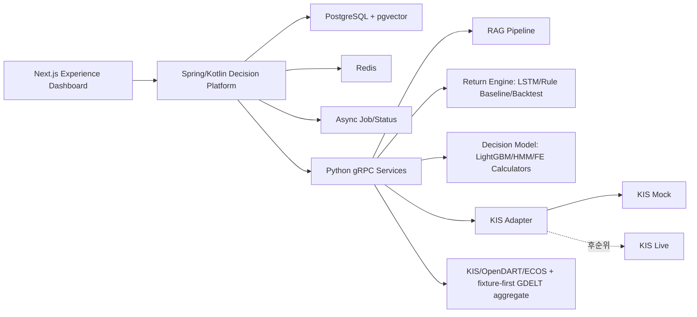

# API 명세서

<!-- P1_FULL_APP_V3_AUTHORITY_BEGIN -->
> **1.1.0 current authority (2026-08-27):** Owner-First full-app v3 API는 아직 release되지 않았다.
> contract-only 단계가 고정한 Automation/Journal 8개는 PR #171로 병합됐고 root OpenAPI는 기존 exact-48
> projection을 보존한 exact 56개였다. V91은 그 bytes를 보존하고 Automation v2 다섯 operation을
> 추가해 root exact-61, Team A versioned exact-38로 전환한다. 현재 v2 arm은
> `BLOCKED_INCOMPLETE_RISK_BALANCE` 409이며 자동운용 활성화 authority는 0이다.
> 공개 endpoint는 OpenAPI SSOT와 별도 contract-change가 병합된 경우에만 구현된 것으로 본다. 기존
> placeholder 계획, LightGBM production 경로와 `NOT_MATERIALIZED` 상태는 현재 v3 권위로 명시되지
> 않았다면 `HISTORICAL_SUPERSEDED`다. live order authority는 0이다.
<!-- P1_FULL_APP_V3_AUTHORITY_END -->

작성일: 2026-06-23  
프로젝트명: 뉴스감성·LSTM 기반 투자 원칙 검증형 AI 자동매매 봇  
서비스명: 투자 원칙 기반 AI 트레이딩 코치  
대상 문서: `최종_프로젝트_명세서.md`

---

## 0. 문서 목적

이 문서는 프론트엔드, Spring/Kotlin Decision Platform, Python AI/Data 서비스, KIS Mock/Live-ready 어댑터 사이의 API 계약을 정의한다.

핵심 원칙은 다음과 같다.

1. 프론트엔드는 Spring/Kotlin API만 호출한다.
2. Python FastAPI/gRPC 서비스는 내부 서비스로 두고 프론트에 직접 노출하지 않는다.
3. 주문 승인/경고/차단의 최종 권한은 Spring RiskEngine에 둔다.
4. Python 서비스는 RAG, 모델 신호, 백테스트, 금융공학 계산, KIS Adapter를 담당한다.
5. ready threshold의 `BLOCK` 위반은 `BLOCK`, hard 또는 `REQUIRED` evidence 장애는 `HOLD`로 fail-closed 한다. `OPTIONAL` 뉴스·공시·모델 evidence는 warning+abstention으로 degrade할 수 있지만 이전 값을 최신으로 가장하지 않는다.
6. 모든 주문 관련 API는 audit log와 decision trace를 남긴다.

### 0.1 구현 상태 표기 규칙

이 문서는 구현 계약과 후속 계획을 함께 담으므로 endpoint가 문서에 존재한다는 사실만으로 구현 완료를 뜻하지 않는다.

| 표기 | 의미 |
|---|---|
| `MERGED` | 코드·계약·자동 테스트가 main에 병합됨. 외부 live 성공은 별도 증거가 필요 |
| `CONTRACT_ONLY` | schema/proto/OpenAPI/fixture만 고정됐고 runtime이 없음 |
| `OFFLINE_ONLY` | fixture·local/Compose 검증만 통과했으며 provider physical call은 0 |
| `STUB_FAIL_CLOSED` | 공개 route/CLI가 stable typed error로 닫혀 실제 기능을 가장하지 않음 |
| `IMPLEMENTED_DRAFT` | current working tree에 코드·migration·자동 검증이 있으나 PR/main 병합이나 provider activation은 아님 |
| `LIVE_VERIFIED` | bound execution manifest·물리 호출 영수증까지 완료됨 |
| `HISTORICAL_SUPERSEDED` | 과거 역할·일정·artifact 계획은 보존하되 현재 실행 또는 S5 entry 의존성이 아님 |
| `DEFERRED_BY_DESIGN` | 명시적으로 후속 단계에 남긴 범위 |

각 절에 `LIVE_VERIFIED`와 exact packet/receipt가 명시되지 않았다면 외부 성공으로 해석하지 않는다.
세션 번호는 작업 배정을 뜻할 뿐 API 가용성을 뜻하지 않으며, schema/proto/OpenAPI 변경이 필요한
기능은 별도의 contract-change 절차가 완료되어야 한다. 구현 상태의 상위 기준은
`최종_프로젝트_명세서.md`와 `docs/README.md`의 Pre-S5 ledger를 따른다.

### 0.2 Pre-S5 단독 실행 API authority

이 절은 현재 API 운영 해석의 authority다. 아래에 남아 있는 기존 역할·일정·artifact 기술은
`HISTORICAL_SUPERSEDED` 기록이며, 존재하지 않는 workspace output은 `NOT_AVAILABLE/ABSTAIN`으로만
처리한다. 이는 S5 entry 또는 완료의 의존성이 아니다.

```text
PRE_S5_DOC_TRUTH_FREEZE_ADDENDUM_VERIFIED
PRE_S5_EXECUTION_OWNER=DECISION_PLATFORM
S1_3G=OFFLINE_ONLY
NEW_TEAMMATE_IMPLEMENTATION_TASKS=0
NEW_TEAMMATE_ISSUES_OR_PRS=0
REQUIRED_TEAMMATE_ARTIFACTS_FOR_S5_ENTRY=0
TEAMMATE_WORKSPACE_DIFF=0
GDELT_MODE=DECISION_PLATFORM_OFFLINE_REFERENCE_ONLY
GDELT_EXISTING_OFFLINE_PRODUCER_UNCHANGED=1
GDELT_HTTP_TRANSPORT=NOT_ACTIVATED
GDELT_OUTBOUND_IMPLEMENTATION=0
GDELT_OUTBOUND_CALLS=0
GDELT_OFFLINE_REFERENCE_ONLY=1
NAVER_ACTIVE_PROVIDER_RUNTIME_STORAGE=RETIRED
RAG_NEWS_ANALYST_DECISION_SIGNAL_ORDER_AUTHORITY=0
PLAN_FEASIBILITY=GO_WITH_EXTERNAL_HARD_GATES
```

Decision Platform은 기존 synthetic/offline GDELT aggregate producer를 소유한다. HTTP transport와
executor/outbound implementation은 활성화하거나 추가하지 않으며, GDELT aggregate는 설명 전용이다.
Naver는 retired 상태를 유지하고 RAG·news·analyst는 Decision, Signal, RiskDecision, order, decision
hash 권한이 0이다.

### 0.3 Pre-S5 public activation과 owner profile authority

2026-08-15 PR #131 병합 이후 `main=bd859ec3…`의 DB V71은 public RAG `FULL_READY`, active profile
`voyage_context_4_1024_v1`, sources/chunks `142/7,871`, document batch `63/63 COMMITTED`,
EXACT30/OA112 evaluation `2/2 PASSED`를 보존한다. public Voyage document/evaluation/production query는
재실행하지 않고 public BGE embedding inference는 계속 0이다. 기존 DB에는 V71까지 정상 Flyway 경로로 적용됐고
기존 public aggregate 보존과 `v2=120초 / v3=300초` scope를 provider call 0으로 검증했다. V64는 public
OpenAPI/proto 변경을 뜻하지 않으며 provider
preparation scope만 5분으로 발급하고 기존 2분 retrieval issuer를 보존한다.

숨겨진 owner import-ticket control-plane request/response는 v2이며 request의 exact shape는 다음과 같다.

```json
{
  "contractId": "s4-rag-v2-import-ticket-request-v2",
  "schemaVersion": 2,
  "sourceScope": "OWNER_PRIVATE",
  "importMode": "LOCAL_EPHEMERAL_PARSE",
  "embeddingProfileId": "voyage_context_4_1024_v1"
}
```

`embeddingProfileId`는 필수이고 `voyage_context_4_1024_v1` 또는
`bge_m3_local_1024_v1`만 허용한다. 누락·임의값·v1 request는 거부한다. 응답 v2는 선택 profile을
ticket에 결박한다. server default와 자동 fallback은 없으며 profile 전환은 owner library 전체
hard-delete 뒤 새 import로만 가능하다. 기존 public v1 OpenAPI/proto와 RAG ask/history/status response
bytes는 변경하지 않는다.

검색은 exact·lexical·dense 3-channel RRF(`k=60`)를 유지한다. owner Voyage는 public Voyage query
vector를 재사용하고 owner BGE는 public Voyage query와 별도의 local BGE owner query를 사용한다.
dense 후보는 profile 내부 rank를 먼저 계산하고 `profile rank → OWNER_PRIVATE → stable ID`로 하나의
channel을 만든다. 과거 Pre-S5의 owner BGE Top-5 일괄 Vertex 차단은 S4.9에서 supersede됐다. 갱신된
disclosure/policy/processor-set에 대한 effective GRANT가 있을 때만 owner BGE snippet도 Vertex 또는
외부 MCP client에 전달할 수 있고, GRANT가 없으면 외부 호출 전에 `RETRIEVAL_ONLY`로 닫는다. 응답
`embeddingProfileId`는 계속 public Voyage profile을 뜻한다.

owner Voyage import는 v2 consent·ticket·문서 안전성·exact packet을 provider socket 전에 검증하고,
한 import를 `55K request / 32K context group / 600-token chunk` 아래 물리 호출 1회·retry 0으로만
처리한다. 초과는 `OWNER_VOYAGE_IMPORT_TOO_LARGE`, timeout 또는 commit 불확실성은
`UNKNOWN_BILLING`이며 자동 분할·BGE 전환은 없다. owner BGE import는 pinned local runtime만 사용해
provider/network call이 0이다.

다음 이름은 public HTTP/gRPC 계약이 아니라 ignored local control-plane CLI다.

- `pre-s5-owner-voyage author|execute`
- `pre-s5-final-gate author-kis-quote|execute-kis-quote|author-window-b|verify-release`

사용자가 승인한 phase/window 범위는 packet 재생성 뒤에도 유지한다. author는 감사용 manifest SHA를
출력하지만 execute는 owner Voyage, KIS quote, Window B의 SHA 환경변수를 요구하거나 비교하지 않는다.
manifest/child packet 구조, TTL, 물리 호출·retry·비용 상한 검증은 그대로 유지한다.

`verify-release`는 ignored `pre-s5-release-ledger/v2`의 marker를 단독 신뢰하지 않는다. fixed-path 0600
owner BGE/KIS V3/required CI/security/tracked-audit receipt digest와 fresh V71 DB의 public·owner·S4.8 및
Window B Voyage/Vertex `COMMITTED` aggregate를 모두 대조한 뒤에만 `OPEN`을 반환한다.

거래시간 외에는 사용자가 명시 승인한 경우에만 KIS V3의 동일한 7단계를 provider call 0의 결정적
mock으로 검증할 수 있다. receipt는 `AFTER_HOURS_DETERMINISTIC_MOCK`을 명시하고
`KIS_MOCK_AFTER_HOURS_RECONCILIATION_VERIFIED=true`,
`KIS_MOCK_FULL_RECONCILIATION_VERIFIED=false`를 산출해 물리 주문 검증과 구분한다.

owner author/execute는 정확히 9개 format의 v2 ticket을 one request에 묶고, manifest·packet·current
consent·owner profile·token/context cap을 socket 전에 검증한다. KIS quote manifest는 tokenP 최대 1회와
current-price 1회, retry 0만 허용한다. Window B manifest는 Voyage query, Vertex activation, KIS V3 child
packet SHA를 결박하며 각 runtime은 parent approval SHA와 자기 child SHA가 다르면 outbound 전에
`PRE_S5_WINDOW_B_CHILD_BINDING`으로 닫힌다. Vertex credential은
`capstone-rag/secrets/pre-s5-vertex-service-account.json`의 현재 사용자 소유 0600 regular file/link count 1
경계와 기존 service-account OAuth만 사용한다. API key·ADC fallback은 없다. 이 control plane은 v1
OpenAPI/proto 및 ask/history/status response bytes를 변경하지 않는다.

현재 synthetic owner Voyage one-shot은 exact manifest 아래 물리 호출 1회로 9개 format을 stage한 뒤
same-owner 검색과 전량 hard-delete를 완료했고 source/chunk/vector/profile-lock residual은 0이다. KIS
current-price receipt와 S4.8 9-lane terminal 분류도 완료됐으며 재호출하지 않는다. S4.9 live smoke에서
Voyage query 1회와 Vertex service-account OAuth/generateContent 각 1회가 성공했고 latest Strong LLM
usage는 `COMMITTED`다. 거래시간 외 KIS는 위 결정적 mock receipt로 대체하며 실제
tokenP·brokerage·live-order 호출은 0이다.

> 완료 기준점(2026-07-16): S1.3 내부 ECOS/Naver producer는 PR #16 merge commit
> `6f439155d9f5ec626fc185f29f2e0bd64ca54780`, S1.3K KRX 내부 collector는 PR #17 merge
> commit `814aab377251d76672566d39c3edb379d132248e`으로 `main`에 병합됐다. 두 트랙은 public
> REST/gRPC가 아니라 아래에 명시한 내부 artifact/CLI 경계만 구현 완료 상태다.
> 이 Naver 문단은 당시 완료 evidence이며 신규 실행 권한이 아니다.
>
> S1.3G active 뉴스 API/contract authority(2026-07-31):
> `NAVER_ACTIVE_PROVIDER_RUNTIME_STORAGE=RETIRED`, `GDELT_PROVIDER_PHYSICAL_CALLS=0`,
> `GDELT_ARTICLE_METADATA_STORAGE=0`, `GDELT_DECISION_AUTHORITY=NONE`,
> `GDELT_S5_FEATURE_ELIGIBLE=FALSE`다. 실제 provider outbound는 별도 승인이 필요하고,
> 이번 통합 보안 검사는 `SECURITY_SCAN_TIMING=FINAL_CONSOLIDATED_CAMPAIGN`으로 모든
> offline 구현과 일반 gate 완료 뒤 실행한다.
> 2026-08-01 현재 strict two-mode parser, network-free fixture collector, no-zero `ABSTAIN`,
> 0600 append-only publisher와 exact approval packet validator는 구현됐지만 HTTP transport는
> `NOT_ACTIVATED`다.

---

### 0.4 S4.9 MCP + Strong LLM internal contract

S4.9는 V66/V67 위에 runtime Voyage query authorization을 분리한 V68과 owner 권한이 없는 public MCP
context의 empty-evidence scope revalidation을 고친 V69, LangGraph/provenance V70, SearXNG history
provenance forward repair V71을 순서대로 추가한다. 기존 row와 public
RAG/OpenAPI/proto bytes는 동결한다. 기존
`POST /api/v2/rag/ask`는 내부적으로 Top-5 전체를 provider-neutral `StrongLlmGenerationPort`에 전달한다.
active adapter는 별도 internal bidi gRPC로 Python LangGraph를 호출한다. Google 허용 시 Gemini가 Vertex
Google Search grounding을 사용할지 자율 결정하고 native JSON schema 답변과 grounding support를 같은
응답에서 반환한다. Google local soft cap 도달 시에만 최대 3 tool round 뒤 tools 없는 SearXNG final
structured-output을 수행한다.
첫 안전 문장 강제 선택, answer enum 고정, citation 1개/문장 1개/numeric 0 강제는 제거한다.

Strong LLM 내부 결과 의미는 다음과 같다.

| basis | 계약 |
|---|---|
| `EVIDENCE` | 생성 문장마다 Top-5/current web evidence citation과 canonical text의 exact quote 필요 |
| `MODEL_KNOWLEDGE` | timeless 교육 설명만, citation 0, coverage 0, `MODEL_KNOWLEDGE_ONLY` |
| `INSUFFICIENT_EVIDENCE` | answer/citation 없이 public `RETRIEVAL_ONLY` + flag |

validator는 응답을 고쳐 쓰지 않는다. 위조 citation/quote, quote에 없는 숫자, owner scope 위반, schema 위반,
직접 매수·매도 조언은 invalid다. 단일/오래된/상충/낮은 관련성/2차 출처는 warning이다.

Streamable HTTP `POST /mcp`는 OAuth bearer token을 요구하고 정확히 다음 다섯 tool만 노출한다.

| tool | 필수 scope | 결과 |
|---|---|---|
| `capstone_rag_search` | `mcp:rag.public`; owner Top-5 포함은 호출 전 `mcp:rag.owner` | owner/client-bound 15분 research context + Top-5 |
| `capstone_web_search` | `mcp:web.read` | context-bound SearXNG 후보와 opaque `resultId/sourceType` |
| `capstone_web_read` | `mcp:web.read` | registered `resultId`의 bounded normalized text + discovered links |
| `capstone_answer_validate` | `mcp:answer.validate` | exact draft validation + 5분 one-use receipt |
| `capstone_answer_save` | `mcp:history.write` | 명시 호출 때만 AES-GCM encrypted 30-day history |

tool parameter에 `ownerId`는 없고 JWT `sub`, `client_id`, audience, scope, account status/securityVersion에서만
owner를 결정한다. 외부 LLM이 validate를 호출하지 않은 답변은 Capstone 검증 답변으로 표시·저장하지 않는다.
`mcp:rag.owner`가 없으면 DB는 owner pointer/bundle/component를 읽지 않는 public-only claim을 발급한다.

OAuth discovery/control surface:

```http
GET /.well-known/oauth-authorization-server
GET /.well-known/oauth-protected-resource
GET /.well-known/oauth-protected-resource/mcp
GET|POST /oauth2/authorize
POST /oauth2/token
POST /oauth2/revoke
POST /mcp
```

Authorization Code + PKCE `S256`, exact `resource=<.../mcp>`, access token 15분, rotating refresh token 7일,
ES256 signing key와 static/CIMD-verified allowlist를 사용한다. signing key/client file은 서로 다른 0600 regular
single-link file이다. public Dynamic Client Registration endpoint는 열지 않는다.

Vertex Google grounding은 provider source/support metadata만 citation으로 등록하고 redirect URI 자동 GET은
0이다. Pacific month local soft cap은 4,000 query이며 8 query 보수 예약 후 실제 `webSearchQueries` 수로
정산한다. SearXNG DuckDuckGo는 cap 도달 시 best-effort fallback이다. Naver, browser/crawler/Deep Research는
0이다. URL read는 SearXNG result, 질문의 public HTTPS user root, 이미 읽은 페이지의 discovered link만 받고 public IP,
redirect DNS, TLS hostname, MIME/byte/page/prompt-injection 경계를 다시 검증한다. mode budget과 15분 external
research budget은 `docs/S4_9_MCP_Strong_LLM_운영_가이드.md`의 env로 조정하되 absolute cap을 넘지 못한다.

V70은 기존 migration/row를 보존하고 Google budget reservation/settlement, source/support/edge, search attempt,
generic web citation history와 usage v2를 추가한다. raw query, raw page, owner text, model request/response는 0이다.
V71은 V70 함수나 기존 row를 삭제하지 않고, host가 기록한 `SEARXNG_RESULT`, `USER_ROOT`,
`DISCOVERED_LINK` ID를 source type·support edge와 함께 history citation으로 canonicalize한다.

S4.9 result는 downstream 모델·판단·주문·hash API 입력이 아니며 이 절은 S5.1 계약을 넓히지 않는다.

#### 0.4.1 2026-08-15 live verification

- OAuth Authorization Code + PKCE S256의 실제 code/token 교환, exact `/mcp` audience와 subject/client/scope,
  refresh-token family revoke를 확인했다.
- MCP `initialize` 뒤 `tools/list`는 위 다섯 도구만 반환했다. public-only `capstone_rag_search`,
  SearXNG search 1회, 검색 결과의 exact HTTPS URL read 1회와 exact quote 기반 answer validation을
  실제 호출했다. save는 사용자가 명시하지 않아 0회이고 history row도 0이다.
- 고정 교육 질문은 local Top-5가 0인 경계에서 citation 없는 `MODEL_KNOWLEDGE_ONLY`로 `ANSWERED`했다.
  따라서 이 결과를 evidence-backed citation 답변으로 표시하지 않는다. 별도 MCP validation은 web evidence
  1개 때문에 `VALID_WITH_WARNINGS`였고 위조 citation/quote는 허용하지 않았다.
- latest usage는 `VERTEX_AI / gemini-3.5-flash / COMMITTED`, prompt/output token 양수다. raw request,
  raw response, OAuth token과 raw web body는 저장하지 않았다.
- public aggregate `142 sources / 7,871 chunks / 63 document batches / 2 evaluations`, owner residual 0,
  S4.8 terminal state는 바뀌지 않았다.

#### 0.4.2 사용자 로그인과 화면 책임

일반 Capstone 화면은 기존 `POST /api/v1/auth/login`으로 API JWT를 발급받는다. 외부 ChatGPT/Claude가
Capstone MCP를 연결할 때만 별도의 OAuth authorize 화면에서 같은 Capstone 사용자가 로그인하고 scope를
동의한다. 이는 Google/Vertex 로그인이나 서비스계정 인증 화면이 아니다. Vertex OAuth는 서버가 0600
service-account JSON으로 수행하며 사용자 화면에 노출하지 않는다.

현재 Decision Platform backend에는 Spring의 기본 local authorize/login/consent 화면이 있어 live smoke를
완주할 수 있다. 제품 브랜딩을 적용한 사용자 화면은 이 workspace에 구현돼 있지 않으며 placeholder
workspace를 이 변경에서 확장하지 않는다. 배포 UI가 맡을 일은 기존 로그인 세션을 사용해
MCP client 이름, 요청 scope, owner snippet 외부 전달 여부를 표시하고 승인/거부를 Spring OAuth endpoint로
보내는 것이다. 비밀번호는 운영 secret/bundle과 DB의 salted hash로만 관리하며 코드·문서·argv에 고정하지
않는다.

## 1. 전체 API 경계



| 계층 | 외부 노출 | 핵심 책임 |
|---|---:|---|
| Next.js Dashboard | 사용자 브라우저 | 화면, 차트, 원칙 설정, 주문 검토, 학습일지 |
| Spring/Kotlin API | 노출 | BFF, 인증, 원칙, RiskEngine, 주문 상태, 감사로그 |
| Python gRPC/FastAPI | 내부 | RAG, 모델 신호, 백테스트, 금융공학 계산, KIS Adapter |
| PostgreSQL/pgvector | 내부 | 사용자/원칙/주문/일지/RAG metadata/vector |
| Redis | 내부 | cache, lock, 임시 상태, idempotency key, rate limit |
| Async Job/Status | 내부 | 비동기 작업 상태, 감사 상태, 화면용 metric |

---

## 2. 공통 규칙

### 2.1 공통 헤더

| 헤더 | 필수 | 설명 |
|---|---:|---|
| `Authorization: Bearer <token>` | 예 | 사용자 인증 토큰 |
| `X-Request-Id` | 예 | 요청 추적 ID. bounded 형식으로 검증하고 로그 제어문자를 거부 |
| `X-Idempotency-Key` | 금융 부작용/안전 gate 변경 필수 | 중복 주문·취소·정정·gate 변경 방지. 적용 matrix는 2.5 |
| `X-Client-Timezone` | 아니오 | 기본 `Asia/Seoul` |

### 2.2 공통 응답 envelope

```json
{
  "success": true,
  "requestId": "req_20260623_000001",
  "data": {},
  "warnings": [],
  "error": null
}
```

오류 응답:

```json
{
  "success": false,
  "requestId": "req_20260623_000001",
  "data": null,
  "warnings": [],
  "error": {
    "code": "RISK_BLOCKED",
    "message": "일일 손실 한도 초과로 주문이 차단되었습니다.",
    "details": {
      "ruleId": "daily_loss_guard",
      "currentLossRate": -0.042,
      "limit": -0.03
    }
  }
}
```

### 2.3 주요 오류 코드

| 코드 | HTTP | 의미 | 기본 처리 |
|---|---:|---|---|
| `VALIDATION_ERROR` | 400 | 요청 스키마 오류 | 화면에 입력 오류 표시 |
| `UNAUTHORIZED` | 401 | 인증 실패 | 로그인 유도 |
| `FORBIDDEN` | 403 | 권한 없음 | 접근 차단 |
| `NOT_FOUND` | 404 | 리소스 없음 | 빈 상태 표시 |
| `CONFLICT` | 409 | 버전 충돌 | 재조회 후 재시도 |
| `IDEMPOTENCY_CONFLICT` | 409 | 동일 idempotency key에 다른 payload | 요청 내용 확인 |
| `IDEMPOTENCY_IN_PROGRESS` | 409 | 동일 idempotency key 요청이 처리 중 | 현재 요청 완료 후 동일 payload로 재조회 |
| `PAYLOAD_TOO_LARGE` | 413 | 전역 또는 idempotency request body 상한 초과 | 요청 크기 축소 |
| `DECISION_EXPIRED` | 409 | decision 유효시간(`validUntil`) 초과 | 주문 재평가 유도 |
| `RISK_BLOCKED` | 422 | 원칙/안전장치 위반으로 주문 차단 | 주문 불가 |
| `RISK_UNAVAILABLE` | 503 | Kill Switch DB authority 또는 Risk 조회 경계 장애 | fail-closed, 신규 판단/주문 보류 |
| `DATA_STALE` | 409 | 가격/신호/뉴스 데이터 지연 | 주문 보류 |
| `RATE_LIMITED` | 429 | 호출 한도 초과(KIS rate limit, LLM 비용 가드) | KIS `EGW00201`/HTTP 429는 adapter가 자동 재시도하지 않고 공유 limiter scope·외부 caller 유무를 점검한다. 일반 API의 안전한 멱등 조회만 명시적 `Retry-After`에 따라 제한 재시도하며 write와 provider quota 소진은 자동 재시도 금지 |
| `PYTHON_SERVICE_UNAVAILABLE` | 503 | 내부 gRPC 서비스 장애 | fail-closed |
| `BROKERAGE_UNAVAILABLE` | 503 | KIS 어댑터 장애 | 주문 보류 |

오류 처리 공통 규칙:

1. 클라이언트는 HTTP 상태 코드가 아니라 `error.code`로 분기한다. HTTP 상태는 로깅/모니터링 참고값이다.
2. Guide 모드 경고는 오류가 아니다. 경고는 항상 정상 응답의 `data.decision = WARN`과 `violations`로 표현한다. (기존 `RISK_WARNED` 오류 코드는 삭제됨.)
3. `RISK_BLOCKED`는 423(WebDAV Locked)이 아니라 422(Unprocessable Entity)를 사용한다. 요청 형식은 유효하나 비즈니스 규칙상 처리 불가라는 의미와 정확히 일치하기 때문이다.

### 2.4 인증/권한

`POST /api/v1/auth/login`으로 데모 계정을 인증하고 access token을 발급받는다. 로그인만 `Authorization` 헤더의 예외이며, client interceptor가 cutover 전 stale Bearer를 첨부해도 해당 header는 무시하고 새 credential을 검증한다. 그 밖의 API는 명시된 역할과 Bearer 인증을 요구한다. 토큰은 데모 기준 만료 12시간을 사용하고 payload에는 opaque `sub`, `role`, `securityVersion`처럼 검증에 필요한 최소 claim만 담는다(민감정보 금지). JWT는 허용 algorithm을 고정하고 issuer/audience/subject/issued-at/expiry/securityVersion을 검증한다. Kill Switch 해제, ADMIN replay, Live 관련 고위험 행위는 token의 role만 믿지 않고 현재 DB의 account 활성 상태·role·securityVersion을 다시 확인하며, 권한 회수 뒤 발급된 이전 token은 거부한다.

로그인 attempt는 client address+username 기준 15분 5회, address 기준 15분 50회로 원자 예약하며, JSON binding 전 전역 request body 상한을 적용한다. limiter key는 private factory가 정규화한 address/username scope를 purpose/version HMAC으로 만든 digest만 사용하고 raw address·username을 저장·로그·metric label에 넣지 않는다. 주소는 socket remote address를 기준으로 하고, 배포 시 명시적으로 allowlist한 reverse proxy에서 온 경우에만 표준 forwarded header를 해석한다. 임의 `X-Forwarded-For`를 신뢰하지 않는다. demo account verifier는 평문 password가 아니라 attested bundle에서 검증된 adaptive salted password hash를 DB에 저장하고 검증 라이브러리로 비교한다. 인증 가능한 password 범위는 `1..72 UTF-8 bytes`이며 DTO의 1,024-character 상한은 JSON 입력 방어일 뿐 credential 경계가 아니다. 72 bytes를 넘는 입력은 per-process dummy로 치환해 선택 row와 peer row에 BCrypt strength-12 검증을 각각 한 번 수행한 뒤 동일한 401로 거부한다. 정상 범위의 모든 login도 두 row를 각각 한 번 검증하며, 하나의 평문이 두 row에 모두 일치하면 두 역할을 모두 fail-closed한다. 존재하지 않는 사용자와 잘못된 비밀번호도 정확히 두 번의 dummy/peer BCrypt 경로와 동일한 stable 오류를 사용한다. 현재 단일 JVM limiter는 replica 1에서만 보안 경계가 성립하며, 다중 replica 배포 전에는 공유 원자 저장소로 이전해야 한다.

#### 2.4.1 S2.1 actor trust-root 선행 계약

DB `users`가 demo identity의 단일 진실 소스다. checksum이 있는 V7 Java migration은 `security_version bigint NOT NULL DEFAULT 1 CHECK (security_version > 0)`과 credential evidence 열(`credential_reuse_tag`, `credential_bundle_mac`, `credential_policy_version`)을 추가하고 migration role로 아래 두 row만 seed한다. 두 고정 demo row는 32-byte tag/MAC와 policy version 1을 모두 가져야 하고, 다른 user row는 evidence가 없어도 호환된다. BCrypt hash·tag·MAC는 추적 파일이나 Flyway SQL text에 넣지 않고 검증된 배포 bundle에서 prepared statement bind parameter로만 전달한다. 기존 `user_id`/username/role/status/version/hash/evidence가 exact shape과 다르면 overwrite하지 않고 migration transaction 전체를 중단한다.

| user_id | username | role | status | securityVersion | credential source |
|---|---|---|---|---:|---|
| `usr_demo_user` | `demo-user` | `USER` | `ACTIVE` | 1 | `DEMO_USER_CREDENTIAL_BUNDLE` |
| `usr_demo_admin` | `demo-admin` | `ADMIN` | `ACTIVE` | 1 | `DEMO_ADMIN_CREDENTIAL_BUNDLE` |

JWT header/claim은 `alg=HS256`, exact configured `iss`, exact single `aud`, nonblank internal `user_id` `sub`, `iat`, `exp`, `role`, `securityVersion`을 필수로 한다. future `iat` 허용 오차는 최대 60초다. 매 authenticated request마다 `sub`로 DB row를 재조회하고 `ACTIVE`, role, `securityVersion`이 token과 같을 때만 DB 값으로 principal을 만든다. row missing, `LOCKED`, `DISABLED`, role/version mismatch는 모두 동일한 401이다. `JWT_SECRET`, `LOGIN_SCOPE_HMAC_KEY`, `DEMO_CREDENTIAL_SEPARATION_KEY`, 후속 cursor HMAC key는 목적별로 서로 다른 secret을 사용한다.

로그인 성공 시 `data.user.userId`는 상위 표의 internal ID이며 JWT `sub`와 같다. Dashboard/consumer는 username이나 request body의 user ID를 owner key로 사용하지 않는다.

| Field | KR | EN |
|---|---|---|
| `data.accessToken` | Bearer JWT 원문; URL/로그에 넣지 않음 | Raw Bearer JWT; never place it in URLs or logs |
| `data.expiresAt` | 서버가 발급한 만료 시각 | Server-issued expiration timestamp |
| `data.user.userId` | DB와 JWT `sub`가 공유하는 opaque owner ID | Opaque owner ID shared by the DB and JWT `sub` |
| `data.user.username` | 화면 표시/로그인 이름; owner key 아님 | Display/login name; not an owner key |
| `data.user.role` | DB 재검증된 `USER` 또는 `ADMIN` | DB-revalidated `USER` or `ADMIN` role |

#### 2.4.2 credential rotation·cutover 운영 계약

배포 전 secret store에 `DEMO_USER_CREDENTIAL_BUNDLE`, `DEMO_ADMIN_CREDENTIAL_BUNDLE`, `DEMO_CREDENTIAL_SEPARATION_KEY`, `JWT_SECRET`, `JWT_ISSUER`, `JWT_AUDIENCE`, `LOGIN_SCOPE_HMAC_KEY`를 준비한다. separation key는 정확히 32 random bytes를 unpadded Base64url로 인코딩하고 JWT/login-scope/cursor key와 재사용하지 않는다. 두 role bundle은 한 approved preparation workflow가 서로 다른 12..72 UTF-8-byte 평문에서 생성해 원자 게시한다. application·DB·argv·로그·audit·추적 파일에는 평문을 전달하지 않으며 actual `.env`는 자동 변경하지 않는다.

bundle wire format은 `s21-v1:<user_id>:<reuse_tag_b64url>:<bcrypt12_hash>:<bundle_mac_b64url>`이다. `reuse_tag`는 같은 전용 key와 `capstone:s21:demo-credential-reuse:v1` domain으로 평문 UTF-8 bytes를 HMAC-SHA-256한 32-byte 값이다. `bundle_mac`은 `capstone:s21:demo-credential-bundle:v1` domain으로 version, exact user ID, username, role, raw reuse tag, BCrypt hash를 HMAC-SHA-256해 독립 필드 편집을 막는다. HMAC input은 domain부터 각 field를 `4-byte big-endian length || bytes`로 framing한다. tag/MAC/key의 wire encoding은 padding 없는 canonical Base64url이다. 저장된 hash만 비교해서는 salt 때문에 평문 재사용을 판별할 수 없으므로 hash 문자열 불일치는 보조 방어일 뿐 분리 증거가 아니다.

V7은 초기 bootstrap이지 rotation 경로가 아니다. 회전은 `flyway` DB role을 사용하는 `rotateDemoCredential` one-shot task로만 수행한다. task는 loopback PostgreSQL만 허용하고 두 demo row를 `FOR UPDATE NOWAIT`로 잠근다. 두 저장 bundle의 MAC을 다시 검증하고 새 reuse tag가 현재/peer tag와 모두 다른지 constant-time으로 확인한 뒤, 현재 hash/tag/MAC/policy version/`security_version` 전체를 CAS predicate로 삼아 대상 하나의 bundle 교체, `security_version + 1`, sanitized audit INSERT를 bounded transaction으로 commit한다. hash/tag/MAC/key/credential은 argv·stdout·log·audit에 남기지 않는다. 아래 변수는 secret manager가 주입한 one-shot process에서만 사용한다. `POSTGRES_HOST`/`POSTGRES_PORT`를 생략하면 loopback `127.0.0.1:5432`를 사용하며 non-loopback host는 거부한다.

PostgreSQL role bootstrap은 `flyway`에 `log_parameter_max_length=0`과 `log_parameter_max_length_on_error=0`을 고정한다. V7 bootstrap과 rotation은 하나의 공통 verifier로 현재 세션의 두 effective setting을 직접 읽는다. V7은 DDL·credential bind 전에, rotation은 row lock·credential bind 전에 둘 중 하나라도 `0`이 아니면 mutation과 audit 없이 fail-closed한다. 따라서 운영상 SQL 문장 로깅(`log_statement`)은 유지할 수 있지만 BCrypt hash·reuse tag·bundle MAC bind 값은 일반 로그와 오류 로그 모두에서 생략되어야 한다. 배포 검증은 migration/rotation과 같은 role의 새 세션에서 두 setting이 정확히 `0`인지 확인해야 하며, 기존 volume에는 init script가 자동 재실행되지 않으므로 role 설정을 명시적으로 재적용한 뒤 V7을 실행한다. 확장 로거·managed-service 수집기·로그 reader ACL·retention은 이 애플리케이션 경계 밖의 별도 운영 보안 gate로 관리한다.

운영자는 새 role-bound bundle을 해당 `DEMO_USER_CREDENTIAL_BUNDLE` 또는 `DEMO_ADMIN_CREDENTIAL_BUNDLE`의 pending secret version과 one-shot `DEMO_CREDENTIAL_BUNDLE`에 동일 bytes로 준비하고, bootstrap과 one-shot에는 같은 `DEMO_CREDENTIAL_SEPARATION_KEY` version을 주입한다. DB rotation과 old password/token 거부·new password login 검증이 모두 성공한 뒤에만 pending bundle을 persistent bootstrap secret으로 승격한다. 승격 실패 시 clean rebuild를 진행하지 않고 불일치 상태를 운영 장애로 처리한다. 이전 app binary rollback window 동안에는 이전 plaintext와 검증된 이전 bundle도 secret store에만 보존하며 Git/`.env`에는 두지 않는다. rollback은 검증된 이전 bundle과 호환 app version을 함께 복원하며 bare hash acceptance로 후퇴하지 않는다.

```bash
(
  set -euo pipefail
  trap 'S21_ROTATE_EXIT=$?; unset DEMO_CREDENTIAL_USER_ID DEMO_CREDENTIAL_BUNDLE DEMO_CREDENTIAL_SEPARATION_KEY DEMO_CREDENTIAL_ROTATION_ACTOR POSTGRES_MIGRATION_PASSWORD; exit "$S21_ROTATE_EXIT"' EXIT
  test -n "${POSTGRES_MIGRATION_PASSWORD:-}"
  test -n "${DEMO_CREDENTIAL_USER_ID:-}"
  test -n "${DEMO_CREDENTIAL_BUNDLE:-}"
  test -n "${DEMO_CREDENTIAL_SEPARATION_KEY:-}"
  test -n "${DEMO_CREDENTIAL_ROTATION_ACTOR:-}"
  test -n "${POSTGRES_DB:-}"
  workspaces/decision-platform/spring-api/gradlew \
    -p workspaces/decision-platform/spring-api --no-daemon rotateDemoCredential
)
```

배포 직전에는 아래 task가 기존 token의 authenticated health 200을 확인하고 raw token 대신 digest/exp/시간/base URL만 ignored build evidence에 atomic create-if-absent로 저장한다. 배포 후에는 **같은 기존 token** 401, 새 USER/ADMIN login의 exact internal ID/role과 JWT `sub`/role/securityVersion 결속, 서로 다른 두 token, 두 token의 health 200, USER의 ADMIN metrics 403과 ADMIN의 200을 확인하고 성공할 때만 evidence를 삭제한다. preflight 남은 token 수명은 7,200초 이상, postflight는 capture 후 1,800초 이내이면서 남은 token 수명 3,600초 이상이어야 한다.

```bash
(
  set -euo pipefail
  trap 'S21_AUTH_PRE_EXIT=$?; unset AUTH_SMOKE_BASE_URL AUTH_SMOKE_PRE_CUTOVER_TOKEN; exit "$S21_AUTH_PRE_EXIT"' EXIT
  test -n "${AUTH_SMOKE_BASE_URL:-}"
  test -n "${AUTH_SMOKE_PRE_CUTOVER_TOKEN:-}"
  workspaces/decision-platform/spring-api/gradlew \
    -p workspaces/decision-platform/spring-api --no-daemon \
    cleanAuthCutoverEvidence authPreCutoverCapture
  test -s workspaces/decision-platform/spring-api/build/auth-cutover/pre-cutover.json
)

(
  set -euo pipefail
  trap 'S21_AUTH_POST_EXIT=$?; unset AUTH_SMOKE_BASE_URL AUTH_SMOKE_USER_PASSWORD AUTH_SMOKE_ADMIN_PASSWORD AUTH_SMOKE_PRE_CUTOVER_TOKEN; exit "$S21_AUTH_POST_EXIT"' EXIT
  test -n "${AUTH_SMOKE_BASE_URL:-}"
  test -n "${AUTH_SMOKE_USER_PASSWORD:-}"
  test -n "${AUTH_SMOKE_ADMIN_PASSWORD:-}"
  test -n "${AUTH_SMOKE_PRE_CUTOVER_TOKEN:-}"
  test -s workspaces/decision-platform/spring-api/build/auth-cutover/pre-cutover.json
  workspaces/decision-platform/spring-api/gradlew \
    -p workspaces/decision-platform/spring-api --no-daemon authCutoverSmoke
  test ! -e workspaces/decision-platform/spring-api/build/auth-cutover/pre-cutover.json
)
```

배포 rollback은 V7 column/row를 남긴 채 rollback window에 보존한 이전 app binary/config와 이전 plaintext demo secret으로 되돌린다. down migration·demo row 삭제·dual-token acceptance는 하지 않고, rollback 후에도 사용자가 다시 로그인하게 한다. 이 선행 계약은 Principle endpoint, Principle idempotency 경계, S2.2/S2.3 runtime을 추가하지 않는다.

| 역할 | 접근 범위 |
|---|---|
| `USER` | 원칙, 결정, 주문, 잔고, RAG, 학습일지, 백테스트, Kill Switch 활성화 |
| `ADMIN` | USER 전체 + Kill Switch 해제, Async Job/Stream Metric/Artifact Ingest 상태, replay 관련 운영 기능 |

Kill Switch는 비대칭 권한을 적용한다. 활성화(정지)는 USER도 가능하지만 해제(재가동)는 ADMIN만 가능하다 — 안전한 방향은 넓게, 위험한 방향은 좁게 연다.

모든 사용자 리소스는 JWT `sub`에 해당하는 내부 userId를 소유권 기준으로 사용한다. `principleId`, `decisionId`, `answerId`, `backtestId`, `artifactId`, `journalId`, `orderId`, `accountId`, consent/async job id는 요청 경로나 body에 들어 있어도 신뢰하지 않고 DB 조회 단계에서 `owner_user_id = subject` 조건으로 제한한다. 다른 사용자의 식별자를 넣은 요청은 존재 여부를 노출하지 않도록 기본 `NOT_FOUND`로 거부한다. `accountId`는 provider 계좌번호가 아닌 opaque 내부 ID만 허용한다.

ADMIN의 운영 조회·재시도·replay는 업무상 필요한 최소 범위에서만 owner scope를 넘을 수 있고, 대상 owner, 행위자, 사유, 시각을 append-only audit에 남긴다. audit의 `actorUserId`와 `occurredAt`은 요청 body의 `requestedBy`, `acceptedAt`, `acknowledgedAt` 같은 값을 신뢰하지 않고 인증 principal과 서버 clock으로 생성한다. 클라이언트가 이러한 권한성/감사성 필드를 보내면 무시하지 말고 validation 오류로 거부한다.

### 2.5 Idempotency 시맨틱

| 상황 | 동작 |
|---|---|
| 동일 key + 동일 payload 재요청 | 저장된 원 응답을 그대로 반환하고 부작용을 만들지 않는다 |
| 동일 key + 다른 payload | `IDEMPOTENCY_CONFLICT`(409) |
| 동일 key 처리 중 | `IDEMPOTENCY_IN_PROGRESS`(409), controller 재실행 금지 |
| key 보존 기간 | 24시간(Redis TTL) |
| 금융 write replay namespace | `(purpose/version, subject, current role, securityVersion, idempotency key)` |
| payload fingerprint | bounded request body를 method/request URI/query와 함께 hash |
| key 형식 | 16~128자, `[A-Za-z0-9._:-]`만 허용. 원문은 로그·metric label에 남기지 않음 |

Redis claim은 고유 owner token으로 선점하고, owner 확인·응답 저장·TTL 설정·claim 삭제를 단일 Lua script로 처리한다. Redis는 인증+AOF+`noeviction`으로 운영하지만 금융 부작용의 최종 방어는 DB unique/state transition이다.

Idempotency HMAC key rotation 중에는 active와 previous version의 scope digest를 모두 조회해 기존 replay/DB unique를 확인하고 새 기록만 active version으로 쓴다. previous version은 24시간 replay TTL과 미완료 reconciliation이 모두 끝나기 전에 폐기하지 않는다. 이 dual-read가 불가능하면 rotation 중 금융 write를 fail-closed로 막는다.

멱등 선점은 설정 wildcard에 단순 일치하는 URL이 아니라 실제 MVC write handler가 매핑된 요청에만 적용한다. DB-backed JWT 인증이 확인한 현재 role/securityVersion을 replay scope에 묶으므로 권한 변경 전 저장 응답은 새 principal에서 cache miss가 되고 route 인가를 다시 통과해야 한다. 사용자별 TTL 구간의 신규 key는 owner·purpose 단위로 기본 1,000개로 제한한다. 인가·라우팅·검증성 4xx는 owner claim을 원자 반납해 장기 replay state로 남기지 않고, controller 응답 버퍼는 설정 byte 상한 이상을 메모리에 보관하지 않는다. 동일 key replay도 같은 subject·현재 권한 context에서만 반환한다.

금융 부작용 또는 안전 gate를 변경하는 다음 write에 위 시맨틱을 의무 적용한다.

| Endpoint 계열 | 멱등성 적용 |
|---|---|
| Mock/파생 주문 제출 | 필수 |
| 주문 취소·정정 | 필수 |
| Kill Switch 상태 변경 | 필수 |
| Live consent·live safety gate 상태 변경 | 필수 |

원칙 CRUD, Journal, feedback, 백테스트 실행 같은 비금융 write는 optimistic version, job deduplication 등 각 도메인 계약을 사용하며 위 금융 replay 계약을 자동 상속하지 않는다. 적용 범위를 넓히려면 endpoint별 부작용과 replay 응답 상한을 검토한 contract change가 필요하다.

### 2.6 목록 API 공통 pagination

목록 조회는 cursor 기반 pagination을 기본으로 한다.

- 요청: `?cursor=<opaque>&size=50` (기본 50, 최대 200)
- 응답: `data.items[]`와 `data.nextCursor` (마지막 페이지면 `null`)
- 적용 대상: journals, decisions, rag/sources, async-jobs, order events
- cursor는 서버 HMAC으로 인증하고 subject, route, allowlisted filter/sort, 마지막 key, page size, schema version, 짧은 expiry에 묶는다. cursor payload에는 opaque ID와 비민감 pagination state만 두며 PII·계좌·provider 식별자·credential/configuration을 넣지 않는다. 민감 state가 필요하면 authenticated-encryption 또는 server-side random cursor를 사용한다. 다른 사용자/endpoint/query의 cursor 재사용과 변조는 `VALIDATION_ERROR`로 거부하며, cursor 내용을 SQL identifier/fragment로 직접 사용하지 않는다.

### 2.7 시스템 상태 조회

`GET /api/v1/system/health`

```json
{
  "success": true,
  "data": {
    "asOf": "2026-06-23T15:31:00+09:00",
    "pythonService": "UP",
    "brokerage": "UP",
    "killSwitchActive": false,
    "dataFreshness": {
      "priceFresh": true,
      "signalFresh": true,
      "ragFresh": true
    },
    "degradedFeatures": []
  }
}
```

Risk API의 `dataFreshness`는 리스크 수치 관점, 이 API는 가용성 관점으로 역할을 분리한다. 프론트 상단 상태 배지와 fail-closed 시연의 근거 API다.

USER health 응답은 `UP`/`DEGRADED`, stale 여부, 기능별 사용 가능 여부처럼 행동에 필요한 coarse 상태만 제공한다. provider별 인증 방식, 환경변수 이름, credential configured 여부, 계정·quota 수치, 내부 host/port, exception은 반환하지 않는다. 상세 운영 상태는 ADMIN 권한과 내부 관측 채널로 제한하더라도 secret 존재 여부나 값을 노출하지 않는다.

---

## 2A. Async Status API

Decision Platform의 비동기 처리는 외부 공개 API가 아니다. 공용 API 명세에는 작업 상태, stream metric, artifact ingest 상태 조회 계약만 둔다. 내부 이벤트 포맷, 처리 방식, 재시도, 장애 격리 세부 구현은 공개 API 계약 밖의 Decision Platform 내부 구현 기록에서 관리한다.

### 2A.1 Async Job 상태 조회

`GET /api/v1/async-jobs/{jobId}`

응답:

```json
{
  "success": true,
  "data": {
    "jobId": "job_rag_index_20260623_001",
    "type": "RAG_INDEX",
    "status": "COMPLETED",
    "requestedAt": "2026-06-23T10:00:00+09:00",
    "startedAt": "2026-06-23T10:00:03+09:00",
    "completedAt": "2026-06-23T10:00:18+09:00",
    "sourceId": "src_kis_fee_001",
    "artifactId": null,
    "resultRef": "rag_index_result_20260623_001",
    "error": null
  }
}
```

`GET /api/v1/async-jobs?status=RUNNING&type=MODEL_EVAL`

상태값:

| 상태 | 의미 |
|---|---|
| `REQUESTED` | 요청 저장 완료 |
| `RUNNING` | worker 처리 중 |
| `COMPLETED` | 완료 결과 반영 |
| `FAILED` | 재시도 가능 실패 |
| `NEEDS_REVIEW` | 자동 처리 실패 후 수동 점검 필요 |

### 2A.2 Stream Metric 조회

`GET /api/v1/stream-metrics`

응답:

```json
{
  "success": true,
  "data": {
    "lastUpdatedAt": "2026-06-23T15:31:00+09:00",
    "pipelineHealth": "OK",
    "signalStaleRatio": 0.03,
    "decisionDistribution": {
      "ALLOW": 18,
      "WARN": 7,
      "HOLD": 4,
      "BLOCK": 2
    },
    "failedJobCount": 0
  }
}
```

### 2A.3 Artifact Ingest 상태 조회

`GET /api/v1/artifacts/ingest-status`

응답:

```json
{
  "success": true,
  "data": {
    "items": [
      {
        "artifactId": "artifact_lstm_20260623_001",
        "fileName": "lstm_signals.parquet",
        "producer": "return-engine",
        "runId": "run_20260623_001",
        "fileHash": "sha256:2f4b6c8d0e1a3b5c7d9e0f1a2b3c4d5e6f708192a3b4c5d6e7f8091a2b3c4d5e",
        "schemaVersion": "1.0.0",
        "status": "INGESTED",
        "lastIngestedAt": "2026-06-23T10:00:00+09:00",
        "duplicate": false
      }
    ]
  }
}
```

### 2A.4 이벤트 push 채널 (고도화)

폴링 대체용 push 채널. 채택 시 SSE(Server-Sent Events)로 구현한다.

`GET /api/v1/events/stream` (SSE, Bearer 인증 필수)

| event type | payload |
|---|---|
| `order.updated` | orderId, status, filledQuantity |
| `async-job.updated` | jobId, status |
| `kill-switch.changed` | active, changedAt |

WebSocket 대비 구현 부담이 작고 시연 반응성을 높인다. v1 필수는 아니며 폴링 계약이 기본이다. 채택 시 각 event는 JWT subject owner scope로 필터링하고, token 만료 즉시 연결을 닫으며 사용자별 연결 수·event byte·queue·heartbeat/idle timeout을 제한한다. 응답은 `no-store`로 전송하고 USER stream에는 actor userId, provider/account 식별자, raw payload를 싣지 않는다.

---

## 3. 공통 도메인 스키마

### 3.0 표기 규약

| 항목 | 규약 |
|---|---|
| 금액 | KRW 정수 (소수점 없음) |
| 수량 | 정수 |
| 수익률/비율 | 소수 표기 (3% = 0.03) |
| 시각 | ISO-8601 + KST offset (`2026-06-23T15:30:00+09:00`) |
| Money 객체 | 다중 통화가 필요해지기 전까지 사용 보류. v1 응답은 bare KRW 정수를 사용 |

### 3.1 Money

```json
{
  "amount": 1000000,
  "currency": "KRW"
}
```

### 3.2 Asset

```json
{
  "market": "KRX",
  "symbol": "005930",
  "name": "삼성전자",
  "assetType": "DOMESTIC_STOCK",
  "allowlisted": true,
  "liquidityTier": "HIGH"
}
```

`assetType` 값:

| 값 | 설명 |
|---|---|
| `DOMESTIC_STOCK` | 국내주식 |
| `GOLD_ETF` | 금 ETF |
| `GOLD_ETN` | 금 ETN |
| `OTHER_ETF` | 기타 ETF |
| `EXCLUDED` | v1 거래 제외 대상 |

### 3.3 TimeFrame

```json
{
  "primary": "1d",
  "secondary": "60m",
  "timezone": "Asia/Seoul"
}
```

---

## 4. Principle API

S2.1은 공용 preset, 사용자별 원칙 생성·복구·수정·보관, immutable version history를
담당한다. 이 절의 machine-readable source of truth는
`contracts/catalogs/s2-1-principle-contract.v1.json`이고 contract ID는
`s2-1-principle-contract/v1`이다. standalone schema와 fixture는 catalog에서 기계 생성하며
사람이 독립적으로 수정하지 않는다.

> Implementation 상태(2026-07-24): 아래 6개 runtime endpoint와 실제 springdoc path,
> owner-scoped SQL CAS, immutable snapshot/audit, HMAC cursor를 구현했다. S2.2 계약
> amendment로 `PrincipleRule.evidenceRequirement`를 명시하고 legacy immutable snapshot의
> 결정적 read-time inference도 추가했다. `STRICT` 저장과 rule 필드 노출은 구현 완료지만
> RiskEngine의 runtime enforcement와 Decision endpoint 가용성을 뜻하지 않는다.

모든 endpoint는 Bearer 인증을 요구한다. actor/owner는 PR #37이 고정한 DB 검증 후
`AppPrincipal.userId`(JWT `sub`)에서만 가져오며 request의 user ID를 신뢰하지 않는다.
`USER`와 `ADMIN` 모두 자기 소유 원칙만 다루고 S2.1 ADMIN 우회는 없다.

| operationId | method/path | 성공 | request data | response `data` |
|---|---|---:|---|---|
| `listPrinciplePresets` | `GET /api/v1/principle-presets` | 200 | 없음 | `PrinciplePresetListData` |
| `createPrinciple` | `POST /api/v1/principles` | 201 | `PrincipleCreateRequest` | `PrincipleCurrent` |
| `listPrinciples` | `GET /api/v1/principles` | 200 | query `cursor,size,sort`만 | `PrincipleOwnerListData` |
| `getPrinciple` | `GET /api/v1/principles/{principleId}` | 200 | 없음 | `PrincipleCurrent` |
| `updatePrinciple` | `PUT /api/v1/principles/{principleId}` | 200 | `PrincipleUpdateRequest` | `PrincipleCurrent` |
| `listPrincipleVersions` | `GET /api/v1/principles/{principleId}/versions` | 200 | query `cursor,size,sort`만 | `PrincipleHistoryData` |

성공·오류 응답은 모두 `success`, `requestId`, `data`, `warnings`, `error` 다섯 top-level
field를 보낸다. 성공은 `success=true`, `warnings=[]`, `error=null`이고, 오류는
`success=false`, `data=null`, `warnings=[]`다. 이 장의 예시 시각은 ISO-8601 KST
offset(`+09:00`)을 사용한다.

### 4.1 Rule 계약

자연어 원칙을 직접 저장하지 않고 구조화된 rule만 받는다. 배열은 1~8개이고 `ruleId`는 중복될
수 없으며 catalog의 canonical 순서로 저장·응답한다. object는
`ruleId,ruleType,metric,operator,threshold,severity,enabled,evidenceRequirement` 여덟 field만
허용한다.

| 순서 | ruleId | 고정 tuple `ruleType / metric / operator` | threshold | enabled severity | `evidenceRequirement` |
|---:|---|---|---|---|---|
| 1 | `max_position_per_asset` | `POSITION_LIMIT / asset_weight / <=` | number, `0..1`, scale≤4 | `BLOCK` | `REQUIRED` |
| 2 | `max_gold_etf_etn_weight` | `POSITION_LIMIT / gold_etf_etn_weight / <=` | number, `0..1`, scale≤4 | `BLOCK` | `REQUIRED` |
| 3 | `max_single_order_amount` | `ORDER_SIZE / order_amount_krw / <=` | integer, `0..10000000000` | `BLOCK` | `REQUIRED` |
| 4 | `daily_loss_guard` | `LOSS_LIMIT / daily_loss_rate / >=` | number, `-1..0`, scale≤4 | `BLOCK` | `REQUIRED` |
| 5 | `mdd_guard` | `DRAWDOWN_LIMIT / mdd / >=` | number, `-1..0`, scale≤4 | `BLOCK` | `REQUIRED` |
| 6 | `max_daily_orders` | `TRADING_FREQUENCY / daily_order_count / <=` | integer, `0..1000` | `WARN` 또는 `BLOCK` | `REQUIRED` |
| 7 | `negative_news_guard` | `NEWS_GUARD / negative_news_score / <=` | number, `0..1`, scale≤4 | `WARN` 또는 `BLOCK` | `OPTIONAL` 또는 `REQUIRED` |
| 8 | `disclosure_risk_guard` | `DISCLOSURE_GUARD / disclosure_risk_score / <=` | number, `0..1`, scale≤4 | `WARN` 또는 `BLOCK` | `OPTIONAL` 또는 `REQUIRED` |

범위 양끝은 포함한다. `enabled=false`이면 severity는 반드시 `ALLOW`, `enabled=true`이면
해당 행의 non-ALLOW 값이어야 한다. JSON string/null, NaN/Infinity, exponent로 scale 제한을
우회하는 값, unknown field, tuple 조합 변경을 거부한다. ratio는 fraction, loss/MDD는 signed
ratio, 금액·횟수는 JSON integer다.

`evidenceRequirement`는 threshold 위반의 강도를 바꾸는 필드가 아니라 metric evidence가
missing/stale/error/incomplete일 때의 처리 계약이다. hard rule 1~6은 항상 `REQUIRED`이고,
뉴스·공시 rule 7~8만 `OPTIONAL|REQUIRED`를 선택할 수 있다. 새 create/update, preset, current와
history 응답은 이 필드를 항상 명시한다.

필드가 존재하지 않는 기존 immutable version row는 수정하지 않는다. read 경계에서만 exact
catalog tuple을 확인한 뒤, 활성 rule은 `REQUIRED`, 비활성 rule은 catalog 기본값(hard rule은
`REQUIRED`, 뉴스·공시는 `OPTIONAL`)으로 결정적으로 보충한다. 명시됐지만 잘못된 값이나 unknown
tuple은 추론하지 않고 거부하며, 현재 mutable preset/default를 과거 version에 소급 적용하지 않는다.

### 4.2 원칙 preset 조회

`GET /api/v1/principle-presets`

query parameter는 받지 않는다. `data.disclaimer`와 `data.items`를 반환하며 items는 아래 순서의
정확히 세 개다. 세 preset의 mode는 모두 `GUIDE`다.

| order/presetId | KR / EN | rule 1~8 threshold | severity/enabled |
|---|---|---|---|
| 1 `conservative` | 보수형 / Conservative | `0.15, 0.20, 300000, -0.02, -0.10, 2, 0.50, 0.50` | 1~6 `BLOCK/true`, 7~8 `ALLOW/false` |
| 2 `balanced` | 균형형 / Balanced | `0.20, 0.30, 500000, -0.03, -0.15, 3, 0.70, 0.70` | 1~5 `BLOCK/true`, 6 `WARN/true`, 7~8 `ALLOW/false` |
| 3 `aggressive` | 공격형 / Aggressive | `0.30, 0.40, 1000000, -0.05, -0.25, 5, 0.85, 0.85` | 1~5 `BLOCK/true`, 6 `WARN/true`, 7~8 `ALLOW/false` |

세 preset 모두 rule 1~6의 `evidenceRequirement`는 `REQUIRED`, 비활성 rule 7~8은
`OPTIONAL`이다.

Dashboard는 preset 선택 전에 locale에 맞는 disclaimer를 그대로 표시한다.
응답 `data`의 완전한 3×8 예시는 `contracts/examples/principle-presets.valid.json`이며 공통
성공 envelope의 `data`에 그대로 들어간다.

### 4.3 사용자 원칙 생성

`POST /api/v1/principles`

`presetId`, `title`은 필수이고 `mode`, `rules`는 선택이다. mode를 생략하면 preset mode,
rules를 생략하면 active preset의 canonical 8 rules를 transaction 안에서 deep copy한다.
rules를 보내면 preset과 merge하지 않고 1~8개 전체 replacement로 사용하며 빈 배열은 400이다.
초기 status/version은 `ACTIVE`/`1`이다. presetId는 이후 immutable provenance다.

title은 outer Unicode whitespace trim과 NFC 정규화 후 1~120 Unicode code point이며
CR/LF/NUL과 Unicode control/format category를 거부한다. ID는 서버가
`^prc_[0-9a-f]{32}$` 형식으로 만든다. create 성공은 `201 Created`,
`Location: /api/v1/principles/{principleId}`와 전체 current representation을 반환한다.

```json
{
  "presetId": "balanced",
  "title": "단일 규칙 원칙",
  "mode": "GUIDE",
  "rules": [
    {
      "ruleId": "max_position_per_asset",
      "ruleType": "POSITION_LIMIT",
      "metric": "asset_weight",
      "operator": "<=",
      "threshold": 0.2,
      "severity": "BLOCK",
      "enabled": true,
      "evidenceRequirement": "REQUIRED"
    }
  ]
}
```

`PrincipleCurrent`는 아래 field를 모두 요구한다.

```json
{
  "success": true,
  "requestId": "req_20260723_000002",
  "data": {
    "principleId": "prc_0123456789abcdef0123456789abcdef",
    "presetId": "balanced",
    "title": "단일 규칙 원칙",
    "mode": "GUIDE",
    "status": "ACTIVE",
    "version": 1,
    "rules": [
      {
        "ruleId": "max_position_per_asset",
        "ruleType": "POSITION_LIMIT",
        "metric": "asset_weight",
        "operator": "<=",
        "threshold": 0.2,
        "severity": "BLOCK",
        "enabled": true,
        "evidenceRequirement": "REQUIRED"
      }
    ],
    "createdAt": "2026-07-23T14:00:00+09:00",
    "updatedAt": "2026-07-23T14:00:00+09:00"
  },
  "warnings": [],
  "error": null
}
```

create는 principle row, version-1 full snapshot, sanitized audit를 한 transaction에 저장한다. 금융
idempotency replay 계약은 Principle에 적용하지 않는다. 응답을 못 받은 POST를 blind retry하면
중복 원칙이 생길 수 있으므로 client는 owner list의 최근 후보를 사용자에게 보여 준 뒤 재시도
여부를 명시적으로 받는다. 목록은 기존 POST 성공을 증명하는 correlation key가 아니다.

### 4.4 owner 목록과 상세 조회

`GET /api/v1/principles`

자기 소유 `ACTIVE`와 `ARCHIVED`를 모두 반환한다. 첫 page는 `cursor` 없이 `size`(기본 50,
1~200), `sort`(기본 `UPDATED_AT_DESC`, 또는 `UPDATED_AT_ASC`)만 허용한다. next page는 cursor의
size/sort를 그대로 쓰며 query로 다시 보내면 exact 일치해야 한다. typed filter와 unknown query는
400이다. `data.items`는 rules를 제외한 current summary이고 필수 nullable `data.nextCursor`를
항상 보낸다. 안정된 keyset은 `(updatedAt, principleId)`이며 두 column의 정렬 방향을 맞춘다.
여러 page의 snapshot isolation을 약속하지 않으므로 paging 중 변경이 있으면 첫 page부터
refresh한다.

`GET /api/v1/principles/{principleId}`는 create/update와 같은 전체 `PrincipleCurrent`를
반환한다. malformed ID는 DB 조회 전에 400이고, 형식이 맞는 missing/cross-owner는 동일한 404다.
unscoped 존재 여부 probe를 추가하지 않는다.

### 4.5 원칙 수정

`PUT /api/v1/principles/{principleId}`

`expectedVersion`, `title`, `mode`, `status`, `rules`를 모두 보내는 full replacement다.
rules 누락은 preset refill이 아니라 400이고 빈 배열도 400이다. `presetId`, actor, timestamps,
`version`, `changeSummary`와 unknown property는 받지 않는다.

```json
{
  "expectedVersion": 1,
  "title": "수정된 원칙",
  "mode": "STRICT",
  "status": "ACTIVE",
  "rules": [
    {
      "ruleId": "max_position_per_asset",
      "ruleType": "POSITION_LIMIT",
      "metric": "asset_weight",
      "operator": "<=",
      "threshold": 0.15,
      "severity": "BLOCK",
      "enabled": true,
      "evidenceRequirement": "REQUIRED"
    }
  ]
}
```

status는 `ACTIVE|ARCHIVED`만 허용하고 DELETE endpoint는 없다. 두 상태 사이 전환도 동일한 PUT과
expectedVersion을 사용한다. 사용자당 여러 ACTIVE 원칙과 같은 title을 허용하며 default/selected
원칙은 S2.1에서 정하지 않는다.

owner와 expectedVersion을 먼저 검증한다. canonicalized title/mode/status/rules가 동일한
matching-version no-op은 200을 반환하되 version, `updatedAt`, version row, audit row를 바꾸지
않는다. 실제 변경은 아래 owner+CAS predicate 한 SQL에서 version을 정확히 1 올린 뒤 immutable
snapshot과 audit를 같은 transaction에 INSERT한다. JPA `@Version`, ETag/If-Match를 병행하지 않는다.

```sql
UPDATE principles
SET title = :title,
    mode = :mode,
    status = :status,
    current_version = current_version + 1,
    updated_at = :updatedAt
WHERE principle_id = :principleId
  AND user_id = :actorUserId
  AND current_version = :expectedVersion
  AND current_version < 2147483647
RETURNING current_version
```

동일 expectedVersion race는 정확히 1건만 성공한다. owned stale request는
`409 CONFLICT`와 `{"expectedVersion":n,"currentVersion":m}`, terminal version은
`409 VERSION_EXHAUSTED`와 `{"currentVersion":2147483647}`다. missing/cross-owner는
currentVersion을 공개하지 않고 동일 404다.

### 4.6 원칙 변경 이력 조회

`GET /api/v1/principles/{principleId}/versions`

`size`는 기본 50/최대 200, sort는 기본 `VERSION_DESC` 또는 `VERSION_ASC`다. keyset은 version
하나이며 next page의 size/sort 규칙과 unknown query 거부는 owner list와 같다. response data는
`items`와 필수 nullable `nextCursor`다. item은
`principleId,version,presetId,title,mode,status,rules,changedFields,createdAt`의 full snapshot이고
DB의 `created_by`는 응답하지 않는다. version 1 `changedFields`는
`presetId,title,mode,status,rules`; 이후에는 `title,mode,status,rules` 중 실제 변경 field만 이
순서로 담는다. 과거 version/audit row UPDATE·DELETE는 runtime 권한으로 금지한다.

owner list cursor는 15분 TTL의
`base64url(canonicalPayload).base64url(HMAC-SHA-256(payloadPart))`이고 최대 2,048자다. raw user ID
대신 purpose-separated subject binding을 넣고 exact env `PRINCIPLE_CURSOR_HMAC_KEY`를
JWT/login key와 분리한다. signature 확인 전 payload를 SQL 결정에 쓰지 않는다. 변조·만료·route,
subject, resource, sort, size mismatch는 모두 `/query/cursor` +
`INVALID_CURSOR` 하나의 400으로 수렴한다.

### 4.7 오류·artifact·OpenAPI 계약

| HTTP/code | 의미 | exact details |
|---:|---|---|
| 400 `VALIDATION_ERROR` | body/path/query/rule/cursor 오류 | `{"violations":[{"field":"<JSON Pointer>","reason":"<enum>"}]}` |
| 401 `UNAUTHORIZED` | bearer/JWT/DB actor 재검증 실패 | `{}` |
| 403 `FORBIDDEN` | endpoint capability 없음 | `{}` |
| 404 `NOT_FOUND` | missing 또는 cross-owner | `{}` |
| 409 `CONFLICT` | owned stale version | `{"expectedVersion":n,"currentVersion":m}` |
| 409 `VERSION_EXHAUSTED` | integer terminal version | `{"currentVersion":2147483647}` |
| 413 `PAYLOAD_TOO_LARGE` | 1,048,576-byte 상한 초과 | `{"maxBytes":1048576}` |

violation reason은
`REQUIRED,UNKNOWN_FIELD,INVALID_FORMAT,INVALID_ENUM,UNAVAILABLE,OUT_OF_RANGE,INVALID_SCALE,TOO_FEW_ITEMS,TOO_MANY_ITEMS,DUPLICATE,INVALID_COMBINATION,INVALID_CURSOR`
중 하나다. 목록은 field path 사전순이고 rejected raw value를 반사하지 않는다. 404에는 target/owner,
로그·metric label에는 raw userId/username/token/title/cursor/rejected payload를 넣지 않는다.

schema와 positive/negative/page/error 예시는 각각 `contracts/schemas/`와
`contracts/examples/`의 `principle-*` 파일에 있다. `contracts/README.md`의 S2.1 artifact map이
각 operation을 exact schema/fixture에 연결한다.

tracked OpenAPI는 `contracts/openapi/openapi.json`이며 root는 `openapi=3.1.1`,
`jsonSchemaDialect=https://spec.openapis.org/oas/3.1/dialect/base`다. standalone schemas는 JSON
Schema Draft 2020-12다. canonical catalog bytes의 lowercase SHA-256을 generated OpenAPI의
`x-s2-1-contract-sha256`에 넣고 `x-s2-1-contract-id=s2-1-principle-contract/v1`과 함께 CI에서
검증한다. S2.3 catalog도 `x-s2-3-contract-id=s2-3-decision-contract/v1`과
`x-s2-3-contract-sha256=d035607af50a0f7cb9cd7170e9a6a188e6af32d5bbbdb76e5e4f7b3edc68cd18`로
고정한다. Spring generator가 내는 root `3.1.0`에서 tracked `3.1.1`로의 patch 한 field와
deterministic formatting만 normalizer가 바꿀 수 있으며 paths/components/dialect drift는 실패한다.

---

## 5. Decision API (S2.3 runtime)

주문 의도와 immutable Principle version, portfolio context, 모델·리스크 evidence를 결합하는
최종 HTTP API다.

> 상태 경계(2026-07-24): S2.2는
> `contracts/catalogs/s2-2-system-rule-catalog.v1.json`,
> `contracts/schemas/risk_decision.schema.json`과 순수 evaluator/snapshot policy를 offline
> fixture와 fake port로 검증했다. S2.3은 owner-scoped runtime orchestration, V9
> decision/trace/artifact/audit/outbox/idempotency persistence와 이 장의 3개 endpoint를
> tracked OpenAPI에 연결한다. S1.1/S3/S1.6/deterministic 모듈은 source producer를 소유하고
> 이번 continuation에서 offline fixture 기반 structural readiness를 제공한다. S2.3은 저장된
> sanitized observation과 INTERNAL_PAPER ledger를 읽는 adapter만 소유한다. provider HTTP,
> live account, 주문 제출과 broker publish는 이 경로에서 수행하지 않는다.

### 5.1 S2.2 offline rule evaluation 계약

S2.2 v1은 S2.1의 public Principle rule 8개와 user가 수정할 수 없는 system-managed rule 6개를
정확히 한 catalog에서 평가한다.

| 구분 | 수 | rule |
|---|---:|---|
| public threshold | 8 | Principle 4.1의 rule 1~8 |
| system threshold | 4 | `high_volatility_guard`, `hmm_risk_off_guard`, `mean_reversion_warning`, `etf_etn_risk_check` |
| system readiness | 1 | `data_freshness_guard` |
| system v1 N/A | 1 | `ad_leading_room_guard` |
| 합계 | 14 | threshold 12 + readiness 1 + not-applicable 1 |

readiness와 N/A rule은 threshold 비교값이 아니므로 `violations`에 들어갈 수 없다. N/A는
`abstentions[].disposition=NOT_APPLICABLE`로만 남고 단독으로 WARN/HOLD/BLOCK을 만들지 않는다.
threshold rule은 metric이 ready일 때만 비교한다.

| 결과 필드 | 의미 |
|---|---|
| `violations[]` | ready threshold rule이 실제 기준을 넘은 결과만 저장한다. `ruleId`, `severity`, `metricValue`, `threshold`는 모두 non-null이다 |
| `issues[]` | hard 또는 `REQUIRED` evidence가 missing/stale/error/incomplete인 fail-closed 사유다. 하나 이상이면 BLOCK 우선조건이 없는 한 `HOLD`다 |
| `warnings[]` | optional evidence를 사용하지 못했거나 모델이 abstain한 degraded 안내다 |
| `abstentions[]` | 어떤 optional component/rule 비교를 수행하지 않았는지와 `ABSTAIN|NOT_APPLICABLE` disposition을 기계 판독 가능하게 남긴다 |
| `riskItems[]` | 실제 사용한 부가 위험 지표의 값, mapping version, sanitized source reference를 남기는 근거 배열이며 위 네 disposition을 대신하지 않는다 |

hard/public safety rule의 evidence는 `REQUIRED`다. 뉴스·공시처럼
`evidenceRequirement=OPTIONAL`인 rule의 evidence가 unavailable이면 같은 원인의
`warnings`와 `abstentions(ABSTAIN)`을 함께 남겨 `WARN`으로 수렴하며, 그 누락만으로
HOLD/BLOCK을 만들 수 없다. 같은 rule이 `REQUIRED`로 저장된 경우에는 `issues`와 `HOLD`로
수렴한다. 결과 우선순위는 `BLOCK > HOLD > WARN > ALLOW`이고, BLOCK은 최소 한
`severity=BLOCK` violation, HOLD는 최소 한 issue를 요구한다. `ALLOW|WARN`만
`canSubmitOrder=true`다.

`riskItems`의 OpenDART 공시 위험은 `metric=disclosure_risk_score`, structured
`eventCodes`, `mappingVersion`, opaque `sourceRefs`로 표현한다. `report_nm` 문자열을 event
identity로 사용하지 않는다. unavailable evidence를 `riskItems.value=null`만으로 표현해
`issues|warnings|abstentions`를 우회해서는 안 된다.

### 5.2 S2.3 주문 의도 평가 경계

endpoint는 `POST /api/v1/decisions/evaluate-order`다. S2.3 request는 정확히
`principleId`, explicit `portfolioSource`, `orderIntent`를 받는다. `mode`, user/owner ID,
provider 계좌번호는 받지 않는다. mode는 한 번의 owner-scoped ACTIVE Principle 조회에서 고정한
immutable version의 값이 권위이며 request가 덮어쓸 수 없다.

현물 v1 `orderIntent`의 exact field는
`symbol,side,orderType,quantity,estimatedPrice,estimatedAmount,timeframe,strategyId`다.
MARKET과 LIMIT 모두 `estimatedPrice`를 사용하며 `price`/`limitPrice` alias는 거부한다.
`estimatedPrice`와 `estimatedAmount`는 양의 원화 정수이고
`estimatedAmount == quantity * estimatedPrice`를 overflow 없는 exact 연산으로 검증한다.
P2 `derivativeOrderIntent.limitPrice`와 S3 provider `UNIT_PRICE` mapping은 별도 계약이다.

같은 조회는 `principleVersionId`, `version`, mode, canonical rules를 한 snapshot으로 pin한다.
형식이 유효한 principle이 missing, cross-owner 또는 inactive이면 존재 여부를 숨기고 모두 같은
`404 NOT_FOUND`를 반환한다. 성공한 평가 결과는 `principleVersionId`와 `principleVersion`을
반드시 함께 반환한다.

S2.2의 내부 `JdbcPrincipleSnapshotAdapter`가 owner + ACTIVE + current immutable version
조회를 한 SQL로 수행하고 S2.3 runtime이 이를 pin한다. 현재가·잔고·instrument catalog·결정적
risk/order-count·공시는 저장 observation reader로 연결한다. producer가 없는 optional
news/signal source는 typed unavailable로 남으며 test fake나 다른 portfolio source로 자동
fallback하지 않는다.

`portfolioSource`는 `KIS_MOCK|INTERNAL_PAPER` 중 정확히 하나를 명시한다. 서버가 JWT actor의
owner scope 안에서 해당 context를 해석하며 raw account ID를 신뢰하지 않는다. 선택한 source만
조회하고 source 혼합이나 KIS 실패 후 INTERNAL_PAPER 자동 fallback은 금지한다. KIS_MOCK
balance, positions, margin은 balance가 고정한 하나의 immutable source revision만 읽으며 서로
다른 revision을 조합한 read-skew snapshot은 unavailable로 거부한다.

S2.3은 provider HTTP를 호출하지 않는다. 현재가·호가와 종목 분류·상품 위험은 S1.1 offline
producer가 쓰는 append-only `market_quote_observations`와
`instrument_catalog_observations`/`latest_instrument_catalog_observations`, KIS_MOCK 잔고는
S3 producer가 쓰는
`portfolio_balance_observations`/`portfolio_position_observations`, INTERNAL_PAPER는 기존
`paper_accounts`/`paper_positions`의 한 SQL owner-scoped projection에서 읽는다. 결정적 risk와
일일 주문 수는 각각 `deterministic_risk_observations`와
`daily_order_count_observations`, 빈 corp_code resolution은
`corporation_registry_observations`의 exact current projection을 쓴다. V9는 production source
row를 seed하지 않고 `decision_app`에는 source SELECT만 준다. canonical table/projection,
production bean/port, offline producer, 최소권한 writer, bounded reader,
freshness/completeness, no-fake test 중 하나가 빠지면 `S23_RUNTIME_SOURCE_BLOCKED`다. 구조가
갖춰진 뒤 row 부재, stale/incomplete/future timestamp 또는 transient dependency failure는
가짜 0/빈 값으로 대체하지 않고 typed unavailable `issues[]`와 persisted 200 HOLD로 수렴한다.
instrument row의 exact 의미 필드는
`symbol,isEtfEtn,isGoldEtfEtn,nullable productRiskScore,catalogVersion,observedAt,receivedAt,sourceRef,artifactHash`다.
`decision_market_writer`만 exact INSERT하고 S2.3은 exact symbol의 최신 한 행만 읽는다.

source coordinator는 queue 없는 최대 8개 worker에서 source별 500ms와 전체 evaluation 900ms의
남은 예산을 함께 강제한다. 전체 예산이 끝나면 뒤 source physical call을 시작하지 않고 실행 중
timeout task는 cancel한다. JDBC connection acquisition과 statement도 500ms를 넘지 않으며
worker에는 request trace MDC를 전달한 뒤 원래 문맥을 복원한다. Python gRPC repository는 최대
8개 connection, acquisition 450ms, connect 1초를 사용하고 cancellation 사이마다 connection/
query를 해제한다. event/source-ref 각 100개 또는 response byte 상한 초과는 truncate된 success가
아니라 technical failure다. gRPC `RESOURCE_EXHAUSTED`/구조적 `DATA_LOSS`도 typed unavailable
HOLD로 낮추지 않고 S2.3 orchestration 실패로 처리한다.

| 상황 | HTTP/result |
|---|---|
| selector enum/요청 형식 오류 | `400 VALIDATION_ERROR`, decision result 없음 |
| missing/cross-owner/inactive Principle | 동일한 `404 NOT_FOUND`, 존재 정보 없음 |
| 선택한 owner-scoped portfolio context가 missing/stale/partial/unavailable | 평가가 완료된 business result이므로 `200`, `success=true`, `decision=HOLD`, `issues[]` |
| threshold 위반 또는 optional abstention을 포함해 평가가 정상 완료 | `200`, `success=true`, `ALLOW|WARN|HOLD|BLOCK` |
| evaluator invariant, serialization 또는 runtime orchestration 자체 실패 | `5xx`, 실패 envelope. HOLD로 위장하지 않음 |

따라서 HOLD는 HTTP 오류가 아니라 주문 제출을 잠시 막는 성공적인 business 판단이다.

persistence transaction은 idempotency advisory lock →
`principles`/current version의 `FOR SHARE OF principle` 재확인 → Decision graph INSERT
순서다. updater가 먼저 version 2를 commit하면 구 version 평가는 409/all writes zero이고,
Decision이 먼저 share lock을 잡으면 Principle updater는 Decision commit까지 기다린다.
source read/evaluation은 이 transaction 밖이다. commit 뒤 timer/counter/log 실패는 원래
persisted 200 projection을 뒤집지 않는다. Decision child row는
`decision_id + evaluation_id` composite FK로 같은 graph에 묶고 audit target은 payload
`decisionId`와 일치해야 한다. offline source writer는 동일 primary/alternate unique identity의
exact row replay만 no-op으로 허용하며 의미 필드가 다르면 `23505`로 전체 transaction을
rollback한다. owner detail/audit와 idempotency replay는 base table broad SELECT 없이
fixed-search-path bounded function만 사용한다.

### 5.3 public code와 internal cause 경계

wire의 `issues|warnings|abstentions`에는 schema가 허용한 bounded public `code`, safe
`message`, `source`와 필요한 `ruleId`만 둔다. exception class, stack trace, provider
body/header/message/URL, credential, account identifier, 내부 storage key를 public code나
message에 복사하지 않는다. internal cause는 allowlisted structured log에서 request/evaluation
correlation과 함께 별도로 관측하며, public code와 같은 문자열로 취급하지 않는다. source adapter가
정상적으로 unavailable evidence로 변환한 결과는 HOLD/WARN이 될 수 있지만 evaluator invariant나
직렬화 실패는 5xx다.

### 5.4 S2.2 자원 상한과 hash V2

`BOUNDS-CONTRACT-S22-V1`은 다음 상한을 고정한다. S2.3 runtime 설정은 낮출 수 있지만 같은
contract version에서 높일 수 없다.

| 항목 | exact bound |
|---|---:|
| request / response | 262,144 bytes / 1,048,576 bytes |
| portfolio positions | 1,000 |
| `violations` / `issues` | 각 14 |
| `warnings` / `abstentions` | 각 50 |
| disclosure events / source references | 각 100 |
| ID 또는 public code / safe message | 128 / 1,024 characters |
| source reference | exact lowercase SHA-256, `^[0-9a-f]{64}$` |
| logical call | port별 최대 1회 |
| 동시 source 작업 | 최대 8 |
| source별 / 전체 evaluation deadline | 500 ms / 900 ms |

`HASH-CANONICALIZATION-S22-V2`는 UTF-8, whitespace 없는 JSON, object key 사전순,
명시적 stable array sort, exponent 없는 plain decimal, negative zero의 `0` 정규화,
trailing-zero 제거를 사용한다. 두 hash는 lowercase 64-hex SHA-256이며 목적이 다르다.

| hash | 포함/제외 경계 |
|---|---|
| `semanticInputHash` | `HASH-CANONICALIZATION-S22-V2`와 `s2.2-metric-snapshot-v2`를 사용한다. snapshot schema/actor/evaluation 시각, pinned Principle ID·version·mode·rules hash, system catalog/readiness version, full 현물 v1 order intent(`symbol,side,orderType,quantity,estimatedPrice,estimatedAmount,timeframe,strategyId`), portfolio source/revision/owner scope/position count, 모든 MetricKey의 typed state/value/unit/declared scale·`observedAt`·`freshUntil`·source/version/ref, requested/observed optional evidence, disclosure completeness/mapping version/source refs, provenance refs를 포함한다 |
| semantic 제외 | `requestId`, `evaluationId`, canonical contract의 `retrievedAt`, `traceId`, stable-sort 대상의 원래 입력 순서다. readiness는 `evaluationAsOf`, `observedAt`, `freshUntil`만 사용하며 `freshUntil` 변화로 action이 바뀌면 semantic hash도 바뀐다 |
| `snapshotArtifactHash` | 위 semantic 필드에 `evaluationId`, snapshot/metric retrieval identity를 더한 versioned full `MetricSnapshotArtifactV2` exact UTF-8 bytes를 그대로 SHA-256한다. 별도 축약 hash map이나 저장용 second representation을 만들지 않는다 |

### 5.5 S2.3 decision 수명주기와 조회

tracked `contracts/openapi/openapi.json`은 아래 route만 Decision allowlist로 둔다.

| route | 의미 |
|---|---|
| `POST /api/v1/decisions/evaluate-order` | 평가와 decision 생성 |
| `GET /api/v1/decisions/{decisionId}` | owner-scoped 결정 상세 |
| `GET /api/v1/decisions/{decisionId}/audit` | 권한이 허용된 sanitized 감사 이력 |

persisted decision의 `validUntil`은 고정한 `evaluationAsOf + 10분`과 실제 소비한 hard input의
가장 이른 `freshUntil` 중 작은 값이다. `now >= validUntil`이면 만료다. 주문 제출과
one-decision/one-order 소비는 S3 책임이며 S2.3 route가 이를 수행하거나 승인 범위를 넓히지 않는다.
일일 주문 수는 해당 거래일을 `evaluationAsOf`까지 완전히 coverage한 observation만 ready이고,
그 경우 `freshUntil=evaluationAsOf + 10분`으로 pin해 이미 끝난 거래일 경계 때문에 생성 즉시
만료되는 Decision을 만들지 않는다.

---

## 6. Risk API

RiskEngine은 Spring에 있으며, 금융공학 계산값은 Python에서 받아오되 최종 판단은 Spring에서 수행한다.

### 6.1 현재 리스크 상태 조회

`GET /api/v1/risk/portfolio`

응답:

```json
{
  "success": true,
  "requestId": "req_20260726_risk_portfolio",
  "data": {
    "asOf": "2026-06-23T15:30:00+09:00",
    "portfolioValue": 10000000,
    "dailyPnlRate": -0.012,
    "mdd": -0.064,
    "var95": null,
    "cvar95": null,
    "realizedVolatility20d": null,
    "annualizedVolatility20d": 0.38,
    "hmmRegime": null,
    "hmmRegimeProbability": null,
    "killSwitchActive": false,
    "dataFreshness": {
      "priceFresh": true,
      "signalFresh": null,
      "ragFresh": null
    }
  },
  "warnings": [
    {
      "code": "MISSING_SOURCE",
      "message": "One or more portfolio risk sources are unavailable.",
      "details": {
        "fields": [
          "var95",
          "cvar95",
          "realizedVolatility20d",
          "hmmRegime",
          "hmmRegimeProbability",
          "signalFresh",
          "ragFresh"
        ]
      }
    }
  ],
  "error": null
}
```

S2.4는 legacy `risk_snapshots`를 읽지 않는다. S2.3의 owner-scoped
`latest_portfolio_balance_observations`,
`latest_deterministic_risk_observations`, 실제 현재가의
`latest_market_quote_observations`와 기존
`MetricSnapshotAssembler`를 재사용한다. 다른 owner의 row는 0행으로
수렴한다. 구조 또는 row가 없는 값은 0이나 임의 값으로 합성하지 않고
nullable 필드와 sanitized warning으로 표현한다. S6 producer가 없는
`var95`, `cvar95`, `realizedVolatility20d`, `hmmRegime`,
`hmmRegimeProbability`는 현재 항상 null이다. `killSwitchActive`는 캐시 없이
DB의 `GLOBAL` 단일 행을 매 요청 읽는다.

### 6.2 종목별 리스크 조회

`GET /api/v1/risk/assets/{symbol}`

S2.4에는 이 route를 구현하거나 OpenAPI에 등록하지 않는다. 종목별 producer와
응답 계약이 준비되는 후속 세션에서 별도 contract change와 함께 추가한다.

### 6.3 Kill Switch 변경

`POST /api/v1/risk/kill-switch`

요청:

```json
{
  "active": true,
  "reason": "중간 시연 중 수동 중지"
}
```

`X-Idempotency-Key`는 필수다. body의 exact 허용 필드는 `active`와 선택적
`reason`뿐이며 `changedBy`, `changedAt`, `generation`, `userId` 같은
서버 권한 필드는 `VALIDATION_ERROR`로 거부한다. reason은 200자 이내의
제어문자·injection 신호가 없는 문자열만 받고 저장 전에 allowlisted
`reasonClass`로 매핑한 뒤 원문을 폐기한다.

Kill Switch authority는 `risk_kill_switch(kill_switch_id='GLOBAL')` 단일
DB 행이다. Redis, `@Cacheable`, JVM/static cache를 사용하지 않으며 실제
전이마다 `generation`을 단조 증가시킨다. 같은 상태 요청은 200 no-op으로
현재 sanitized 상태를 반환하고 generation, transition, audit, outbox를
추가하지 않는다.

활성화는 USER와 ADMIN 모두 가능하고 해제는 ADMIN 전용이다. 해제 transaction
안에서 현재 DB의 `status`, `role`, `securityVersion`을 다시 읽는다. 계정
비활성 또는 version 불일치는 `UNAUTHORIZED`, 현재 ADMIN이 아니면
`FORBIDDEN`, generation CAS 경합은 `CONFLICT`이며 모두 write 0건이다.

상태 전이는 singleton `FOR UPDATE`/CAS, append-only transition, 활성화 시
유효하고 미소비된 모든 owner Decision의 집합 무효화, bounded ADMIN audit,
`kill-switch.changed` outbox를 한 transaction에 둔다. `decisions`는 V9의
append-only 계약을 유지하며 별도 `decision_invalidations`와
`read_decision_usability()` projection으로 무효화를 표현한다. 관측
metric/log는 commit 뒤에만 기록한다.

`GET /api/v1/risk/kill-switch`와 POST 성공 응답의 `data` key는 정확히
`active`, allowlisted `reasonClass`, `changedAt`이다. `changedBy`, actor user
ID, request ID, generation과 자유 서술 reason은 포함하지 않는다. 마지막 변경
행위자 식별자는 현재 DB ADMIN으로 재검증되는 bounded append-only audit
projection에서만 조회한다.

Kill Switch 활성화 상태에서는 신규 Decision 평가와 S3 주문 제출을
`RISK_BLOCKED`로 차단한다. DB authority를 읽지 못하면 통과시키지 않고
`RISK_UNAVAILABLE`로 fail-closed한다. S3 주문 제출은 Decision 판단 시점의
generation과 제출 직전 generation을 다시 비교한다.

### 6.4 교차시장 위험 조회 — `HISTORICAL_SUPERSEDED`

`GET /api/v1/risk/cross-market`

> 이 endpoint와 아래 S6.7 DTO/mode는 과거 계획을 재현하기 위한 기록이며 OpenAPI/runtime에
> 존재하지 않는다. 현재 상태는 `S4_8=VERIFIED_OFFLINE_STORED /
> S4_8A=CONTRACT_LOCKED / S4_8_CORE6_V2=CONTRACT_LOCKED /
> S4_8_CORE6_LOCAL_PROBE_RUNTIME=IMPLEMENTED_DRAFT /
> S4_8B_C=IMPLEMENTED_MERGE_CANDIDATE /
> S6_6=RETIRED_STRICT_PIT_UNAVAILABLE / S6_7=RETIRED_NO_VALID_THRESHOLD /
> ENDPOINT_RUNTIME=NOT_APPLICABLE`이다.
> 월 데이터 비용 목표는 `0원`, offline fixture와 지연/EOD가 우선이다. 기관용 데이터 제품과
> 실시간 SOX/VIX feed는 post-P1 선택지이며 P1 완료 조건이 아니다. 새 agent framework·별도
> cloud·Kafka는 hard dependency가 아니다.
>
> 순서 0 `S4.READ` EOF receipt 뒤 S4.8A contract-only gate가 일곱
> schema·fixture·generator/parity, `s2-2-system-rule-catalog.v2`, contract-change와 v3
> golden vector를 고정했다. 이 계약 자체는 endpoint, 내부 port, DB projection의 runtime 구현
> 완료 증거가 아니다. S4.8A main 병합과 post-merge CI 확인 뒤 S4.8B/C offline fixture,
> V23 evidence store와 legacy bounded Spring snapshot read port를 구현했지만 endpoint와 RiskEngine은
> 연결하지 않는다. V79는 S6.7 read/write capability를 폐쇄했고 provider runtime/live account/live
> order physical call은 0이며 현재 P1 교차시장 판단 권한은 없다.
> Core 6 v2 contract lock 위에는 KIS current-price, SEC EDGAR submissions/companyfacts, KRX
> KOSPI/KOSDAQ daily의 local-only one-shot executor가 구현돼 있다. canonical short-expiry packet,
> exact clean HEAD/tree·CI/security evidence, fixed operation, retry 0을 모두 만족하기 전에는 socket을
> 열지 않으며 KIS cached-token miss는 OAuth token endpoint를 열지 않는다. OpenDART/ECOS는 sanitized
> projection-only, KOFIA는 `BLOCKED_NO_CREDENTIAL_OR_APPROVAL`이고 이 GET endpoint·OpenAPI·
> Decision/Signal/Risk/order provider fan-out은 계속 비활성이다. tracked code의 provider physical call은 0이다.
> 2026-07-30 계획 확정 변경은 Markdown만 동기화하며 OpenAPI, schema, fixture, catalog,
> migration, runtime code와 환경설정을 생성하거나 수정하는 구현 세션이 아니다.
> 조사한 42개는 integration target(39 machine 후보 계열 + 3 manual-link 원천)이지 공개
> API나 사용 가능한 entitlement 수가 아니다. 로컬 KIS catalog 338개·명시적 모의지원
> 43개와 이번 disabled adapter 후보 18개도 서로 다른 집계다. 현재 S4.8 활성/live
> Core 6의 active hosted adapter 수는 0이며, local executor는 KIS 1·SEC EDGAR 2·KRX 2 fixed operation만
> packet-gated로 조립한다. V50은 정확히 9개 Core 6/Optional 3 lane의 typed state와 sanitized append-only
> projection만 구현하고, Core 6 lane은 selected successful receipt의 complete operation set만 read-only로
> materialize한다. Optional 3에는 Finnhub Recommendation/Earnings, Twelve Data, Massive의 v2 local one-shot
> executor가 있지만 canonical short-expiry packet과 exact clean HEAD/tree·CI/security evidence 없이는 physical
> call 0이며, packet은 fixed endpoint one operation/one physical call·retry/raw persistence 0만 허용한다.
> exact 42개 행과 exact 18개 allowlist의 authority는
> Git으로 추적하지 않는 로컬 전용 자료수급 레지스트리이며
> 공개 API 명세에는 전체 inventory를 복제하지 않는다.

인증된 사용자의 latest-only 조회다. query parameter, cursor, 날짜, symbol, profile, provider
selector를 받지 않는다. Spring은 provider를 호출하지 않고 저장 projection만 읽는다.

응답 예시:

```json
{
  "success": true,
  "requestId": "req_opaque",
  "data": {
    "mode": "WARN_ONLY",
    "evidenceMode": "SYNTHETIC_FIXTURE",
    "validationStatus": "UNVALIDATED",
    "performanceClaimAllowed": false,
    "availability": "AVAILABLE",
    "timing": {
      "sourceAvailableAt": "2026-07-29T20:00:00Z",
      "snapshotAvailableAt": "2026-07-29T20:15:00Z",
      "xkrxOpenAt": "2026-07-30T00:00:00Z",
      "detectionLatency": 900000,
      "preOpenLeadTime": 13500000,
      "preOpenState": "EARLY"
    },
    "semiconductorShockScore": 98.25,
    "broadRiskOffScore": 94.10,
    "fxStressScore": 72.00,
    "domesticLeverageStressScore": 96.50,
    "freshness": [
      {
        "component": "SEMICONDUCTOR",
        "state": "AVAILABLE",
        "asOf": "2026-07-29T20:00:00Z",
        "freshUntil": "2026-07-30T00:30:00Z"
      },
      {
        "component": "BROAD_MARKET",
        "state": "AVAILABLE",
        "asOf": "2026-07-29T20:00:00Z",
        "freshUntil": "2026-07-30T00:30:00Z"
      },
      {
        "component": "FX",
        "state": "AVAILABLE",
        "asOf": "2026-07-29T20:00:00Z",
        "freshUntil": "2026-07-30T00:30:00Z"
      },
      {
        "component": "DOMESTIC_AMPLIFICATION",
        "state": "AVAILABLE",
        "asOf": "2026-07-29T06:30:00Z",
        "freshUntil": "2026-07-30T00:30:00Z"
      }
    ],
    "configVersion": "cross-market-risk-config.v1",
    "artifactHash": "aaaaaaaaaaaaaaaaaaaaaaaaaaaaaaaaaaaaaaaaaaaaaaaaaaaaaaaaaaaaaaaa",
    "evidence": [
      {
        "evidenceId": "ev_opaque",
        "classification": "MARKET_INTERPRETATION",
        "relation": "REPORTED_AS_CAUSE",
        "summary": "복수 증권사의 반도체 이익 추정치 하향 폭이 확대되었습니다.",
        "counterargument": false
      },
      {
        "evidenceId": "ev_counter_opaque",
        "classification": "HYPOTHESIS",
        "relation": "CONTRADICTS",
        "summary": "가격 선행만으로 기술 뉴스의 인과를 확정할 수 없습니다.",
        "counterargument": true
      }
    ]
  },
  "warnings": [],
  "error": null
}
```

historical 응답 계약:

| 필드 | 계약 |
|---|---|
| `mode` | historical fixture의 `OFF | SHADOW | WARN_ONLY | ENFORCED`; current runtime config 없음 |
| `evidenceMode` | `SYNTHETIC_FIXTURE | HISTORICAL_REPLAY | PROSPECTIVE_SHADOW` |
| `validationStatus` | `UNVALIDATED | VALIDATED`; synthetic은 항상 `UNVALIDATED` |
| `performanceClaimAllowed` | synthetic은 항상 `false`; 검증된 historical/prospective만 `true` 가능 |
| `availability` | `DISABLED | AVAILABLE | UNAVAILABLE | STALE | INCOMPLETE` |
| `timing` | `sourceAvailableAt`은 snapshot의 필수 component에 실제 사용된 source들의 `availableAt` 최댓값이며 optional analyst/news 시각은 제외한다. duration 단위는 signed integer millisecond다. `detectionLatency = snapshotAvailableAt - sourceAvailableAt`, `preOpenLeadTime = XKRXOpen - snapshotAvailableAt`을 각각 보존하며 하나로 합치지 않는다. detection 음수는 future-time 위반으로 거부한다. `preOpenState`는 lead time이 양수/0/음수일 때 각각 `EARLY | AT_OPEN | LATE`이고 0으로 clamp하지 않는다. 적용할 XKRX open이 없을 때만 시각·lead를 nullable로 두고 `NOT_APPLICABLE`을 사용한다 |
| 네 score | available일 때만 `0..100`, unavailable을 `0`으로 합성하지 않고 nullable |
| `freshness` | 네 component를 정확히 한 번씩 포함하고 state는 `DISABLED | AVAILABLE | UNAVAILABLE | STALE | INCOMPLETE` |
| `configVersion` | versioned exposure/scoring config ID |
| `artifactHash` | bounded provenance/evidence를 포함할 수 있는 standalone snapshot canonical SHA-256. 자기 hash는 preimage에서 제외 |
| `evidence` | 원인과 반론을 합쳐 최대 10개, 원문·인용문·provider body는 반환하지 않음 |

`CONFIRMED_FACT`, `REPORTED_CLAIM`, `MARKET_INTERPRETATION`, `HYPOTHESIS`를 서로 바꾸어
표시하지 않는다. 관계는 `PRECEDES`, `CO_MOVES_WITH`, `REPORTED_AS_CAUSE`,
`CORROBORATES`, `CONTRADICTS`만 허용한다. 가격의 시간 선행은 `PRECEDES`일 뿐 인과 확정이
아니다.

증권사 PDF 기본값은 `MANUAL_LINK_ONLY`다. 사용자가 보유한 로컬 파일은
`LOCAL_EPHEMERAL_PARSE`로 read-only 처리하되, parser/LLM projection은 `투자포인트`,
`실적전망`, `Valuation`, `목표주가`, `위험요인`, `Disclaimer` 여섯 절과 사용자가 직접
확인한 bounded tag만 허용한다. 파일별 approval packet은 요구하지 않지만 DRM·login·paywall
우회와 무단 crawling은 허용하지 않는다. `derivedDataAllowed=false`이면 파생 projection을
response·DB·artifact로 전달하거나 저장하지 않고 임시 입력과 함께 폐기한다.

퇴역 전 설계한 historical 내부 경계는 다음과 같다. 이 타입과 port는 현재 runtime source에 없다.

```kotlin
data class CrossMarketDecisionInput(
    val snapshot: CrossMarketRiskSnapshot,
    val exposure: CrossMarketExposure,
)

interface CrossMarketRiskPort {
    fun load(request: EvaluationSourceRequest): CrossMarketDecisionInput
}
```

`CrossMarketExposure`는 요청 symbol과 같은 `availableAt` 기준의 versioned catalog 결과이며
Decision hash에 결속한다. 범위 밖과 미분류를 구분하고 미분류 종목을 추정하지 않는다. 공개
GET DTO에는 이 내부 exposure를 노출하지 않는다.

기존 Decision request/response, RAG ask/history, Signal v1/v2 payload에 추가하는 교차시장
필드는 0이다. 위 `CrossMarketDecisionInput(snapshot, exposure)`는 내부 wrapper이고 이 별도
planned GET DTO를 기존 payload에 끼워 넣지 않는다. 변경이 필요해지면 별도 breaking
contract-change와 consumer 합의를 먼저 거친다.

Decision/Risk/RAG 평가 중 cross-market reader/provider fan-out은 0이다. 퇴역한 `OFF/SHADOW/
WARN_ONLY/ENFORCED` overlay는 주문 판단에 참여하지 않으며 재도입에는 strict PIT evidence와 새
versioned contract-change가 필요하다.

`s2-2-system-rule-catalog.v1`은 그대로 유지한다. 후속 v2의 15번째 system rule
`cross_market_new_buy_guard`와 `s2.2-metric-snapshot-v3`/hash v3 golden vector는 함께
배포한다. 애널리스트 `BUY` 의견, 원인 설명, RAG/LLM 출력만 바꾸어도 RiskDecision과
`semanticInputHash`는 변하지 않아야 한다.

Decision v3 권위 hash에는 `mode, availability, four scores, component freshness,
configVersion, versioned exposure`를 포함한다. `snapshotId`, `snapshotAsOf`, `availableAt`,
`evidenceMode`, `performanceClaimAllowed`, standalone `artifactHash`, analyst/news/cause text,
RAG/LLM 출력은 제외한다. standalone snapshot artifact와 Decision 판단 hash는 서로 다른
canonical domain이다.

---

## 7. RAG API

RAG는 v1 핵심 구현이다. 단, RAG 답변은 매수/매도 지시가 아니라 근거 기반 설명으로 제한한다. 런타임 RAG corpus는 공식자료, 공시/API 문서, 프로젝트 산출물, 금융공학 source card로 제한한다. 뉴스 원문과 기사 metadata는 RAG corpus에 포함하지 않고, Decision Platform이 만든 검증된 `news_sentiment_summary.v2`만 설명 근거 후보로 연결한다.

> S4.4 구현 기준(2026-07-31): 아래 ask·feedback·history·consent 계약은
> `FIXTURE_ONLY` answerer, owner-scoped PostgreSQL functions, Redis rate limit,
> purpose-separated HMAC과 AES-256-GCM envelope encryption으로 구현한다. 이 단계의
> Gemini·OpenAI·Voyage physical call은 0이고 허용 질문도 `RETRIEVAL_ONLY`로 닫는다.
> 실제 Python retrieval/generation E2E는 S4.6, Gemini live는 별도 승인형 S4.4G 범위다.
>
> S4.5 구현 기준(2026-08-01): 공개·합성 exact 60 fixture가 production RRF·local
> guardrail·citation parser를 재사용해 모든 metric gate를 통과했다. Voyage S4.2C와 Gemini
> S4.4G는 내부 approval packet schema, usage state, mock transport와 fail-closed validator만
> 구현한다. public ask/answer/history/OpenAPI field 변경은 0이며 fresh provider 승인과 paid
> ZDR evidence가 없으므로 provider physical call, generation materialization과 activation은 0이다.
>
> S4.6 구현 기준(2026-08-01): `capstone.decision.v1.RagService.Ask` unary proto와
> canonical descriptor를 Python/JVM이 공유한다. Spring은 owner consent 확인 뒤
> rate limit·idempotency claim을 수행하고, 신규 claim에서만 짧은 수명의 opaque
> retrieval scope를 발급해 numeric loopback Python RPC를 한 번 호출한다. Python은
> local privacy/advice/injection guard, S4.5 fixture RRF·citation parser만 실행한다.
> Spring은 request/generation/profile/policy, authorized top-5 subset, citation identity,
> provider physical count 0을 다시 검증하고 DB owner/topic/active-generation recheck와
> encrypted history atomic complete가 모두 성공한 뒤만 public response를 반환한다.
> gRPC deadline은 15초, Spring read budget은 17초, request/response는 64KiB/256KiB,
> retry 0, reflection false다. JWT·API key·owner ID·account/order·history ciphertext는 proto에 없다.
> `RAG_GRPC_ENABLED=false`는 기존 S4.4 retrieval-only compatibility mode이며, true는
> same-deployment Python process와 명시적 전용 `RAG_GRPC_SHARED_SECRET`이 준비된 경우에만
> 사용한다. 이 secret은 모든 활성 auth·Decision/Python·brokerage credential과 달라야 하며 fallback은 없다.

### 7.1 RAG 질문

`POST /api/v1/rag/ask`

필수 header:

```http
X-Idempotency-Key: [A-Za-z0-9._~-]{16,128}
```

요청:

```json
{
  "question": "금 ETF의 롤오버 위험은 무엇인가요?",
  "answerMode": "CONCISE",
  "relatedSymbols": ["132030"],
  "topics": ["PRODUCT_RISK"]
}
```

public ask body는 `contracts/schemas/s4-rag-ask-request.schema.json`을 따른다. 클라이언트는
`embeddingProfileId`, `embeddingPolicyId`, `profileId`, `policyId`, `provider`, `model`, `topK`,
`sourceTier`, `intent`, `principleId`, `orderId`, `artifactId`, `retrievalOptions`를 보낼 수 없다.
profile/policy와 active generation 선택은 `contracts/catalogs/s4-rag-contract.v1.json`과
append-only 관리자 승인 transition이 소유한다.

입력 상한:

| 필드 | 계약 |
|---|---|
| `question` | NFC 정규화 후 1~1,000 Unicode scalar, UTF-8 최대 8KiB |
| `answerMode` | `CONCISE | DETAILED` |
| `relatedSymbols` | 숫자 6자리, 중복 없는 최대 5개 |
| `topics` | versioned allowlist, 중복 없는 최대 5개 |
| unknown field | 거부 |

응답:

아래는 향후 승인형 generation에서도 그대로 사용하는 `ANSWERED` contract variant 예다.
현재 `FIXTURE_ONLY` runtime의 허용 질문은 같은 schema에서 `generationStatus=RETRIEVAL_ONLY`,
`answer=null`, `citations=[]`로 반환한다.

```json
{
  "success": true,
  "data": {
    "requestId": "req_opaque",
    "answerId": "rag_ans_0123456789abcdef0123456789abcdef",
    "generationStatus": "ANSWERED",
    "answer": "금 선물 ETF는 월물 교체 과정에서 현물 금과 다른 성과가 날 수 있습니다. [cit_1]",
    "citationCoverage": 1.0,
    "retrievalFailure": false,
    "citations": [
      {
        "citationId": "cit_1",
        "sourceId": "src_project_gold_futures_etf_132030_001",
        "title": "132030 금선물 ETF의 구조와 롤오버 위험",
        "sectionTitle": "핵심 한계",
        "canonicalUrl": "https://www.samsungfund.com/etf/product/view.do?id=2ETF24"
      }
    ],
    "guardrailFlags": []
  }
}
```

`generationStatus`는 `ANSWERED`, `RETRIEVAL_ONLY`, `RETRIEVAL_FAILURE`,
`BLOCKED_SENSITIVE`, `BLOCKED_ADVICE`, `GENERATION_UNAVAILABLE`의 typed 상태를 사용한다.
응답에서 relevance `confidence`, RRF/vector/lexical score, raw chunk/snippet, provider usage,
model/profile/policy, 내부 hash/path를 노출하지 않는다. answer는 최대 8KiB, citation은 최대
5개, 전체 Spring response는 최대 32KiB다.

동의가 없으면 external generation 없이 `RETRIEVAL_ONLY`다. 민감·개인화·계좌·보유종목·주문·
연락처·식별자 질문은 provider 호출 전에 `BLOCKED_SENSITIVE`다. evidence sufficiency가
부족하면 provider 호출 없이 `RETRIEVAL_FAILURE`다. 스트리밍은 P1 범위 밖이며 별도 contract
승인 없이 SSE/WebSocket route를 추가하지 않는다.

### 7.2 RAG source metadata

`GET /api/v1/rag/sources`

P1 canonical corpus는 project-authored source card 30개로 동결한다. 이 endpoint는 인증된
사용자에게 active card의 citation 표시용 metadata를 최대 30개 반환한다. corpus 크기가
고정되어 있으므로 query parameter, cursor, limit, keyword, top-k, tier/profile selector를 받지
않는다.

반환 field allowlist:

- `sourceId`
- `title`
- `institution`
- `topic`
- `attribution`
- `canonicalUrl`
- `lastCheckedAt`

P0 upstream `REFERENCE_ONLY` 20개는 lineage registry이며 public source 목록이 아니다.
upstream raw body, source revision/hash, allowed origin/path, peer IP, provider response, raw chunk,
원문 preview를 반환하지 않는다. source 등록·수정·삭제·fetch·재색인 API도 제공하지 않는다.

### 7.3 RAG 답변 평가 저장

`POST /api/v1/rag/answers/{answerId}/feedback`

```json
{"helpful": true}
```

body는 boolean `helpful` 하나만 허용한다. `comment`, `citationHelpful`, 자유서술은 금지한다.
owner answer만 수정할 수 있고 cross-owner와 missing은 같은 404다. 같은 상태 replay는 멱등이며
feedback 조회·검색·삭제 API는 제공하지 않는다.

### 7.4 30일 RAG history

```http
GET    /api/v1/rag/history?cursor=...&limit=20
GET    /api/v1/rag/history/{answerId}
DELETE /api/v1/rag/history/{answerId}
```

목록은 `answerId`, `createdAt`, `expiresAt`, `answerMode`, `generationStatus`, `helpful`만
반환한다. 목록 생성 시 질문·답변 preview를 복호화하지 않는다.

단건은 JWT owner와 미만료 상태를 SQL에서 확인한 뒤 정확히 한 row의 질문·답변만
AES-256-GCM으로 복호화한다. citation은 별도 bounded query로 읽고 현재 source access scope를
다시 검사한다.

삭제는 owner predicate를 포함한 one-statement delete다. 존재, cross-owner, 이미 삭제된
answerId는 모두 204로 응답해 존재 여부를 노출하지 않는다. search, export, share, restore,
admin bulk API는 없다.

`expiresAt=createdAt+30일`이며 만료 row는 즉시 조회에서 제외한다. hourly purge와 purge lag
1시간 초과 alert를 둔다. history가 삭제·만료된 idempotency replay는 provider를 다시 호출하지
않고 `IDEMPOTENCY_RESULT_UNAVAILABLE`을 반환한다.

### 7.5 External AI RAG consent

새 CRUD를 만들지 않고 기존 append-only `POST /api/v1/consents`에 다음 event를 추가한다.

```json
{
  "consentType": "EXTERNAL_AI_RAG_V1",
  "action": "GRANT",
  "policyVersion": "EXTERNAL_AI_RAG_V1"
}
```

`action`은 `GRANT | REVOKE`다. actor와 시간은 JWT/server clock에서 생성한다. policy, prompt,
privacy 경계가 바뀌면 재동의를 요구한다. revoke는 이후 external generation을 막지만 기존
30일 history를 임의 삭제하지 않는다. 사용자는 7.4 DELETE로 즉시 삭제할 수 있다.
GRANT event만으로 external generation을 활성화하지 않는다. S4.7C는 기존 S4.7B와 동일한
project-authored sanitized body exact 30의 새 revision에만 external-processing card gate를
부여하고 local BGE generation을 원자 전환했다. 이 card gate는 upstream 원문이나 provider
payload 전송 권한이 아니다. 별도 S4.4G provider/evaluation 승인과
`externalProcessingAllowed=true`인 active·verified·PUBLIC·PROJECT exact chunk, 그리고 해당
question의 독립 consent/privacy/advice gate가 함께 확인되기 전에는 outbound가 0이다.

`EXTERNAL_AI_RAG_V1`은 v1 historical/exact-30 compatibility event다. OA112와 owner-private
overlay의 후속 v2 runtime은 `EXTERNAL_AI_RAG_V2`의 append-only consent를 별도로 사용하며,
policy 또는 processor digest가 바뀌면 재동의가 필요하다. v2 consent/effective-consent/import-ticket
control plane은 `OFFLINE_ONLY`로 owner-bound local DB event·effective read·ticket hash issuance만
수행한다. effective consent가 없으면 Voyage/Vertex physical call은 0이며 typed
`EXTERNAL_AI_CONSENT_REQUIRED`로 종료해야 한다.

### 7.6 Admin embedding profile status

`GET /api/v1/admin/rag/embedding-profiles`

Admin 전용 read API이며 다음만 반환한다.

- `profileId`
- `dimension`
- `status`
- `selectable`
- `corpusHash`
- `corpusGenerationId`
- `indexedAt`
- `evaluationStatus`
- `paidUsage`

정확히 `bge_m3_local_1024_v1`, `voyage_context_4_1024_v1`만 존재한다.
`voyage_context_3_1024_v1`과 임의 model string은 거부한다. 이 API는 API key 조회·교체,
source URL CRUD, materialization 시작, policy pointer 변경을 제공하지 않는다. generation
materialization과 pointer transition은 별도 승인 packet이 필요한 CLI 경계다.

### 7.7 RAG v2 계약 상태와 공통 경계

> 현재 상태: `S4_7D_CONTRACT=LOCKED / ACTIVE_V2_RUNTIME=IMPLEMENTED_DRAFT(current working tree V25–V54; FULL_READY 미선언) /
> S4_7D_CONSENT_TICKET_CONTROL_PLANE=OFFLINE_ONLY /
> OA112_ACTIVE_CONTRACT_LOCKED / S4_7D_OA112_PHYSICAL_ACTIVATION=NOT_MATERIALIZED`.
> `contracts/openapi/rag-v2.openapi.json`은 v1 canonical OpenAPI bytes를 변경하지 않기 위한
> 별도 v2 direct-payload 계약이다. current working tree에는 local materializer, immutable generation,
> profile-selected retrieval, import/delete ticket, Vertex preparation code와 migration이 있으나 OA112
> rights/local cache/DB activation은 아직 증명되지 않았다. full bundle이 `FULL_READY`가 아니면 질문 API는
> typed `CORPUS_NOT_READY`를 반환하며 Voyage/Vertex external evidence와 exact packet 전 provider socket은
> 열리지 않는다.

V54는 public EXACT30+OA112 CPU BGE 재실행을
`TERMINALLY_SUPERSEDED_NO_FURTHER_BGE_RUN`으로 보존하고, official tokenizer 기준 110K token 이하
exact manifest-bound Voyage document batch의 append-only plan/batch/vector ledger와 재개 reader를 추가한다.
local tokenizer가 없으면 fixed Voyage AI Hugging Face commit
`8ca946072a18e398cd61f2ad0243b56d0350b1db`의 `tokenizer.json` 한 파일만 5분·physical cap 1
bootstrap packet으로 먼저 취득한다. observed SHA-256이 없으면 batch authoring과 provider socket은 0이다.
현재 clean restart는 기존 namespace의 15개 committed batch·vector·attempt·checkpoint와 이전
manifest를 `HISTORICAL_SUPERSEDED`로 격리하고 새 count/hash/resume 판단에서 제외한다. public PII는
Document IR에서 정규화한 뒤 canonical chunk·ID·hash·token count를 재생성하며 checkpoint, plan,
transport, final staging에 profile-neutral `1..600`을 동일하게 강제한다. 같은 fresh namespace에서
성공한 batch와 142개 source checkpoint만 provider call 0으로 재사용하며 EXACT30/OA112 query 평가는
logical 10/112개를 singleton group으로 묶은 component batch 각 1회다. 모든 batch·평가가 통과하기 전
CAS activation은 0이고 기존 ask/history/OpenAPI/proto payload는 변하지 않는다.

이 변경은 local operator/checkpoint 동작만 바꾸며 public HTTP/OpenAPI/proto/PostgreSQL schema는
변경하지 않는다. fresh namespace는 Compose project `capstone-pre-s5-fresh`, PostgreSQL host port
`55432`, Redis host port `56379`, output root `capstone-rag/runtime/pre-s5-fresh/local-corpus`, Flyway
V59로 고정한다. Window A는 acceptance `142 sources / 7,871 chunks / max 600 / 63 document batches`를
통과한 document 63개와 EXACT30/OA112 evaluation 2개만 포함한다. drift 시
`PRE_S5_FRESH_PLAN_DRIFT`로 끝내며 production query·시장 provider·Vertex·KIS_MOCK은 포함하지 않는다.

RAG v2는 exact-30, OA, 요청 owner-private generation을 서버가 자동으로 하나의
bundle로 pin한다. client request에 `corpus`, `profile`, `topK` 또는 이와 동일한
검색 제어를 추가하면 400 validation error다. pgvector/pg_trgm과 application RRF
`k=60`을 유지하며 RAG는 Signal, RiskDecision, 주문 의도·hash·feature를 바꾸지
않는 `decisionAuthority=NONE` 설명 경계다.

Voyage public-base generation은 `OWNER_PRIVATE` empty sentinel(`ownerScopeSha256=null`,
ordered group 0)을 허용한다. 이 sentinel은 private retrieval을 의미하지 않으며 private
canonical text·chunk·embedding을 provider input에 포함하지 않는다. 실제 owner-private component는
owner-bound consent와 non-empty generation을 계속 요구한다.

Vertex candidate는 local root의 `secrets/pre-s5-vertex-service-account.json`만 읽는 service-account OAuth
route다. token endpoint는 `https://oauth2.googleapis.com/token`, generation path는
`https://aiplatform.googleapis.com/v1/projects/{projectId}/locations/global/publishers/google/models/{modelId}:generateContent`다.
`modelId`는 `VERTEX_MODEL_ID`(기본 `gemini-3.5-flash`)로 선택하지만 project/model/path는 exact packet과
일치해야 한다. token과 generation은 각각 physical cap 1, retry 0이며 credential/JWT/token/raw response는
packet·DB·log에 남기지 않는다. ambient ADC, API key와 Gemini Developer API는 허용하지 않는다.

#### 7.7.1 Pre-S5 v2 consent/ticket/Vertex-preparation control planes (offline-only)

다음 public surface는 owner-scoped local DB control plane으로만 활성화한다. OA112 raw source,
owner document, filesystem path, materializer, retrieval, vector writer, provider transport는 받거나
실행하지 않는다. 따라서 route availability는 owner import activation 또는 external processing
approval을 뜻하지 않는다.

```http
POST /api/v2/rag/consents
GET  /api/v2/rag/consent
POST /api/v2/rag/import-tickets
POST /api/v2/rag/delete-tickets
POST /api/v2/rag/vertex-preparations
```

consent는 `GRANT | REVOKE`, disclosure/policy digest만 받고 owner와 시각은 JWT/server clock에서
결정한다. effective event가 없으면 `GET /api/v2/rag/consent`는
`EXTERNAL_AI_CONSENT_REQUIRED`로 fail-closed한다. import ticket은 owner·operation·policy version에
결속된 5분 single-use capability이고 delete ticket은 owner·document에도 결속되며 DB에는 SHA-256 hash만
남긴다. raw JWT, owner ID, DB credential, owner raw path는 BAT command line에 노출하지 않는다.

`POST /api/v2/rag/vertex-preparations`는 enabled Vertex target에서만 exact `X-Request-Id: req_...`와
기존 `/ask`의 동일 parsed command를 받아 current immutable bundle의 provider preparation 전용 5분 scope를 content-free로 반환한다. 응답은
`scopeClaimId`, question HMAC, consent/policy digest, profile, expiry만 포함하며 owner ID, raw question,
raw evidence는 저장하거나 반환하지 않는다. operator는 이 receipt와 독립 external evidence를 이용해
local-only approval packet을 만들고, 뒤의 `/ask`에는 같은 request ID·parsed command와
`X-Rag-V2-Vertex-Scope-Claim`을 함께 써야 한다. scope 또는 body가 다르거나 만료되면 gRPC/provider socket
전에 fail-closed한다. enabled target인데 이 header가 없으면 `/ask`는 `GENERATION_UNAVAILABLE`로 종료한다.
이 control plane은 provider 호출을 만들지 않으며 `EXTERNAL_AI_RAG_V2` 동의만으로 provider outbound가
활성화되지 않는다.

### 7.8 RAG v2 질문

`POST /api/v2/rag/ask`

body의 질문·답변 style·종목·topic 의미는 v1과 같다.

```json
{
  "answerMode": "DETAILED",
  "question": "옵션가격 모형의 가정과 한계를 근거와 함께 설명해 주세요.",
  "relatedSymbols": ["005930"],
  "topics": ["FINANCIAL_ENGINEERING"]
}
```

full bundle이 `FULL_READY`가 아니면 OA나 private 근거를 빼고 답을 만들지 않고
typed `CORPUS_NOT_READY`를 반환한다. current working tree의 materializer/retrieval writer는
`FULL_READY`를 가정하지 않으며 active same-profile bundle과 owner/source scope가 확인되지 않으면
fail-closed한다. 이때 v1 exact-30 endpoint는 계속 사용할 수 있다.
성공 citation은 다음 tagged union이다.

- `PUBLIC_WEB`: title, source ID, HTTPS canonical URL, page/section locator
- `LOCAL_DOCUMENT`: opaque document ID, sanitized display name,
  page/slide/sheet/section locator

`LOCAL_DOCUMENT`에는 canonical URL과 로컬 절대경로가 없다. source 권리와 owner의
corpus-level external-LLM opt-in 중 하나라도 불충분하면 일부 chunk만 보내지 않고
요청 전체를 `RETRIEVAL_ONLY`로 처리한다.

### 7.9 RAG v2 corpus status

`GET /api/v2/rag/corpus-status`

state는 `CORE_READY | BUILDING | FULL_READY | FAILED`다. 응답은 public corpus version,
private overlay state, 0~100 progress, active embedding profile, target generator와 stable failure
code만 반환한다. 파일명·로컬 경로·내부 접근 정보·무결성 검증값은 노출하지 않는다. 현재 OA112
metadata validation은 `CORE_READY`의 전제일 뿐 `FULL_READY` 증거가 아니다.

```json
{
  "failureCode": null,
  "privateOverlayState": "BUILDING",
  "progressPercent": 42,
  "publicCorpusVersion": "exact30-v1+oa112-logical-pre-s5",
  "state": "BUILDING"
}
```

### 7.10 RAG v2 history

```http
GET    /api/v2/rag/history?cursor=...&limit=20
GET    /api/v2/rag/history/{answerId}
DELETE /api/v2/rag/history/{answerId}
```

v2 history는 v1 history bytes를 변경하지 않고 owner-scoped 새 table/DTO로 구현한다.
목록은 질문·답변 preview를 복호화하지 않는다. 단건 citation은 답변 시점에
pin된 public/local tagged union을 유지하고 응답·로그에 owner path를 포함하지 않는다.
삭제는 owner predicate를 포함한 멱등 처리로 history를 제거하며, 개인 문서 자체의
generation·text·chunk·embedding hard-delete는 BAT의 별도 document deletion 경계가 소유한다.

### 7.11 Pre-S5 foreign-news explanation-only contract

`GET /api/v2/market-evidence/{symbol}/foreign-news-sentiment`

이 route는 `contracts/openapi/foreign-news-sentiment.v1.openapi.json`의 별도 direct-payload surface다.
root `openapi.json`에 route를 추가하지 않는다. current working tree V49의 local runtime은
owner-local sanitized aggregate를 읽거나 materialization 부재 시 `ABSTAIN`을 반환한다. Finnhub/SEC/Fed
local one-shot executor와 owner writer materialization bridge는 구현됐지만 selected local model,
canonical short-expiry packet, fresh clean HEAD/tree·CI/security evidence가 모두 없으면 socket은 0이다.
응답은 `contractId=foreign-news-sentiment-v1`과 다음 불변식을 항상 만족한다.

```text
decisionAuthority=NONE
allowedUses=[EXPLANATION_ONLY]
s5FeatureEligible=false
riskDecisionHashIncluded=false
rawProviderDataStored=false
articleMetadataStored=false
```

lane은 Finnhub personal-local, SEC official, Federal Reserve official, existing GDELT offline
reference 네 개뿐이다. Finnhub/SEC/Fed one-shot probe는 operation당 physical call cap 1, retry 0이고
DNS/연결 전 실패 receipt는 `NOT_EXECUTED/0`, 실제 handoff 뒤 outcome만 physical call 1로 기록한다.
packet claim 전에 DB owner-writer privilege를 preflight한다. 외부 응답은 transient aggregate로만
분석한 뒤 sanitized owner-local append-only record로 materialize하며 raw/header/query는 저장하지 않는다.
`officialReleaseLocator`는 SEC/Fed가 보관할 수 있는 sanitized provenance
locator일 뿐 article metadata가 아니며 Finnhub에는 허용되지 않는다. Finnhub shared/hosted-key mode는 없고,
GDELT HTTP transport/executor/outbound는
0이다. headline/summary/body/raw provider data, article title/URL/domain/date, credential, query/header는
API·DB·log·Vertex input에 넣지 않는다. sentiment benchmark는 ProsusAI FinBERT,
`yiyanghkust/finbert-tone`, Loughran–McDonald baseline만 validation에서 비교하며, 선택 뒤 test set은
정확히 한 번만 평가한다. local evaluator는 이미 적법하게 준비한 ignored local cache의 모델·gold/stress
dataset만 transient memory에서 읽고, source revision/license/hash와 aggregate metric만 든 0600 local
receipt를 한 번 생성한다. validation 탈락이면 blind test와 stress input을 읽지 않고 `ABSTAIN`을 유지하며,
후보를 추가하거나 임계값을 낮춰 재선택하지 않는다. selected blind test 직전에는 content-free 0600
reservation을 durable하게 남기므로, test 후 receipt write 전에 process가 중단된 경우 재시도 대신
`FOREIGN_NEWS_TEST_EVALUATION_RESUME_BLOCKED`으로 fail-closed한다. 현재 상태는 `IMPLEMENTED_DRAFT`
local sanitized runtime이며 physical call은 계속 0이다.

---

## 8. Signal API

Return Engine과 Decision Platform이 생성한 모델 신호를 Spring에서 조회한다. 팀원 B는
LSTM/규칙 baseline artifact를, 팀원 1은 LightGBM artifact를 계약에 맞춰 export한다.

현재 `contracts/schemas/signal.schema.json`의 v1 success payload는 HMM을 required
`hmmRegime`으로 요구하므로 component unavailable을 정직하게 표현하지 못한다. 따라서 v1
payload에 가짜 state를 넣거나 이전 `asOf`를 갱신해 새 success view를 만들지 않는다.

- `/api/v1/signals/{symbol}`: 기존 계약과 fixture의 legacy read 경계다. 새 S5/S6 artifact를
  이 형식으로 active publication하지 않는다.
- `/api/v2/signals/{symbol}`: S5 runtime transition이 허용한 유일한 새 path다. 인증된 GET과
  server-defined symbol path만 받고 query/artifact/user/account 식별자는 받지 않는다.
- S5.0 historical bytes는 유지한다. S5.5는 safe artifact ingest와 production-only DB reader를
  소유하지만 RiskDecision/order response 연결은 `NO_GO`다.

### 8.1 Signal v2 종목 신호 조회

> 현재 상태: `S5_0_AMENDMENT=VERIFIED / S5_5_SYMBOL_ROUTE=IMPLEMENTED /
> REAL_DATASET=COLLECTED / REAL_MODEL_AVAILABLE=FALSE / LIGHTGBM_MODE=RESEARCH_ONLY /
> PRODUCTION_POINTER=0 / RISK_DECISION_ORDER_WIRING=NO_GO`.
> historical Signal v1/v2 bytes를
> 유지하고 preserved projection 검증 아래 runtime v1 schema와 exact GET path만 추가했다.
> S5.6A/B production code는 구현됐다. 실제 bootstrap은 KRX 4,082 physical calls 후
> base calendar가 session으로 취급한 `2026-06-03` KRX request failure에서 멈췄고, 4,080
> successful chunks를 provider call 0으로 adoption하면서 그중 4개 receipt clock만 재결속했다.
> 남은 361개를 합친 누적 4,443 calls는 증명된 superseded consumed call 2회에 정확히 대응하는
> evidence-bound allowance로 승인된다(KRX 4,443 / 총 6,448). allowance는 calendar recovery lineage
> 전용이며 packet bytes·binding preimage·receipt·adoption journal에서 재계산되므로 sidecar 삭제나
> 새 root 복사로 넓힐 수 없다. 거래일로 주장된 session의 빈 KRX 일별 projection은
> `CALENDAR_DIVERGENCE_SUSPECTED`로 분류돼 resume packet 없이 멈추고, 그 후보 session만 실제
> `CTCA0903R`로 확정한다(최대 32 calls, bootstrap 예산과 분리). provider가 오류로 답한 단일
> session 실패도 같은 유형의 후보 증거로 남기되 계약이 허용한 resume은 막지 않는다. 실제 수집으로
> 확정된 correction은 `2026-06-03`과 `2026-07-17` 두 개다. KIS token/daily, ECOS,
> account/balance/order calls와 실제 model release/31-row batch activation은 아직 0이다.
> S5.6B model release, exact-31 batch, V73 release-level CAS와 daily refresh code는 실제 qualification/activation
> receipt 전에는 이 wire의 현재 응답 의미가 바뀌지 않는다. Signal batch `asOf`는 calendar date
> 산술이 아니라 다음 XKRX session 08:10 KST로만 계산하며 휴일·대체공휴일을 건너뛴다.
> Daily provider 실패는 원 packet과 journal digest에 묶이고 재호출을 포함한 남은 전체 작업이
> 기존 provider별/총 41-call 상한 안일 때만 exact failed-query resume 한 번을 허용한다. 성공
> query는 다시 호출하지 않는다. provider 이후 local/DB 실패는 provider call 0의
> `LOCAL_FINALIZATION`으로 재개한다. 수동 rollback도 이전 batch를 재노출하지 않고 이전 ACCEPTED
> release가 최신 XKRX session에서 새로 만든 별도 `ROLLBACK` exact-31 batch만 expected-current
> CAS로 활성화한다.
> 2026-08-20 연구 전용 전환 뒤 위 production release/daily/rollback 경로는 historical contract
> 재현용으로만 보존한다. writer/scheduler/admin capability는 V74에서 회수했고 public reader는
> LightGBM DB row를 `ABSTAIN/MISSING_EVIDENCE`로 투영한다. data-only daily collector와 Market/Data
> API는 별도 contract-change 전까지 미활성이다.
> production bootstrap과 autonomous tick도 root·quota·provider 접근 전에 연구 전용으로 종료하며,
> 보존된 systemd unit은 새로 설치·활성화하지 않는다.
> S5.7A는 모델과 분리된 내부 data-only 계약만 고정했다. `market-data-seed.v1`, 단일-session
> `market-data-daily-shard.v1`, `market-data-health.v1`은 public REST payload가 아니다.
> `MarketDataOperationalReader`와 `ResearchMarketHistoryReader`도 Python 내부 port 이름만 잠겼으며
> 이 세션에서 OpenAPI route, Dashboard, scheduler, DB/runtime 또는 provider authority를 추가하지 않는다.
> 운영 reader 상한은 current exact-31의 253 close, 연구 reader 상한은 1,260 XKRX session이고
> 모든 read-time provider fan-out은 0이다.
> Source bundle은 provider별 단일 page 행 상한(KRX 5,000/KIS 100/ECOS 400), receipt-derived
> `createdAt`, dataset-cutoff effective clock 및 latest label maturity를 모두 검증한 뒤에만
> feature bundle v2 authority가 된다.

`GET /api/v2/signals/{symbol}`

현재처럼 검증된 production evidence가 하나도 없을 때의 응답:

```json
{
  "success": true,
  "requestId": "req-signal-example",
  "data": {
    "symbol": "005930",
    "timeframe": "1d",
    "composite": {
      "status": "ABSTAIN",
      "reason": "REQUIRED_COMPONENT_UNAVAILABLE"
    },
    "components": {
      "ruleBaseline": {
        "status": "ABSTAIN",
        "producer": "RULE_BASELINE",
        "sourceWorkspace": "return-engine",
        "reason": "MISSING_EVIDENCE"
      },
      "lstm": {
        "status": "ABSTAIN",
        "producer": "LSTM",
        "sourceWorkspace": "return-engine",
        "reason": "MISSING_EVIDENCE"
      },
      "lightgbm": {
        "status": "ABSTAIN",
        "producer": "LIGHTGBM",
        "sourceWorkspace": "decision-platform",
        "reason": "MISSING_EVIDENCE"
      },
      "hmmRegime": {
        "status": "ABSTAIN",
        "producer": "HMM",
        "sourceWorkspace": "decision-platform",
        "reason": "MISSING_EVIDENCE"
      }
    },
    "warnings": ["No verified Signal component evidence is available."]
  },
  "warnings": [],
  "error": null
}
```

component는 정확히 다음 tagged union을 따른다.

| component/status | 필수 field | 금지 field | 의미 |
|---|---|---|---|
| predictive `AVAILABLE` | `producer`, `sourceWorkspace`, `asOf`, `signal`, `confidence` | `reason`, `state` | 검증되고 fresh한 예측 evidence |
| HMM `AVAILABLE` | `producer`, `sourceWorkspace`, `asOf`, `state`, `confidence` | `reason`, `signal`, `predictedReturn` | 검증되고 fresh한 regime evidence |
| 모든 `ABSTAIN` | `producer`, `sourceWorkspace`, `reason` | `asOf`, `signal`, `confidence`, `predictedReturn`, `state` | missing, stale, FAIL, drift, 식별 불가 또는 모델 자체의 abstention |

`AVAILABLE + signal=HOLD`는 모델이 산출한 정상 neutral prediction이다. `ABSTAIN`과
RiskEngine `DecisionStatus.HOLD`는 서로 다른 상태이며 변환하지 않는다. stale component는
후보·설명·composite 계산에서 제외하고, required component가 부족하면 composite 자체가
`ABSTAIN`이다. HMM posterior가 불충분할 때 `SIDEWAYS` 같은 state를 위조하지 않는다.

public response에 artifact path, internal raw score/margin, hash, account/user ID를 넣지 않는다.
artifact ingest는 approved-root, no-follow, bounded size/row/decompression, exact schema/version/hash/
producer/provenance, unknown-column 거부를 통과해야 한다. Signal v2 schema와 positive/negative
fixture는 잠겼고 runtime reader는 `fixture=false`, `PRODUCTION`, 검증 완료 production pointer만
읽는다. 현재 pointer는 0이므로 all-ABSTAIN이 정상 응답이다. DB 자체가 불가하면 payload를 꾸미지
않고 typed 503을 반환한다. 응답은 `Cache-Control: no-store`다.

### 8.2 뉴스감성 요약 artifact 조회

`GET /api/v1/signals/{symbol}/news-sentiment-summary?asOf=2026-06-23`

이 planned API는 RAG가 뉴스 원문·기사 metadata를 ingest하지 않도록 Decision Platform이 만든
aggregate-only v2 artifact를 제공한다. Return Engine 소비는 별도 cross-workspace 구현 뒤에만
가능하고, RAG는 검증된 artifact를 설명 근거로만 사용한다. 현재 runtime route는 아직 게시하지
않으며 뉴스만으로 매수/매도 결정을 수행하지 않는다.

응답:

```json
{
  "success": true,
  "data": {
    "artifactId": "news_sum_005930_20260731",
    "symbol": "005930",
    "schemaVersion": "2",
    "status": "AVAILABLE",
    "asOf": "2026-07-31T00:00:02Z",
    "availableAt": "2026-07-31T00:00:03Z",
    "sentimentScore": -0.1875,
    "attentionScore": 0.0001625,
    "articleCount": 39,
    "qualityStatus": "COMPLETE",
    "attribution": {
      "citation": "The GDELT Project",
      "projectUrl": "https://www.gdeltproject.org/",
      "termsUrl": "https://www.gdeltproject.org/about.html"
    },
    "allowedUses": ["EXPLANATION_ONLY"],
    "decisionAuthority": "NONE",
    "riskDecisionHashIncluded": false,
    "s5FeatureEligible": false,
    "rawProviderDataStored": false,
    "articleMetadataStored": false
  }
}
```

필드 규칙:

| 필드 | 규칙 |
|---|---|
| `status` | 완전한 aggregate는 `AVAILABLE`, incomplete/missing은 numeric field 없이 `ABSTAIN` |
| `sentimentScore` | `AVAILABLE`에서만 -1에서 1 사이 finite 값. 실패를 0으로 만들지 않음 |
| `articleCount` | `AVAILABLE`에서만 집계 기사 수 |
| `attribution` | `The GDELT Project`, project URL, 공식 About/Terms URL 필수 |
| `decisionAuthority` | 항상 `NONE`; RiskDecision/hash/order에 영향 없음 |
| `s5FeatureEligible` | 별도 조건부 feature group gate 전까지 항상 false |
| `rawProviderDataStored`, `articleMetadataStored` | 항상 false |

### 8.3 Signal API 해석 규칙

Signal API는 모델 결과를 노출하지만 주문 권한을 갖지 않는다. 프론트는 `AVAILABLE`인 component와
composite만 참고 정보로 보여주고, 실제 주문 가능 여부는 S2.3 Decision API와 deterministic
RiskEngine 결과를 따라야 한다.

| 규칙 | 설명 |
|---|---|
| 규칙 baseline/LSTM/LightGBM 비교 | 세 모델은 같은 universe, 같은 기간, 같은 비용 조건에서 비교된 결과여야 한다 |
| `producer` | `RULE_BASELINE`, `LSTM`, `LIGHTGBM` 중 하나로 모델 출처를 구분한다 |
| `sourceWorkspace` | 규칙 baseline/LSTM은 `return-engine`, LightGBM은 `decision-platform`으로 기록한다 |
| HMM 처리 | HMM은 가격 예측 모델이 아니라 시장국면/고변동 리스크 필터로 해석한다 |
| 뉴스감성 제한 | 뉴스감성은 보조 feature이며 뉴스만으로 매수/매도를 결정하지 않는다 |
| stale/missing/FAIL/drift | component `ABSTAIN`; stale 값을 재사용하거나 `asOf`를 갱신하지 않는다 |
| required component 부족 | composite `ABSTAIN`; 새 v1 success payload를 위조하지 않는다 |
| 상충 신호 | Signal은 불일치 자체만 표시하며 RiskEngine status를 직접 만들지 않는다 |
| 모델 리포트 | `modelReportId`를 통해 데이터 기간, feature, 학습/검증 분리, 한계가 기록된 `model_report.md`를 참조한다 |

### 8.4 Dashboard API 소비 기준

Experience Dashboard는 Spring API와 계약된 artifact를 기반으로 모델 평가 결과와 리스크 판단을 사용자가 이해하기 쉬운 ViewModel과 화면으로 구성한다. 공식 수익률, 리스크 지표, 주문 판단은 Decision Platform과 Return Engine의 산출물을 기준으로 하며, Dashboard는 이를 일관된 화면 경험으로 전달한다.

| 항목 | API 권한 |
|---|---|
| Model Evaluation ViewModel | Signal API와 Backtest API의 `modelComparison`, confidence, predictedReturn, model disagreement를 화면용 구조로 구성 |
| Backtest Visualization ViewModel | Backtest API의 수익률, MDD, Sharpe, Sortino, 거래비용 반영 값을 chart/table/card 데이터로 구성 |
| RAG Source Display | RAG API의 `sources`, `citationCoverage`, `retrievalFailure`를 핵심 출처와 근거 상태로 표시 |
| Risk Result Display | Decision API/Risk API의 `ALLOW/WARN/HOLD/BLOCK` 결과와 주요 사유를 사용자가 이해하기 쉬운 badge/list로 표시 |
| Report Capture | 중간보고서와 발표자료에 활용할 수 있는 일관된 캡처 화면 구성 |

---

## 9. Backtest API

### 9.1 백테스트 실행 요청

`POST /api/v1/backtests`

요청:

```json
{
  "strategyId": "strategy_lstm_lgbm_001",
  "symbols": ["005930", "000660", "132030"],
  "period": {
    "from": "2023-01-01",
    "to": "2026-05-31"
  },
  "initialCapitalKrw": 10000000,
  "scenarioSet": ["BASELINE", "GUIDE", "STRICT"],
  "costModel": {
    "source": "KIS_FEE_PAGE_CONFIG",
    "commissionRate": 0.00015,
    "taxRate": 0.0018,
    "slippageBps": 5
  },
  "riskOptions": {
    "includeVarCvar": true,
    "includeHmmRegime": true,
    "includeMeanReversionDiagnostics": true,
    "includeOptionAnalytics": false
  }
}
```

응답:

```json
{
  "success": true,
  "data": {
    "backtestId": "bt_001",
    "status": "REQUESTED",
    "estimatedSeconds": 90
  }
}
```

백테스트 상태값은 Async Job 상태 체계(`REQUESTED/RUNNING/COMPLETED/FAILED/NEEDS_REVIEW`)를 그대로 따른다(별도 어휘 사용 금지). 실행 취소는 `POST /api/v1/backtests/{backtestId}/cancel`로 요청한다.

### 9.2 백테스트 결과 조회

`GET /api/v1/backtests/{backtestId}`

응답:

```json
{
  "success": true,
  "data": {
    "backtestId": "bt_001",
    "status": "COMPLETED",
    "modelComparison": [
      {
        "model": "RULE_BASELINE",
        "cagr": 0.041,
        "mdd": -0.133,
        "sharpe": 0.42,
        "tradeCount": 38
      },
      {
        "model": "LSTM",
        "cagr": 0.067,
        "mdd": -0.151,
        "sharpe": 0.58,
        "tradeCount": 44
      },
      {
        "model": "LIGHTGBM",
        "cagr": 0.084,
        "mdd": -0.172,
        "sharpe": 0.71,
        "tradeCount": 49
      }
    ],
    "summary": [
      {
        "scenario": "BASELINE",
        "cagr": 0.084,
        "mdd": -0.172,
        "sharpe": 0.71,
        "sortino": 0.92,
        "var95": -0.026,
        "cvar95": -0.041,
        "turnover": 2.8,
        "principleViolations": 41
      },
      {
        "scenario": "STRICT",
        "cagr": 0.073,
        "mdd": -0.109,
        "sharpe": 0.83,
        "sortino": 1.08,
        "var95": -0.018,
        "cvar95": -0.030,
        "turnover": 1.9,
        "principleViolations": 0
      }
    ],
    "artifactUrls": {
      "lstmSignalsParquet": "/api/v1/backtests/bt_001/artifacts/lstm_signals.parquet",
      "ruleBaselineSignalsParquet": "/api/v1/backtests/bt_001/artifacts/rule_baseline_signals.parquet",
      "lightgbmSignalJson": "/api/v1/backtests/bt_001/artifacts/lightgbm_signal.json",
      "backtestResultJson": "/api/v1/backtests/bt_001/artifacts/backtest_result.json",
      "equityCurveCsv": "/api/v1/backtests/bt_001/artifacts/equity_curve.csv",
      "tradeLogParquet": "/api/v1/backtests/bt_001/artifacts/trade_log.parquet",
      "modelReportMarkdown": "/api/v1/backtests/bt_001/artifacts/model_report.md",
      "reportMarkdown": "/api/v1/backtests/bt_001/artifacts/report.md"
    }
  }
}
```

artifact 다운로드 URL은 공개 링크가 아니며 다른 API와 동일한 Bearer 인증을 요구한다.

결과 해석 규칙:

| 항목 | 규칙 |
|---|---|
| `modelComparison` | 규칙 baseline, LSTM, LightGBM의 동일 조건 비교 결과 |
| `summary` | 모델 신호만 쓰는 Baseline과 원칙/RiskEngine이 개입한 Guide/Strict 비교 결과 |
| Return Engine artifact | `lstm_signals.parquet`, `rule_baseline_signals.parquet`, `backtest_result.json`, `trade_log.parquet`, `model_report.md` |
| Decision Platform artifact | `lightgbm_signal.json`, `risk_decision.json`, `financial_engineering_report.md`, `rag_answer_with_sources.json` |
| 거래비용 | 수수료, 세금, slippage를 반영하지 않은 결과는 공식 성과로 쓰지 않음 |
| HMM/Risk | HMM 국면, VaR/CVaR, MDD는 Decision Platform에서 재검증 가능해야 함 |

---

## 10. Brokerage API

KIS Mock 중심으로 구현하고, KIS Live는 고급해제/3단계 동의/재동의 조건을 충족할 때만 확장한다. S1.1의 KIS 작업은 Brokerage API가 아니라 MarketDataService 내부 구현이며, 주문·정정·취소·잔고 변경을 만들지 않는다. KIS 전체 API 목록과 모의 지원 경계는 자동 생성 부록 `KIS_API_카탈로그.md`를 참조한다.

> Implementation 상태(2026-07-26): S3.1은 `POST /api/v1/brokerage/mock/orders`,
> `GET /api/v1/brokerage/orders/{orderId}`, `POST /api/v1/brokerage/orders/{orderId}/cancel`,
> `GET /api/v1/brokerage/mock/accounts/{accountId}/balances`,
> `GET /api/v1/brokerage/mock/accounts/{accountId}/buyable`을 runtime으로 구현한다. 주문 제출은
> S2.3의 저장 Decision과 S2.4 Kill Switch를 DB write path에서 다시 검증하고 V11 mock order
> ledger와 additive V12 capability 함수 경계에 sanitized projection만 저장한다. runtime DB
> role에는 `orders`·`order_events` 직접 DML/조회 권한이 없으며, 주문 함수가 Kill Switch row
> lock과 관측 generation 비교, Decision one-use, order/event/audit/outbox 원자 기록을 최종
> 판정한다. 요청 body는 `decisionId`, exact 8-field
> `orderIntent`, `userAcknowledgement.warningsAccepted`만 허용하며 body-supplied
> account/provider/actor 필드는 `VALIDATION_ERROR`다. raw idempotency key, raw 계좌번호,
> provider raw payload는 저장하지 않는다. S3.1 기준 adapter/gRPC 검증은 injected/fake
> transport로 수행했고 provider/live account/broker/order physical call은 0건이었다.
> verified KRX tick-table context가 없는 LIMIT 주문은 `BROKERAGE_UNAVAILABLE`로
> fail-closed한다. 닫힌 KIS_MOCK online 확장은 아래 S3-online 상태를 따른다.
>
> 구현 상태(2026-07-27): S3.2는 별도
> `POST /api/v1/brokerage/paper/orders`와 paper balance/buyable route를 추가하고 기존 공통
> order 조회·취소를 `INTERNAL_PAPER`로 확장한다. paper path는 KIS Mock gRPC port를 참조하지
> 않으며 stored quote와 append-only `paper_order_events`만 사용한다. provider 장애 fallback,
> live/order/fill 조회, partial fill은 0건이다. canonical SSOT는
> `contracts/catalogs/s3-2-internal-paper-contract.v1.json`과
> `contracts/changes/20260727-s3-2-internal-paper-ledger-contract.md`다.
>
> 구현 상태(2026-07-27): S3.3은
> `POST /api/v1/brokerage/orders/{orderId}/reconcile`,
> `GET /api/v1/brokerage/mock/accounts/{accountId}/fills`,
> `GET /api/v1/brokerage/paper/accounts/{accountId}/fills`를 구현한다. KIS_MOCK 체결은
> `decision_fill_writer`가 저장한 sanitized COMPLETE 관측만 ADMIN reconcile이 최대 200개씩
> 소비한다. 한 번 캡처한 `reconciledAt`까지 observed/received된 관측만 현재 batch와
> `hasMore`에 포함하고, exact fill notional을 batch 사이에도 보존한다. INTERNAL_PAPER는
> S3.2의 결정적 체결을 재사용한다. owner fill page는 최대 50개, KST 날짜 범위 최대 31일,
> HMAC cursor를 사용한다. 체결 보고 public route, scheduler,
> provider/live-account/live-order 호출은 일반 구현·테스트에서 0건이다. canonical SSOT는
> `contracts/catalogs/s3-3-fill-contract.v1.json`과
> `contracts/changes/20260727-s3-3-fill-events-reconciliation-contract.md`다.
> OpenAPI는 fill 조회의 필수 `from`/`to` date query와 optional 최대 1024자 `cursor`,
> reconcile의 필수 16~128자 ASCII `X-Idempotency-Key`, additional-properties가 닫힌
> empty-object request body를 runtime parser와 동일하게 노출한다.
>
> 구현 상태(2026-07-27): S3-online은 기본 OFF인 loopback Brokerage gRPC와 official
> KIS_MOCK fixed-origin transport를 연결한다. 주문 `VTTC0011U | VTTC0012U`, 전량 취소
> `VTTC0013U`, 잔고 `VTTC8434R`, 매수가능 `VTTC8908R`, 최근/과거 체결
> `VTTC0081R | VTSC9215R`의 exact mock path/TR만 허용한다. Spring은 provider handoff 전에
> DB reservation과 owner/Decision/Kill Switch/capability를 검증하고, V15는 접수 성공을
> `ACCEPTED`로 원자 기록한다. 모호한 결과에는 `PENDING_RECONCILIATION` 기록을 시도하며
> 이 보조 기록도 실패하면 최초 `SUBMITTED` reservation을 recovery anchor로 유지한다. online
> balance/buyable도 stored owner/account anchor를 먼저 요구한다. 일반 구현·fixture·OpenAPI·
> 테스트 provider call은 0이고, history-only `schemaVersion=1`은 PR #55 검증에만 남긴다.
> 새 실행은 dynamic PR/head branch와 local/remote/CI/security HEAD, sealed scan
> report/manifest/coverage/findings digest, nonce, Redis baseline을 같이 결속한
> `schemaVersion=2` exact-approved `FULL` 5단계 KIS_MOCK probe만 cap `tokenP=1`/`brokerage=5`,
> retry/artifact 0으로 실행할 수 있다. `FULL` packet은 `orderDivision`과 선택적
> `exchangeDivision`을 결속하지만, KIS_MOCK 현금 신규주문은 KIS Developers 계약상 `KRX`만
> provider handoff 전에 허용한다. `exchangeDivision=NXT`는 packet/online transport 검증에서
> fail-closed 하며, 생략 시 `KRX`가 기본이고 같은 값이 주문 submit, encrypted cancel
> reference, 전량취소, 최근 체결조회 source-shape probe에 적용된다. 반복 실패 원인을 기존 출력으로 식별할 수 없을 때는
> 같은 5단계를 재실행하지 않고 별도 `BALANCE_DIAGNOSTIC` packet과 새 exact 승인으로 balance
> endpoint만 cap `tokenP=1`/`brokerage=1`, retry/artifact 0으로 1회 검증한다. diagnostic은
> 주문·취소·체결조회와 reference artifact를 만들지 않으며, 출력은 allowlisted
> `reasonCode`, 선택적 HTTP status, `[A-Z0-9_-]{1,32}` provider code만 허용하고
> body/header/URL/`msg1`/계좌/credential을 버린다. 성공 뒤 최종 `FULL` 실행에는 또 다른
> 새 packet과 새 exact 승인이 필요하다. exact packet은 packet 검증 뒤 runtime 생성 전에
> `approvalId`와 canonical
> SHA-256에서 파생한 opaque Redis key를 `SET NX PX`로 claim하며 성공·첫 실패·runtime 생성
> 실패 모두 재사용할 수 없다. KIS_MOCK response는 provider echo scrub/JSON parse 전에 1 MiB
> cap을 적용한다. KIS_LIVE 실계좌 주문·정정·취소는 구현·allowlist·enable flag가 없어
> 계속 OFF다.

> Pre-S5 final gate는 `schemaVersion=3` exact-approved `FULL` packet만 사용한다. V3는
> `preBalance -> buyable -> submitLimitBuy -> cancelFull -> executionRead -> postBalance -> openOrderReconciliation`
> 7단계와 cap `tokenP<=1`/`brokerage=7`, retry 0을 고정한다. `executionRead`는 `CCLD_DVSN=00`,
> 마지막 조회는 exact order number와 `CCLD_DVSN=02` 미체결 필터를 사용한다. continuation이나
> 해당 주문이 남거나 pre/post balance digest가 달라지거나 체결·부분체결·취소 미확정이면 typed
> failure다. 자동 보상 주문·재시도는 없고 KIS_MOCK KRX 1주 지정가 매수만 허용한다. V1/V2는
> historical/recovery 호환용이며 `KIS_MOCK_FULL_RECONCILIATION_VERIFIED` marker를 열 수 없다.
> [KIS 공식 주식일별주문체결조회 샘플](https://github.com/koreainvestment/open-trading-api/blob/main/examples_llm/domestic_stock/inquire_daily_ccld/inquire_daily_ccld.py)은
> `CCLD_DVSN=02`를 미체결로 정의한다.
> v2 author는 현재 GitHub PR base/head/required CI와 Redis PTTL을 직접 읽고 mode `0700` private
> directory에서 dirfd+`O_NOFOLLOW`+`O_EXCL` 방식의 새 `0600` packet만 publish한다. author와 executor는
> 실행 직전에 PR이 `OPEN`, non-draft, same head/base이며 required CI가 모두 `SUCCESS`인지 다시 검증한다.
> TTL은 operation마다 token/limiter/socket handoff 직전에도 확인해 만료 후 reservation을 막는다. 출력에는
> approval ID와 packet SHA-256만 허용한다. 주문 접수 뒤 `cancelFull`이 실패하면 새
> `CANCEL_RECOVERY` packet은 source approval ID/SHA/nonce, order identity, anchor 및 executor가 encrypted
> Redis outcome receipt에 봉인한 actual failed step이 모두 일치할 때만 열리며 source failure 하나는 recovery
> 하나만 claim한다. source `cancelFull`만 `cancelFull -> executionRead`를 실행하고, 이미 취소가 성공한
> `executionRead` 실패는 read 1회만 허용한다. 신규 주문 surface를 표현할 수 없다.
> 모든 online RPC와 exact packet은 credential별 `KIS_MOCK_BOUND_ACCOUNT_ID` 하나에
> 결속되며 다른 opaque account는 limiter/provider 접근 전에 닫힌다. packet 검증은 ignored
> local secret를 제외한 clean worktree도 요구한다. reference store는 provider send 전에
> encrypted `PENDING` marker를 쓰고 접수 뒤 `COMMITTED`로 원자 전환하며, commit 실패 시
> 전량취소를 retry 없이 최대 1회 보상한다. balance probe는 cash/equity/position source
> shape만 확인하고 margin requirement나 gold ETF/ETN 여부를 합성하지 않는다. provider가
> continuation cursor를 돌려준 source page는 `positions_complete=false`로 표시해 connectivity
> evidence로만 쓰며 authoritative position universe나 risk input으로 게시하지 않는다. trusted
> enrichment가 없는 persistent online balance는 `BALANCE_RISK_FIELDS_UNAVAILABLE`로
> provider 호출 전에 닫힌다.

Live 경계는 다음과 같이 분리한다.

| 구분 | 의미 | 기본 상태 |
|---|---|---|
| Live read-only market data | 실전 Domain에서 현재가/기간별시세 같은 조회 API를 읽는 것 | S1.1에서 설정 가능하되 `KIS_OFFLINE=1` fixture smoke를 우선 |
| Live account read-only | 실계좌 잔고/주문가능/체결조회 같은 민감 조회 | S3 catalog/Mock 검증 이후 별도 gate로 검토 |
| Live trading | 실계좌 주문·정정·취소 | 기본 OFF. live-order gate, 3단계 동의, kill switch, audit/reconciliation 전까지 비활성 |

provider app key/secret과 계좌 allowlist는 서버 배포 운영자만 주입·관리하며 앱 사용자는 입력·조회·교체하지 않는다. Live trading은 배포 시 immutable OFF gate, 운영자 account allowlist, 사용자 동의, Kill Switch/reconciliation 검증이 모두 충족되어야 한다. 사용자 동의는 필요조건일 뿐 활성화 권한이 아니며, 공개 REST/gRPC API로 배포 gate나 운영자 allowlist를 변경할 수 없다. Live read-only gate와 Live trading gate는 별개이며 read-only 활성화가 mutation 권한으로 승격되지 않는다.

모든 S3 KIS read/write 호출은 최종 명세서 12.4.1의 중앙 account/appkey+mode limiter를 재사용한다. 모의투자 1/s에서는 주문 제출·주문 상태 대사·취소 확인이 backfill보다 우선하며, queue 대기와 provider 왕복을 구분해 측정한다. 주문·정정·취소 timeout은 transport 자동 재시도하지 않고 `PENDING_RECONCILIATION` 또는 보류 상태로 수렴한다.

### 10.1 Mock 주문 제출

`POST /api/v1/brokerage/mock/orders`

S3.1 구현 route다. `X-Idempotency-Key`는 필수이고 원문은 ledger에 저장하지 않는다.
서버는 인증 principal에서 owner와 opaque account scope를 만들며, 요청 body에 포함된
account/provider/actor 계열 필드는 unknown field로 거부한다.

요청:

```json
{
  "decisionId": "dec_001",
  "orderIntent": {
    "symbol": "005930",
    "side": "BUY",
    "orderType": "MARKET",
    "quantity": 10,
    "estimatedPrice": 72000,
    "estimatedAmount": 720000,
    "timeframe": "1d",
    "strategyId": "strategy_lstm_lgbm_001"
  },
  "userAcknowledgement": {
    "warningsAccepted": true
  }
}
```

경고 확인 시각과 행위자는 서버가 인증 principal과 서버 clock으로 기록한다. 클라이언트가 제출한 시각이나 사용자 식별자는 감사 근거로 사용하지 않는다.

응답:

```json
{
  "success": true,
  "data": {
    "orderId": "ord_mock_0123456789abcdef0123456789abcdef",
    "accountId": "acct_cccccccccccccccccccccccccccccccc",
    "brokerageMode": "KIS_MOCK",
    "status": "SUBMITTED",
    "submittedAt": "2026-06-23T10:10:01+09:00"
  }
}
```

주문 제출 검증 규칙:

1. `decisionId`가 만료(`validUntil` 초과)되었으면 `DECISION_EXPIRED`(409)로 거부한다.
2. 이미 주문에 사용된 `decisionId`는 재사용할 수 없다(1 decision = 1 order).
3. `X-Idempotency-Key`가 동일한 재요청은 저장된 원 응답을 반환한다(2.5 시맨틱).
4. body-supplied `accountId`, provider, actor, raw receipt 필드는 `VALIDATION_ERROR`(400)다.
5. 활성 Kill Switch 또는 Decision invalidation은 `RISK_BLOCKED`(422)다.
6. LIMIT 주문은 verified tick-table context가 없으면 `BROKERAGE_UNAVAILABLE`(503)로 닫는다.

기본 OFF 경로는 durable `SUBMITTED` projection을 반환한다. KIS_MOCK online gRPC가 별도
승인으로 열린 경우에는 같은 reservation 뒤 provider를 한 번만 호출한다. 접수와 outcome
기록이 확인되면 `ACCEPTED`를 반환하고, transport 결과가 모호하거나 outcome persistence가
실패하면 같은 주문을 자동 재전송하지 않고 `PENDING_RECONCILIATION` 기록을 시도한 뒤 503으로
닫는다. pending 기록도 실패해도 최초 `SUBMITTED` reservation은 recovery anchor로 남는다.
따라서 response/detail schema의 제출 상태는
`SUBMITTED | PENDING_RECONCILIATION | ACCEPTED`이고 raw provider reference는 포함하지 않는다.

### 10.1A INTERNAL_PAPER 주문 제출

`POST /api/v1/brokerage/paper/orders`

S3.2 구현 route다. 헤더와 body exact shape는 10.1과 같고, account와 mode는 서버가 Decision
owner scope에서 결정한다. KIS gRPC/provider transport는 이 use case의 dependency가 아니다.

```json
{
  "success": true,
  "data": {
    "orderId": "ord_paper_0123456789abcdef0123456789abcdef",
    "accountId": "acct_cccccccccccccccccccccccccccccccc",
    "brokerageMode": "INTERNAL_PAPER",
    "status": "FILLED",
    "submittedAt": "2026-07-27T10:10:01+09:00",
    "fill": {
      "quantity": 10,
      "priceKrw": 72036,
      "amountKrw": 720360,
      "priceBasis": "LAST_QUOTE",
      "slippageBps": 5,
      "feeModel": "NONE_V1",
      "observedAt": "2026-07-27T10:09:58+09:00"
    }
  }
}
```

가격은 최신 COMPLETE stored `price_krw`, 다음으로 같은 관측의 `previous_close_krw`만 쓴다.
MARKET은 BUY 올림/SELL 내림의 불리한 방향으로 기본 5bps를 정수 연산한다. LIMIT은 slippage 0이며
조건 충족 시 전량 체결, 미충족 시 `ACCEPTED`, `fill: null`, warning
`PAPER_LIMIT_NOT_FILLED`, paper ledger mutation 0건이다. 둘 다 없거나 stale/partial이면 가격을
합성하지 않는다. 부분 체결, queue, worker, 추측 수수료는 없다.

같은 idempotency scope의 동시 진입은 purpose HMAC만 key에 넣은 30초 Redis claim으로 막고,
완료 결과/replay의 진실은 PostgreSQL row에 둔다. Redis 장애는 원장 write 전에 503으로 닫힌다.
metric tag는 닫힌 rejection reason/price basis enum만 허용하며 stable log에는 reference ID,
mode, price basis 외의 account/symbol/quantity/amount/raw key를 넣지 않는다.

### 10.2 주문 상태 조회

`GET /api/v1/brokerage/orders/{orderId}`

S3.1 구현 route다. 응답은 owner-scoped sanitized projection이며 raw 계좌번호, raw provider
payload, raw idempotency key를 포함하지 않는다.
S3.2부터 `ord_paper_*`도 같은 route로 읽고 저장된 `brokerageMode=INTERNAL_PAPER`를 반환한다.
mode와 order ID prefix가 맞지 않는 row는 DB가 거부한다.

```json
{
  "success": true,
  "data": {
    "orderId": "ord_mock_0123456789abcdef0123456789abcdef",
    "accountId": "acct_cccccccccccccccccccccccccccccccc",
    "decisionId": "dec_001",
    "brokerageMode": "KIS_MOCK",
    "status": "SUBMITTED",
    "submittedAt": "2026-06-23T10:10:01+09:00"
  }
}
```

주문 상태 머신:

| 상태 | 전이 가능 상태 | 비고 |
|---|---|---|
| `SUBMITTED` | `PENDING_RECONCILIATION`, `ACCEPTED`, `REJECTED` | KIS 접수 결과 또는 모호한 outcome |
| `PENDING_RECONCILIATION` | 자동 전이 없음 | 중복 submit 금지; 별도 evidence-bound recovery가 필요 |
| `ACCEPTED` | `PARTIALLY_FILLED`, `FILLED`, `CANCEL_REQUESTED` | |
| `PARTIALLY_FILLED` | `FILLED`, `CANCEL_REQUESTED` | 부분 체결 수량 기록 |
| `CANCEL_REQUESTED` | `CANCELLED`, `FILLED` | 취소 접수 후에도 체결이 먼저 도착할 수 있음(race 허용) |
| `FILLED` / `CANCELLED` / `REJECTED` | 종료 상태 | 종료 상태 이후 전이는 오류로 기록 |

S3.3부터 저장 주문은 다음 체결 projection을 함께 유지한다.

- `filledQuantity`, `leavesQuantity`, `unfilledTerminatedQuantity`,
  `averageFillPriceKrw`
- 모든 상태의 단일 보존식:
  `filledQuantity + leavesQuantity + unfilledTerminatedQuantity = quantity`
- 내부 전이는 적용된 fill의 exact 누적 notional을 batch 사이에도 보존하고
  `averageFillPriceKrw = floor(exactNotional / filledQuantity)`로 계산한다.
  `averageFillPriceKrw`는 `filledQuantity=0`일 때만 null이다.
- 일반 주문 상태 조회는 기존 owner-scoped summary 계약을 유지한다. 체결 수량과 대사 상태의
  authoritative sanitized projection은 아래 ADMIN reconcile 응답과 10.7 owner fills 조회가
  제공한다.

### 10.2A 저장 체결 대사

`POST /api/v1/brokerage/orders/{orderId}/reconcile`

S3.3 구현 route다. ADMIN 전용이며 `X-Idempotency-Key`가 필수이고 body는 비어 있거나 `{}`만
허용한다. JWT 인증이 확인한 현재 role/securityVersion은 replay scope에도 묶여 권한 변경 전
ADMIN 응답을 새 권한 context에서 재생할 수 없다. cache miss는 method 권한 검사를 거치고,
DB transaction 안에서 현재 `status`, `role`, `securityVersion`을 다시 검증한다.
대사 시작 시 `reconciledAt`을 한 번만 캡처하고, `observedAt <= reconciledAt`이면서
`receivedAt <= reconciledAt`인 COMPLETE 관측만 `(observedAt, observationId)` 순으로 최대
200개 처리하며 provider 호출을 만들지 않는다.

```json
{
  "success": true,
  "data": {
    "orderId": "ord_mock_0123456789abcdef0123456789abcdef",
    "brokerageMode": "KIS_MOCK",
    "status": "FILLED",
    "filledQuantity": 2,
    "leavesQuantity": 0,
    "unfilledTerminatedQuantity": 0,
    "averageFillPriceKrw": 70000,
    "reconciliation": {
      "status": "MATCHED",
      "checkedAt": "2030-01-02T09:00:20+09:00"
    },
    "appliedEventCount": 2,
    "hasMore": false
  }
}
```

`reconciliation.status`는 `NOT_APPLICABLE | MATCHED | MISMATCH`다. MISMATCH는 warning과
sanitized audit/outbox를 남기지만 주문이나 관측을 자동 수정하지 않는다. Duplicate 관측은
event를 추가하지 않고, 역행·초과·종료 상태 관측은 `INVALID_TRANSITION` 증거를 남긴다.
`CANCEL_REQUESTED -> PARTIALLY_FILLED`는 취소 의도를 지우지 않도록 Invalid로 남기고,
`CANCEL_REQUESTED -> FILLED` full-fill race만 허용한다. cutoff 이후 관측은 현재
`hasMore`에 포함하지 않고 다음 대사 시각까지 연기한다. `hasMore=true`면 같은 ADMIN
workflow가 새 idempotency key로 다음 bounded batch를 실행한다.

### 10.3 주문 취소

`POST /api/v1/brokerage/orders/{orderId}/cancel`

S3.1 구현 route다. body는 비어 있거나 `{}`만 허용하고 `X-Idempotency-Key`는 필수다.
기본 OFF 경로는 owner-scoped order row에 append-only `MOCK_ORDER_CANCEL_REQUESTED` event와
sanitized outbox/audit만 기록한다. online gRPC가 별도 승인으로 열린 경우에도 DB cancel-request를
먼저 commit한 뒤 저장된 encrypted provider reference로 전량 취소를 한 번만 호출하고,
확인이 성공할 때만 `CANCELLED` outcome을 기록한다. timeout/실패 시 자동 retry하지 않고
`CANCEL_REQUESTED`를 유지한다. `SUBMITTED`, `ACCEPTED`, `PARTIALLY_FILLED`만 취소 요청
가능하며, 이미 `CANCEL_REQUESTED`인 주문을 다른 idempotency key로 다시 취소하면
`CONFLICT`다.

S3.2 paper는 `ACCEPTED` LIMIT만 취소 가능하다. 같은 transaction에서
`PAPER_ORDER_CANCEL_REQUESTED`와 `PAPER_ORDER_CANCELLED`를 순서대로 append하고 최종
`CANCELLED` projection/audit/outbox를 반환한다. provider가 없으므로 비동기 취소확정 상태를
만들지 않는다. `FILLED` paper 주문은 종료 상태이므로 409다.

```json
{
  "success": true,
  "data": {
    "orderId": "ord_mock_0123456789abcdef0123456789abcdef",
    "accountId": "acct_cccccccccccccccccccccccccccccccc",
    "decisionId": "dec_001",
    "brokerageMode": "KIS_MOCK",
    "status": "CANCEL_REQUESTED",
    "submittedAt": "2026-06-23T10:10:01+09:00"
  }
}
```

### 10.4 잔고 조회

`GET /api/v1/brokerage/mock/accounts/{accountId}/balances`

S3.1 구현 route다. raw 계좌번호를 받지 않고 먼저 S2.3 stored-source의 `KIS_MOCK`
balance/position projection에서 opaque `accountId`와 owner scope anchor를 확인한다. 기본 OFF
경로는 그 최신 immutable revision만 공개한다. online gRPC가 별도 승인으로 열린 경우에는
anchor 성공 뒤 `VTTC8434R`을 호출해 strict bounded response를 반환한다. 같은 opaque prefix가
여러 account scope로 매칭되거나 source가 incomplete하면 `BROKERAGE_UNAVAILABLE`, owner가
다르거나 row가 없으면 provider handoff 없이 404로 닫는다.

```json
{
  "success": true,
  "data": {
    "accountId": "acct_cccccccccccccccccccccccccccccccc",
    "brokerageMode": "KIS_MOCK",
    "asOf": "2026-06-23T10:10:01+09:00",
    "cashKrw": 10000000,
    "totalEquityKrw": 10000000,
    "positions": []
  }
}
```

### 10.4A INTERNAL_PAPER 잔고 조회

`GET /api/v1/brokerage/paper/accounts/{accountId}/balances`

JWT owner와 `paper_accounts.owner_scope_hash`가 일치하는 synthetic account만 반환한다. 타인과
미존재 account는 같은 404다. 값은 append-only fill ledger와 같은 transaction에서 갱신된
projection이며 원장과 불일치하면 값을 자동 수정하지 않고 오류로 닫는다.

```json
{
  "success": true,
  "data": {
    "accountId": "acct_cccccccccccccccccccccccccccccccc",
    "brokerageMode": "INTERNAL_PAPER",
    "cashKrw": 9279640,
    "totalEquityKrw": 10000000,
    "positions": [
      {
        "symbol": "005930",
        "quantity": 10,
        "marketValueKrw": 720360,
        "averagePriceKrw": 72036
      }
    ],
    "asOf": "2026-07-27T10:10:01+09:00",
    "valuationBasis": "LAST_FILL_PRICE_V1"
  }
}
```

### 10.5 Live 활성화 상태 조회

`GET /api/v1/brokerage/live-readiness`

S3.1에서는 runtime route를 만들지 않는다. 아래 shape는 Live trading gate를 켜는 API가 아니라
후속 read-only readiness 계약 초안이다.

응답:

```json
{
  "success": true,
  "data": {
    "liveEnabled": false,
    "reason": "발표/검증 단계에서는 KIS Mock만 사용",
    "requiredSteps": [
      "advanced_unlock",
      "minimum_safety_controls_verified",
      "three_step_consent",
      "reconsent_after_rule_change"
    ]
  }
}
```

`liveEnabled`는 서버가 배포 gate·운영자 account allowlist·사용자 동의·Kill Switch·reconciliation 상태를 결합해 계산하는 read-only 결과다. 이 API와 consent API는 provider credential, 계좌번호, gate 변경 기능을 노출하지 않으며 v1에는 Live trading 활성화 endpoint를 두지 않는다.

### 10.6 Live 동의 이력 (설계 계약)

최종 명세서 8.5의 3단계 동의 흐름에 대응하는 계약이다. v1에서는 비활성 게이트와 함께 계약만 두고 실제 Live 활성화에는 사용하지 않는다. 동의는 배포 운영자의 immutable OFF gate나 account allowlist를 변경할 수 없다.

`POST /api/v1/consents`

```json
{
  "consentType": "LIVE_STEP1_STRATEGY_SUMMARY",
  "principleId": "prc_001",
  "principleVersion": 3
}
```

`GET /api/v1/consents?type=LIVE`

동의 이력의 행위자와 시각은 인증 principal과 서버 clock으로 생성해 append-only로 저장한다. 원칙/주문 상한/universe/RiskEngine 기준이 변경되면 기존 동의는 무효 처리되어 재동의가 필요하다.

### 10.7 체결 내역 조회

```text
GET /api/v1/brokerage/mock/accounts/{accountId}/fills?from=YYYY-MM-DD&to=YYYY-MM-DD&cursor=
GET /api/v1/brokerage/paper/accounts/{accountId}/fills?from=YYYY-MM-DD&to=YYYY-MM-DD&cursor=
```

S3.3 구현 route다. `accountId`는 opaque owner scope이고 타인 account와 미존재 account는 같은
404로 닫는다. `from`/`to`는 KST inclusive 날짜이며 최대 31일이다. page size는 50으로
고정하고 정렬은 `(filledAt DESC, orderId DESC, execRefHash DESC)`다. cursor는 owner, mode,
account, 기간과 마지막 정렬키를 HMAC으로 결속하고 900초 뒤 만료된다. raw offset과 raw
owner/account는 cursor에 넣지 않는다.

```json
{
  "success": true,
  "data": {
    "items": [
      {
        "orderId": "ord_mock_0123456789abcdef0123456789abcdef",
        "brokerageMode": "KIS_MOCK",
        "symbol": "005930",
        "side": "BUY",
        "fillQuantity": 1,
        "fillPriceKrw": 70000,
        "fillAmountKrw": 70000,
        "filledAt": "2030-01-02T09:00:10+09:00",
        "execRefHash": "aaaaaaaaaaaaaaaaaaaaaaaaaaaaaaaaaaaaaaaaaaaaaaaaaaaaaaaaaaaaaaaa"
      }
    ],
    "nextCursor": null
  }
}
```

provider 체결번호 원문, 계좌번호, provider raw body/header/message는 응답에 없다. public
KIS_MOCK 목록은 offline fixture writer가 저장하고 reconcile한 관측만 사용한다.
`VTTC0081R`/`VTSC9215R` strict reconciliation read는 provider order row가 정확히 하나일 때만
snapshot을 만든다. exact-approved one-shot probe의 마지막 단계는 같은 endpoint의 bounded
source-shape/readability만 확인하며, 즉시 취소한 낮은 지정가 주문 row가 아직 없거나 sparse matched
row만 있으면 public fills, `decision_fill_writer`, order projection을 합성하거나 append하지 않는다.
polling/scheduler는 없다. exact packet은 Redis single-use claim을 runtime 생성 전에 획득해야
하고, KIS_MOCK 체결조회 response는 provider echo scrub/JSON parse 전에 1 MiB cap을 적용한다.

### 10.8 매수가능 조회

`GET /api/v1/brokerage/mock/accounts/{accountId}/buyable?symbol=005930&price=70000`

S3.1 구현 route다. query는 `symbol`, `price`만 허용하고, price가 양의 정수가 아니면
`VALIDATION_ERROR`다. 먼저 stored owner/account anchor를 확인한다. 기본 OFF 경로는 stored
balance cash와 요청 price로 정수 수량·금액을 계산하고, 별도 승인된 online gRPC 경로는 anchor
성공 뒤 모의 `VTTC8908R` strict response를 사용한다. caller는 계좌번호·provider parameter를
덮어쓸 수 없다.

```json
{
  "success": true,
  "data": {
    "accountId": "acct_cccccccccccccccccccccccccccccccc",
    "brokerageMode": "KIS_MOCK",
    "symbol": "005930",
    "price": 70000,
    "buyableQuantity": 142,
    "buyableAmountKrw": 9940000,
    "asOf": "2026-06-23T10:10:01+09:00"
  }
}
```

### 10.8A INTERNAL_PAPER 매수가능 조회

`GET /api/v1/brokerage/paper/accounts/{accountId}/buyable?symbol=005930&price=72000`

query exact set은 `symbol`, `price`다. `cashKrw / price` 정수 몫과
`buyableQuantity * price` exact 연산만 수행하며 외부 주문가능조회는 호출하지 않는다.

```json
{
  "success": true,
  "data": {
    "accountId": "acct_cccccccccccccccccccccccccccccccc",
    "brokerageMode": "INTERNAL_PAPER",
    "symbol": "005930",
    "estimatedPrice": 72000,
    "buyableQuantity": 128,
    "buyableAmountKrw": 9216000,
    "cashKrw": 9279640,
    "asOf": "2026-07-27T10:10:01+09:00"
  }
}
```

### 10.9 계좌 지표 조회 (대사 상태 구현, 지표 route 계획)

`GET /api/v1/brokerage/accounts/{accountId}/metrics`

손익·자산현황 지표는 최종 명세서 12.5.1의 이중 소스 설계를 따른다. 응답은 지표 출처와 대조 상태를 항상 포함한다.

```json
{
  "success": true,
  "data": {
    "source": "INTERNAL_CALC",
    "asOf": "2026-07-07T15:30:00+09:00",
    "totalAssets": 10000000,
    "cashBalance": 4000000,
    "unrealizedPnl": 120000,
    "realizedPnl": 45000,
    "reconciliation": { "status": "NOT_APPLICABLE" }
  }
}
```

- `source`: `INTERNAL_CALC`(v1 기본, INTERNAL_PAPER 원장 + KIS Mock 잔고/체결 스냅샷 계산) 또는 `KIS_LIVE_READONLY`(S3 이후 live read-only gate 통과 시)
- `reconciliation.status`: `NOT_APPLICABLE`(관측 없음) \| `MATCHED`(수량 보존식·관측 합계·
  재계산 평균가 일치) \| `MISMATCH`(하나 이상 불일치, 화면에서 구분 표시)

S3.3은 이 3상태와 `checkedAt`을 10.2A reconcile 응답에 구현했다. 위 account metrics route와
손익 지표 전체는 아직 계획 상태이며, 구현되지 않은 route를 OpenAPI에 노출하지 않는다.

---

## 11. Automation·Journal API

> P1 Owner-First v3 runtime 전환(2026-08-27): 아래 8개 operation은
> `contracts/openapi/p1-automation-journal.v1.openapi.json`에서 잠근 method/path/operationId와 같다.
> root OpenAPI는 기존 48개 의미를 보존한 채 exact 56개로 전환한다. `/error`는 제품 operation이 아니다.

### 11.1 Automation

```text
GET  /api/v1/automation/status
POST /api/v1/automation/arm
POST /api/v1/automation/disarm
GET  /api/v1/automation/runs
```

모든 route는 인증된 `AppPrincipal`의 subject만 owner로 사용한다. status는 control row가 없으면
`DISARMED`, version `1`의 안전한 projection을 반환하고 GET으로 row를 만들지 않는다. active run이
있으면 `projectionState=RUNNING`이다. runs는 `size=1..100`, opaque cursor, `updatedAt DESC, runId DESC`다.

arm body의 exact field는 다음 다섯 개다.

```json
{
  "brokerageMode": "KIS_MOCK",
  "accountId": "acct_opaque",
  "principleId": "prc_opaque",
  "strategyId": "strategy_opaque",
  "expectedVersion": 1
}
```

`KIS_MOCK`은 서버가 valid certification, clean release binding, active REAL_TEAM_B pointer, non-HALTED
control, complete account baseline, inactive Kill Switch와 unexplained drift 0을 같은 transaction에서
검증한다. client boolean은 없다. `INTERNAL_PAPER`는 요청자가 명시한 경우만 허용하며 KIS 장애 fallback이
아니다. disarm은 `expectedVersion` CAS로 신규 주문만 중지하고 pending reconciliation, position, event,
Journal과 volume을 삭제하지 않는다.

### 11.1A Automation v2 — 예산·가변수량·손절익절

기존 v1 네 operation과 schema bytes는 변경하지 않는다. 1.1.0은 다음 다섯 operation만 추가한다.

```text
GET  /api/v2/automation/status
PUT  /api/v2/automation/policy
POST /api/v2/automation/arm
GET  /api/v2/automation/runs
GET  /api/v2/automation/positions
```

policy PUT body는 `capitalLimitKrw`, `stopLossBps`, `takeProfitBps`, `expectedVersion` 정확히 네 필드다.
최대 금액은 1만원~100억원의 1만원 단위, 손절은 100~1,500bps, 익절은 200~3,000bps이며 익절이
손절보다 커야 한다. exact pair `300/500`, `500/1000`, `800/1500`은 각각
`conservative|balanced|aggressive`, 나머지는 `custom`으로 서버가 파생한다.

v2 arm body는 `accountId`, `policyId`, `expectedPolicyVersion`, `expectedControlVersion` 정확히 네
필드다. Principle과 REAL_TEAM_B strategy는 서버가 snapshot하며 client가 고르지 않는다. 현재
qualified `COMPLETE` online risk-balance가 없으므로 status는 `canArm=false`와
`BLOCKED_INCOMPLETE_RISK_BALANCE`를 반환하고 arm은 409다. 이는 성공처럼 포장할 오류가 아니라
provider-free acceptance의 expected fail-closed 결과다.

positions는 `OPEN|EXIT_PENDING` active bot-owned row만 최대 5개 반환하며 quantity는 1 이상인 현재
잔여수량이다. runs는 정책 version, 주문/체결/잔여수량, LIMIT 가격·예상금액, exit reason을 제공한다.
실제 주문수량은 자금 슬롯·총 잔여한도·Principle 한도·KIS 무미수 매수가능금액/수량의 최솟값이며
AI/LSTM은 수량 권한이 없다.

### 11.2 Journal

```text
POST   /api/v1/journals
GET    /api/v1/journals
PATCH  /api/v1/journals/{journalId}
DELETE /api/v1/journals/{journalId}
```

create body는 `title`, string `content`, unique `tags`, closed `links` 전체를 받는다. links는
`decisionId`, `backtestRunId`, `ragAnswerId`, `orderId`, `automationRunId`만 허용하며 모두 optional이다.
서버는 owner scope를 SHA-256으로 유도하고 linked resource가 없거나 다른 owner이면 같은 404를 반환한다.

PATCH는 `expectedVersion`, `title`, `content`, `tags`, `links` 전체 replacement다. stale version은 409,
soft-deleted row는 404다. DELETE body는 `expectedVersion` 하나이며 `deletedAt`을 기록하고 physical delete를
하지 않는다. list는 `deletedAt IS NULL`만 `updatedAt DESC, journalId DESC` 순서의 bounded cursor page로
반환하며 별도 detail GET은 없다.

### 11.3 공통 write·JSON 경계

Automation arm/disarm과 Journal create/patch/delete는 `X-Idempotency-Key` exact 16..128 ASCII를 요구한다.
원문 key는 저장·로그하지 않고 purpose-separated scope hash와 canonical request hash만 저장한다. 같은
key/same request는 봉인한 기존 결과를 replay하고 같은 key/different request는 409
`IDEMPOTENCY_CONFLICT`다. request body는 bounded strict parser가 duplicate key, unknown field,
oversize/deep JSON, type coercion과 non-NFC/non-canonical text를 거부한다. 모든 DB 접근은 consumed
ActorCapability v2와 같은 transaction의 FORCE RLS scope를 요구하며 cross-owner ID는 404로 축약한다.

---

## 12. Financial Engineering API

금융공학 계산 기능은 투자 권유나 주문 실행을 위한 기능이 아니다. 이 API는 RAG 금융수학 카드, 주문검토 리스크 설명, 백테스트 리포트, 학습 화면에 필요한 계산 결과만 제공한다.

> S6.4 공개 erratum(2026-08-21): request의 `contractId + valuationAt`을 기준으로 서버가
> effective-dated `option_contract_terms.v1`을 조회하고 `tau=(lastTradingAt-valuationAt)/31536000`
> (`ACT/365F`)를 계산한다. client가 `optionType`, `strikePrice`, `timeToMaturityYears`,
> `finalSettlementDate`, 보유·전략평가 기간을 계약조건이나 만기로 지정할 수 없다. valuation은
> `Q_DISCOUNTED_VALUE`, 예측 평균은 `P_PREDICTIVE_MEAN`으로 분리하며 아래 값은 교육·수치검증용이고
> Signal, RiskDecision, 주문 또는 보수적 `conservativeRiskDelta` 권한이 없다.

### 12.1 Black-Scholes 가격 계산

`POST /api/v1/financial-engineering/options/black-scholes`

요청:

```json
{
  "contractId": "KOSPI200_OPTION_FIXTURE_202609_CALL_75000",
  "valuationAt": "2026-06-11T09:20:00+09:00",
  "underlyingPrice": 72000,
  "riskFreeRate": 0.032,
  "dividendYield": 0.01,
  "volatility": 0.28
}
```

응답:

```json
{
  "success": true,
  "data": {
    "model": "BLACK_SCHOLES_MERTON",
    "optionType": "CALL",
    "measure": "Q_DISCOUNTED_VALUE",
    "theoreticalPrice": 2917.937245391,
    "d1": -0.182299960859,
    "d2": -0.322299960859,
    "timeToMaturityYears": 0.25,
    "contractTermsHash": "sha256:aaaaaaaaaaaaaaaaaaaaaaaaaaaaaaaaaaaaaaaaaaaaaaaaaaaaaaaaaaaaaaaa",
    "assumptions": [
      "European exercise",
      "constant volatility",
      "constant risk-free rate",
      "continuous dividend yield"
    ],
    "usageLimit": "교육/리스크 설명용 계산이며 매매 신호가 아닙니다."
  }
}
```

### 12.2 Greeks 계산

`POST /api/v1/financial-engineering/options/greeks`

요청:

```json
{
  "contractId": "KOSPI200_OPTION_FIXTURE_202609_PUT_75000",
  "valuationAt": "2026-06-11T09:20:00+09:00",
  "underlyingPrice": 72000,
  "riskFreeRate": 0.032,
  "dividendYield": 0.01,
  "volatility": 0.28
}
```

응답:

```json
{
  "success": true,
  "data": {
    "measure": "Q_DISCOUNTED_VALUE",
    "delta": -0.570897306492,
    "gamma": 0.000038828202272,
    "vegaPerUnitVolatility": 14089.9780404,
    "vegaPerVolPoint": 140.899780404,
    "calendarThetaPerYear": -6810.08298,
    "calendarThetaPerDay": -18.6577616,
    "rhoPerUnitRate": -11651.17803,
    "rhoPerRatePoint": -116.5117803,
    "interpretation": {
      "delta": "기초자산 가격 변화에 대한 옵션가격 민감도",
      "gamma": "Delta 변화율",
      "vega": "변동성 1.00 또는 1%p 변화에 대한 단위별 민감도",
      "theta": "ACT/365F calendar time 경과에 대한 연/일 단위 민감도",
      "rho": "연속복리 금리 1.00 또는 1%p 변화에 대한 단위별 민감도"
    }
  }
}
```

### 12.3 Implied Volatility 역산

`POST /api/v1/financial-engineering/options/implied-volatility`

요청:

```json
{
  "contractId": "KOSPI200_OPTION_FIXTURE_202609_CALL_75000",
  "valuationAt": "2026-06-11T09:20:00+09:00",
  "marketPrice": 2917.937245391,
  "underlyingPrice": 72000,
  "riskFreeRate": 0.032,
  "dividendYield": 0.01,
  "solver": "BISECTION"
}
```

응답:

```json
{
  "success": true,
  "data": {
    "impliedVolatility": 0.28,
    "solver": "BISECTION",
    "iterations": 37,
    "pricingError": 0.0031,
    "status": "CONVERGED",
    "warning": "시장가격 품질과 만기/배당/금리 입력에 따라 역산 변동성은 달라질 수 있습니다."
  }
}
```

실패 응답:

```json
{
  "success": false,
  "error": {
    "code": "IV_NOT_BRACKETED",
    "message": "입력한 시장가격이 지정한 변동성 범위 안에서 BSM 가격으로 재현되지 않습니다."
  }
}
```

입력 검증 규약:

| 입력 | 도메인 |
|---|---|
| `contractId` | trusted `option_contract_terms.v1`에서 valuation 시점에 유효한 계약만 허용 |
| `valuationAt` | `lastTradingAt`보다 이전이어야 하며 timezone 포함 |
| `underlyingPrice`, `marketPrice` | > 0 |
| `volatility` | > 0 (IV 역산 탐색 범위는 [0.0001, 5.0]) |
| `riskFreeRate`, `dividendYield` | 연속복리 소수 표기 (3.2% = 0.032) |

도메인 위반은 `VALIDATION_ERROR`(400)로, 계산 자체의 실패(브래킷 실패, 미수렴)는 `IV_NOT_BRACKETED`/`IV_NOT_CONVERGED`로 구분해 반환한다.

`marketPrice=2315.42`를 별도 회귀 fixture로 사용할 때 동일 계약조건의 expected IV는
`0.237005877501`이다. 이 값과 `marketPrice=2917.937245391 → IV=0.28` round-trip은
solver identity 검증이며 독립 fair-value 또는 실제 성과 증거가 아니다.

계산 결과는 설명과 리스크 이해를 돕는 보조 정보다. `Decision API`는 이 값을 직접 주문 신호로 해석하지 않는다.

### 12.4 S6 stored artifact와 runtime 권한

현재 S6 authority는 `s6-contract-lock.v2`이며 제품 범위는 S6.1~S6.5다.

- S6.1~S6.3 report는 각각 `hmm_regime_report.v1`, `gbm_monte_carlo_report.v1`,
  `mean_reversion_report.v1`이며 public REST route를 추가하지 않는다.
- S6.5는 `financial_engineering_snapshot.v1`과 `financial_engineering_report_manifest.v1`을
  append-only 저장한다. 주문검토 projection은 `evaluationAsOf`보다 미래 `availableAt`을 읽지 않으며
  request 경로에서 계산, provider 또는 원시 시세 fan-out을 만들지 않는다.
- S6.6의 event-study/replay/threshold와 S6.7 risk snapshot v2 schema·fixture는 historical-only다.
  무료 historical API가 행별 실제 `availableAt`을 증명하지 못해 실행 코드와 CLI를 제거했다.
- V78 table은 immutable 감사 이력으로 보존하지만 V79가 append/read functions와 runtime grants를
  제거했다. Spring에는 S6.7 bean/config/Decision endpoint가 없다.
- 현재 runtime catalog는 exact-14 `s2-2-system-rule-catalog.v1`이며 v2/v3 rule 15를 실행하지 않는다.

---

## 12A. Market Calendar API (계획 — 미구현)

> 변경 반영(2026-07-10): 이 장 전체는 현재 문서화된 `계획 계약`이다. `S1.2+`는 수집 계획을 묶는 상위 umbrella 표현이며, 다중 소스 aggregator의 확정 구현 세션은 S1.6이다. REST/gRPC 구현과 Dashboard 가용성은 S1.6 완료만으로 자동 성립하지 않으며, S1.6 이후 별도의 명시적 contract-change 세션에서 schema/proto/OpenAPI와 소비 화면을 함께 승인한 뒤에만 제공한다.
>
> 선행 계약 동결(2026-07-22): 12A.5 이후는 S1.6 production 구현 전에 고정한 내부
> storage/collector 계약이다. 이 변경은 endpoint, proto, OpenAPI, JSON Schema 또는
> `contracts/`를 활성화·변경하지 않는다.
>
> 내부 구현 상태(2026-07-22): S1.6 후속 변경은 strict registry, offline adapter/merger,
> Flyway V6 canonical·audit 저장, quota/retry/privacy/state와 최소권한 collector를 구현한다.
> provider call과 online schedule은 0이며 이 장의 REST endpoint, 계획 RPC, OpenAPI/proto와
> Dashboard는 여전히 미구현이다. 외부 소비자는 별도 contract-change 전까지 연동하지 않는다.

목적: 무료/공식 다중 소스를 집계해 감사 가능한(auditable) 시장 캘린더/이벤트 데이터를 제공한다. "완벽한 캘린더"는 단일 API를 항상 옳다고 가정하는 것이 아니라, (1) allowlisted sanitized observation과 canonical 결정을 분리하고, (2) 충돌을 투명하게 해소하며, (3) `confidence`/`sourceRefs`/`conflictFlag`를 응답에 그대로 노출하는 것을 뜻한다. provider raw body/header/request URL/raw hash는 저장하지 않는다. backfill 스케줄링, RiskEngine freshness/이벤트 리스크 판정, RAG source card, optional dashboard timeline이 이 API의 소비자다.

경계:

1. S1.1은 KIS market-data client 전용으로 유지한다. S1.1에서는 로컬 거래소 캘린더 라이브러리(`exchange_calendars` XKRX)로 비거래일 KIS 호출 회피만 수행하고, 다중 소스 수집은 하지 않는다.
2. 다중 소스 수집/정규화/충돌 해소의 내부 offline 경계는 S1.2+ umbrella 아래 S1.6에서 구현한다. 이 장의 REST endpoint와 계획 RPC는 이후 명시적 contract-change 세션이 완료되기 전까지 호출 가능한 API로 간주하지 않는다.
3. 전부 read-only 데이터 API다. 주문, 취소/정정, 잔고 변경, live trading 활성화와 무관하다. `KIS_MODE=live`는 live read-only 시장데이터 조회만 뜻한다(12.5 경계 동일).

### 12A.1 canonical 스키마 (계획)

source-level sanitized observation과 canonical 사실을 분리한다. 아래는 향후 별도
contract-change가 승인될 때 사용할 canonical 응답 계획 스키마다.

`TradingSession` — 거래소×날짜 단위 세션 사실:

| 필드 | 타입 | 설명 |
|---|---|---|
| `exchangeMic` | string | ISO 10383 MIC (`XKRX`, `XNYS`, `XNAS`, `XHKG`, `XTKS`) |
| `date` | date | 거래소 로컬 날짜 |
| `timezone` | string | IANA timezone (`Asia/Seoul` 등) |
| `isOpen` | boolean | 거래일 여부 |
| `openAt` / `closeAt` | timestamp\|null | 개장/폐장 시각(휴장일 null) |
| `isEarlyClose` | boolean | 단축 거래 여부 |
| `reason` | string\|null | 휴장/단축 사유 (`Lunar New Year` 등) |
| `confidence` | number | 0~0.99. 내부 integer `confidence_bps / 10000`의 미래 serialization이며 현재 API는 미구현 |
| `sourceRefs` | array | sanitized 소스 참조 목록 |
| `conflictFlag` | boolean | 소스 간 미해소 충돌 존재 여부 |

`CalendarEvent` — 종목/시장 이벤트 사실:

| 필드 | 타입 | 설명 |
|---|---|---|
| `eventId` | string | canonical event id (`evt_` prefix) |
| `eventType` | string | 아래 eventType enum |
| `symbol` | string\|null | 종목 코드(시장 전체 이벤트는 null) |
| `exchangeMic` / `country` | string | 시장/국가 컨텍스트 |
| `eventDate` | date | 이벤트 날짜 |
| `eventTime` | time\|null | 알려진 경우만 |
| `timezone` | string | 이벤트 기준 timezone |
| `timeStatus` | string | `EXACT` \| `BEFORE_MARKET` \| `AFTER_MARKET` \| `DATE_ONLY` \| `UNKNOWN` |
| `status` | string | `SCHEDULED` \| `TENTATIVE` \| `CONFIRMED` \| `ACTUAL` \| `CANCELLED`. correction은 status가 아니라 새 immutable revision으로 표현 |
| `confidence` | number | 0~0.99. 내부 integer `confidence_bps / 10000`의 미래 serialization |
| `sourceRefs` | array | sanitized 소스 참조 목록 |
| `conflictFlag` | boolean | 미해소 충돌 여부 |
| `firstSeenAt` / `lastSeenAt` | timestamp | immutable event row를 수정하지 않고 observation link에서 계산한 최초/최근 관측 시각 |
| `revisedFrom` | string\|null | 같은 series의 직전 revision eventId |
| `payloadHash` | string | allowlisted sanitized canonical projection hash |

S1.6 내부 v1 canonical `eventType` enum은 `EARNINGS_EXPECTED`, `EARNINGS_ACTUAL`, `DIVIDEND_EX`, `DIVIDEND_RECORD`, `DIVIDEND_PAY`, `SPLIT`, `RIGHTS_ISSUE`, `BONUS_ISSUE`, `IPO_SUBSCRIPTION`, `IPO_LISTING`, `SHAREHOLDER_MEETING`, `MERGER_SPLIT`, `CAPITAL_REDUCTION`, `DISCLOSURE`, `MACRO_RELEASE`로 고정한다. 거래일/휴장일은 이벤트가 아니라 `TradingSession`으로만 표현한다. 미래 REST 노출은 별도 contract-change 승인 후에만 활성화한다.

`sourceRefs[]` 항목(sanitized):

```json
{
  "sourceId": "src_cal_xkrx_local",
  "observationId": "obs_01JZ6W7G8H9J0K1M2N3P4Q5R6S",
  "observedAt": "2026-07-08T02:10:00+09:00",
  "projectionHash": "sha256:7a8b9c0d1e2f30415263748596a7b8c9d0e1f23456789abcdef0123456789abc",
  "attribution": "exchange_calendars XKRX (Apache-2.0)"
}
```

status 전이 규칙은 `SCHEDULED/TENTATIVE → CONFIRMED → ACTUAL`이고 `CANCELLED`는 종결 상태다. correction은 기존 row의 status를 `CORRECTED`로 덮어쓰지 않고 해당 생애주기 status를 유지한 새 immutable revision을 만들어 직전 revision을 `revisedFrom`으로 연결한다. 미래 실적 발표는 DART/SEC/회사 공시로 실제 제출이 확인되기 전까지 `TENTATIVE`를 넘지 않는다(aggregator 예측치는 CONFIRMED로 승격 불가).

### 12A.2 endpoint (계획)

| Endpoint | 설명 |
|---|---|
| `GET /api/v1/market-calendar/sessions?exchange=XKRX&from=YYYY-MM-DD&to=YYYY-MM-DD` | 기간 내 TradingSession 목록 |
| `GET /api/v1/market-calendar/events?symbols=005930,AAPL&from=YYYY-MM-DD&to=YYYY-MM-DD&types=EARNINGS_EXPECTED,DIVIDEND_EX,DISCLOSURE&includeSources=true` | 종목/유형 필터 이벤트 목록. `includeSources=true`일 때만 `sourceRefs` 포함 |
| `GET /api/v1/market-calendar/sources` | USER용 SourceRegistry sanitized 뷰. 출처·라이선스·coverage만 제공하고 인증/configuration 정보는 제외 |
| `GET /api/v1/market-calendar/conflicts` | ADMIN 전용 미해소 충돌 목록 |
| `GET /api/v1/market-calendar/health` | USER에는 전체 stale/degraded와 `asOf`만 제공. provider별 상세는 공개 API에서 제외 |

공통 규칙 재사용: 응답 envelope(2.2), 오류 코드(2.3 — 신규 오류 코드를 만들지 않고 `RATE_LIMITED`/`DATA_STALE`/`VALIDATION_ERROR` 재사용), pagination(2.6)을 그대로 따른다.

events 응답 예시(단일 승인 source):

```json
{
  "success": true,
  "data": {
    "items": [
      {
        "eventId": "evt_krx_005930_dividend_2026q2_r1",
        "eventType": "DIVIDEND_RECORD",
        "symbol": "005930",
        "exchangeMic": "XKRX",
        "eventDate": "2026-06-30",
        "eventTime": null,
        "timeStatus": "DATE_ONLY",
        "status": "CONFIRMED",
        "confidence": 0.70,
        "conflictFlag": false,
        "sourceRefs": [
          {
            "sourceId": "src_cal_kis_ksdinfo_dividend",
            "observationId": "obs_01JZ6W7G8H9J0K1M2N3P4Q5R6S",
            "observedAt": "2026-06-20T10:00:00+09:00",
            "projectionHash": "sha256:1111111111111111111111111111111111111111111111111111111111111111"
          }
        ]
      }
    ],
    "nextCursor": null
  }
}
```

sources 응답 항목 예시(공개 가능 필드만): `sourceId`, `provider`, `category`, `licenseClass`, `coverageMarkets`, `coverageEventTypes`, `reliabilityTier`, `attributionRequired`. `licenseClass`의 공식 무료 분류는 인증 key 유무가 아니라 이용조건을 기준으로 하며, 일반 공식 무료는 `OFFICIAL_NO_FEE`, 비상업·개인용·변경금지 등 이용 제한이 있는 공식 무료는 `OFFICIAL_NONCOMMERCIAL_RESTRICTED`로 반환한다. 인증 방식, credential/configuration 존재 여부, 환경변수 이름, provider 계정·quota, 내부 health 상세는 포함하지 않는다.

### 12A.3 충돌·신뢰도 시맨틱 (계획)

1. 일반 출처 우선순위보다 field/capability authority가 우선한다. XKRX `isOpen`은 유효한 KIS
   `CTCA0903R.opnd_yn`이 1차다. 실패 시 같은 날짜의 non-expired `stale_after`, healthy,
   unresolved conflict 없음 조건을 모두 만족하는 prior canonical을 사용하고, 없으면 pinned
   `exchange_calendars==4.13.2` XKRX base를 사용한다. 두 fallback 모드 모두 canonical에
   `degraded=true`, stable fallback reason, sanitized `sourceRefs`를 기록하고, 별도
   health/freshness 증거 없이 RiskEngine required input으로 승격하지 않는다.
   open/close/timezone은 XKRX가 1차이며
   closed session은 open/close timestamp가 `null`이다. KASI는 holiday reason/name만 보강하고
   `isOpen`이나 그 confidence를 변경하지 않는다. dividend record/pay는 KIS KSD structured
   field, 승인된 OpenDART structured event 순서이고 ex-date를 추론하지 않는다. FRED는 현행
   약관상 서면 허가 또는 대체 licensed source 전 사용하지 않는다.
   S5 production clock은 이 field authority에서 승인된 correction set을 SHA-256으로 고정해
   사용하며, calendar recovery 자체는 별도 holiday provider call을 만들지 않는다.
2. source 선택은 field/capability authority와 tier로 먼저 끝낸다. 독립 upstream-origin group의
   추가 일치는 같은 field/value에 대해서만 confidence를 올리고, 동일 원천 재배포·반복 관측은
   독립으로 세지 않는다.
3. 날짜/시간 충돌은 조용히 덮어쓰지 않는다. 상위 authority 값을 canonical로 채택하되
   `conflictFlag=true`와 opaque `sourceRefs`를 유지하고 향후 `/conflicts`에 노출한다.
4. 미래 실적 이벤트는 aggregator 값만으로 `CONFIRMED`가 될 수 없고, DART/SEC 제출 확인 시 `EARNINGS_ACTUAL`(status=ACTUAL)로 별도 이벤트를 만든다.
5. 내부 `confidence_bps`는 Tier 1/2/3/4 base `9000/7000/5000/3000`, 추가 independent
   origin group당 field/capability별 `+500`, unresolved conflict가 하나 이상이면 canonical row
   전체에 한 번 `-2000`, 최종 `0..9900` clamp로 고정한다. float 계산은 금지하고 rule version을
   저장한다.
6. `confidence`는 캘린더/이벤트 데이터의 출처 일치도와 충돌 상태를 설명하는 감사용 값이다.
   source 선택, `isOpen`, disclosure open/close, 투자 권유 점수, 매수/매도 신호, 주문 허용
   기준을 직접 변경하지 않는다.

### 12A.4 보안/응답 제한 (계획)

1. 응답에 secret, raw token, app key, 계좌번호, provider raw payload 원문을 절대 포함하지 않는다. 환경변수 이름, 인증 방식, credential configured 여부처럼 key의 존재나 주입 구조를 추론할 수 있는 metadata도 runtime source/health API에 노출하지 않는다.
2. `sourceRefs`는 opaque source/observation ID, observedAt, allowlisted projection hash와 필요한
   attribution만 담는다. `observedValue`, provider raw body/header/query/request URL/raw hash나
   민감 필드를 포함하지 않는다.
3. USER용 `sources`/`health`에는 provider 계정별 limit·잔여 횟수·reset 시각을 노출하지 않고, 데이터의 `stale`/`degraded`와 `asOf`만 제공한다. quota accounting은 운영자 내부 관측 채널에서 non-secret scope로 관리한다.
4. attribution이 요구되는 소스는 `attribution` 문구를 함께 반환해 화면 표기가 가능하게 한다.
5. 공식 문서로 무료 여부, 호출 한도, 라이선스, 재배포 제한을 재확인하지 못한 소스는 해당 구현 세션 시작 전 또는 종료 보고에서 사용자에게 검증·채택 여부를 묻고 결과를 기록한다. 사용자 확인 없이 기본 활성 소스로 조용히 추가하지 않는다.

### 12A.5 내부 correction·idempotency·저장 계약 (S1.6 v1 동결)

이 절은 public response가 아니라 후속 S1.6 production 구현의 내부 계약이다.

1. 모든 event observation은 provider별 `source_event_key`가 있어야 한다. date를 제외한
   `event_series_key`에는 source identity와 provider가 증명한 stable cycle/receipt identity가
   들어간다. fixture가 stable identity를 증명하지 못하면 symbol/type/date 조합으로 합성하지
   않고 stable `EVENT_SERIES_IDENTITY_UNAVAILABLE`로 quarantine한다.
2. 예를 들어 fixture가 normalized stable identity
   `corporateActionId=DIV-005930-2026-Q2`를 제공하면 `DIVIDEND_RECORD`의 series key는
   source ID, event type, 이 identity로 만들고 record date를 넣지 않는다. 같은 identity의
   날짜 정정은 revision 2가 revision 1을 가리킨다. 다음 분기 identity는 별도 series다.
3. duplicate key는 `(source_id, source_event_key, sanitized_payload_hash)`다. 같은 hash 재실행은
   revision을 만들지 않고, source revision 중복은 DB unique로 거부한다. correction은 같은
   series의 바로 이전 revision만 `revised_from_event_id`로 참조한다.
4. event row는 immutable이다. `firstSeenAt`/`lastSeenAt`은 observation relation에서 계산한다.
   nullable public natural key는 DB dedupe key로 직접 사용하지 않고 필요한 nullable unique는
   PostgreSQL 16 `NULLS NOT DISTINCT`로 선언한다.

후속 migration의 최소 내부 객체는 다음과 같다.

| 객체 | 변경/불변 계약 |
|---|---|
| `opendart_quota_usage` | KST usage date별 effective limit/budget, charged `physical_attempts`, exhausted 상태, grant token. 감소된 budget보다 attempts가 클 수 있어 `attempts <= budget` CHECK는 두지 않음 |
| `calendar_source_health` | stable status/error와 `stale_after`, `network_ready`; raw error/response 없음 |
| `calendar_observations` | allowlisted sanitized projection만 immutable INSERT |
| `trading_sessions` | `(exchange_mic, session_date)` current consumer row |
| `trading_session_revisions` | session 선택·conflict resolution을 append-only로 보존하는 decision journal |
| `calendar_events` | `(event_series_key, revision_no)` immutable revision과 current view |
| `calendar_event_sources` / `calendar_conflicts` | opaque observation relation과 deterministic immutable conflict |
| `calendar_collection_cursors` | source/operation/subject/window/mapping version별 atomic continuation |
| `disclosure_risk_state_transitions` | append-only OPEN/CLOSE와 active-state view |

기존 V4 `market_calendar`는 data-loss 없는 명시적 이관과 compatibility 종료를 거쳐야 하며,
두 canonical SSOT를 동시에 활성화하지 않는다. correction transaction은 observation, canonical
revision/source link/conflict, cursor를 함께 commit한다.

### 12A.6 strict registry·transport·retry 계약 (S1.6 v1 동결)

`calendar_source_seed.yaml` top-level은 exact `schemaVersion`, `registryVersion`, `generatedAt`,
`sources`만 허용한다. 각 source는 exact `sourceId`, `provider`, `category`, `licenseClass`,
`reliabilityTier`, `capabilities`, `originGroup`, typed `origin`, `mappingVersion`, `networkReady`,
`enabledByDefault`, `retention`, `provenance`를 가진다. `origin`은 offline source 또는 exact HTTPS
fixed origin 중 하나이고, `retention`은 online persistent source에 대해 positive `days`와
nonempty `owner`가 모두 있어야 한다. unknown field, duplicate ID, invalid URL/license/tier/
capability, unsafe/inactive source enablement, credential/private adoption fact seed 저장은 거부한다.

retry는 다음 exact matrix를 따른다.

| 결과 | retry | 추가 조건 |
|---|---:|---|
| HTTP 429, OpenDART body `020`, auth/permission, invalid argument | 0 | `020`은 같은 KST date의 queue 전체 중단 |
| schema/PII/pagination/continuation drift | 0 | canonical publish 0 |
| timeout, transport failure, HTTP 500/502/503/504 | 최대 2회 재시도(총 3 attempts) | allowlisted safe GET만 |

모든 attempt는 shared TokenBucket 뒤 send 직전 PostgreSQL reservation을 새로 얻는다. DB
deny/error/ambiguous commit이면 HTTP 0이고 reservation refund는 없다. 호환 column
`physical_attempts`는 actual send가 아니라 charged reservation 수이므로 운영 보고는 logical
operations, charged reservations, actual HTTP sends를 분리한다.

KASI v1은 XML reason enrichment only다. `application/xml`/`text/xml`만 허용하고 DTD, entity,
external resource를 거부한다. declared/compressed bytes 256 KiB, decoded/uncompressed bytes
512 KiB, depth 8, total nodes 4096, `<item>` 128, text node 2048 code points/8192 UTF-8 bytes가
hard cap이다. 공식 exact HTTPS origin 검증 전에는 `networkReady=false`,
`enabledByDefault=false`, service-key outbound 0이고 HTTP 또는 `_type=json` fallback이 없다.

### 12A.7 quota·priority·상태·권한·retention 계약 (S1.6 v1 동결)

OpenDART online은 아래 네 설정을 코드 기본값 없이 모두 요구한다.

- `OPENDART_DAILY_CALL_LIMIT`
- `OPENDART_DAILY_CALL_BUDGET`
- `OPENDART_MAX_CALLS_PER_RUN`
- `OPENDART_MAX_SYMBOLS_PER_RUN`

budget은 `min(17,500, floor(limit * 0.875))`, per-run cap은 `min(8,000, budget)` 이하다.
same-day incoming 설정은 기존 row와 `LEAST`로만 낮출 수 있고 증가분은 다음 KST date row부터
적용한다. PostgreSQL session advisory lock은 collector single-instance를 강제하고 last-slot
two-connection race에서는 정확히 하나만 성공해야 한다. DS001은 `page_count=100`, deterministic
corp/symbol sort와 subject별 one-page round-robin을 사용하며 cursor/canonical을 원자 commit한다.

| budget usage | 허용 priority |
|---:|---|
| `<70%` | P1~P4 |
| `>=70% and <90%` | P1~P3(P4 중단) |
| `>=90%` | P1만 |
| `status=020` | 전체 중단 |

70%/90% 임계치와 priority degradation은 provider 계약이 아니라 이 프로젝트의 보수적 운영 정책이다.

P1은 DS001, 필수 corp-code refresh, `bnkMngtPcbg`/`bnkMngtPcsp` 같은 active safety state,
P2는 v1 canonical enum에 직접 mapping되는 structured DS005, P3는 DS004 PII-free ownership
projection, P4는 company/financial enrichment다. unmapped operation은 online 거부한다.

disclosure state v1은 `bnkMngtPcbg`가 `BANK_MANAGEMENT`를 open하고 `bnkMngtPcsp`가 같은
state key를 close하는 pair만 지원한다. duplicate open/close는 idempotent, close-before-open은
stable `DISCLOSURE_STATE_CLOSE_WITHOUT_OPEN`, correction은 새 revision/transition이다. scorer는
active-state view만 읽고 provider HTTP를 만들지 않으며 close 뒤 contribution은 0이다.

operator/bootstrap은 Flyway 전에 `decision_collector`를 non-superuser, NOCREATEDB,
NOCREATEROLE로 생성한다. role은 schema USAGE와 quota/health/cursor current row에 필요한 exact
SELECT/INSERT/UPDATE, append-only object의 SELECT/INSERT, 필요한 sequence USAGE/SELECT만 가진다.
schema CREATE, Flyway history, raw/observation unauthorized read, unrelated table, role creation,
DELETE/TRUNCATE는 금지한다. `decision_app`은 승인된 canonical/current view SELECT만 가진다.

provider raw body/header/request URL, raw hash와 DS004 raw materialization은 0이다. DS004는
corp code, role/category enum, relevant dates, share count/ratio만 observation 생성 전에
projection한다. online persistent sanitized observation은 positive per-source retention과 owner가
operator config에 모두 있을 때만 허용하고 offline/Testcontainers ephemeral write만 예외다.
canonical/conflict/transition audit retention은 별도 owner가 맡으며 승인 없는 broad auto-delete는
실행하지 않는다.

---

## 13. Python gRPC 계약

proto 파일은 `contracts/proto/`에 둔다.

### 13.0 공통 운영 계약

| RPC | deadline | 재시도 | 실패 시 REST 매핑 |
|---|---|---|---|
| `SignalService.GetSignal`/`BatchGetSignals` | 2s | 멱등 조회 1회 재시도 | `PYTHON_SERVICE_UNAVAILABLE` → HOLD |
| `FinancialEngineeringService.*` | 3s (`RunMonteCarloStress`는 10s) | 1회 재시도 | `PYTHON_SERVICE_UNAVAILABLE` → HOLD |
| `RagService.Ask` | 15s | 재시도 없음 | typed RAG failure, 생성 답변 비전달 |
| `BrokerageService.SubmitMockOrder`/`CancelOrder` | 5s | 재시도 금지(멱등 키 재요청만 허용) | `BROKERAGE_UNAVAILABLE` → 주문 보류 |
| `MarketDataService.GetPriceSnapshot` | 2s | gRPC 계층 재시도 없음. Python KIS adapter가 physical attempt 상한과 공유 quota 안에서만 GET 재시도를 소유 | `DATA_STALE` 또는 `PYTHON_SERVICE_UNAVAILABLE` → HOLD |
| `BacktestService.RunBacktest` | 동기 대기 금지, async job 전환 | - | async job 상태로 추적 |

gRPC status 매핑: `UNAVAILABLE`/`DEADLINE_EXCEEDED` → `PYTHON_SERVICE_UNAVAILABLE`(503), `INVALID_ARGUMENT` → `VALIDATION_ERROR`(400), `NOT_FOUND` → `NOT_FOUND`(404). 주문 관련 실패는 항상 fail-closed로 수렴한다.

gRPC는 기본적으로 loopback에만 bind하고 reflection은 명시적으로 `false`다. request/response message size, stream item 수, deadline을 service별로 제한한다. S2.3 `GetDisclosureEvents` business RPC는 loopback 안에서도 shared-secret metadata와 `decision_disclosure_reader` projection role을 요구한다. loopback 밖으로 확장해야 하면 plaintext bind를 허용하지 않고 mTLS client identity와 RPC별 authorization을 먼저 구현·검증한 contract-change가 필요하다.

### 13.1 RagService

```proto
service RagService {
  rpc Ask(RagAskRequest) returns (RagAskResponse);
}
```

Spring은 인증, consent, rate limit, idempotency claim, owner scope, history crypto를 소유한다.
Python은 local privacy/advice classification, retrieval, conditional provider generation,
structured output validation을 소유한다.

Python request에 raw JWT subject, user/tenant/account ID, principle/order/artifact ID를 넣지
않는다. request는 opaque `requestId`, public question, answerMode, bounded symbols/topics,
server-selected profile/generation/prompt version만 포함한다.

필수 반환:

| 필드 | 설명 |
|---|---|
| `generationStatus` | typed answer/retrieval/block/failure status |
| `answer` | bounded 답변 본문, 생성되지 않으면 비어 있음 |
| `citationRevisionIds` | Python이 사용한 bounded source/chunk revision 참조 |
| `citationCoverage` | 답변 내 출처 커버리지 |
| `retrievalFailure` | 검색 실패 여부 |
| `guardrailFlags` | 투자권유/출처부족/환각 의심 flag |
| `providerUsage` | Spring public response가 아닌 내부 usage ledger commit용 bounded metadata |

Spring은 citation revision이 현재 actor access와 server-selected generation에 속하는지 다시
확인한 뒤 history를 암호화 저장한다. provider 성공 후 저장이 실패하면 답변을 사용자에게
전달하지 않는다. gRPC deadline 15초, Spring read timeout 17초, response 최대 256KiB,
retry 0이다.

### 13.2 SignalService

```proto
service SignalService {
  rpc GetSignal(GetSignalRequest) returns (GetSignalResponse);
  rpc BatchGetSignals(BatchGetSignalsRequest) returns (BatchGetSignalsResponse);
}
```

### 13.3 BacktestService

```proto
service BacktestService {
  rpc RunBacktest(RunBacktestRequest) returns (RunBacktestResponse);
  rpc GetBacktestResult(GetBacktestResultRequest) returns (GetBacktestResultResponse);
}
```

### 13.4 BrokerageService

```proto
service BrokerageService {
  rpc SubmitMockOrder(SubmitMockOrderRequest) returns (SubmitOrderResponse);
  rpc CancelOrder(CancelOrderRequest) returns (CancelOrderResponse);
  rpc GetBalances(GetBalancesRequest) returns (GetBalancesResponse);
  rpc StreamOrderEvents(StreamOrderEventsRequest) returns (stream OrderEvent);
}
```

Python KIS Adapter는 주문 실행 어댑터일 뿐이다. 최종 주문 승인권은 Spring Decision Platform에 있다.

S3 adapter는 S1.1의 중앙 KIS quota coordinator를 주입받는다. 조회/주문/취소/체결·잔고 reconciliation마다 별도 client-local bucket을 만들지 않으며, 모의 1/s queue에서 주문·대사를 우선하고 backfill은 low priority다. 주문성 RPC timeout은 같은 요청을 자동 재전송하지 않는다.

### 13.5 MarketDataService

```proto
service MarketDataService {
  rpc GetPriceSnapshot(GetPriceSnapshotRequest) returns (GetPriceSnapshotResponse);
  rpc GetDisclosureEvents(GetDisclosureEventsRequest) returns (GetDisclosureEventsResponse);
  rpc GetNewsSummary(GetNewsSummaryRequest) returns (GetNewsSummaryResponse);
  rpc GetMacroSnapshot(GetMacroSnapshotRequest) returns (GetMacroSnapshotResponse);
}
```

> S1.3 가용성(2026-07-16): 위 `GetNewsSummary`와 `GetMacroSnapshot`은 미래 interface
> sketch이며 현재 proto/controller가 없어 **호출 불가**다. S1.3은 아래 내부 file artifact만
> 생산한다. `GetNewsSummary`는 Naver provider 응답이 아니라 Decision Platform이 생성할 v2 감성 요약
> 계약을 뜻하며, 두 RPC를 공개하려면 별도의 `contracts/changes/`와 인증·인가 구현이 필요하다.
> 아래 lower-only batch/retry, strict CLI와 JSON Schema를 구현하고 PR #16 merge commit
> `6f439155d9f5ec626fc185f29f2e0bd64ca54780`으로 `main`에 병합했다. Approval A1·A2·A3는
> 실패 evidence로 분리한다. A4 `approval-a4-692635240394-20260715T055519Z`는 실행 HEAD
> `692635240394`에서 physical handoff `4`·Redis `+4`로 성공했고 canonical evidence SHA는
> `3bb3810728cfb2c3b7ba8006b071295606e24bfc51e0f2b94e15d3840baaa625`다. 사용자는
> `semantic-3bb3810728cf`로 exact name·unit의 의미를 승인했으며 관측 timestamp와 함께
> registry를 활성화했다. activation 중 provider 호출은 `0`회다. 실제 KRX audit과 Naver 정책
> `naver-policy-23618d21265d-20260715T064502Z` 승인 뒤 B1
> `approval-b1-23618d21265d-20260715T072151Z`를 실행 HEAD `23618d21265d`에서 ECOS
> physical `2`·Redis `+2`, Naver physical `1`·Redis `+1`로 성공했다. B1 evidence SHA는
> `ecb62e114352439994fa799096a916757ba7fba081f08f1d1b78ec35397d85fb`다.

> **HISTORICAL_SUPERSEDED:** 위 Naver 항목과 아래 Naver 표는 당시 성공 run의 감사 기록이며
> 신규 실행 권한이 아니다. active provider/runtime/storage는 ADR-038과 S1.3G 계약에서
> 퇴역했다. 2026-08-01에는 Naver runtime/schema/test와 shared manifest/retention branch를
> 제거하고 승인된 local leaf의 application-visible exact 삭제까지 완료했다. 아래 Naver
> 명칭·수치·hash는 당시 audit일 뿐 실행 가능한 contract가 아니며 ECOS 계약만 active다.

S1.3 내부 source snapshot 계약은 다음과 같다.

| 항목 | 계약 |
|---|---|
| producer | active producer는 Decision Platform의 `ecos-macro-collect`뿐이다. historical `naver-news-metadata-collect`는 제거됐다 |
| artifact | active contract는 `ecos_macro_snapshot`과 ECOS-only `source_snapshot_manifest`다. historical Naver schema/example은 제거됐다 |
| publish | ignored `data/source_snapshots/` 아래 snapshot을 먼저 쓰고 SHA-256이 일치하는 `manifest.json`을 마지막 commit marker로 게시한다. file mode는 `0600`, overwrite·symlink·절대/상위경로는 거부한다 |
| consume | consumer는 manifest만 열거하고 schema·상대경로·date partition·SHA-256을 검증한다. workspace 간 전달은 `contracts/`·`artifacts/` 합의 경계를 사용하며 다른 workspace 구현이나 임의 로컬 경로를 직접 참조하지 않는다 |
| retention | active retention은 ECOS 365일뿐이다. 삭제 owner는 `decision-platform:source-snapshot-retention`이며 command는 dry-run 기본, `--apply`에서 manifest-first로 최대 1,000개만 지운다. Naver branch는 제거됐다 |
| 금지 데이터 | provider raw body/header/message, credential/query가 포함된 provider request URL, auth/header, credential·hash, 기사 본문, 로컬 절대경로를 snapshot·manifest·로그에 저장하지 않는다. 정규화된 기사 metadata URL과 고정 provenance URL은 canonical artifact에 허용한다 |
| Naver query | canonical snapshot은 별도 smoke 포맷 없이 `queries=1..4`를 허용한다. `NAVER_BATCH_SIZE`는 기본 4이고 `1..4`에서만 하향하며 immediate legacy smoke는 1이다. consumer/storage는 snapshot 배열 길이와 manifest `queryCount`가 같은지 교차 검증하고 0·5 또는 count mismatch를 거부한다 |
| retry | `ECOS_MAX_ATTEMPTS_PER_REQUEST`와 `NAVER_MAX_ATTEMPTS_PER_QUERY`는 각각 `1..2`, 기본 2, smoke 1인 non-secret lower-only 설정이다. ECOS metadata preflight는 설정과 무관하게 hard 1 attempt다. Naver manifest `physicalAttemptCount`는 `2 * queryCount`를 초과할 수 없다 |
| CLI | `--require-complete`는 online-only다. 첫 failed·empty·deferred에서 다음 provider 호출과 incomplete artifact publish를 중단한다. 일반 모드는 수집된 count와 deferred cursor를 보존한 partial을 허용한다. exit은 성공 `0`, hard failure `1`, argument/gate 오류 `2`, 재개 가능한 partial `3`이다 |
| Naver 실패 로그 | `source=naver operation=news_metadata_collect code=<allowlisted_code>`만 출력한다. code allowlist는 `invalid_arguments`, `authentication_unavailable`, `authentication_failed`, `logical_deadline_exceeded`, `transport_unavailable`, `rate_limited`, `quota_unavailable`, `invalid_response`, `partial_collection`, `persistence_failed`, `collection_failed`다. provider message·URL·query·header·credential·traceback은 금지한다 |
| ECOS preflight 진단 | operator-evidence v1 최상위는 유지하고 `sanitizedPreflight.diagnostic`에만 immutable allowlist 진단을 둔다. request ordinal/service/series, stable stage/reason, 제한된 수치·분류만 허용하며 raw header/body/message/URL/query, credential, 실제 field 값·hash, traceback은 금지한다. CLI JSON은 sorted compact 한 줄이고 evidence SHA는 terminal newline을 제외한 canonical bytes를 기준으로 한다 |
| ECOS ItemList identity | `StatisticSearch`가 `ITEM_CODE1`만 전송하는 현재 계약에 맞춰 `StatisticItemList`의 `(STAT_CODE, GRP_CODE=Group1, ITEM_CODE, 요청 CYCLE)`가 정확히 1행일 때만 승인 후보로 선택한다. 이름·단위·parent·기간·행 순서를 tie-breaker로 쓰지 않고 0행 또는 완전 identity 중복은 fail-closed한다 |
| ECOS approved registry | A4 의미 승인 identity·name·unit·`registry_verified_at`·`verified`·series 순서 전체가 source-controlled tuple과 exact 일치해야 한다. 단일 필드 mismatch도 online client 생성과 provider handoff 전에 `registry_not_verified`로 차단한다 |
| ECOS Search URL | `StatisticSearch/{lang}/{format}/{start}/{end}/{statCode}/{cycle}/{fromDate}/{toDate}/{itemCode1}/`로 고정하고 마지막 `/`를 포함한다. `ITEM_CODE2~4`, query string, 빈 placeholder segment를 전송하지 않는다 |
| Naver physical attempt | Redis reservation은 non-refundable이지만 `physicalAttemptCount`는 credential·header 구성과 final deadline 검사 후 inner provider transport handoff 직전에만 증가한다. credential/deadline 실패는 Redis `+1`·physical `0`, handoff 후 transport 실패는 physical `1`로 기록하여 두 회계를 분리한다 |
| online gate | Redis loopback/`NOAUTH`/인증 `PONG`/AOF/256 MiB/`noeviction` 검증 뒤, 현재 HEAD·명령·series·TTL에 묶인 새 packet을 정확히 승인받아 ECOS preflight 4회를 retry 0으로 수행한다. A1(SHA `042aba528f55321fe5d4635588895aaf5c40192ce120dd477c88bfa95ca1ed80`), A2(SHA `8b7bb4a9492d14e79234db27e86a22725f74c8415ae27347fe8c344d2d19fe27`), A3 failure diagnostic(SHA `1b0337ddca53be9b52d9f2d6929b2d173ab8c3cabc233e6fac47dc55c3de192e`)는 실패 evidence다. A3는 physical `2`·Redis `+2`, ordinal `2`, candidate count `4`에서 중단했고 보충 호출은 `0`회다. A4는 SHA `3bb3810728cfb2c3b7ba8006b071295606e24bfc51e0f2b94e15d3840baaa625`, physical `4`·Redis `+4`로 성공했으며 `semantic-3bb3810728cf` 의미 승인 뒤 registry를 활성화했다. approved registry는 `policy-rate`=`한국은행 기준금리`/`연%`, `krw-usd-rate`=`원/미국달러(매매기준율)`/`원`, timestamp `2026-07-15T06:02:19.299552Z`다. 전체 gate·원격 green, KRX universe audit, Naver 내부 사용/최대 30일 보존 승인 후 새 B packet으로 ECOS `D-29..D` key `+2`를 먼저 완전히 성공한 뒤 Naver rank-1 `display=10` key `+1`을 retry 0·`--require-complete`로 실행한다. B ref는 CLI argument가 아닌 HEAD·명령·TTL 결속 운영 evidence이므로 executor가 exact 승인 전 invocation을 금지하고, CLI는 `--online`·exact registry를 기계적으로 검사한다. B는 원자적이며 Naver 실패 시 그 B의 ECOS 성공분도 채택하지 않는다. accepted set은 성공한 A 하나+B 하나의 ECOS `6`+Naver `1`=`7` attempts만 합산하며 A1/A2/A3/실패 B를 포함한 lifetime 호출 주장으로 표현하지 않는다. gate 실패 시 즉시 중단하고 새 승인 없이 재호출하지 않으며 live negative injection은 금지한다 |
| accepted evidence | B1 `approval-b1-23618d21265d-20260715T072151Z`는 HEAD `23618d21265d`에서 성공했다. KRX source/manifest SHA는 `781852a247f15b86226669a778d3b698756abd2d2515c79efc2af6f229d1d6e6`/`bde825cfe5c25a25960b3f354ef91adb7b0b5110f23c9687e90bd448a938b73f`, as-of는 `2026-07-15`, rank 1은 `005930/삼성전자`다. ECOS snapshot/manifest SHA는 `3f20789967add58531c79ae522b89b94227a7692ab3d4fbace8b8ff5adbb962f`/`be7c4d9637b19045316fb6324bb47f9f23cff5002189510d4656be184679f7d3`, 2 series·50 observations·physical `2`·retention `365`다. Naver snapshot/manifest SHA는 `209ef0bf01ad617e1b6fb65b0d57dd3f66e4e62d46487a2585a8f454b615c688`/`1cc159ffa500b207f422b4fd2618689c216a22778bf2064bc065b815ecad185a`, query `삼성전자` 1건·metadata 10건·physical `1`·retention `30`이다. 두 artifact set은 complete이고 schema/runtime/canonical/hash/mode/sanitization 검증을 통과했으며 retention dry-run은 `scanned=2 eligible=0 deleted=0 skipped=0`이다. B evidence SHA는 `ecb62e114352439994fa799096a916757ba7fba081f08f1d1b78ec35397d85fb`; accepted set은 A4+B1의 ECOS `6`+Naver `1`=`7`이다 |
| Naver lifecycle | historical audit only. legacy/API Hub profile·credential·collector·CLI는 active tree에서 제거됐고 자동 전환이나 재활성화 경로가 없다 |

#### 13.5.A S1.3K KRX universe internal collector (구현·live 검증·병합 완료)

S1.3K는 public API가 아니라 Decision Platform 내부 batch/CLI다. 고정 KRX OPEN API collector와
`krx-openapi-universe-refresh` CLI는 fixture/mock offline matrix와 KRX11 단계형 live 검증을
통과했고 PR #17 merge commit `814aab377251d76672566d39c3edb379d132248e`으로 `main`에
병합됐다. KRX11 실행 HEAD `81aed4c1fad68966c0f2275d83883a64ea407a0b`와 최종 merge commit은
각각 live evidence 결속 상태와 통합 상태를 뜻한다. 운영 계정의 31개 서비스 entitlement는 승인됐지만 runtime
allowlist는 NOW 두 개로 고정하며, 이후 실행도 신규 KRX packet-bound 승인을 확인한 뒤에만
수행한다. 기존 실제 CSV의 `kis-universe-refresh`는 명시적
수동 fallback으로 유지한다. 공식 [서비스 목록](https://openapi.krx.co.kr/contents/OPP/INFO/service/OPPINFO004.cmd)의
7분류·31개 API ID 전체 NOW/NEXT/LATER/EXCLUDE 경계는 `최종_프로젝트_명세서.md` 11.1.4가
단일 진실이다.

| 항목 | 내부 collector 계약 |
|---|---|
| availability | 내부 collector/CLI와 단일 endpoint no-publish probe는 offline·live 검증 완료. KRX1~5/KRX8/KRX10은 실패 evidence, KRX6/7/9는 TTL 만료·provider `0` evidence로 분리한다. KRX11은 실행 HEAD `81aed4c1fad6`, 기준일 `2026-07-15`에서 KOSPI probe `1`→KOSDAQ probe `1`→full refresh `2`를 성공해 Redis rolling `4→8`, retry·추가 호출 `0`과 top-30 원자 게시를 기록했다. 모든 실패·만료 packet은 재사용하거나 성공 회계에 합산하지 않음 |
| NOW endpoint allowlist | 계정 entitlement는 31개 모두 승인됐지만 runtime은 `stk_bydd_trd`, `ksq_bydd_trd` 두 개만 허용한다. 인증키·이용기간·신규 실행 승인을 확인하기 전에는 `--online`을 실행하지 않음 |
| request | 공식 제공 시작일 `2010-01-04` 이상 완료 거래일 `D`를 CLI ASCII `YYYY-MM-DD`·provider exact `basDd=YYYYMMDD`로만 받는 GET/JSON. 응답 내 `BAS_DD` 전체가 `D`와 같고 KOSPI/KOSDAQ 두 set가 모두 완전할 때만 채택 |
| timeout/diagnostic | connect/read/write/pool은 `2/120/2/1초`다. 단일 probe logical deadline은 `130초`, 두 endpoint full refresh shared logical budget은 `260초`, retry는 `0`이다. HTTPX read timeout은 다음 response data chunk까지의 inactivity 상한이며 logical budget은 blocking DNS를 강제 취소하는 wall-clock watchdog이 아니다. credential-bearing transport 예외의 문자열·request·cause는 버리고 allowlisted stable code만 출력한다. HTTP 200 validation 실패의 외부 code는 `invalid_response`로 유지하고 typed stage·leaf, request ordinal, NOW service, HTTP status, 고정 분류/count/공식 15필드명만 suffix로 허용한다. raw body/header/URL/provider message/미확인 key·value는 금지함 |
| staged probe | `krx-openapi-service-probe`는 required `--online --as-of --service`만 받고 service는 NOW 두 ID 중 하나여야 한다. 임의 path/URL/output path를 받지 않고 exact service map과 기존 private transport를 재사용한다. 성공은 row count·양수 후보 count·deterministic canonical SHA-256·elapsed ms·physical `1`만 출력하며 파일 write는 `0` |
| issue-code boundary | KRX source `ISU_CD`는 exact `[0-9A-Z]{6}`이며 영문 포함 행도 row count·중복검사·canonical source hash에 포함한다. probe의 positive candidate와 최종 top-30은 exact `[0-9]{6}`이면서 시가총액·거래대금이 양수인 행만 사용한다. `UniverseManifestSymbol`도 숫자 6자리를 constructor에서 재검증함 |
| KRX11 execution | `approval-krx11-81aed4c1fad6-20260716T122917Z` 아래 KOSPI `944/887`·SHA `4f8e4849ac655598d0bb1ce736d7c0ff4436168eeb232c7bfa2364ee830cfda6`·`11,943ms`·physical `1`, KOSDAQ `1,821/1,690`·SHA `cc2ae17c110196c2daeaa73c1592930d76a2821addab5068c2bd963d5b0350c7`·`14,019ms`·physical `1`, full refresh physical `2`를 순서대로 성공했다. Redis `4→8`, retry·추가 호출·cooldown `0`; manifest/report SHA는 `ed979913de7415146cbb56df97bdf4eddeec3c21bc4792f4c03d802c7596674e`/`625caa61ab8cb5382b5da7acc84741f38c1cab5dc2edb1ff2901108c27dc8671`, source SHA는 `f23bbd75c55121c65351fa10f47a86871a8e0082a03cab3df8e816527e18c9d1`, rank 1은 `005930/삼성전자`다. success evidence/소비 완료 packet SHA는 `57d66380e2a86c928bf21a69d9e626fa697d487cf878378558aa26959e3f64c9`/`58dc47bf96f644b634d76cec6bd08caedd06cc1c8e829419e6d9bf6f49492619`다. 각 프로세스 cap `1/1/2`와 합계 `4`는 executor가 packet 순서와 stop rule로 강제하며 app/Redis의 approval별 hard cap은 아님 |
| schedule/date | 외부 scheduler가 `D+1 08:10 KST` 이후 단 1회 호출하는 프로젝트 계약이며 병합된 S1.3K 범위에는 scheduler가 포함되지 않음. `--as-of` 생략 시 로컬 XKRX calendar와 안전 경계로 최신 가용일을 정하되 경계 전에는 주말·휴일에도 최근 session을 한 단계 더 제외함. 지원 범위·미래일은 calendar 호출 전에 차단하고 calendar 계산 실패는 client 0건의 `calendar_unavailable`로 종료함. provider 실패에 따른 이전일 재호출·자동 재시도는 금지 |
| selection/output | KOSPI+KOSDAQ canonical row를 `marketCap desc -> tradingValue desc -> symbol asc`로 정렬함. 공식 `-`/`0` 값은 0으로 정규화한 뒤 후보에서 제외하고 양수 종목 30개를 기존 `UniverseManifest` v1로 ignored 내부 경로에 게시 |
| primary/fallback | 일봉·백필·판단 가격 primary는 계속 KIS. KRX API 실패 시 incomplete manifest를 게시하지 않고 nonzero로 종료한 뒤, 운영자가 별도 명령으로만 기존 KRX CSV importer를 실행함. 같은 run의 자동 fallback·stale manifest 재사용 금지 |
| evidence/output | 별도 provenance 파일을 만들지 않음. collector는 파일 side effect 없이 manifest만 반환하고 CLI는 approved ignored data root 내부의 서로 다른 report/manifest target에 고정 source label, 기준일, 검증된 전체 canonical row SHA-256, 선정 30개만 기록함. report target은 data directory 밖·manifest 동일 경로·기존 hardlink alias를 허용하지 않고 provider 종목명은 Markdown 표·링크·이미지 문법으로 해석되지 않게 escape함. client cleanup 성공 뒤에만 report→manifest를 게시하며 CLI는 caller argv·로컬 경로 없이 안정 code·`physical_attempts`와 exact `KrxValidationDiagnostic`의 allowlisted scalar suffix만 출력함. provider raw body/header/message/request URL, auth header, credential/configured 흔적, 로컬 절대경로는 금지 |
| license | [KRX 이용약관](https://openapi.krx.co.kr/contents/OPP/INFO/OPPINFO002.jsp)의 비상업 이용, 제3자 정보 제공 금지, 화면의 “한국거래소 통계정보” 사용 표시, 키당 매일 0시~24시 10,000회 이하, 인증키 1년, 계약 종료 후 정보 사용 금지를 준수. 별도 약관 판단 전 `artifacts/`·다른 workspace로 전달하지 않음 |
| unchanged | DB/Flyway, `contracts/`, source snapshot schema, Return Engine/Dashboard, S1.6 Market Calendar API·source registry·schedule는 변경하지 않음 |

#### 13.5.B 외부 provider 반복 실패 복구 경계

다단계 external provider 명령이 같은 지점에서 반복 실패하거나 stable code만으로 exact leaf를
식별할 수 없으면 전체 명령을 반복하지 않는다. 실패 packet/evidence를 소비 완료로 동결하고
allowlisted typed diagnostic과 focused regression test를 먼저 추가한다. 성공 response 계약을
느슨하게 만들지 않는 최소 수정 뒤 focused suite, 관련 matrix, 전체 gate를 모두 통과해야 새
online packet을 발급할 수 있다. packet은 현재 사용자의 exact 승인 수신 전에는 소비할 수 없고
그 전 provider 호출은 `0`이다.

작업을 독립 endpoint로 나눌 수 있고 production transport/parser/quota를 그대로 재사용하는 경우에만
단일 endpoint·no-publish probe를 둔다. probe는 retry `0`, physical cap `1`, artifact `0`이며 첫
실패 뒤 후속 provider 호출은 `0`이다. probe 성공은 accepted artifact가 아니며 최종 atomic 명령은
probe 결과를 신뢰하지 않고 현재 응답 전체를 독립적으로 다시 검증한 뒤에만 publish한다. probe와
final hash 일치는 요구하지 않고 실패 evidence와 성공 acceptance set을 합치지 않는다.

raw body/header/request URL/credential/provider message는 진단·evidence·출력에 넣지 않는다.
direct `curl`, 브라우저 sample, 임시 credential injection script로 fixed-origin transport·quota·
approval gate를 우회하지 않으며 외부 성공을 보장한다고 표현하지 않는다.

S1.1의 KIS MarketDataService 구현 경계는 다음과 같다.

| 항목 | 계약 |
|---|---|
| mode | `KIS_MODE=mock\|live`는 시장데이터 조회 Domain 선택이다. Live 주문 활성화와 무관하다 |
| offline | `KIS_OFFLINE=1`이면 KIS 네트워크 호출 없이 sanitized fixture로 current/daily parser와 parquet upsert를 검증한다 |
| REST quota | [KIS 공식 유량 공지(2026-04-20)](https://apiportal.koreainvestment.com/community/10000000-0000-0011-0000-000000000001/post/d0d1a83f-6f8d-4437-9700-6d26702fd989) 기준 실전 계좌당 hard 18/s·기본 120ms, 모의 appkey scope 1/s·최소 1,000ms다. 모든 replica/client/current/backfill/calendar/retry가 opaque credential/appkey+mode Redis 원자 슬롯을 공유하고 설정은 더 낮출 수만 있다. 전체 max wait 10초 중 마지막 `SET`/`PTTL` 각각의 connect+socket I/O 합계 8초를 선예약해 queue wait는 최대 2초, 각 Redis connect/socket timeout은 2초이며 예약 실패·장애·timeout은 outbound 0건으로 실패한다 |
| token | `/oauth2/tokenP` 제한 단위가 공지에 명시되지 않았으므로 physical send는 일반 REST budget과 분리한 deployment-global 1/s limiter를 먼저 통과한다. token cache와 owner-fenced distributed singleflight는 opaque credential/appkey+mode HMAC scope로 분리하고 lock 뒤 cache를 재확인해 cross-mode replay를 막는다. 만료 5분 전 갱신하며 token/cache-key를 노출하지 않는다 |
| credential | app key/secret은 공개 settings·market/business client가 보관하지 않는다. private scope resolver가 client 초기화 시 원문 비보관 HMAC을 파생하는 경우 외에는 fixed-origin transport/token issuer가 quota 슬롯 확보 뒤 env에서 읽고 즉시 send한다. online caller의 transport/limiter 주입을 거부하고 TLS 검증을 강제하며 redirect, ambient proxy/`.netrc`(`trust_env`), caller proxy/CA override와 response echo·예외·로그 전파를 금지한다 |
| Redis | non-secret host/port/db와 env-only password를 분리한다. password는 infrastructure-private connection factory만 읽고 public settings·URL·로그에 넣지 않는다. local Compose는 loopback+인증+AOF+`noeviction`이다 |
| current price | `/uapi/domestic-stock/v1/quotations/inquire-price`, TR `FHKST01010100`(모의 동일 TR 지원)만 S1.1 필수 |
| daily bars | `/uapi/domestic-stock/v1/quotations/inquire-daily-itemchartprice`, TR `FHKST03010100`(모의 동일 TR 지원), 1회 최대 100건 단위 반복 백필. 기존 parquet min/max checkpoint를 읽고 이미 보유한 기간은 재호출하지 않으며 양 끝의 누락 구간만 가져온다 |
| market calendar | `/uapi/domestic-stock/v1/quotations/chk-holiday`, TR `CTCA0903R`는 모의투자 미지원(실전 Domain 전용) supporting read다. mock/offline에서는 fixture 또는 skip으로 처리하고 호출 시 1일 1회 이하로 보수 운영 |
| storage | provider raw body/header/request URL은 저장하지 않는다. allowlist parser를 통과한 canonical parquet만 ignored local data 경로에 dirfd+`O_NOFOLLOW`, mode `0600`, fsync+atomic replace로 저장한다. 자동 retention/delete owner는 S1.1 미구현이므로 운영 영구보존을 승인하지 않고 S1.5에서 확정한다. 커밋 가능한 테스트 데이터는 credential/account/PII가 제거된 offline fixture만 허용한다 |
| retry | 모든 physical retry는 같은 REST 슬롯을 다시 예약한다. 공식 오류코드 `EGW00001/00002/00202/00203/00300`의 안전한 GET만 backoff 없이 다음 허용 슬롯에서 최대 1회 재호출한다. timeout/408/5xx는 bounded backoff+jitter, `EGW00201`/HTTP 429는 fail-fast다. POST 주문성 호출은 S1.1에서 구현하지 않고 S3에서도 자동 retry하지 않는다 |
| per-run call caps | online `kis-backfill`은 `--current-price-logical-cap`, `--daily-bars-logical-cap`, `--holiday-logical-cap`, `--market-data-physical-cap`, `--token-p-physical-cap`을 exact approval packet 값으로 모두 명시한다. 생략·부분 지정·음수는 client 생성 전에 거부하고, logical 시작과 market/token physical send 직전의 원자 recorder가 cap 도달 시 `KISCallBudgetExceeded`로 중단한다. retry도 별도 physical attempt로 같은 cap을 소비한다 |
| local calendar | S1.1은 비거래일 KIS 호출 회피용으로 로컬 `exchange_calendars` XKRX 판정만 사용한다. 다중 소스 캘린더의 내부 offline 집계는 S1.6/12A.5~12A.7 범위이고, 아래 RPC와 REST 12A.2는 별도 계획 계약이다 |

> 상태 반영(2026-07-22): S1.6 내부 offline aggregator는 구현됐지만 `GetTradingSessions`/
> `GetCalendarEvents` RPC와 REST 12A.2는 미구현 계획이다. 별도의 명시적 contract-change
> 세션에서 proto/OpenAPI와 소비자를 함께 승인하며 그 전에는 Dashboard가 이 계약을 소비하지 않는다.

> 변경 반영(2026-07-22): actual S1.5 gap-fill 승인의 logical/physical hard cap을 `kis-backfill` provider send 전 실행 계약으로 강제함.

#### 13.5.C S1.5 KIS Data Quality Report 내부 CLI 계약

`kis-data-quality-report`는 `decision-platform:python-data-quality`가 소유하는 내부 CLI다. public
REST/gRPC/OpenAPI route를 만들지 않고 승인된 canonical KIS daily dataset만 읽으며 reporter의
provider/network outbound는 `0`이다. 실제 KIS read-only 수집·백필은 별도 exact approval 없이 이
CLI 실행에 결합하지 않는다.

```text
kis-data-quality-report generate
  --window-start YYYY-MM-DD
  --window-end YYYY-MM-DD
  --evaluated-at RFC3339
  --universe-manifest <KIS_DATA_DIR 내부 canonical relative identifier>
  --dataset-manifest <KIS_DATA_DIR 내부 canonical relative identifier>
  --collection-run <KIS_DATA_DIR 내부 canonical relative identifier>
  --software-revision <검증된 revision>
  [--fail-on-quality]
  [--require-complete-evidence]
```

임의 absolute output path는 받지 않는다. `--collection-run`은 일반 실행에서 생략할 수 있지만 그 경우
API accounting metric은 `NOT_AVAILABLE`이고 evidence는 완전하지 않다. strict evidence 실행에서는
필수다. stdout/stderr에는 stable exit/status/reportId/relative identifier만 출력하며 provider/path
message, raw argv/env, credential configured 여부를 echo하지 않는다.

입력과 출력 계약은 다음과 같다.

| 항목 | 계약 |
|---|---|
| calendar/time | `XKRX`, `Asia/Seoul`, 양 끝을 포함한 completed-session window. `evaluatedAt` 시점에 close까지 끝난 마지막 session을 `expectedLastCompletedXkrxSession`으로 사용 |
| provenance | immutable universe manifest, successful dataset manifest, selected sanitized collection-run summary의 ID와 SHA-256, `evaluatedAt`, software revision, policy version을 고정 |
| snapshot | S1.1 writer exclusive/S1.5 reader shared lock. reader는 lock을 유지한 채 dataset manifest의 exact regular-file inventory, link count, size, SHA-256, schema, row/symbol/date를 검증하고 symbol별 필요한 column만 bounded PyArrow batch로 읽음 |
| determinism | `metricPolicyVersion=s1-5-quality-report-v1`; pure metric core는 filesystem/env/clock/random/logging/Git/global mutable cache를 사용하지 않음. `analysisFingerprint`는 input hashes/policy/time/revision을 고정하고 `reportId`는 fingerprint 기반 UUIDv5 |
| output | `quality/YYYY/MM/DD/<reportId>/{report.json,report.md,manifest.json}`과 `quality/latest-manifest.json`. report JSON에는 self/Markdown hash가 없고 manifest가 report file의 exact relative name/size/SHA-256을 소유 |
| publish | data root 아래 dirfd+`O_NOFOLLOW`, directory `0700`, file `0600`, symlink/hardlink/traversal/non-regular 거부, same-filesystem atomic rename과 fsync. bundle 완성 뒤 latest를 replace하고 이전 last-good를 실패 시 보존 |
| idempotency | 같은 fingerprint는 기존 bundle의 mode/size/hash/content identity 검증 뒤 no-op. 같은 reportId의 손상 bundle은 overwrite하지 않고 exit `2` |
| retention | owner `decision-platform:python-data-quality`, policy `s1-5-quality-report-v1`. ordinary bundle은 시연/평가 종료 후 28일까지, 인용 reportId는 최종 제출까지 pin. event date 미확정은 `HOLD_UNTIL_EVENT_DATE_CONFIGURED`. S1.5는 canonical Parquet을 삭제하지 않고 prune CLI도 추가하지 않음 |

report의 세 상태 축은 `executionStatus=SUCCESS`, `evidenceCompleteness=COMPLETE|PARTIAL|NOT_AVAILABLE`,
`qualityStatus=PASS|WARN|FAIL|NOT_EVALUATED`다. 개별 metric status는
`PASS|WARN|FAIL|NOT_EVALUATED|NOT_AVAILABLE|NOT_APPLICABLE`다. published report는 입력 검증·분석·게시가 모두 성공한 경우뿐이고,
오류 실행을 success report로 바꾸지 않는다. quality precedence는 `FAIL`, `WARN`, 평가된 metric이 있으면
`PASS`, 전부 미평가면 `NOT_EVALUATED` 순이다. listing/suspension point-in-time evidence는 optional이므로
그 부재만으로 `evidenceCompleteness`를 낮추지 않는다.

운영자는 provider 수집과 reporter를 한 명령으로 묶지 않는다. 먼저 승인된 S1.1 successful dataset
manifest, 그 manifest가 고정한 universe/collection SHA-256, report window와 injected
`evaluatedAt`/software revision을 확인한 뒤 위 `generate` 명령만 실행한다. 같은 입력을 재실행하면
동일 reportId의 verified no-op이어야 한다. stdout/stderr의 stable status와 relative bundle ID 외에 로컬
경로나 원문을 evidence로 복사하지 않는다. `--fail-on-quality --require-complete-evidence`를 함께 쓴
strict 실행의 exit `0`만 보고서 acceptance로 사용하고, exit `1`/`3`의 truthful bundle은 원인 분석용으로
보존하되 완료로 분류하지 않는다. exit `2`에서는 이전 latest를 유지한다.

일반 offline 구현·fixture 검증은 실제 중간보고서 artifact가 아니다. 실제 KIS read-only gap 보충이
필요하면 현재 HEAD/PR/manifest/window/mode/endpoint/call cap에 결속된 별도 exact approval packet을
먼저 발급한다. 승인 packet과 실행 명령은 위 다섯 `kis-backfill` cap을 모두 고정하고 최초 cap
불일치나 도달을 provider send 전에 fail-closed한다. reporter 자체의 provider call은 그 이후에도
`0`이다. event date가 정해지기 전에는
`HOLD_UNTIL_EVENT_DATE_CONFIGURED`, 보고서에 인용한 reportId는 최종 제출 완료까지 pin하며, S1.5는
canonical Parquet 또는 report bundle의 자동 prune/delete를 수행하지 않는다.

모든 rate는 `numerator`, `denominator`, integer-or-null `ratePpm`, `status`를 갖는다. denominator가
양수이면 Decimal `ROUND_HALF_UP(numerator * 1_000_000 / denominator)`, 0이면 `ratePpm=null`과
`NOT_EVALUATED`다. NaN/Infinity는 금지한다.

| metric | 산식·판정 |
|---|---|
| required/schema integrity | null, bool-as-int, wrong/missing/extra column/type, non-finite, 0 이하 가격, 음수 volume, OHLC invariant, symbol mismatch, off-calendar/future/out-of-window가 있으면 `FAIL` |
| canonical/ingest duplicate | canonical `(symbol,date)` duplicate/conflict는 `FAIL`. ingest exact duplicate의 결정적 해소는 `WARN`, conflicting duplicate는 `FAIL`과 no-success-manifest |
| historical coverage | current immutable universe × window XKRX session을 분모로 missing/rate를 제공하는 `CURRENT_UNIVERSE_HISTORICAL_COVERAGE`; missing은 `WARN`까지만 허용 |
| listing-adjusted completeness | point-in-time listing/delisting/suspension/eligibility가 없으면 `NOT_AVAILABLE`; missing을 provider failure로 단정하지 않음 |
| freshness/stale | dataset 최대 completed session이 expected last보다 뒤처지면 `FAIL`. eligibility가 없는 per-symbol lag는 `WARN` 또는 `NOT_EVALUATED` |
| return outlier | 연속 session log return, 현재 관측 제외 직전 최대 60·최소 20, `0.6745*(x-median)/MAD`, `abs(z)>3.5`; `WARN` flag-only |
| abrupt price | 연속 session simple return `abs(r)>=0.30`; `MARKET_EVENT_OR_DATA_ERROR_UNKNOWN`, `WARN` flag-only |
| share-volume spike | `log1p(volume)`에 같은 trailing/min-history/modified-z를 적용. `turnoverSpike` 명칭 금지 |
| insufficient history | MAD 0, 짧은 이력, session gap이면 modified-z `NOT_EVALUATED`; fallback estimator 금지. abrupt-price는 별도 평가 가능 |
| logical API failure | selected `collectionRunId`의 terminal failure / logical operation. terminal failure가 있으면 `FAIL` |
| physical attempt failure | physical send failure / physical send. retry recovery failure만 있으면 `WARN` |
| no accounting | API metrics `NOT_AVAILABLE`; `0%`로 표시하지 않음 |

outlier/abrupt flag는 일봉만으로 시장 event와 data error를 구분하지 못하므로 자동 수정·삭제·보정
근거가 아니다. source row를 impute/winsorize하지 않고 composite quality score를 만들지 않는다.

| resource/security | hard contract |
|---|---|
| input | symbol 500, XKRX session 3,000, Parquet file 500, row 2,000,000, file 16 MiB, total 512 MiB. CLI/config는 cap을 낮출 수만 있음 |
| output | JSON 2 MiB, Markdown 2 MiB, manifest 256 KiB, sample rule당 20·전체 100, wall deadline 120초, RSS 목표 512 MiB |
| forbidden | provider body/header/query/full URL, credential/token/app key/secret/digest, account fragment/PII, arbitrary provider/exception message, raw OHLCV, local absolute path, raw argv/env/configured state |
| allowed sample | bounded symbol, sessionDate, stable ruleCode, derived lag/score만 허용 |

CLI exit은 `2 > 3 > 1 > 0` precedence다. `0`은 정상 게시와 요청된 strict gate 통과, `1`은
truthful bundle을 게시했지만 `--fail-on-quality`에서 quality `FAIL`, `2`는 usage/input/schema/security/
resource/publish 오류와 previous latest 보존, `3`은 bundle을 게시했지만 `--require-complete-evidence`에서
required evidence 불완전이다. quality `FAIL`과 incomplete evidence가 함께면 `3`이다. S6.5 nightly는
같은 strict CLI를 재사용하지만 scheduler와 automatic prune/delete는 이 계약의 구현 범위가 아니다.

#### 13.5.0 KIS WebSocket provider 계약 (S3/P2 계획, 현재 미구현)

계좌(앱키) scope마다 physical WebSocket session은 1개다. P1 주식과 P2 파생 connection을 분리하지 않고 한 connection manager가 국내/해외/주식/파생의 체결가·호가·예상체결·체결통보를 합산한 41개 subscription ledger를 소유한다. `(TR_ID, tr_key)` 중복 등록은 dedupe하고 42번째 등록·두 번째 session은 provider 호출 전에 `RATE_LIMITED`/`CONFLICT`로 거부한다. `/oauth2/Approval`은 별도 1/s singleflight를 적용한다.

체결통보는 HTS ID 단위 한 등록으로 연결된 모든 계좌 통보를 수신하므로 계좌별 중복 구독하지 않는다. 한 PC의 다계좌는 appkey scope별 각 1세션만 허용한다. reconnect는 generation fencing과 기존 session 종료 확인 뒤 한 worker만 수행하고 ledger를 복원한다. 현재 v1은 폴링이며 이 절은 구현 완료를 뜻하지 않는다.

#### 13.5.1 GetDisclosureEvents 계약 (S1.2)

`GetDisclosureEvents`는 대상 종목·window의 저장된 OpenDART 구조화 공시 위험 이벤트와
`disclosure_risk_score`를 반환한다. 실행 SSOT는
`contracts/proto/disclosure_observation.proto`이며 아래 메시지는 그 tracked 계약과
정렬한다. Python server는 sanitized observation projection만 읽고, S2.3 Decision 경로는
OpenDART HTTP를 직접 호출하지 않는다.

```proto
service DisclosureObservationService {
  rpc GetDisclosureEvents(GetDisclosureEventsRequest)
      returns (GetDisclosureEventsResponse);
}

message GetDisclosureEventsRequest {
  string symbol = 1;        // 종목코드(6자리)
  string corp_code = 2;     // OpenDART 고유번호(8자리)
  string as_of = 3;         // 기준일 (YYYY-MM-DD)
  string window_from = 4;   // 조회 시작일 (YYYY-MM-DD)
  string window_to = 5;     // 조회 종료일 (YYYY-MM-DD)
}

message GetDisclosureEventsResponse {
  string symbol = 1;
  string corp_code = 2;
  string as_of = 3;
  string window_from = 4;
  string window_to = 5;
  double score = 6;             // 이벤트 유형별 effective window 안의 max score
  string mapping_version = 7;   // 예: s1.2-v1
  repeated DisclosureRiskEvent events = 8;
  repeated DisclosureRiskWarning warnings = 9;
  repeated string source_refs = 10;  // sanitized observation의 opaque 참조 id
  string observed_at = 11;           // RFC 3339 UTC observation 시각
  bool complete = 12;                // bounded window completeness
}

message DisclosureRiskEvent {
  string event_code = 1;   // endpoint identity 기반. 예: OPENDART:dfOcr
  string receipt_no = 2;   // OpenDART 접수번호
  string occurred_on = 3;  // 이벤트 발생/접수일 (YYYY-MM-DD)
}

message DisclosureRiskWarning {
  string code = 1;         // 예: UNMAPPED_DISCLOSURE_RISK_CODE, BLOCKED_DISCLOSURE_RISK_CODE
  string event_code = 2;
  string receipt_no = 3;
  string message = 4;
}
```

| 항목 | 계약 |
|---|---|
| 원천 | OpenDART 공식 read-only endpoint만 사용. `report_nm` 문자열은 event code 근거로 쓰지 않는다 |
| event_code | 주요사항보고서 전용 endpoint identity(`OPENDART:{endpoint}`) 또는 감사의견 `adt_opinion` 구조화 필드 기반 |
| score | `disclosure_risk_mapping.yaml`의 active mapping 기반 max score. 같은 입력·같은 `mapping_version`이면 결정적이다. 이벤트 유형별 유효기간(공시효과형 30일 / reorg·사업구조 90일 / 상태 지속형 365일, mapping `effective_window_days`) 안의 이벤트만 반영한다 |
| warnings | mapping이 없거나 blocked인 event는 점수 0으로 두고 warning으로 관측성만 남긴다 |
| 감시 모델 | v1은 백그라운드 상시 감시가 아니라 **판단 시점 조회(on-demand lookback)**다. RiskEngine은 PostgreSQL에 저장된 관측치 또는 snapshot을 읽고 주문 판단 경로에서 OpenDART HTTP 요청을 직접 fan-out하지 않는다. 이벤트로 상태를 open/close하는 지속 상태 추적은 S1.6 과제다. 상세는 `docs/decision-platform/S1_2_OpenDART_공시위험점수_근거.md`의 "공시위험 감시 모델" 절 |
| 소비 | Decision/Risk 판단은 이 응답을 `risk_decision.riskItems[]`(`metric=disclosure_risk_score`)로 노출한다 |
| 보안 | 인증정보는 서버 운영자가 루트 `.env`/배포 secret store에만 주입한다. `OpenDARTSettings`·business client·HTTP client는 값이나 필드를 보관하지 않는다. private transport가 TLS 검증을 강제한 고정 OpenDART HTTPS origin의 실제 send 구간에서만 값을 일시 로드·첨부하고 즉시 request URL을 원복한다. redirect, ambient proxy/`.netrc`(`trust_env`), caller proxy/CA override와 상위 caller의 인증성 파라미터·절대 URL은 outbound 전 거부한다. response echo·로그·예외·metric·raw/fingerprint에서는 값과 민감 필드 자체를 제거한다 |
| quota | OpenDART FAQ의 개인 계정 `20,000/day`는 현재 배포 ceiling을 정하기 위한 검증 기준값이며 계정 공통 불변 hard cap으로 간주하지 않는다. S1.6은 실제 계정 한도를 `effective limit`으로 재확인하고 `daily limit<=effective limit`, `daily budget<=min(17,500, floor(effective limit*0.875))`, `per-run charged reservation/physical_attempts cap<=min(8,000, daily budget)`으로 함께 낮추며 코드 기본값으로 고정하지 않는다. actual HTTP sends는 charged reservations와 별도 보고하고 항상 그 이하여야 한다. 계정 화면에서도 20,000건을 확인한 경우에만 17,500/8,000 예시를 그대로 사용한다. `status=020` 또는 budget 도달 시 당일 전면 중단한다 |

### 13.6 FinancialEngineeringService

```proto
service FinancialEngineeringService {
  rpc CalculateRiskMetrics(CalculateRiskMetricsRequest) returns (CalculateRiskMetricsResponse);
  rpc EstimateHmmRegime(EstimateHmmRegimeRequest) returns (EstimateHmmRegimeResponse);
  rpc RunMonteCarloStress(RunMonteCarloStressRequest) returns (RunMonteCarloStressResponse);
  rpc AnalyzeMeanReversion(AnalyzeMeanReversionRequest) returns (AnalyzeMeanReversionResponse);
  rpc CalculateBlackScholes(CalculateBlackScholesRequest) returns (CalculateBlackScholesResponse);
  rpc CalculateOptionGreeks(CalculateOptionGreeksRequest) returns (CalculateOptionGreeksResponse);
  rpc EstimateImpliedVolatility(EstimateImpliedVolatilityRequest) returns (EstimateImpliedVolatilityResponse);
}
```

반환 지표:

| 지표 | 설명 |
|---|---|
| `logReturns` | 로그수익률 |
| `realizedVolatility` | 실현변동성 |
| `annualizedVolatility` | 연환산 변동성 |
| `mdd` | 최대낙폭 |
| `var95`, `cvar95` | 95% VaR/CVaR |
| `hmmRegime` | 시장국면 |
| `meanReversionHalfLife` | 평균회귀 half-life 추정값 |
| `zScore` | 현재 이탈 정도 |
| `stressLossProbability` | 스트레스 손실확률 |
| `blackScholesPrice` | BSM 이론가 |
| `delta`, `gamma`, `vega`, `theta`, `rho` | 옵션 민감도 |
| `impliedVolatility` | 시장가격 기반 역산 변동성 |

### 13.7 SourceRegistryService

```proto
service SourceRegistryService {
  rpc RegisterSource(RegisterSourceRequest) returns (RegisterSourceResponse);
  rpc CreateSourceCard(CreateSourceCardRequest) returns (CreateSourceCardResponse);
  rpc GetSourceCoverage(GetSourceCoverageRequest) returns (GetSourceCoverageResponse);
}
```

---

## 14. Fail-Closed 정책

주문 관련 API는 다음 조건에서 주문을 보류하거나 차단한다.

| 조건 | 처리 |
|---|---|
| Python gRPC 응답 없음 | `HOLD`, 주문 보류 |
| 가격 데이터 stale | `DATA_STALE`, 주문 보류 |
| 모델 신호 stale | `DATA_STALE`, 주문 보류 |
| ready threshold rule 위반 | rule severity가 `BLOCK`이면 `BLOCK`, `WARN`이면 `WARN` |
| hard/`REQUIRED` evidence unavailable | `issues[]`에 public cause를 남기고 HTTP 200 business `HOLD` |
| `OPTIONAL` evidence unavailable | `warnings[]` + `abstentions(ABSTAIN)[]`; 다른 사유가 없으면 HTTP 200 `WARN` |
| evaluator invariant/직렬화/runtime orchestration 실패 | HOLD로 바꾸지 않고 실패 envelope와 5xx |
| 선택한 KIS Mock context/adapter unavailable | `BROKERAGE_UNAVAILABLE` 또는 bounded public issue로 `HOLD`; INTERNAL_PAPER 자동 fallback 금지 |
| KIS shared limiter/Redis 장애 또는 bounded wait 초과 | online outbound 0건, 시장데이터는 `DATA_STALE`/`PYTHON_SERVICE_UNAVAILABLE`, 주문은 `BROKERAGE_UNAVAILABLE`로 보류 |
| KIS `EGW00201`/HTTP 429 | 자동 재시도 중단, `RATE_LIMITED`; INTERNAL_PAPER 자동 전환 금지 |
| Live order gate 미충족 | `RISK_BLOCKED`, 주문 차단 |
| 원칙 버전 충돌 | `CONFLICT`, 재조회 요구 |
| Kill Switch 활성 | `RISK_BLOCKED`, 주문 차단 |
| historical 교차시장 overlay | runtime 미노출, Decision 결과와 hash 변화 0 |

필수/선택 입력 분류:

| 입력 상태 | 처리 |
|---|---|
| 가격, 선택한 owner-scoped 계좌/포지션, ACTIVE Principle, Kill Switch, hard/`REQUIRED` risk input이 missing/stale/error/incomplete | `issues[]` + `HOLD`. 과거 값을 최신으로 가장하지 않음 |
| `evidenceRequirement=OPTIONAL`인 뉴스감성·공시·모델 evidence가 missing/stale/error/incomplete | stale 값을 사용하지 않고 `warnings[]` + `abstentions(ABSTAIN)[]` |
| 뉴스/공시 rule이 `REQUIRED`로 저장됨 | 같은 unavailable 상태를 `issues[]` + `HOLD`로 승격 |
| RAG 답변 생성만 실패하고 deterministic decision 입력은 정상 | decision 값을 LLM으로 재작성하지 않고 explanation degraded 경고. 정책상 설명 확인이 제출 조건이면 `HOLD` |

### 14.1 S1.3~S8 API 보안 Gate

아래 항목은 `최종_프로젝트_명세서.md` 14.8의 상위 gate를 API 경계에서 구체화한다. API가 새 DB write를 필요로 하면 해당 세션 migration이 runtime role에 정확한 table·operation만 grant해야 하며, schema-wide 권한이나 Flyway/audit history 재작성 권한을 요구하는 설계는 승인하지 않는다.

| 세션/트랙 | API/RPC 보안 계약 |
|---|---|
| S1.3 / S1.3G | ECOS fixed-origin collector와 secure artifact는 active다. Naver metadata collector·credential·retention 설명은 historical audit이며 신규 authority가 아니다. GDELT는 fixture-first bounded aggregate만 허용하고 기사 metadata/raw payload 저장을 거부한다. incomplete/missing은 `ABSTAIN`, 판단 권한과 S5 feature 권한은 0이며 actual outbound는 새 승인 전 0이다 |
| S1.3K (offline·live 검증 완료) | KRX private transport는 exact HTTPS origin과 `stk_bydd_trd`/`ksq_bydd_trd` GET만 허용하고 `AUTH_KEY`를 send 직전에만 부착한다. caller origin/path/auth/proxy/CA/transport override, ambient proxy/`.netrc`, redirect, response echo를 거부한다. byte/depth/list/text/row/numeric/date 상한과 exact `BAS_DD`, KRX source `[0-9A-Z]{6}`, KIS/Naver manifest `[0-9]{6}`, nonnegative int64, duplicate 금지를 검증한다. 영문 issue code는 source hash에 남기되 manifest 후보에서는 제외한다. 단일 probe도 같은 private transport·strict parser를 사용하고 파일을 쓰지 않는다. 공식 hard cap보다 낮은 Redis rolling-24h 9,000을 유지하며 probe/full 각 프로세스 cap은 `1/1/2`, retry `0`이다. KRX1~5/KRX8/KRX10 실패와 KRX6/7/9 만료 evidence는 성공 회계와 분리한다. timeout은 probe `120/130초`, full `120/260초`다. KRX11은 physical `4`, Redis `4→8`, retry·추가 호출 `0`으로 두 시장 strict parse와 ignored manifest/report 원자 게시를 실제 통과했다. raw provider 정보는 저장하지 않으며 public API·DB·S1.6 calendar는 변경하지 않는다 |
| S1.4 | 계산 request의 배열·기간·숫자 finite/상하한, deadline, 동시 실행과 output 크기를 제한한다. 계산 오류·NaN·timeout은 주문 허용값이 아니다 |
| S1.5 | Data Quality Report API/산출물은 finite/missing/duplicate aggregate와 sanitized sample만 제공한다. provider raw/query/credential/token/account/PII를 report·로그·metric에 넣지 않고 상세 ignored artifact에는 retention을 적용한다 |
| S1.6 | OpenDART outbound 전 PostgreSQL charged reservation이 성공해야 하며 DB 오류/budget/cap/020은 non-retry fail-closed다. charged reservation과 actual HTTP send를 분리 집계한다. DS004 ownership canonical은 corpCode·role/category·날짜·주식 수/비율만 허용하고 자연인 성명·주소·등록 식별자를 observation/canonical/log/metric/artifact/event에서 제거한다. Market Calendar RPC/REST는 aggregator 이후 별도 contract change 전까지 미가용이고 sourceRefs는 opaque sanitized ID/hash만 반환한다 |
| S2.1 | Principle은 DB 재검증된 JWT `sub` owner scope, SQL CAS, immutable version/audit와 strict DTO를 사용한다. `evidenceRequirement`를 새 snapshot에 명시하고 legacy row는 exact catalog tuple 기반 read-time inference만 하며 과거 row를 rewrite하지 않는다 |
| S2.2 offline | public 8 + system 6, threshold 12/readiness 1/N/A 1과 `BLOCK>HOLD>WARN>ALLOW`를 pure evaluator/fixture로 검증한다. production Decision route/persistence와 provider/source adapter는 열지 않으며 provider 호출은 0이다. public code와 internal cause를 분리하고 V1 bounds/hash를 fail-fast한다 |
| S2.3 runtime | S2.2 내부 read adapter의 `principle_id + user_id + ACTIVE + current immutable version` 한 조회를 runtime에 연결해 ACTIVE Principle을 pin하고 missing/cross-owner/inactive를 동일 404로 숨긴다. Decision/trace/artifact/audit/outbox/idempotency를 원자 저장하며 expected source unavailable은 HTTP 200 HOLD로 반환한다. stored disclosure는 shared-secret loopback gRPC와 `decision_disclosure_reader` projection SELECT만 사용한다. OpenAPI는 승인된 3개 path와 5개 `S23*` component만 허용한다 |
| S3.1/S3-online | `POST /api/v1/brokerage/mock/orders`, owner-scoped order/cancel, balance/buyable 조회를 구현한다. S2.3 Decision과 S2.4 Kill Switch를 V12 capability 함수에서 원자 재검증하고 runtime role의 direct order/event DML·조회는 거부한다. S3-online은 official KIS_MOCK fixed-origin/exact mock TR, shared limiter, retry 0, encrypted bounded-TTL cancel reference와 V15 KIS_MOCK-only `PENDING_RECONCILIATION`/atomic outcome을 추가하지만 기본 OFF다. 구현·일반 테스트 provider call은 0이며 exact packet-bound 5단계 mock probe만 별도 승인할 수 있다. KIS_LIVE 실계좌 주문은 구현되지 않아 OFF다 |
| S3.2 | INTERNAL_PAPER controller/use case/repository/DB function을 KIS Mock gRPC와 물리 분리한다. V13은 mode↔ID prefix, owner-scope account, append-only full-fill ledger, before/after replay chain, projection 동일 transaction, exact audit/outbox, FORCE RLS와 bounded definer 함수를 강제한다. `decision_app`은 paper table 직접 DML/조회와 rebuild EXECUTE가 없고, account create/fund/delete route도 없다. 저장 last quote/previous close만 사용하며 provider/live/order/fill 호출과 자동 fallback은 0건이다 |
| S3 | accountId는 opaque+owner-scoped다. order body의 price/quantity/position/risk-reduction 주장은 server snapshot으로 재검증한다. Live는 deploy immutable OFF, operator account allowlist, user consent, Kill Switch/reconciliation을 모두 요구하며 공개 API로 gate를 변경할 수 없다 |
| S4 | RAG source/prompt는 untrusted data이며 내부 지시·URL·tool 호출을 실행하지 않는다. source ingest/register/reindex는 ADMIN 전용이며 scheme/origin/MIME/size/redirect/SSRF gate를 적용한다. answer/cache/feedback는 owner scope·TTL·output encoding을 적용한다. RAG 실행 주체는 provider token cache나 brokerage secret에 접근하지 못한다. model은 exact revision/weight hash/license를 기록하고 remote code/untrusted pickle을 금지한다 |
| S4.8 | 시장 source entitlement와 RAG source registry를 분리한다. expired/disabled entitlement, retention·raw-store·embedding·external-LLM 권한 불충족은 outbound 전에 거부한다. provider body/PDF/뉴스 원문은 DB·artifact·log에 저장하지 않는다. licensed local file 경로를 열게 되면 approved root, dirfd/`O_NOFOLLOW`, symlink·archive/decompression·MIME·byte/page/time cap과 삭제 영수증을 요구한다. 일반 fixture/EOD 구현의 provider physical call은 0이다 |
| S5 | artifact endpoint는 trusted producer, owner, manifest hash/schema, 고정 root, file count/size/row cap을 먼저 검증한다. arbitrary path/symlink/archive와 untrusted pickle/joblib/code-loading model은 거부한다. 다운로드는 owner-scoped Bearer 인증과 고정 allowlisted 파일명·MIME만 허용하고 `Content-Disposition: attachment`, `nosniff`, `no-store`를 적용한다. Markdown/CSV/JSON을 임의 inline HTML로 실행하지 않는다 |
| S6 | 금융공학·시뮬레이션 API는 user별 symbol/period/path/iteration/concurrency/deadline/output cap을 둔다. 입력 snapshot provenance와 owner를 검증하고 계산·모델 출력이 deterministic RiskEngine 검증을 우회하지 못하게 한다 |
| S6.6/S6.7 historical-only | PIT `availableAt` 미래정보, incomplete coverage, fake zero와 threshold 재선택을 거부한다. strict PIT 부재로 runtime capability를 퇴역했으며 Decision/Risk 평가 중 reader/provider fan-out은 0이다. 재도입은 새 versioned contract-change를 요구한다 |
| S7 | 현재 구현의 Kafka는 numeric-loopback PLAINTEXT만 지원하며 non-loopback/deploy는 TLS 값을 넣어도 fail-closed한다. 향후 배포는 TLS+client 인증+topic ACL을 broker/client에 실제 연결하고 별도 검증하기 전까지 금지한다. event에 secret/token/account/PII/raw payload를 금지하고 stable owner ID도 Kafka envelope에서 제거한다. ADMIN replay/DLQ audit, authoritative outbox hash binding, consumer idempotency를 검증한다 |
| S8 | 외부 REST는 TLS, 제한 CORS와 HSTS/CSP/`nosniff`/frame/referrer security header를 적용한다. Dashboard는 access token을 URL·localStorage·IndexedDB·로그에 저장하지 않고 메모리에서만 보유하며, RAG/뉴스/Markdown을 raw HTML로 렌더링하지 않는다. 외부 link는 검증된 scheme과 `noopener noreferrer`를 적용한다. 내부 DB/Redis/Kafka/gRPC를 public bind하지 않고 non-loopback gRPC는 mTLS 전환 후에만 허용한다. 서비스별 outbound는 default-deny egress에서 승인된 provider HTTPS/DNS 목적지만 허용하고 metadata/private/link-local network를 방화벽에서도 차단한다. production container는 non-root, read-only root filesystem, explicit writable volume, `cap_drop=ALL`, `no-new-privileges`, 기본 seccomp와 CPU/memory/PID 제한을 적용한다. production debug/heap/core dump와 Actuator env/config dump를 비활성화하고 진단 절차가 process env를 출력하지 않게 한다. secret rotation, 민감정보별 retention/delete, encrypted backup+restore test, dependency/container/model SCA와 body/query/header redaction을 release gate로 둔다 |

---

## 15. API 테스트 기준

코드로 구현되는 모든 API/adapter/parser/storage 변경은 그 동작을 검증하는 테스트 코드와 함께 들어간다. 테스트 없는 구현은 완료로 보지 않으며, 외부 API 연동처럼 자동 단위 테스트가 어려운 부분도 sanitized fixture, mock transport, contract validation, 재실행 가능한 smoke 명령 중 하나로 검증한다.

API/adapter/parser/storage 변경 커밋은 기능 단위로 분리한다. 테스트 추가 커밋과 실제 구현 커밋은 원칙적으로 나누고, Markdown/AGENTS/명세서 변경은 구현 커밋과 섞지 않는다. PR 리뷰어가 커밋 순서만 보고 “어떤 테스트가 추가됐고 어떤 구현이 이를 만족했는지”를 추적할 수 있어야 한다.

| 테스트 | 확인 |
|---|---|
| Principle CRUD | 생성/수정/버전 충돌/비활성화 |
| S2.2 offline evaluator | public 8+system 6 disposition, ALLOW/WARN/HOLD/BLOCK 우선순위, hard HOLD/optional ABSTAIN, deterministic hash를 fixture로 재현 |
| S2.3 Decision API | 400 selector 오류와 200 HOLD 분리, owner+ACTIVE version pin, missing/cross-owner/inactive 동일 404, route/OpenAPI/원자 persistence, IDOR/grant/idempotency/metrics 통합 |
| RiskEngine | 손실한도, 포지션한도, 가격지연, Kill Switch |
| Cross-market contract/adapter | 7개 schema positive/negative fixture, KIS 18개 disabled adapter의 outbound 0, expired entitlement·future `availableAt`·stale·incomplete·fake zero 거부 |
| Cross-market analyst/cause | `BUY` 의견만 바꾼 hash/score/RiskDecision 불변, 목표가·EPS·매출 하향 explanation 반영, broker 3 미만 insufficient, dedupe/supersede/retraction, 상반 evidence와 비확정 인과 보존 |
| Cross-market PDF entitlement | 기본 `MANUAL_LINK_ONLY`, 권리 확인된 ephemeral 입력도 정확히 여섯 section과 user-confirmed tag만 projection, `derivedDataAllowed=false`이면 파생 결과 저장·응답·외부 전송 0 및 삭제 영수증 |
| Cross-market timing | 두 formula의 signed millisecond exact 계산, negative detection 거부, pre-open 양수/0/음수의 `EARLY/AT_OPEN/LATE`, 음수 lead zero-clamp 0 |
| Cross-market retirement | replay CLI/module, S6.7 bean/config/adapter 부재, V79 function/grant 폐쇄, V78 row 불변 |
| Cross-market payload freeze | 기존 Decision request/response·RAG ask/history·Signal v1/v2 schema field diff 0, 퇴역 타입/별도 GET 미노출 |
| RAG | 출처 있는 답변, 출처 부족 답변 제한, 피드백 저장 |
| Signal | 규칙 baseline/LSTM/LightGBM/HMM 결합 신호와 producer/sourceWorkspace 조회 |
| Backtest | Baseline/Guide/Strict 결과 비교 |
| S3.1/S3-online Brokerage Mock | exact body/account reject, decision one-use, expiry, idempotency replay/conflict, Kill Switch invalidation, RLS owner projection, DB-before-provider, ACCEPTED/pending outcome 원자성, cancel no-retry, stored owner anchor 뒤 online balance/buyable, fixed mock origin/TR allowlist, shared limiter/cap, encrypted reference, exact approval packet/0600/TTL/CI/security binding, KIS_LIVE reject, injected fake transport 0 provider calls |
| S3.2 INTERNAL_PAPER | no-gRPC architecture, stored last/previous-close 3분기, MARKET 5bps 반올림, LIMIT fill/ACCEPTED 경계, append-only before/after chain rebuild, 평균단가/현금 exact 연산, mode↔ID, owner/IDOR, direct privilege 거부, same-decision race, no-fallback 5종, non-exposure, provider call 0 |
| KIS REST quota | mock >1/s·live >18/s 설정 거부, live 120ms/mock 1,000ms no-burst, 두 client의 같은 opaque scope 공유, Redis 장애 outbound 0건, physical retry마다 슬롯 재예약 |
| KIS OAuth quota | mock/live 동시 cache miss에서도 `/tokenP` physical send는 deployment-global 1/s 슬롯을 공유하고, token cache/singleflight는 mode별 scope로 분리해 lock 후 재확인 |
| KIS retry | routing 오류 GET 1회 다음 슬롯 재호출, `EGW00201`/429 재시도 0회, 주문성 호출 자동 재시도 0회 |
| KIS backfill | 같은 parquet 기간 두 번째 실행의 daily outbound 0건, 양 끝 누락 범위만 조회 |
| KIS WebSocket 계획 수용 | 두 번째 session·42번째 합산 등록 사전 거부, 중복 dedupe, Approval 동시 miss 1회, reconnect ledger 복원(S3/P2 구현 시 활성) |
| S1.3 Naver batch/snapshot — historical | 과거 계약 회귀 evidence만 보존하며 active runtime 제거 뒤 신규 실행 대상이 아님 |
| S1.3 retry/strict CLI | attempts 기본 2·smoke 1·preflight hard 1, setting 1에서 두 번째 send 0회, 첫 failed/empty/deferred 뒤 후속 호출·incomplete publish 0회, exit `0/1/2/3` 검증 |
| S1.3 ECOS ItemList identity | 동일 stat/item의 `A/D/M/Q` 중 요청 `D`만 선택, 동일 cycle의 `Group1..4` 중 `Group1`만 선택, 행 순서 불변, 요청 주기 0건·완전 identity 2건·malformed group/cycle fail-closed와 진단값 비노출을 검증 |
| S1.3 sanitized failure — historical Naver / active ECOS | 과거 Naver allowlist evidence는 보존하되 active regression은 ECOS credential·provider message·raw field·traceback 비노출을 계속 검증한다 |
| S1.3G GDELT fixture/parser/storage | aggregate unknown field·article metadata·NaN/Infinity·partial/future/inverted timestamp를 fail-closed하고 exact attribution, no-zero ABSTAIN, raw/article storage 0을 검증한다 |
| S1.3 online smoke | A1/A2/A3는 실패 evidence로 분리한다. A4는 physical `4`·Redis `+4`로 성공했고 `semantic-3bb3810728cf` 의미 승인 뒤 exact full-tuple registry를 활성화했다. 단일 필드 mismatch는 client/provider 0건으로 차단한다. 실제 KRX audit·`naver-policy-23618d21265d-20260715T064502Z`·원격 green 뒤 B1 `approval-b1-23618d21265d-20260715T072151Z`를 exact 승인받아 ECOS `D-29..D` physical `2`·Redis `+2`와 Naver rank-1 `display=10` physical `1`·Redis `+1`을 원자적으로 성공했다. accepted set은 A4+B1 evidence의 ECOS `6`+Naver `1`=`7` attempts만 포함하고 실패 run과 lifetime 호출을 합산하지 않으며, timeout/invalid key live negative injection은 수행하지 않음 |
| S1.3K catalog/parser/ranking (offline 통과) | 공식 7분류·31 API ID가 NOW 2/NEXT 7/LATER 13/EXCLUDE 9로 정확히 분류되고 NOW 외 ID는 client/provider 0건임을 검증한다. official-shape sanitized fixture에서 exact date/market, KRX `[0-9A-Z]{6}` issue code와 lowercase·공백·Unicode 거부, KIS manifest 숫자 6자리 guard, digit-only nonnegative int64, `-` 정규화, duplicate/empty/oversize/malformed를 검증한다. 영문 issue code가 전체 canonical hash에는 포함되고 numeric-positive top-30에서는 제외되는지와 KOSPI+KOSDAQ 정렬·hash 결정성을 확인함 |
| S1.3K transport/quota/storage (offline 통과) | final send에서만 AUTH_KEY 부착·종료 후 제거, fixed-origin/GET/JSON/TLS 1.2+, redirect·ambient/caller override 거부, credential/provider echo 비노출과 공식 5,000행 credential scan 경계를 검증한다. Redis 장애 outbound 0, credential 실패 시 reservation `+1`/physical `0`, quota wait 재예약·deadline 차단, full refresh 2 reservation/2 handoff, no-refund와 retry 0을 확인한다. timeout `2/120/2/1초`, probe logical `130초`, full shared logical `260초`, lower-only override와 상한 초과/boolean 거부, 첫 endpoint가 130초를 소비해도 둘째 read 120초를 확보함을 검증한다. probe는 exact service 하나·reservation/handoff `1`·ordinal `1`·파일 write `0`, cleanup-before-complete·deterministic safe-row SHA·untrusted diagnostic 비노출을 검증한다. 기존 첫 endpoint 실패 시 둘째 send `0`, 둘째 endpoint 실패 시 ordinal `2`/physical `2`, 두 시장 성공 뒤 report→manifest 0600 fsync+atomic replace 계약을 유지함 |
| S1.3K date/fallback/compatibility (offline 통과) | 공식 시작일 `2010-01-04`, 지원 범위 밖·극단 미래일·calendar 계산 실패의 client 0건 안정 종료, `08:10 KST` 전후의 평일·주말 안전 최신일과 XKRX 거래일·exact `basDd`, 첫 endpoint 실패 시 둘째 send 0, 둘째 endpoint 실패 시 manifest/report 0, API 실패 시 자동 CSV fallback 0을 검증한다. 기존 KIS/Naver consumer가 API 생성 `UniverseManifest` v1을 변경 없이 읽고 golden fixture와 동일 top-30을 생성함 |
| S1.3K online staged smoke (통과) | KRX11에서 KOSPI/KOSDAQ probe가 각각 HTTP `200` strict parse·physical `1`·파일 `0`을 기록하고, final refresh가 두 시장을 physical `2`로 다시 검증해 top-30 manifest/report를 mode `0600`으로 게시했다. 총 Redis delta `+4`, retry·보충 호출 `0`, source/manifest/report hash와 rank 1 `005930/삼성전자`를 ignored success evidence에 고정함 |
| 외부 provider 단계형 recovery | 반복 실패 leaf의 focused regression, 계약을 느슨하게 하지 않는 최소 수정, 관련 matrix·전체 gate, fresh packet-bound 승인, 단일 endpoint no-publish probe의 다른 endpoint·파일 생성 `0`, 첫 실패 뒤 후속 호출 `0`, 최종 명령의 독립 재검증·원자 publish, 실패 evidence/성공 acceptance set 분리와 secret/provider 원문 비노출을 검증함 |
| Journal | decision/backtest/RAG 근거 연결 |
| Option Analytics | BSM 가격, Greeks, implied volatility 수치 검증 |
| Async Status | async job 상태, stream metric, artifact ingest 상태 |
| gRPC 장애 | fail-closed 동작 |

---

## 16. 구현 우선순위

| 구분 | API |
|---|---|
| 필수 | Principle, Decision, Risk, Brokerage Mock |
| 필수 | RAG ask/source/citation |
| 필수 | Backtest run/result |
| 필수 | MarketDataService current price/daily bars(S1.1 내부 구현) |
| 필수 | Signal 상세 조회, Journal |
| 필수 | FinancialEngineeringService |
| 필수 | Black-Scholes 계산기, Greeks 계산, implied volatility 역산 |
| 필수 | Auth(login/role), System Health, Kill Switch 상태 조회 |
| offline evidence only | S4.8 fixture/EOD producer·scorer·legacy bounded reader. S6.6/S6.7 runtime은 퇴역 |
| 고도화 | Async Job 상태 조회, Stream Metric, Artifact Ingest 상태 조회 |
| 고도화 | SourceRegistryService 고도화 |
| 고도화 | 이벤트 push 채널(SSE), RAG 답변 스트리밍, Journal 수정/삭제 |
| 고도화 | Live 동의 API(설계 계약, 비활성 게이트) |
| 계획(S1.6 이후 contract-change) | Market Calendar API — sessions/events/sources/conflicts/health (12A, 현재 문서화된 미구현 계약) |
| offline·live 검증 완료(내부 S1.3K, public API 아님) | KRX `stk_bydd_trd`+`ksq_bydd_trd` universe refresh CLI/batch. KRX11 top-30 원자 게시까지 완료했으며 31개 entitlement와 NOW 2개 runtime allowlist는 계속 분리 |
| 후순위 | KIS Live-ready 활성화 |

---

## 17. 재검토 결과와 보강 사항

### 17.1 API 구현 가능성 점검

| 점검 항목 | 결과 |
|---|---|
| 프론트 호출 경계 | 프론트는 Spring REST API만 호출하도록 명확함 |
| Python 내부 서비스 경계 | gRPC service 단위로 RAG, Signal, Backtest, Brokerage, MarketData, FinancialEngineering, SourceRegistry가 분리됨 |
| 주문 최종 판단 | Spring RiskEngine이 최종 권한을 갖고 Python/KIS Adapter는 실행/계산 보조로 제한됨 |
| fail-closed | Python/RAG/Signal/KIS 장애 시 주문 보류 또는 차단 규칙이 있음 |
| RAG | 질문, source 검색, 피드백, citationCoverage, retrievalFailure가 정의됨 |
| 금융공학 | BSM, Greeks, IV, HMM, 평균회귀, Monte Carlo, VaR/CVaR API가 정의됨 |
| 학습일지 | decision/backtest/RAG 근거를 Journal에 연결 가능 |
| 백테스트 | Baseline/Guide/Strict와 거래비용, 리스크 옵션을 요청에 포함함 |

### 17.2 구현 전 반드시 계약으로 확정할 세부 스키마

아래 항목은 실제 코드 작성 전 `contracts/`에 JSON Schema 또는 proto로 고정한다.
교차시장 일곱 schema와 catalog v2/v3는 S4.8A contract-change·generator·positive/negative
fixture·byte-parity gate로 고정했다. 이는 runtime 완료 증거가 아니며 S4.8A의 main 병합과
post-merge CI 확인 전 runtime 구현은 `NO_GO`다.

| 계약 | 필요 필드 |
|---|---|
| `contracts/schemas/principle.schema.json` | ruleId, metric, operator, threshold, severity, enabled, evidenceRequirement |
| `contracts/schemas/order_intent.schema.json` | symbol, side, orderType, quantity, `estimatedPrice`, strategyId. `price`는 지원하지 않으며 새 payload·schema·adapter에서 사용 금지 |
| `contracts/schemas/risk_decision.schema.json` | decision, principleVersionId/version, portfolioSource, semantic/snapshot hash, violations, issues, warnings, abstentions, riskItems |
| `contracts/schemas/signal.schema.json` | producer, sourceWorkspace, asOf, timeframe, confidence, predictedReturn, featureSummary, lstm, ruleBaseline, lightgbm, newsSentiment, hmmRegime |
| `contracts/schemas/backtest_result.schema.json` | scenario, cagr, mdd, sharpe, sortino, var95, cvar95, turnover, violations |
| `contracts/schemas/artifact_manifest.schema.json` | runId, producerWorkspace, schemaVersion, createdAt, universeId, period, timeframe, files, status |
| `contracts/schemas/model_evaluation_view.schema.json` | rows, signalTimeline, disagreement, confidenceLegend, sourceRunIds |
| `contracts/schemas/backtest_visualization_view.schema.json` | equityCurve, drawdownCurve, monthlyReturnHeatmap, scenarioComparison, metricCards |
| `contracts/schemas/risk_result_view.schema.json` | decision, badgeTone, reasons, violatedPrinciples, riskItems, linkedSources |
| `contracts/schemas/rag_source_view.schema.json` | citationCoverage, topSources, retrievalFailure, expandableSourceItems |
| `contracts/schemas/option_analytics.schema.json` | optionType, S, K, T, r, q, sigma, price, Greeks, IV status |
| `contracts/schemas/rag_source.schema.json` | sourceId, tier, sourceType, title, url, doi, accessLevel, lastCheckedAt |
| `contracts/schemas/rag_answer.schema.json` | answer, citations, citationCoverage, retrievalFailure, guardrailFlags |
| `contracts/schemas/market_source_entitlement.v1.schema.json` | logicalIdentityHash, sourceId, activationStatus, machine/raw/embedding/externalLlm/derived/nonDisplay 권한, rawRetentionMax, projectionRetentionMax, contractExpiry, payloadHash, artifactHash |
| `contracts/schemas/cross_market_exposure_catalog.v1.schema.json` | logicalIdentityHash, configVersion, symbol, `inScope`, `classification`, `effectiveAt`, `availableAt`, `validationState=AVAILABLE|UNCLASSIFIED|REJECTED`, source lineage, payloadHash, artifactHash. unknown symbol을 추정하지 않음 |
| `contracts/schemas/cross_market_observation.v1.schema.json` | logicalIdentityHash, instrument, market, sessionDate, timeframe, `valueType=PRICE|SESSION_RETURN|STRESS_LEVEL`, nullable value, observedAt, receivedAt, availableAt, completeness, sourceRef, payloadHash, artifactHash. PARTIAL을 0으로 합성하지 않음 |
| `contracts/schemas/analyst_revision_evidence.v1.schema.json` | logicalIdentityHash, broker, symbol, publishedAt/availableAt, rating/target/EPS/revenue previous-current pair, revision, dispersion, contributorCount, supersede/retraction, decisionAuthority, bounded six-section provenance와 user-confirmed tags, payloadHash, artifactHash. 파생데이터 권한이 없으면 해당 projection 자체를 생성하지 않음 |
| `contracts/schemas/market_cause_evidence.v1.schema.json` | logicalIdentityHash, classification, relation, availableAt, supersede/retraction, source lineage, bounded `sanitizedSummary`, counterargument flag, payloadHash, artifactHash. snapshot 응답의 원인+반론은 최대 10개 |
| `contracts/schemas/cross_market_risk_snapshot.v1.schema.json` | logicalIdentityHash, owner, mode, evidenceMode, validationStatus, performanceClaimAllowed, availability, four nullable scores, 정확히 네 component freshness/source refs, source/snapshot/XKRX-open timing과 signed detection/pre-open duration·`EARLY|AT_OPEN|LATE|NOT_APPLICABLE`, configVersion, upstreamArtifactHashes와 bounded provenance, payloadHash, artifactHash. symbol별 exposure는 별도 catalog 결과로 같은 시점에 결속 |
| `contracts/schemas/cross_market_policy_evaluation.v1.schema.json` | logicalIdentityHash, evaluation kind, split/threshold freeze, trigger counts, falseBlockRate, downsideAvoidedBps, missedUpsideBps, netProtectionBps, coverage/stale/latency/conflict/unsupported/look-ahead와 estimationStatus, artifactHash. trigger 0이면 rate/BPS는 null+NOT_ESTIMABLE |

각 append-only producer는 logical identity와 payload/artifact hash를 분리한다. 같은 identity와
같은 payload의 재실행만 no-op이고, 같은 identity의 다른 payload는 PostgreSQL `23505`로 해당
transaction 전체를 rollback한다. runtime writer의 base table SELECT/UPDATE/DELETE 권한은 0이다.

### 17.2.1 Artifact Manifest 예시

Artifact/ingest의 `schemaVersion`은 SemVer 문자열(예: `"1.0.0"`)로 고정한다. Kafka event envelope의 `schemaVersion`은 별도 계약이며 양의 정수 major version을 사용한다. 두 버전 체계를 같은 필드 타입으로 혼용하지 않는다.

```json
{
  "runId": "2026-06-23-run-001",
  "producerWorkspace": "return-engine",
  "schemaVersion": "1.0.0",
  "createdAt": "2026-06-23T10:00:00+09:00",
  "universeId": "kr-largecap-gold-v1",
  "period": {
    "trainStart": "2022-01-01",
    "trainEnd": "2025-12-31",
    "testStart": "2026-01-01",
    "testEnd": "2026-06-20"
  },
  "timeframe": ["1d", "60m"],
  "files": [
    {
      "name": "lstm_signals.parquet",
      "schema": "contracts/schemas/signal.schema.json",
      "rowCount": 1200,
      "sha256": "0123456789abcdef0123456789abcdef0123456789abcdef0123456789abcdef",
      "description": "LSTM signal by symbol/date/timeframe"
    }
  ],
  "status": "VALIDATED"
}
```

### 17.2.2 Dashboard ViewModel 계약

Dashboard는 원천 계산을 다시 정의하는 계층이 아니라, API와 artifact summary를 사용자가 이해할 수 있는 화면 구조로 정리하는 계층이다. 따라서 Spring API는 다음 ViewModel 형태를 제공한다.

| ViewModel | 생성 주체 | 소비 화면 | 필수 데이터 |
|---|---|---|---|
| `model_evaluation_view` | Spring API가 Signal/Backtest artifact를 조합 | Model Evaluation | 모델별 predictedReturn, confidence, disagreement, featureSummary |
| `backtest_visualization_view` | Spring API가 Backtest artifact를 요약 | Backtest Report | equityCurve, drawdownCurve, monthlyReturnHeatmap, scenarioComparison |
| `risk_result_view` | Decision/Risk API | Order Review | ALLOW/WARN/HOLD/BLOCK, 주요 사유, 원칙 위반, 리스크 항목 |
| `rag_source_view` | RAG API | RAG Source Display | citationCoverage, 상위 출처, 출처 부족 상태, expandable source |

이 계약을 두면 팀원 A는 `experience-dashboard/` 내부에서 화면 구조와 상호작용에 집중하고, 팀원 1과 팀원 B는 계산/판단/백테스트 산출물을 안정적으로 제공할 수 있다.

### 17.3 구현 시 빠지면 안 되는 테스트

| 테스트 | 목적 |
|---|---|
| Spring API schema validation | 잘못된 요청을 400으로 차단 |
| idempotency key test | 중복 주문/중복 변경 방지 |
| version conflict test | 원칙 동시 수정 방지 |
| gRPC timeout test | fail-closed 확인 |
| RAG no-citation test | 출처 부족 답변 제한 |
| option IV round-trip test | BSM price -> IV 역산 정확도 확인 |
| async job state transition test | REQUESTED/RUNNING/COMPLETED/FAILED/NEEDS_REVIEW 상태 전이 확인 |
| stream metric API test | pipelineHealth, stale ratio, decision distribution, failed job count 응답 확인 |
| artifact ingest status test | runId/fileHash/schemaVersion 기반 중복 처리 상태 확인 |
| audit log test | decisionId, orderId, sourceId 추적 가능성 확인 |
| decision 만료 test | `validUntil` 초과 주문이 `DECISION_EXPIRED`로 거부되는지 확인 |
| 권한 test | ADMIN 전용 API가 USER 토큰으로 403이 되는지 확인 |
| KIS mode quota test | mock 1/s·live hard 18/s와 120ms/1,000ms 간격을 config/가짜 clock/공유 Redis fixture로 검증 |
| KIS token singleflight test | 같은 mode별 opaque cache scope의 동시 miss가 issuer 1회로 합쳐지고, 서로 다른 mock/live scope도 deployment-global tokenP 1/s 슬롯을 공유하는지 확인 |
| KIS retry accounting test | routing 재호출을 포함한 모든 physical attempt가 중앙 quota 슬롯을 다시 예약하고 429/write가 자동 재시도되지 않는지 확인 |

### 17.4 문서-구현 동기화 규칙

1. `contracts/openapi/openapi.json`을 단일 진실원천으로 둔다.
2. Spring 구현에서 springdoc으로 OpenAPI를 자동 생성하고, CI에서 계약 파일과의 diff를 검사한다. diff가 있으면 빌드를 실패시킨다.
3. 이 문서의 예시 payload는 `contracts/examples/`의 파일을 기준으로 하며, 예시 변경은 schema validation 테스트를 통과해야 한다.
4. 계약 변경은 `contracts/changes/`에 기록 후 반영한다. 이 규칙은 문서-코드 불일치(예시 mode 모순 등)의 재발을 구조적으로 방지한다.
## S5.7B Market Data 내부 저장 overlay (2026-08-21)

S5.7B는 내부 Python archive/reader와 V75 저장 경계만 구현했다. Public REST, OpenAPI, gRPC,
Dashboard endpoint 추가는 0이며 기존 Signal v2 response도 바뀌지 않는다. Market Data가 저장돼도
LightGBM component는 계속 `ABSTAIN/MISSING_EVIDENCE`이고 composite/RiskDecision/order 권한은 없다.

Spring `decision_app`은 normalized bars/index/macro/universe 및 research reader에 SELECT 권한이 없다.
S6.5가 별도 세션에서 만든 파생 risk/report snapshot만 기존 저장 reader 계약으로 연결하며,
S8 전에는 Market Data public API를 만들지 않는다.

내부 Python DB reader는 분리된 operational/research role과 security-barrier view만 받는다. correction은
latest generation으로 de-duplicate된 뒤 session 상한을 적용하며, DB stage는 explicit expected manifest
SHA가 일치하기 전에는 writer DSN을 열지 않는다. 이는 내부 저장 계약이고 public API payload 변경이 아니다.

## S5.7C 수동 daily replay API 비변경 overlay (2026-08-21)

S5.7C의 `market-data-daily-replay`는 내부 Python CLI와 저장 port일 뿐 HTTP/gRPC API가 아니다. 입력은
owner-private `OFFLINE_REPLAY_ONLY` packet 및 sealed record이고 출력은 기존
`market-data-daily-shard.v1`/`market-data-health.v1` 내부 계약과 V75 normalized row다.

- public REST/OpenAPI/Signal v2 payload 변경: 0
- request-time provider 호출: 0
- 정상/month-boundary replay operation: 38/41, physical provider call: 0
- Decision/Risk 앱의 raw/operational/research history SELECT 권한: 0
- scheduler·Dashboard·Market Data endpoint: 미구현

따라서 Market Data daily shard가 ACCEPTED여도 Signal v2 LightGBM은 계속
`ABSTAIN/MISSING_EVIDENCE`이고 composite, RiskDecision, order authority는 생기지 않는다. S6.5가 별도
세션에서 계산한 파생 snapshot만 기존 저장 reader 계약으로 연결할 수 있다.

## P1.V0 검증 하네스 API 비변경 overlay (2026-08-21)

`p1-verify author|run|verify`는 내부 Python CLI이며 HTTP/gRPC/Public OpenAPI surface가 아니다.
`p1-verification-packet.v1`과 `p1-verification-report.v1`도 operator 검증 artifact 계약일 뿐 product
request/response가 아니다.

- Public REST/OpenAPI/Signal v2 payload 변경: 0
- P1.V0 provider/account/balance/order physical call: 0
- Product DB 영속 변경: 0; Testcontainers disposable DB만 사용
- Market Data lane의 Signal/Risk/order 호출: 0
- `S0_S5_CURRENT`: 네 provider-free gate PASS
- `PROVIDER_READ_SMOKE`: P1.V0에서 `NOT_IMPLEMENTED`, 실행 명령은 fail-closed
- `38/41`: offline replay operation 수이며 live/provider 호출 수가 아님

Signal v2의 LightGBM component는 Market Data가 존재해도 계속 `ABSTAIN/MISSING_EVIDENCE`다. 이 내부
report PASS를 full live collector, S6 계산, RiskDecision/order 또는 P1 전체 PASS로 승격하지 않는다.

## P1.V1 격리 provider smoke API 비변경 overlay (2026-08-21)

P1.V0 절의 provider runtime 거부 문구는 역사 상태다. `PROVIDER_READ_SMOKE`는 내부 CLI에서 구현됐지만
HTTP/gRPC/Public OpenAPI endpoint는 추가하지 않는다.

```bash
p1-verify author --approval-id <ID> --output-root <OWNER_PRIVATE_ROOT> --kis-token-cap 0|1 \
  --private-key <REPOSITORY_OUTSIDE_OWNER_PRIVATE_ED25519_KEY> \
  --issuer-key-id <PINNED_ISSUER_KEY_ID> --reason-code <APPROVED_REASON_CODE>
p1-verify run --profile PROVIDER_READ_SMOKE --packet <PACKET> --output-root <OWNER_PRIVATE_ROOT>
p1-verify verify <REPORT>
```

- run은 repository binding과 packet TTL을 검증하고 packet을 one-shot claim한 뒤 KRX 2 → KIS token
  0/1 → KIS 2 → ECOS 2 순서로만 실행한다.
- data physical cap은 6이고 각 gate cap은 1이다. retry/retransmission, account, balance, order,
  product DB write와 accepted Market Data manifest 변경은 0이다.
- 첫 terminal 실패 뒤 후속 gate는 `NOT_RUN`이며 같은 packet을 다시 실행하지 않는다.
- report는 implementation/execution/aggregate, gate별 physical count와 content-free SHA만 포함한다.
  raw body/header/token/credential/URL/실제 값은 API나 artifact에 노출하지 않는다.
- CLI PASS는 full live daily collector, S6, Signal/Risk/order 또는 production activation 상태를 바꾸지 않는다.

## P1.V1 격리 provider smoke 실측 API 비변경 overlay (2026-08-21)

clean merged SHA `80ff5fae1b65d2d181497538623657dd664e6958`에서 target `2026-08-20`으로
발급한 one-shot packet `7a5e180b5a6b2066bd74a32a669ac7565c07cc819646388a00caf583e79eed3c`를
한 번 실행했다. 검증된 content-free report
`7aefeb03d3ce66b5d16b50ee25031ef38b7c34bf9f0aabea6c464d82d587c938`에서 여섯
provider gate는 모두 `PASS`, data physical call은 6, KIS token call은 1, retransmission과
account/balance/order/product DB write는 0이었다.

이 실행으로 추가되거나 변경된 HTTP/gRPC/Public OpenAPI endpoint는 0이다. API current state는 다음과
같이 유지한다.

- `PROVIDER_READ_SMOKE=PASS`는 provider read health 증거일 뿐이다.
- `FULL_LIVE_DAILY_COLLECTOR=NOT_IMPLEMENTED`이며 request-time provider fan-out은 없다.
- Market Data public API와 S6 derived snapshot API는 아직 없다.
- Signal v2 LightGBM은 계속 `ABSTAIN/MISSING_EVIDENCE`이고 RiskDecision/order 권한은 0이다.
- P1 전체 판정은 `INCOMPLETE`다.

## 18. S7–S8 current API overlay (2026-08-22)

machine-readable SSOT는 `contracts/openapi/openapi.json`이다. 이 절은 기존 S7/S8 concept shape를
현재 구현된 exact route와 보안 경계로 supersede한다.

### 18.1 구현된 exact route

```text
GET /api/v1/async-jobs
GET /api/v1/async-jobs/{jobId}
GET /api/v1/stream-metrics
GET /api/v1/artifacts/ingest-status
GET /api/v1/dashboard/model-evaluations/{runId}
GET /api/v1/dashboard/backtests/{runId}
GET /api/v1/dashboard/risk-results/{decisionId}
GET /api/v1/dashboard/rag-sources/{answerId}
```

async job, metric, artifact status는 current DB `ACTIVE/ADMIN/securityVersion` 재검증을 요구한다. raw
payload, raw error, requester, actor, provider locator는 응답하지 않는다. cursor/filter는 목적별 HMAC에
결속되며 cross-owner Admin read는 append-only audit에 남는다.

async write 경계는 app requester와 payload `ownerRef`, job type, 필수 reference를 exact 결속한다. 일반 app은
`replayOf`를 만들 수 없고 worker는 event-bound claim과 atomic materialization capability만 실행한다.
legacy bulk claim/direct complete/direct quarantine execute는 worker에 부여하지 않는다.

Dashboard risk/RAG는 JWT `sub`와 DB owner predicate를 모두 적용하고 foreign ID는 404다. model/backtest
demo projection은 인증된 `demo_` namespace만 읽으며 future real projection은 명시적으로 published된
sanitized summary만 허용한다. query/cursor/date/symbol/profile/provider selector를 추가하지 않는다.

### 18.2 ViewModel 공통 wire

```text
success=true
data.viewState = READY | EMPTY | STALE
data.asOf = timestamp | null
data.freshUntil = timestamp | null
data.evidenceMode = STORED_RUNTIME | REAL_ARTIFACT | SYNTHETIC_DEMO
data.performanceClaimAllowed = false
data.view = typed object | null
```

`loading`은 client-only다. `error`는 표준 4xx/5xx error envelope이고 `EMPTY`/`STALE`은 200의 명시적
성공 상태다. model 최대 3, timeline 최대 500, sourceRunIds 최대 8, backtest curve 최대 2,000점,
heatmap 최대 120개월, metric card 최대 11, Risk reason/principle/item 각각 최대 20, RAG top source
최대 3/expandable 최대 5다. raw chunk/body/internal path/sourceRef/provider/PDF 인용문은 금지한다.

### 18.3 변경하지 않은 API

- Decision `orderIntent`는 exact 8개
  `symbol,side,orderType,quantity,estimatedPrice,estimatedAmount,timeframe,strategyId`다.
- `/api/v1/rag/ask`, RAG history와 Signal v1/v2 payload bytes는 유지한다.
- `GET /api/v1/risk/cross-market`은 `NOT_APPLICABLE`이며 route가 없다.
- catalog v2 rule 15, metric snapshot v3, Decision hash v3와 `WARN_ONLY` payload는 없다.
- LightGBM 근거가 없으면 prediction/state/asOf를 꾸미지 않고 `ABSTAIN/MISSING_EVIDENCE`다.

### 18.4 Async 상태와 delivery

outbox는 `PENDING|PUBLISHED|FAILED|DLQ_REQUESTED`, job은
`REQUESTED|RUNNING|COMPLETED|FAILED|NEEDS_REVIEW`다. REQUESTED→RUNNING→terminal은 job에만
적용한다. Kafka send와 `published_at`은 하나의 DB transaction이 아니며 duplicate delivery는
consumer idempotency로 흡수한다.

payload는 DB 32 KiB/Kafka 64 KiB, depth 8, key 64, array 32, string 2,048 bytes로 제한한다. DLQ에는
ID/type/hash/failure code/source topic/attempt만 허용하며 secret/token/account/PII/raw payload는 0이다.

### 18.5 현재 제한

네 Dashboard API는 server/OpenAPI/schema/example/mock이 준비된 `DASHBOARD_HANDOFF_READY` 상태지만
Team A workspace integration은 수행하지 않았다. model/backtest 실물 artifact가 없으므로 synthetic
projection만 검증됐고 `P1_OVERALL=INCOMPLETE_EXTERNAL_ARTIFACT`다.
