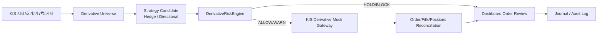

# 선물옵션 모의주문 확장 시나리오

작성일: 2026-06-23
상위 문서: `최종_프로젝트_명세서.md`, `API_명세서.md`
상세 API 문서: `선물옵션_모의주문_확장_시나리오_API_명세서.md`
범위: P1 전체 기능을 전제로 추가되는 P2 국내선물옵션 주간 KIS Mock 주문 확장

> 구현 상태: 이 문서는 v1/P1 구현 범위가 아니라 후속 P2 확장안이다. 현재 구현과 중간보고서 시연은 국내주식/금 ETF·ETN, KIS Mock, RiskEngine, RAG, Dashboard 흐름을 우선한다.

---

## 1. P2의 위치와 P1 상속 범위

이 문서는 P1 핵심 자동매매 범위인 국내주식/금 ETF·ETN 이후에 추가되는 `국내선물옵션 주간 모의 주문` 확장 설계를 고정한다. P2는 P1을 대체하지 않는다. P1의 데이터, RAG, 신호 생성, 백테스트, RiskEngine, KIS Mock, Dashboard, Journal, Live-ready gate를 그대로 사용하고, 그 상위에 국내선물옵션 Mock 주문 흐름을 추가한다.

핵심 결론은 다음과 같다.

1. P1 핵심 주문은 국내주식과 국내 금 ETF/ETN이다.
2. 선물/옵션은 P2 확장으로만 다룬다.
3. P2 실제 주문 실행은 KIS가 모의투자를 지원하는 `국내선물옵션 주간` API로 제한한다.
4. 야간 국내선물옵션, 해외선물옵션, 파생상품 실거래 활성화는 P2 주문 범위 밖이다.
5. Live-ready는 비활성 코드 경로와 강제 게이트만 설계하고 기본 OFF로 둔다.

### 1.1 P1에서 상속하는 기능

| 영역 | P1 기반 기능 | P2에서 사용하는 방식 |
|---|---|---|
| 데이터 수집 | KIS 가격·수급, OpenDART 공시·재무, ECOS 거시지표, Naver 뉴스, GDELT 이벤트 metadata | 국내선물옵션 후보 생성 전 시장상태, 포트폴리오 노출, 뉴스 이벤트, 거시 국면을 판단하는 입력으로 사용 |
| 가격 백필 | KIS 일봉 100건 단위 반복 백필, 3년 이상 목표, 분봉은 최근 1년 이내 보조 검증 | P2 후보의 기초 포트폴리오와 hedge 필요성을 계산하는 기준 데이터로 사용 |
| 종목군 | 국내주식 20-30종목과 금 ETF/ETN을 거래대금·유동성 기준으로 동적 선정 | P2 hedge 후보는 이 P1 포트폴리오 노출을 줄이는 방향으로 생성 가능 |
| RAG/LLM | OpenAI 기본 provider, provider adapter 유지, `bge-m3` embedding, reranker 고도화, citationCoverage | 파생 위험 설명, 주문 차단 사유, source card 요약을 생성하되 주문 판단 자체는 RiskEngine이 수행 |
| 뉴스감성 | KR/EN FinBERT 후보 비교, 규칙 fallback, LLM은 설명 요약에만 사용 | 고변동 뉴스 이벤트와 투자심리 급변을 HOLD/BLOCK 근거에 연결 |
| 신호 모델 | 규칙 baseline, LSTM, LightGBM, HMM 국면 추정 | 방향성 후보는 여러 신호가 같은 방향일 때만 제한적으로 생성 |
| 백테스트 | 초기자본 1천만원, KIS 수수료·세금 출처 기반 config, slippage config, Baseline/Guide/Strict 비교 | P2 주문은 별도 실거래 성과로 주장하지 않고 Mock 시나리오와 risk guard 재현에 집중 |
| RiskEngine | ALLOW/WARN/HOLD/BLOCK, 손실한도, 포지션한도, 가격 stale, kill-switch, GUIDE 기본·Strict 전환 | `DerivativeRiskEngine`이 같은 판정 구조를 확장하고, 최종 승인권은 Spring Decision Platform이 유지 |
| Brokerage | INTERNAL_PAPER fallback, KIS Mock 주식/ETF·ETN 주문, fail-closed 처리 | P2는 `KIS_DERIVATIVE_MOCK`을 별도 gateway로 연동하되, P1 주문 흐름과 idempotency/audit 규칙을 따른다 |
| 내부 비동기 처리 | P1 내부 비동기 처리, async job, audit event, stream metric 구조 | P2 derivative async event는 기본 OFF로 두고, 모의 주문 확장 시 팀원 1 내부 구현에서 관리 |
| Dashboard | Model Evaluation, Backtest, Risk/Order Review, RAG Source, Report Capture | Derivative Universe, Margin Snapshot, Order Review, Mock Fill 화면을 기존 dashboard에 확장 |
| Journal/Audit | decisionId, orderId, sourceId, artifact manifest 연결 | P2는 marginSnapshotId, derivativeOrderIntent, KIS 요청 식별자, fill/position reconciliation을 추가 기록 |
| Live-ready gate | 실거래 코드는 비활성 경로로 설계, 명시 동의와 조건 없이는 활성화하지 않음 | 국내선물옵션 실거래도 기본 OFF이며 모의성과·자격·동의·증거금 조건 없이는 열지 않음 |

### 1.2 P2에서 추가되는 것

| 추가 영역 | 설명 |
|---|---|
| 국내선물옵션 universe | KIS 지원 국내선물옵션 전체를 발견하되 상품군 allowlist와 kill-switch로 주문 후보를 제한 |
| 시세/호가/기간별시세 | 주간 Mock 주문 판단용 quote, spread, stale 여부, 유동성 판단 |
| 주문가능·증거금 snapshot | 주문 전 `inquire-psbl-order`, 잔고현황, 내부 margin buffer를 같은 audit trace에 저장 |
| 주문/정정취소/체결조회/잔고조회 | KIS 주간 Mock API만 사용해 제출, 정정취소, fills, positions를 재조정 |
| 옵션 매도 guard | 증거금조회, max 계약수, margin buffer, 2단계 확인 없이는 BLOCK |
| Dashboard 확장 | Derivative Order Review, Option Short Confirmation, Mock Order/Fills, Report Capture |
| 테스트 확장 | 주문가능 실패, 증거금 부족, market order 제한, kill-switch, stale data, adapter 장애를 fail-closed로 검증 |

---

## 2. 근거 자료

### 2.1 한국투자증권 공식 페이지

| 근거 | 확인 내용 | 설계 반영 |
|---|---|---|
| 한국투자증권 모의투자 안내 | 공식 메뉴에 `주식/선물옵션 모의투자`, `국내 선물옵션 모의거래 이수`, `거래조회/확인서 발급` 항목이 존재 | 파생상품은 실제 투자 전 모의·교육·확인 흐름을 전제로 설계 |
| 한국투자증권 수수료 안내 | 국내주식, ETF/ETN, 주간 국내선물, 주간 국내옵션, 유관기관 제비용, 세금 변경 가능성이 확인됨 | 비용은 하드코딩하지 않고 config와 source manifest로 관리 |

### 2.2 KIS OpenAPI XLSX 확인

로컬 `한국투자증권_오픈API_전체문서_20260504_030007.xlsx`의 `API 목록` 기준으로 P2에서 사용할 기능군은 다음으로 고정한다. 정확한 endpoint, KIS 요청 식별자 매핑, 지원 경계는 `선물옵션_모의주문_확장_시나리오_API_명세서.md`에만 둔다.

| 기능 | 용도 | P2 판단 |
|---|---|---|
| 선물옵션 시세 | 현재가와 stale 여부 확인 | 사용 |
| 선물옵션 시세호가 | bid/ask spread와 유동성 guard | 사용 |
| 선물옵션 기간별시세 | 최근 가격 흐름과 변동성 보조 판단 | 사용 |
| 선물옵션 주문 | 주간 KIS Mock 주문 제출 | 사용 |
| 선물옵션 정정취소 | 미체결 주문 정정/취소 | 사용 |
| 선물옵션 주문가능 | 주문가능수량과 주문가능금액 guard | 필수 |
| 선물옵션 주문체결내역조회 | fill reconciliation | 사용 |
| 선물옵션 잔고현황 | position reconciliation | 사용 |
| 선물옵션 실시간체결통보 | 주문 이벤트 스트림 | 사용 |

### 2.3 open-trading-api 예제 확인

`open-trading-api/examples_user/domestic_futureoption/domestic_futureoption_functions.py`에서 다음 함수와 파라미터를 확인했다.

| 예제 함수 | 의미 | 설계 반영 |
|---|---|---|
| `inquire_balance` | 선물옵션 잔고현황, 최대 20건과 연속조회 | position reconciliation |
| `inquire_psbl_order` | 선물옵션 주문가능, 주문가능수량 확인 | 주문 전 필수 guard |
| `order` | 선물옵션 주문, `sll_buy_dvsn_cd`, `ord_qty`, `unit_price`, `ord_dvsn_cd` 사용 | Derivative Mock OrderGateway |
| `order_rvsecncl` | 선물옵션 정정취소, 체결된 건은 정정/취소 불가 | cancel/modify API |

`examples_llm/domestic_futureoption`의 체크 파일에서 `ord_psbl_cash`, `ord_psbl_tota`, `add_mgna_tota`, `tot_psbl_qty`, `lqd_psbl_qty1`, `ord_psbl_qty` 같은 필드가 확인되므로, P2에서는 주문 직전 `marginSnapshot`을 생성하고 이 값을 audit log에 남긴다.

---

## 3. 아키텍처

원칙:

1. 후보 생성은 주문 실행이 아니다.
2. 모든 파생 후보는 Spring `RiskEngine`의 `DerivativeRiskEngine` 확장을 먼저 통과한다.
3. Python KIS Adapter는 실행 어댑터이고, 주문 최종 승인권은 Spring Decision Platform에 있다.
4. 모든 주문에는 `decisionId`, `marginSnapshotId`, `orderIntent`, `riskDecision`, `kisTrId`, `requestId`, `idempotencyKey`를 남긴다.

### 3.1 P2 내부 비동기 처리 확장 위치

P2 비동기 이벤트 확장은 P1의 내부 비동기 처리 구조를 상속한다. 실제 이벤트 형식, 재처리, 중복 처리 규칙은 팀원 1 상세 구현명세서에서 관리한다. 선물옵션 이벤트 발행은 기본 OFF이며, P2 모의 주문 확장 기능을 켰을 때만 활성화한다.

| Event | 의미 | 기본 상태 |
|---|---|---|
| `derivative.margin-snapshot-created.v1` | 주문가능/증거금 snapshot 생성 | OFF |
| `derivative.risk-decision-created.v1` | 파생 주문 후보 RiskEngine 평가 결과 | OFF |
| `derivative.order-event-created.v1` | KIS Derivative Mock 주문/정정취소/체결 이벤트 | OFF |
| `derivative.position-updated.v1` | 잔고현황 reconciliation 결과 | OFF |
| `derivative.live-readiness-evaluated.v1` | 파생 Live-ready gate 평가 결과 | OFF |

P2 async event payload도 P1과 동일하게 reference-only 원칙을 따른다. raw KIS 응답, 계좌 token, API key, 개인정보, 원문 뉴스는 싣지 않고, `marginSnapshotId`, `decisionId`, `orderId`, `positionSnapshotId`, hash만 전달한다.

---

## 4. 상품 범위

### 4.1 Universe 발견

P2는 KIS가 지원하는 국내선물옵션 전체를 발견 대상으로 둔다. 다만 실제 주문 후보는 다음 gate로 제한한다.

| Gate | 설명 |
|---|---|
| 상품군 allowlist | KOSPI200, 미니KOSPI200, KOSDAQ150, 개별주식/ETF, 금·통화·금리·실물 등 상품군별 허용 |
| 상품별 kill-switch | 특정 상품의 모든 신규 주문 중지 |
| 세션 gate | `DAY`만 허용. 야간 주문은 차단 |
| 계좌/모의 gate | KIS Mock 계정과 허용된 모의 API 설정이 없으면 차단 |
| 유동성 gate | 호가 spread, 최근 거래량/거래대금, 시세 stale 여부 확인 |

### 4.2 주문 허용 범위

| 상품 | Mock 허용 | 조건 |
|---|---:|---|
| 국내선물 long/short | 예 | max 계약수, 손실한도, 주문가능조회 통과 |
| 국내옵션 call/put 매수 | 예 | DTE, 유동성, max premium, 손실한도 통과 |
| 국내옵션 call/put 매도 | 예 | 주문가능조회, 증거금 snapshot, margin buffer, max 계약수, 2단계 확인 통과 |
| ELW | P1 주문 대상 제외 | P2 주문 대상 제외 |
| 해외선물옵션 | 아니오 | 별도 확장 범위 |

---

## 5. 전략 시나리오

### 5.1 헤지 전략

| 시나리오 | 후보 |
|---|---|
| 국내주식 포트폴리오가 시장 beta에 과다 노출 | KOSPI200 선물 매도 후보 |
| 금 ETF/ETN 보유 중 변동성 급등 | 관련 상품군 hedge 후보 또는 신규 주문 HOLD |
| HMM이 고변동/RISK_OFF 국면 | 신규 매수 축소, 보호적 put 매수 후보 |
| 손실한도 접근 | 신규 진입 금지, 기존 위험 노출 감소 주문만 허용 |

### 5.2 방향성 전략

| 시나리오 | 후보 |
|---|---|
| LSTM/LightGBM/규칙 baseline이 같은 방향 | 제한된 계약수의 선물 long/short 후보 |
| 변동성 확대와 명확한 방향성 | call/put 매수 후보 |
| range breakout 실패 또는 평균회귀 신호 | 신규 주문 HOLD 또는 더 작은 계약수 후보 |
| 옵션 매도 전략 | Mock에서만 허용. margin guard와 2단계 확인 없으면 BLOCK |

모든 방향성 후보는 take-profit, stop-loss, time-limit, max holding period를 함께 가진다. 진입 조건만 있고 청산 조건이 없는 후보는 생성하지 않는다.

---

## 6. RiskEngine 확장

### 6.1 필수 Guard

| Guard | BLOCK/HOLD 조건 |
|---|---|
| Product Allowlist Guard | 상품군이 allowlist에 없으면 BLOCK |
| Product Kill Switch | 상품별 kill-switch가 켜져 있으면 BLOCK |
| Session Guard | DAY 세션이 아니면 BLOCK |
| Orderable Quantity Guard | KIS 주문가능조회 실패 또는 주문가능수량 부족 시 BLOCK |
| Margin Buffer Guard | 증거금 추정치 + buffer가 주문가능총액을 넘으면 BLOCK |
| Max Contracts Guard | 상품군/전략별 max 계약수 초과 시 BLOCK |
| Option Short Guard | 옵션 매도인데 2단계 확인이 없으면 BLOCK |
| Market Order Guard | 시장가가 청산/위험감소 주문이 아니면 BLOCK |
| DTE Guard | 만기 임박 또는 DTE 정책 위반 시 BLOCK/HOLD |
| Liquidity/Spread Guard | 호가 spread 과다 또는 유동성 부족 시 HOLD/BLOCK |
| Data Freshness Guard | 시세/호가/Greeks/IV snapshot stale 시 HOLD |
| Daily Loss/MDD Guard | 손실한도 초과 시 신규 주문 BLOCK |
| Cooldown Guard | 연속 손실 또는 과매매 후 일정 시간 신규 주문 BLOCK |

### 6.2 옵션 매도 전용 조건

옵션 매도는 Mock에서도 다음 순서를 모두 통과해야 한다.

1. 상품군 allowlist 통과.
2. KIS 주문가능조회 성공.
3. `ord_psbl_qty` 또는 대응 가능한 주문가능수량 확인.
4. 내부 margin estimate 산출.
5. margin buffer 통과.
6. max 계약수 통과.
7. 손실한도와 MDD guard 통과.
8. 사용자의 옵션 매도 1차 위험 확인.
9. 사용자의 옵션 매도 2차 제출 확인.
10. idempotency key와 audit log 기록.

---

## 7. API 계약 요약

상세 schema와 KIS 요청 식별자 매핑은 `선물옵션_모의주문_확장_시나리오_API_명세서.md`에 둔다.

| API | 역할 |
|---|---|
| `GET /api/v1/derivatives/universe` | KIS 지원 국내선물옵션 universe 조회와 allowlist 상태 |
| `POST /api/v1/derivatives/order-candidates` | hedge/directional 후보 생성 |
| `POST /api/v1/derivatives/margin-snapshots` | 주문 직전 주문가능/증거금 snapshot 생성 |
| `POST /api/v1/decisions/evaluate-order` | 파생 주문 후보 RiskEngine 평가 |
| `POST /api/v1/derivatives/mock/orders` | P2 주간 KIS Mock 주문 제출 |
| `POST /api/v1/derivatives/mock/orders/{orderId}/cancel-or-modify` | 정정취소 |
| `GET /api/v1/derivatives/mock/accounts/{accountId}/positions` | 잔고현황 |
| `GET /api/v1/derivatives/mock/accounts/{accountId}/fills` | 체결조회 |
| `GET /api/v1/derivatives/live-readiness` | 파생 Live-ready 비활성 gate |

---

## 8. Dashboard 화면

| 화면 | 필수 표시 |
|---|---|
| Derivative Universe | 상품군, 만기, 행사가, 콜/풋, allowlist, kill-switch, 유동성 |
| Derivative Order Candidate | hedge/directional 구분, 계약수, 주문유형, 예상 노출, 청산 조건 |
| Risk/Derivative Order Review | ALLOW/WARN/HOLD/BLOCK, margin snapshot, max 계약수, DTE, Greeks/IV |
| Option Short Confirmation | 옵션 매도 전용 2단계 확인, margin buffer, 최대손실 설명 |
| Mock Order/Fills | KIS 요청 식별자, 주문번호, 체결상태, 정정취소 결과 |
| Report Capture | P2 시나리오와 테스트 결과 캡처 |

---

## 9. 테스트 시나리오

| 테스트 | 기대 결과 |
|---|---|
| 상품군 allowlist 밖 주문 | `DERIVATIVE_GATE_CLOSED` |
| 상품별 kill-switch 활성 | `RISK_BLOCKED` |
| 야간 세션 주문 | `DERIVATIVE_GATE_CLOSED` |
| 주문가능조회 실패 | `MARGIN_GUARD_FAILED` |
| 주문가능수량 부족 | `MARGIN_GUARD_FAILED` |
| 옵션 매도 margin buffer 부족 | `MARGIN_GUARD_FAILED` |
| max 계약수 초과 | `RISK_BLOCKED` |
| 옵션 매도 2단계 확인 누락 | `RISK_BLOCKED` |
| 시장가 신규 진입 | `RISK_BLOCKED` |
| 시장가 위험감소 주문 | guard 통과 시 허용 |
| 시세/호가 stale | `DATA_STALE`, `HOLD` |
| 체결 후 정정취소 | KIS 응답 기준 정정/취소 불가 처리 |
| KIS Adapter 장애 | `BROKERAGE_UNAVAILABLE`, 주문 보류 |

---

## 10. 구현 단계

| 단계 | 내용 |
|---|---|
| P2.0 | KIS XLSX/API 근거 정리, schema 초안, dashboard wireframe |
| P2.1 | universe/시세/호가/기간별시세 조회와 margin snapshot |
| P2.2 | DerivativeRiskEngine guard와 order candidate 생성 |
| P2.3 | KIS_DERIVATIVE_MOCK 주문/정정취소/체결조회/잔고조회 |
| P2.4 | Dashboard Risk/Derivative Order Review와 Report Capture |
| P2.5 | Live-ready 비활성 gate와 audit log 완성 |

수용 기준:

1. P2 주문은 KIS Mock day-session API만 사용한다.
2. 옵션 매도는 2단계 확인 없이 절대 제출되지 않는다.
3. 시장가는 위험감소 주문 외에는 차단된다.
4. 주문가능조회, margin snapshot, risk decision, KIS 응답이 같은 audit trace에 연결된다.
5. Dashboard에서 왜 ALLOW/WARN/HOLD/BLOCK이 나왔는지 1분 안에 설명 가능해야 한다.

---

## 11. 비교 사례

| 사례 | 확인한 구조 | 프로젝트 반영 |
|---|---|---|
| QuantConnect LEAN Risk Management | Portfolio Construction이 만든 target이 Execution에 가기 전 Risk Management model에서 조정됨 | `전략 후보 -> DerivativeRiskEngine -> KIS Mock Gateway` 순서로 고정 |
| Freqtrade Protections | Cooldown, MaxDrawdown, StoplossGuard가 종목 또는 전체 거래를 잠글 수 있음 | cooldown, daily loss, MDD, repeated loss guard를 파생상품에도 적용 |
| Hummingbot PositionExecutor | stop loss, take profit, time limit, trailing stop 기반으로 포지션을 관리 | 파생 주문 후보는 진입 조건과 청산 조건을 항상 함께 생성 |

---

## 12. 참고 링크

- [한국투자증권 모의투자 안내](https://securities.koreainvestment.com/main/research/virtual/_static/TF07da010000.jsp)
- [한국투자증권 수수료 안내](https://securities.koreainvestment.com/main/customer/guide/_static/TF04ae010000.jsp)
- 로컬 KIS XLSX: `한국투자증권_오픈API_전체문서_20260504_030007.xlsx`
- 로컬 예제: `open-trading-api/examples_user/domestic_futureoption/domestic_futureoption_functions.py`
- [QuantConnect Risk Management Key Concepts](https://www.quantconnect.com/docs/v2/writing-algorithms/algorithm-framework/risk-management/key-concepts)
- [Freqtrade Protections](https://www.freqtrade.io/en/stable/plugins/)
- [Hummingbot Position Executor](https://hummingbot.org/strategies/v2-strategies/executors/positionexecutor/)
