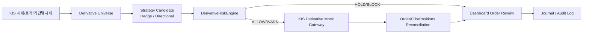

# 선물옵션 모의주문 확장 시나리오

작성일: 2026-06-23
모델 위험·근거 검토일: 2026-07-17
상위 문서: `최종_프로젝트_명세서.md`, `API_명세서.md`
상세 API 문서: `선물옵션_모의주문_확장_시나리오_API_명세서.md`
범위: P1 전체 기능을 전제로 추가되는 P2 국내선물옵션 주간 KIS Mock 주문 확장(default OFF)

> 구현 상태: 이 문서는 v1/P1 구현 범위가 아니라 후속 P2 확장안이다. 현재 구현과 중간보고서 시연은 국내주식/금 ETF·ETN, KIS Mock, RiskEngine, RAG, Dashboard 흐름을 우선한다. S1.1에서는 파생 주문을 구현하지 않고, KIS catalog상 지원되는 읽기 전용 시세 API만 후속 planning/source card 후보로 분리한다.

---

## 1. P2의 위치와 P1 상속 범위

이 문서는 P1 핵심 자동매매 범위인 국내주식/금 ETF·ETN 이후에 추가되는 `국내선물옵션 주간 모의 주문` 확장 설계를 고정한다. P2는 P1을 대체하지 않는다. P1의 데이터, RAG, 신호 생성, 백테스트, RiskEngine, KIS Mock, Dashboard, Journal, Live-ready gate를 그대로 사용하고, 그 상위에 국내선물옵션 Mock 주문 흐름을 추가한다.

핵심 결론은 다음과 같다.

1. P1 핵심 주문은 국내주식과 국내 금 ETF/ETN이다.
2. 선물/옵션은 P2 확장으로만 다룬다.
3. P2 실제 주문 실행은 KIS가 모의투자를 지원하는 `국내선물옵션 주간` API로 제한한다.
4. 야간 국내선물옵션, 해외선물옵션, 파생상품 실거래 활성화는 P2 주문 범위 밖이다.
5. Live-ready는 비활성 코드 경로와 강제 게이트만 설계하고 기본 OFF로 둔다.

### 1.1 P1에서 상속하는 기능

| 영역 | P1 기반 기능 | P2에서 사용하는 방식 |
|---|---|---|
| 데이터 수집 | KIS 가격·수급, OpenDART 공시·재무, ECOS 거시지표, Naver 뉴스 metadata, optional GDELT secondary enrichment | 국내선물옵션 후보 생성 전 시장상태, 포트폴리오 노출, 뉴스 이벤트, 거시 국면을 판단하는 입력으로 사용 |
| 가격 백필 | KIS 일봉 100건 단위 반복 백필, 3년 이상 목표, 분봉은 최근 1년 이내 보조 검증 | P2 후보의 기초 포트폴리오와 hedge 필요성을 계산하는 기준 데이터로 사용 |
| 종목군 | 국내주식 20-30종목과 금 ETF/ETN을 거래대금·유동성 기준으로 동적 선정 | P2 hedge 후보는 이 P1 포트폴리오 노출을 줄이는 방향으로 생성 가능 |
| RAG/LLM | OpenAI 기본 provider, provider adapter 유지, `bge-m3` embedding, reranker 고도화, citationCoverage | 파생 위험 설명, 주문 차단 사유, source card 요약을 생성하되 주문 판단 자체는 RiskEngine이 수행 |
| 뉴스감성 | KR/EN FinBERT 후보 비교, 규칙 fallback, LLM은 설명 요약에만 사용 | 고변동 뉴스 이벤트와 투자심리 급변을 HOLD/BLOCK 근거에 연결 |
| 신호 모델 | 규칙 baseline, LSTM, LightGBM, HMM 국면 추정 | 방향성 후보는 여러 신호가 같은 방향일 때만 제한적으로 생성 |
| 백테스트 | 초기자본 1천만원, KIS 수수료·세금 출처 기반 config, slippage config, Baseline/Guide/Strict 비교 | P2 주문은 별도 실거래 성과로 주장하지 않고 Mock 시나리오와 risk guard 재현에 집중 |
| RiskEngine | ALLOW/WARN/HOLD/BLOCK, 손실한도, 포지션한도, 가격 stale, kill-switch, GUIDE 기본·Strict 전환 | `DerivativeRiskEngine`이 같은 판정 구조를 확장하고, 최종 승인권은 Spring Decision Platform이 유지 |
| Brokerage | 사용자 명시 선택형 INTERNAL_PAPER 비상 모드(자동 전환 금지), KIS Mock 주식/ETF·ETN 주문, fail-closed 처리 | P2는 `KIS_DERIVATIVE_MOCK`을 별도 gateway로 연동하되, P1 주문 흐름과 idempotency/audit 규칙을 따른다 |
| 내부 비동기 처리 | P1 내부 비동기 처리, async job, audit event, stream metric 구조 | P2 derivative async event는 기본 OFF로 두고, 모의 주문 확장 시 팀원 1 내부 구현에서 관리 |
| Dashboard | Model Evaluation, Backtest, Risk/Order Review, RAG Source, Report Capture | Derivative Universe, Margin Snapshot, Order Review, Mock Fill 화면을 기존 dashboard에 확장 |
| Journal/Audit | decisionId, orderId, sourceId, artifact manifest 연결 | P2는 margin/exposure/stress snapshot, derivativeOrderIntent, optional valuation/regime evidence ref, KIS 요청 식별자, fill/position reconciliation을 추가 기록 |
| Live-ready gate | 실거래 코드는 비활성 경로로 설계, 명시 동의와 조건 없이는 활성화하지 않음 | 국내선물옵션 실거래도 기본 OFF이며 모의성과·자격·동의·증거금 조건 없이는 열지 않음 |

### 1.2 P2에서 추가되는 것

| 추가 영역 | 설명 |
|---|---|
| 국내선물옵션 universe | KIS 지원 국내선물옵션 전체를 발견하되 상품군 allowlist와 kill-switch로 주문 후보를 제한 |
| 시세/호가/기간별시세 | 주간 Mock 주문 판단용 quote, spread, stale 여부, 유동성 판단 |
| 주문가능·증거금 snapshot | 주문 전 `inquire-psbl-order`, 잔고현황, 내부 margin buffer를 같은 audit trace에 저장 |
| 주문/정정취소/체결조회/잔고조회 | KIS 주간 Mock API만 사용해 제출, 정정취소, fills, positions를 재조정 |
| post-trade naked short call 노출 생성·증가 guard | 증거금조회, max 계약수, margin buffer, 단계별 2단계 확인 없이는 BLOCK |
| Dashboard 확장 | Derivative Order Review, Option Short Confirmation, Mock Order/Fills, Report Capture |
| 테스트 확장 | 주문가능 실패, 증거금 부족, market order 제한, kill-switch, stale data, adapter 장애를 fail-closed로 검증 |

---

## 2. 근거 자료

### 2.1 한국투자증권 공식 페이지

| 근거 | 확인 내용 | 설계 반영 |
|---|---|---|
| 한국투자증권 모의투자 안내 | 공식 메뉴에 `주식/선물옵션 모의투자`, `국내 선물옵션 모의거래 이수`, `거래조회/확인서 발급` 항목이 존재 | 파생상품은 실제 투자 전 모의·교육·확인 흐름을 전제로 설계 |
| 한국투자증권 수수료 안내 | 국내주식, ETF/ETN, 주간 국내선물, 주간 국내옵션, 유관기관 제비용, 세금 변경 가능성이 확인됨 | 비용은 하드코딩하지 않고 config와 source manifest로 관리 |

### 2.2 KIS OpenAPI XLSX 확인

로컬 `한국투자증권_오픈API_전체문서_20260707_030000.xlsx`의 `API 목록` 기준으로 P2에서 사용할
기능군을 catalog한다. 전체 catalog는 338개 API(REST 278개, WebSocket 60개)다. XLSX는
공식 raw catalog이지만 모의 지원 경계의 단독 SSOT로 두지 않는다. `모의 TR_ID`,
`모의 Domain`, KIS 공식 상세 문서와 공식 sample을 교차 확인하고 불일치는 private errata에서
해결한다. 정확한 endpoint, KIS 요청 식별자 매핑, 지원 경계는
`선물옵션_모의주문_확장_시나리오_API_명세서.md`에만 둔다.

| 기능 | 용도 | P2 판단 |
|---|---|---|
| 선물옵션 시세 | 현재가와 stale 여부 확인 | 사용 |
| 선물옵션 시세호가 | bid/ask spread와 유동성 guard | 사용 |
| 선물옵션 기간별시세 | 최근 가격 흐름과 변동성 보조 판단 | 사용 |
| 선물옵션 주문 | 주간 KIS Mock 주문 제출 | 사용 |
| 선물옵션 정정취소 | 미체결 주문 정정/취소 | exact provider field/수량 semantics 검증 전 `CANDIDATE_UNVERIFIED` |
| 선물옵션 주문가능 | 주문가능수량과 주문가능금액 guard | 필수 |
| 선물옵션 주문체결내역조회 | fill reconciliation | 사용 |
| 선물옵션 잔고현황 | position reconciliation | 사용 |
| 선물옵션 실시간체결통보 | 주문 이벤트 스트림 | 사용 |

S1.1 KIS market-data 세션에서는 위 파생 API를 구현하지 않는다. 파생 시세/호가/기간별시세는 P2 설계와 RAG source card 후보로만 cataloging하고, 주문·정정취소·잔고·증거금 API는 P2 feature flag와 Mock gate가 준비될 때까지 default OFF다.

P2가 열려도 별도 KIS quota를 만들지 않는다. 최종 명세서 12.4.1의 중앙 account/appkey+mode coordinator를 P1과 공유하며 모의 REST는 현재가·호가·주문가능·주문·체결/잔고 대사를 모두 합쳐 1초당 1건이다. 주문/대사를 backfill보다 우선하는 bounded queue를 사용하고 주문·정정·취소는 자동 재시도하지 않는다.

### 2.3 open-trading-api 예제 확인

`open-trading-api/examples_user/domestic_futureoption/domestic_futureoption_functions.py`에서 다음 함수와 파라미터를 확인했다.

| 예제 함수 | 의미 | 설계 반영 |
|---|---|---|
| `inquire_balance` | 선물옵션 잔고현황, 최대 20건과 연속조회 | position reconciliation |
| `inquire_psbl_order` | 선물옵션 주문가능, 주문가능수량 확인 | 주문 전 필수 guard |
| `order` | 선물옵션 주문, `sll_buy_dvsn_cd`, `ord_qty`, `unit_price`, `ord_dvsn_cd` 사용 | Derivative Mock OrderGateway |
| `order_rvsecncl` | 선물옵션 정정취소, 체결된 건은 정정/취소 불가 | cancel/modify API |

`examples_llm/domestic_futureoption`의 체크 파일에서 `ord_psbl_cash`, `ord_psbl_tota`, `add_mgna_tota`, `tot_psbl_qty`, `lqd_psbl_qty1`, `ord_psbl_qty` 같은 필드가 확인되므로, P2에서는 주문 직전 `marginSnapshot`을 생성하고 이 값을 audit log에 남긴다.

### 2.4 교육 자료와 수학·사건 근거의 채택 경계

사용자가 제공한 Veritasium 한국어 학습 Markdown은 옵션, 확률과정, 동적 헤지, BSM, HMM을
연결해 이해하는 데 유용한 `SECONDARY_EDUCATIONAL` 자료다. 그러나 영상의 쉬운 설명과 역사적
서사는 수치 oracle, API 계약, 특정 사건의 단독 원인 또는 주문 정책의 직접 근거가 아니다.
P2에 채택하는 것은 아래 설계 관점이며, 정확한 수식·시장 관측·위험 주장은 원전 또는 공식
보고서로 다시 확인한다.

| 교육 자료의 관점 | P2에 채택하는 설계 | 그대로 채택하지 않는 해석 |
|---|---|---|
| 옵션은 의무가 아닌 권리이고 premium으로 손실 구조를 바꾼다 | call/put, exercise style, premium cashflow, assignment, 만기 payoff와 포지션별 손실 구조를 명시 | 모든 옵션의 최대손실이 premium으로 제한된다는 일반화. 이는 옵션 매수자에게만 해당 |
| 경로를 맞히기보다 결과 분포와 위험을 다룬다 | point forecast와 확률분포, stochastic scenario, deterministic stress를 분리 | 정규성·IID·일정 변동성이 현실에서 자동으로 성립한다는 주장 |
| 가능한 payoff와 확률을 함께 보아 기대값을 생각한다 | 기대 payoff는 명시한 측도·할인·모형 가정에 의존하는 평균이며 단일 경로의 보장값이 아님을 표시 | 실제분포 `P`의 예측 기대값과 위험중립 `Q`의 무차익 가격을 같은 값으로 교환 |
| 동적 헤지는 노출을 조정한다 | delta-equivalent exposure와 hedge candidate를 계산 | 연속 재조정으로 실제 위험이 완전히 제거된다는 주장 |
| BSM은 복제·무차익 가격결정 논리를 제공한다 | European q 포함 이론가, Greeks, IV를 `Q` 측도 설명 근거로 사용 | `N(d1)`·`N(d2)`를 실제 상승확률로 보거나 BSM 값을 방향 신호로 사용 |
| 패턴은 사용·경쟁으로 약해질 수 있다 | calibration drift, alpha decay, capacity, crowding을 후보 생성 gate에 포함 | 발견된 패턴이 영구적이거나 공개 즉시 항상 사라진다는 단정 |
| HMM은 관측값으로 잠재 상태를 추정한다 | prefix-only causal posterior와 불확실성/abstention을 WARN 보조로 사용 | latent label을 시장의 실제 원인·확정 상태로 취급 |
| 물리·금융·AI에 diffusion이라는 연결이 있다 | RAG의 개념 비교 카드에서만 비유로 설명 | 금융 Brownian/GBM과 학습된 AI reverse denoising을 동일 모델로 취급 |

다음 사실은 특별히 분리한다.

1. GME는 옵션 레버리지·시장구조의 교육 사례일 수 있지만, SEC 직원 보고서가 2021년 1월
   GME에서 gamma squeeze 증거를 찾지 못했으므로 단일 원인 사례로 사용하지 않는다.
2. 파생상품의 `notional`은 계약 지급액의 기준이자 시장 규모 지표다. `gross market value`,
   `gross credit exposure`, premium, margin, delta-equivalent exposure, stress loss와 같지 않다.
3. Newton, Thorp, Simons의 일화와 공개된 성과 숫자는 P2 주문 계약의 검증 근거가 아니다.
4. 교육 자료에 없는 q 포함식, 무차익 경계, causal HMM filter, 수치 수렴 기준은 외부
   원전·공식 문서로 보강한 설계이며 attachment-derived claim으로 표시하지 않는다.

---

## 3. 아키텍처



원칙:

1. 후보 생성은 주문 실행이 아니다.
2. 모든 파생 후보는 Spring `RiskEngine`의 `DerivativeRiskEngine` 확장을 먼저 통과한다.
3. Python KIS Adapter는 실행 어댑터이고, 주문 최종 승인권은 Spring Decision Platform에 있다.
4. 모든 주문에는 `decisionId`, `marginSnapshotId`, `exposureSnapshotId`, `stressSnapshotId`, `orderIntent`, `riskDecision`, `kisTrId`, `requestId`, idempotency key의 hash, sanitized provider receipt/hash를 남긴다. 생성된 `valuationSnapshotId`는 optional WARN-evidence reference로만 연결한다. idempotency key 원문과 provider raw 응답은 남기지 않는다.
5. P1/P2의 KIS REST와 WebSocket은 appkey scope별 shared coordinator가 소유한다. P2 adapter가 client-local limiter나 두 번째 WebSocket session을 만들지 않는다.

### 3.1 P2 내부 비동기 처리 확장 위치

P2 비동기 이벤트 확장은 P1의 내부 비동기 처리 구조를 상속한다. 실제 이벤트 형식, 재처리, 중복 처리 규칙은 공개 계약 밖의 Decision Platform 내부 구현 기록에서 관리한다. 선물옵션 이벤트 발행은 기본 OFF이며, P2 모의 주문 확장 기능을 켰을 때만 활성화한다.

| Event | 의미 | 기본 상태 |
|---|---|---|
| `derivative.margin-snapshot-created.v1` | 주문가능/증거금 snapshot 생성 | OFF |
| `derivative.risk-decision-created.v1` | 파생 주문 후보 RiskEngine 평가 결과 | OFF |
| `derivative.order-event-created.v1` | KIS Derivative Mock 주문/정정취소/체결 이벤트 | OFF |
| `derivative.position-updated.v1` | 잔고현황 reconciliation 결과 | OFF |
| `derivative.live-readiness-evaluated.v1` | 파생 Live-ready gate 평가 결과 | OFF |

P2 async event payload도 P1과 동일하게 reference-only 원칙을 따른다. raw KIS 응답, 계좌 token, API key, provider 계좌번호, 개인정보, 원문 뉴스는 싣지 않고, `marginSnapshotId`, `exposureSnapshotId`, `stressSnapshotId`, `decisionId`, `orderId`, `positionSnapshotId`, optional valuation/regime evidence ref, allowlisted normalized field, sanitized receipt/hash만 전달한다.

### 3.2 모델 산출물·헤지 해석 계약

P2는 순수 계산 함수가 맞게 실행되는 것과 그 모델이 현실 시장에서 유효한 것을 같은
판정으로 보지 않는다.

```text
시장·계약·포지션 snapshot
        |
        v
계산 정확성 ---------- 공식·부호·단위·finite·독립 oracle
        |
        v
통계적 유효성 -------- 표본·OOS·calibration·불확실성·drift
        |
        v
경제/운영 유효성 ----- 비용·spread·유동성·레버리지·margin·stress
        |
        v
RiskEngine deterministic guard + 사람 확인
        |
        v
KIS_DERIVATIVE_MOCK
```

| 산출물 | 측도/의미 | 주문 권한 |
|---|---|---|
| VaR/CVaR/MDD·실현 변동성 | 과거 관측 기반 기술통계 | 정의·freshness가 유효할 때 deterministic threshold 입력 가능 |
| LightGBM calibrated probability | 실제분포 `P`의 제한된 예측 추정 | OOS/calibration 통과 후에도 보조 signal·WARN만 가능 |
| HMM causal posterior | `x_1..x_t`만 사용한 통계적 latent-state posterior | `maxPosterior>=0.65`가 v1 운영 gate이고 entropy는 secondary diagnostic. 통과 후에도 WARN만 가능하며 단독 ALLOW/HOLD/BLOCK 금지 |
| BSM/Greeks/IV | 위험중립 `Q` 아래 European 이론가·민감도 | `tau`는 expiry까지 `ACT/365F`, Theta는 calendar-time `-dV/dtau`. 설명·valuation WARN만 가능하며 실제 방향확률이나 주문 신호가 아님 |
| GBM Monte Carlo | 명시한 `P` 가정 아래 stochastic scenario | 경로 수렴·MC error를 함께 표시하는 설명·WARN |
| deterministic stress | gap, vol, spread, leverage, margin 충격의 조건부 손실 | 발생확률을 붙이지 않으며 hard loss/margin policy의 입력 가능 |

기대값은 항상 `measure=P|Q`, discounting, horizon, estimator/model과 함께 기록한다.
`P`에서 추정한 예측 payoff 평균은 실제분포 가정 아래의 전망이고, `Q`에서 할인한 payoff
기대값은 무차익 가격결정 표현이다. 둘은 목적과 측도가 다르며 서로 대체하지 않는다.

GBM stochastic scenario는 IID Gaussian shock, lognormal diffusion, 일정 drift/volatility,
jump 부재를 가정한다. 그러므로 `10,000 paths` 같은 고정 경로 수만으로 충분성을 선언하지
않고 관심 quantile/CVaR의 Monte Carlo error와 경로 수 증가 안정성을 함께 보고한다.
historical/block bootstrap, fat-tail innovation, jump diffusion은 `RESEARCH_ONLY` 비교
estimator이며 production 확률처럼 승격하지 않는다. hard deterministic stress는
jump/gap, fat-tail proxy, volatility-cluster 구간, crisis correlation, liquidity·
spread/slippage, leverage/margin, capacity/crowding을 서로 구분한 scenario ID와
`inputHash/sourceHash`로 기록한다. 이 stress에 사후 확률을 붙이거나 stochastic forecast의
확률과 혼합하지 않는다.

각 주문 trace는 기존 ID에 더해 hard guard인 `stressSnapshotId`, `exposureSnapshotId`와,
사용 가능할 때만 WARN-only 설명 근거인 `valuationSnapshotId`, `regimeEvidenceId` 같은 typed
model evidence reference를 연결한다.
valuation/model evidence가 없다는 이유만으로 경제적 위험판단을 꾸미지는 않지만, 현재 상위
P0 success wire의 필수 HMM 필드를 채울 수 없는 경우에는 기존 schema/service-availability
실패 경로에 따라 `HOLD`한다. 이는 HMM posterior 자체가 주문을 HOLD한 것이 아니라 필수
교환 계약을 만들 수 없기 때문이다. component별 `AVAILABLE|ABSTAIN`을 success payload에
표현하려면 먼저 `contracts/changes/` 승인이 필요하다. 각 ID가 가리키는 내부 evidence에는
`outputKind`, `measure(P/Q/NOT_APPLICABLE)`, estimator, frequency/window/sample count,
`asOf`, assumptions, validation/calibration status, uncertainty, model/data/policy version,
source hash, `staleAt`을 둔다. P2 공개 API 필드로 추가하는 시점에는 별도 schema와
`contracts/changes/` 기록을 먼저 승인한다.

헤지는 미래를 맞히거나 위험을 없애는 기능이 아니다. 이 문서에서 hedge candidate는 premium과
거래비용을 지불해 특정 충격에서 손실분포 또는 delta-equivalent exposure를 줄이는 후보를 뜻한다.
실제 이산 재조정에는 gamma/vega, jump/gap, bid-ask spread, funding, liquidity, assignment,
margin call과 model misspecification 위험이 남는다.

hard exposure는 WARN-only BSM delta를 재사용하지 않는다. P2 v1 옵션의
`conservativeRiskDelta`는 contract master의 option right와 position sign으로 서버가
`CALL=+1`, `PUT=-1`의 절대상한을 정하고
`riskDeltaMethod=CONSERVATIVE_CONTRACT_BOUND_V1`과 contract source hash를 남긴다.
이 값으로 계산한 `conservativeDeltaEquivalentExposure`는 보수적 한도 guard이며,
valuation snapshot의 실제 `greeks.delta`와 별도다.

---

## 4. 상품 범위

### 4.1 Universe 발견

P2는 KIS가 지원하는 국내선물옵션 전체를 발견 대상으로 둔다. 다만 실제 주문 후보는 다음 gate로 제한한다.

| Gate | 설명 |
|---|---|
| 상품군 allowlist | discovery는 국내 상품군을 catalog할 수 있지만 v1 주문은 공식 master/spec fixture가 검증된 KOSPI200 future/option만. 나머지는 source card 승인 전 `CANDIDATE_DISABLED` |
| 상품별 kill-switch | 특정 상품의 모든 신규 주문 중지 |
| 세션 gate | `DAY`만 허용. 야간 주문은 차단 |
| 계좌/모의 gate | JWT subject 소유의 opaque 내부 accountId와 운영자 allowlist를 모두 검증한다. KIS Mock 계정과 허용된 모의 API 설정이 없으면 차단 |
| provider quota gate | 모의 1/s 공유 queue에서 주문·reconciliation 우선순위와 bounded deadline을 확보한다. quota 대기 초과는 주문 보류, INTERNAL_PAPER 자동 전환 금지 |
| 유동성 gate | 호가 spread, 최근 거래량/거래대금, 시세 stale 여부 확인 |
| 계약 명세 gate | `exerciseStyle`, `settlementType`, `contractMultiplier`, 정확한 expiry timestamp/timezone, underlying mapping이 없으면 후보 생성 중단 |
| 모델 적용 gate | BSM은 European 계약에만 적용. `tau`는 valuation 시각부터 expiry까지 `ACT/365F`로 계산하며 UI `DTE`와 교환하지 않는다. American·기타 exercise style에는 BSM 이론가를 `UNSUPPORTED`로 표시한다. 근사 가격이 필요하면 BSM 결과로 위장하지 않고 별도 estimator·모델명·가정·계약 변경을 승인한다. |
| universe/contract-master activation gate | 정확한 KIS/KRX 공식 symbol master source·operation·갱신주기·freshness가 아직 검증되지 않았으므로 `CANDIDATE_UNVERIFIED`. 검증·fixture·source hash 고정 전에는 P2 후보 생성과 주문을 모두 비활성화한다. |

### 4.2 주문 허용 범위

| 상품 | Mock 허용 | 조건 |
|---|---:|---|
| KOSPI200 선물 long/short | 조건부 예 | official master/spec/tick/session gate, max 계약수, 손실한도, 주문가능조회 통과 |
| KOSPI200 옵션 call/put 매수 | 조건부 예 | official master/spec/tick/session gate, DTE, 유동성, max premium, 손실한도 통과. 포지션 단독 최대손실은 premium+비용으로 표시 |
| KOSPI200 옵션 naked call 매도 | 조건부 예 | P2 v1에서 post-trade short 노출을 생성·증가할 수 있는 유일한 shape. official master/spec/tick/session gate, 주문가능조회, 증거금·exposure·stress snapshot, margin buffer, max 계약수, 2단계 확인 통과 |
| 국내옵션 short put·covered call·spread·multi-leg | 신규/증가 아니오 | exact leg/coverage/max-loss/reservation 계약과 fixture 승인 전 `CANDIDATE_DISABLED`. account activation 때 unsupported position 0건을 증명 |
| ELW | P1 주문 대상 제외 | P2 주문 대상 제외 |
| 해외선물옵션 | 아니오 | 별도 확장 범위 |

옵션 포지션은 `lossProfile=BOUNDED|UNBOUNDED`로 분류한다. naked short call은 이론상 손실
상한이 없으므로 `maxLossAmount=null`과 `UNBOUNDED`를 표시한다. short put, covered call,
vertical spread, 기타 multi-leg는 현재 owner-scoped leg/coverage 계약과 독립 fixture가
없으므로 v1에서 계산을 추측하지 않고 차단한다. premium, contract notional, margin과 stress
loss를 `maxLossAmount`로 대신하지 않는다.
전용 Mock account 활성화 전 unsupported 기존 position이 0건인지 완전한 잔고조회로 확인한다.
활성화 뒤 하나라도 발견되면 자동 close를 추측하지 않고 P2 write 전체를 HOLD하고 operator
incident로 전환한다. 외부에서 정리하려면 먼저 `EXCLUSIVE_APP_WRITER` attestation을 해제하고,
flat 확인 뒤 새 baseline과 attestation을 받아야 한다.

---

## 5. 전략 시나리오

### 5.1 헤지 전략

| 시나리오 | 후보 |
|---|---|
| 국내주식 포트폴리오가 시장 beta에 과다 노출 | KOSPI200 선물 매도 후보 |
| 금 ETF/ETN 보유 중 변동성 급등 | 관련 상품군 hedge 후보 또는 신규 주문 HOLD |
| causal HMM이 `RISK_OFF`이고 deterministic 변동성·노출 guard도 위험을 확인 | HMM은 WARN context만 제공. beta/exposure/loss/margin 근거로 신규 매수 축소 또는 보호적 put 후보 |
| 손실한도 접근 | 신규 진입 금지, 기존 위험 노출 감소 주문만 허용 |

### 5.2 방향성 전략

| 시나리오 | 후보 |
|---|---|
| 규칙 baseline과 OOS/calibration을 통과한 LSTM/LightGBM이 같은 방향 | 제한된 계약수의 선물 long/short 후보. 모델 합의 자체에는 주문 권한 없음 |
| 변동성 확대와 명확한 방향성 | call/put 매수 후보 |
| range breakout 실패 또는 평균회귀 신호 | 신규 주문 HOLD 또는 더 작은 계약수 후보 |
| post-trade naked short call 노출 생성·증가 | Mock에서만 허용. margin guard와 2단계 확인 없으면 BLOCK |

모든 방향성 후보는 take-profit, stop-loss, time-limit, max holding period를 함께 가진다. 진입 조건만 있고 청산 조건이 없는 후보는 생성하지 않는다.
P2 v1의 이 값들은 `GUIDE_ONLY` 화면·journal metadata이며 provider 조건부 주문이나 자동
stop을 만들지 않는다. gap/slippage 때문에 표시 가격의 체결을 보장하지 않는다. 자동 청산을
추가하려면 fresh quote/position/session을 사용하는 별도 monitor가 새 CLOSE/REDUCE
candidate→risk→confirmation→submission lifecycle과 idempotency를 거치는 계약을 먼저
승인해야 한다.
모델 기반 후보는 calibration drift, 비용 후 edge, alpha decay, capacity, crowding 중 하나라도
gate를 통과하지 못하면 `ABSTAIN`한다. raw class score나 여러 모델의 단순 다수결을
`confidence` 또는 주문 승인으로 승격하지 않는다.

---

## 6. RiskEngine 확장

### 6.1 필수 Guard

| Guard | BLOCK/HOLD 조건 |
|---|---|
| Product Allowlist Guard | 상품군이 allowlist에 없으면 BLOCK |
| Product Kill Switch | 상품별 kill-switch가 켜져 있으면 BLOCK |
| Session Guard | DAY 세션이 아니면 BLOCK |
| Orderable Quantity Guard | KIS 주문가능조회 실패 또는 주문가능수량 부족 시 BLOCK |
| Margin Buffer Guard | 증거금 추정치 + buffer가 주문가능총액을 넘으면 BLOCK |
| Max Contracts Guard | 상품군/전략별 max 계약수 초과 시 BLOCK |
| Option Short Guard | server 재구성 결과 post-trade option short 노출이 생성·증가하는데 2단계 확인이 없으면 BLOCK |
| Market Order Guard | 시장가가 청산/위험감소 주문이 아니면 BLOCK |
| DTE Guard | 만기 임박 또는 DTE 정책 위반 시 BLOCK/HOLD |
| Liquidity/Spread Guard | 호가 spread 과다 또는 유동성 부족 시 HOLD/BLOCK |
| Hard Data Freshness Guard | 시세/호가/owner position/margin/stress 입력이 stale이면 HOLD |
| Model Evidence Guard | BSM/Greeks/IV stale·가정 누락, ML calibration 실패, HMM low max-posterior/stale이면 내부 모델 evidence를 ABSTAIN+WARN. HMM entropy는 secondary diagnostic이며 모델 하나만으로 경제적 HOLD/BLOCK하지 않음. 단, 현재 required P0 success wire를 만들 수 없으면 임의 state 없이 기존 service/schema failure `HOLD` |
| Loss Profile Guard | naked/covered/spread 판별 불가, `UNBOUNDED` 미표시, leg/배수 누락이면 BLOCK |
| Deterministic Stress Guard | post-trade short 노출에 mandatory terminal gap, spread/slippage×2, leverage/margin, fat-tail proxy·volatility-cluster·crisis-correlation·liquidity/crowding hard scenario가 없거나 한도를 넘으면 HOLD/BLOCK. Q 기반 vol×2 repricing은 optional WARN-only model evidence이고 누락 자체는 hard block이 아님 |
| Daily Loss/MDD Guard | 손실한도 초과 시 신규 주문 BLOCK |
| Cooldown Guard | 연속 손실 또는 과매매 후 일정 시간 신규 주문 BLOCK |

### 6.2 post-trade naked short call 노출 생성·증가 전용 조건

여기서 “옵션 매도”는 단순 `side=SELL`이 아니라 server가 owner position과 pending order를
재구성했을 때 post-trade naked short call 노출이 생성·증가하는 주문이다. long option의
sell-to-close는 일반 submission이고, 지원 중인 naked short call의 buy-to-close는 위험감소
경로다. unsupported position은 account-level HOLD다. 이
분류를 client `positionEffect` 값으로 믿지 않는다. short 노출 생성·증가는 Mock에서도 다음
순서를 모두 통과해야 한다.

1. 상품군 allowlist 통과.
2. KIS 주문가능조회 성공.
3. `ord_psbl_qty` 또는 대응 가능한 주문가능수량 확인.
4. 내부 margin estimate 산출.
5. 현재 position과 모든 leg로 covered/naked/spread 및 `lossProfile`을 재구성한다.
6. contract notional, premium cashflow, conservative delta-equivalent exposure, margin, deterministic stress loss를 서로 다른 값으로 계산한다.
7. margin buffer와 deterministic stress 한도를 통과한다.
8. max 계약수, 손실한도와 MDD guard를 통과한다.
9. 서버가 subject/account/orderIntent/logicalAction/action-generation/decision/
   marginSnapshot/exposureSnapshot/stressSnapshot/provider-bound `canonicalActionHash`/
   시간가변 `confirmationDisclosureHash`/issuedAt에 묶인 짧은 TTL의 1차 확인 receipt를
   발급한다. 그 전에 exact canonical disclosure 전체와 immutable
   template/version/content-hash/locale,
   `confirmationPurpose=OPTION_SHORT`, `confirmationStep=1`을 담은 server-issued
   step1 `confirmationViewId`를 화면에 보내고 confirm POST의 expected hash가 current
   hash와 exact match할 때만 step1 view를 소비하고 receipt를 만든다. 사용자는 loss
   profile과 residual risk를 확인한다.
10. 1차 확인 성공 transaction은 step1 view 소비·step1 receipt 발급과 함께
    `confirmationStep=2`인 별도 view, 별도 disclosure hash와 전체 canonical disclosure를
    원자 발급한다. 사용자가 이 두 번째 화면을 확인하면 step2 POST가 step1 receipt와
    step2 view를 각각 한 번 소비하고 별도 nonce의 최종 step2 receipt를 발급한다. 같은
    view/hash를 두 단계에서 재사용하거나 boolean 두 개를 한 요청에 보내는 방식은 2단계
    확인으로 인정하지 않는다.
11. provider claim 전에 step1 receipt·decision·hard evidence가 만료되면 `EVALUATED → EXPIRED`, step2 후에는 `SUBMIT_READY → EXPIRED`를 원자 전이하고 provider 호출을 만들지 않는다. EXPIRED intent를 되살리지 않고 renew endpoint가 만든 새 DRAFT에 `supersedesOrderIntentId`로 연결해 1단계부터 다시 수행한다.
12. 유효한 step1→step2 view/receipt chain과 순서·binding을 검증한 뒤 최종 step2 receipt
    소비, decision one-use,
    `(subject, method, routeTemplate, idempotencyScopeHash)` DB unique claim,
    same-key payload 비교, owner/account/canonical-action active fence,
    `ACCOUNT_GLOBAL→PRODUCT_GROUP→STRATEGY` deterministic lock과
    `riskLedgerVersionVector` CAS, contracts·margin·exposure·stress
    reservation, `SUBMIT_READY → SUBMISSION_CLAIMED` CAS를 한 DB transaction으로 선점한다.
    Redis idempotency는 replay 조정용이며 DB authority를 대신하지 않는다.
13. claim 때 hard evidence 최소 만료시각을 `sendNotAfter`로 저장한다. quota 대기 뒤
    first-byte 직전에 deadline·active fence·attempt/risk-reservation generation뿐 아니라
    같은 DB row에서 직렬화되는 Kill Switch, product/owner/account allowlist·활성 상태,
    active principle/policy version, required hard-data freshness와 `DAY` session을 다시
    검증한다. 전용 Mock account의 `EXCLUSIVE_APP_WRITER`도 필수다.
    `physicalAttemptCount=0→1`을 DB CAS한 worker만 provider send를 최대 1회 수행하며
    deadline 초과, stale worker, 현재 safety gate 실패는 provider 호출 0건이다.
14. 명확한 접수는 `SUBMITTED`, timeout·불명확 응답은 자동 재시도 없는
    `PENDING_RECONCILIATION`, 확실한 pre-send 실패·provider reject는
    `SUBMISSION_FAILED`로 종결한다. 불완전 조회나 단순 empty 응답으로 미접수를
    확정하지 않으며, 모호한 동안 같은 action fence와 hierarchical risk reservation을 유지한다.
    자동 positive 대사는 explicit provider correlation 또는 fresh complete baseline 뒤
    exclusive-writer account에서 생긴 정확히 한 immutable-action match만 허용한다.

---

## 7. API 계약 요약

상세 schema와 KIS 요청 식별자 매핑은 `선물옵션_모의주문_확장_시나리오_API_명세서.md`에 둔다.

| API | 역할 |
|---|---|
| `GET /api/v1/derivatives/universe` | KIS 지원 국내선물옵션 universe 조회와 allowlist 상태 |
| `POST /api/v1/derivatives/order-candidates` | hedge/directional 후보 생성 |
| `POST /api/v1/derivatives/margin-snapshots` | 주문 직전 주문가능/증거금 snapshot 생성 |
| `POST /api/v1/decisions/evaluate-order` | 파생 주문 후보 RiskEngine 평가 |
| `POST /api/v1/derivatives/order-intents/{orderIntentId}/confirmation-view` | exact disclosure/template/locale에 결속된 짧은 TTL의 확인 화면 challenge 발급 |
| `POST /api/v1/derivatives/order-intents/{orderIntentId}/confirm` | 일반 submission(선물, 옵션 매수, long sell-to-close, 지원 중인 naked short call buy-to-close)의 사용자 확인과 `EVALUATED → SUBMIT_READY` one-time receipt 발급 |
| `POST /api/v1/derivatives/confirmations/option-short/{step}` | post-trade naked short call 노출 생성·증가 전용 step1/step2 확인, step2에서 `SUBMIT_READY` 원자 전이 |
| `POST /api/v1/derivatives/order-intents/{expiredOrderIntentId}/renew` | terminal EXPIRED intent의 동일 action을 새 DRAFT version으로 생성. provider 호출 없음 |
| `POST /api/v1/derivatives/mock/orders` | P2 주간 KIS Mock 주문 제출 |
| `POST /api/v1/derivatives/mock/orders/{orderId}/cancel-or-modify` | 정정취소 |
| `GET /api/v1/derivatives/mock/accounts/{accountId}/positions` | JWT subject 소유의 opaque 내부 accountId 잔고현황 |
| `GET /api/v1/derivatives/mock/accounts/{accountId}/fills` | JWT subject 소유의 opaque 내부 accountId 체결조회 |
| `GET /api/v1/derivatives/live-readiness` | 파생 Live-ready 비활성 gate |

canonical intent는 provider 호출 전 `DRAFT → EVALUATED → SUBMIT_READY →
SUBMISSION_CLAIMED`로 전진한다. 제출 claim 전에 receipt, decision 또는 hard snapshot이
만료되면 `EVALUATED` 또는 `SUBMIT_READY`에서 terminal `EXPIRED`가 된다. claim 이후에는
expiry/renew를 적용하지 않고 `SUBMITTED`, `PENDING_RECONCILIATION`,
`SUBMISSION_FAILED` 중 하나로 수렴한다. `EXPIRED`에서 이전 상태로 되돌리지 않으며 renew
endpoint로 동일 action의 새 DRAFT version을 만든다. action 변경은 renew가 아니라 새 candidate
생성으로 처리한다. claim 뒤에도 실제 send 직전 `sendNotAfter`를 넘기면
`SUBMISSION_FAILED/NOT_SENT`로 끝내고 provider를 호출하지 않는다.
`SUBMISSION_CLAIMED|PENDING_RECONCILIATION`의 active action fence는 동일 owner/account/action의
교차-intent 제출을 막는다.

---

## 8. Dashboard 화면

| 화면 | 필수 표시 |
|---|---|
| Derivative Universe | 상품군, exercise style, settlement type, multiplier, expiry timestamp/timezone, 행사가, 콜/풋, allowlist, kill-switch, 유동성 |
| Derivative Order Candidate | hedge/directional 구분, 계약수, 주문유형, premium cashflow, contract notional, conservative delta-equivalent exposure, 청산 조건 |
| Risk/Derivative Order Review | ALLOW/WARN/HOLD/BLOCK, margin·exposure·stress snapshot, max 계약수, DTE와 ACT/365F `tau`, BSM `Q/THEORETICAL_PRICE`, calendar-time Theta와 Greeks 단위, IV, assumptions/validation warning |
| Option Short Confirmation | post-trade naked short call 노출 생성·증가 전용 2단계 확인, `lossProfile=UNBOUNDED`, margin buffer, probability-free stress loss, 동적 헤지 잔여위험 |
| Mock Order/Fills | KIS 요청 식별자, sanitized receipt id, 주문번호, 체결상태, 정정취소 결과. provider 계좌번호·raw 응답은 표시하지 않음 |
| Report Capture | P2 시나리오와 테스트 결과 캡처 |

`notional`, premium, conservative delta-equivalent exposure, margin, gross/current market value, stress loss는
서로 다른 label과 단위를 사용한다. 화면이나 RAG는 notional을 “실제 투자금”, “최대손실”,
“신용노출”로 바꾸어 말하지 않는다.

client `contracts`는 양수 수량이고 `side`·현재 포지션은 별도 입력이다. 서버는 체결 후
`signedPositionContractsAfter`를 재구성한다. P2 v1 single-leg의 gross notional과
conservative delta-equivalent exposure는 다음처럼 서로 다른 규칙을 사용한다.

```text
grossContractNotional
  = abs(signedPositionContractsAfter) * contractMultiplier * referenceSpot

conservativeDeltaEquivalentExposure
  = signedPositionContractsAfter * contractMultiplier * referenceSpot * conservativeRiskDelta
```

`conservativeRiskDelta`는 call `+1`, put `-1`의 계약상 보수 경계이고 BSM delta가 아니다.
이 exposure도 premium·margin·market value·max loss로 대체하지 않는다. multi-leg는 별도
계약이 승인되기 전 계산하지 않는다.

---

## 9. 테스트 시나리오

| 테스트 | 기대 결과 |
|---|---|
| 상품군 allowlist 밖 주문 | `DERIVATIVE_GATE_CLOSED` |
| 상품별 kill-switch 활성 | `RISK_BLOCKED` |
| 야간 세션 주문 | `DERIVATIVE_GATE_CLOSED` |
| 주문가능조회 실패 | `MARGIN_GUARD_FAILED` |
| 주문가능수량 부족 | `MARGIN_GUARD_FAILED` |
| post-trade naked short call 노출 생성·증가의 margin buffer 부족 | `MARGIN_GUARD_FAILED` |
| max 계약수 초과 | `RISK_BLOCKED` |
| post-trade naked short call 노출 생성·증가의 2단계 확인 누락 | `RISK_BLOCKED` |
| 시장가 신규 진입 | `RISK_BLOCKED` |
| 시장가 위험감소 주문 | guard 통과 시 허용 |
| `ROLL`, `CONDITION_LIMIT` | v1 `CANDIDATE_DISABLED`; multi-leg/provider-trigger 계약 승인 전 평가·제출·provider 호출 0건 |
| 시세/호가 stale | `DATA_STALE`, `HOLD` |
| BSM/Greeks/IV stale 또는 assumptions 누락 | 해당 valuation evidence `ABSTAIN`, WARN. fresh quote/position/margin guard까지 자동 생략하지 않음 |
| HMM posterior 하나만 위험 상태 | WARN context만 기록하고 단독 ALLOW/HOLD/BLOCK 또는 계약수 변경 0건 |
| HMM low max-posterior와 현재 P0 wire | 내부 ABSTAIN 후 임의 state 0건, required success wire가 불가능하면 `PYTHON_SERVICE_UNAVAILABLE → HOLD`; component ABSTAIN success는 계약 변경 전 0건 |
| HMM future suffix 변경 | 과거 prefix posterior와 후보 근거가 허용오차 안에서 불변 |
| LightGBM calibration/drift/alpha-decay/capacity gate 실패 | 모델 후보 `ABSTAIN`, raw score의 `confidence` 승격 0건 |
| naked short call | `lossProfile=UNBOUNDED`, `maxLossAmount=null`; “최대손실 금액” 허위 표시 0건 |
| short put·covered·spread·multi-leg | v1 `CANDIDATE_DISABLED`; exact leg/coverage 계약 승인 전 평가·확인·provider 호출 0건 |
| notional·premium·conservative delta exposure·margin·stress loss | 값·label·단위가 분리되고 서로 대체되지 않음 |
| long put 손실상한 | server가 premium+estimated cost로 `maxLossAmount`를 재구성하고 만기 무가치 stress와 일치 |
| short call terminal +10% shock | expiry horizon, intrinsic liability, premium offset, fee와 spread/slippage×2 buffer 식으로 재현되고 margin shortfall를 손실액과 혼합하지 않음 |
| position 부호·single-leg | 양수 client 수량과 server의 signed position을 분리하고 conservative risk delta의 source/method/hash를 검증 |
| deterministic stress 결과 | required `probability=null`이고 non-null 확률 0건. terminal gap·spread/slippage·margin과 fat-tail proxy·vol-cluster·crisis-correlation·liquidity/crowding 충격을 구분. vol×2 model stress는 WARN으로 별도 표시 |
| delta hedge 설명 | discrete rebalancing·gamma/vega·jump/gap·비용·유동성 잔여위험 포함 |
| 체결 후 정정취소 | KIS 응답 기준 정정/취소 불가 처리 |
| KIS Adapter 장애 | `BROKERAGE_UNAVAILABLE`, 주문 보류 |
| KIS quota queue 포화/limiter 장애 | provider 호출 없이 `BROKERAGE_UNAVAILABLE`, 주문 보류. write 자동 재시도·PAPER 자동 전환 없음 |
| WebSocket 42번째 합산 등록/두 번째 session | provider 호출 전에 거부하고 기존 P1/P2 session·ledger 유지 |
| 다른 사용자의 account/order/receipt ID | 존재 여부를 노출하지 않고 `NOT_FOUND`, provider 호출 0건 |
| 만료·재사용·순서가 뒤바뀐 확인 view/receipt | `RISK_BLOCKED`, 주문 제출 0건. step1과 step2는 서로 다른 view/hash와 전체 canonical disclosure를 요구하고 각 view는 대응 POST에서 한 번만 소비. step2 전 만료는 `EVALUATED→EXPIRED`, step2 후 만료는 `SUBMIT_READY→EXPIRED`와 receipt 무효화를 원자 수행하고 renew로 만든 새 DRAFT만 허용 |
| submit/expiry 경합 | receipt 소비+DB idempotency scope+decision one-use+active action fence+`SUBMISSION_CLAIMED` CAS 중 정확히 한 transaction만 성공하고 provider outbound 최대 1건 |
| claim 뒤 quota 대기 중 evidence deadline 경과 | first-byte 전 `sendNotAfter` 재검증으로 `SUBMISSION_FAILED/NOT_SENT`, physical attempt와 provider 호출 0건 |
| stale claimed worker | attempt owner/generation과 `physicalAttemptCount=0→1` CAS가 실패해 first byte 전 차단 |
| claim 뒤 Kill Switch/allowlist/account/session 변경 | 같은 DB safety-gate generation과 current state를 first-byte CAS에서 재검증해 `SUBMISSION_FAILED/NOT_SENT`, provider 호출 0건 |
| claim 뒤 active principle/hard-data freshness 변경 | aggregate safety-gate generation과 principle/data 상태를 first-byte CAS에서 재검증해 provider 호출 0건 |
| HTS/manual/다른 app이 쓸 수 있는 shared account | `SHARED_EXTERNAL_WRITER`로 조회 전용, P2 write 전체 차단 |
| 서로 다른 action의 같은 position/margin 동시 소비 | ordered hierarchical risk-ledger vector CAS와 reservation으로 합산 한도 초과 outbound 0건 |
| 서로 다른 productGroup/strategy의 account-global 한도 동시 소비 | `ACCOUNT_GLOBAL→PRODUCT_GROUP→STRATEGY` lock order와 exact vector CAS로 margin/exposure/daily-loss/MDD 합산 초과 outbound 0건 |
| position/open-order 변경으로 REDUCE/coverage 전제 상실 | outstanding count 0 reservation generation을 invalidated하고 `SUBMISSION_FAILED/NOT_SENT`; 이미 count 1이면 release 없이 대사 |
| provider 응답 timeout·parse 실패 | `PENDING_RECONCILIATION`, 자동 재시도·expiry·renew 0건. 완전한 order/fill 대사로만 해소 |
| 같은 intent를 다른 idempotency key로 재제출 | `SUBMISSION_CLAIMED` 이후 state/unique 제약으로 provider outbound 합계 1건 |
| 새 intent·decision·key로 같은 action 재제출 | owner/account/canonical-action active fence로 대사 전 outbound 합계 1건 |
| fence 해소 전에 미리 만든 동일 action receipt | 이전 generation `terminalAt` 뒤에 발급한 새 확인 receipt가 아니므로 다음 제출 권한 0건 |
| 동적 margin/stress/model evidence 변경 | provider-bound action hash는 같고 disclosure hash만 바뀌어 active fence 우회 0건 |
| position/risk-reduction/stress 설명 변경 | disclosure v1 hash가 바뀌므로 기존 receipt 무효화와 새 사용자 확인 |
| 선물/옵션 snapshot profile | FUTURE와 OPTION `oneOf`; 선물 option/premium/coverage/max-loss field는 규정된 null/NOT_APPLICABLE, margin은 max loss가 아님 |
| reconciliation empty/부분 page/timeout | 미접수로 확정하지 않고 PENDING+active fence 유지. 명시적 negative 또는 반영 지연 후 완전 pagination의 authoritative absence만 종결 |
| reconciliation 이전 동일 주문·복수/manual 후보 | explicit correlation 또는 exclusive-writer+fresh baseline+정확히 한 신규 match가 아니면 PENDING+fence/reservation 유지 |
| 수량 증가·가격/side/상품/orderType 정정 | 직접 정정 금지, 기존 주문의 권위 있는 취소 뒤 fresh candidate/evaluate/confirm |
| 감소 정정·취소 응답 불명 | 기존 최대 reservation+fence 유지. provider가 확인한 감소/취소 미체결 수량만 release |
| provider 응답 저장/이벤트 | allowlisted normalized field와 sanitized receipt/hash만 남고 raw KIS 응답은 0건 |
| P1/P2 REST 합산 유량 | mock account/appkey scope 전체 physical send 간격이 1,000ms 이상이고 retry도 같은 슬롯을 소비 |
| P1/P2 WebSocket 합산 | 계좌(앱키)당 1세션, 국내·해외·주식·파생/모든 실시간 유형 합산 41등록, 중복 `(TR_ID, tr_key)` dedupe |

---

## 10. 구현 단계

| 단계 | 내용 |
|---|---|
| P2.0 | KIS XLSX/API 근거 정리, schema 초안, dashboard wireframe |
| P2.1 | universe/시세/호가/기간별시세 조회와 margin snapshot |
| P2.2 | DerivativeRiskEngine guard와 order candidate 생성 |
| P2.3 | KIS_DERIVATIVE_MOCK 주문/정정취소/체결조회/잔고조회 exact mapping을 함께 검증. 하나라도 미검증이면 write 전체 OFF |
| P2.4 | Dashboard Risk/Derivative Order Review와 Report Capture |
| P2.5 | Live-ready 비활성 gate와 audit log 완성 |

수용 기준:

1. P2 주문은 KIS Mock day-session API만 사용한다.
2. post-trade naked short call 노출 생성·증가는 단계별 2단계 확인 없이 절대 제출되지
   않는다. long sell-to-close와 지원 중인 naked short call buy-to-close는 server가
   post-trade position을 재구성한 뒤 일반 singular confirmation을 사용한다.
3. 시장가는 위험감소 주문 외에는 차단된다.
4. 주문가능조회, margin snapshot, risk decision, allowlisted normalized provider field와 sanitized receipt/hash가 같은 audit trace에 연결된다. provider raw 응답은 저장하지 않는다.
5. Dashboard에서 왜 ALLOW/WARN/HOLD/BLOCK이 나왔는지 1분 안에 설명 가능해야 한다.
6. P1/P2를 함께 켜도 같은 appkey의 REST는 mock 1/s를 넘지 않고, WebSocket은 physical session 1개·합산 41등록을 넘지 않는다. `/oauth2/Approval` 동시 요청은 1/s singleflight로 합쳐진다.
7. BSM/Greeks/IV/HMM/GBM 하나가 단독으로 주문 권한을 만들지 않고, 계산·통계·경제/운영
   validation과 deterministic RiskEngine 근거가 trace에서 분리된다.
8. post-trade naked short call 노출 생성·증가 확인 화면은 hash 대상 canonical disclosure
   전체를 반환한다. step1/step2는
   position-aware `lossProfile`, exposure snapshot, probability-free stress snapshot을
   각각 포함하되 서로 다른 view ID·step·hash를 사용한다.
9. receipt TTL은 decision과 모든 hard snapshot의 최소 만료시각을 넘지 않고, 만료된
   EVALUATED/SUBMIT_READY intent는 EXPIRED로 종결한 뒤 owner·terminal `EXPIRED` state를
   검증한 renew endpoint의 새 DRAFT version에서만 재평가한다.
10. receipt/DB idempotency scope/decision/active action fence/hierarchical risk reservation을
    소비하는 transaction이 `SUBMIT_READY→SUBMISSION_CLAIMED`를 함께 선점한다. quota 대기
    뒤 `sendNotAfter`, attempt/reservation generation, 현재 safety-gate state와
    `physicalAttemptCount=0→1` first-byte CAS를 통과한 worker만 최대 한 번 전송한다.
11. PENDING은 action fence와 risk reservation을 유지한다. ACK/open order·partial fill·
    cancel·reject·확정 미접수의 reservation 전환/해제 규칙과 provider baseline/correlation
    대사를 재현하는 동시성 테스트를 통과한다.
12. P2 write는 운영자가 검증한 전용 Mock `EXCLUSIVE_APP_WRITER` account만 사용한다.
    active principle/hard-data gate 변경과 first-byte CAS를 직렬화하며, 감소 정정·취소는
    authoritative provider 결과 전 reservation을 해제하지 않는다.
13. 신규 주문, cancel/modify, authoritative fills/positions reconciliation의 exact
    provider mapping·offline fixture·failure test가 원자적으로 PASS하고 unsupported
    position 0건 baseline이 있어야 P2 write를 켠다. 현재 cancel/modify mapping이
    `CANDIDATE_UNVERIFIED`이므로 신규 provider 주문도 0건이다.

---

## 11. 비교 사례

| 사례 | 확인한 구조 | 프로젝트 반영 |
|---|---|---|
| QuantConnect LEAN Risk Management | Portfolio Construction이 만든 target이 Execution에 가기 전 Risk Management model에서 조정됨 | `전략 후보 -> DerivativeRiskEngine -> KIS Mock Gateway` 순서로 고정 |
| Freqtrade Protections | Cooldown, MaxDrawdown, StoplossGuard가 종목 또는 전체 거래를 잠글 수 있음 | cooldown, daily loss, MDD, repeated loss guard를 파생상품에도 적용 |
| Hummingbot PositionExecutor | stop loss, take profit, time limit, trailing stop 기반으로 포지션을 관리 | 파생 주문 후보는 진입 조건과 청산 조건을 항상 함께 생성 |

---

## 12. 참고 링크

- [한국투자증권 모의투자 안내](https://securities.koreainvestment.com/main/research/virtual/_static/TF07da010000.jsp)
- [한국투자증권 수수료 안내](https://securities.koreainvestment.com/main/customer/guide/_static/TF04ae010000.jsp)
- 로컬 KIS XLSX: `한국투자증권_오픈API_전체문서_20260707_030000.xlsx`
- 로컬 예제: `open-trading-api/examples_user/domestic_futureoption/domestic_futureoption_functions.py`
- [QuantConnect Risk Management Key Concepts](https://www.quantconnect.com/docs/v2/writing-algorithms/algorithm-framework/risk-management/key-concepts)
- [Freqtrade Protections](https://www.freqtrade.io/en/stable/plugins/)
- [Hummingbot Position Executor](https://hummingbot.org/strategies/v2-strategies/executors/positionexecutor/)
- [Black and Scholes, The Pricing of Options and Corporate Liabilities](https://doi.org/10.1086/260062)
- [Merton, Theory of Rational Option Pricing](https://doi.org/10.2307/3003143)
- [1997 Nobel Prize 공식 설명](https://www.nobelprize.org/prizes/economic-sciences/1997/press-release/)
- [SEC Staff Report on Equity and Options Market Structure Conditions in Early 2021](https://www.sec.gov/files/staff-report-equity-options-market-struction-conditions-early-2021.pdf)
- [BIS OTC derivatives 통계·정의](https://data.bis.org/topics/OTC_DER)
- [FINRA Options 위험 안내](https://www.finra.org/investors/investing/investment-products/options)
- [KRX KOSPI 200 Futures 상품 명세](https://global.krx.co.kr/contents/GLB/02/0201/0201040201/GLB0201040201.jsp)
- [KRX KOSPI 200 Options 상품 명세](https://global.krx.co.kr/contents/GLB/02/0201/0201040202/GLB0201040202.jsp)
- [Grossman–Stiglitz, On the Impossibility of Informationally Efficient Markets](https://www.aeaweb.org/aer/top20/70.3.393-408.pdf)
- [Ho et al., Denoising Diffusion Probabilistic Models](https://proceedings.neurips.cc/paper/2020/hash/4c5bcfec8584af0d967f1ab10179ca4b-Abstract.html)
- [Rabiner, A Tutorial on Hidden Markov Models](https://doi.org/10.1109/5.18626)
- [hmmlearn 공식 API](https://hmmlearn.readthedocs.io/en/stable/api.html)
- [Veritasium 공식 영상 페이지](https://www.veritasium.com/videos/2024/2/28/the-trillion-dollar-equation) — `SECONDARY_EDUCATIONAL` discovery source

Veritasium 영상과 사용자가 제공한 한국어 학습 Markdown은 개념 발견과 설명 보조에만 사용하며
이 참고 링크의 원전·공식 보고서를 대신하지 않는다. GME, 파생상품 시장규모, 특정 펀드 성과처럼
사건·수치가 포함된 주장은 구현 시 `verifiedAt`과 source scope를 다시 확인한다. 검토한
local Markdown의 content identity는
`sha256:8f33e2a2282e6c5d2b85aee79e641f9c2e98b0aec7a769e0b486530a2cab0099`,
184줄, 28,443 bytes, `verifiedAt=2026-07-17`로 남기되 로컬 경로·원문·이미지는 공개하지
않는다.
