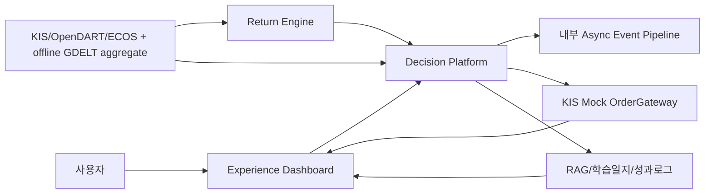

# 중간보고서 작성용 초기설계

작성일: 2026-06-23
기준 문서: `최종_프로젝트_명세서.md`, `API_명세서.md`, `착수보고서.md`

> 상태 주의: 이 문서는 2026-06-23 중간보고서 작성을 위해 만든 역사적 초기설계 snapshot이다.
> 아래의 “현재 상태”, 목표, 기술 구성은 당시 작성 초안이며 현재 구현 상태나 S1.3 이후 세션
> 배정의 기준이 아니다. 2026-07-29 이후 현재 계약·세션 상태·보안 게이트는
> `최종_프로젝트_명세서.md` 11.3/17.1/19장과 `API_명세서.md` 7~8장을 우선한다.

### 0.1 2026-07-29 중간보고서 치환 규칙

아래 본문을 재사용할 때는 다음 항목을 반드시 치환한다. 과거 문구를 구현 기준으로 복사하지
않는다.

| 역사적 문구 | 현재 P1 기준 |
|---|---|
| 국내 금 ETF/ETN | 금 ETF `132030` 하나. ETN은 설명 카드만 가능하고 active universe에서는 제외 |
| OpenAI 기본 Strong LLM | deterministic 2-step RAG + 승인형 Gemini `gemini-3.5-flash-lite`; OpenAI P1 live 0 |
| bge/e5/reranker 후보 비교 | `bge_m3_local_1024_v1`, `voyage_context_4_1024_v1` 두 profile과 세 policy만 허용; reranker P1 제외 |
| 공식자료/공시/리포트 원문 corpus | upstream 20개는 `REFERENCE_ONLY`, 프로젝트 작성 source card 30개만 canonical corpus |
| RAG history/cache | owner-scoped AES-GCM 30일 history, 목록 복호화 0, cache OFF |
| HMM을 LightGBM feature로 사용 | HMM은 S6 별도 risk evidence이며 S5 feature에서 제외 |
| stale model을 HOLD로 표현 | Signal v2 component `ABSTAIN`; 모델 HOLD와 RiskEngine HOLD를 혼용하지 않음 |
| 단순 3년 학습/validation | monthly PIT universe, open t+1~t+6 label, purge+embargo, early-stop/calibration/evaluation/final test 분리 |
| 교차시장 즉시 차단·실시간 feed | 계획은 `PLAN_FEASIBILITY=GO`, S4.8A 계약과 S4.8B/C offline merge candidate까지만 존재하고 S6.6/S6.7 runtime은 `NOT_IMPLEMENTED / PLANNED`; P1은 fixture/EOD 기반 `WARN_ONLY` |
| 애널리스트 매수의견 활용 | BUY 문구 가중치 0, 동일 증권사의 목표가·EPS·매출 revision과 위험요인만 설명 evidence로 사용 |

외부 provider/data 수집은 문서에 적혔다는 이유로 실행하지 않는다. BGE artifact download, Voyage
generation, Gemini live evaluation, KRX/KIS/ECOS와 GDELT 신규 수집은 각각 exact approval packet이
있을 때만 수행한다.

---

## 0. 이 문서의 목적

이 문서는 중간보고서 작성자가 프로젝트를 다시 해석하지 않고 바로 보고서 문장, 표, 그림, 진행상태를 만들 수 있도록 정리한 작성용 초안이다.
팀원에게 배포하는 핵심 문서는 `최종_프로젝트_명세서.md`, `중간보고서_작성용_초기설계.md`, `API_명세서.md` 세 개로 둔다. 세부 구현 방식은 각 담당자가 자율적으로 구성하되, 역할분담, 산출물 이름, API/schema 이름, KIS Mock 중심 시연, RAG/RiskEngine 안전 경계는 최종 명세서와 API 명세서를 기준으로 맞춘다.

이 문서의 역할은 다음과 같다.

1. 중간보고서에 들어갈 핵심 문장을 미리 제공한다.
2. 문제정의, 목표, 기술구성, 역할분담, 기대효과를 보고서 톤으로 정리한다.
3. 어떤 표와 그림을 넣어야 하는지 목록화한다.
4. RISE 심사기준에 맞춰 어떤 내용을 강조해야 하는지 알려준다.
5. 최종 명세서의 어느 장을 참고해야 하는지 연결한다.

---

## 1. 중간보고서 한 페이지 요약

### 1.1 과제명

보고서 제목 후보:

> 뉴스감성·LSTM 기반 투자 원칙 검증형 AI 자동매매 봇

서비스명:

> 투자 원칙 기반 AI 트레이딩 코치

### 1.2 한 문장 요약

> 본 프로젝트는 monthly point-in-time 국내주식 universe와 금 ETF `132030`을 대상으로 뉴스감성, LSTM, LightGBM, 백테스트, KIS Mock 주문을 결합한 수익률 중심 자동매매 시스템에 투자 원칙 엔진, 근거 기반 RAG 금융가이드, RiskEngine을 추가하여 투자 경험이 적은 대학생이 자신의 투자전략을 학습·검증·운영할 수 있도록 돕는 AI 트레이딩 코치이다.

### 1.3 중간보고서에서 가장 강조할 방향

중간보고서에서는 다음 세 가지를 강조한다.

1. 기존 착수보고서의 `뉴스 감성분석 + LSTM + KIS 기반 자동매매` 방향은 유지했다.
2. RISE 평가 기준 대응을 위해 `투자 원칙 검증`, `RAG 금융가이드`, `RiskEngine`, `부산대 투자 경험이 적은 대학생 사용자 테스트`를 보강했다.
3. 실거래를 과도하게 시연하지 않고 `KIS Mock`과 `백테스트`를 중심으로 안전성과 완성도를 증명한다.

---

## 2. 중간보고서용 문제정의 문장 초안

아래 문장은 그대로 중간보고서의 문제정의/배경에 사용할 수 있다.

> 최근 투자 정보 접근성은 높아졌지만, 투자 경험이 적은 대학생은 뉴스 헤드라인, 불법·광고성 투자 정보, 단기 수익률, AI 추천을 스스로 검증하기 어렵다. 특히 자동매매 시스템은 수익률을 높일 수 있는 가능성이 있지만, 투자 원칙 없이 사용하면 과매매, 손실 확대, 위험한 종목 편입, 잘못된 뉴스 해석으로 이어질 수 있다.

> 따라서 본 과제는 단순한 주문 자동화 시스템이 아니라 사용자가 투자 원칙을 설정하고, 뉴스감성·LSTM·LightGBM·백테스트 결과를 확인하며, RAG 금융가이드를 통해 근거를 학습하고, RiskEngine으로 위험한 주문을 경고 또는 제한하는 투자 원칙 검증형 AI 자동매매 시스템을 개발하는 것을 목표로 한다.

### 2.1 지역/RISE 연결 문장

> 본 프로젝트의 중심 사용자는 부산/부산대 투자 경험이 적은 대학생으로 설정한다. 지역 청년이 실제 금융정보를 해석하고 자동매매 전략을 검증하는 과정을 경험하도록 설계함으로써, 단순 기술 구현을 넘어 지역 청년 금융 리터러시 향상과 안전한 투자 의사결정 역량 강화에 기여하고자 한다.

### 2.2 근거가 약한 사회공헌 표현 배제

중간보고서에서는 다음 표현을 쓰지 않는다.

- `사회적 약자를 돕기 위한 서비스`
- `낮은 위험으로 수익을 보장하는 서비스`
- `AI 투자 추천 서비스`

대신 다음 표현을 쓴다.

- `투자 경험이 적은 청년의 금융 의사결정 지원`
- `투자 원칙 기반 전략 검증`
- `자동매매 위험통제와 학습 효과`
- `지역 청년 금융 리터러시 향상`

---

## 3. 중간보고서용 목표 문장 초안

### 3.1 최종 목표

> 본 과제의 최종 목표는 monthly PIT 국내주식 top 30과 금 ETF `132030`을 대상으로 뉴스감성, 시계열 예측, 백테스트, 투자 원칙 검증, KIS Mock 주문을 통합한 AI 자동매매 시스템을 구현하고, 사용자 테스트를 통해 학습효과·안전성·수익률/리스크·사용성을 검증하는 것이다.

### 3.2 세부 목표

| 목표 | 내용 |
|---|---|
| 데이터 기반 전략 생성 | KIS 가격 데이터, OpenDART 공시/재무, ECOS 거시지표와 fixture-first GDELT aggregate를 활용. Naver active 뉴스 입력은 퇴역 |
| 모델 기반 신호 생성 | LSTM과 LightGBM을 이용하여 가격/추세/위험 신호 생성 |
| 투자 원칙 검증 | 사용자가 설정한 보수형/균형형/공격형 원칙과 주문 후보를 비교 |
| 위험통제 | RiskEngine으로 주문 크기, 손실, 포지션, 데이터 지연, API 오류를 감시 |
| 안전 시연 | KIS Mock을 중심으로 주문/체결/잔고 흐름 시연 |
| 학습 지원 | RAG 금융가이드와 학습일지로 투자 개념과 의사결정 근거를 정리 |

---

## 4. 기존 착수보고서 대비 변경점 작성 초안

| 구분 | 기존 착수보고서 | 중간보고서에서 보강할 내용 |
|---|---|---|
| 시스템 정체성 | 뉴스감성 및 LSTM 기반 자동매매 시스템 | 투자 원칙 검증형 AI 자동매매 시스템 |
| 데이터 | 뉴스, 주가, KIS 중심 | KIS + OpenDART + ECOS + offline GDELT aggregate |
| 모델 | LSTM 중심 | LSTM + LightGBM + 규칙 baseline |
| 검증 | 수익률/백테스트 중심 | Baseline/Guide/Strict 시나리오 비교 |
| 대상 사용자 | 일반 투자자 | 부산/부산대 투자 경험이 적은 대학생 |
| 안전장치 | 기본 리스크 관리 | RiskEngine, KIS Mock, Live-ready 동의 흐름 |
| 학습 요소 | 약함 | RAG 금융가이드, 학습일지, 사용자 테스트 |

보고서에 넣을 문장:

> 착수보고서 단계에서는 뉴스 감성분석과 LSTM을 결합한 자동매매 시스템을 중심으로 설계하였다. 중간 설계 단계에서는 이 구조를 유지하면서, 자동매매의 위험성과 투자 경험이 적은 사용자의 의사결정 문제를 해결하기 위해 투자 원칙 엔진, RAG 금융가이드, RiskEngine, KIS Mock 기반 안전 시연 구조를 추가하였다.

---

## 5. 전체 시스템 구성 작성 초안

> 교차시장·애널리스트 부분은 S4.8A 계약과 S4.8B/C offline merge candidate까지만 구현됐고
> S6.6/S6.7·RiskEngine runtime은 `NOT_IMPLEMENTED / PLANNED`인 최종 목표 구조다.
> 현재 제공 기능이나 성과로 서술하지 않으며, provider/live account/live order 호출은 0,
> P1에서 교차시장 overlay가 추가할 수 있는 주문 영향은 신규 BUY의 `ALLOW → WARN`뿐이다.
> 이 범위의 `PLAN_FEASIBILITY=GO`는 월 데이터 비용 0원, fixture/EOD 우선, 신규
> framework·cloud·Kafka hard dependency 0을 전제로 한 완주 가능 판정이다. 실시간 SOX/VIX,
> 기관용 컨센서스와 KIS Live는 P1 완주 조건이 아니다.

### 5.1 시스템 구성 문장

> 최종 목표 시스템은 크게 Decision Platform, Return Engine, Experience Dashboard로 구성된다. Decision Platform은 LightGBM, 투자 원칙 엔진, RAG 금융가이드, 교차시장·애널리스트 위험 evidence, RiskEngine, KIS Mock/Live-ready 주문 판단을 담당하고, 내부 비동기 이벤트 파이프라인으로 artifact ingest와 RAG indexing, model evaluation을 분리한다. 교차시장 기능은 P1에서 `WARN_ONLY`이며 애널리스트·뉴스·LLM이 주문 상태를 직접 만들지 않는다. Return Engine은 LSTM, 규칙 baseline, 백테스트 엔진과 artifact export를 담당한다. Experience Dashboard는 사용자가 원칙 설정, RAG 질의, 모델 평가, 백테스트 리포트, 주문 검토, 학습일지를 수행하는 화면을 제공한다.

### 5.2 시스템 구성 표

| 구성요소 | 역할 | 주요 기술 |
|---|---|---|
| Decision Platform | LightGBM, 투자 원칙, RAG, 교차시장 관측·애널리스트 revision, 독립 event-study/policy replay, RiskEngine, 주문 판단, 내부 비동기 이벤트 처리 | JDK 25 LTS, Kotlin 2.4, Spring Boot 4.1, Gradle 9.5, Python FastAPI, LightGBM, PostgreSQL+pgvector, Redis, 선택 Kafka KRaft |
| Return Engine | LSTM, 규칙 baseline, feature, 백테스트 엔진 | Python, PyTorch, pandas/polars, scikit-learn |
| Experience Dashboard | 사용자 화면, 모델 평가/백테스트 리포트, 차트, 시연 flow | Next.js, TypeScript, Tailwind, shadcn/ui, Recharts/Plotly |
| Data Layer | 가격/공시/뉴스/거시 데이터 | KIS, OpenDART, ECOS, fixture-first GDELT aggregate |
| Infra | 실행/배포/검증 | Docker Compose, OCI Ubuntu, GitHub Actions |

### 5.3 보고서용 Mermaid



---

## 6. 기능 시나리오 작성 초안

중간보고서에는 다음 시나리오를 포함한다.

| 단계 | 기능 | 중간보고서 설명 |
|---:|---|---|
| 1 | 온보딩/학습진단 | 사용자의 투자 경험과 위험성향을 입력받는다 |
| 2 | 투자 원칙 설정 | 보수형/균형형/공격형 preset을 선택하고 원칙을 수정한다 |
| 3 | 데이터 수집 | KIS, OpenDART, ECOS를 수집하고 기사 metadata 없는 GDELT aggregate를 offline fixture로 먼저 검증한다 |
| 4 | 모델 신호 생성 | 팀원 B의 LSTM/규칙 baseline과 팀원 1의 LightGBM으로 매수·매도·보류 후보 신호를 생성한다 |
| 5 | 백테스트 | Baseline/Guide/Strict 전략을 비교한다 |
| 6 | RAG 설명 | 공시, 공식자료, 프로젝트 리포트, 금융공학 source card 기반으로 근거를 설명한다 |
| 7 | 주문 검토 | 원칙 위반과 RiskEngine 판단을 확인한다 |
| 8 | KIS Mock | 모의투자 주문과 체결/잔고 흐름을 검증한다 |
| 9 | 학습일지 | 판단 근거와 결과를 기록한다 |

보고서 문장:

> 사용자는 먼저 투자성향과 학습 수준을 입력하고, 보수형·균형형·공격형 투자 원칙 중 하나를 선택한다. 이후 시스템은 시장 데이터와 뉴스/공시/거시경제 정보를 수집하고, 팀원 B의 LSTM/규칙 baseline과 팀원 1의 LightGBM으로 생성한 신호를 같은 조건에서 비교한다. 주문 후보가 생성되면 Decision Platform은 사용자 원칙과 RiskEngine 기준을 기준으로 허용, 경고, 차단 여부를 판단한다. 팀원 A의 Dashboard는 모델 비교와 백테스트 리포트를 시각화하고, 최종 주문은 KIS Mock 환경에서 실행되며, 사용자는 결과와 근거를 학습일지로 저장한다.

---

## 7. 데이터/모델/검증 작성 초안

### 7.1 데이터

| 데이터 | 활용 |
|---|---|
| KIS 가격/주문/잔고 | 가격 feature, KIS Mock 주문, 잔고 확인 |
| OpenDART | 재무제표, 공시 이벤트, 기업 설명 |
| ECOS | 금리, 환율 등 거시지표 |
| Naver Search API | active provider/runtime/storage 퇴역. historical boundary source card만 보존 |
| GDELT | aggregate-only 뉴스 관심도·톤. fixture-first, 실제 호출 별도 승인, 판단 권한 없음 |
| P0 upstream reference 20개 | RAG lineage/license/change detection. 원문은 corpus 아님 |
| 프로젝트 source card 30개 | P1 canonical RAG corpus |

작성 문장:

> 뉴스 본문 크롤링은 P1에서 제외한다. RAG canonical corpus는 프로젝트가 직접 작성한
> source card 30개로 제한하고 upstream 원문과 뉴스감성 artifact는 자동으로 corpus에 넣지
> 않는다. 프로젝트 artifact를 추가하려면 별도 corpus/privacy/license 변경 승인이 필요하다.

### 7.2 모델

| 모델 | 역할 |
|---|---|
| 규칙 baseline | 이동평균/RSI 등 단순 전략 비교 |
| LSTM | 가격/거래량 시계열 흐름을 보는 기존 착수보고서의 예측 모델 |
| LightGBM | core 기술/시장/거시 feature와 coverage gate를 통과한 조건부 뉴스·공시 group을 결합하는 PIT tabular model |
| HMM | S5 feature가 아니라 S6에서 분리 계산하는 고변동/국면 risk evidence |
| PatchTST/TFT | 관련 연구로만 언급(비교 실험 없음) |
| QLoRA/파인튜닝 | 후순위 연구 |

작성 문장:

> 모델은 LSTM만 사용하지 않고 LightGBM과 규칙 기반 baseline을 함께 두어 같은 point-in-time
> universe·기간·비용에서 비교한다. 직접 구현하는 모델은 수익률 예측과 전략 검증 모델이며,
> 금융 설명은 deterministic 2-step RAG와 조건부 generator를 결합한다.

작성 문장:

> LSTM/규칙 baseline/LightGBM은 Signal v2 component evidence를 만든다. 모델의
> `AVAILABLE+HOLD`와 `ABSTAIN`, RiskEngine의 `DecisionStatus.HOLD`를 구분한다. HMM은 S6의
> 별도 risk evidence이며 deterministic RiskEngine만 ALLOW/WARN/HOLD/BLOCK을 결정한다.

### 7.2.1 공개 모델/RAG 후보 검토

Hugging Face 등 공개 모델 저장소에는 FinBERT 계열 감성분석 모델, bge/e5 계열 RAG embedding 모델, FinGPT 계열 금융 데이터셋, TimesFM/PatchTST 계열 시계열 모델이 존재한다. 다만 본 프로젝트와 같이 한국어 금융자료, KIS Mock/Live-ready 주문, 투자 원칙 엔진, RiskEngine, 사용자 학습일지를 모두 결합한 완제품은 확인되지 않았다.

| 영역 | 후보 | 중간보고서 표현 |
|---|---|---|
| RAG 검색 | `BAAI/bge-m3`, Voyage `voyage-context-4` | 정확히 두 1024차원 profile과 세 policy만 사용. context-3/e5/reranker는 P1 후보가 아님 |
| 감성분석 | `ProsusAI/finbert`, `yiyanghkust/finbert-tone`, `KR-FinBert-SC` | 외신/국내뉴스 감성 baseline으로 비교 |
| 시계열 | `TimesFM`, `PatchTST` | 관련 연구로만 언급, 비교 실험은 수행하지 않음 |
| 금융 QA/RAG | `FinanceBench`, `financial-qa-10K`, Finance RAG Spaces | 평가셋/데모 참고용 |
| 완성형 트레이딩 시스템 | HF trading bot 검색 결과 | 검증 근거가 약해 채택 제외 |

작성 문장:

> 공개 모델을 그대로 가져와 사용하는 방식이 아니라, RAG 검색·감성분석·시계열 예측의 후보군으로 비교한다. 최종 판단과 주문 차단은 프로젝트 내부의 Decision Platform과 RiskEngine이 담당하도록 하여 설명 가능성과 안전성을 확보한다.

### 7.2.2 전용 RAG 구현 경계

| 구분 | v1 판단 | 중간보고서 표현 |
|---|---|---|
| 직접 구현 | Source Registry, Source Card, Citation Card, pgvector 검색, RAG API, 평가셋 | 프로젝트 맞춤형 근거·안전 RAG |
| 외부 활용 | pinned BGE-M3 local, 승인형 Voyage context-4 embedding, 승인형 Gemini generation, FinBERT 후보 | RAG는 두 profile/세 policy의 고정 부품만 사용하고 provider live는 별도 승인 |
| 제외 | 뉴스 원문 전체 RAG, Finance-RAG 완제품, HF trading bot | 범위 과대화와 신뢰도 문제를 방지 |
| 평가 | 공개·합성 gold 50 + adversarial 10 fixture, citationCoverage, Recall@5, directAdviceBlockRate | 출처 기반 설명 품질과 injection 차단을 함께 수치화 |

작성 문장:

> 본 프로젝트의 RAG는 금융 지식 전체를 자체 학습하는 대규모 LLM이 아니라, 자동매매 판단을 출처 기반으로 설명하고 위험 주문을 해석하는 근거·안전 중심 전용 RAG이다. 공식자료, 공시/API 문서, 프로젝트 리포트, 금융공학 source card를 중심으로 구성하고, 뉴스는 원문 전체가 아니라 뉴스감성 요약 artifact로 연결한다.

### 7.3 금융공학 반영 요약

금융공학은 수익률을 보장하는 공식이 아니라, 자동매매 전략의 위험을 수학적으로 설명하고 검증하는 장치로 사용한다.

| 항목 | 중간보고서 표현 | 구현 연결 |
|---|---|---|
| Black-Scholes-Merton | 옵션 가격 산정 자체보다 변동성·시간·무위험수익률 기반 위험 설명에 활용 | RAG 금융수학 카드, 리스크 설명 |
| HMM | 시장을 상승/횡보/하락 또는 저변동/고변동 국면으로 나누어 해석 | RiskEngine 국면 필터 |
| 평균회귀 | 가격이 평균에서 얼마나 벗어났는지 분석 | z-score, half-life |
| VaR/CVaR | 특정 기간 손실위험과 tail risk를 수치화 | 주문검토/백테스트 리포트 |
| Monte Carlo | 여러 가격 경로에서 손실확률을 시뮬레이션 | 스트레스 테스트 |
| 과최적화 방어 | 백테스트 결과를 맹신하지 않도록 검증절차를 둠 | walk-forward, 거래비용, slippage |
| 옵션 분석 계산기 | Black-Scholes, Greeks, implied volatility는 계산/교육 기능으로 제한 | 자동매매 제외, RAG 금융수학 카드 |

작성 문장:

> 본 과제는 금융공학을 수익률 보장 공식으로 사용하지 않고, 변동성, 손실위험, 시장국면, 평균회귀 가능성, 과최적화 위험을 설명하는 검증 도구로 사용한다. 이를 통해 투자 경험이 적은 사용자가 자동매매 결과를 무비판적으로 따르지 않고, 리스크와 근거를 함께 확인하도록 설계한다.

> Black-Scholes 계산기, Greeks, implied volatility는 옵션/ELW 자동매매가 아니라 금융수학 이해와 리스크 설명을 위한 보조 계산 기능으로 구현한다. 실제 옵션/ELW 주문과 초단기/HFT 전략은 중간보고서 범위에서 제외한다.

### 7.4 검증

| 검증 | 설명 |
|---|---|
| Baseline | 모델 신호만 사용하는 기준 전략 |
| Guide | 원칙 위반 시 경고를 반영하는 전략 |
| Strict | 중대한 원칙 위반 주문을 차단하는 전략 |

작성 문장:

> 검증은 단일 수익률만 비교하지 않고 Baseline, Guide, Strict 세 시나리오를 비교한다. 이를 통해 투자 원칙과 RiskEngine이 수익률, 손실, 원칙 위반 건수에 어떤 영향을 주는지 정량적으로 확인한다.

---

## 8. KIS Mock/Live-ready 작성 초안

### 8.1 KIS Mock 중심

> 본 프로젝트의 발표 및 검증은 KIS Mock 환경을 중심으로 진행한다. 실거래 주문은 위험과 책임 문제가 있으므로 중간 단계에서는 모의투자 주문, 체결, 잔고, 로그 저장 흐름을 우선 구현한다.

### 8.2 Live-ready 설계

> 다만 최종 시스템 구조에는 KIS Live-ready 설계를 포함한다. Live 기능은 고급해제, 최소 안전장치, 3단계 동의, 변경 시 재동의 조건을 충족해야 하며, 발표 시에는 설계와 화면 흐름 중심으로 설명한다.

### 8.3 안전장치 표

| 단계 | 안전장치 |
|---|---|
| KIS Mock 핵심 5종 | Kill Switch, Max Order Size, Position Limit, Daily Loss/MDD Guard, Data/API Freshness Guard |
| Mock/Live 공통 provider guard | KIS 공식 유량, OAuth singleflight, bounded retry, 호출 우선순위. 모의 1/s에도 필수이며 Live 전용이 아님 |
| KIS Live 8종 | Mock 5종 + Price Tolerance, Cooldown/Repeated Loss, 계좌 reconciliation, Consent/Audit Log. 공통 provider guard 위에 추가 |

정확한 운영 수치는 최종 명세서 12.4.1을 단일 진실로 따른다. 2026-04-20 공식 공지 기준 REST 실전 계좌당 18/s, 모의 1/s, `/oauth2/tokenP` 1/s이며, WebSocket은 계좌(앱키)당 1세션·전 상품/유형 합산 41등록·접속키 1/s다. 이 초기설계 문서는 수치를 별도로 갱신하는 두 번째 계약이 아니다.

---

## 9. 역할분담 작성 초안

### 9.1 역할표

| 담당 | 역할명 | 핵심 책임 | 산출물 |
|---|---|---|---|
| 팀원 1 | LightGBM + Decision Platform + RAG/Risk | LightGBM, 원칙 엔진, RAG 전체 품질 책임, 교차시장·애널리스트 evidence, 독립 event-study/policy replay, RiskEngine, HMM/위험지표, KIS Mock/Live-ready, 금융공학 기준 검증 | `lightgbm_signal.json`, API, RAG, cross-market snapshot/검증 보고서, RiskEngine, 주문 판단, 금융공학 분석 리포트 |
| 팀원 B | Return Engine + LSTM/Backtest Core | LSTM, 규칙 baseline, backtest core, 거래비용/slippage, 뉴스감성 요약 artifact | `lstm_signals.parquet`, `rule_baseline_signals.parquet`, `backtest_result.json`, `trade_log.parquet`, `model_report.md` |
| 팀원 A | Experience Dashboard + Model Evaluation ViewModel | Next.js 대시보드, Model Evaluation ViewModel, Backtest Visualization, 주문검토, RAG 핵심 출처 표시, RiskEngine 결과 표시 | 모델 비교 화면, 백테스트 리포트 화면, drawdown chart, 주문검토 화면, RAG/Risk 표시 화면, 발표 캡처 |
| 전원 | 공통 | Docker Compose, OCI 배포, CI, 사용자 테스트, 보고서/발표 | 실행환경, 테스트 결과, 문서 |

### 9.2 역할분담 설명 문장

> 팀은 3명 기준으로 Decision Platform, Return Engine, Experience Dashboard의 세 축으로 나눈다. 역할은 특정 1명에게 기능을 집중시키는 방식이 아니라, 세 명이 각자 핵심 난이도와 포트폴리오 산출물을 확보하도록 균형 있게 분담한다. 팀원 1은 LightGBM, RAG, RiskEngine을 맡고, 팀원 B는 LSTM, 규칙 baseline, backtest core를 맡으며, 팀원 A는 API 결과와 계약된 artifact를 사용자가 이해하기 쉬운 Model Evaluation ViewModel, Backtest Visualization, RAG/Risk 표시 화면으로 구성한다. 문서/리포트 작성은 별도 공통 작업으로 보며 역할별 구현량 비교에서 제외한다. 각 담당자는 자신의 `workspaces/` 하위 폴더를 중심으로 개발하고, 공통 계약은 `contracts/`에 JSON Schema와 OpenAPI 문서로 관리한다.

### 9.3 모노레포 구조

```text
Capstone-AI-Trading-Coach/
  workspaces/
    decision-platform/       # 팀원 1
      spring-api/
      python-services/
        app/
          lightgbm/
          rag/
          financial_engineering/
          data/
          brokerage/
    return-engine/           # 팀원 B
      src/
        data/
        features/
        lstm/
        rule_baseline/
        backtest_core/
        artifact_export/
    experience-dashboard/    # 팀원 A
      src/
        features/
          model-evaluation/
          backtest-report/
          order-review/
          rag-source/
  contracts/                 # 공통 API/이벤트/스키마
    schemas/                  # JSON Schema
    proto/                    # Spring-Python gRPC
    openapi/                  # Frontend-Spring REST
    examples/                 # 예시 payload
    changes/                  # 계약 변경 기록
  artifacts/                 # 산출물 교환
    return-engine/{runId}/
    decision-platform/{runId}/
  shared-docs/               # 지표 정의/실험 프로토콜
  infra/                     # Docker Compose, OCI, CI
  docs/                      # 보고서, 명세, 사용자 테스트
```

중간보고서에는 다음 설명을 추가할 수 있다.

> 각 팀원은 자신의 `workspaces/<담당영역>/` 내부 파일을 중심으로 개발하고, 다른 영역과의 연결은 `contracts/`의 schema/API 계약과 `artifacts/{workspace}/{runId}/` 산출물로 진행한다. 이를 통해 LSTM, LightGBM, RiskEngine, Dashboard가 서로 다른 파일 구조에서 독립적으로 개발되면서도 통합 시점에는 같은 계약을 기준으로 연결된다.

---

## 10. 중간보고서에 넣을 표 목록

중간보고서에는 최소 다음 표를 포함한다.

| 번호 | 표 제목 | 위치 |
|---:|---|---|
| 1 | 기존 착수보고서 대비 변경점 | 배경/설계 변경 |
| 2 | RISE 심사기준별 대응 전략 | 문제해결/기대효과 |
| 3 | 시스템 구성요소 및 기술스택 | 시스템 설계 |
| 4 | 데이터 원천 및 활용 방식 | 데이터 설계 |
| 5 | 모델별 역할 비교 | 모델 설계 |
| 6 | Baseline/Guide/Strict 검증 시나리오 | 검증 계획 |
| 7 | KIS Mock/Live 안전장치 | 위험관리 |
| 8 | 3명 역할분담 | 추진체계 |
| 9 | 현재 진행상태 및 향후 계획 | 진행상황 |
| 10 | 성과지표 | 기대효과 |

---

## 11. 중간보고서에 넣을 그림 목록

| 번호 | 그림 | 설명 |
|---:|---|---|
| 1 | 전체 시스템 아키텍처 | 사용자, 대시보드, Decision Platform, Return Engine, 데이터, KIS Mock |
| 2 | 서비스 시나리오 흐름도 | 학습진단 → 원칙설정 → 모델/백테스트 → 주문검토 → 학습일지 |
| 3 | 데이터 pipeline | KIS/OpenDART/ECOS + 조건부 GDELT aggregate → feature → 모델 |
| 4 | RiskEngine 판단 흐름 | 주문 후보 → 원칙 검사 → 안전장치 → 허용/경고/차단 |
| 5 | 역할분담 구조 | 세 workspace와 contracts 연결 |
| 6 | 화면 와이어프레임 | 원칙설정, 백테스트, 주문검토, RAG |

---

## 12. RISE 심사기준별 작성 포인트

| 심사기준 | 보고서에 작성할 포인트 |
|---|---|
| 문제 인식 및 분석 적정성 15 | 투자 경험이 적은 대학생의 자동매매 위험, 뉴스해석, ETF/불법·광고성 투자 정보 문제 |
| 창의성/체계성 30 | 원칙 엔진 + RAG + LSTM/LightGBM + 백테스트 + KIS Mock 통합 |
| 팀워크 10 | 3명 역할분담, 모노레포 ownership, contracts 기반 협업 |
| 실현가능성/완성도 35 | KIS Mock, OpenDART, ECOS, offline GDELT aggregate, Docker Compose, OCI, CI |
| 성과/확산 가능성 10 | 부산대 투자 경험이 적은 사용자 5-10명 대상 테스트, 학습효과/안전성/수익률/사용성 지표 |

중간보고서 문장:

> 본 과제는 RISE 문제해결 IDEA 평가 기준 중 실현가능성과 완성도를 가장 중요한 축으로 보고, KIS Mock 주문, 백테스트, 대시보드, 사용자 테스트까지 연결되는 구현 가능한 범위로 설계하였다. 동시에 투자 원칙 엔진과 RAG 금융가이드를 결합하여 단순 자동매매 시스템과 차별화되는 창의성과 체계성을 확보하고자 한다.

---

## 13. 중간보고서용 진행상태 표

실제 진행상황에 맞게 `상태` 열을 수정한다.

| 영역 | 현재 상태 | 중간보고서 전 목표 | 담당 |
|---|---|---|---|
| 프로젝트 방향 | 확정 | 최종 명세서 기반 보고서 반영 | 공통 |
| 모노레포 구조 | 설계 완료 | 초기 폴더 생성 | 공통 |
| contracts | P0 작성 대상 | principle 입력 UI 계약, signal/backtest/risk/artifact manifest schema 초안 | 팀원 1 초안, 전원 확인 |
| KIS 가격 데이터 | 문서 확인 | 모델/백테스트용 가격 조회 sample 구현 | 팀원 B |
| KIS Mock 주문 | 문서 확인 | 주문 가능금액/현재가/mock 주문 sample 구현 | 팀원 1 |
| OpenDART | 설계 반영 | 공시/재무 sample 수집 | 팀원 1 |
| 뉴스 데이터 | 설계 반영 | Decision Platform의 aggregate-only public contract를 별도 합의 뒤 소비 | 팀원 B |
| 뉴스감성 artifact | 설계 확정 | `news_sentiment_summary.v2` sample export. 조건부 feature gate 전 S5 입력 0 | 팀원 B |
| 규칙 baseline | 추가 확정 | 이동평균/RSI/MACD 비교 전략 초안 | 팀원 B |
| LSTM | 기존 방향 유지 | baseline 학습 코드 초안 | 팀원 B |
| LightGBM | 팀원 1 담당 확정 | feature table과 baseline 비교 코드 초안 | 팀원 1 |
| 백테스트 core | 설계 확정 | 체결 시뮬레이션/비용/slippage 구조 초안 | 팀원 B |
| 투자 원칙 엔진 | 설계 확정 | preset/사용자별 versioning/구조화 UI 입력 기반 룰엔진 초안 | 팀원 1 |
| RAG | v1 핵심 구현 | pgvector/문서 검색/출처표시 sample, 50문항 평가셋 | 팀원 1 |
| RiskEngine | 설계 확정 | Mock 5종 안전장치 초안 | 팀원 1 |
| Decision Platform 내부 이벤트 파이프라인 | 설계 확정 | artifact ingest, RAG indexing, model evaluation 비동기 처리 초안 | 팀원 1 |
| Model Evaluation ViewModel | 추가 확정 | 모델 비교표, signal timeline, confidence/predictedReturn/model disagreement prototype | 팀원 A |
| Backtest Visualization | 추가 확정 | equity curve, drawdown chart, monthly return heatmap, scenario comparison prototype | 팀원 A |
| Dashboard | 화면 명세 확정 | 원칙설정 입력 UI/RAG/주문검토 prototype | 팀원 A |
| Docker Compose | P0 공통 작업 | Spring API, Python service, Dashboard, PostgreSQL, Redis 로컬 실행 초안 | 공통 |
| 사용자 테스트 | 계획 확정 | 설문지/테스트 시나리오 초안 | 공통 |

---

## 14. 중간보고서에서 강조할 문장

발표나 보고서 결론에 사용할 수 있는 문장이다.

1. 본 프로젝트는 단순 수익률 예측 모델이 아니라, 투자 원칙과 위험통제를 자동매매 흐름에 결합한 의사결정 지원 시스템이다.
2. 사용자는 AI 신호를 그대로 따르는 것이 아니라, 자신의 투자 원칙과 백테스트 결과를 확인한 뒤 KIS Mock 환경에서 안전하게 전략을 검증한다.
3. RAG 금융가이드는 비전문 사용자가 공시, 뉴스, ETF/ETN, 리스크 지표를 이해할 수 있도록 근거 기반 설명을 제공한다.
4. Baseline, Guide, Strict 세 시나리오 비교를 통해 투자 원칙과 RiskEngine이 수익률과 위험에 미치는 영향을 정량적으로 검증한다.
5. 부산대 투자 경험이 적은 대학생 5-10명을 대상으로 사용자 테스트를 진행하여 학습효과, 원칙위반 감소, 사용성 만족도를 확인할 계획이다.

---

## 15. 중간보고서에서 피해야 할 방향

| 피해야 할 방향 | 이유 |
|---|---|
| 교육앱처럼만 설명 | 기존 착수보고서의 자동매매/수익률 정체성이 약해짐 |
| 수익률 보장처럼 표현 | 금융 윤리와 발표 리스크가 큼 |
| 실거래를 바로 강조 | 안전성/책임 문제가 커짐 |
| LSTM만 강조 | 모델 설계가 약해 보임 |
| RAG를 만능처럼 설명 | 환각/출처 문제가 있음 |
| 사회적 약자 프레임 | 근거가 약한 표현으로 해석될 수 있음 |
| 기술을 너무 많이 나열 | 구현가능성이 낮아 보임 |

---

## 16. 최종 명세서 참고 위치

| 중간보고서 작성 내용 | 참고할 최종 명세서 장 |
|---|---|
| 최종 방향/서비스명 | 1장 |
| 기존 착수보고서 유지/변경 | 2장 |
| RISE 심사기준 대응 | 3장 |
| 사용자 페르소나/문제정의 | 4장 |
| 전체 서비스 흐름 | 5장 |
| 모노레포/ownership | 6장 |
| 역할분담/구현 기준 | 7장 |
| 투자 원칙/RiskEngine | 8장 |
| LSTM/LightGBM/백테스트 | 9장 |
| 프론트 화면 | 10장 |
| 데이터/RAG/OpenDART | 11장 |
| KIS Mock/Live | 12장 |
| 기술스택/배포 | 13장 |
| Git/CI/QA | 14장 |
| 후순위 항목 | 15장 |
| 성과지표 | 16장 |
| 중간보고서 전 우선순위 | 17장 |
| 위험성/대응 | 18장 |
| 요구사항 반영 추적 | 19장 |

---

## 17. 중간보고서 작성 순서 추천

중간보고서는 다음 순서로 작성한다.

1. 과제명과 한 문장 요약을 먼저 확정한다.
2. 기존 착수보고서에서 유지한 것과 바꾼 것을 표로 정리한다.
3. 문제정의를 부산/부산대 투자 경험이 적은 대학생 중심으로 작성한다.
4. 전체 시스템 구성도를 포함한다.
5. Decision Platform, Return Engine, Experience Dashboard를 각각 설명한다.
6. 데이터/모델/백테스트/RAG/KIS Mock을 기술 구성으로 정리한다.
7. 역할분담과 monorepo ownership을 포함한다.
8. 진행상태 표를 실제 구현 상황에 맞게 수정한다.
9. RISE 심사기준별 대응 표를 포함한다.
10. 기대효과와 향후 계획을 네 축 지표로 마무리한다.

---

## 18. 중간보고서 체크리스트

보고서 제출 전 아래 항목을 확인한다.

| 체크 | 항목 |
|---|---|
| [ ] | `투자 원칙 기반 AI 트레이딩 코치` 서비스명이 들어갔는가 |
| [ ] | `뉴스감성·LSTM 기반 투자 원칙 검증형 AI 자동매매 봇` 제목 후보가 반영됐는가 |
| [ ] | 기존 착수보고서의 뉴스감성/LSTM/KIS/국내주식/금 ETF·ETN이 유지됐는가 |
| [ ] | 단순 교육앱이 아니라 수익률 중심 자동매매 시스템임이 드러나는가 |
| [ ] | RAG와 RiskEngine이 자동매매를 보조/통제하는 구조로 설명됐는가 |
| [ ] | KIS Mock 중심 시연과 KIS Live-ready 설계가 구분됐는가 |
| [ ] | LSTM + LightGBM + baseline 비교가 들어갔는가 |
| [ ] | Baseline/Guide/Strict 검증 시나리오가 들어갔는가 |
| [ ] | OpenDART·ECOS와 fixture-first GDELT aggregate가 구분되고 Naver active source 퇴역이 반영됐는가 |
| [ ] | 부산대 투자 경험이 적은 대학생 5-10명 사용자 테스트가 포함됐는가 |
| [ ] | 3명 역할분담이 명확한가 |
| [ ] | Docker Compose, OCI, CI 등 구현/운영 계획이 들어갔는가 |
| [ ] | 팀별 자율성과 최종 산출물 계약이 함께 설명됐는가 |
| [ ] | 학습효과, 안전성, 수익률/리스크, 사용성 지표가 들어갔는가 |
| [ ] | RISE 심사기준 5개 항목에 대응하는가 |
| [ ] | 교차시장 계획의 `GO`와 현재 `NOT_IMPLEMENTED` 상태를 구분했고 P1 `WARN_ONLY`를 차단 기능처럼 표현하지 않았는가 |
| [ ] | S8.4 사용자 과업에 교차시장 경고 이해, 원인·반론의 불확실성 구분, 경고 후 주문 재검토를 포함했는가 |

---

## 19. 최종 요약 문단

중간보고서 마지막에 사용할 수 있는 문단은 다음과 같다.

> 본 과제는 기존 착수보고서의 뉴스 감성분석 및 LSTM 기반 자동매매 구조를 유지하면서, 투자 원칙 엔진, RAG 금융가이드, RiskEngine, KIS Mock 주문 흐름을 추가하여 투자 경험이 적은 대학생이 데이터 기반으로 전략을 검증하고 안전하게 자동매매를 학습할 수 있도록 설계하였다. 향후 구현 단계에서는 Decision Platform, Return Engine, Experience Dashboard의 세 영역으로 역할을 나누어 개발하고, Baseline/Guide/Strict 백테스트와 부산대 투자 경험이 적은 대학생 사용자 테스트를 통해 수익률, 위험통제, 학습효과, 사용성을 함께 검증할 예정이다.
