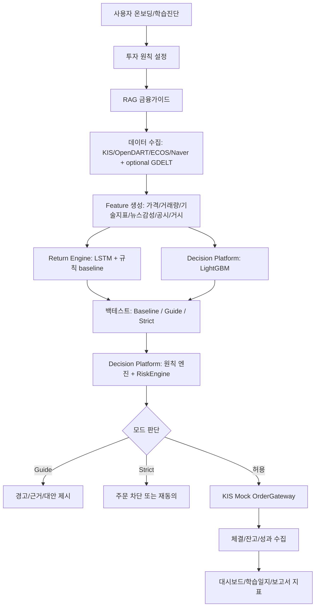

# 최종 프로젝트 명세서

작성일: 2026-06-23  
기준 문서: `착수보고서.md`, `2026전기_착수보고서_외신 및 국내뉴스 감성분석 및 LSTM 기반_v0.1.docx`, `한국투자증권_오픈API_전체문서_20260707_030000.xlsx`, `LLM_trader`, `LLM_trader_docs`, `open-trading-api`

---

## 0. 문서 목적

이 문서는 최종 착수보고서 완성판, 기능명세서, 역할분담표, 중간보고서, 발표자료, 구현 이슈를 만들기 위한 상위 기준 문서이다.

이 문서에서 확정하는 방향은 다음과 같다.

1. 기존 착수보고서의 본질인 `뉴스 감성분석 + LSTM + KIS 기반 국내주식/금 ETF·ETN 자동매매`는 v1 핵심으로 유지한다.
2. 단순 교육앱으로 바꾸지 않는다.
3. 단순 퀀트 자동매매 시스템이나 단순 주문 자동화 시스템으로도 한정하지 않는다.
4. 최종 정체성은 `수익률 중심 자율 트레이딩 시스템 + 투자 원칙/RAG/리스크 안전장치`로 정의한다.
5. RISE 문제해결 IDEA 평가 기준에 대응하기 위해 지역 청년 금융 리터러시, 투자 원칙 검증, 사용자 테스트, 사회문제 근거를 설계에 포함한다.
6. 발표와 검증은 KIS Mock 중심으로 안전하게 진행하되, 전체 설계에는 비활성 KIS Live-ready 흐름까지 포함한다.

---

## 1. 최종 방향

### 1.1 최종 프로젝트 표현

보고서 제목은 다음으로 확정한다.

> 뉴스감성·LSTM 기반 투자 원칙 검증형 AI 자동매매 봇

서비스명은 다음으로 고정한다.

> 투자 원칙 기반 AI 트레이딩 코치

이름에서 중요한 점은 `코치`라는 표현이 단순 상담형 대화 시스템을 의미하지 않는다는 것이다. 이 프로젝트에서 코치는 다음 세 가지를 동시에 수행한다.

| 역할 | 의미 |
|---|---|
| 자동매매 엔진 | 주식/금 ETF·ETN KIS Mock 주문, 사용자 명시 선택형 INTERNAL_PAPER 비상 모드, 백테스트, 신호 생성, 포트폴리오 상태 추적 |
| 투자 원칙 검증기 | 사용자가 세운 투자 원칙과 실제 주문/전략이 충돌하는지 검사 |
| 금융 지식 안내자 | RAG 기반 금융가이드, 공시/뉴스/재무제표 근거, 학습일지 작성 보조 |

따라서 이 프로젝트는 “AI가 수익을 보장한다”는 관점이 아니라 “사용자가 투자 원칙을 정의하고, 데이터·모델·뉴스·공시·위험통제 근거를 확인하며, 자동매매 전략을 검증하고 운영한다”는 방향으로 설명해야 한다.

### 1.2 최종 결론

최종 방향은 다음 문장으로 압축한다.

> 기존 착수보고서의 운영 상태·위험 24시간 감시 지향 구조를 유지하되, 투자 경험이 적은 대학생이 자신의 투자 원칙을 세우고, RAG 금융가이드와 뉴스감성·LSTM·LightGBM·백테스트·KIS Mock을 통해 주식/금 ETF·ETN 전략을 검증하며, RiskEngine으로 위험한 주문을 경고하거나 제한하는 투자 원칙 검증형 AI 자동매매 시스템으로 고도화한다. 여기서 24시간 감시는 provider API를 계속 polling한다는 뜻이 아니다.

### 1.3 설계 원칙

본 프로젝트에서 유지해야 할 설계 원칙은 다음과 같다.

| 설계 원칙 | 문서화 방향 |
|---|---|
| 졸업과제로 얻어가는 것이 있어야 한다 | 구현일지, 학습일지, 모델 실험 기록, 기술 선택 근거를 남긴다 |
| 단순 트레이딩 시스템으로 한정하지 않는다 | 원칙 검증, 설명 가능성, 안전장치, 사용자 학습 효과를 포함한다 |
| 근거가 약한 사회공헌 프레이밍은 배제한다 | 부산/부산대 투자 경험이 적은 청년의 실제 금융 의사결정 문제로 연결한다 |
| 수익률을 포기하지 않는다 | 백테스트 수익률, MDD, Sharpe, 승률, 비용 반영 성과를 지표로 둔다 |
| 교육만 강조하지 않는다 | RAG는 보조 기능이고 핵심은 전략 검증형 자동매매 시스템이다 |
| AI에게 전부 맡기지 않는다 | AI 툴체인은 근거 생성·검증·요약·가이드에 사용하고, 주문은 룰과 RiskEngine이 통제한다 |
| Dashboard 계약은 구현 담당과 무관하게 명확히 정의한다 | 화면 단위, 상태 모델, 사용자 흐름, 시연 시나리오를 사전에 고정한다 |
| 금융공학은 수익 보장 공식으로 쓰지 않는다 | 리스크 측정, 시장국면 판단, 백테스트 검증, 과최적화 방어에 활용한다 |

### 1.4 지식 전략: Strong LLM + Curated RAG + Calculation Engine

RAG는 최신 LLM을 금융 교재로 처음부터 다시 학습시키기 위한 수단이 아니다. 본 프로젝트의 지식 전략은 다음 세 계층으로 분리한다.

| 계층 | 역할 | 적용 방식 |
|---|---|---|
| Strong LLM | 금융 개념 설명, 근거 요약, 보고서/학습일지 문장화 | OpenAI를 기본 provider로 사용하되 Claude/Gemini 등 provider adapter를 유지 |
| Curated RAG | 공식자료, 공시, API 문서, 프로젝트 분석 리포트, 금융공학 source card 검색 | `BAAI/bge-m3` embedding 기본, pgvector 기반 검색, reranker 1차 고도화, 출처율/검색 실패율 기록 |
| Calculation Engine | 수익률, 변동성, VaR/CVaR, HMM, 평균회귀, 백테스트 지표 계산 | Python에서 deterministic 계산 후 Spring RiskEngine이 최종 판단 |

이 구조를 사용하면 LLM의 넓은 금융 지식은 활용하되, 주문 판단과 리스크 계산은 검증 가능한 수치와 출처 기반 근거로 통제할 수 있다.

### 1.5 RAG 구현 경계 확정

v1 RAG는 `근거·안전 중심 전용 RAG`로 고정한다. RAG의 목적은 금융 지식 전체를 새로 학습시키는 것이 아니라, 자동매매 판단과 위험 경고를 출처 기반으로 설명하는 것이다.

| 구분 | v1 판단 | 구체 내용 |
|---|---|---|
| 직접 구현 | 필수 | Source Registry, Source Card, Citation Card, 공식자료/API/공시 ingest, chunking, embedding, pgvector 저장, hybrid search, RAG 답변 API, citationCoverage, retrievalFailure, guardrail, 평가셋 |
| 가져다 쓸 것 | 필수 | OpenAI 기본 LLM 답변 생성, provider adapter, `BAAI/bge-m3` embedding 기본, `BGE-m3-ko`/`multilingual-e5` 비교 리포트, `bge-reranker-v2-m3` 1차 고도화, KR/EN FinBERT 후보 비교, 규칙 fallback |
| 구현하지 않을 것 | 제외 | Finance-RAG 완제품 직접 채택, HF trading bot 핵심 로직 사용, 뉴스 원문 전체 실시간 RAG corpus 운영, RAG의 매수/매도 직접 지시 |
| 후순위 연구 | 연구만 | KRX/WON-Reasoning 로컬 운영, FinGPT forecaster 운영, PatchTST/TimesFM production 고정, 자체 파인튜닝 |

런타임 RAG corpus는 다음 네 종류로 제한한다.

1. KIS/OpenDART/ECOS/KRX/FSC/FSS 등 공식자료와 API 문서.
2. 공시/재무제표 metadata와 요약 card.
3. 백테스트, 리스크, 데이터 품질, 모델 평가 등 프로젝트 산출물.
4. 금융공학 source card: BSM, Greeks, VaR/CVaR, HMM, 평균회귀, 과최적화 방어 등.

뉴스 원문 전체는 런타임 RAG에 포함하지 않는다. 뉴스는 Return Engine이 `뉴스감성 요약 artifact`로 생성하고, RAG는 그 결과를 사용자가 이해할 수 있게 설명하는 역할만 맡는다.

팀원에게 배포하는 기준 문서는 이 최종 명세서, `중간보고서_작성용_초기설계.md`, `API_명세서.md` 세 개로 둔다. 개인 내부 자료수급 노트는 팀 배포 문서에 포함하지 않으며, 팀원별 세부 구현 방식은 각 담당자가 자율적으로 설계한다. 다만 artifact 이름, schema/API 이름, 역할 경계, 시연 범위, 안전 규칙은 이 최종 명세서와 API 명세서의 결과물 계약을 기준으로 한다.

---

## 2. 기존 착수보고서 유지/변경점

### 2.1 유지할 것

기존 착수보고서에서 유지할 핵심은 다음과 같다.

| 기존 요소 | 유지 여부 | 이유 |
|---|---:|---|
| 외신 및 국내뉴스 감성분석 | 유지 | 시장 이벤트와 투자 심리 필터로 활용 가능 |
| LSTM 기반 가격 예측 | 유지 | 졸업과제 기술 난이도와 ML 구현 성과 제시에 적합 |
| 국내주식 자동매매 | 유지 | KIS OpenAPI와 직접 연결되는 핵심 기능 |
| 금 ETF/ETN | 유지 | 단일 주식보다 자산군 분산과 거시경제 연결성을 설명하기에 적합 |
| 24시간 감시형 시스템 | 유지 | 자동화, 알림, 위험감시, 상태 모니터링 명분이 됨 |
| 수익률/백테스트 | 유지 및 강화 | 교수님과 평가자가 이해하기 쉬운 성과지표 |
| KIS OpenAPI | 유지 | 실제 증권사 API 기반이라는 구현 현실성이 있음 |

### 2.2 바꿀 것

바꿔야 할 점은 다음과 같다.

| 기존 한계 | 변경 방향 |
|---|---|
| 단순 자동매매 시스템으로 인식될 위험 | 투자 원칙 검증형 자동매매 시스템으로 재정의 |
| 수익률만 강조하면 위험한 서비스처럼 보일 수 있음 | 수익률 + 리스크 + 학습효과 + 원칙 준수율을 함께 제시 |
| LSTM만 있으면 모델 경쟁력이 약함 | LSTM + LightGBM + 백테스트 + 뉴스/공시 필터 구조로 보강 |
| 뉴스 본문 크롤링 리스크 | Naver Search API metadata와 공식자료/공시 중심으로 구성하고 GDELT는 optional secondary enrichment로만 검토 |
| 실거래 시연 리스크 | KIS Mock 중심 시연, KIS Live는 고급해제/동의/안전장치 설계로 제한 |
| 사회공헌 연결이 약함 | 부산/부산대 투자 경험이 적은 대학생의 금융 리터러시와 안전한 자동매매 학습으로 연결 |
| 팀원 역할이 흐릿할 수 있음 | Decision Platform, Return Engine, Experience Dashboard로 명확히 분리 |

### 2.3 최종 착수보고서에서 쓸 표현

최종 착수보고서에서는 다음 표현을 우선 사용한다.

- `투자 원칙 검증형 AI 자동매매 봇`
- `뉴스감성·LSTM·LightGBM 기반 전략 검증`
- `KIS Mock 기반 안전 시연 및 KIS Live-ready 설계`
- `RAG 금융가이드 기반 근거 제공`
- `부산/부산대 투자 경험이 적은 대학생 대상 사용자 검증`
- `수익률 중심 자율 트레이딩 시스템에 원칙/RAG/리스크 안전장치를 결합한 시스템`

피해야 할 표현은 다음과 같다.

- `낮은 위험으로 수익을 보장한다`
- `AI가 알아서 수익을 보장한다`
- `사회적 약자를 위해 만든 서비스`
- `교육용 앱`
- `단순 주식 추천 대화형 서비스`

---

## 3. RISE 문제해결 IDEA 심사기준 대응

### 3.1 확인한 심사기준

RISE 문제해결 IDEA 유형의 평가항목은 다음 기준으로 문서화한다.

| 평가항목 | 배점 | 본 프로젝트 대응 |
|---|---:|---|
| 문제 인식 및 분석 적정성 | 15 | 투자 경험이 적은 청년의 자동매매/ETF/불법·광고성 투자 정보/뉴스해석 문제를 근거로 제시 |
| 창의성/체계성 | 30 | 투자 원칙 엔진 + RAG + LSTM/LightGBM + 백테스트 + KIS Mock 통합 |
| 팀워크 | 10 | 3명 역할을 Decision Platform, Return Engine, Experience Dashboard로 분리 |
| 실현가능성/완성도 | 35 | KIS Mock, OpenDART, ECOS, Naver API, PostgreSQL, Docker Compose 기반 v1 범위 제시. GDELT는 optional |
| 성과 및 확산 가능성 | 10 | 부산대 투자 경험이 적은 사용자 5-10명 대상 테스트, 학습효과/원칙위반 감소/백테스트 지표 제시 |

### 3.2 점수 전략

가장 높은 배점은 `실현가능성/완성도 35점`과 `창의성/체계성 30점`이다. 따라서 보고서와 발표에서는 다음을 우선 보여줘야 한다.

| 우선순위 | 보여줘야 할 것 | 이유 |
|---:|---|---|
| 1 | 실제 동작하는 KIS Mock 주문 흐름 | 완성도 증명 |
| 2 | 백테스트 결과와 리스크 지표 | 수익률 지향 프로젝트 정체성 유지 |
| 3 | 투자 원칙 위반 감지와 Guide/Strict 비교 | 차별성과 안전성 증명 |
| 4 | RAG 근거 제공 화면 | 비전문 사용자 가이드와 설명 가능성 증명 |
| 5 | 사용자 테스트 결과 | 지역사회 연결과 확산 가능성 증명 |

### 3.3 2025 수상 사례에서 배울 점

2025 대표 수상 사례로 확인한 `Capstone-2025-team-12`와 부산대 공식 보도에서 배울 점은 다음과 같다.

| 배울 점 | 우리 프로젝트 적용 |
|---|---|
| 문제정의가 구체적이어야 한다 | “투자 경험이 적은 대학생의 자동매매 의사결정과 금융정보 해석 문제”로 좁힌다 |
| 기술만 나열하면 약하다 | 사용자 시나리오, 검증지표, 시연 흐름으로 묶는다 |
| 지역성과 공공성이 있어야 한다 | 부산/부산대 청년 금융 리터러시와 안전한 투자 학습으로 연결한다 |
| 구현물이 보여야 한다 | KIS Mock, 대시보드, 백테스트, RAG 화면, 학습일지를 시연한다 |
| 팀워크가 보여야 한다 | 역할별 산출물과 계약 파일을 분명히 나눈다 |

---

## 4. 사용자 페르소나와 문제정의

### 4.1 중심 페르소나

중심 사용자는 다음으로 고정한다.

> 부산/부산대 투자 경험이 적은 대학생 또는 사회초년생

상세 페르소나는 다음과 같다.

| 항목 | 내용 |
|---|---|
| 나이/상황 | 20대 초중반 대학생 또는 사회초년생 |
| 투자 경험 | 주식 계좌는 있지만 재무제표, ETF/ETN, 리스크 지표 이해가 약함 |
| 정보 습득 | 유튜브, 커뮤니티, 뉴스 헤드라인, 불법·광고성 투자 정보, 친구 추천의 영향을 받을 수 있음 |
| 니즈 | 자동매매를 써보고 싶지만 위험을 이해하고 싶고, 자기 원칙을 세우고 싶음 |
| 두려움 | 손실, 과매매, 뉴스 과잉반응, AI 환각, 불법·광고성 투자 정보 |
| 프로젝트에서의 목표 | 자기 투자 원칙을 설정하고, 전략을 백테스트하고, Mock 주문으로 안전하게 검증 |

### 4.2 문제정의

최종 문제정의는 다음과 같다.

> 투자 경험이 적은 대학생은 투자 정보와 자동매매 도구에 쉽게 접근할 수 있지만, 투자 원칙을 세우고 전략을 검증하며 위험한 주문을 통제하는 체계가 부족하다. 이로 인해 뉴스 헤드라인, 불법·광고성 투자 정보, 단기 수익률, AI 추천의 영향을 받은 의사결정이 발생한다.

### 4.3 해결 목표

해결 목표는 다음 네 가지로 둔다.

| 목표 | 설명 |
|---|---|
| 학습 | RAG 금융가이드와 학습일지로 금융지식 습득을 돕는다 |
| 검증 | LSTM/LightGBM/백테스트로 전략을 수치화한다 |
| 원칙 | 투자 원칙 엔진으로 사용자 전략과 주문의 일관성을 확인한다 |
| 안전 | RiskEngine과 KIS Mock으로 위험한 자동매매를 제한한다 |

### 4.4 사용자 검증 계획

사용자 검증은 `부산대 투자 경험이 적은 대학생 5-10명`으로 설계한다.

| 검증 항목 | 측정 방식 |
|---|---|
| 학습효과 | 사전/사후 퀴즈, 개념 설명 자기평가 |
| 원칙위반 감소 | Guide/Strict 사용 전후 원칙 위반 주문 수 비교 |
| 사용성 | SUS 또는 5점 척도 만족도 |
| 신뢰도 | RAG 근거와 백테스트 결과가 의사결정에 도움이 되었는지 설문 |
| 안전성 | 위험 경고를 보고 주문을 수정하거나 보류한 비율 |

사용자 테스트 연구윤리 기준:

1. 참가자에게 테스트 목적, 수집 항목, 소요 시간을 사전 고지하고 서면/전자 동의를 받는다.
2. 응답은 익명화하여 저장하고, 개인 식별 정보는 수집하지 않는다.
3. 수집 데이터는 졸업과제 평가 종료 후 폐기한다(보관 기한을 동의서에 명시).
4. 모든 테스트는 KIS Mock 환경에서 진행되며 실제 금전 손익이 발생하지 않음을 고지한다.
5. 참가 중도 철회가 자유로움을 고지한다.

---

## 5. 전체 서비스 시나리오

### 5.1 한 줄 흐름

> 학습진단 → 투자 원칙 설정 → RAG 금융가이드 → 뉴스/공시/재무/가격 데이터 수집 → LSTM/LightGBM 신호 생성 → 백테스트 → 원칙 위반 검사 → Guide/Strict 판단 → KIS Mock 주문 → 결과 피드백 → 학습일지 저장

### 5.2 Mermaid 흐름도



### 5.3 사용자 시나리오

| 단계 | 사용자 행동 | 시스템 행동 | 산출물 |
|---:|---|---|---|
| 1 | 투자 경험과 목표를 입력 | 학습 수준과 위험성향을 진단 | 사용자 프로필 |
| 2 | 보수형/균형형/공격형 preset 선택 | 기본 투자 원칙을 생성 | 원칙 초안 |
| 3 | 원칙을 수정 | JSON Schema/Pydantic 기반으로 검증 | 원칙 버전 |
| 4 | 종목/ETF 후보 확인 | KIS/OpenDART/뉴스/거시 데이터 조회 | 종목 카드 |
| 5 | RAG 질문 | 공식자료/공시/API 문서/source card 근거로 설명 | 출처 포함 답변 |
| 6 | 전략 실행 전 검토 | LSTM/규칙 baseline/LightGBM 신호와 백테스트 결과 제시 | 전략 리포트 |
| 7 | 주문 후보 확인 | 원칙 위반, 리스크, ETF/광고 위험 체크 | 주문 검토 카드 |
| 8 | Guide 또는 Strict 모드 선택 | 경고만 표시하거나 차단/재동의 요구 | 안전 판단 |
| 9 | KIS Mock 주문 실행 | 주문, 체결, 잔고, 로그 저장 | 주문 이벤트 |
| 10 | 결과 확인 | 수익률, MDD, 원칙 준수율, 학습일지 저장 | 일지/보고서 지표 |

### 5.4 시스템 리듬: nightly batch + 주문 시점 동기 조회

위 흐름은 실시간 파이프라인이 아니라 두 개의 리듬으로 동작한다.

| 리듬 | 시점 | 내용 |
|---|---|---|
| nightly batch | 장 마감 후 | 데이터 수집 → feature 갱신 → 모델 신호 생성 → 리스크 snapshot(VaR/CVaR/HMM) 계산 → artifact 교환/색인 |
| 동기 조회 | 주문 검토 시점 | 현재가, 잔고, 전일 snapshot을 조합해 RiskEngine이 즉시 판단 |

이 구분을 보고서와 발표에서도 유지한다. "실시간 예측"이 아니라 "일 단위 신호 + 주문 시점 안전 검증"이 정확한 표현이며, 데이터 신선도(freshness) 기준과 장애 복구 모델("다음 배치에서 재실행")도 이 리듬에서 도출된다.

“24시간 감시”는 서비스 health, Kill Switch, stale 상태와 미완료 작업을 관측한다는 운영 목표다. OpenDART·KIS·ECOS·Naver 같은 provider를 주문 경로에서 상시 fan-out하거나 무제한 polling한다는 뜻이 아니며, collector는 세션별 schedule·rate/quota/cap을 따른다.

---

## 6. 시스템 구조와 모노레포 설계

### 6.1 단일 모노레포 권장 구조

저장소는 단일 모노레포를 권장한다. 아래 구조는 충돌을 줄이기 위한 기준 예시이며, 각 담당자는 내부 폴더와 파일 구조를 자율적으로 조정할 수 있다. 다만 `contracts/`, `artifacts/`, 주요 artifact 이름, API/schema 이름은 팀 전체 통합을 위해 유지한다.

```text
Capstone-AI-Trading-Coach/
  workspaces/
    decision-platform/       # 팀원 박종진(robinhood0107) 담당
      spring-api/
        src/main/kotlin/
          api/                # Principle/Decision/Risk/RAG/Brokerage/Journal Controller
          application/        # 서비스 orchestration
          domain/             # principle, decision, risk, brokerage, journal
          infrastructure/     # persistence, grpc, redis, audit
      python-services/
        app/
          lightgbm/           # LightGBM feature/model/predict/report
          rag/                # source registry, ingest, retrieval, answer, eval
          financial_engineering/
          data/               # OpenDART/ECOS/KIS market/Naver 공식 source client
          brokerage/          # KIS adapter, mock order gateway
          grpc_server.py
    return-engine/           # 팀원 B 담당
      src/
        data/                 # 계약된 price/news/macro snapshot 소비와 optional GDELT enrichment
        features/             # technical/news/macro feature builder
        lstm/                 # dataset, model, train, predict
        rule_baseline/        # MA/RSI/MACD/momentum/mean-reversion strategy
        backtest_core/        # execution simulator, cost/slippage, metrics
        artifact_export/      # contract-compliant artifact writer
    experience-dashboard/    # 팀원 A 담당
      src/
        app/                  # Next.js routes
        features/
          model-evaluation/   # Model Evaluation ViewModel + UI
          backtest-report/    # equity/drawdown/monthly/scenario views
          order-review/       # Risk Result Display
          rag-source/         # RAG Source Display
        shared/               # API client, chart primitives, UI helpers
  contracts/                 # 공통 API/이벤트/스키마 계약
    schemas/
    proto/
    openapi/
    examples/
    changes/
  artifacts/                 # workspace 간 산출물 교환
    return-engine/{runId}/
    decision-platform/{runId}/
  shared-docs/               # 공통 지표 정의, 실험 프로토콜
  infra/                     # Docker Compose, OCI, CI, 환경설정
  docs/                      # 보고서, 명세, 사용자 테스트, 발표자료
```

### 6.2 권장 작업 영역과 충돌 방지 기준

| 영역 | 주 담당 | 협업 기준 |
|---|---|---|
| `workspaces/decision-platform/` | 팀원 박종진(robinhood0107) | Decision Platform 관련 구현의 권장 작업 영역. 내부 구조는 팀원 박종진(robinhood0107)이 자율 설계 |
| `workspaces/return-engine/` | 팀원 B | Return Engine 관련 구현의 권장 작업 영역. 내부 구조는 팀원 B가 자율 설계 |
| `workspaces/experience-dashboard/` | 팀원 A | Dashboard 관련 구현의 권장 작업 영역. 내부 구조는 팀원 A가 자율 설계 |
| `contracts/` | 팀원 박종진(robinhood0107) 초안, 전원 합의 | schema/API 변경이 필요한 경우 변경 이유와 영향 범위를 기록 |
| `artifacts/` | 전원 | 계약된 산출물만 저장하고 원본 코드는 저장하지 않음 |
| `shared-docs/` | 전원 | 지표 정의, 실험 프로토콜, 회의 결정사항을 문서별 담당자로 수정 |
| `infra/` | 공통 | Docker/CI/배포 담당자 지정 후 수정 |
| `docs/` | 공통 | 문서별 담당자 지정 후 수정 |

### 6.3 계약 우선 설계

서로의 폴더를 침범하지 않기 위해 `contracts/`를 먼저 고정한다.

필수 계약 파일은 다음과 같다.

| 파일 | 내용 |
|---|---|
| `contracts/schemas/principle.schema.json` | 투자 원칙 JSON Schema |
| `contracts/schemas/signal.schema.json` | Return Engine과 Decision Platform이 내보내는 모델 신호 구조 |
| `contracts/schemas/backtest_result.schema.json` | 백테스트 결과 구조 |
| `contracts/schemas/risk_decision.schema.json` | RiskEngine 판단 결과 |
| `contracts/schemas/order_intent.schema.json` | 주문 후보 구조 |
| `contracts/schemas/order_event.schema.json` | KIS Mock/Live 주문 이벤트 |
| `contracts/schemas/learning_log.schema.json` | 학습일지 저장 구조 |
| `contracts/schemas/artifact_manifest.schema.json` | 산출물 묶음의 runId, schemaVersion, file hash, 기간, universe 기록 |
| `contracts/schemas/model_evaluation_view.schema.json` | Dashboard가 소비할 모델 비교 ViewModel 구조 |
| `contracts/openapi/api.openapi.yaml` | 프론트-백엔드 API 계약 |

`signal.schema.json`에는 `producer`와 `sourceWorkspace`를 포함한다. 규칙 baseline과 LSTM은 `return-engine`, LightGBM은 `decision-platform`에서 생성된 것으로 기록해 모델별 소유권과 산출물 경계를 명확히 한다.

### 6.4 결과물 계약 중심 개발 기준

파일 충돌을 줄이기 위한 핵심은 세부 폴더 강제가 아니라 결과물 계약을 맞추는 것이다. 내부 구현 위치와 파일명은 담당자가 정하되, 다른 팀원이 소비하는 결과물은 아래 기준을 유지한다.

| 영역 | 주 담당 | 고정 결과물/계약 | 다른 팀원이 사용하는 방식 |
|---|---|---|---|
| Spring API/BFF | 팀원 박종진(robinhood0107) | OpenAPI/REST API, Decision API, Risk API, RAG API, Brokerage API | 프론트는 Spring API 응답을 기준으로 화면을 구성 |
| LightGBM | 팀원 박종진(robinhood0107) | `lightgbm_signal.json`, Signal API의 `producer=LIGHTGBM` | Decision Platform과 Dashboard가 모델 비교에 사용 |
| RAG/Risk/금융공학 | 팀원 박종진(robinhood0107) | RAG API, Risk API, `risk_decision.json`, `financial_engineering_report.md` | 주문검토, 설명, 리스크 표시에서 사용 |
| LSTM/규칙 baseline | 팀원 B | `lstm_signals.parquet`, `rule_baseline_signals.parquet` | Decision Platform이 ingest하고 Dashboard가 비교 표시 |
| Backtest core | 팀원 B | `backtest_result.json`, `trade_log.parquet`, 거래비용/slippage 포함 백테스트 결과 | Guide/Strict 효과 검증과 리포트 화면에 사용 |
| Artifact export | 팀원 B | `artifact_manifest.json`, schemaVersion, runId, file hash | 통합 단계에서 artifact 무결성과 기간을 확인 |
| Dashboard ViewModel/UI | 팀원 A | Model Evaluation, Backtest Visualization, RAG Source Display, Risk Result Display | API와 artifact summary를 화면 경험으로 변환 |
| 계약 파일 | 팀원 박종진(robinhood0107) 초안, 전원 합의 | schema, proto, OpenAPI, example payload | 변경 이유와 영향 범위를 기록한 뒤 합의 |
| 배포/CI | 담당자 지정 후 공통 | Docker Compose, CI workflow, 환경변수 예시 | workspace별 테스트 명령을 통합 |

원칙은 단순하다. 각 담당자는 내부 구현을 자율적으로 진행하고, 다른 담당자와 연결되는 값은 `contracts/`와 `artifacts/`를 통해 주고받는다. 다른 담당자의 구현을 수정해야 할 상황이 생기면 계약 변경인지, 버그 수정인지, 통합 작업인지 먼저 구분하고 기록을 남긴다.

### 6.4.1 코드와 테스트 불가분 원칙

모든 코드 변경은 해당 동작을 검증하는 테스트 코드와 함께 들어간다. 테스트 없는 기능 구현은 완료로 보지 않는다. 외부 API, KIS Mock/Live read-only smoke, 브라우저 화면처럼 완전 자동화가 어려운 항목도 fixture, mock, 계약 검증, 재실행 가능한 smoke 명령, markdown report 중 하나로 검증 근거를 남긴다.

PR 설명에는 변경된 코드와 대응 테스트를 함께 적고, 테스트를 생략한 부분이 있으면 생략 사유와 대체 검증 방법을 명시한다. 단순 문서 변경을 제외하고는 `ruff`/`mypy`/단위 테스트/계약 검증처럼 해당 workspace의 최소 검증 명령을 통과해야 한다.

커밋은 기능 단위로 분리한다. 테스트 코드, 실제 구현 코드, Markdown/AGENTS/명세서/설정 정리는 원칙적으로 각각 별도 커밋으로 남긴다. 권장 순서는 테스트 커밋 → 구현 커밋 → 문서/설정 커밋이며, PR 리뷰어가 커밋 단위로 요구사항, 구현, 검증 근거를 따로 볼 수 있어야 한다.

기능 하나가 여러 하위 동작을 포함하면 하위 동작별로 커밋을 나눈다. 예를 들어 parser, storage, CLI, report가 모두 바뀌는 작업은 가능한 한 parser 테스트/구현, storage 테스트/구현, CLI 테스트/구현처럼 작게 쪼갠다. 테스트 fixture 이름 변경처럼 구현 없이는 테스트가 실행되지 않는 기계적 동반 변경만 같은 커밋에 둘 수 있고, 이 경우 PR 본문에 이유를 적는다.

### 6.5 Artifact 교환 규칙

Return Engine과 Decision Platform은 파일을 임의 위치에 흩뿌리지 않고 `artifacts/{workspace}/{runId}/` 단위로 내보낸다.

```text
artifacts/
  return-engine/
    2026-06-23-run-001/
      artifact_manifest.json
      lstm_signals.parquet
      rule_baseline_signals.parquet
      backtest_result.json
      trade_log.parquet
      model_report.md
      news_sentiment_summary.json
  decision-platform/
    2026-06-23-run-001/
      artifact_manifest.json
      lightgbm_signal.json
      risk_decision.json
      financial_engineering_report.md
      rag_answer_with_sources.json
```

`artifact_manifest.json`은 최소 다음 필드를 가진다.

| 필드 | 설명 |
|---|---|
| `runId` | 동일 실험/시연 흐름을 묶는 ID |
| `producerWorkspace` | `return-engine` 또는 `decision-platform` |
| `schemaVersion` | 계약 스키마 버전 |
| `createdAt` | KST 기준 생성 시각 |
| `universeId` | 사용한 종목 universe/allowlist ID |
| `period` | 학습/백테스트/신호 생성 기간 |
| `timeframe` | `1d`, `60m` 등 |
| `files` | 파일명, schema, rowCount, sha256, description |
| `status` | `DRAFT`, `VALIDATED`, `REJECTED` |

artifact 명명/보존 규칙:

1. `runId`는 `YYYY-MM-DD-run-NNN` 형식으로 생성일과 일련번호를 포함한다.
2. `modelVersion`, `schemaVersion`은 manifest에 항상 기록한다. artifact `schemaVersion`은 SemVer 문자열로 두고 breaking change는 major version을 올린다. Kafka event envelope의 양의 정수 `schemaVersion`과 타입을 혼용하지 않는다.
3. artifact는 시연/평가 종료 후 4주까지 보존하고 이후 정리한다. 보고서에 인용된 runId의 artifact는 최종 제출 완료까지 보존한다.

Dashboard는 원본 parquet를 직접 파싱하는 대신 Spring API가 요약한 JSON 또는 ViewModel API를 우선 사용한다. 단, 개발 초기에는 mock JSON으로 UI를 먼저 구성하고, 통합 단계에서 Spring API로 교체한다.

### 6.6 Contract 변경 절차

계약 변경은 구현 충돌을 가장 크게 만드는 지점이므로 다음 순서를 따른다.

1. 변경 제안자가 `contracts/changes/YYYYMMDD-short-title.md`에 변경 이유, 영향 파일, 호환성 여부를 적는다.
2. JSON Schema/proto/OpenAPI 중 해당 파일을 수정한다.
3. 예시 payload를 `contracts/examples/`에 추가한다.
4. 팀원 박종진(robinhood0107)은 Decision Platform 영향, 팀원 B는 Return Engine artifact 영향, 팀원 A는 Dashboard ViewModel 영향을 확인한다.
5. 기존 필드를 제거해야 하면 바로 삭제하지 않고 `deprecated: true` 또는 `status: DEPRECATED`를 먼저 둔다.
6. 세 workspace의 schema validation 테스트가 통과하면 merge한다.

---

## 7. 역할분담과 구현 기준

### 7.1 역할 요약

| 역할 | 담당자 | 핵심 책임 |
|---|---|---|
| Decision Platform + LightGBM + RAG/Risk | 팀원 박종진(robinhood0107) | LightGBM, 원칙 엔진, RAG production, RiskEngine, KIS Mock/Live-ready, 금융공학 검증 |
| Return Engine + LSTM/Backtest Core | 팀원 B | LSTM, 규칙 baseline, backtest core, 거래비용/slippage, Return artifact export |
| Experience Dashboard + Model Evaluation/Reporting | 팀원 A | 대시보드, 모델 비교, 백테스트 리포트, 주문검토 UI, RAG 출처 UI |
| 공통 | 전원 | Docker Compose, CI, 사용자 테스트, 중간보고서, 발표자료, 후순위 배포 검토 |

이 역할분담은 특정 1명에게 기능을 집중시키는 구조가 아니라, 3명이 각자 핵심 난이도와 포트폴리오 산출물을 확보하도록 구성한 균형 분담이다. 팀원 박종진(robinhood0107)은 백엔드/설명/LightGBM, 팀원 B는 시계열 모델과 백테스트 엔진, 팀원 A는 모델 평가와 사용자 경험을 책임진다. 세 역할 모두 중간~높은 난이도의 핵심 구현 단위로 배분했다.

### 7.1.1 역할 경계와 인수인계 기준

역할 분담은 코드 폴더 기준이 아니라 최종 산출물 책임 기준으로 고정한다. 각 담당자는 자신의 내부 구현을 자율적으로 설계하되, 다른 팀원이 소비하는 API, artifact, schema, ViewModel 계약은 아래 기준을 따른다.

| 담당자 | 책임지는 것 | 책임지지 않는 것 | 다른 팀에 넘기는 것 | 완료 판단 기준 |
|---|---|---|---|---|
| 팀원 박종진(robinhood0107) | Decision Platform, LightGBM, RAG, RiskEngine, KIS Mock 주문 판단, 금융공학 검증, Spring API 계약 초안 | LSTM 학습, backtest core 원천 계산, Dashboard 화면 구현 | Decision/Risk/RAG/Brokerage API, `lightgbm_signal.json`, `risk_decision.json`, 금융공학 분석 결과 | Return Engine artifact를 입력받아 `ALLOW/WARN/HOLD/BLOCK` 판단과 설명 근거를 재현할 수 있음 |
| 팀원 B | Return Engine, LSTM, 규칙 baseline, backtest core, 거래비용/slippage 반영, 뉴스감성 요약 artifact export | 최종 주문 승인, RAG 답변 생성, Dashboard 화면 구현 | `lstm_signals.parquet`, `rule_baseline_signals.parquet`, `backtest_result.json`, `trade_log.parquet`, `model_report.md`, `news_sentiment_summary.json`, `artifact_manifest.json` | 동일 universe/기간/비용 조건에서 baseline/LSTM/backtest 결과가 재현 가능함 |
| 팀원 A | Experience Dashboard, Model Evaluation UI, Backtest/Risk/RAG 화면, ViewModel 표시, 발표 캡처 화면 | 모델 학습, RiskEngine 최종 판단, 원천 백테스트 계산 | 모델 비교 화면, 백테스트 리포트 화면, 주문검토 화면, RAG 출처 화면, 발표 캡처 | Spring API와 artifact summary를 기준으로 사용자 흐름과 발표 화면을 일관되게 구성함 |
| 전원 | 계약 변경 검토, 통합 테스트, 사용자 검증, 중간보고서, 발표자료 | 다른 담당자의 내부 구현 방식 강제 | 변경 이력, 테스트 결과, 발표용 근거 자료 | 계약 파일과 artifact 예시가 서로 맞고 통합 시나리오가 재현 가능함 |

역할 충돌이 생기면 먼저 “원천 생산자”와 “소비자”를 구분한다. 모델 신호와 백테스트 원천 결과는 Return Engine이 생산하고, 최종 주문 판단과 설명 근거는 Decision Platform이 생산하며, 사용자가 보는 화면 표현은 Experience Dashboard가 생산한다.

### 7.1.2 팀별 자율성과 고정 계약

이 최종 명세서는 구현 파일 구조를 세부적으로 강제하는 문서가 아니라, 최종 결과물이 서로 정합되도록 만드는 상위 기준 문서다. 각 담당자는 내부 설계와 구현 순서를 자율적으로 정하되, 팀 전체 통합에 필요한 결과물 계약은 유지한다.

| 구분 | 자율 설계 가능 영역 | 고정 계약 영역 |
|---|---|---|
| 공통 | 내부 폴더 구조, 함수명, 클래스명, 세부 라이브러리, 실험 스크립트 구성, 컴포넌트 분리 방식 | 프로젝트명, 역할분담, 거래 대상, KIS Mock 중심 시연, Baseline/Guide/Strict 비교, artifact/schema/API 이름 |
| 팀원 박종진(robinhood0107) | LightGBM 학습 파이프라인 세부 구조, RAG ingest 구현 순서, RiskEngine 내부 룰 표현 방식 | `lightgbm_signal.json`, `risk_decision.json`, RAG/Risk/KIS Mock/금융공학 분석 결과, RiskEngine 최종 판단 권한 |
| 팀원 B | LSTM 모델 구조, 규칙 baseline 세부 전략, backtest core 내부 파일 구조 | `lstm_signals.parquet`, `rule_baseline_signals.parquet`, `backtest_result.json`, `trade_log.parquet`, `model_report.md`, `news_sentiment_summary.json`, `artifact_manifest.json` |
| 팀원 A | 화면 컴포넌트 구조, 차트 라이브러리 세부 사용법, ViewModel 내부 변환 방식, 레이아웃 구성 | Model Evaluation, Backtest Visualization, RAG Source Display, Risk Result Display, Report/Capture 화면 결과 |

팀별 최소 산출물 계약은 다음과 같다.

| 담당 | 최소 산출물 계약 | 통합 시 확인할 기준 |
|---|---|---|
| 팀원 박종진(robinhood0107) | LightGBM 신호, 원칙 엔진, RAG 답변/출처, RiskEngine 판단, KIS Mock 주문 흐름, 금융공학 분석 결과 | Decision Platform이 Return Engine artifact를 받아 `ALLOW/WARN/HOLD/BLOCK` 판단과 설명 근거를 반환하는가 |
| 팀원 B | LSTM 신호, 규칙 baseline 신호, 백테스트 결과, 거래 로그, 모델 리포트, 뉴스감성 요약 artifact, artifact manifest | 동일 universe/기간/거래비용 조건에서 baseline/LSTM 결과와 백테스트 산출물이 재현 가능한가 |
| 팀원 A | 모델 비교 화면, 백테스트 시각화, 주문검토 화면, RAG 출처 표시, Risk 결과 표시, 발표 캡처용 화면 | API와 artifact summary를 사용자가 이해하기 쉬운 ViewModel과 화면으로 일관되게 전달하는가 |

이 구조를 사용하면 팀원별 상세 구현 문서를 별도로 배포하지 않아도 각자가 자율적으로 설계할 수 있고, 최종 통합 결과는 같은 artifact와 API 계약으로 맞출 수 있다.

### 7.2 팀원 박종진(robinhood0107) 담당: LightGBM + Decision Platform + RAG/Risk + Financial Engineering

| 구분 | 내용 |
|---|---|
| 핵심 스택 | Kotlin Spring Boot, Python FastAPI/gRPC, LightGBM, PyTorch embedding/eval, PostgreSQL + pgvector, Redis |
| 담당 기능 | LightGBM feature/model, 투자 원칙 엔진, Guide/Strict 판단, RAG production, RiskEngine, signal ingest, Live 동의, decision API |
| 데이터 분석 | LightGBM feature selection, feature importance/SHAP 후보, 데이터 품질 점검, 신호 진단, 수익률/MDD/Sharpe/VaR/CVaR 재검증 |
| 금융공학 분석 | BSM 위험 설명, HMM 시장국면, 평균회귀 후보 분석, Monte Carlo 스트레스 테스트, 과최적화 방어 기준 |
| 산출물 | `lightgbm_signal.json`, `risk_decision.json`, RAG API, 원칙 스키마, KIS Mock OrderGateway, 금융공학 분석 리포트 |
| 구현 기준 | 중간~높은 난이도의 핵심 구현 단위. LightGBM, RAG, RiskEngine, 금융공학 검증이 하나의 Decision Platform 산출물로 연결되어야 함 |

팀원 박종진(robinhood0107)은 LightGBM과 Decision Platform을 함께 맡아 모델 신호가 실제 주문 판단으로 연결되는 과정을 책임진다. 단, LSTM과 backtest core는 팀원 B가 담당하고, 모델 평가 화면과 리포팅은 팀원 A가 담당하므로 각자의 작업 영역은 겹치지 않는다. 계산식, RAG 구축 절차, RiskEngine 내부 구현 방식은 팀원 박종진(robinhood0107)이 자율적으로 구체화하되, 위 최소 산출물 계약과 API/schema 이름은 유지한다.

구현 세부 항목은 다음과 같다.

1. LightGBM feature table 설계: 가격, 거래량, 기술지표, 뉴스감성, OpenDART, ECOS, HMM/리스크 feature 후보.
2. LightGBM 학습, 예측, feature importance/SHAP 후보 산출.
3. 투자 원칙 preset 정의: 보수형, 균형형, 공격형.
4. 원칙 JSON Schema와 버전 관리.
5. 주문 후보와 원칙의 충돌 검사.
6. Guide 모드 경고 메시지 생성.
7. Strict 모드 차단/재동의 흐름.
8. RAG 문서 수집, chunking, embedding, pgvector 저장.
9. RAG 출처율, 검색 실패율, 답변 근거 표시.
10. RAG 평가셋 50문항과 검색 품질 리포트 작성.
11. KIS Mock 주문 gateway.
12. KIS Live-ready 동의 흐름 설계.
13. 금융공학 계산 결과를 RiskEngine과 백테스트 리포트에 연결.
14. 팀원 B의 LSTM/규칙 baseline/backtest artifact와 뉴스감성 요약 artifact를 수신하고 최종 판단 API로 변환.
15. artifact ingest, RAG indexing, model evaluation 같은 장시간 작업은 주문 승인 판단과 분리한다. 주문 승인 판단은 Spring RiskEngine 동기 처리로 유지하고, 상세 구현은 공개 계약 밖의 Decision Platform 내부 구현 기록에서 관리한다.

### 7.3 팀원 B 담당: Return Engine + LSTM/Backtest Core

| 구분 | 내용 |
|---|---|
| 핵심 스택 | Python, pandas/polars, PyTorch LSTM, scikit-learn, KIS sample, 내부 backtest engine |
| 담당 기능 | 가격/뉴스/ECOS feature, LSTM, 규칙 baseline, backtest core, 거래비용/slippage, Return artifact export |
| 산출물 | `lstm_signals.parquet`, `rule_baseline_signals.parquet`, `backtest_result.json`, `trade_log.parquet`, `model_report.md`, `news_sentiment_summary.json` |
| 구현 기준 | 중간~높은 난이도의 핵심 구현 단위. LSTM, 규칙 baseline, backtest core가 하나의 Return artifact 흐름으로 연결되어야 함 |

Return Engine은 LSTM과 규칙 baseline, 백테스트 엔진의 원천 생산자다. 단, 모델이 주문을 직접 실행하지 않는다. 모델과 백테스트는 신호와 근거를 내보내고, 최종 주문 판단은 Decision Platform의 RiskEngine이 수행한다.

Return Engine에서 “직접 만든 모델”이라고 부르는 대상은 금융 LLM이 아니라 수익률 예측과 전략 검증을 위한 모델이다. 팀원 B는 규칙 baseline과 LSTM, 팀원 박종진(robinhood0107)은 LightGBM을 각각 소유하고, 세 모델은 동일 universe, 동일 기간, 동일 비용 조건에서 비교한다.

모델의 위치는 다음과 같이 고정한다.

```text
규칙 baseline
  vs
LSTM 시계열 모델
  vs
LightGBM tabular feature 모델
  +
뉴스감성 요약 artifact
  +
HMM 시장국면 / 변동성 / VaR / MDD
  ↓
Return Engine signal
  ↓
Decision Platform / RiskEngine
  ↓
ALLOW / WARN / HOLD / BLOCK
```

이 구조에서 LSTM은 팀원 B가 맡는 시계열 모델이고, LightGBM은 팀원 박종진(robinhood0107)이 맡는 tabular feature 모델이며, 규칙 baseline은 팀원 B가 맡는 단순 전략 기준선이다. HMM은 팀원 박종진(robinhood0107)의 금융공학/Risk 영역에서 시장국면과 고변동 위험을 추정하는 필터로 사용하며, LSTM/LightGBM을 대체하는 예측 모델로 표현하지 않는다.

구현 세부 항목은 다음과 같다.

1. 계약된 KIS 가격 snapshot/artifact 소비 및 정제.
2. 국내주식/금 ETF·ETN allowlist 관리.
3. 일봉 + 60분봉 feature 생성.
4. 기술지표 생성: 이동평균, RSI, MACD, 변동성, 거래량 변화율 등.
5. Decision Platform S1.3의 Naver 뉴스 metadata snapshot을 소비하고, GDELT는 팀원 B가 필요할 때만 별도 quota/약관 gate 아래 secondary enrichment로 사용.
6. 뉴스감성 feature 생성.
7. Decision Platform S1.3의 ECOS macro snapshot을 소비해 거시지표 feature 생성.
8. 규칙 baseline 학습/검증: 이동평균, RSI, MACD, momentum/mean-reversion 후보.
9. LSTM sequence dataset 구성, PyTorch 학습, 예측.
10. Backtest core 구현: 체결 시뮬레이션, 거래비용, slippage, turnover, trade log.
11. Baseline/Guide/Strict 3시나리오 백테스트 구조 구현.
12. 수익률, MDD, Sharpe, Sortino, 승률, turnover, 거래비용/slippage 반영.
13. Decision Platform으로 `lstm_signals.parquet`, `rule_baseline_signals.parquet`, `backtest_result.json`, `trade_log.parquet`, `model_report.md`, `news_sentiment_summary.json` export.
14. 뉴스 원문 전체가 아니라 대표 출처, 기사 수, 감성 점수, 요약 문장, 수집 시각을 artifact로 제공.

### 7.4 팀원 A 담당: Experience Dashboard + Model Evaluation/Reporting UI

| 구분 | 내용 |
|---|---|
| 핵심 스택 | Next.js, TypeScript, Tailwind, shadcn/ui, lucide-react, Recharts/Plotly, React Query |
| 담당 기능 | Dashboard, Model Evaluation UI, Backtest Report UI, 주문검토, RAG 출처 UI, 학습일지, 발표 캡처 |
| 산출물 | 모델 비교 화면, 백테스트 리포트 화면, drawdown chart, 주문검토 화면, RAG 출처 화면, 발표 캡처 |
| 구현 기준 | 중간~높은 난이도의 핵심 구현 단위. 모델 평가, 백테스트 리포팅, 주문검토, RAG/Risk 표시가 하나의 사용자 경험으로 연결되어야 함 |

팀원 A는 단순 프론트 구현자가 아니라 Spring API와 계약된 artifact를 기반으로 모델 평가 결과와 리스크 판단을 사용자가 이해하기 쉬운 ViewModel과 화면으로 구성하는 reporting layer를 맡는다. 공식 수익률, 리스크 지표, 주문 판단은 Decision Platform과 Return Engine의 산출물을 기준으로 하며, Dashboard는 이를 일관된 화면 경험으로 전달한다.

구현 세부 항목은 다음과 같다.

1. 온보딩/학습진단 화면.
2. 보수형/균형형/공격형 preset 선택 화면.
3. 투자 원칙 수정 화면.
4. RAG 질문/답변/출처 화면.
5. RAG 출처 부족 경고와 feedback UI.
6. 종목/ETF 후보 카드.
7. Model Evaluation ViewModel: 규칙 baseline/LSTM/LightGBM 비교표, signal timeline, confidence, predictedReturn, model disagreement 표시.
8. Backtest Visualization ViewModel: equity curve, drawdown, 수익률 분포, 월별 수익률, 승률, scenario comparison table 구성.
9. RAG Source Display: citationCoverage badge, 상위 2-3개 출처 요약, 출처 보기 접기/펼치기, 출처 부족 상태 표시.
10. Risk Result Display: ALLOW/WARN/HOLD/BLOCK badge, 주요 판단 사유, 관련 원칙 위반/리스크 항목 표시.
11. Guide 모드 경고 화면.
12. Strict 모드 차단/재동의 화면.
13. KIS Mock 주문 결과 화면.
14. 학습일지 작성/조회 화면.
15. 중간보고서와 발표자료에 넣을 Report/Capture 화면.

### 7.5 공통 작업

| 작업 | 담당 방식 | 분배 기준 |
|---|---|---|
| Docker Compose 시연 환경 | 전원, 인프라 담당자 조율 | 통합 실행과 시연 안정성 중심 |
| OCI 단일 Ubuntu 서버 배포 | 후순위 선택 작업, 인프라 담당자 지정 후 진행 | P1 필수 범위가 아니며 로컬 Docker Compose 시연 안정화 이후 검토 |
| CI 구성 | 전원, 계약/테스트 담당자 조율 | 각 workspace별 테스트를 공통 품질 기준으로 연결 |
| 사용자 테스트 설계 | 전원 | 실제 사용자 검증 경험 공유 |
| 중간보고서 | 공통, 문서 담당 지정 | 역할별 구현량 산정에서 제외 |
| 발표자료 | 공통, 프론트 캡처 활용 | 역할별 구현량 산정에서 제외 |

---

## 8. Decision Platform 명세

### 8.1 책임

Decision Platform은 프로젝트의 판단 계층이다. Return Engine이 만든 신호를 그대로 주문하지 않고, 다음 요소를 종합해 최종 행동을 결정한다.

1. 사용자의 투자 원칙.
2. RAG 금융가이드의 설명 근거.
3. LSTM/LightGBM 신호.
4. 백테스트 성과.
5. OpenDART 재무/공시 근거.
6. 뉴스감성/거시지표.
7. KIS 계좌 상태.
8. RiskEngine 안전장치.
9. Guide/Strict 모드.

### 8.2 투자 원칙 엔진

투자 원칙은 다음 항목을 포함한다.

| 원칙 항목 | 예시 |
|---|---|
| 최대 단일 종목 비중 | 한 종목 20% 초과 금지 |
| 최대 ETF/ETN 비중 | 금 ETF/ETN 30% 초과 금지 |
| 손절 기준 | 매수가 대비 -5% 또는 변동성 기준 손절 |
| 익절 기준 | 목표 수익률 또는 trailing stop |
| 뉴스 민감도 | 부정 뉴스 강도 높을 때 신규 매수 보류 |
| 공시 이벤트 | 감사의견, 관리종목, 거래정지 관련 공시 감지 시 제한 |
| 과매매 제한 | 하루 주문 횟수 제한 |
| 리스크 성향 | 보수형/균형형/공격형 preset |

### 8.2.1 사용자 원칙 입력 계약

사용자 투자 원칙은 자연어 지시문이 아니라 Dashboard의 구조화된 UI 입력으로 받는다. 보수형/균형형/공격형 preset은 공용 템플릿이며, 사용자가 선택하면 사용자별 principle로 복사된다. 이후 사용자가 수정한 값은 `principle version`으로 저장하고, 주문 판단과 Baseline/Guide/Strict 백테스트에 동일하게 적용한다.

자연어 입력은 v1 필수 기능이 아니다. 도입하더라도 원칙 초안 생성 보조 기능으로만 사용하고, 최종 저장과 RiskEngine 판단에는 검증된 구조화 rule만 사용한다.

| UI 항목 | 입력 방식 | 저장 ruleId | 적용 위치 |
|---|---|---|---|
| 단일 종목 최대 비중 | % 입력 또는 slider | `max_position_per_asset` | RiskEngine, 백테스트 |
| 금 ETF/ETN 최대 비중 | % 입력 또는 slider | `max_gold_etf_etn_weight` | RiskEngine, 백테스트 |
| 1회 주문 최대 금액 | 원화 입력 | `max_single_order_amount` | 주문 검토, RiskEngine |
| 일일 손실 한도 | % 입력 | `daily_loss_guard` | RiskEngine, 백테스트 |
| MDD 한도 | % 입력 | `mdd_guard` | RiskEngine, 백테스트 |
| 하루 최대 주문 횟수 | 숫자 stepper | `max_daily_orders` | 과매매 제한 |
| 부정 뉴스 대응 | 허용/경고/차단 선택 | `negative_news_guard` | 주문 검토, RAG 설명 |
| 공시 위험 대응 | 경고/차단 선택 | `disclosure_risk_guard` | 주문 검토, RAG 설명 |
| 운영 모드 | Guide/Strict 선택 | `mode` | 주문 판단 |

원칙 항목과 rule schema는 팀 전체가 공동으로 확정한다. 팀원 박종진(robinhood0107)은 `principle.schema.json`, Principle API, RiskEngine 연결을 담당하고, 팀원 B는 해당 원칙이 백테스트 시나리오에 반영 가능한지 확인한다. 팀원 A는 이 계약을 기반으로 사용자가 이해하기 쉬운 입력 UI, 도움말, 경고 모달, 화면 흐름을 설계한다.

### 8.3 Guide/Strict 판단

기본 운영 모드는 `GUIDE`로 고정한다. 사용자는 원칙과 안전장치가 익숙해진 뒤 `STRICT`로 전환할 수 있고, 중대한 안전장치 위반은 GUIDE에서도 주문 제출 전 강한 재확인을 요구한다.

| 모드 | 동작 | 발표에서의 의미 |
|---|---|---|
| Baseline | 원칙/RiskEngine 없이 모델 신호만 백테스트 | 비교군 |
| Guide | 기본 모드. 원칙 위반 시 경고와 근거를 보여주고, 위험도에 따라 사용자 확인 후 진행 가능 | 현실적 코치 모드 |
| Strict | 전환 가능 모드. 중대한 원칙 위반 또는 안전장치 위반 시 주문 차단/재동의 | 안전 중심 모드 |

Guide/Strict를 넣는 이유는 단순 교육이 아니라 `전략검증형 자동매매`의 차별점을 보여주기 위해서다.

### 8.3.1 Decision 유효시간

주문 승인(decision)은 발급 후 기본 10분 동안만 유효하다(`validUntil`). 만료된 decision으로는 주문할 수 없고 재평가가 필요하다. Kill Switch 활성화, 원칙 새 버전 저장, 데이터 신선도 BLOCK 진입 시 미사용 decision은 즉시 무효화된다. decision 1건은 주문 1건에만 사용한다. 이 규칙은 "과거 가격/신호로 받은 승인으로 현재 주문을 내는" 시간차 문제를 차단한다. API 계약은 API 명세서 5장을 따른다.

### 8.4 RiskEngine 핵심 규칙

KIS Mock 단계의 핵심 안전장치 5종은 다음으로 둔다.

| 번호 | Mock 안전장치 | 설명 |
|---:|---|---|
| 1 | Kill Switch | 전체 자동주문 즉시 중지 |
| 2 | Max Order Size | 1회 주문 금액/수량 상한 |
| 3 | Position/Exposure Limit | 종목/자산군/전체 비중 제한 |
| 4 | Daily Loss/MDD Guard | 일일 손실, 누적 MDD 기준 제한 |
| 5 | Data/API Freshness Guard | 데이터 지연, API 오류, 체결 불일치 시 주문 보류 |

위 5종은 주문 판단의 도메인 안전장치다. 별도로 KIS provider transport의 유량 제어는 Mock/Live 공통 불변식이다. 모의투자도 1초당 1건 제한이 있으므로 rate limiter, OAuth singleflight, 호출 우선순위, 재시도 예산을 Live 전용 기능으로 취급하지 않는다.

KIS Live-ready 단계의 안전장치 8종은 다음으로 설계한다.

| 번호 | Live 안전장치 | 설명 |
|---:|---|---|
| 1 | Kill Switch | 사용자 수동 중지와 시스템 자동 중지 |
| 2 | Max Order Size | 주문별 금액/수량 상한 |
| 3 | Position/Exposure Limit | 단일종목, ETF/ETN, 전체 포트폴리오 제한 |
| 4 | Daily Loss/MDD Guard | 일일 손실, 누적 손실, MDD 제한 |
| 5 | Price Tolerance Guard | 현재가 대비 비정상 주문가 방지 |
| 6 | Cooldown/Repeated Loss Guard | 연속 손실 또는 과매매 시 일정 시간 중지 |
| 7 | Rate Limit/Reconciliation | Mock부터 적용한 공통 호출 제한 위에 Live 계좌별 주문/체결/잔고 대조를 추가 |
| 8 | Consent/Audit Log | 3단계 동의, 변경 시 재동의, 모든 판단 로그 저장 |

### 8.5 KIS Live 동의 흐름

KIS Live는 발표/검증의 기본이 아니다. 하지만 최종 설계에는 포함한다.

Live 활성화 조건은 다음과 같다.

1. 서버 배포 운영자가 관리하는 immutable Live trading gate가 명시적으로 승인되어야 한다. 공개 REST/gRPC API로 이 gate를 변경할 수 없다.
2. 운영자가 provider credential과 허용 계좌를 배포 secret/config의 account allowlist로 주입한다. 앱 사용자는 key·secret·provider 계좌번호를 입력하거나 조회하지 않는다.
3. 사용자가 고급해제를 선택한다.
4. 최소 안전장치 8종이 모두 켜져 있어야 한다.
5. 실거래 위험 안내를 확인한다.
6. 전략 요약, 손실 가능성, 주문 권한을 3단계로 동의한다.
7. 투자 원칙, 주문 상한, 종목 universe, RiskEngine 기준이 변경되면 재동의한다.
8. Live 거래 전 Mock 또는 내부 paper 결과가 기준을 통과하고 주문·체결·잔고 reconciliation이 검증되어야 한다.

사용자 동의는 필요조건일 뿐 Live 권한을 생성하지 않는다. Live read-only gate와 Live trading gate는 서로 독립하며 read-only 활성화가 주문·정정·취소 권한으로 승격되지 않는다.

---

## 9. Return Engine 명세

### 9.1 모델 역할

Return Engine은 LSTM, 규칙 baseline, backtest core를 담당한다. 하지만 주문 실행 권한은 갖지 않으며, LightGBM 학습과 최종 판단 권한은 Decision Platform에 둔다.

모델 출력은 다음 세 가지다.

| 출력 | 내용 |
|---|---|
| lstm_signal / rule_baseline_signal | 매수/매도/보류 점수, confidence, 근거 feature |
| backtest_result | 수익률, MDD, Sharpe, 승률, 거래횟수, 비용 반영 결과 |
| model_report | 데이터 기간, feature 목록, 학습/검증 설정, 한계 |

### 9.1.1 직접 구현 모델의 범위

직접 구현하는 모델은 금융 LLM이 아니라 수익률 예측과 전략 검증 모델이다. 따라서 v1에서 직접 학습·검증하는 대상은 다음으로 제한하되, ownership은 균형 분담 기준으로 나눈다.

| 구분 | 직접 구현 여부 | 주 담당 | 설명 |
|---|---|---|---|
| 규칙 baseline | 직접 구현 | 팀원 B | 이동평균, RSI, MACD 등 단순 전략 기준선 |
| LSTM | 직접 구현 | 팀원 B | 가격/거래량 시계열 흐름을 보는 기존 착수보고서 핵심 모델 |
| LightGBM | 직접 구현 | 팀원 박종진(robinhood0107) | 기술지표, 뉴스감성, 공시, 거시지표를 결합한 tabular feature 모델 |
| HMM | 직접 구현 | 팀원 박종진(robinhood0107) | 미래 가격 직접예측이 아니라 시장국면/고변동 위험 필터 |
| 금융 LLM | 직접 학습하지 않음 | 팀원 박종진(robinhood0107) RAG | Strong LLM + 전용 RAG + 계산 엔진으로 처리 |

보고서 표현은 다음으로 통일한다.

> 본 프로젝트는 외부 AI 호출형 서비스가 아니라, 가격·거래량·뉴스감성·공시·거시지표 기반 모델을 직접 학습하고 백테스트한 전략 검증형 자동매매 시스템이다. 단, 최종 주문 판단은 모델이 아니라 투자 원칙 엔진과 RiskEngine이 통제한다.

### 9.2 필수 모델

필수 모델은 다음으로 고정한다.

| 모델 | 역할 | 주 담당 | 이유 |
|---|---|---|---|
| 규칙 기반 baseline | 단순 이동평균/RSI/MACD 등 | 팀원 B | 모델 성과가 실제로 의미 있는지 비교 |
| LSTM | 가격/거래량 시계열 baseline | 팀원 B | 기존 착수보고서의 핵심 유지 |
| LightGBM | tabular feature baseline | 팀원 박종진(robinhood0107) | 기술지표, 뉴스감성, 공시, 거시지표 결합에 적합 |

세 모델은 같은 universe, 같은 기간, 같은 거래비용/slippage 조건에서 비교한다. LSTM이 BUY를 내더라도 LightGBM이 HOLD이고 HMM이 고변동 국면이면 RiskEngine은 WARN 또는 HOLD를 반환할 수 있다. 이 비교는 팀원 B의 backtest core와 팀원 박종진(robinhood0107)의 LightGBM/RiskEngine 결과를 계약된 artifact로 결합해 수행한다.

### 9.3 후순위 모델

| 모델/기술 | 상태 | 이유 |
|---|---|---|
| PatchTST production | 제외(비교 실험 포함, 15.1 참조) | 연구 가치는 있지만 v1 구현 복잡도 증가. 보고서 관련 연구로만 언급 |
| TFT production | 후순위 | 해석 가능성은 좋지만 구현/튜닝 부담이 큼 |
| FinBERT fine-tuning | 후순위 | v1은 기존 모델/감성분석 활용 중심 |
| QLoRA/LoRA | 후순위 연구 | GPU/데이터/평가 부담이 큼 |
| Prolog | 후순위 | 원칙 엔진은 JSON Schema/Pydantic/룰엔진으로 충분 |
| 비동기 파이프라인을 전체 실시간 매매 엔진으로 사용 | 제외 | 주문 판단은 동기 RiskEngine이 담당하고 비동기 파이프라인은 내부 계산·감사 이벤트에만 사용 |
| 대규모 stream processing framework 기반 window join | 후순위 | 졸업과제 범위에서는 내부 비동기 작업 상태와 감사 이벤트 수준이면 충분 |
| TimescaleDB 필수화 | 후순위 | PostgreSQL 파티션/인덱스/집계로 먼저 처리 |

### 9.3.1 공개 모델 활용 판단

Hugging Face와 유사 공개 모델 저장소에는 금융 감성분석, 금융 QA, RAG embedding, 시계열 예측 후보가 이미 존재한다. 그러나 본 프로젝트의 전체 목표인 `투자 원칙 엔진 + 한국어 금융 RAG + RiskEngine + KIS Mock/Live-ready + 사용자 학습일지`를 그대로 대체할 완제품은 확인되지 않았다.

따라서 공개 모델은 완제품 대체가 아니라 검증된 부품 후보로 활용한다.

| 영역 | 공개 후보 | 프로젝트 판단 |
|---|---|---|
| RAG embedding | `BAAI/bge-m3`, `dragonkue/BGE-m3-ko`, `intfloat/multilingual-e5` | `BAAI/bge-m3`를 기본값으로 두고 한국어/영어 공식자료 검색 품질 비교 리포트를 남김 |
| RAG reranking | `BAAI/bge-reranker-v2-m3` | 1차 고도화에 적용하고, 적용 전후 citationCoverage/Recall@5를 비교 |
| 영어 금융 감성분석 | `ProsusAI/finbert`, `yiyanghkust/finbert-tone` | 외신/영문뉴스 baseline으로 비교 |
| 한국어 금융 분류 | `snunlp/KR-FinBert-SC` 등 KR FinBERT 계열 | Naver 뉴스 샘플로 비교하고 실패 시 규칙 fallback |
| 한국 금융 LLM | `KRX-Data/WON-Reasoning` | 연구 후보. provider LLM과 품질 비교 |
| Finance-RAG LLM | `Llama-3-8B-Instruct-Finance-RAG` 계열 | 영어 10-K QA 중심이므로 직접 대체 불가 |
| 시계열 foundation model | `TimesFM`, `PatchTST` | 비교 실험 제외 확정(2026-07-04). 보고서 관련 연구로만 언급 |
| FinGPT | forecaster/sentiment/QA 데이터셋 | 미국시장/영문 중심이므로 후순위 연구 |
| Trading bot 모델/Space | HF 개인 데모 다수 | 검증 근거가 약해 직접 채택하지 않음 |

요약하면 v1의 AI 전략은 다음으로 고정한다.

```text
OpenAI 기본 Strong LLM(provider adapter 유지)
  + bge-m3 기본 Curated RAG와 후보 비교 리포트
  + KR/EN FinBERT 비교와 규칙 fallback
  + deterministic 금융공학 계산 엔진
  + Spring RiskEngine 최종 판단
```

이 구조를 쓰면 이미 강한 LLM의 지식을 활용하면서도, 최신 공식자료/공시/프로젝트 리포트/계산 결과는 RAG와 계산 엔진으로 고정할 수 있다.

### 9.4 타임프레임

| 타임프레임 | 역할 |
|---|---|
| 일봉 | 주지표, 백테스트, 보고서 성과지표 |
| 60분봉 | 보조지표, forward 검증, 주문 타이밍 보조 |
| 당일분봉 | 시연/보조 분석, 과도한 의존 금지 |

일봉을 주지표로 두는 이유는 데이터 품질, 백테스트 재현성, 보고서 설득력 때문이다. 분봉은 수익률을 세밀하게 만들 수 있지만 노이즈와 API 제약이 크므로 보조로 둔다.

### 9.5 백테스트 시나리오

반드시 세 가지 시나리오를 비교한다.

| 시나리오 | 설명 | 목적 |
|---|---|---|
| Baseline | 모델 신호만으로 매매 | 원칙/RiskEngine 없는 기준 성과 |
| Guide | 원칙 위반 시 경고 반영 또는 일부 보류 | 코치 기능의 효과 확인 |
| Strict | 중대한 위반 주문 차단 | 안전성과 손실 억제 효과 확인 |

성과지표는 다음을 포함한다.

- 누적 수익률
- 연환산 수익률
- MDD
- Sharpe ratio
- 승률
- 거래 횟수
- turnover
- 거래비용 반영 후 수익률
- 원칙 위반 건수
- 차단/경고 후 성과 변화

백테스트 조건(초기자본, 기간, universe, 수수료/세금/slippage)은 `shared-docs/backtest_config.yaml` 하나로 관리하고, 팀원 B의 backtest core와 팀원 박종진(robinhood0107)의 재검증이 같은 파일을 읽는다. "같은 조건 비교"를 문서 약속이 아니라 기술적으로 보증하는 장치다.

---

## 10. Experience Dashboard 명세

### 10.1 화면 구조

프론트는 `워크플로우 + 전문탭` 구조로 설계한다.

| 화면 | 목적 |
|---|---|
| Home/Overview | 현재 전략 상태, 계좌 상태, 오늘의 위험 알림 |
| Onboarding | 사용자 수준, 목표, 위험성향 진단 |
| Principles | 투자 원칙 preset 선택 및 수정 |
| RAG Guide | 금융 질문, 공시/API/프로젝트 리포트/금융공학 source card 근거 답변, 뉴스감성 artifact 설명 |
| Market/Data | 종목/ETF/뉴스/공시/거시 데이터 요약 |
| Strategy Lab | 규칙 baseline/LSTM/LightGBM 신호, feature, 백테스트 |
| Model Evaluation | 모델별 성과 비교, feature importance, scenario comparison, report capture |
| Order Review | 주문 후보, 원칙 위반, RiskEngine 판단 |
| KIS Mock | 모의 주문, 체결, 잔고, 로그 |
| Learning Log | 학습일지, 오늘 배운 개념, 의사결정 회고 |
| Report | 중간보고서/발표용 캡처와 지표 |

> 변경 반영(2026-07-10): Market Calendar/Event Timeline은 S1.6 aggregator 완료 후 별도의 명시적 contract-change 세션에서 REST/gRPC 계약과 함께 승인하는 optional dashboard panel이다. 프론트엔드 초기 범위에는 포함하지 않으며, 승인된 API가 실제로 준비된 뒤에만 관심종목의 휴장일, 실적 예정/발표, 배당, 분할, IPO, 주요 공시, macro release를 timeline 형태로 표시한다(계획 계약: `API_명세서.md` 12A).

### 10.2 디자인 철학

| 원칙 | 설명 |
|---|---|
| 금융 서비스처럼 조용하게 | 과한 랜딩페이지나 장식보다 정보 밀도와 신뢰감 우선 |
| 비전문 사용자 이해 지원 | 용어 툴팁, 출처, 근거, 위험 문구 제공 |
| 반복 사용 가능하게 | 대시보드, 탭, 필터, 차트, 상태 배지를 일관되게 사용 |
| 발표 캡처가 잘 나오게 | 핵심 지표, 원칙 위반, 백테스트 비교가 한 화면에 보이게 설계 |
| 모바일보다 데스크톱 우선 | 자동매매/차트/보고서 시연은 데스크톱 중심 |

### 10.3 핵심 UI 상태

프론트는 다음 상태를 반드시 표현해야 한다.

| 상태 | 예시 |
|---|---|
| 데이터 정상/지연/실패 | KIS API 지연, OpenDART 조회 실패 |
| 모델 신호 있음/없음 | LSTM confidence 낮음 |
| 원칙 위반 없음/경고/차단 | Guide warning, Strict blocked |
| 주문 가능/보류/중지 | RiskEngine 판단 |
| Mock/Live 모드 | 사용자가 현재 어느 모드인지 명확히 표시 |
| RAG 출처 있음/부족 | 출처율 낮으면 답변 신뢰도 낮게 표시 |
| 모델 평가 정상/불충분 | 백테스트 기간 부족, 거래비용 미반영, model_report 누락 |

### 10.4 Model Evaluation/Reporting 화면 기준

팀원 A는 Spring API와 계약된 artifact를 기반으로 모델 평가 결과와 리스크 판단을 사용자가 이해하기 쉬운 ViewModel과 화면으로 구성한다. 공식 수익률, 리스크 지표, 주문 판단은 Decision Platform과 Return Engine의 산출물을 기준으로 하며, Dashboard는 이를 일관된 화면 경험으로 전달한다.

| 화면 요소 | 표현 기준 |
|---|---|
| 모델 비교 화면 | Signal API와 Backtest API의 modelComparison을 표와 차트로 구성 |
| 백테스트 리포트 | 수익률, MDD, Sharpe, Sortino, 거래비용 반영 값을 chart/card/table로 전달 |
| RAG 출처 표시 | 핵심 출처 2-3개, citationCoverage, 출처 부족 상태를 간결하게 표시 |
| RiskEngine 결과 | ALLOW/WARN/HOLD/BLOCK 결과와 주요 사유를 badge/card/list로 표시 |
| ViewModel | API 응답을 화면용 데이터 구조로 정리하고 컴포넌트는 이를 일관된 사용자 경험으로 전달 |
| 보고서 캡처 | 중간보고서/발표에 바로 사용할 화면을 Report 탭에서 제공 |
| 상태 계약 | 모든 ViewModel은 loading/empty/error/stale 4가지 상태를 구분해 표현한다. "데이터 없음"과 "불러오기 실패"를 화면에서 혼동하지 않게 한다 |

---

## 11. 데이터, RAG, 뉴스감성, OpenDART 설계

### 11.1 데이터 원천

| 데이터 | 사용처 | v1 여부 |
|---|---|---|
| KIS OpenAPI | 가격, 현재가, 주문, 잔고, 체결 | 필수 |
| OpenDART | 재무제표, 공시, 기업 기본정보 | 필수 |
| ECOS | 금리, 환율, 거시경제 지표 | 필수 |
| Naver Search API | 국내뉴스 메타데이터/요약 | 필수 |
| KRX OPEN API | S1.3K 국내주식 universe 생성용 일별 시가총액·거래대금 | 별도 PR offline 구현·KRX11 단계형 live 검증 완료. 실패 KRX1~5/KRX8/KRX10과 KRX6/7/9 만료 미실행은 성공 회계와 분리하며 runtime은 NOW 2개 endpoint만 허용 |
| GDELT | 글로벌 이벤트 secondary enrichment | 선택/보조. S1.3 완료 blocker가 아니며 팀원 B가 별도 검증 후 사용 |
| FRED | 미국 거시지표 보조 | 후순위/보조 |
| 공식 금융자료 | RAG 근거 | 필수 |

가격·수급 데이터는 KIS를 1차 source로 둔다. 일봉은 KIS 기간별 시세 API를 100건 단위로 반복 호출해 3년 이상 백필하는 것을 목표로 하고, 분봉은 KIS 제공·보관 한도상 최근 1년 이내의 보조/forward 검증 데이터로 제한한다. S1.3K의 KRX OPEN API 2개 endpoint는 universe 선정용 공식 일별 통계로만 쓰며 KIS 가격 primary를 대체하지 않는다. 그 밖의 KRX 통계, pykrx, FinanceDataReader는 KIS 결측 보정 또는 비교 검증용 보조 수급처로만 안내한다.

거래 universe는 고정 대형주 목록이 아니라 거래대금·유동성·데이터 품질 기준으로 동적으로 선정한다. v1 기본 규모는 국내주식 20-30종목과 국내 금 ETF/ETN이며, 편입/제외 사유는 universe manifest에 기록한다.

S1.1의 KIS 데이터 작업은 `한국투자증권_오픈API_전체문서_20260707_030000.xlsx`의 `API 목록`과 공식 `open-trading-api` 예제를 기준으로 시작한다. 해당 catalog는 338개 API(REST 278개, WebSocket 60개)를 포함한다. 모의투자용 Domain URL이 있는 행은 46개(REST 40개, WebSocket 6개)이고, 명시적 모의 TR_ID가 있는 행은 43개다. 차이 3건은 TR_ID 없이 Domain만 전환하는 OAuth 계열이며, 나머지 292행은 모의투자 미지원이다. 이 XLSX `API 목록`은 KIS 공식 배포 자료이므로 모의 지원 경계의 단일 진실 소스로 신뢰한다. 문서와 구현에서는 “모의 지원”을 단일 숫자로 단정하지 않고, `모의 TR_ID`, `모의 Domain`, `샘플 코드 존재`를 분리해 source manifest에 남긴다.

XLSX는 endpoint/TR 지원 경계의 원천이고, 운영 유량은 별도 [KIS Developers API 호출 유량 안내(2026-04-20 기준)](https://apiportal.koreainvestment.com/community/10000000-0000-0011-0000-000000000001/post/d0d1a83f-6f8d-4437-9700-6d26702fd989)를 기준으로 한다. Decision Platform이 KIS outbound의 단일 owner이며 Return Engine은 계약된 snapshot/artifact를 소비한다. S1.6 캘린더와 S3 Brokerage도 별도 client별 budget을 만들지 않고 S1.1의 중앙 account/appkey quota coordinator를 재사용한다.

KIS API catalog는 다음 네 그룹으로 분류한다.

| 그룹 | 범위 | v1/S1 판단 |
|---|---|---|
| S1.1 market data | OAuth token, 국내주식 현재가, 국내주식 기간별시세, 선택적 국내휴장일(모의투자 미지원, 실전 Domain 전용) | 즉시 구현. GET 조회 중심, offline fixture와 idempotent parquet 저장 포함 |
| S1.2~S1.6 analysis data | S1.2 OpenDART 공시, S1.3 Decision Platform의 ECOS 거시/Naver 뉴스 metadata snapshot, S1.4 수익률·리스크 지표 계산 모듈, S1.2+ umbrella의 Market Calendar/Event Aggregator(확정 구현 S1.6, 11.1.2 계획) | Naver sentiment 요약 artifact는 팀원 B가 snapshot을 소비해 생성한다. GDELT는 팀원 B의 optional secondary enrichment이며 S1.3 blocker가 아니다. Market Calendar REST/gRPC/Dashboard는 S1.6 이후 명시적 contract-change 세션 전까지 미가용 |
| S3 brokerage | 잔고, 주문가능, 현금주문, 정정취소, 체결/잔고 대조 | Mock 우선. 실계좌 주문은 별도 gate 전까지 비활성 |
| S4 RAG/source | KIS portal 문서, XLSX catalog, 공식 예제, 수수료/모의투자 문서 source card | RAG 출처와 API 사용 근거로 등록 |

### 11.1.1 데이터 이용약관/라이선스 준수

| 원천 | 준수 사항 |
|---|---|
| KIS OpenAPI | 서비스 약관 준수, app key/secret 비공개, 호출 한도 준수 |
| OpenDART/ECOS | 공공데이터 이용 조건 표기, 출처 명시 |
| Naver Search API | 검색 결과 메타데이터 활용 범위 준수, 원문 본문 저장 금지, 호출 한도 준수 |
| KRX OPEN API | 비상업 내부 용도로만 사용, 제3자 정보 제공 금지, 화면에 “한국거래소 통계정보” 사용 표시, 키당 매일 0시~24시 10,000회 이하, 인증키 1년 이용·만료 전 연장, 이용계약 종료 후 정보 사용 금지 |
| GDELT | 공개 데이터셋 이용 조건 확인, 출처 명시 |
| Hugging Face 모델 | 모델별 라이선스 확인. `cc-by-nc` 계열은 비상업 조건 명시 후 비교 실험에만 사용 |
| 뉴스 본문 | 크롤링/원문 저장을 하지 않는 것 자체가 준수 전략(11.2) |

보고서에는 이 표를 인용해 데이터 준법 검토를 수행했음을 명시한다.

### 11.1.2 Market Calendar/Event Aggregator (계획, S1.2+ umbrella / S1.6 구현)

> 변경 반영(2026-07-08): Market Calendar/Event Aggregator 설계를 추가함. 이 절은 `계획`이며 v1 필수 범위를 바꾸지 않는다.
>
> 배정 정합화(2026-07-10): `S1.2+`는 상위 umbrella 표현이며 다중 소스 aggregator의 확정 구현 세션은 S1.6이다. REST/gRPC/Dashboard 가용성은 S1.6 이후 별도의 명시적 contract-change 세션에서 승인하며, 상세 공개 근거는 S1.2 OpenDART 공시위험점수 근거 문서를 따른다.

거래일/휴장일과 종목 이벤트(실적 예정/발표, 배당, 유·무상증자, 액면분할, IPO, 주요 공시, macro release)를 다중 무료/공식 소스에서 수집해 하나의 감사 가능한 캘린더로 만든다. 단일 API를 항상 옳다고 가정하지 않고, 소스별 원 관측치(raw observation)를 보존한 뒤 충돌을 투명하게 해소하고 `confidence`/`sourceRefs`/`conflictFlag`를 그대로 노출하는 것이 설계 목표다.

| 구분 | 기준 |
|---|---|
| 데이터 모델 | 거래 세션 사실(`TradingSession`)과 종목/시장 이벤트(`CalendarEvent`)를 분리하고, 원 관측치와 canonical 사실을 분리 저장 |
| 소스 분류 | `OFFICIAL_NO_FEE` / `FREE_TIER_AGGREGATOR` / `SCRAPE_OR_RSS_ONLY` / `PAID_OR_UNKNOWN`(기본 배제, 채택은 별도 사용자 결정) / `UNSAFE_OR_EXCLUDE`(사용 금지). runtime 분류는 인증 필요 여부를 표현하지 않으며 credential resolver는 private transport 내부에만 둔다 |
| 충돌 해소 | 공식 거래소/규제기관 > KIS·예탁원 경유 > 라이브러리/aggregator > RSS/스크랩. 독립 다수 일치는 confidence 가산, 날짜/시간 충돌은 덮어쓰지 않고 노출 |
| 미검증 소스 | 구현 세션 시작 전 또는 종료 보고에서 사용자에게 공식 문서 검증·채택 여부를 묻고 결과를 기록한다. 사용자 확인 없이 기본 활성 소스로 조용히 추가하지 않는다 |
| confidence 의미 | 캘린더/이벤트 출처 신뢰도 설명용이며 투자 권유 점수, 매수/매도 신호, 주문 허용 기준으로 직접 사용하지 않는다 |
| 실적 이벤트 | 미래 실적은 DART/SEC/회사 공시로 실제 제출이 확인되기 전까지 `TENTATIVE` |
| 단계 | S1.1은 로컬 `exchange_calendars` XKRX 판정만 사용(비거래일 KIS 호출 회피). 다중 소스 수집·정규화는 S1.2+ umbrella 아래 S1.6에서 구현하고, REST/gRPC/Dashboard 공개는 S1.6 이후 명시적 contract-change 세션에서만 진행 |
| 소비자 | backfill 스케줄링, RiskEngine freshness/이벤트 리스크, RAG source card, optional dashboard timeline |
| 계약 | 계획 API 계약과 스키마는 `API_명세서.md` 12A에서 관리 |

기존 `market_calendar` 테이블(S0.4 seed)은 freshness 판정용 최소 구조로 유지하고, aggregator 구현 시 canonical `TradingSession` 저장소로 대체/이관하는 마이그레이션을 별도 세션에서 처리한다.

### 11.1.3 S1.3 ECOS/Naver 내부 source snapshot

S1.3은 Decision Platform 내부 collector와 file artifact까지만 구현한다. public REST/gRPC와 DB/Flyway
변경은 포함하지 않으며, Return Engine 전달은 `contracts/`·`artifacts/`의 별도 합의 경계를 따른다.
다른 workspace 구현 파일이나 임의의 Decision Platform 로컬 경로를 직접 참조하지 않는다.

> 구현 상태(2026-07-15): S1.3 lower-only batch/retry, strict CLI, JSON Schema와 offline
> 회귀 검증 및 승인된 online smoke를 완료했다. Approval A1·A2·A3는 실패 evidence로 분리하며, A4
> `approval-a4-692635240394-20260715T055519Z`는 실행 HEAD `692635240394`에서
> physical handoff `4`·Redis `+4`로 성공했다. terminal newline을 제외한 A4 evidence
> SHA-256은 `3bb3810728cfb2c3b7ba8006b071295606e24bfc51e0f2b94e15d3840baaa625`다.
> 사용자는 `semantic-3bb3810728cf`로 관측 metadata 의미를 승인했고, exact name·unit·
> observedAt을 source registry에 활성화했다. 이 의미 승인·activation 단계의 provider 호출은
> `0`회다. 실제 KRX export 감사와 `naver-policy-23618d21265d-20260715T064502Z` 승인 뒤,
> B1 `approval-b1-23618d21265d-20260715T072151Z`를 실행 HEAD `23618d21265d`에서
> ECOS physical `2`·Redis `+2`, Naver physical `1`·Redis `+1`로 성공했다. B1 evidence
> SHA-256은 `ecb62e114352439994fa799096a916757ba7fba081f08f1d1b78ec35397d85fb`다.

| 항목 | ECOS | Naver News metadata |
|---|---|---|
| 입력 | metadata preflight로 승인된 일별 series 2개 | 감사된 KRX universe `symbols[].name`을 rank 순으로 수집한다. `NAVER_BATCH_SIZE`는 기본 4이고 `1..4` 범위에서만 하향하며 canonical smoke는 1이다 |
| quota | 운영 270/rolling 30분, safety 299/30분, 실행당 physical attempt 8 | profile별 2,000/24시간, Hub는 60,000/30일까지 함께 적용, 250ms no-burst, 실행당 8 |
| retry | `ECOS_MAX_ATTEMPTS_PER_REQUEST=1..2`, 기본 2이고 smoke는 1이다. timeout·5xx·`ERROR-500/600/601`만 한도 안에서 재시도하고 `ERROR-602`는 retry 없이 1,800초 cooldown이다. metadata preflight는 설정과 무관하게 항상 1 attempt다 | `NAVER_MAX_ATTEMPTS_PER_QUERY=1..2`, 기본 2이고 smoke는 1이다. timeout·transport·5xx(`provider_unavailable`)만 한도 안에서 재시도하고 `authentication_failed`·429는 재시도하지 않으며 429는 60초 cooldown이다 |
| 수집 경계 | `StatisticSearch/{lang}/{format}/{start}/{end}/{statCode}/{cycle}/{fromDate}/{toDate}/{itemCode1}/`만 runtime polling하며 마지막 `/`를 포함한다. `ITEM_CODE2~4`, query string, 빈 placeholder는 만들지 않는다. ItemList는 `(STAT_CODE, GRP_CODE=Group1, ITEM_CODE, 요청 CYCLE)` 완전 일치가 정확히 1건일 때만 통과하고 0건·중복은 fail-closed한다. A4·의미 승인으로 활성화된 identity·name·unit·timestamp·verified·순서 전체가 source-controlled registry와 exact 일치해야 하며 mismatch는 client 생성·provider handoff 전에 기계적으로 차단한다 | News endpoint만 호출. 제목·설명·두 URL·발행시각 metadata만 허용하고 기사 URL의 DNS/GET/HEAD/redirect follow는 0건 |
| artifact | `ecos_macro_snapshot.schema.json`, 최대 2 MiB, 365일 | `naver_news_metadata_snapshot.schema.json`, 최대 4 MiB, 최대 30일이며 persistent write 전에 이용조건을 확인한다. `queries`와 manifest `queryCount`는 같은 `1..4` 값이어야 하며 기본 4·smoke 1도 별도 포맷이 아닌 동일 canonical 계약이다. manifest `physicalAttemptCount`는 `2 * queryCount`를 초과할 수 없다 |
| lifecycle | A4에서 승인한 두 series의 exact registry는 활성 상태다. identity·name·unit·timestamp mismatch 시 다시 disabled 처리하고 재승인한다 | operator profile만 사용한다. 이번 S1.3 legacy 1-query smoke는 구현 검증용이고, API Hub는 disabled-ready 상태에서 2026 Q3에 NCP 계정·Application·API key ID/key와 secret entry를 준비한 뒤 2026 Q4에 pinned fixture parity와 별도 승인된 최소 1-query lifecycle 검증을 다시 수행한다. 목표 cutover `2027-03-31`, legacy rollback 제거 `2027-05-31`, hard stop `2027-06-30T00:00:00+09:00` |

일반 수집은 query별 성공 수와 `providerTotal`·`acceptedCount`, deferred rank/cursor를 보존한 partial
snapshot을 허용한다. online-only `--require-complete`는 첫 failed·empty·deferred 결과에서 다음 provider
호출을 만들지 않고 incomplete artifact도 게시하지 않는다. CLI 종료 코드는 성공 `0`, hard failure `1`,
argument/gate 오류 `2`, 재개 가능한 partial `3`으로 고정한다. Naver 실패 로그는
`source=naver operation=news_metadata_collect code=<allowlisted_code>`만 남기며 provider message, URL,
query, header, credential, traceback을 포함하지 않는다.

ECOS preflight 실패는 operator-evidence v1의 기존 최상위 필드를 바꾸지 않고
`sanitizedPreflight.diagnostic`에만 불변 allowlist 진단을 추가한다. 진단은 request ordinal,
service, series ID, stable failure stage/reason과 제한된 수치·분류만 허용하고 raw
header/body/message/URL/query, credential, 실제 실패 field 값·hash, stack trace를 금지한다.
CLI 성공·실패 payload는 sorted compact JSON 한 줄이며 preflight/evidence SHA는 terminal
newline을 제외한 canonical bytes를 기준으로 한다. 이 규칙은 아래 source snapshot 파일의
terminal newline 포함 hash 규칙과 혼용하지 않는다.

Naver Redis quota reservation은 실패해도 refund하지 않는다. 다만
`physicalAttemptCount`는 credential·header 구성과 최종 deadline 검사를 모두 통과하고
inner provider transport에 실제 handoff하기 직전에만 증가한다. 따라서 reservation
delta와 physical handoff count는 서로 독립된 증거로 기록한다.

online 검증은 자동 실행하지 않고 다음 승인 경계를 순서대로 통과한다. 먼저 Redis가 secure Compose와
일치하는지 확인하고 loopback publish, 무인증 `NOAUTH`, 인증 `PONG`, AOF `yes`, 256 MiB,
`noeviction`을 검증한다. 일치하면 start만 허용하고, 불일치하면 named volume을 보존한 Redis
container-only recreate를 별도 승인받는다. 그다음 현재 HEAD·명령·series·TTL에 묶인 새
packet ID를 사용자가 정확히 승인한 경우에만 ECOS TableList·ItemList preflight를
series 2개에 대해 retry 0으로 정확히 4회 수행한다. 후보 registry와 기계 비교하는 값은
`seriesId`·`statCode`·`itemCode`·`cycle`과 `searchable=true`다. 기존 기대값이 없는
`tableName`·`itemName`·`unit`은 관측 후 사용자가 의미 적합성을 별도로 승인하며, 관찰 전용 CLI의
`canActivate=false`는 정상이다. Approval A 결과는 public contract가 아닌 ignored operator evidence
v1으로만 보존한다. 허용 내용은 `gitHead`, 승인 시각, 후보 identity, sanitized preflight JSON과
SHA-256, Redis server-time before/after/delta, 실제 physical attempt 수뿐이고 PR에는 evidence hash와
요약만 남긴다.

A1 evidence SHA는 `042aba528f55321fe5d4635588895aaf5c40192ce120dd477c88bfa95ca1ed80`, A2
evidence SHA는 `8b7bb4a9492d14e79234db27e86a22725f74c8415ae27347fe8c344d2d19fe27`, A3
failure diagnostic SHA는 `1b0337ddca53be9b52d9f2d6929b2d173ab8c3cabc233e6fac47dc55c3de192e`다.
A3는 physical `2`·Redis `+2`, request ordinal `2`, `candidate_duplicate` count `4`에서
중단했으며 추가·보충·자동 재시도는 `0`회다. A1·A2·A3를 모두 실패 이력으로 보존하고
같은 packet을 재사용하지 않는다.

A4 evidence의 canonical SHA는
`3bb3810728cfb2c3b7ba8006b071295606e24bfc51e0f2b94e15d3840baaa625`이고 physical
`4`·Redis `+4`, 추가·보충·자동 재시도 `0`회로 성공했다. 의미 승인 ref는
`semantic-3bb3810728cf`다. 활성 registry는 `policy-rate`=`한국은행 기준금리`/`연%`,
`krw-usd-rate`=`원/미국달러(매매기준율)`/`원`이며 두 series의 `registry_verified_at`은
`2026-07-15T06:02:19.299552Z`다. A4를 재실행하지 않으며, 이 successful A는 이후
bounded JSON·preflight/client/parser/transport/quota·request ordering·관련 dependency/lock이
바뀌면 무효화하고 새 A packet부터 다시 승인받는다.

registry activation 뒤 전체 offline gate와 원격 CI를 다시 통과하고, KRX universe audit과
Naver 내부 사용·최대 30일 보존 승인을 완료한 뒤 packet-bound Approval B를 받는다. B는 실행일 KST `D`의
`D-29..D` 구간 ECOS data 2회를 먼저 완전히 성공한 뒤에만 legacy Naver rank-1 query
1회를 `display=10`, retry 0, `--require-complete`로 실행한다. Approval B quota는 ECOS key
`+2`, Naver legacy key `+1`, 파생 합계 `3`으로 기록한다. Naver까지 하나라도 실패하면
그 B의 ECOS 성공분도 채택하지 않고, fresh root와 새 B packet으로 전체를 다시 승인받는다.
Approval B ref는 CLI가 해석하는 credential이나 argument가 아니라 HEAD·명령·TTL에 결속한 운영 evidence다.
따라서 CLI는 명시적 `--online`과 exact registry를 기계적으로 검사하고, 실행자는 exact B 승인 전에는
해당 명령을 호출하지 않는 절차 gate를 별도로 준수한다.

B1의 실제 입력 KRX export는 사용자가 직접 내려받은 2026-07-15 완료 거래일 자료이며, source
SHA-256은 `781852a247f15b86226669a778d3b698756abd2d2515c79efc2af6f229d1d6e6`, 30종목
universe manifest SHA-256은 `bde825cfe5c25a25960b3f354ef91adb7b0b5110f23c9687e90bd448a938b73f`다.
rank 1은 `005930/삼성전자`다. B1 ECOS snapshot/manifest SHA-256은 각각
`3f20789967add58531c79ae522b89b94227a7692ab3d4fbace8b8ff5adbb962f`/
`be7c4d9637b19045316fb6324bb47f9f23cff5002189510d4656be184679f7d3`이며, 2개 series의
관측치 50개를 complete로 보존하고 retention은 365일이다. Naver snapshot/manifest SHA-256은 각각
`209ef0bf01ad617e1b6fb65b0d57dd3f66e4e62d46487a2585a8f454b615c688`/
`1cc159ffa500b207f422b4fd2618689c216a22778bf2064bc065b815ecad185a`이며, exact query
`삼성전자` 1건에서 metadata 10건을 complete로 보존하고 retention은 30일이다. 두 source의
snapshot/manifest는 JSON Schema·runtime 계약·canonical bytes·hash·`0600` file/`0700` directory·
금지 필드 검사를 통과했다. retention dry-run은 `scanned=2 eligible=0 deleted=0 skipped=0`이다.

승인 사이 rolling window가 만료될 수 있으므로 단일 현재 count가 아니라 성공한 A와 B의
evidence만 합산해 ECOS `6` + Naver `1` = accepted-set physical attempt `7`을 판정한다. 이는
프로젝트 lifetime 실제 호출이 `7`회라는 주장이 아니다. quota
count/attempt 수 불일치, registry mismatch, Redis 실패, 429·`ERROR-602`, 최소 observation/item 미달,
unsafe field 또는 schema/hash/mode 검증 실패가 발생하면 즉시 중단하며 새 승인 없이 재호출하지 않는다.
잘못된 key나 timeout 같은 negative case를 만들기 위한 live 호출은 금지하고 fixture/mock transport로만
검증한다.

A3 후 A4 복구와 registry activation 변경에서는 public REST/gRPC, DB/Flyway, JSON Schema,
dependency/lock, Return Engine·Experience Dashboard workspace를 변경하지 않는다. A4 성공과
의미 승인은 B 승인 권한을 대신하지 않았으며, KRX·Naver 선행조건과 별도 B1 packet을 모두 거쳐
online smoke를 완료했다.

두 source는 `source_snapshot_manifest.schema.json`을 commit marker로 공유한다. canonical UTF-8 JSON의
마지막 newline까지 SHA-256에 포함하며 `snapshot.json`을 durable write한 뒤 `manifest.json`을
no-replace로 게시한다. provider raw body/header/message, credential/query가 포함된 provider request
URL, auth/header, credential·hash, 기사 본문과 로컬 절대경로는 저장하지 않는다. 정규화된 기사
metadata URL과 고정 provenance URL은 canonical 계약상 허용한다. 삭제 owner는
`decision-platform:source-snapshot-retention`이며 기본 dry-run, 명시적 `--apply`에서만
manifest-first로 실행당 최대 1,000개를 삭제한다.

### 11.1.4 S1.3K KRX OPEN API universe 자동화 (별도 PR offline·live 검증 완료)

S1.3K는 사용자가 수동으로 받던 KRX 시가총액 상위 CSV를 Decision Platform 내부의
고정 KRX OPEN API collector로 대체하는 **S1.3의 별도 후속 트랙**이다. 기존 A4/B1
evidence를 재해석하거나 재사용하지 않는다. collector·CLI·offline fixture/mock 검증과
KRX11 단계형 online 검증을 별도 브랜치에서 완료했다. 운영 계정은 31개 서비스의 활용 승인을
받았지만 entitlement와 runtime 활성화는 별개이며, 이 트랙은 NOW 두 서비스와 실행별 신규 KRX
online 승인 packet만 허용한다. 공식 근거는 [KRX OPEN API 서비스 목록](https://openapi.krx.co.kr/contents/OPP/INFO/service/OPPINFO004.cmd),
[서비스 이용방법](https://openapi.krx.co.kr/contents/OPP/INFO/OPPINFO003.jsp),
[이용약관(국문)](https://openapi.krx.co.kr/contents/OPP/INFO/OPPINFO002.jsp)만 사용한다.

분류의 의미는 다음과 같다.

- `NOW`: S1.3K 자동화 PR에 구현되고 KRX11에서 실제 검증된 정확한 allowlist다. 이후 online
  실행도 HEAD·거래일·호출 예산에 결속한 별도 승인이 필요하다.
- `NEXT`: 현재 상세명세의 universe·KOSPI 상대강도·금 ETF/ETN 위험 사용처가 있지만,
  S1.3K에서는 disabled catalog로만 두고 별도 테스트·runtime 활성화 승인 후 연다.
- `LATER`: 상세명세의 S1.5 비교검증 또는 P2/P3 read-only 확장에서만 재검토하며,
  현재는 adapter·credential·스케줄을 만들지 않는다.
- `EXCLUDE`: 현재 Decision Platform v1 상세명세 범위 밖이므로 S1.3K endpoint allowlist에
  넣지 않는다. 활성화하려면 명시적 범위 변경과 새 ADR이 필요하다.

#### 공식 7분류·31개 endpoint catalog

| 공식 분류 | API ID | 상태 | Decision Platform 경계 |
|---|---|---|---|
| 지수 | `krx_dd_trd` | LATER | S1.5 공식 교차검증 후보. KIS 가격을 대체하지 않음 |
| 지수 | `kospi_dd_trd`, `kosdaq_dd_trd` | NEXT | LightGBM 시장 상대강도·S1.5 교차검증 후보 |
| 지수 | `bon_dd_trd`, `drvprod_dd_trd` | LATER | 채권/P2 파생 read-only 확장 전까지 disabled |
| 주식 | `stk_bydd_trd`, `ksq_bydd_trd` | NOW | 유가증권+코스닥 일별 시가총액·거래대금으로 top 30 universe 생성 |
| 주식 | `stk_isu_base_info`, `ksq_isu_base_info` | NEXT | 정식 종목코드·종목명·상장 metadata 교차검증 |
| 주식 | `knx_bydd_trd`, `knx_isu_base_info`, `sw_bydd_trd`, `sr_bydd_trd` | EXCLUDE | KONEX·신주인수권증권/증서는 v1 universe 밖 |
| 증권상품 | `etf_bydd_trd`, `etn_bydd_trd` | NEXT | 금 ETF/ETN allowlist·괴리율/유동성 교차검증 후보 |
| 증권상품 | `elw_bydd_trd` | LATER | 상세명세의 P2 read-only 위험 설명 전까지 disabled |
| 채권 | `kts_bydd_trd`, `bnd_bydd_trd`, `smb_bydd_trd` | LATER | 장내채권 read-only P3 검토 전까지 disabled |
| 파생상품 | `fut_bydd_trd`, `eqsfu_stk_bydd_trd`, `eqkfu_ksq_bydd_trd`, `opt_bydd_trd`, `eqsop_bydd_trd`, `eqkop_bydd_trd` | LATER | BSM/Greeks/IV는 순수 계산을 유지하고, P2 read-only 확장 승인 전에는 실제 데이터 수집 금지 |
| 일반상품 | `gold_bydd_trd` | NEXT | 금 ETF/ETN 기초시장 비교검증 후보 |
| 일반상품 | `oil_bydd_trd`, `ets_bydd_trd` | EXCLUDE | 현재 상세명세의 석유·배출권 수집 소비자가 없음 |
| ESG | `esg_etp_info`, `sri_bond_info`, `esg_index_info` | EXCLUDE | 현재 Decision Platform v1 데이터·판단 계약 밖 |

수량은 `NOW 2 + NEXT 7 + LATER 13 + EXCLUDE 9 = 31`로 고정한다. 장기 승인 대기를 줄이기 위한
31개 서비스 선신청·승인은 허용하고 현재 완료 상태다. 다만 NOW 이외 API ID의 runtime credential
주입, endpoint 호출, persisted artifact 생성은 각 상태의 별도 세션이 승인되기 전까지 금지한다.

#### NOW 수집·스케줄·fallback 계약

| 항목 | 계약 |
|---|---|
| 입력 | 공식 제공 시작일 `2010-01-04` 이상 완료 거래일 `D`의 exact `basDd=YYYYMMDD`. 명시한 `--as-of`는 ASCII `YYYY-MM-DD`만 허용하고 XKRX 거래일·안전 최신일 이하여야 하며, 생략하면 로컬 XKRX calendar와 `08:10 KST` 안전 경계로 최신 가용일을 정함. 범위 검사는 calendar 호출보다 먼저 수행하고 calendar 계산 실패는 client 0건의 안정 오류로 종료함. 경계 전에는 주말·휴일에도 최근 session을 한 단계 더 제외하며 provider 실패를 이전 날짜 재호출로 바꾸지 않음 |
| 실행 시각 | 정상 운영은 완료 거래일 `D`의 다음 날 `08:10 KST` 이후 full refresh CLI/batch를 1회 호출한다. KRX11 recovery는 단일 승인 아래 KOSPI probe→KOSDAQ probe→full refresh 3개 명령을 순차 성공했으며 이 PR은 scheduler를 추가하지 않음 |
| transport timeout/진단 | connect `2초`, read `120초`, write `2초`, pool `1초`를 각 I/O hard 상한으로 둔다. 단일 probe는 logical `130초`, 두 NOW endpoint full refresh는 `260초` shared logical budget이며 retry는 모두 `0`이다. HTTPX read timeout은 총 응답시간이 아니라 다음 response data chunk까지의 무응답 상한이다. KRX4의 과거 5초 경계와 KRX8의 확정 8초 `read_timeout` 뒤 full-market 성공 가능성을 우선해 bounded headroom을 늘렸으며, blocking DNS까지 강제 중단하는 wall-clock watchdog으로 주장하지 않는다. transport 예외는 문자열·request·cause를 폐기하고 stable code만 노출한다. HTTP 200 validation 실패는 외부 code `invalid_response`를 유지하되 allowlisted typed stage/leaf와 request ordinal·NOW service·HTTP status·고정 분류/count/공식 field만 추가한다. body/header/실제 미확인 key/value/provider message는 진단에 저장하거나 출력하지 않음 |
| 단계형 probe | `krx-openapi-service-probe --online --as-of D --service <stk_bydd_trd|ksq_bydd_trd>`는 exact service map→기존 private transport→strict parser를 사용해 한 endpoint만 reservation/handoff `1`로 검증한다. manifest/report를 쓰지 않고 service·기준일·row/양수 후보 수·canonical SHA-256·elapsed ms·physical attempt만 출력하며 cleanup 성공 전에는 `complete`를 출력하지 않음 |
| 종목코드 경계 | KRX `ISU_CD`는 공식 short-code 문자열이므로 exact ASCII uppercase alphanumeric 6자 `[0-9A-Z]{6}`를 source row로 허용한다. 영문 포함 행도 row count·중복검사·canonical source hash에 포함한다. 기존 KIS/Naver `UniverseManifest`는 exact ASCII 숫자 6자리 `[0-9]{6}`만 허용하고 constructor에서도 이를 재검증함 |
| 선정 | KOSPI+KOSDAQ canonical row를 합친 뒤 `marketCap desc -> tradingValue desc -> symbol asc`로 정렬함. 영문 포함 KRX issue code와 공식 `-`/`0` 시가총액·거래대금 행은 source hash에는 포함하되, 최종 후보는 숫자 6자리이면서 시가총액·거래대금이 모두 양수인 종목으로 한정해 정확히 30개를 생성 |
| 가격 경계 | KRX 시가·종가는 universe 선정·교차검증용이며 학습·백필·판단의 primary OHLCV는 계속 KIS |
| 저장 | provider raw body/header/request URL은 저장하지 않음. collector는 파일 side effect 없이 manifest를 반환하고 CLI만 approved ignored Decision Platform data root 내부의 기존 `UniverseManifest` v1과 Markdown report에 고정 source label, 기준일, 검증된 전체 canonical row SHA-256, 선정 30개를 기록함. report는 data directory 내부의 manifest와 다른 target이어야 하며 symlink/hardlink alias를 거부함. provider 종목명의 Markdown 구두점은 표·링크·이미지 문법으로 해석되지 않게 escape함. client cleanup 성공 뒤 report→manifest 순서로 게시하고, CLI는 caller argv·로컬 경로 없이 안정 code·physical attempt 수·검증된 typed diagnostic scalar만 출력함. 별도 provenance 파일은 만들지 않음 |
| fallback | API 실패·한쪽 시장 누락·일자 불일치 시 즉시 비정상 종료하고 manifest를 게시하지 않음. 기존 실제 KRX CSV importer는 운영자가 별도 명령으로만 실행하는 explicit fallback으로 유지하며 같은 run의 자동 fallback은 금지 |
| 범위 금지 | public REST/gRPC, `contracts/`, DB/Flyway, Return Engine/Experience Dashboard, S1.6 Market Calendar source/schema/schedule를 변경하지 않음. KRX 31개 목록에 휴장일·기업행사 API가 없으므로 S1.6을 대체하지 않음 |

KRX 이용약관에 따라 이 트랙은 비상업 내부 사용으로만 운영하고 KRX가 제공한 정보를
제3자에게 제공하지 않는다. 결과를 화면에 표시하는 별도 범위가 승인되면 “한국거래소
통계정보”를 사용한 결과임을 명시한다. 키당 매일 `00:00~24:00` 10,000회 이하와 인증키
1년 이용기간을 hard 외부 제약으로 두고, 인증키·NOW 두 서비스 승인·이용기간 만료 전에만
online을 허용한다. 이용계약이 만료·해지되면 수집과 보존 정보 사용을 중단하고 별도
법무/약관 판단 전에는 `artifacts/`나 다른 workspace로 KRX 데이터를 전달하지 않는다.

offline fixture/mock 기반 collector 검증 뒤 KRX1~KRX5 live packet은 모두 실패 evidence로
종료했다. KRX1은 credential 검증 전에 Redis `0→1`만 예약해 physical `0`이다. KRX2는 첫
`stk_bydd_trd` handoff 뒤 원인을 더 구분할 수 없는 `collection_failed`, KRX3는 같은 첫 handoff의
`authentication_failed(401_or_403)`로 끝나 각각 physical `1`, Redis `1→2`와 `2→3`을 기록했다.
KRX4 `approval-krx4-971ea39418ba-20260716T053707Z`는 HEAD `971ea39418ba`, 완료 거래일
`2026-07-15`에서 첫 `stk_bydd_trd` handoff 뒤 `transport_unavailable`로 중단했고 physical `1`,
Redis `3→4`를 기록했다. Redis 예약 뒤 결과까지 `5.279초`여서 당시 read timeout `5초`에 걸린
응답-header 지연 가능성이 가장 높지만, 당시 구현이 transport 예외 타입을 버렸으므로 확정 원인으로
주장하지 않는다. 이 시간축의 별도 sanitized RCA evidence SHA-256은
`30326a713ab1c638a2897412ccb50dc3fce44408e73ef47a1ad4db3d9b468033`이다. KRX4에서도
`ksq_bydd_trd`·재시도·산출물은 모두 `0`이다. SHA-256은 KRX1
`176868b6cfa871f4f45a280f6c1c18c73946cc97ce9fb2d328afc49efc4b9b1f`, KRX2
`077ac6b46a6ecb6a10fd112de5f4d0f08340b8aebc025e0f3767c439d0f49a02`, KRX3
`3bfcc6e66bcac498323d6e14e6911acbfab9a71a04b4e95d0b5395b9809bcf36`, KRX4
`8c05d35e83dc414b9c3be48fb06052c2815f3a6d854b5bd72921d6546e62d96c`이며, 모두 ignored
operator evidence mode `0600`이다. KRX5 `approval-krx5-9d2dcdea937d-20260716T063508Z`는 HEAD
`9d2dcdea937d`, 완료 거래일 `2026-07-15`의 첫 `stk_bydd_trd`에서 HTTP `200`을 받았지만 기존
validation 경계가 media type·JSON·envelope·row 실패를 하나의 `invalid_response`로 축약해 physical
`1`, Redis `4→5`에서 안전하게 중단했다. `ksq_bydd_trd`·retry·추가 호출·온라인 산출물은 `0`이며
기존 수동 manifest/report SHA는 그대로다. KRX5 failure evidence SHA-256은
`969711e95c12fdd4e51bc1a3fdbaa7983f36c5c46d622cbe406b3b7775d217b4`, RCA SHA-256은
`d08eac2d2c443f39b1ff940ccea7fefe130775ce76c7d789375b45e64c16ca56`이다. 공식 성공 명세와 공식
sample 응답은 기존 strict parser가 수용했으므로 성공 계약을 느슨하게 하지 않고 typed validation
leaf만 추가했다. KRX6와 KRX7은 exact 승인 도착 전 TTL이 끝나 provider 호출 `0`건으로
`expired_without_execution` 처리했다. KRX8 `approval-krx8-4783432ad7de-20260716T082741Z`는 HEAD
`4783432ad7de`, 같은 기준일의 첫 `stk_bydd_trd`에서 `read_timeout`, physical `1`, Redis `5→6`으로
중단했고 `ksq_bydd_trd`·retry·추가 호출·online artifact는 `0`이다. failure/RCA SHA-256은
`a2547290e39fe63c1ceda9171beb4dd701c9db8938182e6e93d08e5aacf23dca`와
`53bc9d4e001b839fe2692be61271f5954fc9e9703b6f94501ac782b128029d62`이다. KRX9
`approval-krx9-30f4d29723c3-20260716T085426Z`도 TTL 안에 exact 승인을 받지 않아 provider 호출
`0`건의 `expired_without_execution`으로 끝났고 packet SHA-256은
`7aae38e0cc3b721557d93ca16fdd4576f890b2d257b743bab953c01a33304364`이다. KRX1~5와 KRX8은
소비된 실패 evidence, KRX6/7/9는 만료 미실행 evidence로 분리하며 모두 재사용하거나 성공 회계에
합산하지 않는다. KRX10 `approval-krx10-cd212c8e22ac-20260716T120255Z`는 HEAD
`cd212c8e22ac`, 기준일 `2026-07-15`의 KOSPI probe를 정확히 1회 실행해 HTTP `200`, physical
`1`, Redis rolling `3→4`를 기록했지만 row `10`의 공식 `ISU_CD`를 숫자 6자리로만 제한한
`row_semantics/row_symbol_invalid`에서 안전하게 중단했다. KOSDAQ probe·final refresh·retry·파일
생성은 `0`이고 기존 manifest/report hash는 유지됐다. failure evidence SHA-256은
`3acefd3b5f772050b58ece93397db1123f4412355fe5bf3982385e8e639bd320`이다. 공식 KRX 개발
스키마와 KIND issue code를 대조해 KRX source는 `[0-9A-Z]{6}`, KIS/Naver manifest는
`[0-9]{6}`으로 경계를 분리했다.

KRX11 `approval-krx11-81aed4c1fad6-20260716T122917Z`는 HEAD
`81aed4c1fad68966c0f2275d83883a64ea407a0b`, 기준일 `2026-07-15`, Redis rolling-24h
`4→8`에서 승인된 순서대로 완료됐다. KOSPI probe는 row `944`·양수 numeric 후보 `887`·
canonical SHA-256 `4f8e4849ac655598d0bb1ce736d7c0ff4436168eeb232c7bfa2364ee830cfda6`·
`11,943ms`·physical `1`, KOSDAQ probe는 row `1,821`·후보 `1,690`·canonical SHA-256
`cc2ae17c110196c2daeaa73c1592930d76a2821addab5068c2bd963d5b0350c7`·`14,019ms`·physical
`1`을 기록했고 두 probe의 파일 생성은 `0`이다. final refresh는 같은 두 endpoint를 physical
`2`로 독립 재검증한 뒤 정확히 30종목을 원자 게시했다. source SHA-256은
`f23bbd75c55121c65351fa10f47a86871a8e0082a03cab3df8e816527e18c9d1`, manifest/report
SHA-256은 `ed979913de7415146cbb56df97bdf4eddeec3c21bc4792f4c03d802c7596674e`/
`625caa61ab8cb5382b5da7acc84741f38c1cab5dc2edb1ff2901108c27dc8671`이고 rank 1은
`005930/삼성전자/KOSPI`다. 전체 physical attempt는 `4`, Redis delta는 `+4`, retry·추가 호출·
cooldown은 `0`이다. success evidence SHA-256은
`57d66380e2a86c928bf21a69d9e626fa697d487cf878378558aa26959e3f64c9`, 소비 완료 packet
SHA-256은 `58dc47bf96f644b634d76cec6bd08caedd06cc1c8e829419e6d9bf6f49492619`이며 둘 다 ignored
mode `0600`이다. 프로세스별 cap `1/1/2`와 합계 `4`는 approval packet과 executor stop rule이
강제했으며, 애플리케이션이나 Redis가 approval별 합계를 직접 강제한다고 주장하지 않는다.
KRX11 완료 뒤 최종 검사는 KRX focused `313 passed`, S1.3 data matrix `892 passed`, 전체
Python `1086 passed`, Ruff, mypy `78` source files, lock, contracts, JDK 25 Gradle build,
Compose, repo hygiene, gitleaks와 독립 리뷰 `P0=0/P1=0/P2=0`을 통과했다. 주기 scheduler는
아직 추가하지 않았다.

### 11.2 뉴스 수집 원칙

포털 본문 크롤링은 v1 핵심에서 제외한다. 이유는 다음과 같다.

1. 저작권/robots/약관 이슈가 생길 수 있다.
2. 본문 품질이 일정하지 않다.
3. 팀 규모 3명에서 크롤러 유지보수 부담이 크다.
4. 발표에서는 API 요약, 공식자료, 공시, 제목/설명 기반 감성분석만으로도 충분하다.

따라서 v1 뉴스 설계는 다음으로 둔다.

- Naver Search API: 국내뉴스 검색 결과의 제목, 설명, URL, 발행 정보를 활용.
- GDELT: 팀원 B의 optional secondary enrichment로만 검토하고, 채택해도 글로벌 이벤트·메타데이터·요약 feature만 활용한다. 원문 전체는 런타임 RAG corpus에 넣지 않으며 S1.3 완료 조건에 포함하지 않는다.
- 공식자료 본문: 금융위, 금감원, KRX, OpenDART 등 공개자료는 RAG 근거로 활용.
- 뉴스감성: KR/EN FinBERT 후보 비교와 규칙 fallback으로 점수화하며, LLM은 감성 점수 산출이 아니라 설명 요약에만 사용.
- RAG 연결: 뉴스 원문 전체는 RAG corpus에 넣지 않고, Return Engine이 만든 `news_sentiment_summary` artifact만 RAG 답변의 설명 근거로 연결.

`news_sentiment_summary`는 최소 다음 필드를 가진다.

| 필드 | 설명 |
|---|---|
| `symbol` | 종목 코드 |
| `asOf` | artifact 생성 시각 |
| `sentimentScore` | -1에서 1 사이 감성 점수 |
| `articleCount` | 집계 기사 수 |
| `representativeSources` | 대표 뉴스 URL/제목 목록 |
| `summary` | RAG가 설명할 수 있는 요약 문장 |
| `conflictFlag` | 상반된 뉴스가 많을 때 true |

### 11.3 RAG 설계

RAG는 사용자가 질문하면 금융 개념과 투자 판단 근거를 설명하는 기능이다. 단, 매수/매도를 직접 지시하는 기능으로 만들지 않는다.

RAG pipeline은 다음과 같다.

```text
문서 수집 -> 전처리 -> chunking -> bge-m3 embedding -> pgvector 저장 -> 검색 -> rerank -> 답변 생성 -> 출처/근거 표시 -> 로그/평가
```

v1 RAG에 넣는 자료와 넣지 않는 자료는 다음으로 고정한다.

| 자료 | v1 판단 | 이유 |
|---|---|---|
| 공식자료/API 문서 | 런타임 RAG 투입 | 출처 신뢰도와 현재 사용법 설명에 필요 |
| 공시/재무제표 metadata와 요약 | 런타임 RAG 투입 | 종목 설명과 투자 판단 근거에 필요 |
| 프로젝트 백테스트/리스크/데이터 품질 리포트 | 런타임 RAG 투입 | 주문 판단과 성과 설명에 직접 연결 |
| 금융공학 source card | 런타임 RAG 투입 | VaR/CVaR, HMM, BSM 등 리스크 설명에 필요 |
| 뉴스 원문 전체 | 런타임 제외 | 노이즈와 상반 기사 관리 부담이 큼 |
| 뉴스감성 요약 artifact | 런타임 연결 | Return Engine 결과를 설명하는 근거로 사용 |

RAG 품질지표는 다음으로 둔다.

| 지표 | 설명 |
|---|---|
| 출처율 | 답변에 출처가 포함된 비율 |
| 검색 실패율 | 관련 문서를 찾지 못한 비율 |
| 환각 의심률 | 출처에 없는 내용을 말한 비율 |
| 사용자 도움도 | 답변이 투자 판단 이해에 도움이 되었는지 |
| 응답 지연 | 사용자가 기다릴 수 있는 수준인지 |

RAG 평가셋은 50문항 이상으로 구성한다.

| 분류 | 문항 수 | 예시 |
|---|---:|---|
| 공식자료/API | 20 | KIS Mock 주문 흐름, OpenDART 재무제표, ETF/ETN 위험 |
| 금융공학 source card | 15 | VaR/CVaR, HMM, 평균회귀, BSM의 한계 |
| 프로젝트 리포트 | 10 | Baseline/Guide/Strict 차이, 리스크 리포트 해석 |
| 뉴스감성 artifact | 5 | 상반 뉴스가 있을 때 왜 보류 판단이 나왔는지 |

목표는 `citationCoverage >= 0.8`, `retrievalFailureRate <= 0.2`, 핵심 source `Recall@5 >= 0.8`, 출처 없는 매수/매도 직접 조언 차단 100%로 둔다.

### 11.4 금융공학 source card 작성 범위

팀 배포 기준에서는 RAG에 넣을 자료를 공식자료, 공시/API 문서, 프로젝트 산출물, 직접 작성한 금융공학 source card로 제한한다. source card는 외부 원문을 그대로 넣는 방식이 아니라, 프로젝트에서 설명해야 하는 공식·지표·주의사항을 직접 요약한 카드로 작성한다.

source card로 정리할 영역은 다음과 같다.

| 영역 | 필요한 지식 |
|---|---|
| 투자 기본 | 주식, ETF, ETN, 채권, 금, 포트폴리오, 분산투자 |
| 재무제표/회계 | 손익계산서, 재무상태표, 현금흐름표, 주요 재무비율 |
| 금융공학 | 수익률, 변동성, VaR, MDD, Sharpe, 리스크 관리 |
| 계량/시계열 | 정상성, 이동평균, ARIMA 개념, LSTM, 검증분리 |
| 알고리즘 트레이딩 | 백테스트, 거래비용, 슬리피지, look-ahead bias |
| NLP/RAG | embedding, chunking, retrieval, reranking, hallucination |
| 금융 규제/윤리 | 투자자 보호, 부적절한 투자권유, 불법·광고성 투자 정보 위험 |

### 11.5 OpenDART 활용

OpenDART는 필수 데이터 원천으로 포함한다.

활용 방식은 다음과 같다.

| 활용 | 설명 |
|---|---|
| 기업 기본정보 | 종목 설명과 RAG 카드에 사용 |
| 재무제표 | 매출, 영업이익, 부채비율, 현금흐름 등 분석 |
| 공시 이벤트 | 투자주의 이벤트 필터 |
| 원칙 엔진 | 재무위험 기준을 원칙에 반영 |
| 백테스트 feature | 재무지표 기반 필터 또는 설명 변수 |

S1.2~S1.2c에서 실제 지원하는 endpoint(DS005 BW/EB/합병·분할 포함, DS003 다중회사 재무지표, DS004 지분공시), 공시 위험 점수 등급, 의도적 제외(원본파일/XBRL/전체 재무제표/개인별 보수)와 S1.6 지속 상태 추적은 `docs/decision-platform/S1_2_OpenDART_공시위험점수_근거.md`를 단일 진실 소스로 둔다. OpenDART 전체 85개(DS001~DS006)를 모두 구현하지는 않는다.

### 11.6 금융공학 반영 요약

금융공학은 수익률 보장 공식이 아니라 자동매매 전략의 위험을 수학적으로 설명하고 검증하는 장치로 반영한다. 공식과 구현 절차의 세부 설계는 팀원 박종진(robinhood0107)이 자율적으로 구체화하되, RiskEngine과 백테스트 리포트에 연결되는 결과물은 최종 명세서의 산출물 계약을 따른다.

| 항목 | 본 프로젝트 적용 | v1 판단 |
|---|---|---|
| Black-Scholes-Merton | 옵션 매매가 아니라 변동성, 시간, 무위험수익률 기반 위험 설명에 활용 | 설명/리스크 카드 |
| HMM | 미래 가격 직접예측이 아니라 상승/하락/고변동 등 시장국면 추정 | 필수 |
| 평균회귀/OU | 가격의 평균 대비 이탈 정도(z-score), half-life 분석 | 권장 |
| VaR/CVaR | 기간별 손실위험과 tail risk 설명 | 필수 |
| Monte Carlo | 여러 경로의 손실확률과 스트레스 테스트 | 필수 |
| 과최적화 방어 | walk-forward, 거래비용, slippage, Deflated Sharpe 후보 | 필수 |
| Black-Scholes 계산기 | 입력값 기반 유럽형 옵션 이론가 계산과 RAG 금융수학 설명 | v1 구현 확정(계산·설명 한정) |
| Greeks | Delta, Gamma, Vega, Theta, Rho를 교육/리스크 설명용으로 계산 | v1 구현 확정(계산·설명 한정) |
| implied volatility | 시장가격을 입력받아 역산하는 실험 기능 | v1 구현 확정(계산·설명 한정) |

v1 핵심 자동매매 범위는 국내주식과 금 ETF/ETN으로 제한한다. 옵션 관련 금융공학 기능은 주문 실행이 아니라 수학적 리스크 설명, 학습 카드, 백테스트 리포트 보조 지표로만 사용한다.

---

## 12. KIS OpenAPI와 주문 실행 설계

### 12.1 거래 모드

거래 모드는 네 단계로 나눈다.

| 모드 | 설명 | v1 상태 |
|---|---|---|
| BACKTEST | 과거 데이터 기반 전략 검증 | 필수 |
| INTERNAL_PAPER | 내부 가상 체결/잔고 시뮬레이션. 자동 전환 금지 — 사용자가 명시적으로 선택했을 때만 사용하고, 화면에 모드를 상시 표기 | 필수 |
| KIS_MOCK | 한국투자증권 모의투자 API 주식/ETF·ETN 주문 | 핵심 필수 |
| KIS_LIVE | 실계좌 주문 | 비활성 코드 경로와 강제 게이트만 설계, 기본 OFF |

### 12.2 KIS 주요 API

KIS XLSX 20260707 기준으로 문서화할 주요 API는 다음과 같다. S1.1 구현 대상은 인증과 시장데이터 조회에 한정하고, 주문·잔고·주문가능 계열은 S3 Brokerage까지 구현하지 않는다. 아래 표는 구현 우선 대상 요약이며, 전체 338개 API 목록은 자동 생성 부록 `docs/KIS_API_카탈로그.md`에서 관리한다(XLSX 갱신 시 `scripts/generate_kis_api_catalog.py`로 재생성).

| 기능 | Endpoint | TR ID | 모의 지원 |
|---|---|---|---|
| OAuth 접근토큰 발급 | `/oauth2/tokenP` | TR_ID 없음(API ID 인증-001) | 지원(Domain 전환) |
| 국내주식 현재가 | `/uapi/domestic-stock/v1/quotations/inquire-price` | `FHKST01010100` | 지원(동일 TR) |
| 국내주식 일자별 | `/uapi/domestic-stock/v1/quotations/inquire-daily-price` | `FHKST01010400` | 지원(동일 TR) |
| 국내주식 기간별 시세 | `/uapi/domestic-stock/v1/quotations/inquire-daily-itemchartprice` | `FHKST03010100` | 지원(동일 TR) |
| 주식 당일 분봉 | `/uapi/domestic-stock/v1/quotations/inquire-time-itemchartprice` | `FHKST03010200` | 지원(동일 TR) |
| 주식 일별 분봉 | `/uapi/domestic-stock/v1/quotations/inquire-time-dailychartprice` | `FHKST03010230` | 미지원(실전 전용) |
| ETF/ETN 현재가 | `/uapi/etfetn/v1/quotations/inquire-price` | `FHPST02400000` | 미지원(실전 전용) |
| 국내휴장일조회 | `/uapi/domestic-stock/v1/quotations/chk-holiday` | `CTCA0903R` | 미지원(실전 전용) |
| 국내주식 현금주문 | `/uapi/domestic-stock/v1/trading/order-cash` | 실전 `TTTC0012U/TTTC0011U`, 모의 `VTTC0012U/VTTC0011U` | 지원(모의 TR 분리) |
| 국내주식 정정취소 | `/uapi/domestic-stock/v1/trading/order-rvsecncl` | 실전 `TTTC0013U`, 모의 `VTTC0013U` | 지원(모의 TR 분리) |
| 잔고조회 | `/uapi/domestic-stock/v1/trading/inquire-balance` | 실전 `TTTC8434R`, 모의 `VTTC8434R` | 지원(모의 TR 분리) |
| 주문가능조회 | `/uapi/domestic-stock/v1/trading/inquire-psbl-order` | 실전 `TTTC8908R`, 모의 `VTTC8908R` | 지원(모의 TR 분리) |
| 체결통보 WebSocket | WebSocket | 실전 `H0STCNI0`, 모의 `H0STCNI9` | 지원(모의 TR 분리) |
| WebSocket 접속키 발급 | `/oauth2/Approval` | TR_ID 없음(API ID 실시간-000) | 지원(Domain 전환) |

모의 지원 값은 XLSX `API 목록`의 `모의 TR_ID`/`모의 Domain` 열 기준이다. 모의 미지원 조회 API(주식 일별 분봉, ETF/ETN 현재가, 국내휴장일조회)는 실전 Domain으로만 호출할 수 있으므로 12.5의 live read-only 경계에 속한다. 모의 모드 시연에서 금 ETF/ETN 시세가 필요하면 ETF/ETN 전용 API 대신 모의 지원 확인이 끝난 대체 조회 경로를 검증한 뒤 사용한다.

### 12.3 KIS Mock 시연 전략

발표와 검증은 KIS Mock 중심으로 구성한다.

시연 흐름은 다음과 같다.

1. 사용자가 원칙 preset을 선택한다.
2. Return Engine이 종목 후보와 신호를 생성한다.
3. 백테스트 성과를 확인한다.
4. 주문 후보가 Decision Platform에 들어온다.
5. 원칙 위반 여부와 RiskEngine 판단을 확인한다.
6. Guide 모드에서는 경고 후 Mock 주문을 진행한다.
7. Strict 모드에서는 중대한 위반 주문을 차단한다.
8. Mock 주문 결과와 잔고/체결 로그를 대시보드에 표시한다.
9. 학습일지에 “왜 이 주문이 허용/차단되었는지”를 기록한다.

### 12.4 S1.1 KIS Market Data 구현 경계

S1.1은 Python 서비스 내부의 KIS market-data client를 만드는 세션이다. 구현 범위는 다음으로 제한한다.

#### 12.4.1 공식 호출 유량 계약

2026-04-20 KIS 공지를 다음 불변식으로 구현한다. 여기서 호출 수는 logical API 요청이 아니라 실제 provider로 전송한 **physical attempt** 기준이다.

| 채널 | 공식 제한 | 프로젝트 운영 계약 |
|---|---|---|
| REST 실전투자 | 계좌당 18건/초 | hard cap 18/s를 넘는 설정은 시작 시 거부한다. 동시 호출은 공식 권장 100~150ms 중 기본 120ms no-burst 간격을 적용하므로 기본 실효치는 약 8.33/s다 |
| REST 모의투자 | 1건/초 | 같은 appkey/mode scope 전체에서 최소 1,000ms 간격. backfill·현재가·향후 주문/조회/대사가 이 한 슬롯을 공유한다 |
| `/oauth2/tokenP` | 1건/초 | 제한 단위가 공지에 명시되지 않았으므로 일반 REST budget과 분리한 deployment-global 1/s limiter를 보수 적용한다. token cache/singleflight는 mode별 scope를 유지하고 lock 획득 후 cache를 재확인한다 |
| WebSocket | 계좌(앱키)당 1세션, 전 상품/유형 합산 41건 등록 | S3/P2 이후 단일 connection manager와 subscription ledger로 구현. 접속키 `/oauth2/Approval`도 별도 1/s |

환경변수는 mode별 공식 상한과 최소 간격을 더 보수적으로 낮추는 용도만 허용한다. 현재 S1.1은 mode별 credential set 하나만 지원하므로 opaque appkey+mode HMAC scope가 실효 계좌 scope다. private runtime scope resolver는 client 초기화 시 env credential을 잠시 읽어 비가역 HMAC만 만들고 원문을 보관하지 않는 명시적 예외이며, 실제 outbound header/body에는 각 quota 슬롯 확보 뒤 env에서 다시 읽은 credential만 즉시 부착한다. S3에서 다계좌를 열 때는 private scope에 provider account를 추가하되 raw appkey·계좌번호를 Redis key나 관측 출력에 넣지 않는다. 모든 replica/client/retry가 인증+AOF+`noeviction` Redis의 같은 원자 슬롯을 공유하고 Redis 장애나 bounded wait 초과 시 온라인 호출은 fail-closed한다.

KIS 공지의 “분산 정책상 미통과 시 즉시 재호출”은 공식 오류코드의 일시적/라우팅 실패(`EGW00001`, `EGW00002`, `EGW00202`, `EGW00203`, `EGW00300`)인 안전한 GET을 **backoff 없이 다음 허용 슬롯에 최대 1회** 다시 등록한다는 뜻으로 해석한다. limiter 우회 즉시 전송, `EGW00201`/HTTP 429의 자동 재시도, 주문·정정·취소 자동 재시도는 금지한다. 일반 timeout/5xx는 jitter를 둔 bounded retry를 쓰고 모든 재시도도 physical attempt budget을 소비한다.

| 항목 | S1.1 기준 |
|---|---|
| 환경 설정 | `KIS_MODE=mock\|live`, `KIS_OFFLINE=0\|1`, lower-only `KIS_RATE_LIMIT_PER_SECOND`, lower-only `KIS_REQUEST_INTERVAL_MILLISECONDS`, `KIS_RATE_LIMIT_MAX_WAIT_SECONDS`(8초 초과·10초 이하), `KIS_DATA_DIR`, `REDIS_HOST`/`REDIS_PORT`/`REDIS_DB`; 미설정 기본은 mock 1/s·1,000ms, live hard 18/s·120ms이며 credential/password는 private runtime 경계에서만 소비 |
| 토큰 | `/oauth2/tokenP` physical send는 mock/live를 합친 deployment-global 1/s limiter를 먼저 통과한 뒤 credential body를 만들고 즉시 전송한다. access token cache와 owner-fenced distributed singleflight는 인증+AOF+`noeviction` Redis의 opaque credential/appkey+mode HMAC scope로 분리해 cache 재확인과 cross-mode replay 금지를 보장한다. token/cache-key 존재 여부를 API·로그·metric에 노출하지 않는다 |
| REST 유량 | 실제 send 직전 Redis 원자 no-burst 슬롯을 예약한다. current/daily/holiday와 모든 물리 재시도가 동일 scope를 공유한다. 전체 max wait 10초 중 마지막 Redis `SET`/`PTTL` 각각의 connect+socket I/O 최악 합계 8초를 선예약해 queue 대기는 최대 2초로 계산하며, 각 connect/socket timeout은 2초다. 저장소 장애나 timeout은 호출하지 않고 실패한다 |
| 조회 API | 국내주식 현재가와 국내주식 기간별시세. 국내휴장일조회는 모의투자 미지원(실전 Domain 전용)이므로 mock/offline 모드에서는 fixture 또는 skip으로 처리하고, 호출 시에는 1일 1회 이하 supporting read로만 사용 |
| 백필 | 일봉 100건 단위 반복 호출로 3년 이상 목표. 기존 parquet의 min/max를 checkpoint로 사용해 이미 저장한 기간은 재호출하지 않고 양 끝의 누락 구간만 가져오며 append/upsert는 idempotent하게 처리. S3 동시 운영 전에는 backfill을 low-priority queue로 내려 주문/대사 슬롯을 선점하지 못하게 함 |
| 저장 | provider raw body/header/request URL은 저장하지 않는다. allowlist parser를 통과한 canonical parquet만 ignored 경로에 dirfd+`O_NOFOLLOW`, mode `0600`, fsync+atomic replace로 저장한다. S1.1에는 자동 retention/delete owner가 아직 없으므로 운영 영구보존을 승인하지 않고 S1.5 품질·보존 세션에서 별도 확정한다. commit 가능한 fixture는 credential/account/PII가 제거된 offline fixture만 허용 |
| 재시도 | 안전한 GET의 KIS 분산/라우팅 오류는 같은 limiter의 다음 슬롯에서 1회 재호출하고 일반 timeout/5xx는 bounded backoff+jitter를 적용한다. provider rate-limit 응답은 fail-fast한다. POST 주문성 요청은 S1.1 범위 밖이며 S3에서도 transport 자동 재시도하지 않음 |
| 로컬 캘린더 | 비거래일 KIS 호출 회피용 로컬 `exchange_calendars` XKRX 판정만 사용. 다중 소스 캘린더/이벤트 집계는 S1.1 범위가 아니며 11.1.2(S1.2+ umbrella, S1.6 구현 계획)를 따름 |

> 변경 반영(2026-07-08): S1.1 경계 표에 로컬 캘린더 행을 추가함(범위 축소·확대 없음, 11.1.2 계획과의 경계 명시).

### 12.5 Live Read-Only와 Live Trading 경계

`KIS_MODE=live`는 S1.1에서 실전 Domain의 시장데이터를 읽을 수 있다는 의미일 뿐, 실계좌 주문 권한을 활성화한다는 뜻이 아니다. 국내휴장일조회, ETF/ETN 현재가, 주식 일별 분봉처럼 모의투자 미지원인 조회 API는 실전 Domain으로만 호출되므로 이 live read-only 경계에 속한다. Live account read-only API는 catalog와 source card에 정리할 수 있지만, 잔고·주문가능·체결조회는 S3 Brokerage 범위에서 Mock 우선으로 다룬다. 실계좌 주문·정정·취소는 운영자 immutable OFF gate와 account allowlist, 명시적 사용자 동의, kill switch, 주문 상한, audit/reconciliation 검증이 모두 갖춰지기 전까지 기본 OFF다. 공개 API는 운영자 gate·credential·allowlist를 변경하거나 노출하지 않는다.

#### 12.5.1 계좌 지표(손익·자산현황) 이중 소스 설계

손익·자산현황·실현손익처럼 KIS 모의계좌가 지원하지 않는 계좌 지표는 처음부터 두 소스를 모두 수용하는 provider 구조로 설계한다.

| 소스 | 내용 | 활성 조건 |
|---|---|---|
| `INTERNAL_CALC` (v1 기본) | INTERNAL_PAPER 원장과 KIS Mock 잔고(`VTTC8434R`)/일별주문체결(`VTTC0081R`) 스냅샷으로 손익·자산현황을 자체 계산 | 기본 활성. 모의 시연 가능, 외부 의존 없음 |
| `KIS_LIVE_READONLY` | 실계좌 자산현황(`CTRP6548R`), 기간별매매손익(`TTTC8715R`), 실현손익(`TTTC8494R`) 등 실전 전용 조회 API를 직접 호출 | S3 이후 live read-only gate(주문 gate와 분리된 조회 전용 gate, mutation 불가) 통과 시에만 활성. 기본 OFF |

운영 규칙:

- API 응답과 대시보드는 지표의 출처를 `source` 필드(`INTERNAL_CALC` \| `KIS_LIVE_READONLY`)로 상시 표기한다(INTERNAL_PAPER 모드 상시 표기 원칙과 동일).
- 두 소스가 모두 활성이면 대조 결과를 기록하고, 불일치 시 응답의 `reconciliation.status=MISMATCH`로 표기해 화면에서 구분한다. 새 오류 코드는 만들지 않는다.
- live read-only 응답의 계좌번호·자산 값은 로그에서 마스킹하고 raw 응답은 저장하지 않는다(보안 규칙 동일 적용).

### 12.6 WebSocket 후속 계약 (S3/P2, 현재 미구현)

WebSocket runtime 코드는 현재 구현하지 않는다. 후속 구현은 계좌(앱키) scope마다 physical session 하나만 만들고 P1 주식과 P2 파생이 같은 connection manager를 공유한다. 국내주식·해외주식·국내파생·해외파생의 체결가·호가·예상체결·체결통보 등록을 모두 합산해 41개까지만 허용하며 `(TR_ID, tr_key)` 중복은 한 건으로 센다. 42번째 등록과 두 번째 활성 세션은 provider 호출 전에 거부한다.

체결통보는 HTS ID 하나를 등록하면 그 ID에 연결된 모든 계좌 통보를 받는 계약이므로 계좌별 중복 구독하지 않는다. 한 PC에서 여러 계좌/appkey를 쓰는 경우 scope별로 각 1세션은 가능하다. `/oauth2/Approval`은 1/s singleflight를 적용하고, reconnect는 generation fencing과 기존 세션 종료 확인 뒤 하나만 수행한다. 수용 테스트는 42번째 사전 거부, 두 번째 세션 사전 거부, 중복 구독 dedupe, 접속키 동시 miss 1회, reconnect 중 subscription ledger 복원으로 고정한다.

---

## 13. 기술 스택 확정/비교

### 13.1 전체 추천 스택

| 영역 | 추천 |
|---|---|
| Backend API | JDK 25 LTS, Kotlin 2.4, Spring Boot 4.1, Gradle 9.5 + Python FastAPI 병행 |
| ML/Backtest | Python, PyTorch, LightGBM, pandas/polars, scikit-learn |
| RAG | Python, pgvector, bge-m3 embedding 기본, embedding adapter, reranker |
| DB | PostgreSQL + pgvector |
| Cache/Lock | Redis |
| Frontend | Next.js App Router, TypeScript, Tailwind, shadcn/ui, lucide-react |
| Chart | Recharts 기본, Plotly 고급 분석 차트 |
| Infra | 로컬 Docker Compose 필수, GitHub Actions, 단일 서버 배포는 후순위 |
| Auth | 단일 데모 사용자 + 간단 JWT/session |
| Brokerage | KIS OpenAPI Mock 중심, 사용자 명시 선택형 INTERNAL_PAPER 비상 모드(자동 전환 금지), Live-ready 비활성 설계 |
| Data | KIS, OpenDART, ECOS, Naver Search API. GDELT는 optional secondary enrichment |

### 13.2 백엔드 선택 판단

| 선택지 | 장점 | 단점 | 판단 |
|---|---|---|---|
| Python/FastAPI 중심 | ML/RAG/KIS 연동 구현이 빠름 | 운영/트랜잭션 구조의 엄격성이 낮아질 수 있음 | v1 구현 속도에 유리 |
| Spring/Kotlin 중심 | JDK 25 LTS와 Spring Boot 4.1 기반의 장기 지원성, 구조 안정성 | ML/RAG 연동 복잡도 증가 | Decision API에 적합 |
| Python ML Worker + Spring/Kotlin API | 구조적 안정성이 높음 | 팀 3명 기준 복잡도 증가 | 필요한 부분만 적용 |

최종 판단은 `JDK 25 LTS + Kotlin 2.4 + Spring Boot 4.1`은 Decision API와 운영 구조, `Python/FastAPI`는 RAG/ML/KIS 실험과 worker로 역할을 나누는 것이다. Java preview 기능은 사용하지 않고 안정화된 언어/런타임 기능만 사용한다.

### 13.3 DB와 시계열

| 선택지 | 판단 |
|---|---|
| PostgreSQL + pgvector | 기본안 |
| PostgreSQL partition/index | 시계열 v1 처리 기본 |
| TimescaleDB | 후순위 |
| Redis | 캐시, 작업 큐, 상태 관리에 사용 |
| 대규모 stream processing framework | 대규모 window join이 필요해질 때 후순위 검토 |

### 13.4 배포

배포 단계는 다음으로 둔다.

1. 로컬 Docker Compose로 전체 시연.
2. GitHub Actions로 lint/test/build.
3. OCI 단일 Ubuntu 서버에 Docker Compose 배포는 후순위로 둔다.
4. 필요 시 AWS/EKS 또는 k3s 검토는 후순위 연구로 둔다.

비용 방어 규칙은 다음을 포함한다.

- 클라우드 리소스 태그.
- dev/staging 자동중지.
- LLM 호출 상한.
- 로그 보존기간 제한.
- Docker image cleanup.
- replica 제한.
- GPU 사용은 후순위 연구 트랙으로 분리.

### 13.5 관측성 공통 기준

| 항목 | 기준 |
|---|---|
| 로그 | JSON 구조화 로그, `X-Request-Id` 전 구간 전파. decision/order/job ID를 로그 컨텍스트에 포함 |
| 지표 | Spring Actuator + Micrometer. decision 평가 latency, fail-closed 발생 건수(사유별), 외부 API 오류율, RAG 응답 지연/비용 |
| 활용 | fail-closed 카운터와 decision 분포는 발표에서 "안전장치가 실제로 동작한다"는 근거 화면으로 사용 |
| 후순위 | 분산 tracing/APM 도입은 후순위. requestId 전파와 audit log로 대체 |

---

## 14. Git, PR, CI, QA 규칙

### 14.1 브랜치 규칙

| 브랜치 | 용도 |
|---|---|
| `feature/*` | 기능 개발 |
| `fix/*` | 버그 수정 |
| `docs/*` | 문서 작업 |
| `infra/*` | 인프라 작업 |
| `experiment/*` | 모델/데이터 실험 |

### 14.2 PR 규칙

1. 모든 작업은 Issue 기반으로 시작한다.
2. PR은 작은 단위로 만든다.
3. PR에는 변경 요약, 테스트 결과, 영향 범위를 적는다.
4. `contracts/` 변경은 전원 확인 후 merge한다.
5. 사용자의 PR 승인을 필수로 둔다.
6. 혼자 승인 가능한 범위는 자기 workspace 내부의 문서/실험성 작업으로 제한한다.
7. Issue와 PR의 제목/본문은 한국어와 영어를 함께 작성한다. 최소 `KR:`와 `EN:` 구역을 두어 같은 의도를 양쪽 언어로 검토 가능하게 한다.
8. 서로 연관된 Issue, PR, commit은 GitHub 번호로 연결한다. PR 본문에는 `Closes #<issue>` 또는 `Refs #<issue>`를 쓰고, 해당 변경을 직접 수행한 commit 메시지에도 관련 번호(`#<issue>` 또는 `#<pr>`)를 포함한다.

### 14.3 CI 필수 항목

| 영역 | 체크 |
|---|---|
| Python | formatting, lint, unit test |
| Node/Next | lint, typecheck, build |
| Kotlin/Spring | JDK 25 + Gradle 9.5에서 test, build |
| Docker | image build |
| Docs | 핵심 키워드/링크 체크 |
| Contracts | JSON Schema validation |

### 14.4 AI QA

AI 도구는 다음 목적으로 사용한다.

| 도구 | 사용 |
|---|---|
| Codex, Claude | 구현, 리팩터링, 문서화, 테스트 작성, 설계 검토, 프론트 문구, 긴 문서 정리 |
| gstack browser | 브라우저 기반 검색, UI QA, 실제 시연 흐름 확인 |
| v0/디자인 도구 | 프론트 초안 생성 |
| Playwright | 대시보드 상태/화면 검증 |
| KIS Code Assistant MCP | API catalog 검색과 샘플 코드 탐색 후보. S1 문서화 단계에서는 설치하지 않음 |
| KIS Trading MCP / `@koreainvestment/kis-quant-plugin` | 전략 설계·백테스트·주문 자동화 후보. live trading 위험 때문에 별도 검토 전까지 프로젝트 설정에 추가하지 않음 |

### 14.5 협업 및 AI QA 가드레일

AI 도구와 브라우저 검증 도구는 구현 속도와 품질을 높이기 위한 보조 수단으로 사용한다. 세부 구현 방식은 각 담당자가 자율적으로 구성하되, 프로젝트 방향과 산출물 계약이 흔들리지 않도록 아래 기준은 유지한다.

1. 웹 검색과 브라우저 검증은 gstack browser를 우선 사용한다.
2. 각 담당자는 자기 작업 영역 중심으로 구현하고, 연결은 `contracts/`와 `artifacts/`를 통해 맞춘다.
3. `contracts/` 변경은 변경 이유, 영향 범위, 호환성 여부를 기록한 뒤 합의한다.
4. KIS Live 관련 코드는 기본 비활성화 상태로 둔다.
5. 실거래 주문 기능은 Mock 테스트와 안전장치 검증 없이 활성화하지 않는다.
6. RAG 답변은 출처를 함께 저장하고, 출처가 부족하면 확정적으로 말하지 않는다.
7. RAG는 매수/매도 직접 지시를 하지 않고, 모델 신호와 RiskEngine 판단의 근거를 설명한다.
8. 뉴스 원문 전체는 런타임 RAG corpus로 운영하지 않는다.
9. 모델 성과는 수익률만 쓰지 않고 MDD, Sharpe, 거래비용, 원칙위반 건수를 함께 기록한다.
10. 프론트 변경은 Playwright 또는 gstack browser로 주요 화면을 확인한다.
11. 문서와 구현 계획은 이 최종 명세서의 결과물 계약, artifact 이름, schema/API 이름과 충돌하지 않게 유지한다.

### 14.6 동시성·스케줄링 가드레일

비동기 처리와 스케줄러는 팀원별 repo를 침범하지 않고 Decision Platform 내부에서만 운영한다. 공통 가드는 다음 기준을 따른다.

| 상황 | 기준 |
|---|---|
| artifact 중복 ingest | artifact manifest의 `runId`, `fileHash`, `schemaVersion`으로 중복 처리 방지 |
| API retry | 금융 부작용·안전 gate write는 owner-fenced idempotency와 DB 불변식을 요구하며 자동 transport retry를 금지한다. 재요청·reconciliation은 audit에 남긴다. 비금융 write는 도메인별 version/job dedup 계약을 사용한다 |
| KIS account/appkey 유량 | 모든 replica의 current/backfill/calendar/brokerage/reconciliation과 물리 재시도는 12.4.1의 Redis 원자 scope를 공유한다. mock 1/s에서는 주문·대사를 우선하고 backfill은 low priority로 둔다 |
| scheduler 중복 실행 | artifact scanner, outbox publisher, retry sweeper는 lock name을 분리 |
| stale data | 모델 신호, 가격, 뉴스감성, risk snapshot의 `asOf`가 오래되면 주문을 HOLD |
| 주문 중복 | raw `X-Idempotency-Key`는 요청 처리 중에만 사용하고, DB/Redis에는 purpose/version HMAC scope digest만 저장한다. `idempotencyScopeHash`, `orderIntentId`, `decisionId`, `orderId` unique 기준으로 방어 |
| RAG indexing 중복 | `sourceId + contentHash + embeddingModel` 기준으로 중복 색인 방지 |
| dashboard stale view | `version/asOf`가 최신인 materialized view만 화면에 노출 |
| async event payload | 원문 뉴스, 계좌 token, API key, raw KIS 응답은 싣지 않고 참조 ID와 hash만 전달 |
| 메모리/자원 누수 방지 | 대용량 artifact, RAG indexing, stream 처리는 batch 처리, TTL, timeout, bounded queue 기준을 따른다 |

### 14.7 보안 공통 기준

| 항목 | 기준 |
|---|---|
| Secret | provider app key/secret·운영자 API key 같은 정적 credential은 환경변수/배포 secret store로만 주입한다. tracked `.env.example`에는 운영에 필요한 secret 식별자를 빈 값으로 문서화할 수 있으나 실제 값·사용 가능한 예시값·configured 여부·계정/quota/내부 매핑은 넣지 않는다. 실제 secret 매핑과 값은 ignored `.env`/operator runbook/배포 설정만 소유한다. 시크릿 스캐너(gitleaks 등)를 CI에 포함하며 provider가 발급한 단기 bearer token은 인증된 Redis TTL cache에만 두고 정적 credential과 혼용하지 않는다 |
| OpenDART 인증 | 인증정보는 공개 settings·business/HTTP client가 보관하지 않는다. TLS 검증을 강제한 고정 OpenDART HTTPS origin의 private transport가 send 순간에만 env에서 일시 로드하고 request URL을 즉시 원복한다. redirect, ambient proxy/`.netrc`, caller proxy/CA/origin/인증 파라미터 override는 전송 전에 거부하고 response·로그·예외·raw/fingerprint의 값과 민감 필드는 제거한다 |
| KIS 인증 | app key/secret과 bearer token은 공개 settings·market/business client에 두지 않는다. private scope resolver의 비가역 HMAC 초기화 외에는 token issuer/transport가 quota 슬롯 확보 뒤 env credential을 읽고, TLS 검증·redirect/ambient proxy 금지를 고정한 승인 endpoint/TR 전송 순간에만 부착한다. caller transport/limiter/proxy/CA/origin/TR override와 provider echo·예외·로그 전파를 거부한다 |
| KIS 유량 | 12.4.1의 mode별 hard cap·최소 간격과 deployment-global tokenP 1/s·mode별 singleflight를 private transport의 실제 send 경계에서 적용한다. 설정은 상한을 올리지 못하며 limiter/Redis 장애는 온라인 outbound 0건으로 실패한다 |
| 내부 서비스 | PostgreSQL/Redis/Kafka/Kafka UI host port는 loopback에만 bind한다. PostgreSQL은 bootstrap/Flyway/runtime role을 분리하고 S1.2c runtime은 read-only로 시작하며, 후속 write 기능은 table/operation별 migration으로만 추가한다. Flyway history와 append-only audit/version/event table은 runtime 재작성 권한을 허용하지 않는다. Redis는 password+AOF+`noeviction`으로 idempotency state 축출을 막는다 |
| 공급망 | GitHub Action은 full commit SHA, Gradle distribution은 SHA-256, Compose image는 manifest digest로 고정한다. workflow `permissions`는 job별 최소 read/write로 명시하고 fork/untrusted PR에는 secret을 주입하지 않으며, `pull_request_target`에서 PR 코드를 checkout·실행하지 않는다. resolved runtime/test/build dependency는 보안 버전 회귀 task와 SCA로 검증하고 release에는 SBOM과 artifact/model provenance를 남긴다 |
| gRPC | Python server는 기본 loopback plaintext로만 bind하고 reflection은 `false`로 고정한다. non-loopback 전환은 mTLS client identity, RPC별 authorization, message/stream size·deadline 상한을 먼저 구현·검증한 뒤에만 허용한다 |
| 입력/멱등성 | 전역 request body와 외부 응답/ZIP/XML/JSON/raw 저장을 bounded 처리한다. Redis idempotency claim은 owner fencing과 atomic Lua store를 쓰며 최종 금융 부작용은 DB unique/state transition으로 재방어한다 |
| 유출 대응 | 한 번이라도 커밋된 시크릿은 유출로 간주하고 즉시 폐기·재발급 |
| 로그 | 계좌번호, token, app key/secret, provider 인증 parameter는 logger의 message/context/URL/body/header에 전달하지 않는다. 로깅 필터의 마스킹은 우회 경로를 막는 방어선일 뿐 저장 허용 근거가 아니다 |
| 이벤트/작업 payload | 원문 뉴스, raw KIS 응답, 계좌 token, 개인정보 금지. 참조 ID와 hash만 전달 |
| 접근 제어 | 리소스 조회 시 소유자 검증(BOLA 방지), 운영 기능은 ADMIN 전용, Kill Switch는 "정지는 누구나, 재가동은 ADMIN만" |
| 감사 | kill switch, Live-ready, admin 재시도/replay 변경은 행위자·사유·시각을 append-only로 기록 |

### 14.8 S1.3~S8 세션 보안 완료 Gate

아래 gate는 기능 세션의 DoD에 포함한다. 세션 기능이 동작해도 해당 행의 보안 검증이 없으면 완료로 보지 않는다. provider static credential은 모든 세션에서 배포 운영자의 env/secret store에만 있고 앱 사용자, 공개 settings, business client, API 응답, 로그, metric, raw/artifact에는 존재하지 않는다. DB write가 새로 필요한 세션은 같은 세션 migration에서 해당 runtime role에 정확한 table·operation만 grant하고 통합 테스트로 검증한다. schema-wide `GRANT ALL`, Flyway history 변경, append-only audit/version/event 과거 행의 UPDATE/DELETE는 허용하지 않는다.

| 세션/트랙 | 보안 완료 gate |
|---|---|
| S1.3 ECOS/Naver | Decision Platform이 ECOS와 Naver metadata collector를 소유한다. 승인된 고정 HTTPS origin의 private transport만 send 순간에 env credential을 부착하고 TLS 검증을 강제하며 redirect·ambient proxy/`.netrc`·caller proxy/CA/절대 URL·인증성 parameter override를 거부한다. response byte/JSON depth/list/문자열/날짜/query·종목·실행별 호출량을 bounded 처리한다. Naver title/description은 active HTML·control character를 제거한 plain text로 저장하고 consumer가 output escape하며, link는 `http/https` 표시 metadata로만 저장한다. URL의 userinfo·control·private/link-local host를 거부하고 query credential을 제거하며 backend DNS/GET/HEAD/redirect follow/fetch를 금지한다. canonical `queries`와 manifest `queryCount`는 같은 `1..4` 값이어야 한다. 실패 로그는 stable `source`·`operation`·allowlisted `code`만 남기고 ECOS path segment credential은 URL·로그·exception·fingerprint·artifact에서 제거한다. 출력은 ignored root의 versioned sanitized snapshot artifact와 manifest/hash/asOf로 한정하고 dirfd+`O_NOFOLLOW`+exclusive create, mode `0600`을 적용한다. S1.3에는 DB write를 추가하지 않는다. source별 양의 `retentionDays`와 삭제 owner가 승인되지 않으면 persistent snapshot/online write를 열지 않는다. 원문 본문과 provider raw payload는 저장하지 않는다. 팀원 B는 이 snapshot으로 sentiment artifact를 만들고, GDELT는 optional secondary enrichment다 |
| S1.3K KRX | NOW 두 endpoint만 fixed-origin private transport로 호출하고 `AUTH_KEY`는 final send 직전에만 부착한다. KRX source `[0-9A-Z]{6}`와 KIS manifest `[0-9]{6}` 경계를 분리하고 raw body/header/URL/credential/provider message를 보존하지 않는다. probe는 파일을 쓰지 않으며 full refresh는 두 시장 성공·cleanup 뒤 report→manifest를 mode `0600`으로 원자 게시한다. KRX11은 physical `1+1+2`, Redis `4→8`, retry·추가 호출 `0`으로 이 gate를 실제 통과했고 실패·만료 packet은 성공 회계와 분리한다 |
| S1.4 | 수익률·리스크 계산 입력은 finite 여부, shape, 날짜 범위, 표본 수, 값 상·하한을 검증한다. NaN/Infinity/비정상 대형 배열을 거부하고 CPU·메모리·deadline·동시 실행 상한을 둔다. 계산 실패가 주문 허용으로 변환되지 않는다 |
| S1.5 | Data Quality Report는 finite/missing/duplicate와 aggregate 통계만 기록한다. provider raw body/header/query, credential/token, 계좌·사용자 PII를 report·로그·metric에 저장하지 않는다. 상세 artifact는 ignored 경로에 두고 출처/라이선스와 데이터 분류별 retention을 적용하며 공개 report에는 aggregate와 sanitized sample만 남긴다 |
| S1.6 | OpenDART physical attempt마다 PostgreSQL atomic reservation을 먼저 수행하고 DB 장애·budget/cap 도달·`status=020`은 fail-closed/non-retry로 당일 수집을 중단한다. runtime role은 quota/collector에 필요한 table·operation만 migration으로 grant하며 Flyway history, audit/version/event 과거 행 재작성 권한을 주지 않는다. DS004 ownership canonical은 corpCode·role/category·날짜·주식 수/비율만 허용하고 자연인 성명·주소·등록 식별자를 raw/canonical/log/metric/artifact/event에서 제거한다. Market Calendar source도 fixed-origin·bounded response·sanitized sourceRefs를 적용한다. REST/gRPC/Dashboard는 이후 contract-change 전까지 비가용이다 |
| S2 | 모든 사용자 resource는 JWT subject owner scope로 조회하고 cross-owner 요청은 존재 여부를 숨겨 거부한다. Kill Switch 해제·ADMIN override/replay는 현재 DB account 활성 상태·role·security version을 재검증하고 대상·행위자·사유·시각을 append-only audit에 남긴다. 금융 부작용 write의 idempotency namespace는 `(subject, method, route-template, key)`이며 bounded key·canonical body hash·owner-fenced replay와 DB unique/state transition을 함께 검증한다. SQL 값은 bind parameter만 사용하고 identifier/sort는 enum allowlist로 제한하며 strict DTO가 unknown/권한성 필드를 거부한다 |
| S3 | KIS credential과 provider 계좌 allowlist는 운영자만 관리하고 accountId는 opaque 내부 ID로만 노출한다. Mock 주문도 decision expiry/one-use, price·quantity·position server 재검증, no-retry write, reconciliation을 통과해야 한다. Live는 배포 immutable OFF + 운영자 allowlist + 사용자 동의 + Kill Switch/reconciliation의 교집합이며 공개 API로 gate를 켤 수 없다 |
| S4 | RAG source와 사용자 prompt는 신뢰되지 않은 data로 취급하며 문서 안의 지시·URL·tool 요청을 실행하지 않는다. ingest는 allowlisted scheme/origin/MIME/size/redirect 정책과 SSRF 방어를 적용하고, retriever/LLM 실행 주체는 provider token cache·brokerage secret·계좌 raw data에 접근하지 못한다. prompt/answer/cache는 owner scope·TTL·redaction을 적용한다. model/embedding/reranker는 license, exact revision, weight hash를 기록하고 remote code와 untrusted pickle을 금지한다 |
| S5 | artifact ingest는 신뢰된 producer와 고정 root만 허용하고 manifest hash·schema·기간·owner를 parser 전에 검증한다. symlink/path traversal/archive bomb을 거부하고 파일 수·크기·row 수를 제한한다. 교환 형식은 schema-validated JSON/Parquet 등 safe data format으로 제한하며 untrusted pickle/joblib 또는 임의 code-loading model artifact를 금지한다. 다운로드는 owner-scoped allowlisted 파일명/MIME와 attachment/`nosniff`/`no-store`를 적용하고 Markdown/CSV/JSON을 임의 inline HTML로 실행하지 않는다 |
| S6 | 금융공학·시뮬레이션 작업은 user별 동시 실행/기간/symbol/path/iteration/output 상한과 deadline/cancel을 둔다. 입력 snapshot provenance/hash와 owner를 검증하고 다른 사용자의 artifact를 참조하지 못하게 한다. 계산·모델 출력은 주문 권한이 없으며 deterministic RiskEngine 입력 검증을 우회하지 못한다 |
| S7 | 로컬 Kafka plaintext는 loopback-only 개발 환경에서만 허용한다. 배포 환경은 TLS와 broker/client 인증, topic별 최소 ACL, schema·message size·retention 제한을 요구한다. event에는 secret/token/provider 계좌번호/개인정보/raw payload를 싣지 않는다. replay/DLQ 처리는 ADMIN 전용 audit, consumer idempotency, outbox state transition을 통과한다. Kafka는 OpenDART quota 원장이 아니다 |
| S8/배포 | 외부 HTTP는 TLS와 제한된 CORS, HSTS/CSP/`nosniff`/frame/referrer security header를 적용하고 내부 network/DB/Redis/Kafka를 public bind하지 않는다. Dashboard token은 URL·localStorage·IndexedDB·로그에 저장하지 않고 메모리에서만 보유한다. RAG/뉴스/Markdown은 raw HTML로 렌더링하지 않고 외부 link는 검증된 scheme과 `noopener noreferrer`를 적용한다. 서비스별 outbound는 default-deny egress에서 승인된 provider HTTPS/DNS 목적지만 허용하고 metadata/private/link-local network를 방화벽에서도 차단한다. production container는 non-root, read-only root filesystem, explicit writable volume, `cap_drop=ALL`, `no-new-privileges`, 기본 seccomp와 CPU/memory/PID 제한을 적용한다. production debug/heap/core dump와 Actuator env/config dump를 비활성화하고 진단 절차가 process env를 출력하지 않게 한다. secret은 image·Git·로그 밖의 secret store에서 주입하고 rotation/revocation runbook을 검증한다. 민감 데이터 분류별 retention/delete 정책, encrypted backup, restore test, 최소권한 runtime, dependency/container/model SCA를 release gate로 둔다. 로그는 secret·token·계좌·request/response body·URL query를 생성 단계에서 제외하고 redaction은 방어선으로만 사용한다 |

공통 fail-closed 분류는 다음과 같다. 가격, 계좌/포지션, 활성 principle, Kill Switch, 필수 risk snapshot처럼 주문 안전성에 필요한 입력이 없거나 stale이면 `HOLD` 또는 `BLOCK`이다. 뉴스감성·공시·RAG 설명처럼 해당 주문의 활성 rule이 요구하지 않는 optional enrichment는 skip+WARN이 가능하되, 이전 값을 최신으로 가장하지 않고 `asOf`와 누락 사유를 남긴다. 활성 rule이 해당 입력을 요구하면 optional 분류가 해제되어 missing/stale 시 `HOLD`한다.

---

## 15. 포기/후순위 항목

### 15.1 v1에서 포기하거나 뒤로 미룰 것

| 항목 | 판단 | 이유 |
|---|---|---|
| QLoRA/LoRA 파인튜닝 | 후순위 연구 | 데이터/GPU/평가 부담 |
| 초단기/HFT 전략 | 제외 | 실시간 인프라, 지연시간, 호가/체결 리스크, 규제/운영 부담이 졸업과제 범위를 초과 |
| ELW/선물옵션 주문 기능(v1) | 제외 확정(2026-07-04, 2026-07-07 보정) | 주문 기능은 P2/default OFF로 유지한다. 다만 KIS catalog와 예제에서 지원되는 live/mock 읽기 전용 시세 API는 source card와 후속 계획으로만 정리할 수 있다. IV 계산기는 수동 입력으로 유지한다 |
| cointegration/pairs 자동 분석 | 제외 확정(2026-07-04) | 소규모 universe에서 유의한 pair 부재, 화면/판단 미연결. z-score/half-life 분석은 유지 |
| GARCH 구현 | 제외 확정(2026-07-04) | 실현변동성+HMM으로 변동성 설명 충분 |
| TimesFM/PatchTST/FinGPT 비교 실험 | 제외 확정(2026-07-04) | 실행 비용 대비 결과 미약. 보고서 관련 연구 언급으로 대체 |
| Scala Stream Lab | P2 선택 확장(이원화) | 기본은 Spring 주기 집계로 동일 API 계약 충족. P0~P1 완료 + 6주 여유일 때만 착수하며 미착수면 자동으로 기본 구현 확정 |

### 15.2 후순위에서 v1 구현 확정으로 올린 항목

API 명세서 16장과 표현을 통일한다. 아래 항목은 "권장"이 아니라 v1 구현 확정이며, 범위는 계산·설명 기능으로 한정한다(옵션 거래/매매 신호 생성은 계속 제외).

| 항목 | 새 판단 | 이유 |
|---|---|---|
| Black-Scholes 계산기 | v1 구현 확정 | 외부 거래 데이터 없이도 입력값 기반 계산 가능, RAG 금융수학 카드와 연결 가능 |
| Greeks 계산 | v1 구현 확정 | Delta/Gamma/Vega/Theta/Rho는 BSM 입력값으로 계산 가능, 옵션 자동매매 없이도 교육/리스크 설명에 유용 |
| implied volatility | v1 구현 확정 | 시장가격이 있으면 bisection 방식으로 역산 가능, 데이터가 없으면 수동 입력 기반 계산기로 시연 가능 |

### 15.3 v1 필수

| 항목 | 이유 |
|---|---|
| 투자 원칙 엔진 | 차별점 |
| RAG 금융가이드 | 비전문 사용자 학습과 근거 제공 |
| 뉴스감성 | 기존 착수보고서 유지 |
| LSTM | 기존 착수보고서 유지 |
| LightGBM | 성능 비교와 안정적 baseline |
| 백테스트 | 수익률/리스크 증명 |
| KIS Mock | 실제 동작 시연 |
| INTERNAL_PAPER 수동 비상 모드 | KIS Mock 장애나 API 제한 시 사용자가 모드를 명시적으로 선택하고 화면·audit에 표시한 경우에만 시연 지속. 자동 전환 금지 |
| OpenDART | 기업 분석과 공시 근거 |
| RiskEngine | 안전성 증명 |
| 학습일지 | 졸업과제 학습성과와 사용자 검증 |

---

## 16. 성과지표와 검증 계획

### 16.1 네 축 성과지표

| 축 | 지표 |
|---|---|
| 학습효과 | 사전/사후 퀴즈, 개념 이해도 변화, 학습일지 품질 |
| 안전성 | 원칙위반 감소, Strict 차단 건수, 위험 주문 수정률 |
| 수익률/백테스트 | 누적수익률, MDD, Sharpe, 승률, 거래비용 반영 수익률 |
| 사용성 | 5점 척도 만족도/이해도, 과업성공률, 과제 수행시간 |
| 리스크 개선율 | `MDD 개선율 = 1 - (MDD_strict / MDD_baseline)`, CVaR 개선율, 원칙위반 감소율. 시장 상황과 무관하게 원칙/RiskEngine의 효과를 증명하는 핵심 지표 |

### 16.2 수상용 전면 배치

수상용 발표에서는 다음 순서로 강조한다.

1. 문제: 투자 경험이 적은 청년이 자동매매와 투자정보를 안전하게 해석하기 어렵다.
2. 해결: 투자 원칙 + RAG + 백테스트 + RiskEngine으로 의사결정 체계를 만든다.
3. 구현: KIS Mock과 실제 데이터 기반으로 작동한다.
4. 성과: 학습효과, 원칙위반 감소, 백테스트 지표, 사용자 만족도를 측정한다.
5. 확산: 부산대 투자 경험이 적은 대학생 테스트 후 지역 청년 금융 리터러시 프로그램으로 확장 가능하다.

### 16.3 모델 비교와 RiskEngine 검증

모델 성과 검증은 “LSTM을 만들었다”에서 끝내지 않고, 동일 조건 비교와 RiskEngine 통제 효과까지 확인한다.

| 검증 | 기준 |
|---|---|
| 모델 비교 | 규칙 baseline, LSTM, LightGBM을 같은 종목군, 같은 기간, 같은 비용 조건에서 비교 |
| 데이터 분리 | train/validation/test 또는 walk-forward 분리 사용 |
| 초기자본 | 기본 10,000,000원으로 통일 |
| 비용 반영 | 한국투자증권 공식 수수료/세금 안내를 근거로 config화하고, slippage bps와 turnover 반영 |
| 시나리오 비교 | Baseline, Guide, Strict의 수익률, MDD, Sharpe, Sortino, 승률, 거래횟수, 원칙위반 건수 비교 |
| 신호 stale 방어 | 모델 신호의 `asOf`가 오래되면 주문 후보를 HOLD 또는 BLOCK 처리 |
| 뉴스 단독 방어 | 뉴스감성만으로 즉시 매수/매도하지 않고 가격/모델/원칙/RiskEngine과 함께 판단 |
| 상충 신호 방어 | LSTM이 BUY여도 LightGBM이 HOLD이고 HMM이 고변동이면 WARN/HOLD 가능 |
| 재현성 | 데이터 수집·학습·백테스트에 고정 random seed와 버전 기록을 사용해 같은 결과를 재현 가능하게 유지 |
| 통계적 유의성 | 모델 간 Sharpe 차이는 수익률 시계열 블록 bootstrap 신뢰구간과 함께 제시하고, 구간이 겹치면 우열을 단정하지 않음 |
| 다중 시도 보정 | 시도한 전략/파라미터 조합 수를 기록하고 Deflated Sharpe를 참고 지표로 병기 |

이 검증 구조를 통해 프로젝트는 단순 예측 모델 성능 경쟁이 아니라 `모델 신호 + 투자 원칙 + RAG 근거 + RiskEngine` 결합의 효과를 보여준다.

### 16.4 금융공학 검증

금융공학 검증은 팀원 박종진(robinhood0107), 팀원 B, 팀원 A가 각자의 레포 영역에서 실제 경험을 갖도록 나눈다.

| 항목 | 팀원 박종진(robinhood0107) | 팀원 B | 팀원 A |
|---|---|---|---|
| MDD/Sharpe/Sortino | 기준식 정의와 재검증 | backtest_result에 적용 | 지표 카드와 비교표 표시 |
| VaR/CVaR | 공식 계산과 RiskEngine 연결 | 백테스트 결과에 값 포함 | 위험 설명 UI 표시 |
| HMM 시장국면 | 국면 모델과 리스크 필터 | feature 또는 결과 artifact 소비 | 국면 badge와 경고 UI 표시 |
| 평균회귀/변동성 | z-score, half-life, 변동성 기준 정의 | 규칙 baseline 후보에 반영 | 과열/과매도 표시 |
| Monte Carlo | 스트레스 테스트 계산 | 시나리오 결과 비교 | 손실확률 차트 표시 |
| 거래비용/slippage | 검증 기준 정의 | backtest core에 구현 | 결과 리포트에 표시 |

이 구조는 3명이 각자 다른 방식으로 금융공학과 모델 검증을 경험하면서도, 코드 ownership은 `decision-platform`, `return-engine`, `experience-dashboard`로 분리하는 균형 분담이다.

### 16.5 시연 SLO

발표·시연에서 측정해 보고하는 성능 목표다. "목표 설정 → 실측 → 결과 보고" 서사로 사용한다.

| 항목 | 목표 |
|---|---|
| 주문 평가(decision) 응답 | p95 < 1초 |
| RAG 답변 | p95 < 8초 |
| Mock 주문 제출 | 내부 평가·queue 등록 p95 < 3초. KIS 모의 1/s 공유 queue 대기(`queueWaitMs`)와 체결/잔고 reconciliation은 별도 측정하며 여러 provider 호출 전체를 3초로 보장하지 않음 |
| nightly batch 전체 | < 30분 |
| 시연 시나리오 전체 재현 | 초기화 후 15분 이내 |

---

## 17. 중간보고서까지의 구현 우선순위

중간보고서 전까지는 완성된 실거래 시스템보다 `설계의 일관성`과 `작동 가능한 핵심 흐름`이 중요하다.

| 우선순위 | 구현/문서 |
|---:|---|
| 1 | contracts 초안: principle, signal, backtest_result, risk_decision, order_intent, artifact_manifest, ViewModel schema |
| 2 | artifact sample: `artifacts/return-engine/{runId}/`와 `artifacts/decision-platform/{runId}/` 예시 파일 생성 |
| 3 | 데이터 수집 sample: KIS 가격, OpenDART 공시/재무, ECOS 거시, Naver 뉴스 metadata. GDELT는 optional |
| 4 | Return Engine baseline: 간단한 LSTM, 규칙 baseline, backtest core, artifact export |
| 5 | Decision Platform baseline: LightGBM sample, 원칙 위반 검사, RiskEngine 판단, ViewModel API |
| 6 | 백테스트 초안: Baseline/Guide/Strict 비교 가능 구조 |
| 7 | Dashboard wireframe/prototype: 원칙설정, Model Evaluation, 백테스트 리포트, 주문검토, RAG/Risk 표시 |
| 8 | 중간보고서용 그림: 전체 아키텍처, 데이터 흐름, 역할분담, artifact 교환 흐름 |

---

## 18. 위험성 및 대응

| 위험 | 설명 | 대응 |
|---|---|---|
| 범위 과대 | RAG, LSTM, 백테스트, KIS, 프론트 모두 크다 | v1 필수/후순위 명확화 |
| 수익률 부진 | 모델 성과가 낮을 수 있음 | Baseline/Guide/Strict 비교와 리스크 감소 지표 강조 |
| 데이터 품질 | 뉴스/분봉/공시 데이터 결측 | 데이터 품질 리포트와 fallback |
| 실거래 위험 | Live 주문은 책임 문제 | KIS Mock 중심 시연, Live는 고급해제/동의/안전장치 |
| RAG 환각 | 출처 없는 답변 위험 | 출처율, 검색 실패율, 답변 제한 |
| 팀 역할 충돌 | 파일과 책임이 혼재될 수 있음 | monorepo ownership, contracts 변경 규칙 |
| 프론트 지연 | 시연 화면이 늦어질 수 있음 | 화면 명세와 캡처용 Report 탭 선구현 |
| 클라우드 비용 | EKS/GPU/LLM 비용 증가 | OCI 단일 서버, Docker Compose, 호출 상한 |

### 18.A 팀원별 일정 축소 대응 계획

범위 과대는 이 프로젝트의 1순위 위험이므로, 각 팀원은 사전에 합의된 축소안을 갖는다. 발동 기준: **마일스톤 목표 대비 1주 이상 지연이 확인되면 해당 축소안을 즉시 적용하고, 축소 결정은 되돌리지 않는다.** 축소는 실패가 아니라 사전에 설계된 대응이다.

#### 팀원 박종진(robinhood0107) — Decision Platform

| 축소 대상 | 축소 방법 | 절감 규모 |
|---|---|---|
| Kafka 파이프라인 | 최종 발표 6주 전까지 Kafka worker 미완이면 DB polling adapter(`AsyncPipelinePort` 1단계 구현)로 확정. Scala Stream Lab은 P2 선택 확장이라 축소 대상 자체가 아님(미착수가 기본) | 2주 |
| RAG 고도화 | reranker 제외, source card 30→20개, bge-m3 CPU 추론이 느리면 provider embedding으로 전환 | 1~2주 |
| LightGBM | feature를 가격/기술지표 + 뉴스감성 2그룹으로 축소, walk-forward fold 3→2 | 1주 |
| 금융공학 | HMM 2-state 고정, Deflated Sharpe 제외 (GARCH/cointegration은 이미 제외 확정 항목. BSM/Greeks/IV·VaR/CVaR·Monte Carlo는 유지) | 1주 |
| KIS Live-ready | 게이트 코드 + 설계 문서만, 동의 화면 미구현 | 수일 |

최소 사수 라인: 원칙 생성→주문 평가→KIS Mock 주문 E2E, RAG 출처 답변, `lightgbm_signal.json` export, 수익률/리스크 계산.

#### 팀원 B — Return Engine

| 축소 대상 | 축소 방법 | 절감 규모 |
|---|---|---|
| LSTM 성능/튜닝 | 단층 LSTM 고정, 하이퍼파라미터 탐색 생략. 성능이 낮아도 "규칙 baseline과의 정직한 비교" 자체를 결과 서사로 사용 | 1~2주 |
| 타임프레임 | 60분봉 제외, 일봉만 사용 | 1주 |
| 뉴스감성 | FinBERT 비교가 늦어지면 금융 키워드 사전 기반 규칙 점수로 fallback (이미 명세된 규칙 fallback 경로) | 1주 |
| universe | 30종목 → 10종목 + 금 ETF 1~2종 | 수일 |
| backtest core | 포트폴리오 동시 리밸런스 대신 종목별 독립 시뮬레이션 + 단순 합산으로 단순화 | 1주 |

최소 사수 라인: `rule_baseline_signals` + `backtest_result` + `trade_log` + `artifact_manifest`. LSTM이 늦어도 artifact 계약이 먼저 성립해야 팀원 박종진(robinhood0107)/A가 진행할 수 있으므로 **artifact export를 모델 성능보다 우선**한다.

#### 팀원 A — Experience Dashboard

| 축소 대상 | 축소 방법 | 절감 규모 |
|---|---|---|
| 화면 수 | 11개 → 핵심 5개(원칙설정, 주문검토, 모델비교, 백테스트 리포트, RAG) | 2주 |
| 온보딩/학습진단 | 정적 폼 1페이지로 축소 | 수일 |
| 차트 | Plotly 제외, Recharts 기본 컴포넌트만 사용 | 1주 |
| 반응형 | 데스크톱 해상도 고정 | 수일 |
| Report 탭 | 자동 캡처 기능 대신 수동 캡처 가이드 문서 | 수일 |

최소 사수 라인: 주문검토(ALLOW/WARN/HOLD/BLOCK badge), 모델 비교표, RAG 출처 표시 — 시연 필수 3화면.

#### 공통

| 축소 대상 | 축소 방법 | 절감 규모 |
|---|---|---|
| OCI 배포 | 포기하고 로컬 Docker Compose로 시연 | 1주 |
| 사용자 테스트 | 10명 → 5명(하한 유지, 결과 신뢰 한계를 보고서에 명시) | 수일 |
| CI | lint + unit test만 유지, E2E는 수동 체크리스트로 대체 | 수일 |

### 18.1 프로젝트 목표 적합성 점검

본 프로젝트는 순수 교육용 애플리케이션이나 단순 추천 대화형 서비스가 아니라 `수익률 중심 자율 트레이딩 시스템 + 투자 원칙/RAG/RiskEngine 안전장치`로 설계한다. 현재 설계가 이 목표에 맞는지는 다음 기준으로 점검한다.

| 목표 | 설계 반영 | 구현 산출물 | 충돌 방지 기준 |
|---|---|---|---|
| 수익률 지향 자동매매 | LSTM, LightGBM, 규칙 baseline, 백테스트 | `lstm_signals.parquet`, `lightgbm_signal.json`, `backtest_result.json` | 모델 신호는 artifact로 교환하고 주문 판단은 Decision API에서 통합 |
| 투자 원칙 검증 | 보수형/균형형/공격형 preset, Guide/Strict | `principle.schema.json`, `risk_decision.json` | 원칙 schema 변경은 contracts 변경 절차를 따름 |
| RAG 근거 제공 | 공식자료/API/공시/source card 기반 RAG | `rag_answer_with_sources.json`, RAG 평가셋 | 뉴스 원문 전체는 넣지 않고 요약 artifact를 설명 |
| RiskEngine 안전장치 | 변동성, VaR/CVaR, HMM, stale signal, 포지션 제한 | Risk API, `financial_engineering_report.md` | Python 계산 결과와 Spring 최종 판단을 분리 |
| KIS Mock 시연 | Mock 주문/취소/잔고/체결 이벤트 | KIS Mock OrderGateway, `order_event.schema.json` | Live는 동의/안전장치 통과 후 확장 |
| 사용자 이해 가능성 | Model Evaluation, Backtest Visualization, RAG/Risk 표시 | Dashboard ViewModel, Report/Capture 화면 | Dashboard는 API와 artifact summary를 사용자 경험으로 전달 |
| RISE 평가 대응 | 문제정의, 창의성, 팀워크, 완성도, 확산성 | 사용자 테스트, 중간보고서 그림, 역할분담 표 | 3명 균형 분담과 workspace ownership을 유지 |

이 표의 목적은 기능을 줄이는 것이 아니라, 기능이 늘어날 때 프로젝트 정체성을 잃지 않게 하는 것이다. 새로운 기능은 위 목표 중 최소 하나에 연결되어야 하며, 연결되지 않으면 후순위 연구나 별도 부록으로 분리한다.

---

## 19. 확정된 설계 판단 및 팀 회의 확인 항목

### 19.1 확정된 설계 판단

| 항목 | 확정 판단 |
|---|---|
| 메인 API | Spring/Kotlin을 프론트가 호출하는 메인 API로 둔다 |
| Python 역할 | FastAPI/gRPC는 RAG, 데이터, 모델, 금융공학 계산, KIS Adapter 내부 서비스로 둔다 |
| 최종 주문 판단 | RiskEngine 최종 허용/경고/차단 권한은 Spring Decision Platform이 가진다 |
| RAG 우선순위 | v1 핵심 구현으로 둔다 |
| RAG 전략 | OpenAI 기본 Strong LLM + provider adapter + bge-m3 Curated RAG + Calculation Engine |
| 역할분담 | 팀원 박종진(robinhood0107)은 LightGBM/Decision/RAG/Risk, 팀원 B는 LSTM/규칙 baseline/backtest core, 팀원 A는 Dashboard/Model Evaluation/Reporting UI |
| API 명세 | 별도 `API_명세서.md`에서 REST/gRPC/schema/fail-closed 정책까지 관리한다 |
| 팀별 세부 구현 | 각 담당자가 자율 설계하되, 최종 명세서의 역할·artifact·schema/API·시연 범위를 기준으로 통합한다 |
| 자료수급/RAG 상세 | 개인 내부 자료수급 노트로 관리하고, 팀 배포 문서에는 핵심 방향만 반영한다 |
| 데이터 원천 | KIS/OpenDART/ECOS/Naver 필수, GDELT는 팀원 B optional secondary enrichment, FRED는 후순위 보조 |
| 뉴스감성 | KR/EN FinBERT 비교 + 규칙 fallback, LLM은 설명 요약에만 사용 |
| 종목군 | 국내주식 20-30종목 + 국내 금 ETF/ETN을 거래대금/유동성 기준으로 동적 선정 |
| KIS Live | 기본 OFF. 비활성 코드 경로와 강제 게이트만 설계하고 발표/검증은 KIS Mock 중심으로 한다 |

### 19.2 결과 범위 기본값

중간보고서 전까지의 결과 범위는 다음을 기본값으로 둔다. 내부 구현 방식은 담당자별로 자율 설계하되, 팀 일정에 따라 분량을 줄이더라도 이 범위를 기준으로 우선순위를 조정한다.

| 항목 | 기본값 |
|---|---|
| 팀원 박종진(robinhood0107) LightGBM 중간보고서 범위 | `lightgbm_signal.json` export + feature importance 요약 |
| 팀원 B universe | 거래대금/유동성 기준 국내주식 20-30종목 + 국내 금 ETF/ETN |
| 팀원 B 기간 | KIS 일봉 100건 단위 반복 백필로 3년 이상 목표, 분봉은 최근 1년 이내 보조/forward 검증 |
| 팀원 A 중간보고서 차트 | 모델 비교표, signal timeline, equity curve, drawdown, scenario comparison, RAG/Risk 표시 |
| 금 ETF/ETN allowlist | 국내 금 ETF/ETN 중 유동성 높은 상품 중심으로 제한 |
| 국내주식 allowlist | KOSPI/KOSDAQ 전체가 아니라 고유동성 대표 종목 중심으로 제한 |
| 사용자 테스트 | 부산대 투자 경험이 적은 대학생 5-10명, KIS Mock 흐름 이후 수행 |
| KIS Mock 중간보고서 범위 | 주문 가능금액, 현재가, mock 주문 제출, 주문 상태 조회 |
| 사용자 검증 방식 | 사전/사후 퀴즈 + 5점 척도 + 과업성공률 |
| 금융공학 source card | 공식·지표·주의사항을 직접 요약해 RAG 설명 근거로 반영 |
| LLM provider | OpenAI 기본, provider-agnostic adapter 유지 |
| 배포 | 로컬 Docker Compose 필수, OCI 단일 Ubuntu 서버는 후순위 |
| Live-ready 발표 범위 | 실제 Live 주문이 아니라 동의/비활성/안전장치 설계 흐름만 표시 |

---

## 20. 근거 자료와 참고 링크

문서에 반영한 주요 근거는 다음과 같다.

| 구분 | 자료 |
|---|---|
| 2025 수상 사례 |  부산대 공식 보도 |
| RISE 기준 | 제주 RISE 문제해결 IDEA 평가항목 |
| 금융문제 근거 | 금융위 2026 금융교육 추진 방향, 금감원 ETF 투자위험 체크포인트, 불법 핀플루언서 및 불법·광고성 투자 정보 관련 자료 |
| 퀀트/자동매매 시스템 비교 | QuantConnect LEAN, Freqtrade, Hummingbot, `open-trading-api` |
| AI/RAG | LangChain RAG, FinGPT, FinBERT, KRX WON-Reasoning, LoRA, QLoRA, HF PEFT, HF TRL |
| 국내 데이터 | KIS OpenAPI XLSX, OpenDART, ECOS, Naver Search API |
| 해외/뉴스 데이터 | GDELT는 optional secondary enrichment, FRED는 후순위 보조 |
| KIS 공식 근거 | 한국투자증권 모의투자 안내, 한국투자증권 수수료 안내, [API 호출 유량 안내(2026-04-20 기준)](https://apiportal.koreainvestment.com/community/10000000-0000-0011-0000-000000000001/post/d0d1a83f-6f8d-4437-9700-6d26702fd989), [공식 오류코드](https://apiportal.koreainvestment.com/faq-error-code), KIS OpenAPI XLSX 20260707, `open-trading-api`, `kis-ai-extensions`, KIS MCP 문서 |
| 위험통제 | FIA Automated Trading Risk Controls PDF 및 로컬 체크리스트 |
| 기존 설계 | `LLM_trader`, `LLM_trader_docs`, `착수보고서.md` |

---

## 21. 최종 요약

이 프로젝트는 순수 교육용 애플리케이션이 아니다. 그리고 단순히 자동으로 매수/매도하는 퀀트 자동매매 시스템도 아니다.

최종 프로젝트는 다음 구조를 기준으로 정의한다.

> 수익률 지향 자동매매 시스템에 투자 원칙 엔진, RAG 금융가이드, LSTM/LightGBM/백테스트, KIS Mock/Live-ready, RiskEngine, 사용자 학습일지를 결합하여 “투자 경험이 적은 사용자가 원칙 기반으로 전략을 검증하고 자동매매 위험을 학습하는 시스템”으로 완성한다.

이 방향이 좋은 이유는 다음과 같다.

1. 기존 착수보고서의 기술 정체성을 유지한다.
2. RISE 심사기준의 문제해결성, 창의성, 실현가능성, 성과확산을 모두 건드린다.
3. 단순 수익률 강조가 아니라 안전성과 학습효과를 함께 제시한다.
4. 팀원 3명이 각자 독립적으로 구현할 수 있다.
5. 중간보고서, 최종보고서, 발표, 시연으로 확장하기 쉽다.

---

## 22. 용어집

| 용어 | 정의 |
|---|---|
| signal | 모델(규칙 baseline/LSTM/LightGBM)이 산출한 매수/매도/보류 후보와 confidence. 주문 권한 없음 |
| decision | RiskEngine이 signal·원칙·리스크를 종합해 내린 ALLOW/WARN/HOLD/BLOCK 판단. `validUntil` 내에서만 주문에 사용 가능 |
| order | decision을 근거로 KIS Mock/INTERNAL_PAPER에 제출된 주문. 상태 머신(API 명세서 10장)으로 추적 |
| artifact | workspace 간 교환되는 계약된 산출물 파일 묶음. manifest로 무결성 검증 |
| run / runId | 동일 실험/시연 흐름을 묶는 실행 단위와 그 ID (`YYYY-MM-DD-run-NNN`) |
| universe | 거래 대상 종목 집합(국내주식 20-30 + 금 ETF/ETN). manifest에 편입/제외 사유 기록 |
| preset | 보수형/균형형/공격형 공용 원칙 템플릿. 선택 시 사용자별 principle로 복사 |
| principle version | 사용자가 수정할 때마다 증가하는 원칙 버전. 주문 판단과 백테스트가 같은 버전을 참조 |
| Guide/Strict | 경고 중심/차단 중심 운영 모드. Baseline은 원칙 미적용 백테스트 비교군 |
| fail-closed | 외부 의존 장애·데이터 지연 시 주문을 보류/차단하는 기본 정책 |
| source card | 교재/논문/공식자료를 직접 요약해 RAG 검색 단위로 만든 카드 |
| citationCoverage | RAG 답변의 사실 주장 문장 중 출처가 연결된 문장의 비율 |
